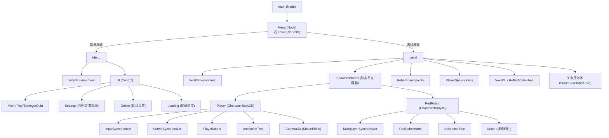
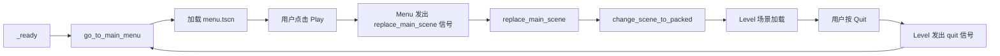
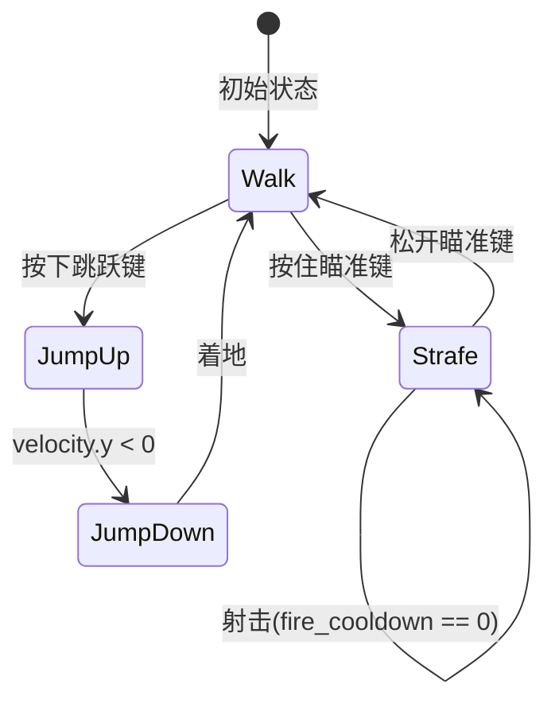
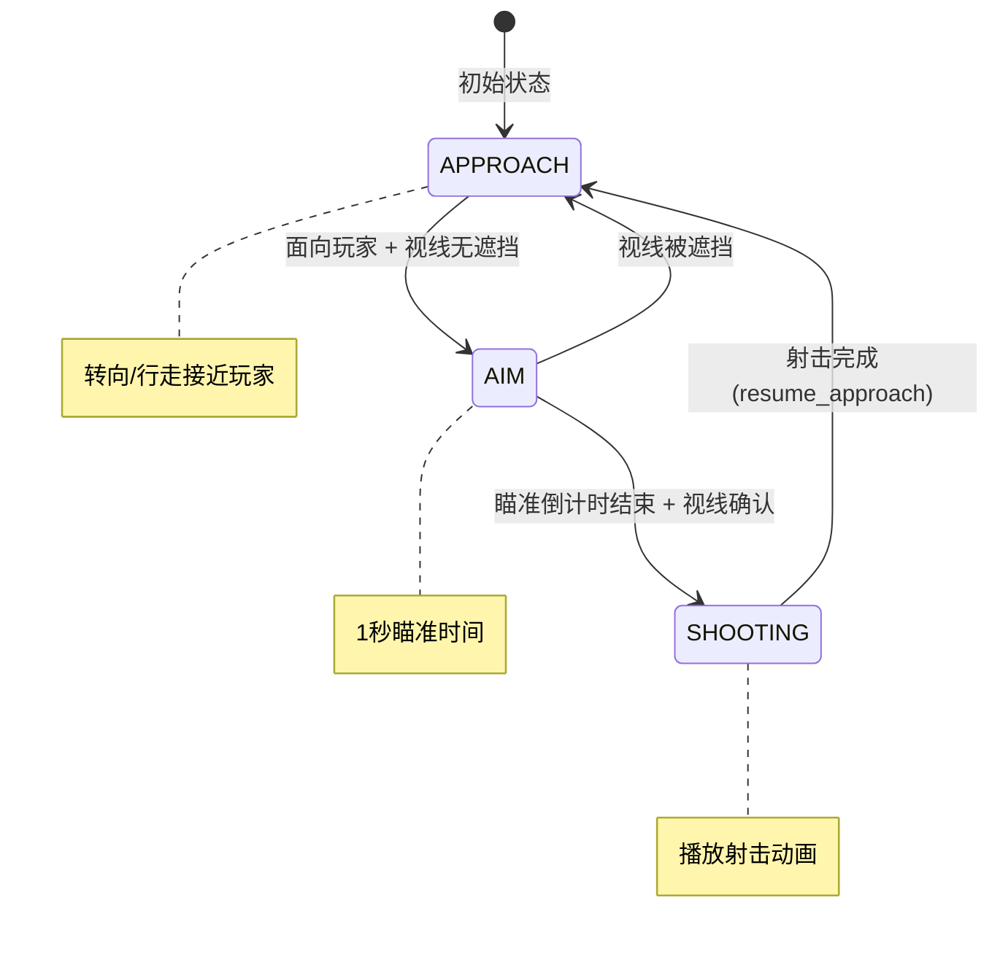
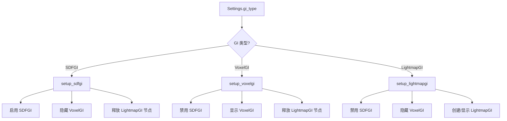
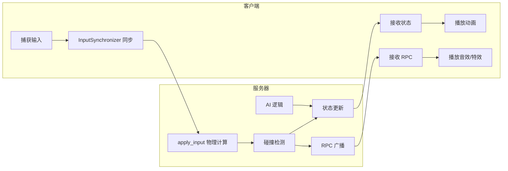
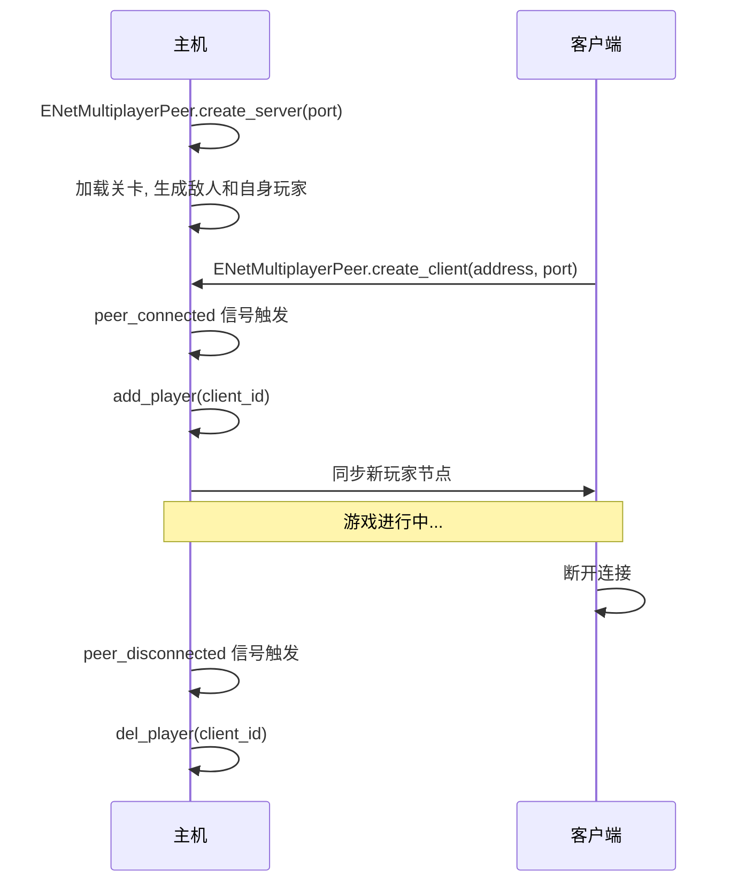
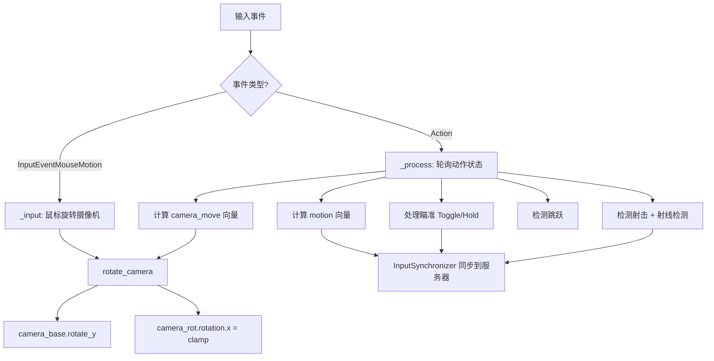

> **GodotBuddy 分析报告**
> 
> 👤 分析者: shuchangli-PC6 | 🤖 模式: agent
> 📂 项目: ThirdPersonShooter-TPS-Demo | 🎮 引擎: Godot 4.6
> 📊 规模: 15 脚本 / 1585 行代码 / 17 场景
> 📁 路径: `D:\Project\Godot\ThirdPersonShooter(tps)Demo`
> 🕐 生成时间: 2026-04-06 13:14:15

---
# Third Person Shooter (TPS) Demo — GodotBuddy 项目分析报告

> **一句话总结**：一个基于 Godot 4.6 的高质量第三人称射击 Demo，具备完整的多人联机架构、丰富的图形设置系统和精良的视觉效果。

---

**分析时间**: 2026-04-06  
**分析工具**: GodotBuddy  
**项目目录**: `D:\Project\Godot\ThirdPersonShooter(tps)Demo`

---

## 目录

1. [项目概览](#1-项目概览)
2. [架构分析](#2-架构分析)
3. [核心系统分析](#3-核心系统分析)
4. [网络/多人游戏架构](#4-网络多人游戏架构)
5. [输入系统分析](#5-输入系统分析)
6. [渲染和视觉效果](#6-渲染和视觉效果)
7. [音频系统](#7-音频系统)
8. [代码质量评估](#8-代码质量评估)
9. [改进建议](#9-改进建议)
10. [总结](#10-总结)

---

## 1. 项目概览

### 基本信息

| 属性 | 值 |
|------|-----|
| **项目名称** | Third Person Shooter (TPS) Demo |
| **项目描述** | Godot Third Person Shooter with high quality assets and lighting |
| **引擎版本** | Godot 4.6 |
| **项目类型** | 3D 第三人称射击游戏 |
| **主场景** | `res://main/main.tscn` |

### 项目规模统计

| 指标 | 数量 |
|------|------|
| 总文件数 | 112 |
| GDScript 文件 | 15 |
| 场景文件 (.tscn) | 17 |
| 资源文件 | 73 |
| 着色器文件 | 7 |
| 总代码行数 | 1,585 |
| 总函数数 | 78 |
| 总信号数 | 3 |
| 总导出变量数 | 23 |

### 核心玩法

这是一个第三人称射击（TPS）Demo 项目，玩家控制一个机器人角色在科幻风格的关卡中移动、瞄准和射击。关卡中有红色机器人敌人（Red Robot），它们会自动检测玩家、瞄准并发射激光。项目支持单人和多人联机模式（通过 ENet），并提供了极为丰富的图形设置选项，涵盖分辨率缩放、GI 类型、抗锯齿、后处理等多个维度。

---

## 2. 架构分析

### 2.1 项目目录结构

```
ThirdPersonShooter(tps)Demo/
├── main/                    # 主入口场景和脚本
│   ├── main.tscn
│   └── main.gd
├── menu/                    # 主菜单和设置系统
│   ├── menu.tscn
│   ├── menu.gd
│   └── settings.gd          # Autoload 全局设置管理器
├── player/                  # 玩家系统
│   ├── player.tscn
│   ├── player.gd
│   ├── player_input.gd
│   ├── camera_noise_shake_effect.gd
│   └── bullet/
│       ├── bullet.tscn
│       └── bullet.gd
├── enemies/                 # 敌人系统
│   └── red_robot/
│       ├── red_robot.tscn
│       ├── red_robot.gd
│       ├── laser/impact_effect/
│       │   ├── impact_effect.tscn
│       │   └── blast.gd
│       └── parts/
│           ├── part.gd
│           └── part_disappear_effect/
│               ├── part_disappear.tscn
│               └── part_disappear.gd
├── door/                    # 交互物体
│   ├── door.tscn
│   └── door.gd
├── level/                   # 关卡系统
│   ├── level.tscn
│   ├── level.gd
│   ├── debug.gd
│   ├── forklift/
│   │   ├── flying_forklift.tscn
│   │   └── flying_forklift.gd
│   └── geometry/scenes/     # 关卡几何体和碰撞
│       ├── collision/
│       ├── core.tscn
│       ├── lights.tscn
│       ├── props.tscn
│       └── structure.tscn
└── default_env.tres         # 默认环境资源
```

项目采用**按功能模块分目录**的组织方式，每个功能模块（玩家、敌人、关卡、菜单）独立成目录，场景文件和脚本文件就近放置，结构清晰合理。

### 2.2 场景树层级关系



### 2.3 Autoload 全局管理器分析

项目仅注册了一个 Autoload：

- **Settings** (`res://menu/settings.gd`)

`Settings` 是一个全局单例，负责：
1. **配置文件管理**：使用 `ConfigFile` 读写 `user://settings.ini`
2. **默认值初始化**：通过 `DEFAULTS` 字典定义所有图形设置的默认值
3. **图形设置应用**：`apply_graphics_settings()` 方法统一应用所有渲染相关设置
4. **全屏切换**：监听 `toggle_fullscreen` 输入事件

```gdscript
# settings.gd 核心结构
var DEFAULTS := {
    video = {
        display_mode = Window.MODE_EXCLUSIVE_FULLSCREEN,
        vsync = DisplayServer.VSYNC_ENABLED,
        max_fps = 0,
        resolution_scale = 1.0,
        scale_filter = Viewport.SCALING_3D_MODE_FSR2,
    },
    rendering = {
        taa = false, msaa = Viewport.MSAA_DISABLED, fxaa = false,
        shadow_mapping = true, gi_type = GIType.VOXEL_GI,
        gi_quality = GIQuality.LOW, ssao_quality = RenderingServer.ENV_SSAO_QUALITY_MEDIUM,
        ssil_quality = -1, bloom = true, volumetric_fog = true,
    },
}
```

### 2.4 自定义类（class_name）体系

| 类名 | 文件 | 继承 | 用途 |
|------|------|------|------|
| `Player` | `player/player.gd` | `CharacterBody3D` | 玩家角色控制器 |
| `PlayerInputSynchronizer` | `player/player_input.gd` | `MultiplayerSynchronizer` | 玩家输入同步器 |

自定义类数量较少（仅 2 个），主要用于类型检查（如 `body is Player`）和跨脚本引用。

---

## 3. 核心系统分析

### 3.1 场景管理系统

**文件**: `main/main.gd` (33 行)

**职责**: 作为游戏的根节点，管理场景切换（菜单 ↔ 关卡）。

**设计模式**: 简单的场景管理器模式，通过信号驱动场景切换。

**关键流程**:



**核心代码**:

```gdscript
func change_scene_to_packed(resource: PackedScene) -> void:
    var node: Node = resource.instantiate()
    for child in get_children():
        remove_child(child)
        child.queue_free()
    add_child(node)
    if node.has_signal(&"quit"):
        node.quit.connect(go_to_main_menu)
    if node.has_signal(&"replace_main_scene"):
        node.replace_main_scene.connect(replace_main_scene)
```

**设计亮点**: 使用信号动态连接（`has_signal` 检查），使场景管理器与具体场景解耦。初始化时重置多人游戏对等体为 `OfflineMultiplayerPeer`，确保从联机返回菜单时状态正确。

### 3.2 玩家系统

**文件**: `player/player.gd` (211 行)

**职责**: 玩家角色的物理移动、动画状态机、射击和受击处理。

**状态管理**: 通过 `Animations` 枚举管理动画状态：

```gdscript
enum Animations {
    JUMP_UP,
    JUMP_DOWN,
    STRAFE,   # 瞄准时的横移
    WALK,     # 普通行走/待机
}
```

**核心逻辑流程**:



**关键设计**:

1. **Root Motion 驱动移动**: 角色移动完全由 AnimationTree 的 Root Motion 驱动，而非直接设置速度：
   ```gdscript
   root_motion = Transform3D(animation_tree.get_root_motion_rotation(), 
                              animation_tree.get_root_motion_position())
   orientation *= root_motion
   var h_velocity: Vector3 = orientation.origin / delta
   ```

2. **服务器权威**: 物理处理仅在服务器端执行，客户端仅播放动画：
   ```gdscript
   func _physics_process(delta: float) -> void:
       if multiplayer.is_server():
           apply_input(delta)
       else:
           animate(current_animation, delta)
   ```

3. **掉落重生**: 当玩家 Y 坐标低于 -40 时自动传送回初始位置：
   ```gdscript
   if transform.origin.y < -40.0:
       transform.origin = initial_position
   ```

### 3.3 玩家输入系统

**文件**: `player/player_input.gd` (142 行)

**职责**: 捕获玩家输入、管理摄像机旋转、处理瞄准逻辑。

**设计模式**: 继承 `MultiplayerSynchronizer`，将输入数据作为同步属性自动同步到服务器。

**瞄准机制（Toggle/Hold 混合模式）**:

```gdscript
const AIM_HOLD_THRESHOLD: float = 0.4
// 短按（< 0.4秒）= 切换瞄准模式
// 长按（>= 0.4秒）= 按住瞄准模式
```

这是一个非常用户友好的设计，同时支持触控板用户（短按切换）和传统鼠标用户（长按保持）。

**射击射线检测**:

```gdscript
if shooting:
    var ch_pos = crosshair.position + crosshair.size * 0.5
    var ray_from = camera_camera.project_ray_origin(ch_pos)
    var ray_dir = camera_camera.project_ray_normal(ch_pos)
    var col = get_parent().get_world_3d().direct_space_state.intersect_ray(
        PhysicsRayQueryParameters3D.create(ray_from, ray_from + ray_dir * 1000, 0b11, ...))
```

从准星中心发射射线，碰撞掩码 `0b11`（Layer 1: Level + Layer 2: Player），排除自身。

**掉落黑屏效果**: 当玩家掉出地图时，通过 `ColorRect` 渐变实现黑屏过渡：

```gdscript
if player_transform.origin.y < -17.0:
    color_rect.modulate.a = minf((-17.0 - player_transform.origin.y) / 15.0, 1.0)
```

### 3.4 敌人 AI 系统

**文件**: `enemies/red_robot/red_robot.gd` (279 行)

**职责**: 红色机器人敌人的 AI 行为、射击、受击和死亡处理。

**状态机**:



**AI 行为流程**:

1. **检测阶段**: 通过 `Area3D` 的 `body_entered/exited` 信号检测玩家进入/离开感知范围
2. **接近阶段 (APPROACH)**: 面向玩家方向转身，使用角度容差判断是否面向玩家
3. **瞄准阶段 (AIM)**: 射线检测确认视线无遮挡，1 秒瞄准倒计时
4. **射击阶段 (SHOOTING)**: 播放射击动画，发射激光射线

**激光射击实现**:

```gdscript
func shoot() -> void:
    var ray_origin: Vector3 = ray_from.global_transform.origin
    var ray_dir: Vector3 = -gt.basis.z
    var col = get_world_3d().direct_space_state.intersect_ray(...)
    if not col.is_empty():
        max_dist = ray_origin.distance_to(col.position)
    _clip_ray(max_dist)  // 通过 Shader 参数裁剪射线网格
```

激光通过 `MeshInstance3D` + Shader 的 `clip` 参数实现可视化，而非粒子系统，这是一个高效的设计。

**死亡效果**: 机器人死亡时分解为多个 `RigidBody3D` 部件（头部、护盾），各部件独立物理模拟后逐渐消失：

```gdscript
death_shield1.explode()
death_shield2.explode()
death_head.explode()
```

### 3.5 子弹系统

**文件**: `player/bullet/bullet.gd` (51 行)

**职责**: 玩家发射的子弹物理移动和碰撞处理。

**关键设计**:

- 使用 `CharacterBody3D` + `move_and_collide()` 实现子弹移动，而非 `RigidBody3D`，确保精确碰撞检测
- 5 秒生命周期自动销毁
- 碰撞时调用目标的 `hit()` RPC 方法
- 爆炸时动态启用阴影以增强视觉效果：

```gdscript
func explode() -> void:
    animation_player.play(&"explode")
    if Settings.config_file.get_value("rendering", "shadow_mapping"):
        omni_light.shadow_enabled = true
```

### 3.6 摄像机震动系统

**文件**: `player/camera_noise_shake_effect.gd` (61 行)

**职责**: 基于 Perlin 噪声的摄像机震动效果。

**设计模式**: Trauma-based Camera Shake（创伤值驱动的摄像机震动），这是游戏开发中的经典模式。

**核心算法**:

```gdscript
func apply_shake(delta: float) -> void:
    time += delta * SPEED * 5000.0
    var shake: float = trauma * trauma  // 二次方衰减，更自然
    var yaw: float = MAX_YAW * shake * get_noise_value(noise_seed, time)
    var pitch: float = MAX_PITCH * shake * get_noise_value(noise_seed + 1, time)
    var roll: float = MAX_ROLL * shake * get_noise_value(noise_seed + 2, time)
    rotation = start_rotation + Vector3(pitch, yaw, roll)
```

- 使用 `FastNoiseLite` 生成平滑的随机值
- `trauma²` 二次方映射使震动更自然（小创伤几乎无感，大创伤剧烈）
- 射击时添加 0.35 创伤值，受击时添加 0.75 创伤值

### 3.7 关卡管理系统

**文件**: `level/level.gd` (127 行)

**职责**: 关卡初始化、GI 配置、玩家/敌人生成管理。

**GI 切换系统**: 支持三种全局光照方案的运行时切换：



**敌人重生机制**:

```gdscript
func spawn_robot(spawn_point) -> void:
    var robot = RedRobot.instantiate()
    robot.transform = spawn_point.transform
    robot.exploded.connect(_respawn_robot.bind(spawn_point))
    spawned_nodes.add_child(robot, true)

func _respawn_robot(spawn_point) -> void:
    await get_tree().create_timer(15.0).timeout
    spawn_robot(spawn_point)
```

敌人死亡后 15 秒在原出生点重生，通过信号连接实现自动循环。

---

## 4. 网络/多人游戏架构

### 4.1 网络同步策略

项目采用 **服务器权威（Server-Authoritative）** 架构，使用 Godot 4 的高级多人游戏 API。

**同步组件**:

| 组件 | 类型 | 用途 |
|------|------|------|
| `Player/ServerSynchronizer` | MultiplayerSynchronizer | 服务器 → 客户端：同步位置、动画状态 |
| `Player/InputSynchronizer` | MultiplayerSynchronizer (PlayerInputSynchronizer) | 客户端 → 服务器：同步输入数据 |
| `RedRobot/MultiplayerSynchronizer` | MultiplayerSynchronizer | 服务器 → 客户端：同步敌人状态 |
| `Bullet/MultiplayerSynchronizer` | MultiplayerSynchronizer | 服务器 → 客户端：同步子弹位置 |

### 4.2 服务器-客户端职责划分



**服务器职责**:
- 所有物理计算（`_physics_process` 中的 `apply_input`）
- 子弹碰撞检测和伤害判定
- 敌人 AI 状态机运行
- 玩家/敌人生成和销毁
- 敌人重生计时

**客户端职责**:
- 输入捕获和摄像机控制
- 动画播放（基于同步的 `current_animation`）
- 音效和粒子特效播放（通过 RPC）

### 4.3 RPC 使用分析

| RPC 函数 | 所在脚本 | 模式 | 用途 |
|----------|---------|------|------|
| `jump()` | player.gd | `call_local` | 跳跃音效和动画 |
| `land()` | player.gd | `call_local` | 着地音效和动画 |
| `shoot()` | player.gd | `call_local` | 射击特效和音效 |
| `hit()` | player.gd | `call_local` | 受击摄像机震动 |
| `add_camera_shake_trauma()` | player.gd | `call_local` | 摄像机震动 |
| `hit()` | red_robot.gd | `call_local` | 敌人受击/死亡 |
| `play_shoot()` | red_robot.gd | `call_local` | 敌人射击动画 |
| `explode()` | bullet.gd | `call_local` | 子弹爆炸效果 |
| `destroy()` | part.gd | `call_local` | 部件消失效果 |
| `jump()` | player_input.gd | `call_local` | 跳跃输入同步 |

所有 RPC 均使用 `call_local` 模式，确保服务器和客户端都执行相同的视觉/音频反馈。

### 4.4 网络连接流程



### 4.5 Headless 服务器支持

项目支持无头服务器模式：

```gdscript
# main.gd
if DisplayServer.get_name() == "headless":
    Engine.max_fps = 60

# menu.gd
if DisplayServer.get_name() == "headless":
    _on_host_pressed.call_deferred()
```

无头模式下自动限制帧率为 60 FPS 并自动开始托管。

---

## 5. 输入系统分析

### 5.1 输入映射配置

| 动作名称 | 用途 | 类型 |
|----------|------|------|
| `move_left` | 左移 | 移动 |
| `move_right` | 右移 | 移动 |
| `move_forward` | 前进 | 移动 |
| `move_back` | 后退 | 移动 |
| `jump` | 跳跃 | 动作 |
| `aim` | 瞄准 | 动作 |
| `shoot` | 射击 | 动作 |
| `quit` | 退出到菜单 | 系统 |
| `view_left` | 视角左转 | 摄像机 |
| `view_right` | 视角右转 | 摄像机 |
| `view_up` | 视角上仰 | 摄像机 |
| `view_down` | 视角下俯 | 摄像机 |
| `toggle_fullscreen` | 切换全屏 | 系统 |
| `toggle_debug` | 切换调试信息 | 系统 |

### 5.2 输入处理流程



### 5.3 输入设备支持

- **键盘鼠标**: 通过 `InputEventMouseMotion` 处理鼠标视角控制，`Input.MOUSE_MODE_CAPTURED` 锁定鼠标
- **手柄/控制器**: 通过 `view_left/right/up/down` 动作支持摇杆视角控制，使用 `CAMERA_CONTROLLER_ROTATION_SPEED` 独立控制手柄灵敏度
- **瞄准时降速**: 瞄准状态下鼠标灵敏度降低 25%（`*= 0.75`），手柄灵敏度降低 50%（`*= 0.5`）

### 5.4 摄像机控制

摄像机使用三层节点结构：

```
camera_base (Node3D) — Y 轴旋转（水平）
└── camera_rot (Node3D) — X 轴旋转（垂直，限制 -89.9° ~ 70°）
    └── camera_camera (Camera3D) — 实际摄像机 + 震动效果
```

垂直角度限制为 `-89.9°` 到 `70°`，避免万向锁问题和不自然的仰角。

---

## 6. 渲染和视觉效果

### 6.1 渲染管线配置

| 配置项 | 值 | 说明 |
|--------|-----|------|
| 视口分辨率 | 1920×1080 | 默认全屏 |
| 3D 缩放模式 | FSR2 (mode=2) | 默认使用 AMD FSR 2.0 |
| 各向异性过滤 | 4x | 纹理过滤质量 |
| 去色带 | 启用 | 减少色带伪影 |
| 遮挡剔除 | 启用 | 性能优化 |
| 阴影图集大小 | 2048 (桌面) / 1024 (移动) | 阴影质量 |
| 拉伸模式 | canvas_items / expand | 自适应分辨率 |

### 6.2 光照方案

项目支持三种 GI 方案的运行时切换，这是一个非常全面的设计：

| GI 类型 | 特点 | 质量等级 |
|---------|------|---------|
| **LightmapGI** | 预烘焙光照贴图，最高质量静态 GI | 禁用/启用 |
| **VoxelGI** | 实时体素 GI，支持动态光源 | 低/高 |
| **SDFGI** | 有符号距离场 GI，大场景实时 GI | 低(32 rays)/高(96 rays) |

**LightmapGI 动态创建**:

```gdscript
func setup_lightmapgi() -> void:
    if lightmap_gi == null:
        var new_gi := LightmapGI.new()
        new_gi.light_data = load("res://level/level.lmbake")
        lightmap_gi = new_gi
        add_child(new_gi)
```

注意：LightmapGI 节点会覆盖 SDFGI 和 VoxelGI（即使隐藏），因此切换到其他 GI 类型时必须 `queue_free()` 释放 LightmapGI 节点。

### 6.3 抗锯齿选项

项目提供了极为丰富的抗锯齿组合：

- **TAA** (Temporal Anti-Aliasing)
- **MSAA** (2x / 4x / 8x)
- **FXAA** (Fast Approximate Anti-Aliasing)
- **FSR 1.0** (空间升采样)
- **FSR 2.0** (时间升采样，含内置 TAA)
- **MetalFX Spatial/Temporal** (Apple Metal 专用)

### 6.4 分辨率缩放

| 预设 | 缩放比例 | 等效分辨率 (1080p) |
|------|---------|-------------------|
| Ultra Performance | 33% | ~360p |
| Performance | 50% | 540p |
| Balanced | 59% | ~636p |
| Quality | 67% | ~720p |
| Ultra Quality | 77% | ~831p |
| Native | 100% | 1080p |

### 6.5 粒子效果

项目大量使用粒子系统：

| 效果 | 类型 | 位置 |
|------|------|------|
| 枪口火焰 | CPUParticles3D | 玩家射击 |
| 射击粒子 | CPUParticles3D | 玩家射击 |
| 子弹爆炸 | GPUParticles3D | 子弹碰撞 |
| 激光冲击 | CPUParticles3D (5层) | 敌人激光命中 |
| 激光余烬 | CPUParticles3D | 敌人激光射线 |
| 蓄力粒子 | CPUParticles3D | 敌人瞄准 |
| 部件消失 | CPUParticles3D | 敌人死亡 |
| 分离火花 | CPUParticles3D | 敌人死亡 |
| 核心等离子 | CPUParticles3D (4层) | 关卡核心装饰 |
| 叉车粒子 | CPUParticles3D (4个) | 飞行叉车 |

子弹爆炸使用 `GPUParticles3D`（GPU 加速），其余均使用 `CPUParticles3D`（兼容性更好）。

### 6.6 着色器

项目包含 7 个着色器文件，主要用于：
- 激光射线的裁剪效果（`clip` 参数）
- 敌人部件消失的溶解效果（`emission_cutout` 参数）

---

## 7. 音频系统

### 7.1 音效管理方式

项目采用**节点内嵌音频播放器**的方式管理音效，没有使用独立的音频管理器。

**玩家音效** (`player.tscn`):

```
SoundEffects (Node)
├── Jump (AudioStreamPlayer)
├── Land (AudioStreamPlayer)
└── Shoot (AudioStreamPlayer)
```

**敌人音效** (`red_robot.tscn`):

```
SoundEffects (Node)
├── Explosion (AudioStreamPlayer3D)
└── Hit (AudioStreamPlayer3D)
```

**菜单音效** (`menu.tscn`):

```
SoundEffects (Node)
└── Step (AudioStreamPlayer)
```

### 7.2 音频特点

- 玩家音效使用 `AudioStreamPlayer`（2D，非空间化），因为是第一人称听觉
- 敌人音效使用 `AudioStreamPlayer3D`（3D 空间化），支持距离衰减
- 门和子弹也使用 `AudioStreamPlayer3D`
- 未发现自定义音频总线配置，使用默认 Master 总线

---

## 8. 代码质量评估

### 8.1 GDScript 编码规范

**优点**:
- ✅ 类型注解使用良好：函数参数和返回值大多有类型标注
- ✅ 常量命名使用 `UPPER_SNAKE_CASE`
- ✅ 使用 `StringName`（`&"action_name"`）优化字符串比较性能
- ✅ `@onready` 变量集中声明在类顶部
- ✅ 信号使用 `signal` 关键字声明

**不足**:
- ⚠️ 部分函数缺少返回类型注解（如 `spawn_robot`、`_respawn_robot`）
- ⚠️ `menu.gd` 中大量 `@onready` 变量（60+），可考虑分组或使用字典管理
- ⚠️ 部分魔法数字未提取为常量（如 `red_robot.gd` 中的 `13.0` 创伤值、`-40.0` 重生高度）

### 8.2 代码组织和模块化

**优点**:
- ✅ 按功能模块分目录，结构清晰
- ✅ 输入处理与角色逻辑分离（`PlayerInputSynchronizer` vs `Player`）
- ✅ 设置系统独立为 Autoload，全局可访问
- ✅ 敌人部件效果独立为子场景

**不足**:
- ⚠️ `menu.gd` 承担了过多职责（445 行），包含 UI 初始化、设置读写、联机逻辑、加载管理
- ⚠️ 缺少独立的游戏状态管理器（GameManager）
- ⚠️ 没有使用资源类（`Resource`）来管理配置数据

### 8.3 潜在的性能问题

1. **`preload` 在函数内使用**:
   ```gdscript
   # player.gd - apply_input() 中
   var bullet = preload("res://player/bullet/bullet.tscn").instantiate()
   ```
   虽然 `preload` 在编译时加载不会造成运行时开销，但在高频调用的函数中实例化场景可能导致帧率波动。建议使用对象池。

2. **敌人激光射线每帧更新 Shader 参数**:
   ```gdscript
   func _clip_ray(length: float) -> void:
       ray_mesh.get_surface_override_material(0).set_shader_parameter("clip", length + mesh_offset)
   ```
   每帧获取材质并设置参数，虽然开销不大，但可以缓存材质引用。

3. **`menu.gd` 中 60+ 个 `@onready` 节点引用**: 初始化时大量节点查找，但由于只在菜单加载时执行一次，影响有限。

4. **`blast.gd` 每帧获取摄像机**:
   ```gdscript
   @onready var camera: Camera3D = get_tree().get_root().get_camera_3d()
   ```
   在 `_process` 中使用，但引用在 `_ready` 时获取，这是合理的。不过需注意多人游戏中摄像机可能为 null。

### 8.4 潜在的 Bug 和安全隐患

1. **⚠️ 敌人激光对玩家的伤害未实现**:
   ```gdscript
   # red_robot.gd - shoot()
   if col.collider == player:
       pass # Kill.
   ```
   `pass # Kill.` 表明伤害逻辑尚未实现，但 `add_camera_shake_trauma(13.0)` 的创伤值异常大（正常射击为 0.35），可能是临时占位。

2. **⚠️ SSAO 设置逻辑错误**:
   ```gdscript
   # settings.gd - apply_graphics_settings()
   if Settings.config_file.get_value("rendering", "ssao_quality") == -1:
       environment.ssao_enabled = false
   if Settings.config_file.get_value("rendering", "ssao_quality") == RenderingServer.ENV_SSAO_QUALITY_MEDIUM:
       # ...
   else:  # 这个 else 对应的是 MEDIUM 的 if，不是 -1 的 if
       environment.ssao_enabled = true
       RenderingServer.environment_set_ssao_quality(RenderingServer.ENV_SSAO_QUALITY_MEDIUM, ...)
   ```
   第二个 `if` 应该是 `elif`，否则当 `ssao_quality == -1` 时，会先禁用 SSAO，然后又被 `else` 分支重新启用。

3. **⚠️ 门只能打开不能关闭**:
   ```gdscript
   func _on_door_body_entered(body: Node3D) -> void:
       if not open and body is Player:
           animation_player.play(&"doorsimple_opening")
           open = true
   ```
   没有 `body_exited` 处理，门一旦打开就永远保持打开状态。

4. **⚠️ `flying_forklift.gd` 中的 `randomize()` 调用**:
   ```gdscript
   randomize()
   ```
   `randomize()` 在 Godot 4 中已被弃用（默认自动随机化种子），应移除。

5. **⚠️ 多人游戏中 `blast.gd` 的摄像机引用**:
   ```gdscript
   @onready var camera: Camera3D = get_tree().get_root().get_camera_3d()
   ```
   在服务器端可能没有活跃的摄像机，`camera` 可能为 null。虽然 `_process` 中有 `is_instance_valid(camera)` 检查，但 `@onready` 赋值时不会报错。

### 8.5 内存管理和资源加载策略

**优点**:
- ✅ 使用 `preload` 预加载常用场景（子弹、敌人、爆炸效果）
- ✅ 关卡使用 `ResourceLoader.load_threaded_request` 异步加载，配合进度条
- ✅ 死亡部件有生命周期管理（`lifetime` + `queue_free()`）
- ✅ 子弹有 5 秒超时自动销毁
- ✅ 敌人死亡后 10 秒自动释放

**不足**:
- ⚠️ `blast.gd` 中爆炸效果直接添加到根节点：
  ```gdscript
  get_tree().get_root().add_child(blast)
  ```
  应添加到关卡的 `SpawnedNodes` 容器中，便于统一管理。

- ⚠️ 没有使用对象池（Object Pool）管理频繁创建/销毁的对象（子弹、爆炸效果）

---

## 9. 改进建议

### 9.1 架构优化建议

1. **拆分 `menu.gd`**: 将 445 行的菜单脚本拆分为：
   - `main_menu.gd` — 主菜单按钮逻辑
   - `settings_ui.gd` — 设置界面 UI 绑定
   - `online_menu.gd` — 联机设置逻辑
   - `loading_screen.gd` — 加载进度管理

2. **引入 GameManager Autoload**: 管理游戏全局状态（当前关卡、玩家数据、游戏模式等），与 Settings 分离。

3. **使用 Resource 类管理配置**: 将设置数据封装为自定义 `Resource`，利用 Godot 的序列化机制替代 `ConfigFile`。

4. **统一节点容器管理**: 所有动态生成的节点（子弹、爆炸效果、敌人部件）都应添加到统一的容器节点中。

### 9.2 性能优化建议

1. **实现子弹对象池**: 子弹是高频创建/销毁的对象，使用对象池可减少 GC 压力和实例化开销。

2. **缓存材质引用**: `red_robot.gd` 中的 `_clip_ray` 每次调用都获取材质，应在 `_ready` 中缓存。

3. **优化敌人 AI 射线检测**: 当前每帧都进行射线检测，可以降低检测频率（如每 3 帧一次）或使用 `RayCast3D` 节点替代 `direct_space_state`。

4. **移除冗余的 `randomize()` 调用**: Godot 4 默认自动随机化，`main.gd` 和 `flying_forklift.gd` 中的 `randomize()` 可以移除。

### 9.3 代码质量改进建议

1. **修复 SSAO 设置的 if/elif 逻辑错误**（见 8.4 第 2 点）

2. **提取魔法数字为常量**:
   ```gdscript
   # 建议
   const RESPAWN_HEIGHT: float = -40.0
   const ROBOT_RESPAWN_DELAY: float = 15.0
   const ROBOT_DEATH_CLEANUP_DELAY: float = 10.0
   const LASER_TRAUMA_AMOUNT: float = 13.0  # 或修正为合理值
   ```

3. **完善类型注解**: 为所有函数添加返回类型和参数类型注解。

4. **实现敌人激光伤害**: 完成 `red_robot.gd` 中 `pass # Kill.` 的伤害逻辑。

5. **添加代码注释**: 部分复杂逻辑（如 Root Motion 应用、瞄准角度计算）缺少解释性注释。

### 9.4 最佳实践推荐

1. **使用 `@export_group` 和 `@export_category`** 组织导出变量，提升编辑器体验。

2. **使用 `class_name` 注册更多自定义类型**: 如 `RedRobot`、`Bullet` 等，便于类型检查和编辑器集成。

3. **使用 Godot 4 的 Typed Arrays**: 如 `Array[Player]` 替代无类型数组。

4. **考虑使用状态机框架**: 为敌人 AI 和玩家状态使用更正式的状态机模式（如 State 节点模式），提升可维护性。

5. **添加单元测试**: 使用 GdUnit4 等测试框架为核心逻辑编写测试。

---

## 10. 总结

### 项目整体评价

这是一个**高质量的 Godot 4 第三人称射击 Demo**，展示了 Godot 引擎在 3D 游戏开发中的多项核心能力。项目代码结构清晰，多人游戏架构设计合理，图形设置系统极为全面。作为一个技术演示项目，它很好地展示了 Root Motion 动画、服务器权威网络架构、多种 GI 方案切换、FSR2 升采样等高级特性。

### 技术亮点

1. 🌟 **全面的图形设置系统**: 支持 3 种 GI 类型、6 种分辨率缩放预设、5 种缩放滤镜（含 MetalFX）、4 种抗锯齿方案的自由组合，堪称 Godot 图形设置的教科书级实现。

2. 🌟 **优雅的多人游戏架构**: 使用 `MultiplayerSynchronizer` + RPC 的混合同步策略，输入同步器继承自 `MultiplayerSynchronizer` 的设计非常巧妙。

3. 🌟 **Root Motion 驱动的角色移动**: 动画驱动物理移动，使角色动作更加自然流畅。

4. 🌟 **Trauma-based 摄像机震动**: 使用 Perlin 噪声 + 二次方创伤衰减，效果专业。

5. 🌟 **敌人死亡分解效果**: 物理驱动的部件分离 + Shader 溶解消失，视觉效果精良。

6. 🌟 **Headless 服务器支持**: 支持无头模式运行专用服务器，具备生产部署能力。

### 主要风险点

1. ⚠️ **敌人激光伤害未实现** (`pass # Kill.`)，核心游戏玩法不完整
2. ⚠️ **SSAO 设置逻辑 Bug**，可能导致设置不生效
3. ⚠️ **`menu.gd` 过于臃肿** (445 行)，维护成本高
4. ⚠️ **缺少对象池机制**，高频射击场景可能出现性能问题
5. ⚠️ **爆炸效果添加到根节点**，可能导致场景切换时残留

### 推荐优先改进项

| 优先级 | 改进项 | 原因 |
|--------|--------|------|
| 🔴 高 | 修复 SSAO if/elif 逻辑 Bug | 影响渲染设置正确性 |
| 🔴 高 | 实现敌人激光伤害逻辑 | 核心玩法缺失 |
| 🟡 中 | 拆分 menu.gd | 提升可维护性 |
| 🟡 中 | 统一动态节点容器管理 | 避免内存泄漏 |
| 🟡 中 | 移除废弃的 randomize() 调用 | 代码整洁 |
| 🟢 低 | 实现子弹对象池 | 性能优化 |
| 🟢 低 | 缓存敌人激光材质引用 | 微优化 |
| 🟢 低 | 提取魔法数字为常量 | 代码可读性 |

---

*报告由 GodotBuddy 自动生成 — 2026-04-06*
