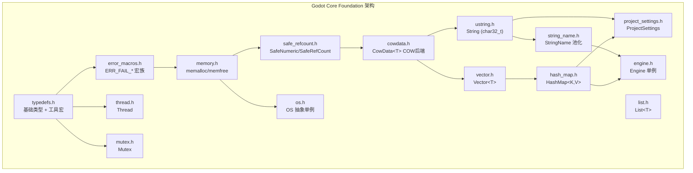
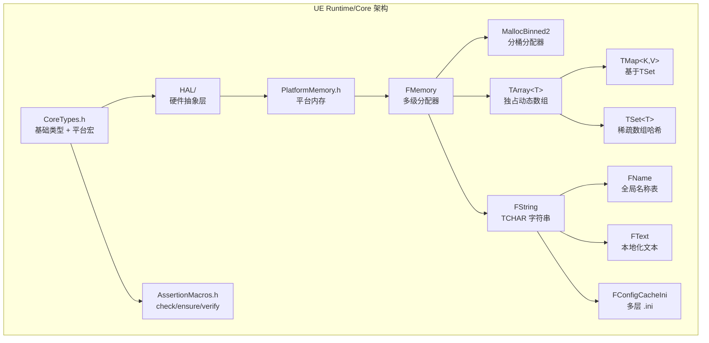

# 核心基础层 (Core Foundation) — Godot vs UE 深度对比分析

> **一句话总结**：Godot 用 COW（写时复制）+ 轻量宏实现了 UE 用 RTTI + 多级分配器 + 智能指针才能达到的核心基础设施，代价是牺牲了多线程写入性能和内存分配的精细控制。

---

## 目录

- [第 1 章：模块概览 — "UE 程序员 30 秒速览"](#第-1-章模块概览--ue-程序员-30-秒速览)
- [第 2 章：架构对比 — "同一个问题，两种解法"](#第-2-章架构对比--同一个问题两种解法)
- [第 3 章：核心实现对比 — "代码层面的差异"](#第-3-章核心实现对比--代码层面的差异)
- [第 4 章：UE → Godot 迁移指南](#第-4-章ue--godot-迁移指南)
- [第 5 章：性能对比](#第-5-章性能对比)
- [第 6 章：总结 — "一句话记住"](#第-6-章总结--一句话记住)

---

## 第 1 章：模块概览 — "UE 程序员 30 秒速览"

### 这个模块做什么？

Godot 的 `core/` 目录是整个引擎的地基，提供基础类型定义、内存管理、字符串处理、容器模板、OS 抽象、线程同步、错误处理和配置系统。它对应 UE 的 `Runtime/Core` 模块（包含 `Containers/`、`HAL/`、`Misc/`、`Templates/` 等子目录）。

### 核心类/结构体列表

| # | Godot 类/结构体 | 源码路径 | UE 对应物 | 说明 |
|---|----------------|----------|-----------|------|
| 1 | `String` | `core/string/ustring.h` | `FString` | 主字符串类，基于 COW |
| 2 | `StringName` | `core/string/string_name.h` | `FName` | 池化字符串，指针比较 |
| 3 | `Vector<T>` | `core/templates/vector.h` | `TArray<T>` | 动态数组，COW 语义 |
| 4 | `HashMap<K,V>` | `core/templates/hash_map.h` | `TMap<K,V>` | Robin Hood 哈希表 |
| 5 | `List<T>` | `core/templates/list.h` | `TDoubleLinkedList<T>` | 双向链表 |
| 6 | `CowData<T>` | `core/templates/cowdata.h` | *(无直接对应)* | COW 数据后端 |
| 7 | `Memory` (namespace) | `core/os/memory.h` | `FMemory` | 内存分配封装 |
| 8 | `OS` | `core/os/os.h` | `FGenericPlatformMisc` | OS 抽象层 |
| 9 | `Thread` | `core/os/thread.h` | `FRunnable` / `FRunnableThread` | 线程封装 |
| 10 | `Mutex` / `BinaryMutex` | `core/os/mutex.h` | `FCriticalSection` | 互斥锁 |
| 11 | `SafeRefCount` | `core/templates/safe_refcount.h` | `FThreadSafeCounter` | 原子引用计数 |
| 12 | `ProjectSettings` | `core/config/project_settings.h` | `GConfig` (`FConfigCacheIni`) | 项目配置系统 |
| 13 | `Engine` | `core/config/engine.h` | `GEngine` (`UEngine`) | 引擎全局单例 |
| 14 | `ERR_FAIL_COND` 宏族 | `core/error/error_macros.h` | `check`/`ensure`/`verify` | 错误处理宏 |

### Godot vs UE 概念速查表

| 概念 | Godot | UE | 关键差异 |
|------|-------|-----|---------|
| 主字符串 | `String` (char32_t, COW) | `FString` (TCHAR/wchar_t, 独占) | Godot 用 UTF-32 + COW；UE 用平台 wchar_t + 独占所有权 |
| 池化字符串 | `StringName` (引用计数) | `FName` (全局表 + 数字索引) | Godot 用链表 + refcount；UE 用分块表 + ComparisonIndex |
| 动态数组 | `Vector<T>` (COW) | `TArray<T>` (独占) | Godot 写时复制；UE 直接拥有内存 |
| 哈希表 | `HashMap<K,V>` (Robin Hood) | `TMap<K,V>` (TSparseArray) | Godot 开放寻址 + 链表保序；UE 基于 TSet + 稀疏数组 |
| 内存分配 | `memalloc`/`memfree` 宏 | `FMemory::Malloc`/`Free` | Godot 薄封装 C malloc；UE 多级分配器 (Binned2/Mimalloc) |
| 线程 | `Thread` (std::thread 封装) | `FRunnableThread` (平台抽象) | Godot 直接用 std::thread；UE 完整平台抽象层 |
| 互斥锁 | `Mutex` (std::recursive_mutex) | `FCriticalSection` (平台原生) | Godot 默认递归锁；UE 默认非递归 |
| 错误宏 | `ERR_FAIL_COND` (打印 + return) | `check` (断言 + crash) | Godot 优雅降级；UE 直接崩溃 |
| 配置系统 | `ProjectSettings` (单文件 .godot) | `GConfig` (多 .ini 分层) | Godot 单一配置源；UE 多层级覆盖 |
| 对象 new | `memnew(T)` 宏 | `NewObject<T>()` | Godot 宏封装 placement new；UE 走 UObject 工厂 |

---

## 第 2 章：架构对比 — "同一个问题，两种解法"

### 2.1 Godot Core 架构设计

Godot 的核心基础层采用**极简分层**设计，依赖关系清晰且层次扁平：



**核心设计特征**：
- **CowData 是基石**：`Vector<T>` 和 `String` 都构建在 `CowData<T>` 之上，共享同一套 COW 机制
- **宏驱动的错误处理**：不使用异常，通过 `ERR_FAIL_*` 宏实现"打印错误 + 优雅返回"
- **std 库直接复用**：`Mutex` 直接封装 `std::recursive_mutex`，`Thread` 封装 `std::thread`
- **单例模式普遍**：`OS`、`Engine`、`ProjectSettings` 都是全局单例

### 2.2 UE Core 架构设计

UE 的 `Runtime/Core` 模块采用**重度抽象 + 平台分层**设计：



### 2.3 关键架构差异分析

#### 差异 1：COW（写时复制）vs 独占所有权 — 设计哲学的根本分歧

Godot 的 `Vector<T>` 和 `String` 都基于 `CowData<T>`，采用**写时复制**语义。当你复制一个 `Vector` 时，实际上只是增加了引用计数，两个 `Vector` 共享同一块内存。只有当其中一个尝试写入时（调用 `ptrw()`），才会触发 `_copy_on_write()` 进行真正的内存拷贝。

```cpp
// Godot: core/templates/cowdata.h
_FORCE_INLINE_ T *ptrw() {
    // 写入前必须确保独占
    CRASH_COND(_copy_on_write());
    return _ptr;
}
```

UE 的 `TArray<T>` 则采用**独占所有权**模型。每个 `TArray` 实例拥有自己的内存，复制就是真正的深拷贝。这意味着 UE 在复制时更昂贵，但在写入时没有额外的引用计数检查开销。

这个差异反映了两个引擎的核心哲学：**Godot 优化"传递"场景**（函数参数、返回值、信号传递中大量的容器复制），而 **UE 优化"修改"场景**（游戏逻辑中频繁的容器写入操作）。对于 UE 程序员来说，这意味着在 Godot 中可以更放心地按值传递容器，但需要注意 `ptrw()` 调用可能触发隐式拷贝。

#### 差异 2：薄封装 vs 重度抽象 — 模块耦合方式

Godot 的 `Memory` 命名空间本质上是对 C 标准库 `malloc`/`realloc`/`free` 的薄封装，加上对齐分配和内存统计功能。整个内存系统只有一个分配路径。

```cpp
// Godot: core/os/memory.h
#define memalloc(m_size) Memory::alloc_static(m_size)
#define memfree(m_mem) Memory::free_static(m_mem)
```

UE 的 `FMemory` 则是一个**多级分配器架构**：`FMemory::Malloc()` → `GMalloc`（全局分配器接口）→ `FMallocBinned2`（分桶分配器）→ 平台 `VirtualAlloc`/`mmap`。UE 还支持运行时切换分配器、内存追踪（LLM）、线程本地缓存等高级特性。

```cpp
// UE: Runtime/Core/Public/HAL/UnrealMemory.h
static void* Malloc(SIZE_T Count, uint32 Alignment = DEFAULT_ALIGNMENT);
static void* Realloc(void* Original, SIZE_T Count, uint32 Alignment = DEFAULT_ALIGNMENT);
static void Free(void* Original);
```

这种差异意味着 Godot 的内存系统更简单、更可预测，但缺乏 UE 那样的精细控制能力（如小对象池化、大页分配、内存分区等）。

#### 差异 3：错误处理哲学 — 优雅降级 vs 快速失败

Godot 的错误处理宏 `ERR_FAIL_COND` 系列采用**优雅降级**策略：检测到错误时打印错误信息，然后让函数返回一个默认值，程序继续运行。这种设计让 Godot 编辑器和游戏在遇到非致命错误时不会崩溃。

```cpp
// Godot: core/error/error_macros.h
#define ERR_FAIL_COND_V(m_cond, m_retval)
    if (unlikely(m_cond)) {
        _err_print_error(FUNCTION_STR, __FILE__, __LINE__, ...);
        return m_retval;  // 优雅返回，不崩溃
    }
```

UE 的 `check()` 宏则采用**快速失败**策略：条件不满足时直接触发断点/崩溃。UE 通过 `ensure()` 提供了一个中间地带——记录错误但不崩溃，但 `check()` 在 Shipping 构建中会被完全移除。

```cpp
// UE: Runtime/Core/Public/Misc/AssertionMacros.h
#define UE_CHECK_IMPL(expr)
    if(UNLIKELY(!(expr))) {
        FDebug::CheckVerifyFailed(#expr, __FILE__, __LINE__, TEXT(""));
        PLATFORM_BREAK();  // 直接崩溃
        CA_ASSUME(false);
    }
```

Godot 的方式更适合编辑器和工具开发（用户不希望工具因为一个小错误就崩溃），而 UE 的方式更适合大型团队开发（尽早发现问题，避免错误传播）。

---

## 第 3 章：核心实现对比 — "代码层面的差异"

### 3.1 String vs FString：字符串的内存策略

#### Godot 怎么做的

Godot 的 `String` 类（定义在 `core/string/ustring.h`）内部使用 `CowData<char32_t>` 作为存储后端。每个字符固定占用 4 字节（UTF-32 编码），这意味着：

- **字符访问是 O(1)**：任何位置的字符都可以直接通过索引访问
- **内存占用较大**：纯 ASCII 字符串的内存消耗是 UTF-8 的 4 倍
- **COW 语义**：字符串复制只增加引用计数，写入时才拷贝

```cpp
// core/string/ustring.h
class String {
    CowData<char32_t> _cowdata;  // UTF-32, 每字符 4 字节
    static constexpr char32_t _null = 0;
    // ...
};
```

`CowData` 的内存布局（定义在 `core/templates/cowdata.h`）：

```
┌────────────────────┬──┬───────────────┬──┬─────────────┬──┬───────────...
│ SafeNumeric<USize> │░░│ USize         │░░│ USize       │░░│ char32_t[]
│ 引用计数           │░░│ 容量          │░░│ 大小        │░░│ 字符数据
└────────────────────┴──┴───────────────┴──┴─────────────┴──┴───────────...
```

增长策略采用 **1.5x 倍增**（黄金比例近似）：

```cpp
// core/templates/cowdata.h
static constexpr USize grow_capacity(USize p_previous_capacity) {
    return MAX((USize)2, p_previous_capacity + ((1 + p_previous_capacity) >> 1));
}
```

Godot 的 String **不是 SSO（Small String Optimization）**，也不是传统意义上的 COW。它是基于引用计数的共享数据模型，所有字符串（无论大小）都走堆分配。空字符串的 `_ptr` 为 `nullptr`，不分配任何内存。

#### UE 怎么做的

UE 的 `FString`（定义在 `Runtime/Core/Public/Containers/UnrealString.h`）内部使用 `TArray<TCHAR>` 作为存储后端。`TCHAR` 在 Windows 上是 `wchar_t`（2 字节 UTF-16），在其他平台上通常也是 2 字节。

```cpp
// UE: Containers/UnrealString.h (概念结构)
class FString {
    TArray<TCHAR> Data;  // UTF-16, 每字符 2 字节
    // ...
};
```

关键差异：
- **FString 是独占所有权**：复制 FString 就是深拷贝整个字符数组
- **FString 基于 TArray**：继承了 TArray 的增长策略和内存管理
- **UTF-16 编码**：对于 BMP 范围内的字符（绝大多数常用字符）每字符 2 字节，但补充平面字符需要代理对

#### 差异点评

| 维度 | Godot String | UE FString |
|------|-------------|------------|
| 编码 | UTF-32 (4B/char) | UTF-16 (2B/char) |
| 内存策略 | COW (引用计数共享) | 独占所有权 (深拷贝) |
| SSO | ❌ 无 | ❌ 无 |
| 字符索引 | O(1) 恒定 | O(1) 对 BMP，代理对需注意 |
| 复制成本 | O(1) 引用计数++ | O(n) 深拷贝 |
| 写入成本 | O(n) 可能触发 COW 拷贝 | O(1) 直接写入 |
| 内存占用 | 较大 (4x ASCII) | 中等 (2x ASCII) |
| 线程安全 | 读安全，写需同步 | 完全不安全 |

**Trade-off 分析**：Godot 选择 UTF-32 牺牲了内存效率，换取了字符操作的简单性——不需要处理变长编码。COW 策略在 Godot 的信号系统和 GDScript 中非常有价值，因为字符串经常被按值传递。UE 选择 UTF-16 + 独占所有权，在大型项目中更可预测，不会出现 COW 导致的意外性能悬崖。

### 3.2 StringName vs FName：字符串池化的实现差异

#### Godot 怎么做的

`StringName`（定义在 `core/string/string_name.h`）使用**引用计数 + 哈希表链表**实现字符串池化。每个唯一字符串在全局表中只存储一份，`StringName` 实例持有指向表项的指针。

```cpp
// core/string/string_name.h
class StringName {
    struct _Data {
        SafeRefCount refcount;        // 原子引用计数
        SafeNumeric<uint32_t> static_count;  // 静态引用计数
        String name;                  // 实际字符串数据
        uint32_t hash = 0;           // 预计算哈希
        _Data *prev = nullptr;       // 哈希桶链表
        _Data *next = nullptr;
    };
    _Data *_data = nullptr;  // 指向池中的数据
};
```

**比较操作是指针比较**——这是 StringName 的核心价值：

```cpp
_FORCE_INLINE_ bool operator==(const StringName &p_name) const {
    // 指针比较，O(1)
    return _data == p_name._data;
}
```

`SNAME` 宏提供了编译期缓存优化：

```cpp
#define SNAME(m_arg) ([]() -> const StringName & { 
    static StringName sname = StringName(m_arg, true); 
    return sname; 
})()
```

#### UE 怎么做的

UE 的 `FName`（定义在 `Runtime/Core/Public/UObject/NameTypes.h`）使用**全局名称表 + 数字索引**实现。每个 FName 存储一个 `ComparisonIndex`（在全局表中的索引）和一个 `Number`（用于 `Name_0`、`Name_1` 这样的编号后缀）。

```cpp
// UE: UObject/NameTypes.h (概念结构)
class FName {
    FNameEntryId ComparisonIndex;  // 全局表索引
    uint32 Number;                 // 编号后缀
};
```

UE 的 FName 表使用**分块数组**（FNamePool），支持无锁读取。FName 的比较也是整数比较（ComparisonIndex + Number），同样是 O(1)。

#### 差异点评

| 维度 | Godot StringName | UE FName |
|------|-----------------|----------|
| 内部表示 | 指针 → _Data | 索引 + Number |
| sizeof | 8 字节 (指针) | 8 字节 (index + number) |
| 比较方式 | 指针比较 | 整数比较 |
| 生命周期 | 引用计数，可回收 | 永不释放（全局表只增不减） |
| 编号后缀 | 不支持 | 内置支持 (Name_0, Name_1) |
| 大小写 | 区分大小写 | 不区分大小写（比较时） |
| 线程安全 | 创建需锁，比较无锁 | 创建需锁，比较无锁 |

**关键差异**：Godot 的 StringName 使用引用计数，当所有引用消失时字符串会从池中移除，这节省了长期运行的内存。UE 的 FName 表永不收缩——一旦字符串进入表中就永远存在。这在大型项目中可能导致 FName 表持续增长，但好处是不需要引用计数的原子操作开销。

### 3.3 Vector\<T\> vs TArray\<T\>：动态数组的设计对比

#### Godot 怎么做的

`Vector<T>`（定义在 `core/templates/vector.h`）是 `CowData<T>` 的薄封装，继承了 COW 语义。

```cpp
// core/templates/vector.h
template <typename T>
class Vector {
    CowData<T> _cowdata;
public:
    _FORCE_INLINE_ T *ptrw() { return _cowdata.ptrw(); }  // 触发 COW
    _FORCE_INLINE_ const T *ptr() const { return _cowdata.ptr(); }  // 不触发
    // ...
};
```

增长策略（`CowData::grow_capacity`）：

```cpp
// 1.5x 增长（黄金比例近似）
static constexpr USize grow_capacity(USize p_previous_capacity) {
    return MAX((USize)2, p_previous_capacity + ((1 + p_previous_capacity) >> 1));
}
```

收缩策略（`CowData::smaller_capacity`）：

```cpp
// 当大小小于容量的 1/4 时收缩
static constexpr USize smaller_capacity(USize p_previous_capacity, USize p_size) {
    if (p_size < p_previous_capacity >> 2) {
        return grow_capacity(p_size);
    }
    return p_previous_capacity;
}
```

**迭代器设计**：Godot 的 `Vector` 提供了简单的原始指针迭代器，支持 range-based for：

```cpp
struct Iterator {
    T *elem_ptr = nullptr;
    T &operator*() const { return *elem_ptr; }
    Iterator &operator++() { elem_ptr++; return *this; }
};
```

#### UE 怎么做的

UE 的 `TArray<T>`（定义在 `Runtime/Core/Public/Containers/Array.h`，约 6000 行）是独占所有权的动态数组，支持自定义分配器。

```cpp
// UE: Containers/Array.h (概念结构)
template<typename InElementType, typename InAllocatorType = FDefaultAllocator>
class TArray {
    InElementType* Data;
    int32 ArrayNum;   // 当前元素数
    int32 ArrayMax;   // 容量
};
```

UE 的增长策略通过分配器的 `CalculateSlackGrow` 实现，默认使用 `FMemory::QuantizeSize` 来对齐到分配器的桶大小，减少内部碎片。

#### 差异点评

| 维度 | Godot Vector\<T\> | UE TArray\<T\> |
|------|-------------------|----------------|
| 所有权 | COW (共享) | 独占 |
| 复制成本 | O(1) refcount++ | O(n) 深拷贝 |
| 写入成本 | O(1) 或 O(n) COW | O(1) |
| 增长策略 | 1.5x | 分配器对齐 (约 2x) |
| 收缩策略 | size < capacity/4 时收缩 | 不自动收缩 |
| 自定义分配器 | ❌ 不支持 | ✅ 模板参数 |
| 内联存储 | ❌ 无 | ✅ TInlineAllocator |
| Size 类型 | int64_t | int32 |
| 迭代器 | 原始指针 | TIndexedContainerIterator |

**Trade-off 分析**：Godot 的 COW Vector 在"创建后很少修改"的场景下非常高效（如配置数据、资源列表），但在频繁修改的场景下（如每帧更新的粒子列表），COW 的引用计数检查和潜在拷贝会成为性能瓶颈。UE 的 TArray 在修改场景下更可预测，且通过 `TInlineAllocator` 可以避免小数组的堆分配。

值得注意的是，Godot 也提供了 `LocalVector<T>`（非 COW 的本地向量）用于性能敏感的内部代码，这相当于承认了 COW 在某些场景下的不足。

### 3.4 HashMap vs TMap：哈希表的实现差异

#### Godot 怎么做的

`HashMap`（定义在 `core/templates/hash_map.h`）使用 **Robin Hood 开放寻址哈希** + **双向链表保序**。

```cpp
// core/templates/hash_map.h
template <typename TKey, typename TValue, ...>
class HashMap {
    HashMapElement<TKey, TValue> **_elements = nullptr;  // 开放寻址表
    uint32_t *_hashes = nullptr;                          // 哈希值表
    HashMapElement<TKey, TValue> *_head_element = nullptr; // 插入顺序链表头
    HashMapElement<TKey, TValue> *_tail_element = nullptr; // 插入顺序链表尾
    uint32_t _capacity_idx = 0;  // 素数容量索引
    uint32_t _size = 0;
};
```

**Robin Hood 策略**：当插入元素时，如果当前位置已被占用，且占用者的探测距离小于待插入元素的探测距离，则交换两者。这使得探测距离更均匀，查找性能更稳定。

```cpp
// Robin Hood 插入核心逻辑
void _insert_element(uint32_t p_hash, HashMapElement *p_value) {
    while (true) {
        if (_hashes[idx] == EMPTY_HASH) {
            _elements[idx] = value;
            _hashes[idx] = hash;
            _size++;
            return;
        }
        uint32_t existing_probe_len = _get_probe_length(idx, _hashes[idx], ...);
        if (existing_probe_len < distance) {
            SWAP(hash, _hashes[idx]);      // Robin Hood: 抢占位置
            SWAP(value, _elements[idx]);
            distance = existing_probe_len;
        }
        _increment_mod(idx, capacity);
        distance++;
    }
}
```

**容量使用素数表**，最大负载因子 0.75：

```cpp
static constexpr float MAX_OCCUPANCY = 0.75;
```

**迭代顺序 = 插入顺序**：通过双向链表维护，这对于需要确定性迭代的场景非常有用。

#### UE 怎么做的

UE 的 `TMap<K,V>`（定义在 `Runtime/Core/Public/Containers/Map.h`）基于 `TSet<TPair<K,V>>`，而 `TSet` 内部使用**稀疏数组 + 哈希桶链**实现。

```cpp
// UE: Containers/Map.h (概念结构)
template<typename KeyType, typename ValueType, ...>
class TMap : public TSortableMapBase<KeyType, ValueType, ...> {
    // 内部基于 TSet<TPair<KeyType, ValueType>>
};
```

UE 的 TSet 使用开放寻址，但通过 `FSetElementId` 链接同一桶内的元素，形成桶内链表。

#### 差异点评

| 维度 | Godot HashMap | UE TMap |
|------|--------------|---------|
| 哈希策略 | Robin Hood 开放寻址 | 开放寻址 + 桶内链 |
| 冲突解决 | Robin Hood 交换 | 线性探测 + 链接 |
| 删除策略 | 后移删除 (backward shift) | 标记删除 + 重哈希 |
| 迭代顺序 | 插入顺序 (链表) | 不保证顺序 |
| 容量策略 | 素数表 | 2 的幂 |
| 负载因子 | 0.75 | ~0.7 |
| 额外内存 | 每元素一个链表节点 | 稀疏数组 + 哈希数组 |

**Trade-off**：Godot 的 Robin Hood 哈希在高负载下查找性能更稳定（探测距离方差小），且保证插入顺序迭代。但每个元素需要额外的 `prev`/`next` 指针（16 字节），内存开销更大。UE 的 TMap 内存更紧凑，但迭代顺序不确定。

### 3.5 内存分配：memalloc vs FMemory::Malloc

#### Godot 怎么做的

Godot 的内存系统（`core/os/memory.h`）是对标准 C 分配器的薄封装：

```cpp
// core/os/memory.h
#define memalloc(m_size) Memory::alloc_static(m_size)
#define memrealloc(m_mem, m_size) Memory::realloc_static(m_mem, m_size)
#define memfree(m_mem) Memory::free_static(m_mem)
```

`memnew` 宏通过重载的 `operator new` 实现对象创建：

```cpp
#define memnew(m_class) _post_initialize(::new ("") m_class)
```

内存布局在需要数组长度追踪时（`memnew_arr`），会在数据前存储元素计数：

```
┌─────────────────┬──┬────────────────┬──┬───────────...
│ uint64_t        │░░│ uint64_t       │░░│ T[]
│ alloc size      │░░│ element count  │░░│ data
└─────────────────┴──┴────────────────┴──┴───────────...
```

Godot 还提供了对齐分配 `alloc_aligned_static`，通过在分配前预留对齐空间并存储偏移量实现。

#### UE 怎么做的

UE 的 `FMemory`（`Runtime/Core/Public/HAL/UnrealMemory.h`）是一个多级分配器架构：

```cpp
struct FMemory {
    static void* Malloc(SIZE_T Count, uint32 Alignment = DEFAULT_ALIGNMENT);
    static void* Realloc(void* Original, SIZE_T Count, uint32 Alignment = DEFAULT_ALIGNMENT);
    static void Free(void* Original);
    static SIZE_T GetAllocSize(void* Original);
    static SIZE_T QuantizeSize(SIZE_T Count, uint32 Alignment = DEFAULT_ALIGNMENT);
};
```

UE 的分配器链：`FMemory::Malloc()` → `GMalloc`（全局分配器指针）→ 具体实现（`FMallocBinned2`、`FMallocMimalloc` 等）。

`FMallocBinned2` 是 UE 的默认分配器，使用分桶策略：
- 小对象（≤ 32KB）：从预分配的桶中分配，减少碎片
- 大对象（> 32KB）：直接走系统分配器
- 线程本地缓存：减少锁竞争

#### 差异点评

| 维度 | Godot Memory | UE FMemory |
|------|-------------|------------|
| 底层实现 | 直接 malloc/free | 多级分配器 (Binned2) |
| 对齐支持 | 手动偏移 + 存储 offset | 分配器原生支持 |
| 小对象优化 | ❌ 无 | ✅ 分桶池化 |
| 大页支持 | ❌ 无 | ✅ VeryLargePageAllocator |
| 内存追踪 | 简单计数器 | LLM (Low Level Memory tracker) |
| 线程缓存 | ❌ 无 | ✅ TLS 缓存 |
| 分配器切换 | ❌ 编译期固定 | ✅ 运行时可切换 |

### 3.6 线程模型：Thread/Mutex vs FRunnable/FCriticalSection

#### Godot 怎么做的

Godot 的 `Thread`（`core/os/thread.h`）直接封装 `std::thread`：

```cpp
// core/os/thread.h
class Thread {
    THREADING_NAMESPACE::thread thread;  // std::thread 或 mingw::thread
    ID id = UNASSIGNED_ID;
    static thread_local ID caller_id;
    // ...
public:
    ID start(Thread::Callback p_callback, void *p_user, const Settings &p_settings = Settings());
    void wait_to_finish();
    static bool is_main_thread() { return caller_id == MAIN_ID; }
};
```

`Mutex`（`core/os/mutex.h`）封装 `std::recursive_mutex`（默认递归锁）：

```cpp
using Mutex = MutexImpl<THREADING_NAMESPACE::recursive_mutex>;     // 递归锁
using BinaryMutex = MutexImpl<THREADING_NAMESPACE::mutex>;         // 非递归锁
```

`MutexLock` 提供 RAII 风格的锁管理：

```cpp
template <typename MutexT>
class MutexLock {
    mutable THREADING_NAMESPACE::unique_lock<typename MutexT::StdMutexType> lock;
public:
    explicit MutexLock(const MutexT &p_mutex) : lock(p_mutex.mutex) {}
    void temp_relock() const { lock.lock(); }
    void temp_unlock() const { lock.unlock(); }
};
```

当 `THREADS_ENABLED` 未定义时（如单线程平台），所有线程和锁操作变为空操作，实现零开销。

#### UE 怎么做的

UE 的线程系统更加复杂：
- `FRunnable`：线程任务接口（`Init`/`Run`/`Stop`/`Exit`）
- `FRunnableThread`：平台线程封装
- `FCriticalSection`：平台原生临界区（Windows 上是 `CRITICAL_SECTION`，非递归）
- `FEvent`：平台事件
- `FThreadManager`：全局线程管理器
- `TaskGraph`：任务图系统，支持依赖关系和优先级

#### 差异点评

| 维度 | Godot Thread/Mutex | UE FRunnable/FCriticalSection |
|------|-------------------|-------------------------------|
| 线程创建 | 回调函数 + void* | FRunnable 接口 (OOP) |
| 默认锁类型 | 递归锁 | 非递归锁 |
| 任务系统 | WorkerThreadPool (简单) | TaskGraph (依赖图) |
| 线程亲和性 | ❌ 不支持 | ✅ 支持 |
| 线程命名 | 平台回调 | 原生支持 |
| 条件编译 | THREADS_ENABLED 开关 | 始终启用 |

### 3.7 错误处理：ERR_FAIL_COND 宏族 vs check/ensure/verify

#### Godot 的错误处理体系

Godot 的 `error_macros.h`（约 864 行）定义了一套完整的错误处理宏族：

| 宏 | 行为 | 适用场景 |
|----|------|---------|
| `ERR_FAIL_COND(cond)` | 打印错误 + return void | 条件检查，无返回值函数 |
| `ERR_FAIL_COND_V(cond, ret)` | 打印错误 + return ret | 条件检查，有返回值函数 |
| `ERR_FAIL_INDEX(idx, size)` | 打印越界 + return | 数组边界检查 |
| `ERR_FAIL_NULL(ptr)` | 打印空指针 + return | 空指针检查 |
| `CRASH_COND(cond)` | 打印 + GENERATE_TRAP() | 不可恢复错误 |
| `CRASH_BAD_INDEX(idx, size)` | 打印 + crash | 不可恢复越界 |
| `ERR_PRINT(msg)` | 仅打印 | 非致命警告 |
| `WARN_PRINT(msg)` | 打印警告 | 警告信息 |
| `DEV_ASSERT(cond)` | Debug 构建断言 | 开发期检查 |

所有宏都使用 `unlikely()` 分支预测提示优化正常路径：

```cpp
#define ERR_FAIL_COND(m_cond)
    if (unlikely(m_cond)) {
        _err_print_error(FUNCTION_STR, __FILE__, __LINE__, ...);
        return;
    } else ((void)0)
```

错误处理支持**链式回调**（`ErrorHandlerList`），可以注册自定义错误处理器。

#### UE 的错误处理体系

| 宏 | 行为 | Shipping 构建 |
|----|------|--------------|
| `check(expr)` | 断言 + crash | 完全移除 |
| `checkf(expr, fmt, ...)` | 格式化断言 + crash | 完全移除 |
| `verify(expr)` | 断言 + crash | 仅求值，不检查 |
| `ensure(expr)` | 记录 + 继续 | 仅求值 |
| `ensureMsgf(expr, fmt, ...)` | 格式化记录 + 继续 | 仅求值 |
| `checkSlow(expr)` | Debug 断言 | 完全移除 |

#### 对比总结

Godot 的错误宏**始终存在**（不会在发布构建中移除），这意味着即使在发布版本中也有运行时检查的开销，但保证了更高的稳定性。UE 的 `check` 在 Shipping 构建中被完全移除，零开销但也意味着发布版本中没有这些保护。

### 3.8 ProjectSettings vs GConfig：配置系统的设计差异

#### Godot 怎么做的

`ProjectSettings`（`core/config/project_settings.h`）是一个继承自 `Object` 的全局单例，所有项目配置存储在一个 `RBMap<StringName, VariantContainer>` 中：

```cpp
class ProjectSettings : public Object {
    RBMap<StringName, VariantContainer> props;  // 红黑树，按 key 排序
    // ...
};
```

配置通过 `GLOBAL_DEF` 宏注册默认值，通过 `GLOBAL_GET` 宏读取：

```cpp
#define GLOBAL_DEF(m_var, m_value) _GLOBAL_DEF(m_var, m_value)
#define GLOBAL_GET(m_var) ProjectSettings::get_singleton()->get_setting_with_override(m_var)
```

`GLOBAL_GET_CACHED` 宏提供了版本号缓存优化——只有当 ProjectSettings 的版本号变化时才重新读取：

```cpp
#define GLOBAL_GET_CACHED(m_type, m_setting_name) ([](const char *p_name) -> m_type {
    static m_type _ggc_local_var;
    static uint32_t _ggc_local_version = 0;
    uint32_t _ggc_new_version = ProjectSettings::get_singleton()->get_version();
    if (_ggc_local_version != _ggc_new_version) {
        // 版本变化，重新读取
        _ggc_local_var = ProjectSettings::get_singleton()->get_setting_with_override(p_name);
        _ggc_local_version = _ggc_new_version;
    }
    return _ggc_local_var;
})(m_setting_name)
```

配置文件格式：单一的 `project.godot` 文件（INI 风格），或二进制 `.godot` 文件。

#### UE 怎么做的

UE 的配置系统 `GConfig`（`FConfigCacheIni`）采用**多层级 .ini 文件覆盖**：

```
Base.ini → DefaultEngine.ini → WindowsEngine.ini → UserEngine.ini
```

每一层可以覆盖上一层的值，支持 `+Array` 追加、`-Array` 移除等操作。

#### 差异点评

| 维度 | Godot ProjectSettings | UE GConfig |
|------|----------------------|------------|
| 存储格式 | 单文件 project.godot | 多层 .ini 文件 |
| 覆盖机制 | feature override | 多层级覆盖 |
| 类型系统 | Variant (动态类型) | FString (需手动解析) |
| 缓存策略 | 版本号缓存 | 按需读取 |
| 编辑器集成 | 直接绑定 Object 属性系统 | 独立的 ini 编辑器 |
| 平台特化 | feature override | 平台 .ini 层级 |

---

## 第 4 章：UE → Godot 迁移指南

### 4.1 思维转换清单

1. **忘掉独占所有权，拥抱 COW**：在 UE 中你习惯了 `TArray` 的深拷贝语义，在 Godot 中 `Vector` 的复制是廉价的（只增加引用计数）。但要记住：调用 `ptrw()` 获取可写指针时可能触发隐式拷贝。**规则**：只读访问用 `ptr()`，写入用 `ptrw()`，不要缓存 `ptrw()` 的结果跨越可能触发 COW 的操作。

2. **忘掉 check()，学会 ERR_FAIL_COND**：UE 的 `check()` 在 Shipping 中消失，Godot 的 `ERR_FAIL_COND` 始终存在。不要用 `CRASH_COND` 替代所有检查——Godot 的哲学是"能恢复就恢复"。只有真正不可恢复的错误才用 `CRASH_COND`。

3. **忘掉 FName 的不区分大小写，StringName 区分大小写**：UE 的 `FName` 比较时不区分大小写（`"Foo"` == `"foo"`），Godot 的 `StringName` 是大小写敏感的。这在处理属性名和信号名时需要特别注意。

4. **忘掉多级分配器，接受简单 malloc**：UE 的 `FMallocBinned2` 提供了小对象池化、线程缓存等优化。Godot 直接用 C malloc，如果你需要高频小对象分配，考虑使用对象池模式或 `PagedAllocator`。

5. **忘掉 TaskGraph，学会 WorkerThreadPool**：UE 的 TaskGraph 支持复杂的任务依赖图，Godot 的线程模型更简单——`Thread` 类用于长期线程，`WorkerThreadPool` 用于短期任务。没有内置的任务依赖系统。

6. **忘掉 UTF-16，拥抱 UTF-32**：Godot 的 `String` 使用 UTF-32，每个字符固定 4 字节。不需要处理代理对，但内存占用更大。与外部系统交互时需要显式转换（`utf8()`、`utf16()`）。

7. **忘掉多层 .ini，学会单一 project.godot**：Godot 的配置系统更简单——一个文件搞定。平台特化通过 feature override 实现，不需要维护多个 .ini 文件。

### 4.2 API 映射表

| UE API | Godot 等价 API | 注意事项 |
|--------|---------------|---------|
| `FString` | `String` | Godot 用 UTF-32，COW 语义 |
| `FName` | `StringName` | Godot 区分大小写，有引用计数 |
| `FText` | `String` + `tr()` | Godot 无独立本地化文本类型 |
| `TArray<T>` | `Vector<T>` | COW 语义，注意 `ptrw()` |
| `TMap<K,V>` | `HashMap<K,V>` | Robin Hood 哈希，保持插入顺序 |
| `TSet<T>` | `HashSet<T>` | 类似 HashMap 但只有 key |
| `FMemory::Malloc()` | `memalloc()` | 无对齐参数，需要对齐用 `alloc_aligned_static` |
| `FMemory::Free()` | `memfree()` | 直接释放 |
| `NewObject<T>()` | `memnew(T)` | Godot 的 memnew 不走 GC |
| `check(expr)` | `ERR_FAIL_COND(!(expr))` | Godot 版本不会在发布构建中移除 |
| `ensure(expr)` | `ERR_FAIL_COND_V(!(expr), false)` | 两者都不崩溃 |
| `verify(expr)` | `ERR_FAIL_COND(!(expr))` | Godot 始终检查 |
| `UE_LOG()` | `print_line()` / `ERR_PRINT()` | Godot 无分类日志系统 |
| `GConfig->GetString()` | `GLOBAL_GET(name)` | 返回 Variant，需类型转换 |
| `FCriticalSection` | `Mutex` / `BinaryMutex` | Godot 默认递归锁 |
| `FScopeLock` | `MutexLock<Mutex>` | RAII 锁 |
| `FRunnable::Run()` | `Thread::start(callback, userdata)` | Godot 用 C 风格回调 |
| `FPlatformMisc::GetEnvironmentVariable()` | `OS::get_singleton()->get_environment()` | 通过 OS 单例访问 |
| `FPaths::ProjectDir()` | `ProjectSettings::get_singleton()->get_resource_path()` | 路径约定不同 |

### 4.3 陷阱与误区

#### 陷阱 1：COW 的隐式拷贝性能悬崖

```cpp
// ❌ 危险：在循环中反复触发 COW
Vector<int> shared_data = get_shared_data();  // 引用计数 +1
for (int i = 0; i < shared_data.size(); i++) {
    shared_data.write[i] = i;  // 第一次写入触发完整拷贝！
}

// ✅ 正确：先获取可写指针，一次性完成写入
Vector<int> my_data = get_shared_data();
int *ptr = my_data.ptrw();  // 一次 COW 拷贝
for (int i = 0; i < my_data.size(); i++) {
    ptr[i] = i;  // 直接写入，无额外开销
}
```

#### 陷阱 2：StringName 的生命周期与线程安全

```cpp
// ❌ 危险：在非主线程创建 StringName
void worker_thread() {
    StringName name("my_property");  // 需要锁全局表！
    // 可能与主线程竞争
}

// ✅ 正确：在主线程预创建，或使用 SNAME 宏
// SNAME 使用 static 局部变量，线程安全（C++11 保证）
void safe_usage() {
    const StringName &name = SNAME("my_property");
}
```

#### 陷阱 3：ERR_FAIL_COND 不等于 assert

```cpp
// ❌ UE 思维：用 CRASH_COND 替代所有检查
void process(Object *obj) {
    CRASH_COND(!obj);  // 太激进，会崩溃
    obj->do_something();
}

// ✅ Godot 思维：优雅降级
void process(Object *obj) {
    ERR_FAIL_NULL(obj);  // 打印错误，return void
    obj->do_something();
}

// 有返回值的版本
int get_value(Object *obj) {
    ERR_FAIL_NULL_V(obj, -1);  // 打印错误，return -1
    return obj->get_value();
}
```

#### 陷阱 4：Mutex 默认是递归锁

```cpp
// 在 UE 中，FCriticalSection 是非递归的，重复锁定会死锁
// 在 Godot 中，Mutex 默认是递归的（std::recursive_mutex）
Mutex my_mutex;
void foo() {
    MutexLock lock(my_mutex);
    bar();  // 如果 bar() 也锁 my_mutex，在 Godot 中不会死锁
}

// 如果你需要非递归锁（更安全，能检测到递归锁定 bug）：
BinaryMutex my_binary_mutex;  // 使用 BinaryMutex
```

### 4.4 最佳实践

1. **优先使用 `const` 引用传递容器**：虽然 COW 让按值传递很廉价，但 `const &` 连引用计数操作都省了。

2. **使用 `SNAME()` 宏缓存频繁使用的 StringName**：在热路径中（每帧调用的函数），用 `SNAME("property_name")` 而不是 `StringName("property_name")`。

3. **使用 `LocalVector<T>` 替代 `Vector<T>` 用于内部临时数据**：`LocalVector` 没有 COW 开销，更适合函数内部的临时容器。

4. **善用 `ERR_FAIL_*_MSG` 变体**：带 `_MSG` 后缀的宏允许你提供自定义错误消息，大大提高调试效率。

5. **使用 `GLOBAL_GET_CACHED` 读取频繁访问的配置**：避免每帧都查询 ProjectSettings 字典。

---

## 第 5 章：性能对比

### 5.1 Godot Core 的性能特征

#### 字符串性能

- **优势**：StringName 比较是 O(1) 指针比较，在信号分发、属性查找等高频场景下极快
- **劣势**：String 使用 UTF-32，内存占用是 UTF-8 的 4 倍，对缓存不友好。大量字符串操作（如文本处理）时，内存带宽成为瓶颈
- **COW 影响**：字符串传递廉价，但首次修改时的拷贝可能导致帧时间尖峰

#### 容器性能

- **Vector\<T\> 读取**：与 TArray 相当，连续内存布局对缓存友好
- **Vector\<T\> 写入**：首次写入共享 Vector 时有 COW 拷贝开销；之后与 TArray 相当
- **HashMap 查找**：Robin Hood 哈希在高负载下比标准开放寻址更稳定，平均探测距离更短
- **HashMap 内存**：每个元素额外 16 字节（prev/next 指针），对于大量小元素的 map 不够紧凑

#### 内存分配性能

- **小对象分配**：直接走 malloc，没有池化优化。在高频小对象分配场景（如粒子系统）下可能成为瓶颈
- **大对象分配**：与 UE 相当，都最终走系统分配器
- **内存碎片**：没有 UE 的 Binned2 分桶策略，长时间运行后碎片可能更严重

### 5.2 与 UE 的性能差异

| 场景 | Godot | UE | 差异原因 |
|------|-------|-----|---------|
| 字符串复制 | ⚡ 快 (O(1) COW) | 🐢 慢 (O(n) 深拷贝) | COW vs 独占 |
| 字符串修改 | 🐢 可能慢 (COW 拷贝) | ⚡ 快 (直接写入) | COW 首次写入开销 |
| 字符串内存 | 🐢 大 (4B/char) | ⚡ 小 (2B/char) | UTF-32 vs UTF-16 |
| 数组复制 | ⚡ 快 (O(1) COW) | 🐢 慢 (O(n) 深拷贝) | COW vs 独占 |
| 数组随机写入 | 🐢 可能慢 | ⚡ 快 | COW 检查开销 |
| 哈希表查找 | ⚡ 稳定 | ⚡ 快但方差大 | Robin Hood vs 线性探测 |
| 小对象分配 | 🐢 慢 | ⚡ 快 | malloc vs Binned2 |
| 线程创建 | ⚡ 快 (std::thread) | 🐢 略慢 (平台抽象) | 抽象层开销 |
| 锁竞争 | 🐢 递归锁开销 | ⚡ 非递归锁更快 | 默认锁类型 |

### 5.3 性能敏感场景建议

1. **高频字符串操作**：考虑使用 `CharString`（UTF-8）进行文本处理，最后转换为 `String`
2. **频繁修改的容器**：使用 `LocalVector<T>` 替代 `Vector<T>`，避免 COW 开销
3. **大量小对象**：实现自定义对象池，或使用 `PagedAllocator`
4. **哈希表密集操作**：`HashMap` 的 Robin Hood 策略在负载 > 0.5 时优于标准开放寻址，但要注意链表节点的内存开销
5. **多线程写入**：COW 容器在多线程写入场景下性能较差（每个线程都会触发拷贝），考虑使用线程本地容器

---

## 第 6 章：总结 — "一句话记住"

> **Godot 用 COW + 简单 malloc + 优雅降级构建了一个"够用就好"的核心层；UE 用独占所有权 + 多级分配器 + 快速失败构建了一个"极致性能"的核心层。**

### 设计亮点（Godot 做得比 UE 好的地方）

1. **COW 语义让容器传递几乎零成本**：在 Godot 的信号系统和 GDScript 绑定中，大量的容器按值传递变得非常廉价。这是 Godot 能在脚本层保持高性能的关键因素之一。

2. **错误处理的优雅降级**：`ERR_FAIL_COND` 宏族让 Godot 编辑器和游戏在遇到错误时能继续运行，而不是直接崩溃。这对于独立开发者和小团队来说是巨大的生产力提升——你不会因为一个非致命 bug 丢失未保存的工作。

3. **StringName 的引用计数回收**：与 UE 的 FName 表"只增不减"不同，Godot 的 StringName 在不再使用时会从池中移除，长期运行时内存更可控。

4. **HashMap 保持插入顺序**：通过双向链表维护迭代顺序，在需要确定性行为的场景（如序列化、网络同步）中非常有用。UE 的 TMap 不保证顺序。

5. **配置系统的简洁性**：单一的 `project.godot` 文件 + `GLOBAL_GET_CACHED` 缓存宏，比 UE 的多层 .ini 系统更容易理解和维护。

### 设计短板（Godot 不如 UE 的地方）

1. **内存分配器过于简单**：直接用 malloc 意味着没有小对象池化、没有线程缓存、没有内存分区。在大型项目中，内存碎片和分配性能可能成为问题。

2. **COW 的隐式性能悬崖**：开发者可能不知道某次 `ptrw()` 调用触发了完整的数组拷贝，导致难以诊断的性能问题。UE 的独占所有权模型虽然复制更贵，但性能更可预测。

3. **线程基础设施薄弱**：没有 UE 那样的 TaskGraph、线程亲和性、线程本地存储等高级特性。对于需要复杂并行计算的场景（如大规模物理模拟），Godot 的线程工具不够用。

4. **UTF-32 的内存浪费**：对于以 ASCII 为主的游戏（大多数西方游戏），每个字符浪费 3 字节。在字符串密集的场景（如对话系统、本地化）中，内存占用显著高于 UE。

5. **缺乏内存追踪工具**：UE 的 LLM（Low Level Memory tracker）可以精确追踪每个子系统的内存使用。Godot 只有简单的全局计数器，难以诊断内存泄漏和优化内存使用。

### UE 程序员的学习路径建议

**推荐阅读顺序**：

1. **`core/templates/cowdata.h`** ⭐⭐⭐ — 理解 COW 机制是理解整个 Godot 核心层的关键。重点关注 `_copy_on_write()`、`grow_capacity()` 和引用计数管理。

2. **`core/error/error_macros.h`** ⭐⭐⭐ — 这些宏你会在每一个 Godot 源文件中看到。理解 `ERR_FAIL_COND` 系列的行为模式，特别是它们如何实现"打印 + 返回"。

3. **`core/os/memory.h`** ⭐⭐ — 理解 `memnew`/`memdelete` 宏和内存布局。注意 `_post_initialize` 和 `predelete_handler` 的钩子机制。

4. **`core/string/string_name.h`** ⭐⭐ — 理解 StringName 的池化机制和 `SNAME` 宏。这是 Godot 属性系统和信号系统的基础。

5. **`core/string/ustring.h`** ⭐⭐ — 了解 String 的 API 表面。注意它基于 CowData<char32_t>，以及丰富的字符串操作方法。

6. **`core/templates/hash_map.h`** ⭐ — 理解 Robin Hood 哈希的实现。这是 Godot 中使用最广泛的关联容器。

7. **`core/config/project_settings.h`** ⭐ — 理解配置系统和 `GLOBAL_DEF`/`GLOBAL_GET` 宏。

8. **`core/os/os.h`** + **`core/os/thread.h`** + **`core/os/mutex.h`** ⭐ — 了解 OS 抽象层和线程模型，与 UE 的 HAL 层对比。

---

*本报告基于 Godot Engine 源码（`D:\Project\Godot\GodotEngine\core\`）和 Unreal Engine 源码（`D:\Project\CrashBuddy_UAMO_0608\UnrealEngine\Engine\Source\Runtime\Core\`）的交叉分析生成。*
