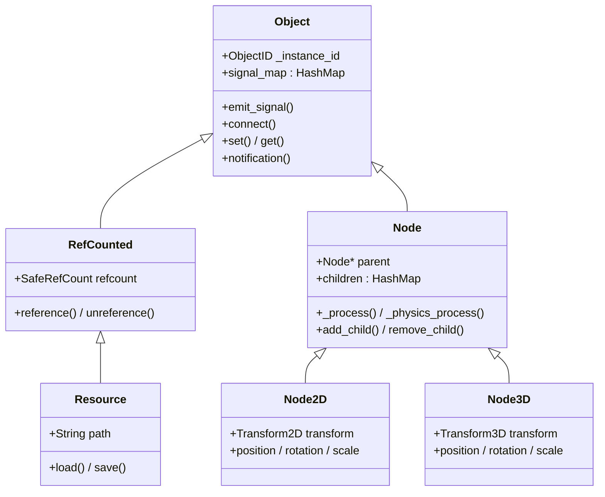
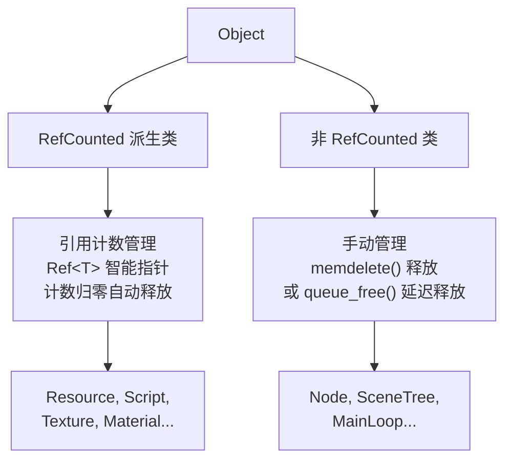
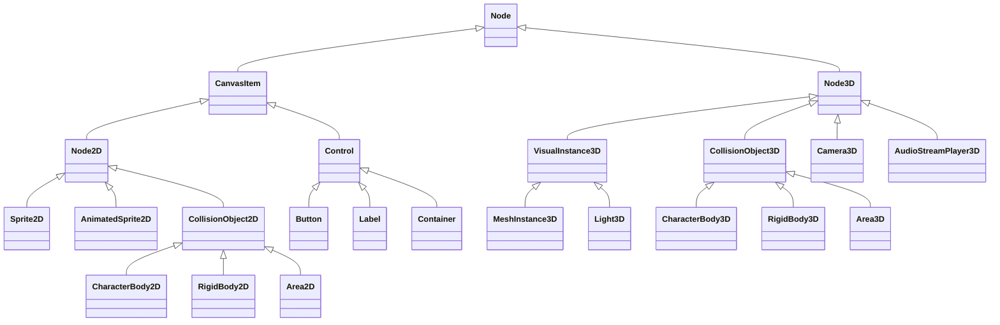
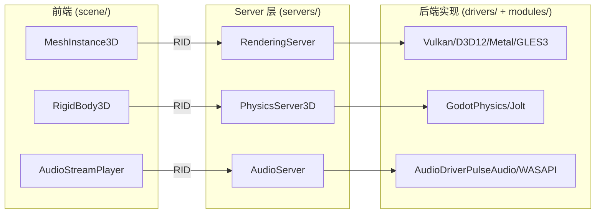
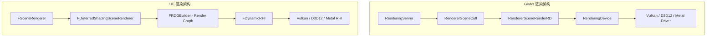
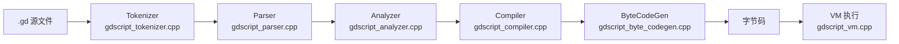
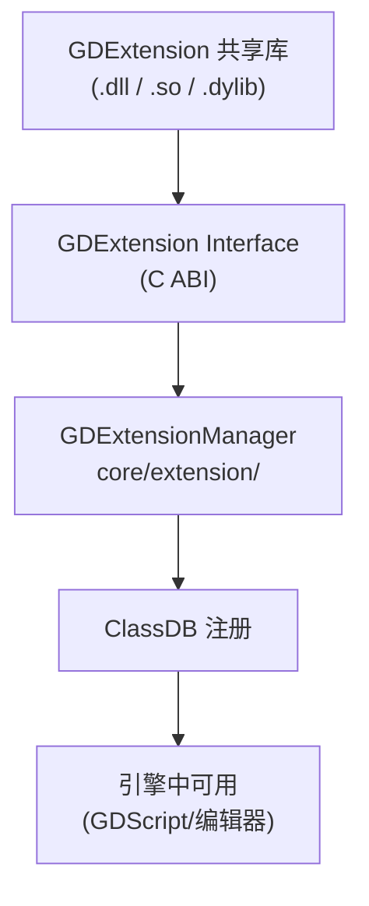
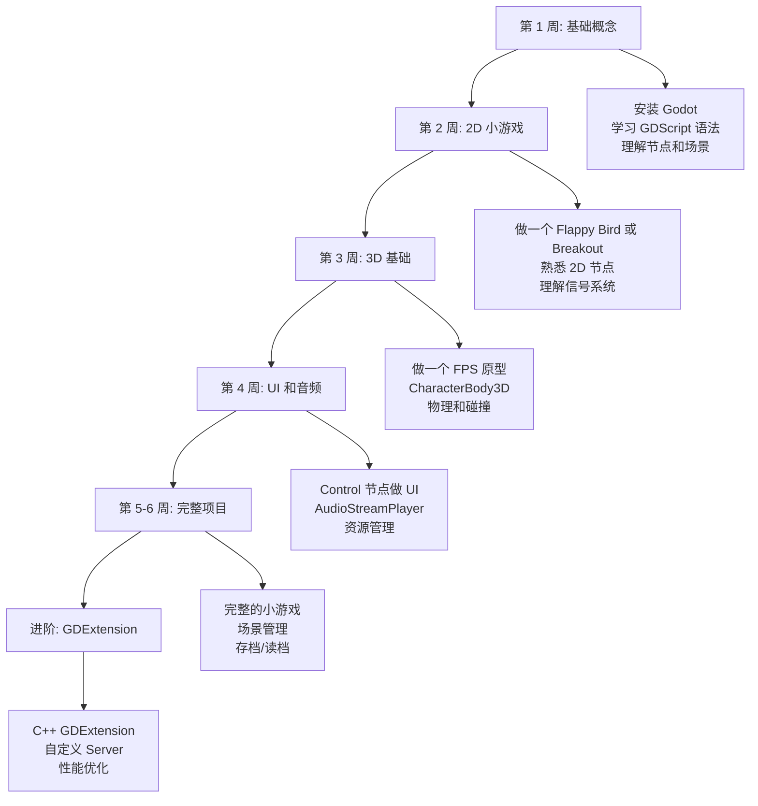

# Godot 4.6 引擎源码技术导读 — 面向 UE 开发者

> **版本**: 基于 Godot 4.6.x (master 分支, rc 阶段) 源码分析
> **目标读者**: 有 Unreal Engine 4/5 开发经验的游戏开发者
> **写作原则**: 以 UE 为锚点讲解 Godot，概览式架构分析，源码证据驱动

---

## 目录

- [第一部分：全局视角](#第一部分全局视角)
  - [1. 引擎哲学对比](#1-引擎哲学对比)
  - [2. 源码目录结构导览](#2-源码目录结构导览)
  - [3. 构建系统](#3-构建系统)
- [第二部分：核心基础层](#第二部分核心基础层)
  - [4. 对象系统 (Object)](#4-对象系统-object)
  - [5. 类型系统 (Variant)](#5-类型系统-variant)
  - [6. 内存管理](#6-内存管理)
  - [7. 字符串与容器](#7-字符串与容器)
- [第三部分：场景与节点](#第三部分场景与节点)
  - [8. 场景树架构 (SceneTree/Node)](#8-场景树架构-scenetreenode)
  - [9. 2D/3D 节点体系](#9-2d3d-节点体系)
  - [10. 资源系统 (Resource)](#10-资源系统-resource)
- [第四部分：服务器架构](#第四部分服务器架构)
  - [11. Server 模式](#11-server-模式)
  - [12. 渲染管线](#12-渲染管线)
  - [13. 物理引擎](#13-物理引擎)
- [第五部分：脚本与扩展](#第五部分脚本与扩展)
  - [14. GDScript](#14-gdscript)
  - [15. GDExtension](#15-gdextension)
  - [16. 编辑器架构](#16-编辑器架构)
- [第六部分：实战迁移](#第六部分实战迁移)
  - [17. UE 开发者迁移指南](#17-ue-开发者迁移指南)
  - [18. 性能对比与优化策略](#18-性能对比与优化策略)
  - [19. 总结](#19-总结)

---

# 第一部分：全局视角

## 1. 引擎哲学对比

> **核心对比结论**: UE 是"航空母舰"——功能齐全但庞大复杂；Godot 是"快艇"——轻量灵活但需要自己装备。

### 1.1 设计理念的根本差异

Godot 和 Unreal Engine 代表了游戏引擎设计的两个极端哲学。理解这种差异，是 UE 开发者快速上手 Godot 的第一步。

| 维度 | Godot | Unreal Engine |
|------|-------|---------------|
| **开源模式** | MIT 许可证，完全开源，社区驱动 | 源码可用但受 EULA 约束，Epic 主导 |
| **引擎体积** | 编辑器 ~40MB，源码 ~150MB | 编辑器 ~50GB，源码 ~3GB+ |
| **编译时间** | 全量编译 ~5-15 分钟 | 全量编译 ~30-120 分钟 |
| **核心语言** | C++ (核心) + GDScript (脚本) | C++ (全栈) + Blueprint (可视化) |
| **世界模型** | 节点树 (Node Tree) | Actor-Component |
| **渲染策略** | Forward+/Mobile/Compatibility 三管线 | Deferred 为主，Forward 可选 |
| **目标定位** | 独立游戏、中小型项目、教育 | AAA 级大型项目、影视制作 |
| **编辑器实现** | 引擎自身渲染（吃自己的狗粮） | Slate UI 框架 |

### 1.2 "一切皆节点" vs "Actor-Component"

这是两个引擎最核心的架构差异。在 UE 中，你习惯了这样的思维模式：

```
UWorld
  └── AGameMode
  └── APlayerController
  └── ACharacter (AActor)
        ├── USkeletalMeshComponent
        ├── UCameraComponent
        ├── UCharacterMovementComponent
        └── UCapsuleComponent
```

在 Godot 中，同样的概念变成了：

```
SceneTree
  └── Root (Window)
        └── Main (Node)
              ├── Player (CharacterBody3D)  ← 这本身就是个"组件"
              │     ├── MeshInstance3D      ← 也是节点
              │     ├── Camera3D            ← 也是节点
              │     ├── CollisionShape3D    ← 也是节点
              │     └── PlayerScript.gd     ← 附加脚本
              └── Enemy (CharacterBody3D)
```

**关键思维转换**: 在 UE 中，Actor 是容器，Component 是功能单元。在 Godot 中，**没有这种区分**——一切都是 Node，Node 既是容器也是功能单元。一个 `CharacterBody3D` 既是"Actor"也是"MovementComponent"。

### 1.3 代码规模对比

```
Godot 源码 (4.6.x):
  core/       ~200 个源文件    ← 对象系统、变体、IO、数学
  scene/      ~300 个源文件    ← 节点、GUI、动画、资源
  servers/    ~400 个源文件    ← 渲染、物理、音频服务器
  modules/    ~500 个源文件    ← GDScript、物理、格式支持
  editor/     ~400 个源文件    ← 编辑器 UI 和工具
  drivers/    ~200 个源文件    ← Vulkan、GLES3、Metal 驱动
  platform/   ~100 个源文件    ← 平台适配层
  总计: ~2000+ 源文件

UE 源码 (4.x/5.x):
  Runtime/    ~10000+ 源文件
  Editor/     ~5000+ 源文件
  Developer/  ~2000+ 源文件
  总计: ~20000+ 源文件 (仅 Engine/Source)
```

Godot 的代码量大约是 UE 的 **1/10**，这使得阅读和理解整个引擎成为可能——这也是本文存在的意义。

---

## 2. 源码目录结构导览

> **核心对比结论**: Godot 的目录结构扁平清晰，7 个顶层目录各司其职；UE 的目录结构深度嵌套，模块化但复杂。

### 2.1 Godot 顶层目录

```
GodotEngine/
├── core/           ← 核心基础层（对象系统、Variant、IO、数学、字符串）
│   ├── object/     ← Object、ClassDB、RefCounted、信号系统
│   ├── variant/    ← Variant 万能类型系统
│   ├── templates/  ← 容器（Vector、HashMap、List）
│   ├── string/     ← 字符串（String、StringName）
│   ├── math/       ← 数学库（Vector2/3/4、Transform、Quaternion）
│   ├── io/         ← 文件 IO、资源加载器
│   ├── extension/  ← GDExtension 接口
│   └── input/      ← 输入系统
│
├── scene/          ← 场景层（节点、GUI、动画）
│   ├── main/       ← SceneTree、Node、Viewport、Window
│   ├── 2d/         ← 2D 节点（Sprite2D、TileMap、Physics）
│   ├── 3d/         ← 3D 节点（MeshInstance3D、Camera3D）
│   ├── gui/        ← UI 控件（Control、Button、Label）
│   ├── animation/  ← 动画系统（AnimationPlayer、Tween）
│   ├── resources/  ← 资源类型（Material、Mesh、Texture）
│   └── audio/      ← 音频节点
│
├── servers/        ← 服务器层（渲染、物理、音频的后端实现）
│   ├── rendering/  ← RenderingServer + RD 渲染后端
│   ├── physics_2d/ ← PhysicsServer2D
│   ├── physics_3d/ ← PhysicsServer3D
│   ├── audio/      ← AudioServer
│   ├── display/    ← DisplayServer
│   └── text/       ← TextServer
│
├── modules/        ← 可选模块（GDScript、物理实现、格式支持）
│   ├── gdscript/   ← GDScript 语言实现
│   ├── mono/       ← C# 支持
│   ├── jolt_physics/  ← Jolt 物理引擎
│   ├── godot_physics_3d/  ← 内置物理引擎
│   └── ...         ← 50+ 个模块
│
├── editor/         ← 编辑器（仅 tools 构建包含）
│   ├── plugins/    ← 编辑器插件
│   ├── inspector/  ← 属性检查器
│   └── ...
│
├── drivers/        ← 底层驱动（图形 API、音频 API）
│   ├── vulkan/     ← Vulkan 驱动
│   ├── d3d12/      ← Direct3D 12 驱动
│   ├── metal/      ← Metal 驱动
│   └── gles3/      ← OpenGL ES 3.0 / WebGL 2.0
│
├── platform/       ← 平台适配层
│   ├── windows/
│   ├── linuxbsd/
│   ├── macos/
│   ├── android/
│   ├── ios/
│   ├── web/        ← WebAssembly
│   └── visionos/
│
├── main/           ← 引擎入口点和主循环
├── thirdparty/     ← 第三方库
├── tests/          ← 单元测试
└── SConstruct      ← SCons 构建入口
```

### 2.2 与 UE 目录结构的对照

| Godot 目录 | 职责 | UE 对应目录 |
|-----------|------|------------|
| `core/` | 对象系统、类型、容器 | `Runtime/Core/`, `Runtime/CoreUObject/` |
| `scene/` | 节点、场景、GUI | `Runtime/Engine/`, `Runtime/UMG/` |
| `servers/rendering/` | 渲染后端 | `Runtime/Renderer/`, `Runtime/RenderCore/`, `Runtime/RHI/` |
| `servers/physics_*/` | 物理接口 | `Runtime/PhysicsCore/`, `Runtime/Engine/Physics/` |
| `modules/` | 可选功能模块 | `Runtime/` 下各模块 + `Plugins/` |
| `editor/` | 编辑器 | `Editor/` |
| `drivers/` | 图形 API 驱动 | `Runtime/RHI/`, `Runtime/VulkanRHI/`, `Runtime/D3D12RHI/` |
| `platform/` | 平台层 | `Runtime/Launch/`, `Runtime/ApplicationCore/` |
| `main/` | 入口和主循环 | `Runtime/Launch/` |

### 2.3 关键差异

1. **Godot 的 `servers/` 没有 UE 对应物**: Godot 独创的 Server 架构将渲染、物理等后端实现与前端节点完全解耦。UE 没有这种中间层——Component 直接与子系统交互。

2. **Godot 的 `modules/` 是真正可插拔的**: 编译时可以通过 `module_xxx_enabled=no` 完全移除任何模块。UE 的模块系统虽然也支持按需加载，但核心模块之间的耦合度更高。

3. **Godot 没有 `Build.cs` / `.uproject`**: 没有项目级别的 C++ 构建配置。用户项目完全通过 GDScript/C# 或 GDExtension 扩展。

---

## 3. 构建系统

> **核心对比结论**: Godot 用 Python 的 SCons 构建，简单直接；UE 用自研的 UnrealBuildTool (C#)，功能强大但复杂。

### 3.1 SCons vs UnrealBuildTool

| 特性 | Godot (SCons) | UE (UnrealBuildTool) |
|------|--------------|---------------------|
| **语言** | Python | C# |
| **配置文件** | `SConstruct` + 各目录 `SCsub` | `.Build.cs` + `.Target.cs` |
| **模块注册** | `config.py` 中 `can_build()` | `ModuleRules` 类 |
| **增量编译** | 基于文件哈希 | 基于时间戳 + Unity Build |
| **交叉编译** | 原生支持 | 需要平台 SDK 配置 |
| **生成 IDE 项目** | `scons platform=windows vsproj=yes` | `GenerateProjectFiles.bat` |

### 3.2 Godot 的构建流程

```bash
# 基本编译命令
scons platform=windows target=editor -j16

# 关键参数
# platform=   windows/linuxbsd/macos/android/ios/web
# target=     editor/template_debug/template_release
# arch=       x86_64/arm64
# dev_build=  yes/no (开发者调试构建)
# module_xxx_enabled= yes/no (启用/禁用模块)
```

**源码文件**: `SConstruct` (根目录, 约 50KB)

Godot 的构建入口 `SConstruct` 负责：
1. 解析命令行参数和平台检测
2. 加载平台特定的构建配置 (`platform/<name>/detect.py`)
3. 递归处理各目录的 `SCsub` 文件
4. 链接所有编译单元

### 3.3 模块注册机制

每个 Godot 模块目录下都有一个 `config.py`：

```python
# modules/gdscript/config.py
def can_build(env, platform):
    return True

def configure(env):
    pass
```

对比 UE 的模块注册：

```csharp
// Source/Runtime/Engine/Engine.Build.cs
public class Engine : ModuleRules
{
    public Engine(ReadOnlyTargetRules Target) : base(Target)
    {
        PublicDependencyModuleNames.AddRange(new string[] {
            "Core", "CoreUObject", "RenderCore", ...
        });
    }
}
```

**关键差异**: Godot 的模块是编译时静态链接的（除了 GDExtension），而 UE 的模块支持运行时动态加载。Godot 的模块系统更简单，但也意味着添加新的 C++ 功能需要重新编译整个引擎。

### 3.4 SCU (Single Compilation Unit) 构建

Godot 支持 SCU 构建模式（类似 UE 的 Unity Build），通过 `scu_builders.py` 将多个 `.cpp` 文件合并为单个编译单元，显著减少编译时间：

```bash
scons platform=windows target=editor scu_build=yes
```

这与 UE 的 `bUseUnityBuild = true` 概念完全一致。

---

# 第二部分：核心基础层

## 4. 对象系统 (Object)

> **核心对比结论**: Godot 的 `GDCLASS` 宏 ≈ UE 的 `UCLASS` 宏，`ClassDB` ≈ `UClass` 反射系统，但 Godot 用信号 (Signal) 替代了 UE 的委托 (Delegate)。

### 4.1 GDCLASS vs UCLASS

这是两个引擎中最重要的宏，它们定义了对象模型的基础。

**Godot 的 GDCLASS** (`core/object/object.h`):

```cpp
// Godot: 声明一个引擎类
class Node3D : public Node {
    GDCLASS(Node3D, Node);  // 宏展开后提供：
                             // - get_class_static() 静态类名
                             // - initialize_class() 类初始化
                             // - _bind_methods() 方法绑定入口
                             // - 类型转换支持 (cast_to)
protected:
    static void _bind_methods();
};
```

**UE 的 UCLASS** (`Runtime/CoreUObject/Public/UObject/ObjectMacros.h`):

```cpp
// UE: 声明一个引擎类
UCLASS()
class ENGINE_API AActor : public UObject {
    GENERATED_BODY()  // 宏展开后提供：
                      // - StaticClass() 静态类信息
                      // - UHT 生成的反射代码
                      // - 序列化/网络复制支持
};
```

### 4.2 核心差异对比

| 特性 | Godot (GDCLASS) | UE (UCLASS/GENERATED_BODY) |
|------|-----------------|---------------------------|
| **代码生成** | 纯宏展开，无外部工具 | 需要 UHT (Unreal Header Tool) 预处理 |
| **反射注册** | `_bind_methods()` 手动绑定 | UHT 自动扫描 `UPROPERTY`/`UFUNCTION` |
| **类型信息存储** | `ClassDB::classes` HashMap | `UClass` 对象链 |
| **实例化** | `ClassDB::instantiate("ClassName")` | `NewObject<T>()` / `StaticClass()` |
| **类型转换** | `Object::cast_to<T>(obj)` | `Cast<T>(obj)` |

### 4.3 ClassDB — Godot 的反射注册中心

`ClassDB` (`core/object/class_db.h`) 是 Godot 反射系统的核心，相当于 UE 中所有 `UClass` 对象的集合。

```cpp
// ClassDB 的核心数据结构
class ClassDB {
    // 所有注册类的信息，以类名为键
    static HashMap<StringName, ClassInfo> classes;

    struct ClassInfo {
        StringName name;                              // 类名
        StringName inherits;                          // 父类名
        ClassInfo *inherits_ptr = nullptr;            // 父类指针
        HashMap<StringName, MethodBind *> method_map; // 方法表
        AHashMap<StringName, int64_t> constant_map;   // 常量表
        AHashMap<StringName, MethodInfo> signal_map;  // 信号表
        List<PropertyInfo> property_list;             // 属性列表
        Object *(*creation_func)(bool) = nullptr;     // 工厂函数
        APIType api = API_NONE;                       // API 类型
        // ...
    };
};
```

**注册流程**:

```cpp
// 1. 在 register_core_types.cpp / register_scene_types.cpp 中注册
GDREGISTER_CLASS(Node3D);
// 展开为: ClassDB::register_class<Node3D>();

// 2. register_class 内部调用 T::initialize_class()
// 3. initialize_class() 调用父类的 initialize_class()，然后调用 _bind_methods()

// 4. 在 _bind_methods() 中手动绑定方法、属性、信号
void Node3D::_bind_methods() {
    ClassDB::bind_method(D_METHOD("set_position", "position"), &Node3D::set_position);
    ClassDB::bind_method(D_METHOD("get_position"), &Node3D::get_position);
    ADD_PROPERTY(PropertyInfo(Variant::VECTOR3, "position"), "set_position", "get_position");

    ADD_SIGNAL(MethodInfo("visibility_changed"));
}
```

对比 UE 的自动反射：

```cpp
// UE: UHT 自动扫描这些宏并生成反射代码
UCLASS()
class AActor : public UObject {
    GENERATED_BODY()

    UPROPERTY(EditAnywhere, BlueprintReadWrite)
    FVector Position;  // UHT 自动生成 getter/setter 和反射信息

    UFUNCTION(BlueprintCallable)
    void SetPosition(FVector NewPos);
};
```

**关键差异**: Godot 的 `_bind_methods()` 是**手动**的——你必须显式绑定每个要暴露给脚本的方法和属性。UE 的 UHT 是**自动**的——只要加上 `UPROPERTY`/`UFUNCTION` 宏，反射代码自动生成。Godot 的方式更透明但更繁琐，UE 的方式更便捷但引入了额外的构建步骤。

### 4.4 信号 (Signal) vs 委托 (Delegate)

Godot 的信号系统是其最具特色的设计之一，它是观察者模式的一等公民实现。

```cpp
// Godot: 信号定义和使用
// 在 _bind_methods() 中声明信号
ADD_SIGNAL(MethodInfo("health_changed",
    PropertyInfo(Variant::INT, "new_health")));

// 发射信号
emit_signal("health_changed", new_health);

// 连接信号 (C++)
node->connect("health_changed", callable_mp(this, &MyClass::_on_health_changed));

// 连接信号 (GDScript)
# player.health_changed.connect(_on_health_changed)
```

```cpp
// UE: 委托定义和使用
DECLARE_DYNAMIC_MULTICAST_DELEGATE_OneParam(FOnHealthChanged, int32, NewHealth);

UPROPERTY(BlueprintAssignable)
FOnHealthChanged OnHealthChanged;

// 广播
OnHealthChanged.Broadcast(NewHealth);

// 绑定
OtherActor->OnHealthChanged.AddDynamic(this, &AMyActor::HandleHealthChanged);
```

| 特性 | Godot Signal | UE Delegate |
|------|-------------|-------------|
| **类型安全** | 运行时检查（基于 Variant） | 编译时检查（模板） |
| **声明方式** | `ADD_SIGNAL` 或 GDScript `signal` | `DECLARE_*_DELEGATE` 宏族 |
| **连接方式** | `connect()` 方法 | `AddDynamic()` / `BindUObject()` |
| **编辑器集成** | 节点面板直接连接 | Blueprint 事件图 |
| **跨语言** | 天然支持 GDScript/C#/GDExtension | 需要 `DYNAMIC` 变体 |
| **性能** | 较慢（Variant 装箱） | 较快（直接函数指针） |

### 4.5 Object 继承体系



注意：在 UE 中，`UObject` 是万物之基，`AActor` 和 `UActorComponent` 都继承自 `UObject`。在 Godot 中，`Object` 是万物之基，但 `Node` 和 `RefCounted`（Resource 的基类）是两条**平行**的继承链——Node 不是 RefCounted 的，Resource 不是 Node。

---

## 5. 类型系统 (Variant)

> **核心对比结论**: Godot 的 `Variant` 是一个万能类型容器，能装下引擎中的任何值类型；UE 没有完全对应的概念，最接近的是 `FProperty` 系统 + `TFieldPath` 的组合。

### 5.1 Variant 是什么

`Variant` (`core/variant/variant.h`) 是 Godot 类型系统的基石。它是一个**带标签的联合体 (tagged union)**，可以存储引擎支持的所有基本类型。

```cpp
// Variant 支持的所有类型 (core/variant/variant.h)
enum Type {
    NIL,
    // 原子类型
    BOOL, INT, FLOAT, STRING,
    // 数学类型
    VECTOR2, VECTOR2I, RECT2, RECT2I,
    VECTOR3, VECTOR3I, TRANSFORM2D,
    VECTOR4, VECTOR4I, PLANE, QUATERNION,
    AABB, BASIS, TRANSFORM3D, PROJECTION,
    // 杂项类型
    COLOR, STRING_NAME, NODE_PATH, RID,
    OBJECT, CALLABLE, SIGNAL,
    DICTIONARY, ARRAY,
    // 紧凑数组类型
    PACKED_BYTE_ARRAY, PACKED_INT32_ARRAY, PACKED_INT64_ARRAY,
    PACKED_FLOAT32_ARRAY, PACKED_FLOAT64_ARRAY,
    PACKED_STRING_ARRAY, PACKED_VECTOR2_ARRAY,
    PACKED_VECTOR3_ARRAY, PACKED_COLOR_ARRAY, PACKED_VECTOR4_ARRAY,
    VARIANT_MAX  // 共 38 种类型
};
```

### 5.2 内存布局

Variant 的设计目标是**小而快**：

```cpp
// Variant 内部存储 (core/variant/variant.h)
// 大小: 24 字节 (float) 或 40 字节 (double)
Type type = NIL;

union {
    bool _bool;
    int64_t _int;
    double _float;
    Transform2D *_transform2d;    // 堆分配（太大放不下）
    ::AABB *_aabb;                // 堆分配
    Basis *_basis;                // 堆分配
    Transform3D *_transform3d;    // 堆分配
    Projection *_projection;      // 堆分配
    PackedArrayRefBase *packed_array;  // 引用计数的数组
    void *_ptr;
    uint8_t _mem[sizeof(ObjData) > (sizeof(real_t) * 4)
                 ? sizeof(ObjData) : (sizeof(real_t) * 4)]{ 0 };
} _data alignas(8);
```

小类型（bool、int、float、Vector2、Vector3、Color 等）直接存储在 `_mem` 内联缓冲区中。大类型（Transform2D、Basis、Transform3D、Projection）通过指针存储在堆上，使用 `PagedAllocator` 池化分配。

### 5.3 Variant vs UE 的类型系统

| 特性 | Godot Variant | UE 对应机制 |
|------|--------------|------------|
| **用途** | 脚本绑定的通用类型 | 无单一对应物 |
| **类型擦除** | 运行时 tagged union | `FProperty` + `void*` |
| **方法调用** | `Variant::callp()` | `UFunction::Invoke()` |
| **属性访问** | `Variant::set_named()` / `get_named()` | `FProperty::GetValue_InContainer()` |
| **序列化** | `Variant` 直接序列化 | `FArchive` + `FProperty` |
| **脚本交互** | 所有脚本参数都是 Variant | Blueprint: `FBlueprintActionMenuItem` |

在 UE 中，你可能用过 `FStructOnScope` 或 `TFieldPath` 来做类似的类型擦除，但它们远不如 Variant 统一。Variant 的设计哲学是：**一个类型走天下**——所有脚本函数的参数和返回值都通过 Variant 传递。

### 5.4 Variant 的性能考量

Variant 的便利性是有代价的：

```cpp
// 每次脚本调用都涉及 Variant 装箱/拆箱
// GDScript: position.x = 10.0
// 实际执行:
// 1. 创建 Variant(10.0)           ← 装箱
// 2. 调用 set_named("x", variant) ← 动态查找
// 3. 内部提取 double 值            ← 拆箱
```

这就是为什么 Godot 4 引入了 **GDScript 字节码优化**——通过类型推断，编译器可以生成直接操作原始类型的指令，跳过 Variant 装箱。这类似于 UE Blueprint 的 "nativization" 概念。

---

## 6. 内存管理

> **核心对比结论**: Godot 使用引用计数 (`RefCounted`) + 手动管理 (`memdelete`) 的双轨制；UE 使用垃圾回收 (GC) + 智能指针 (`TSharedPtr`) 的双轨制。

### 6.1 两种对象的生命周期

Godot 中的对象分为两大类，生命周期管理方式完全不同：



### 6.2 RefCounted 和 Ref\<T\>

`RefCounted` (`core/object/ref_counted.h`) 是 Godot 的引用计数基类：

```cpp
class RefCounted : public Object {
    GDCLASS(RefCounted, Object);
    SafeRefCount refcount;       // 原子引用计数
    SafeRefCount refcount_init;  // 初始化引用计数

public:
    bool reference();    // 增加引用计数
    bool unreference();  // 减少引用计数，返回 false 表示应该删除
};
```

`Ref<T>` 是配套的智能指针模板：

```cpp
template <typename T>
class Ref {
    T *reference = nullptr;

public:
    void unref() {
        if (reference) {
            if (reinterpret_cast<RefCounted *>(reference)->unreference()) {
                memdelete(reinterpret_cast<RefCounted *>(reference));
            }
            reference = nullptr;
        }
    }
    // operator->, operator*, is_valid(), is_null() ...
};
```

### 6.3 与 UE 内存管理的对比

| 特性 | Godot | UE |
|------|-------|-----|
| **资源类对象** | `Ref<T>` 引用计数 | `TObjectPtr<T>` + GC |
| **场景对象 (Node)** | 手动 `memdelete` / `queue_free()` | GC 自动回收 |
| **共享指针** | `Ref<T>` (仅 RefCounted 派生) | `TSharedPtr<T>` (任意类型) |
| **弱引用** | `WeakRef` / `ObjectID` | `TWeakObjectPtr<T>` / `TWeakPtr<T>` |
| **GC** | ❌ 无 GC | ✅ 标记-清除 GC |
| **循环引用** | ⚠️ 需手动打破 | ✅ GC 自动处理 |

### 6.4 Node 的生命周期

Node 不是 RefCounted，所以需要手动管理：

```gdscript
# GDScript
var enemy = Enemy.new()
add_child(enemy)       # 添加到场景树
# ...
enemy.queue_free()     # 延迟到帧末删除（安全）
# 或
enemy.free()           # 立即删除（危险，可能有悬挂引用）
```

```cpp
// 对比 UE
AActor* Enemy = GetWorld()->SpawnActor<AEnemy>(...);
// ...
Enemy->Destroy();  // 标记销毁，GC 稍后回收
// 或
Enemy->K2_DestroyActor();  // Blueprint 可调用版本
```

**关键差异**: UE 的 GC 意味着你几乎不需要担心悬挂指针（`TWeakObjectPtr` 会自动失效）。Godot 没有 GC，所以 `queue_free()` 后如果还持有原始指针，就会产生悬挂引用。Godot 的解决方案是 `ObjectID` + `ObjectDB::get_instance()`：

```cpp
// Godot: 安全的对象引用
ObjectID id = node->get_instance_id();
// 稍后...
Node *node = ObjectDB::get_instance(id);  // 如果对象已删除，返回 nullptr
```

---

## 7. 字符串与容器

> **核心对比结论**: Godot 的 `String` ≈ UE 的 `FString`，`StringName` ≈ `FName`，`Vector<T>` ≈ `TArray<T>`，`HashMap<K,V>` ≈ `TMap<K,V>`。

### 7.1 字符串类型

| Godot | UE | 说明 |
|-------|-----|------|
| `String` | `FString` | 可变 UTF-32 字符串（Godot）/ UTF-16（UE） |
| `StringName` | `FName` | 不可变、哈希化、比较 O(1) 的标识符 |
| `NodePath` | — | Godot 特有，用于引用场景树中的节点路径 |
| — | `FText` | UE 特有，用于本地化文本 |

**关键差异**: Godot 的 `String` 使用 **UTF-32** 编码（每个字符 4 字节），而 UE 的 `FString` 使用 **UTF-16**。这意味着 Godot 的字符串在处理 Unicode 时更简单（无代理对），但内存占用更大。

```cpp
// Godot String (core/string/ustring.h)
// 内部使用 CowData<char32_t>，写时复制
class String {
    CowData<char32_t> _cowdata;  // UTF-32
};

// Godot StringName (core/string/string_name.h)
// 全局哈希表，相同字符串只存一份
class StringName {
    _Data *_data = nullptr;
    // 比较只需比较指针！
    bool operator==(const StringName &p_name) const {
        return _data == p_name._data;
    }
};
```

### 7.2 容器类型

| Godot | UE | 说明 |
|-------|-----|------|
| `Vector<T>` | `TArray<T>` | 动态数组，连续内存 |
| `LocalVector<T>` | `TArray<T>` (InlineAllocator) | 栈优化的小数组 |
| `List<T>` | `TDoubleLinkedList<T>` | 双向链表 |
| `HashMap<K,V>` | `TMap<K,V>` | 哈希表（Godot 开放寻址，UE 红黑树/哈希） |
| `HashSet<T>` | `TSet<T>` | 哈希集合 |
| `RBMap<K,V>` | `TMap<K,V>` | 红黑树有序映射 |
| `Pair<A,B>` | `TPair<K,V>` | 键值对 |

```cpp
// Godot Vector (core/templates/vector.h)
// 使用 CowData 实现写时复制
template <typename T>
class Vector {
    CowData<T> _cowdata;
public:
    void push_back(T p_elem);
    void remove_at(int64_t p_index);
    T *ptrw();  // 获取可写指针（触发 COW）
    const T *ptr() const;  // 获取只读指针
};
```

**写时复制 (COW)**: Godot 的 `Vector` 和 `String` 都使用 COW 策略。赋值操作只复制指针和增加引用计数，只有在修改时才真正复制数据。UE 的 `TArray` 不使用 COW——赋值总是深拷贝。

```cpp
// Godot: COW 行为
Vector<int> a = {1, 2, 3};
Vector<int> b = a;        // 浅拷贝，共享数据
b.push_back(4);           // 触发 COW，b 获得独立副本

// UE: 总是深拷贝
TArray<int> a = {1, 2, 3};
TArray<int> b = a;        // 深拷贝，独立数据
```

### 7.3 RID — 资源标识符

Godot 有一个 UE 中没有直接对应的概念：`RID` (Resource ID)。

```cpp
// core/templates/rid.h
// RID 是一个轻量级的不透明句柄，用于引用 Server 端的资源
class RID {
    uint64_t _id = 0;
};
```

RID 是 Godot Server 架构的关键——前端 Node 通过 RID 引用后端 Server 中的实际资源（纹理、网格、物理体等），而不是直接持有指针。这类似于图形 API 中的句柄概念（如 Vulkan 的 `VkBuffer`）。

---

# 第三部分：场景与节点

## 8. 场景树架构 (SceneTree/Node)

> **核心对比结论**: Godot 的 SceneTree + Node 体系是最大的思维转换点。忘掉 Actor-Component，拥抱"一切皆节点"的组合模式。

### 8.1 SceneTree — 游戏世界的容器

`SceneTree` (`scene/main/scene_tree.h`) 继承自 `MainLoop`，是 Godot 的游戏世界容器，相当于 UE 的 `UWorld` + `UGameInstance` 的组合。

```cpp
class SceneTree : public MainLoop {
    Window *root = nullptr;              // 根窗口（根 Viewport）
    Node *current_scene = nullptr;       // 当前场景
    HashMap<StringName, Group> group_map; // 节点分组

    // 主循环
    virtual bool physics_process(double p_time) override;
    virtual bool process(double p_time) override;
};
```

### 8.2 Node — 万物之基

`Node` (`scene/main/node.h`) 是 Godot 场景系统的基类，相当于 UE 中 `AActor` + `UActorComponent` 的统一体。

```cpp
class Node : public Object {
    GDCLASS(Node, Object);

    struct Data {
        Node *parent = nullptr;                    // 父节点
        HashMap<StringName, Node *> children;      // 子节点
        StringName name;                           // 节点名
        SceneTree *tree = nullptr;                 // 所属场景树
        Viewport *viewport = nullptr;              // 所属视口

        // 处理标志
        bool physics_process : 1;
        bool process : 1;
        ProcessMode process_mode : 3;
        int process_priority = 0;
        // ...
    } data;
};
```

### 8.3 Node 生命周期 vs AActor 生命周期

```mermaid
graph TD
    subgraph "Godot Node 生命周期"
        GN1["new() / instantiate()"] --> GN2["add_child()"]
        GN2 --> GN3["NOTIFICATION_ENTER_TREE<br/>_enter_tree()"]
        GN3 --> GN4["NOTIFICATION_READY<br/>_ready()"]
        GN4 --> GN5["NOTIFICATION_PROCESS<br/>_process(delta)"]
        GN5 --> GN6["remove_child() 或 queue_free()"]
        GN6 --> GN7["NOTIFICATION_EXIT_TREE<br/>_exit_tree()"]
        GN7 --> GN8["free() / 析构"]
    end

    subgraph "UE AActor 生命周期"
        UA1["SpawnActor() / NewObject()"] --> UA2["PostInitializeComponents()"]
        UA2 --> UA3["BeginPlay()"]
        UA3 --> UA4["Tick(DeltaTime)"]
        UA4 --> UA5["EndPlay()"]
        UA5 --> UA6["Destroy()"]
        UA6 --> UA7["GC 回收"]
    end
```



| Godot Node | UE AActor | 说明 |
|-----------|-----------|------|
| `_enter_tree()` | `PostInitializeComponents()` | 进入场景/世界 |
| `_ready()` | `BeginPlay()` | 初始化完成，所有子节点就绪 |
| `_process(delta)` | `Tick(DeltaTime)` | 每帧更新 |
| `_physics_process(delta)` | `TickComponent()` (固定步长) | 物理帧更新 |
| `_exit_tree()` | `EndPlay()` | 离开场景/世界 |
| `_input(event)` | `APlayerController::InputComponent` | 输入处理 |

### 8.4 组合模式的差异

**UE 的 Actor-Component 模式**:
```
ACharacter (Actor - 容器)
├── USkeletalMeshComponent (渲染)
├── UCapsuleComponent (碰撞)
├── UCharacterMovementComponent (移动)
└── USpringArmComponent + UCameraComponent (相机)
```

**Godot 的节点组合模式**:
```
CharacterBody3D (既是"Actor"也是"MovementComponent")
├── MeshInstance3D (渲染)
├── CollisionShape3D (碰撞)
├── SpringArm3D
│   └── Camera3D (相机)
└── AnimationPlayer (动画)
```

**关键差异**:
1. UE 中 Component 不能有子 Component（扁平结构）；Godot 中 Node 可以无限嵌套（树结构）
2. UE 中 Actor 是网络复制的基本单位；Godot 中任何 Node 都可以配置 RPC
3. UE 中 Component 的 Tick 由 Actor 统一调度；Godot 中每个 Node 独立注册 process

### 8.5 场景 (Scene) — Godot 的 Prefab

Godot 的"场景"概念相当于 UE 的 **Blueprint** 或 **Prefab**。一个 `.tscn` 文件保存了一棵节点树的完整描述：

```
# player.tscn (文本格式)
[gd_scene load_steps=3 format=3]

[ext_resource type="Script" path="res://player.gd" id="1"]
[ext_resource type="PackedScene" path="res://weapon.tscn" id="2"]

[node name="Player" type="CharacterBody3D"]
script = ExtResource("1")

[node name="Mesh" type="MeshInstance3D" parent="."]
[node name="Collision" type="CollisionShape3D" parent="."]
[node name="Weapon" parent="." instance=ExtResource("2")]
```

场景可以被**实例化** (instantiate) 到其他场景中，形成嵌套组合——这就是 Godot 版的"Prefab 嵌套"。

---

## 9. 2D/3D 节点体系

> **核心对比结论**: Godot 的 2D 和 3D 是完全独立的两套节点体系，各有专属的坐标系统和渲染管线；UE 的 2D 支持（Paper2D）是 3D 的子集。

### 9.1 节点继承树



### 9.2 与 UE 体系的对照

| Godot 节点 | UE 对应 | 说明 |
|-----------|---------|------|
| `Node3D` | `USceneComponent` | 3D 变换基类 |
| `MeshInstance3D` | `UStaticMeshComponent` | 静态网格渲染 |
| `Camera3D` | `UCameraComponent` | 相机 |
| `CharacterBody3D` | `ACharacter` + `UCharacterMovementComponent` | 角色控制器 |
| `RigidBody3D` | `UStaticMeshComponent` + Physics | 刚体 |
| `Area3D` | `ATriggerBox` / `UBoxComponent` (Overlap) | 触发区域 |
| `DirectionalLight3D` | `ADirectionalLight` | 平行光 |
| `AnimationPlayer` | `USkeletalMeshComponent` 的动画 | 动画播放器 |
| `Control` | `UWidget` (UMG) | UI 基类 |
| `Node2D` | `APaperCharacter` (Paper2D) | 2D 基类 |

### 9.3 Godot 2D 的优势

Godot 的 2D 是**一等公民**，不是 3D 的投影：

- 独立的 2D 物理引擎 (`PhysicsServer2D`)
- 独立的 2D 渲染管线（Canvas 渲染器）
- 像素级精确的坐标系统
- 专用的 2D 节点（`TileMapLayer`、`Parallax2D`、`NavigationAgent2D`）

这是 Godot 相对于 UE 的一个明显优势——UE 的 Paper2D 已经基本停止维护。

---

## 10. 资源系统 (Resource)

> **核心对比结论**: Godot 的 `Resource` ≈ UE 的 `UObject` 资产，`.tres`/`.tscn` ≈ `.uasset`，但 Godot 的资源是文本可读的。

### 10.1 Resource 基类

```cpp
// core/io/resource.h
class Resource : public RefCounted {
    GDCLASS(Resource, RefCounted);

    String path_cache;  // 资源路径 (res://...)
    String name;
    // ...
};
```

`Resource` 继承自 `RefCounted`，所以资源的生命周期由引用计数管理。当没有任何引用指向一个资源时，它会自动释放。

### 10.2 资源格式对比

| 特性 | Godot | UE |
|------|-------|-----|
| **文本格式** | `.tres` (资源) / `.tscn` (场景) | 无（`.uasset` 是二进制） |
| **二进制格式** | `.res` / `.scn` | `.uasset` / `.umap` |
| **版本控制友好** | ✅ 文本格式可 diff/merge | ❌ 二进制格式难以 diff |
| **加载方式** | `ResourceLoader::load()` | `StaticLoadObject()` / `LoadObject()` |
| **引用方式** | `res://path/to/resource.tres` | `/Game/Path/To/Asset` |
| **热重载** | ✅ 编辑器中自动热重载 | ✅ 编辑器中自动热重载 |

### 10.3 PackedScene — 场景资源

`PackedScene` 是 Godot 中最重要的资源类型之一，它存储了一棵节点树的序列化数据：

```gdscript
# 加载并实例化场景
var scene = preload("res://enemy.tscn")  # 编译时加载
var enemy = scene.instantiate()           # 创建节点树实例
add_child(enemy)                          # 添加到场景树
```

这相当于 UE 中的：
```cpp
// UE: 加载并生成 Blueprint
UClass* EnemyClass = LoadClass<AActor>(nullptr, TEXT("/Game/Blueprints/BP_Enemy"));
AActor* Enemy = GetWorld()->SpawnActor<AActor>(EnemyClass);
```

---

# 第四部分：服务器架构

## 11. Server 模式

> **核心对比结论**: Godot 的 Server 架构是其最独特的设计——将引擎后端（渲染、物理、音频）抽象为独立的"服务器"进程，前端 Node 通过 RID 句柄与之通信。UE 没有对应概念。

### 11.1 为什么需要 Server 架构

Godot 的 Server 模式解决了一个核心问题：**前端（场景节点）和后端（渲染/物理实现）的解耦**。



### 11.2 主要 Server 列表

| Server | 源码位置 | 职责 | UE 最近似 |
|--------|---------|------|----------|
| `RenderingServer` | `servers/rendering/rendering_server.h` | 所有渲染操作 | `FSceneRenderer` + `RHI` |
| `PhysicsServer3D` | `servers/physics_3d/` | 3D 物理模拟 | `FPhysScene` |
| `PhysicsServer2D` | `servers/physics_2d/` | 2D 物理模拟 | — |
| `AudioServer` | `servers/audio/` | 音频混合和播放 | `FAudioDevice` |
| `DisplayServer` | `servers/display/` | 窗口和输入管理 | `FGenericApplication` |
| `TextServer` | `servers/text/` | 文本排版和渲染 | `FSlateFontServices` |
| `NavigationServer3D` | `servers/navigation_3d/` | 3D 寻路 | `ANavigationData` |
| `XRServer` | `servers/xr/` | VR/AR | `IXRTrackingSystem` |

### 11.3 RID 通信机制

Node 和 Server 之间通过 `RID` (Resource ID) 通信：

```cpp
// MeshInstance3D 内部实现 (简化)
class MeshInstance3D : public GeometryInstance3D {
    RID mesh_rid;  // 指向 RenderingServer 中的网格资源

    void set_mesh(const Ref<Mesh> &p_mesh) {
        mesh = p_mesh;
        // 通知 RenderingServer 更新
        RenderingServer::get_singleton()->instance_set_base(
            get_instance(), mesh->get_rid());
    }
};
```

这种设计的优势：
1. **线程安全**: Server 可以在独立线程运行，Node 通过命令队列异步通信
2. **后端可替换**: 物理引擎可以在 GodotPhysics 和 Jolt 之间切换，不影响前端代码
3. **无头模式**: 可以不启动 RenderingServer 运行服务器（`--headless`）

### 11.4 命令队列

Server 使用命令队列实现线程安全的异步调用：

```cpp
// servers/server_wrap_mt_common.h
// 宏生成线程安全的包装方法
#define FUNC2(m_type, m_arg1, m_arg2)                                    \
    virtual void m_type(m_arg1 p1, m_arg2 p2) override {                \
        if (Thread::get_caller_id() != server_thread) {                  \
            command_queue.push(server, &ServerName::m_type, p1, p2);    \
        } else {                                                         \
            server->m_type(p1, p2);                                      \
        }                                                                \
    }
```

这类似于 UE 的渲染线程命令队列 (`ENQUEUE_RENDER_COMMAND`)，但 Godot 将这个模式推广到了所有 Server。

---

## 12. 渲染管线

> **核心对比结论**: Godot 提供 Forward+/Mobile/Compatibility 三条渲染管线，分别对应桌面、移动和低端设备；UE 以 Deferred Rendering 为主，辅以 Forward Shading 选项。

### 12.1 三条渲染管线

| 管线 | 后端 | 目标平台 | 特性 |
|------|------|---------|------|
| **Forward+** | Vulkan/D3D12/Metal (RenderingDevice) | 桌面/主机 | Clustered Forward，支持大量光源 |
| **Mobile** | Vulkan/D3D12/Metal (RenderingDevice) | 移动设备 | 简化的 Forward，优化带宽 |
| **Compatibility** | OpenGL ES 3.0 / WebGL 2.0 | 低端/Web | 传统 Forward，最大兼容性 |

### 12.2 RenderingDevice (RD) 抽象层

`RenderingDevice` (`servers/rendering/rendering_device.h`) 是 Godot 的图形 API 抽象层，类似于 UE 的 `RHI` (Render Hardware Interface)：

```cpp
class RenderingDevice : public Object {
    // 资源创建
    virtual RID texture_create(const TextureFormat &p_format, ...) = 0;
    virtual RID buffer_create(uint64_t p_size, ...) = 0;
    virtual RID shader_create_from_bytecode(const Vector<uint8_t> &p_bytecode) = 0;

    // 渲染管线
    virtual RID render_pipeline_create(...) = 0;
    virtual RID compute_pipeline_create(...) = 0;

    // 绘制命令
    virtual void draw_list_begin(...) = 0;
    virtual void draw_list_draw(...) = 0;
    virtual void draw_list_end() = 0;
};
```

| Godot RD | UE RHI | 说明 |
|----------|--------|------|
| `RenderingDevice` | `FDynamicRHI` | 图形 API 抽象基类 |
| `RenderingDeviceDriverVulkan` | `FVulkanDynamicRHI` | Vulkan 实现 |
| `RenderingDeviceDriverD3D12` | `FD3D12DynamicRHI` | D3D12 实现 |
| `RenderingDeviceDriverMetal` | `FMetalDynamicRHI` | Metal 实现 |
| `RID` | `FRHIResource*` | 资源句柄 |

### 12.3 渲染架构对比



### 12.4 Shader 系统

Godot 使用自己的 Shader 语言（基于 GLSL），而非 HLSL：

```glsl
// Godot Shader Language
shader_type spatial;

uniform vec4 albedo_color : source_color = vec4(1.0);
uniform sampler2D albedo_texture;

void fragment() {
    ALBEDO = texture(albedo_texture, UV).rgb * albedo_color.rgb;
    METALLIC = 0.5;
    ROUGHNESS = 0.3;
}
```

```hlsl
// UE Material (HLSL)
// 通常通过 Material Editor 可视化编辑
float3 BaseColor = Texture2DSample(AlbedoTexture, AlbedoSampler, UV).rgb;
BaseColor *= AlbedoColor.rgb;
// Metallic = 0.5;
// Roughness = 0.3;
```

---

## 13. 物理引擎

> **核心对比结论**: Godot 内置 GodotPhysics 并集成 Jolt 作为高性能替代；UE 从 PhysX 迁移到了自研的 Chaos Physics。

### 13.1 物理引擎选项

| 特性 | Godot (GodotPhysics) | Godot (Jolt) | UE (Chaos) |
|------|---------------------|--------------|------------|
| **类型** | 内置自研 | 第三方集成 | 自研 |
| **源码位置** | `modules/godot_physics_3d/` | `modules/jolt_physics/` | `Runtime/Experimental/Chaos/` |
| **性能** | 中等 | 高 | 高 |
| **功能** | 基础物理 | 完整物理 | 完整物理 + 破坏 |
| **默认启用** | ✅ (4.6 之前) | ✅ (4.6 默认) | ✅ |

### 13.2 物理节点对照

| Godot | UE | 说明 |
|-------|-----|------|
| `CharacterBody3D` | `ACharacter` | 角色物理体（运动学） |
| `RigidBody3D` | `UStaticMeshComponent` (Simulate Physics) | 刚体 |
| `StaticBody3D` | `AStaticMeshActor` | 静态碰撞体 |
| `Area3D` | `ATriggerVolume` | 触发区域 |
| `CollisionShape3D` | `UBoxComponent`/`USphereComponent` | 碰撞形状 |
| `RayCast3D` | `UWorld::LineTraceSingle` | 射线检测 |
| `PhysicalBone3D` | `UPhysicsConstraintComponent` | 物理骨骼 |

### 13.3 物理 Server 接口

```cpp
// servers/physics_3d/ 中定义了抽象接口
class PhysicsServer3D : public Object {
    // 空间管理
    virtual RID space_create() = 0;
    // 物理体
    virtual RID body_create() = 0;
    virtual void body_set_space(RID p_body, RID p_space) = 0;
    virtual void body_set_mode(RID p_body, BodyMode p_mode) = 0;
    // 形状
    virtual RID shape_create(ShapeType p_shape) = 0;
    // 射线查询
    virtual bool body_test_motion(RID p_body, ...) = 0;
};
```

GodotPhysics 和 Jolt 都实现了这个接口，可以在项目设置中切换。

---

# 第五部分：脚本与扩展

## 14. GDScript

> **核心对比结论**: GDScript 是 Godot 自研的脚本语言，语法类似 Python，编译为字节码在 VM 中执行；它的定位类似于 UE 的 Blueprint——降低编程门槛，但性能低于原生 C++。

### 14.1 为什么自研脚本语言

Godot 选择自研 GDScript 而非使用 Lua/Python 等现有语言，原因是：

1. **深度集成**: GDScript 的类型系统与 Godot 的 Variant 完美对齐
2. **零配置**: 不需要绑定层，引擎 API 直接可用
3. **编辑器集成**: 代码补全、调试器、性能分析器原生支持
4. **场景感知**: `@onready`、`$NodePath`、`signal` 等语法糖

### 14.2 GDScript 编译管线



**源码文件** (`modules/gdscript/`):

| 文件 | 大小 | 职责 |
|------|------|------|
| `gdscript_tokenizer.cpp` | 44 KB | 词法分析（Token 流） |
| `gdscript_parser.cpp` | 225 KB | 语法分析（AST 构建） |
| `gdscript_analyzer.cpp` | 262 KB | 语义分析（类型检查、名称解析） |
| `gdscript_compiler.cpp` | 129 KB | 编译器（AST → 字节码指令） |
| `gdscript_byte_codegen.cpp` | 75 KB | 字节码生成器 |
| `gdscript_vm.cpp` | 134 KB | 虚拟机（字节码解释执行） |
| `gdscript_function.h` | 21 KB | 函数对象（存储字节码） |

### 14.3 GDScript vs Blueprint vs C++

| 特性 | GDScript | UE Blueprint | UE C++ |
|------|----------|-------------|--------|
| **语法** | 类 Python 文本 | 可视化节点图 | C++ |
| **类型系统** | 可选静态类型 | 强类型 | 强类型 |
| **执行方式** | 字节码 VM | 字节码 VM (Kismet) | 原生编译 |
| **性能** | ~10-100x 慢于 C++ | ~10-100x 慢于 C++ | 基准 |
| **热重载** | ✅ 即时 | ✅ 即时 | ⚠️ 需要 Live Coding |
| **调试** | 编辑器内断点 | 编辑器内断点 | IDE 调试器 |
| **学习曲线** | 低 | 低 | 高 |

### 14.4 GDScript 代码示例

```gdscript
# player.gd — GDScript 示例
class_name Player
extends CharacterBody3D

# 类型化属性（类似 UPROPERTY）
@export var speed: float = 5.0
@export var jump_force: float = 4.5

# 信号声明（类似 DECLARE_DYNAMIC_MULTICAST_DELEGATE）
signal health_changed(new_health: int)

# 节点引用（类似 UPROPERTY + 编辑器中拖拽赋值）
@onready var mesh: MeshInstance3D = $MeshInstance3D
@onready var camera: Camera3D = $Camera3D

var health: int = 100:
    set(value):
        health = clamp(value, 0, 100)
        health_changed.emit(health)

func _ready() -> void:
    # 相当于 BeginPlay()
    print("Player ready!")

func _physics_process(delta: float) -> void:
    # 相当于 Tick() 的固定步长版本
    var input_dir := Input.get_vector("left", "right", "forward", "back")
    var direction := (transform.basis * Vector3(input_dir.x, 0, input_dir.y)).normalized()

    if direction:
        velocity.x = direction.x * speed
        velocity.z = direction.z * speed
    else:
        velocity.x = move_toward(velocity.x, 0, speed)
        velocity.z = move_toward(velocity.z, 0, speed)

    if is_on_floor() and Input.is_action_just_pressed("jump"):
        velocity.y = jump_force

    velocity.y -= 9.8 * delta  # 重力

    move_and_slide()  # 内置的角色移动函数
```

### 14.5 GDScript VM 架构

GDScript VM (`gdscript_vm.cpp`, 134KB) 是一个基于寄存器的字节码解释器：

```cpp
// gdscript_function.h 中定义的部分操作码
enum Opcode {
    OPCODE_OPERATOR,
    OPCODE_OPERATOR_VALIDATED,
    OPCODE_SET_NAMED,
    OPCODE_GET_NAMED,
    OPCODE_ASSIGN,
    OPCODE_CALL,
    OPCODE_CALL_RETURN,
    OPCODE_CALL_BUILTIN,
    OPCODE_CALL_NATIVE_STATIC,
    OPCODE_JUMP,
    OPCODE_JUMP_IF,
    OPCODE_RETURN,
    OPCODE_ITERATE,
    // ... 100+ 操作码
};
```

Godot 4 的 VM 相比 Godot 3 有重大改进：
- **类型化操作码**: 当类型已知时，使用专用的快速路径（跳过 Variant 装箱）
- **验证调用**: 编译时解析方法绑定，运行时直接调用函数指针
- **原生类型操作**: 数学运算直接操作原始类型，不经过 Variant

---

## 15. GDExtension

> **核心对比结论**: GDExtension 是 Godot 的原生扩展机制，允许用 C/C++/Rust 等语言编写高性能模块，无需重新编译引擎；类似于 UE 的 Plugin 系统，但更轻量。

### 15.1 GDExtension 架构



**源码位置**: `core/extension/`

| 文件 | 职责 |
|------|------|
| `gdextension.h/cpp` | GDExtension 加载和管理 |
| `gdextension_interface.cpp` | C ABI 接口实现（85KB） |
| `gdextension_manager.h/cpp` | 扩展生命周期管理 |
| `gdextension_library_loader.h/cpp` | 动态库加载 |

### 15.2 GDExtension vs UE Plugin

| 特性 | GDExtension | UE Plugin/Module |
|------|------------|-----------------|
| **接口** | C ABI (稳定) | C++ ABI (版本相关) |
| **编译** | 独立编译，不需要引擎源码 | 需要引擎头文件和库 |
| **语言** | C, C++, Rust, Go, Swift... | C++ (主要) |
| **热重载** | ✅ 编辑器中热重载 | ⚠️ 有限支持 |
| **分发** | `.gdextension` 配置 + 共享库 | `.uplugin` + 二进制 |
| **API 稳定性** | 跨小版本兼容 | 每个版本可能变化 |

### 15.3 GDExtension 示例

```cpp
// 使用 godot-cpp 绑定的 GDExtension 示例
#include <godot_cpp/classes/sprite2d.hpp>

class MySprite : public godot::Sprite2D {
    GDCLASS(MySprite, Sprite2D);

protected:
    static void _bind_methods() {
        ClassDB::bind_method(D_METHOD("get_amplitude"), &MySprite::get_amplitude);
        ClassDB::bind_method(D_METHOD("set_amplitude", "p_amplitude"), &MySprite::set_amplitude);
        ADD_PROPERTY(PropertyInfo(Variant::FLOAT, "amplitude"), "set_amplitude", "get_amplitude");
    }

public:
    void _process(double delta) override {
        time_passed += delta;
        Vector2 new_position = Vector2(
            amplitude * sin(time_passed * 2.0),
            amplitude * cos(time_passed * 1.5)
        );
        set_position(new_position);
    }

private:
    double time_passed = 0.0;
    double amplitude = 10.0;
};
```

注意这个代码和引擎内部的类声明几乎一模一样——`GDCLASS` 宏、`_bind_methods()`、`ClassDB::bind_method()` 都是相同的 API。这是 GDExtension 的设计目标：**让扩展代码和引擎代码使用相同的模式**。

---

## 16. 编辑器架构

> **核心对比结论**: Godot 编辑器是用引擎自身构建的（"吃自己的狗粮"），编辑器 UI 就是 Godot 的 Control 节点；UE 编辑器使用独立的 Slate UI 框架。

### 16.1 编辑器即游戏

Godot 编辑器本身就是一个 Godot 应用程序。编辑器的 UI 使用 Godot 的 `Control` 节点系统构建：

```
EditorNode (Node)                    ← 编辑器主节点
├── MenuBar (MenuBar)                ← 菜单栏
├── MainScreen (EditorMainScreen)    ← 主编辑区
│   ├── Node3DEditor                 ← 3D 视口
│   ├── Node2DEditor                 ← 2D 视口
│   ├── ScriptEditor                 ← 脚本编辑器
│   └── AssetLibrary                 ← 资产库
├── InspectorDock                    ← 属性检查器
├── SceneTreeDock                    ← 场景树面板
├── FileSystemDock                   ← 文件系统面板
└── BottomPanel                      ← 底部面板（输出、调试器）
```

**源码位置**: `editor/editor_node.h/cpp` (357KB — 编辑器中最大的文件)

### 16.2 EditorPlugin — 编辑器扩展

```cpp
// editor/plugins/ 目录下有大量内置插件
class EditorPlugin : public Node {
    GDCLASS(EditorPlugin, Node);

    // 插件可以：
    virtual void _enter_tree() override;     // 初始化
    virtual void _exit_tree() override;      // 清理
    virtual bool _handles(Object *p_object); // 是否处理某类对象
    virtual void _edit(Object *p_object);    // 编辑对象
    virtual void _make_visible(bool p_visible); // 显示/隐藏
};
```

对比 UE 的编辑器扩展：

```cpp
// UE: 编辑器模块
class FMyEditorModule : public IModuleInterface {
    virtual void StartupModule() override;
    virtual void ShutdownModule() override;
};

// UE: 编辑器模式
class FMyEditorMode : public FEdMode {
    virtual void Enter() override;
    virtual void Exit() override;
    virtual bool HandleClick(FEditorViewportClient*, HHitProxy*, const FViewportClick&) override;
};
```

### 16.3 编辑器架构对比

| 特性 | Godot Editor | UE Editor |
|------|-------------|-----------|
| **UI 框架** | 引擎自身的 Control 节点 | Slate (独立 UI 框架) |
| **渲染** | 引擎渲染器 | 引擎渲染器 |
| **扩展方式** | `EditorPlugin` (GDScript/C++/GDExtension) | `IModuleInterface` + Slate (C++) |
| **属性编辑** | `EditorInspector` + `EditorProperty` | `IDetailCustomization` + `IPropertyTypeCustomization` |
| **自定义面板** | `add_control_to_dock()` | `FTabManager::RegisterNomadTabSpawner()` |
| **工具脚本** | `@tool` 注解 | `UCLASS(meta=(ShowOnlyInnerProperties))` |

Godot 的 `@tool` 注解是一个非常强大的特性——任何 GDScript 加上 `@tool` 就可以在编辑器中运行：

```gdscript
@tool
extends Node3D

@export var radius: float = 1.0:
    set(value):
        radius = value
        _update_mesh()  # 编辑器中实时更新

func _update_mesh():
    # 这段代码在编辑器中也会执行
    if mesh_instance:
        mesh_instance.mesh = SphereMesh.new()
        mesh_instance.mesh.radius = radius
```

这相当于 UE 中的 `Construction Script`，但更灵活——任何代码都可以在编辑器中运行。

---

# 第六部分：实战迁移

## 17. UE 开发者迁移指南

> **核心对比结论**: 从 UE 迁移到 Godot 的最大挑战不是 API 差异，而是思维模式的转换——从 Actor-Component 到节点树，从 C++ 全栈到 GDScript 优先。

### 17.1 思维转换清单

| # | UE 思维 | Godot 思维 | 说明 |
|---|--------|-----------|------|
| 1 | Actor 是实体，Component 是功能 | **一切皆 Node**，组合即继承 | 最大的转换 |
| 2 | Blueprint 是可视化脚本 | **GDScript 是文本脚本** | 更接近传统编程 |
| 3 | UObject GC 自动回收 | **Node 需要 `queue_free()`** | 注意内存管理 |
| 4 | `.uasset` 二进制资产 | **`.tscn`/`.tres` 文本资产** | 版本控制友好 |
| 5 | World 是扁平的 Actor 列表 | **SceneTree 是嵌套的节点树** | 层级关系很重要 |
| 6 | Tick 统一调度 | **`_process` 各节点独立** | 更灵活但需注意顺序 |
| 7 | GameMode/GameState 管理游戏流程 | **自己用 Node 组织** | 更自由但需自己设计 |
| 8 | UMG 做 UI | **Control 节点做 UI** | 同样是树结构 |
| 9 | C++ 是一等公民 | **GDScript 是一等公民** | C++ 通过 GDExtension |
| 10 | 编译等半天 | **秒级热重载** | 开发效率大幅提升 |

### 17.2 API 映射速查表

#### 场景管理

| UE | Godot | 说明 |
|----|-------|------|
| `UWorld::SpawnActor<T>()` | `scene.instantiate()` + `add_child()` | 生成对象 |
| `AActor::Destroy()` | `node.queue_free()` | 销毁对象 |
| `UGameplayStatics::OpenLevel()` | `get_tree().change_scene_to_file()` | 切换关卡/场景 |
| `GetWorld()` | `get_tree()` | 获取世界/场景树 |
| `GetOwner()` | `get_parent()` | 获取拥有者/父节点 |
| `GetComponentByClass<T>()` | `get_node("ChildName")` 或 `$ChildName` | 获取组件/子节点 |
| `FindComponentByClass<T>()` | `find_child("Pattern")` | 查找组件/子节点 |

#### 输入系统

| UE | Godot | 说明 |
|----|-------|------|
| `APlayerController::SetupInputComponent()` | `_input(event)` / `_unhandled_input(event)` | 输入处理 |
| `UInputComponent::BindAction()` | `Input.is_action_pressed("action")` | 动作绑定 |
| `UInputComponent::BindAxis()` | `Input.get_axis("negative", "positive")` | 轴输入 |
| `APlayerController::GetHitResultUnderCursor()` | `get_viewport().get_mouse_position()` + Raycast | 鼠标拾取 |

#### 物理

| UE | Godot | 说明 |
|----|-------|------|
| `UWorld::LineTraceSingle()` | `PhysicsRayQueryParameters3D` + `space.intersect_ray()` | 射线检测 |
| `UPrimitiveComponent::OnComponentBeginOverlap` | `Area3D.body_entered` 信号 | 重叠检测 |
| `ACharacter::Jump()` | `velocity.y = jump_force; move_and_slide()` | 跳跃 |
| `UCharacterMovementComponent::MaxWalkSpeed` | `CharacterBody3D` 自行实现 | 移动速度 |

#### 渲染和材质

| UE | Godot | 说明 |
|----|-------|------|
| `UMaterialInstanceDynamic` | `ShaderMaterial` / `StandardMaterial3D` | 材质 |
| `UStaticMeshComponent` | `MeshInstance3D` | 网格渲染 |
| `USkeletalMeshComponent` | `MeshInstance3D` + `Skeleton3D` | 骨骼网格 |
| `UParticleSystemComponent` | `GPUParticles3D` / `CPUParticles3D` | 粒子系统 |
| `APostProcessVolume` | `WorldEnvironment` + `Environment` | 后处理 |

#### 音频

| UE | Godot | 说明 |
|----|-------|------|
| `UAudioComponent` | `AudioStreamPlayer3D` | 3D 音频 |
| `USoundCue` | `AudioStream` | 音频资源 |
| `UAudioMixerBlueprintLibrary` | `AudioServer` | 音频混合 |

### 17.3 常见陷阱

#### 陷阱 1: 忘记 `queue_free()`

```gdscript
# ❌ 错误：创建了对象但从未释放
func spawn_bullet():
    var bullet = Bullet.new()
    add_child(bullet)
    # bullet 飞出屏幕后没有人释放它 → 内存泄漏

# ✅ 正确：在 bullet 脚本中自行清理
# bullet.gd
func _process(delta):
    position += direction * speed * delta
    if position.length() > 1000:
        queue_free()  # 自行清理
```

#### 陷阱 2: 在 `_ready()` 中访问尚未就绪的兄弟节点

```gdscript
# ❌ 可能出错：兄弟节点可能还没 ready
func _ready():
    var sibling = get_parent().get_node("Sibling")
    sibling.do_something()  # Sibling 可能还没初始化

# ✅ 正确：使用 call_deferred 或在父节点中协调
func _ready():
    call_deferred("_post_ready")

func _post_ready():
    var sibling = get_parent().get_node("Sibling")
    sibling.do_something()  # 此时所有节点都已 ready
```

#### 陷阱 3: 混淆 `_process` 和 `_physics_process`

```gdscript
# ❌ 错误：在 _process 中做物理移动（帧率不稳定）
func _process(delta):
    move_and_slide()  # 物理行为应该在 _physics_process 中

# ✅ 正确：物理在 _physics_process，视觉在 _process
func _physics_process(delta):
    velocity += gravity * delta
    move_and_slide()

func _process(delta):
    # 视觉效果、UI 更新等
    health_bar.value = health
```

#### 陷阱 4: 试图用 UE 的 Component 思维

```gdscript
# ❌ UE 思维：试图给节点"添加组件"
var health_component = HealthComponent.new()
player.add_component(health_component)  # Godot 没有 add_component！

# ✅ Godot 思维：健康系统就是一个子节点
# 在编辑器中直接添加 HealthManager 子节点
# 或在代码中：
var health_node = HealthManager.new()
player.add_child(health_node)
```

---

## 18. 性能对比与优化策略

> **核心对比结论**: UE 在 AAA 级渲染和大规模场景方面有绝对优势；Godot 在 2D 游戏、小型 3D 游戏和快速迭代方面更有效率。

### 18.1 性能特征差异

| 维度 | Godot | UE | 说明 |
|------|-------|-----|------|
| **渲染性能** | 中等 | 极高 | UE 的 Nanite/Lumen 无对手 |
| **2D 性能** | 极高 | 中等 | Godot 2D 是原生优化的 |
| **脚本性能** | GDScript 较慢 | Blueprint 较慢，C++ 极快 | 都需要 C++ 做性能关键代码 |
| **启动时间** | 极快 (~1-2秒) | 慢 (~10-30秒) | Godot 编辑器轻量 |
| **内存占用** | 低 (~100-500MB) | 高 (~2-8GB) | 项目规模相关 |
| **构建时间** | 快 (~5-15分钟全量) | 慢 (~30-120分钟全量) | 迭代效率差异巨大 |
| **包体大小** | 小 (~30-50MB 基础) | 大 (~100-500MB 基础) | 移动端很重要 |

### 18.2 Godot 优化策略

#### 脚本层优化

```gdscript
# 1. 使用类型标注（启用类型化字节码优化）
var speed: float = 10.0  # ✅ 类型化
var speed = 10.0          # ❌ 动态类型，更慢

# 2. 缓存节点引用
@onready var mesh: MeshInstance3D = $Mesh  # ✅ 一次查找
# 而不是每帧 get_node("Mesh")              # ❌ 每帧查找

# 3. 使用信号而非轮询
# ✅ 信号驱动
health_changed.connect(_update_ui)
# ❌ 每帧检查
func _process(delta):
    if health != last_health:
        _update_ui()
```

#### 渲染层优化

| 优化手段 | Godot | UE 对应 |
|---------|-------|---------|
| LOD | `MeshInstance3D.lod_bias` | `HLOD` / `Nanite` |
| 遮挡剔除 | `OccluderInstance3D` | `Precomputed Visibility` |
| 实例化 | `MultiMeshInstance3D` | `Instanced Static Mesh` |
| 光照烘焙 | `LightmapGI` | `Lightmass` |
| 视距裁剪 | `visibility_range_*` | `Cull Distance Volume` |

#### 物理层优化

```gdscript
# 1. 使用 Area3D 代替 RayCast3D 做范围检测
# 2. 简化碰撞形状（用 Box/Sphere 代替 ConvexPolygon）
# 3. 禁用不需要物理的节点的碰撞
collision_layer = 0
collision_mask = 0
```

### 18.3 何时需要 C++ (GDExtension)

| 场景 | 推荐方案 |
|------|---------|
| 游戏逻辑、UI、关卡设计 | GDScript |
| 性能关键的算法（寻路、AI） | GDExtension (C++) |
| 大量数据处理（程序化生成） | GDExtension (C++/Rust) |
| 第三方 SDK 集成 | GDExtension |
| 自定义渲染效果 | Shader Language + Compute Shader |

---

## 19. 总结

### 19.1 Godot 的优势

1. **开源自由**: MIT 许可证，无版税，可以修改引擎任何部分
2. **轻量快速**: 编辑器 40MB，编译 15 分钟，启动 2 秒
3. **2D 一等公民**: 独立的 2D 引擎，不是 3D 的附属品
4. **文本资产**: `.tscn`/`.tres` 对版本控制极其友好
5. **GDScript 生产力**: 类 Python 语法，秒级热重载
6. **节点组合**: 灵活的树形结构，比 Actor-Component 更直观
7. **Server 架构**: 前后端解耦，支持无头模式和后端替换
8. **跨平台**: 一套代码部署到 PC/Mobile/Web/Console

### 19.2 Godot 的劣势

1. **3D 渲染能力**: 没有 Nanite/Lumen 级别的技术，不适合 AAA
2. **大规模场景**: 缺少 World Partition、Level Streaming 等大世界技术
3. **生态系统**: 插件和资产市场远不如 UE Marketplace 丰富
4. **企业支持**: 没有 Epic 级别的商业支持和技术服务
5. **GDScript 性能**: 脚本性能不如 C++，复杂计算需要 GDExtension
6. **动画系统**: 不如 UE 的 Animation Blueprint + Control Rig 强大
7. **网络/多人**: 内置网络功能较基础，不如 UE 的 Replication 系统成熟

### 19.3 适用场景

| 项目类型 | 推荐引擎 | 原因 |
|---------|---------|------|
| 2D 独立游戏 | **Godot** ✅ | 原生 2D 支持，轻量高效 |
| 小型 3D 游戏 | **Godot** ✅ | 快速迭代，低门槛 |
| 中型 3D 游戏 | Godot / UE | 取决于视觉要求 |
| AAA 级游戏 | **UE** ✅ | Nanite/Lumen/大世界 |
| 移动游戏 | **Godot** ✅ | 小包体，Compatibility 管线 |
| Web 游戏 | **Godot** ✅ | 原生 WebAssembly 导出 |
| 影视/虚拟制片 | **UE** ✅ | 无竞争对手 |
| 教育/原型 | **Godot** ✅ | 低门槛，免费开源 |
| 工具/编辑器 | Godot / UE | Godot 的 `@tool` 很强大 |

### 19.4 给 UE 开发者的学习路径建议



**核心建议**:

1. **不要试图在 Godot 中复制 UE 的架构**。拥抱节点树，忘掉 Actor-Component。
2. **先用 GDScript**，不要一开始就用 C++。GDScript 的生产力会让你惊喜。
3. **多用场景组合**。把可复用的节点树保存为场景（`.tscn`），像乐高一样组合。
4. **善用信号**。信号是 Godot 的核心通信机制，比 UE 的委托更易用。
5. **阅读源码**。Godot 的源码只有 UE 的 1/10，完全可以通读核心部分。

---

## 附录：源码文件速查

| 概念 | 关键源码文件 |
|------|------------|
| Object 系统 | `core/object/object.h` (~1357 行) |
| ClassDB 反射 | `core/object/class_db.h` (~598 行) |
| Variant 类型 | `core/variant/variant.h` (~1002 行) |
| RefCounted | `core/object/ref_counted.h` (~282 行) |
| Node 基类 | `scene/main/node.h` (~939 行) |
| SceneTree | `scene/main/scene_tree.h` (~477 行) |
| RenderingServer | `servers/rendering/rendering_server.h` |
| RenderingDevice | `servers/rendering/rendering_device.h` |
| GDScript VM | `modules/gdscript/gdscript_vm.cpp` (~134KB) |
| GDScript Parser | `modules/gdscript/gdscript_parser.cpp` (~225KB) |
| GDExtension | `core/extension/gdextension.h` |
| 编辑器主节点 | `editor/editor_node.h` |
| 构建入口 | `SConstruct` |

---

> **本文基于 Godot 4.6.x (rc) 源码分析，源码目录 `D:\Project\Godot\GodotEngine`。**
> **UE 源码参考目录 `D:\Project\CrashBuddy_UAMO_0608\UnrealEngine`。**
