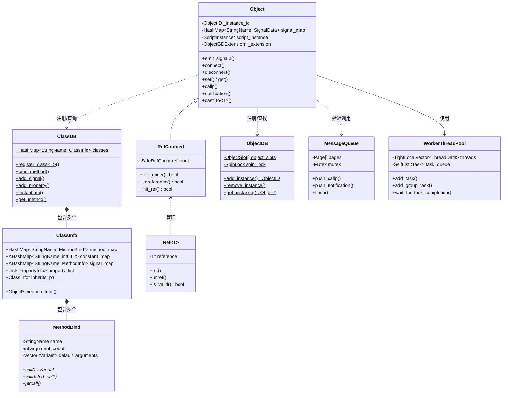

# Godot 对象系统深度分析 — UE 程序员视角

> **一句话核心结论：** Godot 用编译期宏 + 运行时 HashMap 实现了 UE 用 UHT 代码生成 + GC 标记清除才能做到的反射与生命周期管理，更轻量但也更受限。

---

## 目录

- [第 1 章：模块概览 — "UE 程序员 30 秒速览"](#第-1-章模块概览--ue-程序员-30-秒速览)
- [第 2 章：架构对比 — "同一个问题，两种解法"](#第-2-章架构对比--同一个问题两种解法)
- [第 3 章：核心实现对比 — "代码层面的差异"](#第-3-章核心实现对比--代码层面的差异)
- [第 4 章：UE → Godot 迁移指南](#第-4-章ue--godot-迁移指南)
- [第 5 章：性能对比](#第-5-章性能对比)
- [第 6 章：总结 — "一句话记住"](#第-6-章总结--一句话记住)

---

## 第 1 章：模块概览 — "UE 程序员 30 秒速览"

### 1.1 这个模块做什么？

Godot 的 **Object System**（`core/object/`）是整个引擎的基石，等价于 UE 的 **UObject 系统 + UClass 反射 + Delegate 系统**。它提供了：

- 所有引擎对象的基类 `Object`（对标 UE 的 `UObject`）
- 运行时反射系统 `ClassDB`（对标 UE 的 `UClass` / Unreal Header Tool 生成的反射数据）
- 信号槽通信机制 Signal/Slot（对标 UE 的 `FMulticastDelegate`）
- 引用计数内存管理 `RefCounted` + `Ref<T>`（对标 UE 的 `TSharedPtr` / UObject GC）
- 延迟调用消息队列 `MessageQueue`（对标 UE 的 GameThread 延迟调用）
- 工作线程池 `WorkerThreadPool`（对标 UE 的 `FQueuedThreadPool`）

### 1.2 核心类/结构体列表

| # | Godot 类/结构体 | 源码位置 | UE 对应物 | 简要说明 |
|---|----------------|---------|----------|---------|
| 1 | `Object` | `core/object/object.h` | `UObject` | 所有对象的基类，提供反射、信号、元数据 |
| 2 | `ClassDB` | `core/object/class_db.h` | `UClass` + UHT 生成代码 | 全局类注册表，存储所有反射信息 |
| 3 | `ClassDB::ClassInfo` | `core/object/class_db.h` | `UClass` 实例 | 单个类的反射元数据容器 |
| 4 | `RefCounted` | `core/object/ref_counted.h` | `UObject`（GC 管理部分） | 引用计数基类 |
| 5 | `Ref<T>` | `core/object/ref_counted.h` | `TSharedPtr<T>` / `TObjectPtr<T>` | 侵入式引用计数智能指针 |
| 6 | `MethodBind` | `core/object/method_bind.h` | `UFunction` | 方法绑定抽象基类 |
| 7 | `MethodBindT<P...>` | `core/object/method_bind.h` | UHT 生成的 `exec` 函数 | 模板化的具体方法绑定 |
| 8 | `CallQueue` / `MessageQueue` | `core/object/message_queue.h` | `FTickableGameObject` / GameThread 消息 | 延迟调用队列 |
| 9 | `WorkerThreadPool` | `core/object/worker_thread_pool.h` | `FQueuedThreadPool` | 全局工作线程池 |
| 10 | `ObjectDB` | `core/object/object.h` | `GUObjectArray` | 全局对象实例注册表 |
| 11 | `ObjectID` | `core/object/object_id.h` | `FObjectKey` / `TWeakObjectPtr` 内部 ID | 64 位对象唯一标识 |
| 12 | `PropertyInfo` | `core/object/object.h` | `FProperty` | 属性元数据描述 |
| 13 | `MethodInfo` | `core/object/object.h` | `UFunction` 元数据 | 方法元数据描述 |
| 14 | `SignalData` | `core/object/object.h`（内部） | `FMulticastDelegate` 内部存储 | 信号的连接槽存储 |
| 15 | `CallableCustomMethodPointer` | `core/object/callable_method_pointer.h` | `TBaseDelegate` | 类型安全的方法指针封装 |
| 16 | `ScriptLanguage` | `core/object/script_language.h` | `IScriptGeneratorPluginInterface` | 脚本语言抽象接口 |
| 17 | `ScriptInstance` | `core/object/script_instance.h` | Blueprint VM 实例 | 脚本实例，附加到 Object 上 |
| 18 | `WeakRef` | `core/object/ref_counted.h` | `TWeakObjectPtr<T>` | 弱引用封装 |

### 1.3 Godot vs UE 概念速查表

| 概念 | Godot | UE | 关键差异 |
|------|-------|-----|---------|
| 对象基类 | `Object` | `UObject` | Godot 无 GC，UE 有标记清除 GC |
| 类注册宏 | `GDCLASS(MyClass, Parent)` | `UCLASS()` + `GENERATED_BODY()` | Godot 纯宏展开，UE 需要 UHT 代码生成 |
| 反射数据库 | `ClassDB`（运行时 HashMap） | `UClass`（UHT 编译期生成） | Godot 运行时注册，UE 编译期生成 |
| 方法绑定 | `ClassDB::bind_method()` | `UFUNCTION()` 宏 + UHT | Godot 手动绑定，UE 自动生成 |
| 属性系统 | `ADD_PROPERTY()` + getter/setter | `UPROPERTY()` 宏 | Godot 必须手写 getter/setter |
| 事件通信 | Signal（`emit_signal` / `connect`） | Delegate（`Broadcast` / `AddDynamic`） | Godot 基于字符串名，UE 类型安全 |
| 引用计数对象 | `RefCounted` + `Ref<T>` | `UObject` GC + `TSharedPtr` | Godot 侵入式引用计数，UE 分离式 |
| 弱引用 | `WeakRef` / `ObjectID` | `TWeakObjectPtr<T>` | Godot 通过 ObjectDB 查询存活性 |
| 延迟调用 | `call_deferred()` → `MessageQueue` | `AsyncTask` / `FFunctionGraphTask` | Godot 基于页式缓冲区，UE 基于任务图 |
| 线程池 | `WorkerThreadPool` | `FQueuedThreadPool` / TaskGraph | Godot 单一全局池，UE 多级任务系统 |
| 对象实例化 | `ClassDB::instantiate("ClassName")` | `NewObject<T>()` / `SpawnActor<T>()` | Godot 字符串驱动，UE 模板驱动 |
| 类型转换 | `Object::cast_to<T>(obj)` | `Cast<T>(obj)` / `CastChecked<T>()` | 实现机制不同但语义相同 |

---

## 第 2 章：架构对比 — "同一个问题，两种解法"

### 2.1 Godot 对象系统架构



### 2.2 UE 对应模块架构（简要）

UE 的 UObject 系统架构要复杂得多：

- **UObject** 是所有对象基类，由 **垃圾回收器（GC）** 管理生命周期
- **UClass** 是每个类的反射元数据，由 **Unreal Header Tool (UHT)** 在编译前生成
- **FProperty** 系统处理属性的序列化和反射
- **Delegate** 系统（`FDelegate` / `FMulticastDelegate`）处理事件通信
- **GUObjectArray** 是全局对象注册表
- **FQueuedThreadPool** + **TaskGraph** 处理多线程任务

关键文件路径（UE）：
- `Runtime/CoreUObject/Public/UObject/Object.h` — UObject 定义
- `Runtime/CoreUObject/Public/UObject/Class.h` — UClass 定义
- `Runtime/CoreUObject/Private/UObject/UObjectGlobals.cpp` — 对象创建
- `Runtime/Core/Public/Delegates/` — Delegate 系统
- `Runtime/Core/Public/Async/TaskGraphInterfaces.h` — 任务图

### 2.3 关键架构差异分析

#### 差异 1：反射信息的生成方式 — 编译期 vs 运行时

**UE 的做法：** UE 使用 **Unreal Header Tool (UHT)** 在编译前扫描 `.h` 文件中的 `UCLASS()`、`UPROPERTY()`、`UFUNCTION()` 宏标记，然后生成 `.generated.h` 和 `.gen.cpp` 文件。这些生成的代码包含完整的反射元数据（属性偏移量、方法指针、序列化代码等）。这是一个**编译期代码生成**的方案，反射信息在编译时就已经确定。

**Godot 的做法：** Godot 完全依赖 **C++ 宏 + 运行时注册**。`GDCLASS` 宏展开后生成 `initialize_class()` 静态方法，该方法在引擎启动时被调用，通过 `ClassDB::register_class<T>()` 将类信息注册到一个全局 `HashMap<StringName, ClassInfo>` 中。方法绑定通过 `_bind_methods()` 中手动调用 `ClassDB::bind_method()` 完成。

**Trade-off 分析：** UE 的方案更强大——UHT 可以生成高效的序列化代码、自动处理属性偏移量、支持蓝图与 C++ 的无缝互操作。但代价是构建流程复杂（需要额外的代码生成步骤），编译时间更长。Godot 的方案更简单直接——不需要额外的构建工具，但开发者需要手动编写大量绑定代码（`_bind_methods` 中的 `bind_method`、`ADD_PROPERTY` 等），且反射信息的类型安全性较弱（大量依赖 `StringName` 字符串查找）。

#### 差异 2：内存管理哲学 — GC vs 引用计数 + 手动管理

**UE 的做法：** 所有 `UObject` 派生类由 **标记-清除垃圾回收器** 管理。GC 从根集（Root Set）出发，遍历所有 `UPROPERTY()` 标记的引用，标记可达对象，然后清除不可达对象。开发者不需要手动管理 UObject 的生命周期（但需要注意 `UPROPERTY()` 标记以防止被 GC 回收）。对于非 UObject 的 C++ 对象，UE 提供 `TSharedPtr` / `TWeakPtr` 智能指针。

**Godot 的做法：** Godot 采用**双轨制**：
1. **`RefCounted` 派生类**（如 `Resource`、`Script`）使用**侵入式引用计数**，通过 `Ref<T>` 智能指针自动管理。引用计数归零时立即销毁。
2. **非 `RefCounted` 的 `Object` 派生类**（如 `Node`）需要**手动管理**——必须显式调用 `memdelete()` 或 `queue_free()`。

这种设计源于 Godot 的哲学：**Node 的生命周期由场景树管理**（`add_child` / `remove_child` / `queue_free`），而 Resource 等数据对象通过引用计数自动管理。

**Trade-off 分析：** UE 的 GC 方案对开发者更友好（不用担心忘记释放），但 GC 暂停可能导致帧率抖动（尽管 UE 的增量 GC 已经很好地缓解了这个问题）。Godot 的引用计数方案确定性更强（对象在最后一个引用释放时立即销毁），没有 GC 暂停，但开发者需要更小心地管理 Node 的生命周期，忘记 `queue_free()` 会导致内存泄漏。

#### 差异 3：事件通信机制 — Signal vs Delegate

**UE 的做法：** UE 的 Delegate 系统是**编译期类型安全**的。`DECLARE_DYNAMIC_MULTICAST_DELEGATE` 宏声明一个具有固定签名的委托类型，`AddDynamic` 绑定时编译器会检查函数签名是否匹配。Delegate 内部存储的是函数指针或 `UFunction` 指针，调用时直接通过指针调用，无需字符串查找。

**Godot 的做法：** Godot 的 Signal 系统是**运行时动态**的。信号通过 `StringName` 标识，连接时通过 `Callable`（可以是方法指针、Lambda 或脚本函数）绑定。`emit_signal` 时通过 `signal_map`（HashMap）查找所有连接的槽，然后逐一调用。参数通过 `Variant` 数组传递，类型检查在运行时进行。

**Trade-off 分析：** UE 的 Delegate 更高效（直接函数指针调用，无 HashMap 查找，无 Variant 装箱/拆箱），类型安全性更好（编译期检查签名）。但 Godot 的 Signal 更灵活——可以在运行时动态创建信号（`add_user_signal`）、通过字符串名连接（适合编辑器和脚本），且天然支持跨语言调用（GDScript、C#、GDExtension 都可以连接同一个信号）。Godot 还内置了 `CONNECT_DEFERRED` 标志，可以将信号回调延迟到帧末执行，这在 UE 中需要手动实现。

---

## 第 3 章：核心实现对比 — "代码层面的差异"

### 3.1 GDCLASS 宏 vs UCLASS 宏

#### Godot：GDCLASS 宏展开

`GDCLASS(m_class, m_inherits)` 宏定义在 `core/object/object.h`，展开后生成以下关键内容：

```cpp
// 源码：core/object/object.h，GDCLASS 宏展开（简化）
#define GDCLASS(m_class, m_inherits)
    GDSOFTCLASS(m_class, m_inherits)  // 基础类型检查、_set/_get 虚函数链
private:
    void operator=(const m_class &p_rval) {}  // 禁止拷贝赋值
    friend class ::ClassDB;
public:
    // 类型系统：静态 GDType 单例
    virtual const GDType &_get_typev() const override {
        return get_gdtype_static();
    }
    static const GDType &get_gdtype_static() {
        static GDType *_class_static;
        if (unlikely(!_class_static)) {
            assign_type_static(&_class_static, #m_class, &super_type::get_gdtype_static());
        }
        return *_class_static;
    }
    static const StringName &get_class_static() {
        return get_gdtype_static().get_name();
    }

    // 类初始化：注册到 ClassDB
    static void initialize_class() {
        static bool initialized = false;
        if (initialized) return;
        m_inherits::initialize_class();  // 先初始化父类
        _add_class_to_classdb(get_gdtype_static(), &super_type::get_gdtype_static());
        if (m_class::_get_bind_methods() != m_inherits::_get_bind_methods()) {
            _bind_methods();  // 调用用户定义的绑定方法
        }
        initialized = true;
    }
```

关键点：
- **`get_class_ptr_static()`**：每个类有一个唯一的静态 `int` 地址，用于快速类型比较（`is_class_ptr`）
- **`initialize_class()`**：递归初始化继承链，确保父类先注册
- **`_bind_methods()`**：用户在此手动绑定方法、属性、信号

#### UE：UCLASS 宏 + UHT

```cpp
// UE 中的典型声明
UCLASS()
class AMyActor : public AActor {
    GENERATED_BODY()  // UHT 生成的代码入口

    UPROPERTY(EditAnywhere)
    float Health;

    UFUNCTION(BlueprintCallable)
    void TakeDamage(float Amount);
};
```

UHT 会生成 `MyActor.generated.h`，其中包含：
- `StaticClass()` 方法返回 `UClass*`
- `StaticRegisterNativesAMyActor()` 注册原生方法
- 属性偏移量宏和序列化代码
- Blueprint 可调用的 thunk 函数

#### 对比要点

| 方面 | Godot GDCLASS | UE UCLASS + UHT |
|------|--------------|-----------------|
| 代码生成 | 纯 C++ 宏展开，无外部工具 | 需要 UHT 预处理生成 `.generated.h` |
| 注册时机 | 运行时 `initialize_class()` | 编译期生成 + 运行时静态初始化 |
| 方法绑定 | 手动 `ClassDB::bind_method()` | `UFUNCTION()` 标记后自动生成 |
| 属性绑定 | 手动 `ADD_PROPERTY()` + getter/setter | `UPROPERTY()` 标记后自动处理 |
| 类型标识 | `GDType`（StringName + 指针） | `UClass*`（完整的反射对象） |
| 开发体验 | 需要大量样板代码 | 标记宏即可，UHT 自动处理 |

### 3.2 ClassDB vs UClass：反射信息存储

#### Godot ClassDB 实现

`ClassDB` 是一个纯静态类，核心数据结构定义在 `core/object/class_db.h`：

```cpp
// core/object/class_db.h
class ClassDB {
    // 全局类注册表：类名 → 类信息
    static HashMap<StringName, ClassInfo> classes;

    struct ClassInfo {
        APIType api = API_NONE;
        ClassInfo *inherits_ptr = nullptr;          // 父类指针（链表式继承链）
        void *class_ptr = nullptr;                   // 类的唯一标识指针
        const GDType *gdtype = nullptr;

        HashMap<StringName, MethodBind *> method_map;           // 方法表
        AHashMap<StringName, int64_t> constant_map;             // 常量表
        AHashMap<StringName, MethodInfo> signal_map;            // 信号表
        List<PropertyInfo> property_list;                        // 属性列表
        HashMap<StringName, PropertyInfo> property_map;          // 属性查找表
        AHashMap<StringName, PropertySetGet> property_setget;   // 属性 getter/setter

        Object *(*creation_func)(bool) = nullptr;   // 工厂函数
    };
};
```

方法查找流程：
```cpp
// core/object/class_db.cpp（简化）
MethodBind *ClassDB::get_method(const StringName &p_class, const StringName &p_name) {
    ClassInfo *type = classes.getptr(p_class);
    while (type) {
        MethodBind **method = type->method_map.getptr(p_name);
        if (method && *method) return *method;
        type = type->inherits_ptr;  // 沿继承链向上查找
    }
    return nullptr;
}
```

#### UE UClass 实现

UE 的 `UClass` 本身就是一个 `UObject`，存储在 `GUObjectArray` 中：

```cpp
// Runtime/CoreUObject/Public/UObject/Class.h（简化）
class UClass : public UStruct {
    ClassConstructorType ClassConstructor;
    ClassAddReferencedObjectsType ClassAddReferencedObjects;
    TArray<FImplementedInterface> Interfaces;
    TArray<UFunction*> FuncMap;  // 函数查找表
    // ... 大量其他元数据
};
```

#### 关键差异

| 方面 | Godot ClassDB | UE UClass |
|------|--------------|-----------|
| 数据结构 | 全局 `HashMap<StringName, ClassInfo>` | 每个类一个 `UClass` 对象（也是 UObject） |
| 方法查找 | `HashMap::getptr()` → O(1) 平均 | `TMap` 查找 → O(1) 平均 |
| 继承链遍历 | `ClassInfo::inherits_ptr` 链表 | `UStruct::SuperStruct` 指针 |
| 内存布局 | 所有类信息集中在一个 HashMap | 分散在各个 UClass 对象中 |
| 线程安全 | `RWLock`（读写锁） | 编译期确定，运行时只读 |
| 动态注册 | 支持（GDExtension 运行时注册） | 有限支持（蓝图类） |

### 3.3 Signal vs Delegate：事件通信实现

#### Godot Signal 实现

信号数据存储在每个 `Object` 实例上：

```cpp
// core/object/object.h — Object 内部
struct SignalData {
    struct Slot {
        int reference_count = 0;
        Connection conn;
        List<Connection>::Element *cE = nullptr;  // 在目标对象 connections 列表中的位置
    };
    MethodInfo user;                          // 用户自定义信号的签名
    HashMap<Callable, Slot> slot_map;         // 所有连接的槽
    bool removable = false;
};

HashMap<StringName, SignalData> signal_map;   // 信号名 → 信号数据
List<Connection> connections;                  // 连接到此对象的所有信号（反向引用）
```

**信号发射流程**（`core/object/object.cpp:1274`）：

```cpp
Error Object::emit_signalp(const StringName &p_name, const Variant **p_args, int p_argcount) {
    if (_block_signals) return ERR_CANT_ACQUIRE_RESOURCE;

    // 1. 在信号锁保护下，拷贝所有槽的 Callable 到栈/堆上
    //    （防止回调中 disconnect 导致迭代器失效）
    {
        OBJ_SIGNAL_LOCK
        SignalData *s = signal_map.getptr(p_name);
        // 拷贝 slot_callables 和 slot_flags ...
        // 断开所有 ONE_SHOT 连接
    }

    // 2. 释放锁后，逐一调用每个槽
    for (uint32_t i = 0; i < slot_count; ++i) {
        if (flags & CONNECT_DEFERRED) {
            // 延迟调用：推入 MessageQueue
            MessageQueue::get_singleton()->push_callablep(callable, args, argc, true);
        } else {
            // 立即调用
            callable.callp(args, argc, ret, ce);
        }
    }
}
```

**信号连接流程**（`core/object/object.cpp:1607`）：

```cpp
Error Object::connect(const StringName &p_signal, const Callable &p_callable, uint32_t p_flags) {
    OBJ_SIGNAL_LOCK

    SignalData *s = signal_map.getptr(p_signal);
    if (!s) {
        // 验证信号是否存在（ClassDB 或 ScriptInstance）
        signal_map[p_signal] = SignalData();
        s = &signal_map[p_signal];
    }

    // 检查是否已连接（基于 base_comparator，忽略 bind 参数）
    if (s->slot_map.has(*p_callable.get_base_comparator())) {
        if (p_flags & CONNECT_REFERENCE_COUNTED) {
            s->slot_map[...].reference_count++;
            return OK;
        }
        return ERR_INVALID_PARAMETER;  // 已连接
    }

    // 创建 Slot，建立双向引用
    SignalData::Slot slot;
    slot.conn = Connection{p_callable, Signal(this, p_signal), p_flags};
    if (target_object) {
        slot.cE = target_object->connections.push_back(slot.conn);  // 反向引用
    }
    s->slot_map[*p_callable.get_base_comparator()] = slot;
    return OK;
}
```

#### UE Delegate 实现

```cpp
// UE 中的典型用法
DECLARE_DYNAMIC_MULTICAST_DELEGATE_OneParam(FOnHealthChanged, float, NewHealth);

// 声明
UPROPERTY(BlueprintAssignable)
FOnHealthChanged OnHealthChanged;

// 绑定
OnHealthChanged.AddDynamic(this, &AMyActor::HandleHealthChanged);

// 触发
OnHealthChanged.Broadcast(NewHealth);
```

UE Delegate 内部使用 `TArray<FDelegateBase>` 存储绑定列表，`Broadcast` 直接遍历数组调用函数指针。

#### 关键差异

| 方面 | Godot Signal | UE Delegate |
|------|-------------|-------------|
| 类型安全 | 运行时检查（Variant 参数） | 编译期检查（模板参数） |
| 查找方式 | `HashMap<StringName, SignalData>` | 直接成员变量访问 |
| 参数传递 | `Variant` 数组（装箱/拆箱） | 原生 C++ 参数（零开销） |
| 动态创建 | 支持 `add_user_signal()` | 不支持运行时创建新委托类型 |
| 延迟调用 | 内置 `CONNECT_DEFERRED` | 需手动实现 |
| 跨语言 | 天然支持（GDScript/C#/GDExtension） | 需要 `UFUNCTION()` 标记 |
| 线程安全 | `signal_mutex` 保护连接操作 | 非线程安全（需在 GameThread） |
| 断开安全 | 发射时拷贝槽列表，安全断开 | 遍历时修改需特殊处理 |

### 3.4 RefCounted vs UObject GC：内存管理

#### Godot RefCounted 实现

```cpp
// core/object/ref_counted.h
class RefCounted : public Object {
    GDCLASS(RefCounted, Object);
    SafeRefCount refcount;       // 原子引用计数
    SafeRefCount refcount_init;  // 初始化引用计数（处理首次引用的特殊情况）
};
```

```cpp
// core/object/ref_counted.cpp
bool RefCounted::reference() {
    uint32_t rc_val = refcount.refval();  // 原子递增
    bool success = rc_val != 0;
    if (success && rc_val <= 2) {
        // 通知脚本实例和扩展
        if (get_script_instance()) get_script_instance()->refcount_incremented();
        if (_get_extension() && _get_extension()->reference)
            _get_extension()->reference(_get_extension_instance());
        _instance_binding_reference(true);  // 通知语言绑定
    }
    return success;
}

bool RefCounted::unreference() {
    uint32_t rc_val = refcount.unrefval();  // 原子递减
    bool die = rc_val == 0;
    if (rc_val <= 1) {
        // 通知脚本实例和扩展，它们可以阻止销毁
        bool script_ret = get_script_instance()->refcount_decremented();
        die = die && script_ret;
        bool binding_ret = _instance_binding_reference(false);
        die = die && binding_ret;
    }
    return die;
}
```

`Ref<T>` 智能指针（`core/object/ref_counted.h`）：

```cpp
template <typename T>
class Ref {
    T *reference = nullptr;

    void unref() {
        if (reference) {
            if (reinterpret_cast<RefCounted *>(reference)->unreference()) {
                memdelete(reinterpret_cast<RefCounted *>(reference));  // 引用计数归零，立即销毁
            }
            reference = nullptr;
        }
    }

    // 赋值时：增加新引用，减少旧引用
    void operator=(const Ref &p_from) {
        ref(p_from);  // 内部调用 reference() 和 unreference()
    }

    ~Ref() { unref(); }  // 析构时自动减引用
};
```

#### UE UObject GC

UE 的 GC 是**增量标记-清除**：
1. **标记阶段**：从根集（`AddToRoot()` 的对象、`UPROPERTY()` 引用链）出发，标记所有可达对象
2. **清除阶段**：销毁所有未标记的对象
3. **增量执行**：GC 分帧执行，避免长时间暂停

```cpp
// UE 中的典型用法
UPROPERTY()
UMyObject* MyRef;  // GC 会追踪这个引用

TSharedPtr<FMyStruct> SharedData;  // 非 UObject 用 TSharedPtr
TWeakObjectPtr<AActor> WeakActor;  // 弱引用，不阻止 GC
```

#### 关键差异

| 方面 | Godot RefCounted + Ref<T> | UE UObject GC |
|------|--------------------------|---------------|
| 算法 | 侵入式引用计数 | 标记-清除 GC |
| 销毁时机 | 引用计数归零时**立即销毁** | GC 周期时**批量销毁** |
| 循环引用 | **无法处理**（会泄漏） | **自动处理** |
| 性能开销 | 每次引用/解引用有原子操作 | GC 暂停（增量缓解） |
| 确定性 | 析构时机确定 | 析构时机不确定 |
| 适用范围 | 仅 RefCounted 子类 | 所有 UObject |
| 非引用计数对象 | Node 等需手动 `queue_free()` | 统一由 GC 管理 |

### 3.5 Ref<T> vs TSharedPtr<T>：智能指针对比

| 方面 | Godot `Ref<T>` | UE `TSharedPtr<T>` |
|------|----------------|---------------------|
| 类型 | 侵入式（计数在对象内部） | 非侵入式（计数在控制块） |
| 约束 | T 必须继承 `RefCounted` | T 可以是任意类型 |
| 线程安全 | `SafeRefCount`（原子操作） | `ESPMode::ThreadSafe` 可选 |
| 弱引用 | `WeakRef`（通过 ObjectDB） | `TWeakPtr<T>`（控制块弱计数） |
| 内存开销 | 无额外开销（计数在对象中） | 额外控制块（16-32 字节） |
| 与 GC 交互 | 无 GC | `TSharedPtr` 不参与 UObject GC |

### 3.6 MethodBind vs UFunction：方法绑定

#### Godot MethodBind

`MethodBind` 是一个抽象基类（`core/object/method_bind.h`），通过模板特化实现类型安全的方法调用：

```cpp
// core/object/method_bind.h
class MethodBind {
    int method_id;
    StringName name;
    StringName instance_class;
    Vector<Variant> default_arguments;
    int argument_count;

    // 三种调用方式
    virtual Variant call(Object *p_object, const Variant **p_args, int p_arg_count,
                         Callable::CallError &r_error) const = 0;
    virtual void validated_call(Object *p_object, const Variant **p_args,
                                Variant *r_ret) const = 0;
    virtual void ptrcall(Object *p_object, const void **p_args, void *r_ret) const = 0;
};

// 模板特化示例：有返回值、非 const
template <typename T, typename R, typename... P>
class MethodBindTR : public MethodBind {
    R (T::*method)(P...);  // 成员函数指针

    virtual Variant call(Object *p_object, ...) const override {
        Variant ret;
        call_with_variant_args_ret_dv(static_cast<T *>(p_object), method,
                                       p_args, p_arg_count, ret, r_error,
                                       get_default_arguments());
        return ret;
    }
};
```

三种调用路径的性能层次：
1. **`call()`**：通过 `Variant` 参数调用，最慢但最灵活（GDScript 使用）
2. **`validated_call()`**：参数已验证，跳过类型检查（优化的 GDScript 使用）
3. **`ptrcall()`**：直接指针调用，最快（GDExtension / C# 使用）

#### UE UFunction

UE 的 `UFunction` 是一个 `UStruct`，包含函数的完整反射信息。调用时通过 `ProcessEvent` 机制：

```cpp
// UE 调用流程（简化）
void AActor::ProcessEvent(UFunction* Function, void* Parms) {
    // 1. 检查是否是蓝图函数
    // 2. 如果是原生函数，直接调用 Function->GetNativeFunc()
    // 3. 如果是蓝图函数，进入 VM 执行
}
```

#### 关键差异

| 方面 | Godot MethodBind | UE UFunction |
|------|-----------------|--------------|
| 存储 | `ClassInfo::method_map` (HashMap) | `UClass::FuncMap` (TMap) |
| 调用层次 | 3 层（call/validated/ptrcall） | 2 层（ProcessEvent/NativeCall） |
| 参数传递 | Variant 数组 或 void* 数组 | 栈帧（FFrame） |
| 默认参数 | `Vector<Variant>` 存储 | UHT 生成的默认值代码 |
| 蓝图/脚本 | 通过 ScriptInstance 转发 | 通过 Blueprint VM 执行 |

### 3.7 MessageQueue vs GameThread 消息

#### Godot MessageQueue

`MessageQueue`（`core/object/message_queue.h/cpp`）是一个**页式缓冲区**的延迟调用队列：

```cpp
// core/object/message_queue.h
class CallQueue {
    enum { PAGE_SIZE_BYTES = 4096 };

    struct Page { uint8_t data[PAGE_SIZE_BYTES]; };

    LocalVector<Page *> pages;
    LocalVector<uint32_t> page_bytes;
    uint32_t pages_used = 0;
    bool flushing = false;

    struct Message {
        Callable callable;
        int16_t type;       // TYPE_CALL / TYPE_NOTIFICATION / TYPE_SET
        union {
            int16_t notification;
            int16_t args;
        };
    };
};
```

**工作流程：**
1. `call_deferred("method", args)` → `MessageQueue::push_callp()` 将消息序列化到页缓冲区
2. 每帧主循环调用 `MessageQueue::flush()` → 遍历所有页，逐条执行消息
3. 支持线程本地队列（`thread_singleton`），避免跨线程锁竞争

```cpp
// core/object/message_queue.cpp — flush 核心逻辑
Error CallQueue::flush() {
    flushing = true;
    while (i < pages_used && offset < page_bytes[i]) {
        Message *message = (Message *)&page->data[offset];
        Object *target = message->callable.get_object();

        UNLOCK_MUTEX;  // 释放锁，允许回调中重新入队

        switch (message->type & FLAG_MASK) {
            case TYPE_CALL:
                _call_function(message->callable, args, message->args, ...);
                break;
            case TYPE_NOTIFICATION:
                target->notification(message->notification);
                break;
            case TYPE_SET:
                target->set(message->callable.get_method(), *arg);
                break;
        }

        LOCK_MUTEX;
    }
    flushing = false;
}
```

#### UE 对应机制

UE 没有单一的 MessageQueue，而是通过多种机制实现延迟调用：
- **`AsyncTask(ENamedThreads::GameThread, [](){ ... })`**：将 Lambda 投递到 GameThread
- **`FTicker`**：每帧 Tick 回调
- **`FTimerManager`**：定时器延迟调用
- **TaskGraph**：复杂的任务依赖图

#### 关键差异

| 方面 | Godot MessageQueue | UE GameThread 消息 |
|------|-------------------|-------------------|
| 数据结构 | 页式缓冲区（4KB 页） | 任务队列 / Lambda 队列 |
| 消息类型 | Call / Notification / Set | 任意 Lambda / Task |
| 线程模型 | 主队列 + 线程本地队列 | 命名线程 + TaskGraph |
| 内存管理 | PagedAllocator 预分配 | 标准堆分配 |
| 重入安全 | flush 时释放锁允许重入 | 不同机制不同策略 |
| 容量限制 | 可配置 max_pages（默认 32MB） | 无硬限制 |

### 3.8 WorkerThreadPool vs FQueuedThreadPool

#### Godot WorkerThreadPool

```cpp
// core/object/worker_thread_pool.h
class WorkerThreadPool : public Object {
    // 任务队列（高/低优先级）
    SelfList<Task>::List task_queue;          // 高优先级
    SelfList<Task>::List low_priority_task_queue;  // 低优先级

    TightLocalVector<ThreadData> threads;     // 工作线程数组
    BinaryMutex task_mutex;                   // 全局任务锁

    // 任务提交
    TaskID add_task(const Callable &p_action, bool p_high_priority = false, ...);
    GroupID add_group_task(const Callable &p_action, int p_elements, int p_tasks = -1, ...);

    // 协作式等待
    void _wait_collaboratively(ThreadData *p_caller, Task *p_task);
};
```

关键特性：
- **协作式等待**：等待任务完成时，当前线程会去执行其他任务（避免线程空转）
- **Group Task**：将一个任务拆分为多个子任务并行执行（类似 parallel_for）
- **优先级**：高优先级任务优先调度，低优先级任务在空闲时执行
- **Yield 机制**：任务可以主动让出执行权

#### UE FQueuedThreadPool + TaskGraph

UE 有更复杂的多级线程系统：
- **FQueuedThreadPool**：简单的线程池，类似 Godot 的 WorkerThreadPool
- **TaskGraph**：基于依赖关系的任务调度系统，支持命名线程
- **ParallelFor**：并行循环，类似 Godot 的 `add_group_task`

#### 关键差异

| 方面 | Godot WorkerThreadPool | UE TaskGraph + ThreadPool |
|------|----------------------|--------------------------|
| 架构 | 单一全局线程池 | 多级系统（TaskGraph + 多个 Pool） |
| 任务依赖 | 无（手动 wait） | 内置依赖图 |
| 命名线程 | 不支持 | 支持（GameThread, RenderThread 等） |
| 协作等待 | 内置（等待时执行其他任务） | TaskGraph 内置 |
| 优先级 | 2 级（高/低） | 多级优先级 |
| Group Task | 内置 `add_group_task` | `ParallelFor` |

### 3.9 Object 生命周期对比

#### Godot Object 生命周期

```
构造函数 Object() / Object(bool p_reference)
    ↓
_construct_object() → ObjectDB::add_instance() → 分配 ObjectID
    ↓
_initialize() → _initialize_classv() → initialize_class()
    ↓
_postinitialize() → notification(NOTIFICATION_POSTINITIALIZE)
    ↓
[对象使用中...]
    ↓
_predelete() → notification(NOTIFICATION_PREDELETE)
    ↓
~Object() → 断开所有信号 → ObjectDB::remove_instance()
```

#### UE UObject 生命周期

```
StaticAllocateObject() → 分配内存
    ↓
构造函数 UObject()
    ↓
PostInitProperties() → 初始化属性默认值
    ↓
PostLoad() → 加载后处理（反序列化场景）
    ↓
BeginPlay() → 游戏开始（仅 Actor/Component）
    ↓
[对象使用中...]
    ↓
EndPlay() → 游戏结束
    ↓
BeginDestroy() → 开始销毁
    ↓
FinishDestroy() → 完成销毁
    ↓
~UObject() → GC 回收内存
```

#### 关键差异

| 阶段 | Godot | UE |
|------|-------|-----|
| 初始化 | `NOTIFICATION_POSTINITIALIZE` | `PostInitProperties()` |
| 进入场景 | `_ready()` / `NOTIFICATION_READY` | `BeginPlay()` |
| 每帧更新 | `_process()` / `_physics_process()` | `Tick()` |
| 退出场景 | `NOTIFICATION_EXIT_TREE` | `EndPlay()` |
| 销毁前 | `NOTIFICATION_PREDELETE` | `BeginDestroy()` |
| 销毁 | `~Object()` + `memdelete` | `FinishDestroy()` + GC |

---

## 第 4 章：UE → Godot 迁移指南

### 4.1 思维转换清单

1. **忘掉 GC，拥抱手动管理 + 引用计数**
   - UE 中你只需要 `UPROPERTY()` 标记引用，GC 会处理一切。在 Godot 中，`Node` 必须手动 `queue_free()`，`RefCounted` 子类用 `Ref<T>` 管理。忘记释放 Node 是 Godot 新手最常见的内存泄漏原因。

2. **忘掉 UHT，习惯手动绑定**
   - UE 中 `UFUNCTION()` / `UPROPERTY()` 标记后一切自动。Godot 中你必须在 `_bind_methods()` 中手动调用 `ClassDB::bind_method()`、`ADD_PROPERTY()`、`ADD_SIGNAL()` 等。这很繁琐但也很透明。

3. **忘掉 Delegate 类型安全，接受 Signal 的动态性**
   - UE 的 Delegate 在编译期检查签名。Godot 的 Signal 通过字符串名连接，参数通过 Variant 传递，类型错误只在运行时发现。好处是灵活性极高，坏处是容易拼错信号名。

4. **忘掉 Component 模式，拥抱 Node 树**
   - UE 用 `AActor` + `UActorComponent` 组合。Godot 用 **Node 树**——一切皆 Node，通过父子关系组合功能。这是最大的思维转变。

5. **忘掉 Blueprint VM，拥抱 GDScript 的轻量级**
   - UE 的 Blueprint 是完整的可视化编程语言，有自己的 VM。Godot 的 GDScript 是轻量级脚本语言，直接与 Object 系统集成（通过 `ScriptInstance`）。

6. **忘掉 `Cast<T>()`，使用 `Object::cast_to<T>()`**
   - 语义相同，但 Godot 的实现更轻量——通过 `is_class_ptr()` 比较静态指针地址，或通过 `AncestralClass` 位域快速判断常见基类。

7. **忘掉 `ProcessEvent`，使用 `callp` / `call`**
   - Godot 的方法调用通过 `Object::callp()` → `ClassDB::get_method()` → `MethodBind::call()`，比 UE 的 `ProcessEvent` 更直接。

### 4.2 API 映射表

| UE API | Godot 等价 API | 说明 |
|--------|---------------|------|
| `NewObject<T>()` | `memnew(T)` 或 `ClassDB::instantiate("T")` | 对象创建 |
| `Cast<T>(obj)` | `Object::cast_to<T>(obj)` | 类型转换 |
| `IsValid(obj)` | `ObjectDB::get_instance(id) != nullptr` | 对象存活检查 |
| `obj->IsA<T>()` | `obj->is_class("T")` 或 `obj->derives_from<T>()` | 类型检查 |
| `UPROPERTY()` | `ADD_PROPERTY()` + getter/setter | 属性声明 |
| `UFUNCTION()` | `ClassDB::bind_method()` | 方法绑定 |
| `DECLARE_DELEGATE` | `Signal` + `ADD_SIGNAL()` | 事件声明 |
| `Delegate.AddDynamic()` | `obj->connect("signal", callable)` | 事件绑定 |
| `Delegate.Broadcast()` | `obj->emit_signal("signal", args...)` | 事件触发 |
| `TSharedPtr<T>` | `Ref<T>`（仅 RefCounted 子类） | 智能指针 |
| `TWeakObjectPtr<T>` | `WeakRef` 或保存 `ObjectID` | 弱引用 |
| `AsyncTask(GameThread, ...)` | `call_deferred("method", args)` | 延迟到主线程 |
| `ParallelFor(...)` | `WorkerThreadPool::add_group_task()` | 并行循环 |
| `FQueuedThreadPool::AddQueuedWork()` | `WorkerThreadPool::add_task()` | 提交异步任务 |
| `GetWorld()->SpawnActor<T>()` | `node.add_child(memnew(T))` | 添加到场景 |
| `Destroy()` / `DestroyActor()` | `queue_free()` 或 `memdelete(obj)` | 销毁对象 |

### 4.3 陷阱与误区

#### 陷阱 1：Node 忘记 `queue_free()` 导致内存泄漏

```gdscript
# ❌ 错误：从场景树移除但没有释放
remove_child(child_node)
# child_node 仍然存在于内存中！

# ✅ 正确：移除并释放
child_node.queue_free()
```

UE 程序员习惯了 GC 自动回收，在 Godot 中必须记住：**`remove_child()` 不会释放 Node**，必须显式调用 `queue_free()` 或 `free()`。

#### 陷阱 2：信号名拼写错误不会编译报错

```gdscript
# ❌ 这不会编译报错，但运行时会失败
connect("heath_changed", _on_health_changed)  # 拼错了 "health"

# ✅ 使用信号引用（Godot 4.x）
health_changed.connect(_on_health_changed)
```

UE 的 `AddDynamic` 在编译期检查函数签名，而 Godot 的 `connect()` 使用字符串名，拼写错误只在运行时报错。建议使用 Godot 4 的信号引用语法。

#### 陷阱 3：循环引用导致 RefCounted 泄漏

```cpp
// ❌ 循环引用：A 引用 B，B 引用 A，两者都不会被释放
Ref<ResourceA> a;
Ref<ResourceB> b;
a->set_b(b);
b->set_a(a);  // 引用计数永远不会归零！

// ✅ 使用 WeakRef 打破循环
// 或者重新设计，避免双向强引用
```

UE 的 GC 可以处理循环引用，但 Godot 的引用计数不行。这是从 UE 迁移时最容易忽视的问题。

#### 陷阱 4：在非主线程直接操作场景树

```cpp
// ❌ 错误：在工作线程中直接修改场景树
WorkerThreadPool::get_singleton()->add_task(callable_mp(this, &MyNode::_modify_tree));

// ✅ 正确：使用 call_deferred 延迟到主线程
call_deferred("_modify_tree");
```

与 UE 类似，Godot 的场景树操作必须在主线程进行。但 Godot 的 `call_deferred` 比 UE 的 `AsyncTask(GameThread, ...)` 更方便。

### 4.4 最佳实践

1. **优先使用 `callable_mp()` 而非字符串连接信号**
   ```cpp
   // ✅ 类型安全，IDE 可以跳转
   button->connect("pressed", callable_mp(this, &MyClass::_on_button_pressed));
   ```

2. **Resource 类继承 RefCounted，用 `Ref<T>` 管理**
   ```cpp
   Ref<MyResource> res;
   res.instantiate();  // 自动管理生命周期
   ```

3. **利用 `CONNECT_DEFERRED` 避免信号回调中的重入问题**
   ```cpp
   connect("value_changed", callable_mp(this, &MyClass::_on_value_changed),
           CONNECT_DEFERRED);
   ```

4. **使用 `ObjectID` 而非裸指针存储对象引用**
   ```cpp
   ObjectID target_id = target->get_instance_id();
   // 后续使用时验证
   Object *obj = ObjectDB::get_instance(target_id);
   if (obj) { /* 安全使用 */ }
   ```

---

## 第 5 章：性能对比

### 5.1 Godot 对象系统性能特征

#### 方法调用开销

Godot 的方法调用有三个层次，性能差异显著：

| 调用方式 | 路径 | 相对开销 | 使用场景 |
|---------|------|---------|---------|
| `ptrcall` | 直接函数指针 | ~1x（接近原生） | GDExtension / C# 绑定 |
| `validated_call` | 跳过类型检查的 Variant 调用 | ~3-5x | 优化的 GDScript |
| `call` | 完整 Variant 装箱/拆箱 | ~10-20x | 通用 GDScript / 动态调用 |

**瓶颈分析：** `call()` 路径的主要开销来自：
1. `ClassDB::get_method()` 的 HashMap 查找
2. `Variant` 参数的装箱/拆箱
3. 默认参数的处理

#### 信号发射开销

信号发射的开销主要来自：
1. `signal_map.getptr(p_name)` — HashMap 查找信号数据
2. 拷贝所有 slot 的 Callable 到临时数组（防止回调中 disconnect）
3. 逐一调用每个 Callable（如果是 `CONNECT_DEFERRED`，则推入 MessageQueue）

对于连接数较少（< 5）的信号，Godot 使用栈上数组避免堆分配：
```cpp
constexpr int MAX_SLOTS_ON_STACK = 5;
alignas(Callable) uint8_t slot_callable_stack[sizeof(Callable) * MAX_SLOTS_ON_STACK];
```

#### MessageQueue 性能

MessageQueue 使用 4KB 页式缓冲区，`flush()` 时顺序遍历所有页：
- **优点**：内存局部性好，顺序访问对缓存友好
- **缺点**：每条消息都需要 `Variant` 参数的构造/析构
- **容量**：默认 32MB（`memory/limits/message_queue/max_size_mb`），超出会报错

#### ObjectDB 查找性能

`ObjectDB::get_instance()` 使用 SpinLock + 数组索引：
```cpp
static Object *get_instance(ObjectID p_instance_id) {
    uint32_t slot = id & OBJECTDB_SLOT_MAX_COUNT_MASK;
    spin_lock.lock();
    // 验证 validator
    Object *object = object_slots[slot].object;
    spin_lock.unlock();
    return object;
}
```
- **O(1)** 查找，非常快
- SpinLock 在低竞争场景下开销极小
- 但在高并发场景下可能成为瓶颈

### 5.2 与 UE 的性能差异

| 操作 | Godot | UE | 分析 |
|------|-------|-----|------|
| 反射方法调用 | HashMap 查找 + Variant 装箱 | ProcessEvent + 栈帧 | UE 更快（无 Variant 开销） |
| 信号/委托触发 | HashMap 查找 + Callable 拷贝 | 数组遍历 + 直接调用 | UE 更快（无 HashMap，无 Variant） |
| 对象创建 | `memnew` + ObjectDB 注册 | `StaticAllocateObject` + GC 注册 | 相近，Godot 略快（无 GC 开销） |
| 对象销毁 | 立即销毁（引用计数归零） | 延迟销毁（GC 周期） | Godot 更确定，UE 更平滑 |
| 类型转换 | `is_class_ptr` 指针比较 | `IsA` 类链遍历 | Godot 更快（O(1) 指针比较） |
| 属性访问 | HashMap 查找 getter/setter | 直接偏移量访问 | UE 更快（编译期确定偏移量） |

### 5.3 性能敏感场景建议

1. **高频方法调用**：避免使用 `call()` 字符串调用，优先使用 C++ 直接调用或 `ptrcall`
2. **大量信号连接**：如果一个信号有 > 100 个连接，考虑使用自定义的观察者模式替代
3. **频繁对象创建/销毁**：使用对象池模式，避免频繁的 ObjectDB 注册/注销
4. **跨线程通信**：使用 `WorkerThreadPool` 而非手动创建线程，利用协作式等待避免线程空转
5. **MessageQueue 溢出**：监控 `call_deferred` 的使用频率，避免每帧推入大量延迟调用

---

## 第 6 章：总结 — "一句话记住"

### 核心差异一句话

> **Godot 用"宏 + HashMap + 引用计数"实现了 UE 用"UHT 代码生成 + GC + 类型安全委托"才能做到的对象系统，更轻量、更透明，但也更手动、更受限。**

### 设计亮点（Godot 做得好的地方）

1. **零外部工具依赖**：不需要 UHT 这样的代码生成工具，纯 C++ 宏就能实现反射，构建流程更简单
2. **确定性内存管理**：引用计数的析构时机完全确定，没有 GC 暂停，适合对延迟敏感的场景
3. **Signal 的灵活性**：内置 `CONNECT_DEFERRED`、`CONNECT_ONE_SHOT`、`CONNECT_REFERENCE_COUNTED` 等标志，比 UE Delegate 更灵活
4. **`cast_to<T>` 的 O(1) 快速路径**：通过 `AncestralClass` 位域，常见类型（Node、Resource 等）的类型检查只需一次位运算
5. **MessageQueue 的页式设计**：内存局部性好，避免频繁堆分配
6. **WorkerThreadPool 的协作式等待**：等待任务时不会浪费线程，而是去执行其他任务
7. **ObjectDB 的 Slot 复用设计**：使用 validator + slot 索引的方式，既能 O(1) 查找，又能检测悬空引用

### 设计短板（Godot 不如 UE 的地方）

1. **大量手动绑定代码**：每个方法、属性、信号都需要手动在 `_bind_methods()` 中注册，容易遗漏且维护成本高
2. **无法处理循环引用**：引用计数的固有缺陷，UE 的 GC 可以自动处理
3. **Signal 缺乏编译期类型安全**：信号名和参数类型都是运行时检查，拼写错误不会编译报错
4. **单一线程池**：相比 UE 的 TaskGraph + 命名线程 + 多级线程池，Godot 的线程模型更简单但也更受限
5. **Variant 装箱开销**：反射调用必须经过 Variant 转换，对性能敏感的代码不友好
6. **属性访问需要 HashMap 查找**：UE 通过编译期偏移量直接访问属性，Godot 需要运行时查找 getter/setter

### UE 程序员的学习路径建议

**推荐阅读顺序：**

1. **`core/object/object.h`** — 先理解 `GDCLASS` 宏和 `Object` 基类，这是一切的基础
2. **`core/object/class_db.h`** — 理解 `ClassInfo` 结构和 `ClassDB` 的注册/查询机制
3. **`core/object/ref_counted.h`** — 理解 `RefCounted` 和 `Ref<T>`，对比 UE 的 GC
4. **`core/object/method_bind.h`** — 理解方法绑定的模板机制，对比 UE 的 `UFunction`
5. **`core/object/callable_method_pointer.h`** — 理解 `callable_mp` 宏，这是连接信号的推荐方式
6. **`core/object/message_queue.h/cpp`** — 理解延迟调用机制
7. **`core/object/worker_thread_pool.h`** — 理解线程池设计
8. **`core/object/script_language.h`** — 理解脚本语言如何与对象系统集成

**实践建议：**
- 从一个简单的自定义 `Node` 子类开始，体验 `GDCLASS`、`_bind_methods`、Signal 的完整流程
- 创建一个 `RefCounted` 子类，体验 `Ref<T>` 的生命周期管理
- 尝试用 `callable_mp` 连接信号，对比 UE 的 `AddDynamic`
- 阅读 `core/object/object.cpp` 中的 `emit_signalp` 和 `connect` 实现，理解信号的内部机制

---

*本报告基于 Godot Engine 源码（`core/object/` 目录）分析生成，所有源码路径均相对于 Godot 引擎根目录。*
