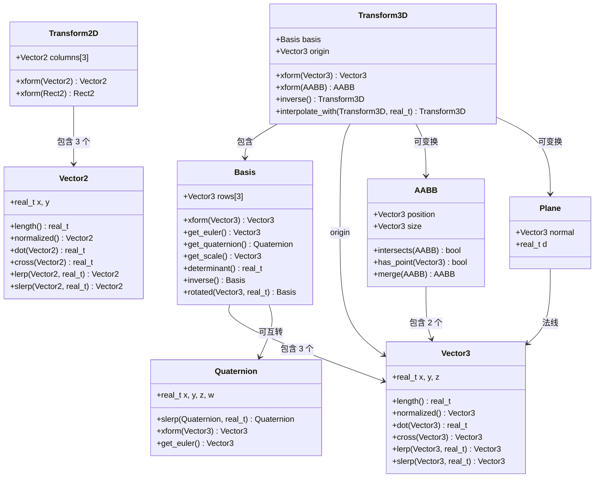

# Godot 数学库 (Math Library) 深度分析报告

> **核心结论**：Godot 用轻量级 POD 结构体 + 3×3 Basis 矩阵实现变换，UE 用 SIMD 向量化 FQuat+FVector+Scale3D 三元组实现变换——前者简洁可读，后者极致性能。

---

## 目录

- [第 1 章：模块概览 — "UE 程序员 30 秒速览"](#第-1-章模块概览--ue-程序员-30-秒速览)
- [第 2 章：架构对比 — "同一个问题，两种解法"](#第-2-章架构对比--同一个问题两种解法)
- [第 3 章：核心实现对比 — "代码层面的差异"](#第-3-章核心实现对比--代码层面的差异)
- [第 4 章：UE → Godot 迁移指南](#第-4-章ue--godot-迁移指南)
- [第 5 章：性能对比](#第-5-章性能对比)
- [第 6 章：总结 — "一句话记住"](#第-6-章总结--一句话记住)

---

## 第 1 章：模块概览 — "UE 程序员 30 秒速览"

### 一句话说明

Godot 的 `core/math/` 模块提供了向量、矩阵、变换、四元数、AABB、几何工具等全套数学基础设施，对应 UE 的 `Runtime/Core/Public/Math/` 模块（FVector、FMatrix、FTransform、FQuat 等），但 Godot 采用纯 C++ POD 结构体实现，不依赖 SIMD 内联函数，设计哲学是**简洁优先**而非**性能极致**。

### 核心类/结构体列表

| # | Godot 类型 | 源码路径 | UE 对应物 | 说明 |
|---|-----------|---------|----------|------|
| 1 | `Vector2` | `core/math/vector2.h` | `FVector2D` | 2D 向量，real_t 精度 |
| 2 | `Vector3` | `core/math/vector3.h` | `FVector` | 3D 向量，核心数学类型 |
| 3 | `Vector4` | `core/math/vector4.h` | `FVector4` | 4D 向量 |
| 4 | `Basis` | `core/math/basis.h` | `FMatrix`（3×3 子集）/ `FRotationMatrix` | **3×3 旋转+缩放矩阵**，Godot 独有概念 |
| 5 | `Transform3D` | `core/math/transform_3d.h` | `FTransform` | 3D 变换 = Basis + Origin |
| 6 | `Transform2D` | `core/math/transform_2d.h` | `FTransform2D` | 2D 变换 |
| 7 | `Quaternion` | `core/math/quaternion.h` | `FQuat` | 四元数旋转 |
| 8 | `AABB` | `core/math/aabb.h` | `FBox` | 轴对齐包围盒 |
| 9 | `Plane` | `core/math/plane.h` | `FPlane` | 平面方程 |
| 10 | `Rect2` | `core/math/rect2.h` | `FBox2D` | 2D 矩形 |
| 11 | `Geometry3D` | `core/math/geometry_3d.h` | `FMath` + 各种几何工具 | 3D 几何工具类（静态方法集） |
| 12 | `Geometry2D` | `core/math/geometry_2d.h` | `FMath` 2D 部分 | 2D 几何工具类 |
| 13 | `Math` (namespace) | `core/math/math_funcs.h` | `FMath` | 数学函数命名空间 |
| 14 | `Color` | `core/math/color.h` | `FLinearColor` / `FColor` | 颜色表示 |
| 15 | `Face3` | `core/math/face3.h` | 无直接对应 | 三角面片 |

### Godot vs UE 概念速查表

| 概念 | Godot | UE | 关键差异 |
|------|-------|-----|---------|
| 3D 向量 | `Vector3` (real_t) | `FVector` (float/double) | Godot 通过编译宏切换精度；UE 5.0+ 用 LWC |
| 旋转表示 | `Basis` (3×3 矩阵) | `FQuat` (四元数) + `FRotator` (欧拉角) | Godot 以矩阵为核心，UE 以四元数为核心 |
| 3D 变换 | `Transform3D` = `Basis` + `Vector3` | `FTransform` = `FQuat` + `FVector` + `FVector` (Scale) | 组合方式完全不同 |
| 坐标系 | Y-up 右手系 | Z-up 左手系 | **最大的迁移障碍** |
| AABB | `AABB` (position + size) | `FBox` (Min + Max) | 存储方式不同 |
| 数学精度 | `REAL_T_IS_DOUBLE` 编译选项 | LWC (Large World Coordinates) | Godot 全局切换，UE 选择性双精度 |
| SIMD 优化 | **无** | SSE/NEON 全面向量化 | 性能差异的根源 |
| 矩阵维度 | 3×3 (`Basis`) + 平移 | 4×4 (`FMatrix`) | Godot 更紧凑 |
| 前方向 | -Z (FORWARD = {0,0,-1}) | +X (ForwardVector = {1,0,0}) | 需要特别注意 |
| 变换组合 | `xform()` 方法 | `TransformPosition()` / `operator*` | API 风格差异 |

---

## 第 2 章：架构对比 — "同一个问题，两种解法"

### 2.1 Godot 数学库架构

Godot 的数学库位于 `core/math/` 目录下，所有数学类型都是**纯 POD 结构体**（Plain Old Data），没有虚函数、没有继承层次、没有引用计数。这是一个极其扁平的设计。



**核心设计特点**：
- **Basis 是旋转的核心表示**：不同于 UE 以四元数为核心，Godot 选择 3×3 矩阵作为变换的旋转+缩放部分
- **所有类型都是值类型**：使用 `[[nodiscard]]` 属性标记，鼓励函数式编程风格
- **union 技巧**：Vector3 使用 `union { struct { real_t x, y, z; }; real_t coord[3]; }` 同时支持命名访问和索引访问
- **编译期精度切换**：通过 `REAL_T_IS_DOUBLE` 宏在 float/double 之间切换（`core/math/math_defs.h`）

### 2.2 UE 数学库架构

UE 的数学库位于 `Engine/Source/Runtime/Core/Public/Math/`，设计哲学是**性能优先、SIMD 驱动**。

**核心设计特点**：
- **FTransform 使用 VectorRegister**：在 `TransformVectorized.h` 中，Rotation、Translation、Scale3D 都存储为 `VectorRegister`（即 `__m128` SSE 寄存器类型），16 字节对齐
- **FQuat 是旋转的核心表示**：FTransform 内部存储四元数而非矩阵
- **双版本实现**：`Transform.h` 同时包含 `TransformVectorized.h` 和 `TransformNonVectorized.h`，通过 `ENABLE_VECTORIZED_TRANSFORM` 宏选择
- **FMatrix 是 4×4 矩阵**：用于渲染管线，与 FTransform 是不同的类型
- **丰富的矩阵工厂类**：`FRotationMatrix`、`FScaleMatrix`、`FTranslationMatrix` 等专用矩阵类

### 2.3 关键架构差异分析

#### 差异 1：旋转的核心表示 — Basis (3×3 矩阵) vs FQuat (四元数)

这是两个引擎数学库最根本的设计分歧。Godot 选择 `Basis`（3×3 矩阵）作为 `Transform3D` 的旋转+缩放部分，而 UE 选择 `FQuat`（四元数）+ 独立的 `Scale3D` 向量。

**Godot 的选择理由**（源码证据：`core/math/transform_3d.h`）：
```cpp
struct Transform3D {
    Basis basis;      // 3×3 矩阵，同时编码旋转和缩放
    Vector3 origin;   // 平移
};
```

Basis 将旋转和缩放统一编码在一个 3×3 矩阵中，这意味着：
- 变换向量只需一次矩阵乘法 + 加法：`basis.xform(v) + origin`
- 缩放信息隐含在矩阵中，不需要额外存储
- 支持非均匀缩放和剪切（shear），无需特殊处理
- 代价是存储 9 个 real_t（vs FTransform 的 10 个 float：4 quat + 3 translation + 3 scale）

**UE 的选择理由**（源码证据：`Engine/Source/Runtime/Core/Public/Math/TransformVectorized.h`）：
```cpp
MS_ALIGN(16) struct FTransform {
    VectorRegister Rotation;     // FQuat，4 个 float
    VectorRegister Translation;  // FVector，3 个 float + padding
    VectorRegister Scale3D;      // FVector，3 个 float + padding
};
```

UE 将旋转、平移、缩放分离存储，这意味着：
- 四元数插值（slerp）天然高效，动画系统受益巨大
- SIMD 友好：每个分量恰好填满一个 128-bit 寄存器
- 旋转组合只需四元数乘法（16 次乘法 + 12 次加法），比矩阵乘法（27 次乘法 + 18 次加法）更快
- 代价是非均匀缩放需要额外处理，且 Rotation 必须保持归一化

**Trade-off 总结**：Godot 的 Basis 方案更通用（天然支持剪切和非均匀缩放），代码更直观；UE 的 FQuat+Scale 方案更适合动画密集型场景，SIMD 优化空间更大。对于 99% 的游戏场景（均匀或轴对齐缩放），UE 的方案性能更优。

#### 差异 2：SIMD 优化策略 — 零 SIMD vs 全面向量化

这是两个引擎数学库性能差异的根源。在 Godot 的 `core/math/` 目录中，**没有任何 SSE/NEON 内联函数**。所有运算都是标量 C++ 代码：

```cpp
// Godot: core/math/vector3.h — 纯标量实现
real_t Vector3::length() const {
    real_t x2 = x * x;
    real_t y2 = y * y;
    real_t z2 = z * z;
    return Math::sqrt(x2 + y2 + z2);
}
```

而 UE 的数学库从底层就围绕 SIMD 设计（`Engine/Source/Runtime/Core/Public/Math/UnrealMathSSE.h`）：

```cpp
// UE: UnrealMathSSE.h — SSE 向量化实现
typedef __m128 VectorRegister;

FORCEINLINE VectorRegister VectorDot3(const VectorRegister& Vec1, const VectorRegister& Vec2) {
    VectorRegister Temp = VectorMultiply(Vec1, Vec2);
    // ... SSE shuffle + add 实现
}
```

Godot 依赖编译器自动向量化（auto-vectorization），而 UE 手写 SIMD 内联函数确保最优指令生成。这在热路径（如骨骼动画、物理碰撞检测）上会产生 2-4 倍的性能差距。

**Godot 的设计考量**：
- 代码可读性和可维护性优先
- 支持更多平台（包括不支持 SSE 的嵌入式平台）
- 引擎规模较小，维护 SIMD 代码的人力成本高
- `REAL_T_IS_DOUBLE` 模式下 SSE 优势减弱（需要 AVX 才能处理 double）

#### 差异 3：坐标系 — Y-up 右手系 vs Z-up 左手系

这不仅是一个约定差异，它渗透到整个数学库的每一个角落。

**Godot**（源码证据：`core/math/vector3.h`）：
```cpp
inline constexpr Vector3 Vector3::UP = { 0, 1, 0 };       // Y 是上
inline constexpr Vector3 Vector3::FORWARD = { 0, 0, -1 };  // -Z 是前方
inline constexpr Vector3 Vector3::RIGHT = { 1, 0, 0 };     // X 是右
```

**UE**（源码证据：`Engine/Source/Runtime/Core/Public/Math/Vector.h`）：
```cpp
static CORE_API const FVector UpVector;       // (0,0,1) — Z 是上
static CORE_API const FVector ForwardVector;  // (1,0,0) — X 是前方
static CORE_API const FVector RightVector;    // (0,1,0) — Y 是右
```

这意味着：
- 从 UE 导入的模型/动画数据需要坐标轴重映射
- 叉积方向相反（右手系 vs 左手系）
- 旋转正方向不同
- 相机的 look-at 计算逻辑不同

---

## 第 3 章：核心实现对比 — "代码层面的差异"

### 3.1 Vector3 vs FVector：向量的基础实现

#### Godot 的实现

**源码**：`core/math/vector3.h`（599 行）

Godot 的 `Vector3` 是一个极其简洁的 POD 结构体：

```cpp
struct [[nodiscard]] Vector3 {
    union {
        struct { real_t x; real_t y; real_t z; };
        real_t coord[3] = { 0 };
    };
    // ... 方法定义
};
```

关键特点：
1. **使用 `real_t` 类型**：通过 `math_defs.h` 中的 `REAL_T_IS_DOUBLE` 宏，可在编译时切换 float/double
2. **零初始化**：`coord[3] = { 0 }` 确保默认构造为零向量
3. **`[[nodiscard]]` 属性**：防止忽略返回值，鼓励函数式用法
4. **`constexpr` 运算符**：大量运算符标记为 `constexpr`，支持编译期计算
5. **丰富的插值方法**：内置 `lerp`、`slerp`、`cubic_interpolate`、`bezier_interpolate` 等
6. **八面体编码**：提供 `octahedron_encode()`/`octahedron_decode()` 用于法线压缩

```cpp
// Godot 的 normalize — 简洁直接
void Vector3::normalize() {
    real_t lengthsq = length_squared();
    if (lengthsq == 0) {
        x = y = z = 0;
    } else {
        real_t length = Math::sqrt(lengthsq);
        x /= length;
        y /= length;
        z /= length;
    }
}
```

#### UE 的实现

**源码**：`Engine/Source/Runtime/Core/Public/Math/Vector.h`（2114 行）

UE 的 `FVector` 是一个功能更丰富但也更复杂的结构体：

```cpp
struct FVector {
    float X;
    float Y;
    float Z;
    // ... 大量方法和静态函数
};
```

关键特点：
1. **固定 float 精度**（UE 4.x）：UE 5.0+ 引入 LWC 后部分路径使用 double
2. **NaN 诊断**：`ENABLE_NAN_DIAGNOSTIC` 宏启用时，每次构造都检查 NaN
3. **运算符重载风格不同**：使用 `^` 表示叉积、`|` 表示点积（Godot 使用命名方法 `cross()`/`dot()`）
4. **静态工厂方法**：`CrossProduct()`、`DotProduct()` 等静态方法
5. **更多的构造方式**：从 FVector2D、FVector4、FLinearColor、FIntVector 等类型构造

```cpp
// UE 的运算符风格
FVector A, B;
float dot = A | B;           // UE: 运算符重载
FVector cross = A ^ B;       // UE: 运算符重载

// Godot 的方法风格
Vector3 a, b;
real_t dot = a.dot(b);       // Godot: 命名方法
Vector3 cross = a.cross(b);  // Godot: 命名方法
```

#### 差异点评

| 维度 | Godot Vector3 | UE FVector | 评价 |
|------|--------------|-----------|------|
| 精度 | `real_t`（float/double 可切换） | float（UE5 LWC 部分 double） | Godot 更灵活，UE 更精细 |
| 代码量 | ~600 行 | ~2100 行 | Godot 精简 3.5 倍 |
| SIMD | 无 | 部分路径向量化 | UE 性能更优 |
| API 风格 | 命名方法 `dot()`/`cross()` | 运算符 `|`/`^` + 命名方法 | Godot 更可读 |
| 默认初始化 | 零初始化 | **未初始化** | Godot 更安全 |
| 插值 | 内置 slerp/cubic/bezier | 需要 FMath 辅助 | Godot 更方便 |

### 3.2 Basis vs FMatrix：旋转矩阵的设计哲学

#### Godot 的 Basis

**源码**：`core/math/basis.h`（354 行）+ `core/math/basis.cpp`（1053 行）

Basis 是 Godot 数学库中最独特的设计。它是一个 3×3 矩阵，同时编码旋转和缩放：

```cpp
struct Basis {
    Vector3 rows[3] = {
        Vector3(1, 0, 0),  // 默认为单位矩阵
        Vector3(0, 1, 0),
        Vector3(0, 0, 1)
    };
};
```

**存储方式的微妙之处**：Basis 以**行优先**存储，但逻辑上表示的是**列向量**（基向量）。这在源码注释中有明确说明：

```cpp
// basis.h
_FORCE_INLINE_ Vector3 get_column(int p_index) const {
    // Get actual basis axis column (we store transposed as rows for performance).
    return Vector3(rows[0][p_index], rows[1][p_index], rows[2][p_index]);
}
```

这种"转置存储"的设计是为了让 `xform()` 操作更高效——行向量与输入向量的点积可以利用 Vector3 的连续内存布局：

```cpp
Vector3 Basis::xform(const Vector3 &p_vector) const {
    return Vector3(
        rows[0].dot(p_vector),  // 行向量点积，内存连续
        rows[1].dot(p_vector),
        rows[2].dot(p_vector));
}
```

**Basis 的核心能力**：
- 旋转/缩放/剪切的统一表示
- 与 Quaternion 的双向转换：`get_quaternion()` / `set_quaternion()`
- 欧拉角提取：`get_euler(EulerOrder)` 支持 6 种欧拉角顺序
- 正交化：`orthonormalize()`（Gram-Schmidt 过程）
- 极分解：`rotref_posscale_decomposition()` 分离旋转和缩放
- 对角化：`diagonalize()`（Jacobi 迭代法，用于对称矩阵）

#### UE 的 FMatrix

**源码**：`Engine/Source/Runtime/Core/Public/Math/Matrix.h`（496 行）

UE 的 FMatrix 是标准的 4×4 矩阵：

```cpp
struct FMatrix {
    union {
        MS_ALIGN(16) float M[4][4] GCC_ALIGN(16);
    };
};
```

关键特点：
- 16 字节对齐，SIMD 友好
- 4×4 完整矩阵，包含透视投影能力
- 主要用于渲染管线（MVP 矩阵），**不是** FTransform 的内部表示
- 丰富的工厂子类：`FRotationMatrix`、`FScaleMatrix`、`FTranslationMatrix`、`FPerspectiveMatrix` 等

#### 差异点评

**为什么 Godot 用 3×3 而不是 4×4？**

Godot 的 Transform3D = Basis(3×3) + Origin(Vector3)，总共 12 个 real_t。
UE 的 FMatrix = 4×4 = 16 个 float。

Godot 节省了 25% 的存储空间，且 3×3 矩阵的逆运算（9 次乘法 + 行列式）比 4×4 矩阵的逆运算快得多。对于不需要透视投影的场景变换，3×3 + 平移是更高效的选择。

但 UE 的 FTransform 实际上也不使用 FMatrix 作为内部表示——它使用 FQuat + FVector + Scale3D，只在需要时才转换为 FMatrix（如传递给 GPU）。所以真正的对比应该是：

| | Godot Transform3D | UE FTransform |
|---|---|---|
| 存储 | 9 (Basis) + 3 (origin) = 12 real_t | 4 (quat) + 3 (pos) + 3 (scale) = 10 float + padding |
| 内存 | 48 字节 (float) / 96 字节 (double) | 48 字节 (含 padding，16 对齐) |
| 变换向量 | 矩阵乘法 + 加法 | 四元数旋转 + 缩放 + 加法 |
| 变换组合 | 矩阵乘法 (27 mul + 18 add) | 四元数乘法 + 向量运算 |
| 插值 | 需要分解为 quat 再 slerp | 直接 quat slerp |

### 3.3 Transform3D vs FTransform：变换的组合方式

#### Godot 的 Transform3D

**源码**：`core/math/transform_3d.h`（315 行）

```cpp
struct Transform3D {
    Basis basis;
    Vector3 origin;
};
```

变换向量的实现：
```cpp
Vector3 Transform3D::xform(const Vector3 &p_vector) const {
    return Vector3(
        basis[0].dot(p_vector) + origin.x,
        basis[1].dot(p_vector) + origin.y,
        basis[2].dot(p_vector) + origin.z);
}
```

变换组合（`operator*`）：
```cpp
void Transform3D::operator*=(const Transform3D &p_transform) {
    origin = xform(p_transform.origin);
    basis *= p_transform.basis;
}
```

这里的关键是 `basis *= p_transform.basis` 执行的是 3×3 矩阵乘法，一次操作就完成了旋转和缩放的组合。

#### UE 的 FTransform

**源码**：`Engine/Source/Runtime/Core/Public/Math/TransformVectorized.h`（1925 行）

UE 的 FTransform 将变换分解为三个独立分量：

```cpp
MS_ALIGN(16) struct FTransform {
    VectorRegister Rotation;     // 四元数
    VectorRegister Translation;  // 平移
    VectorRegister Scale3D;      // 缩放
};
```

变换组合需要分别处理每个分量，且非均匀缩放会导致复杂的交互。UE 的文档明确指出：

> *"Transformation of position vectors is applied in the order: Scale -> Rotate -> Translate."*

这意味着 `FTransform::TransformPosition(V)` 等价于 `Rotation.RotateVector(Scale3D * V) + Translation`。

#### 差异点评

Godot 的方案更简洁统一——一次矩阵乘法搞定一切。UE 的方案在均匀缩放场景下更快（四元数旋转比矩阵乘法快），但在非均匀缩放场景下需要额外处理。

### 3.4 Quaternion vs FQuat：四元数实现

#### Godot 的 Quaternion

**源码**：`core/math/quaternion.h`（255 行）

```cpp
struct Quaternion {
    union {
        struct { real_t x; real_t y; real_t z; real_t w; };
        real_t components[4] = { 0, 0, 0, 1.0 };  // 默认为单位四元数
    };
};
```

Godot 的四元数变换向量使用经典的优化公式：
```cpp
Vector3 Quaternion::xform(const Vector3 &p_v) const {
    Vector3 u(x, y, z);
    Vector3 uv = u.cross(p_v);
    return p_v + ((uv * w) + u.cross(uv)) * ((real_t)2);
}
```

这个公式避免了完整的四元数乘法，只需要 2 次叉积 + 若干加法/乘法，是已知最高效的四元数旋转向量算法。

**最短弧四元数构造**（从两个方向向量构造旋转）：
```cpp
Quaternion(const Vector3 &p_v0, const Vector3 &p_v1) {
    // 处理平行和反平行的特殊情况
    Vector3 c = n0.cross(n1);
    real_t s = Math::sqrt((1.0f + d) * 2.0f);
    real_t rs = 1.0f / s;
    x = c.x * rs; y = c.y * rs; z = c.z * rs;
    w = s * 0.5f;
}
```

#### UE 的 FQuat

**源码**：`Engine/Source/Runtime/Core/Public/Math/Quat.h`（1287 行）

UE 的 FQuat 功能更丰富，代码量是 Godot 的 5 倍：
- 支持从 FMatrix、FRotator 构造
- 16 字节对齐（`MS_ALIGN(16)`），SIMD 友好
- 内置 `FindBetween()`、`FindBetweenNormals()` 等静态工厂方法
- 支持 `EnforceShortestArcWith()` 确保最短路径插值
- 内置 `RotateVector()` 和 `UnrotateVector()`

#### 差异点评

| 维度 | Godot Quaternion | UE FQuat |
|------|-----------------|---------|
| 代码量 | 255 行 | 1287 行 |
| 默认值 | 单位四元数 (0,0,0,1) | **未初始化** |
| 对齐 | 无特殊对齐 | 16 字节对齐 |
| 在变换中的角色 | 辅助类型（Basis 是核心） | **核心类型**（FTransform 的旋转分量） |
| xform 实现 | 优化的叉积公式 | 类似的优化公式 |
| 精度 | real_t (float/double) | float |

### 3.5 数学精度：REAL_T_IS_DOUBLE vs LWC

#### Godot 的精度策略

**源码**：`core/math/math_defs.h`

```cpp
#ifdef REAL_T_IS_DOUBLE
typedef double real_t;
#else
typedef float real_t;
#endif
```

Godot 的方案是**全局切换**：定义 `REAL_T_IS_DOUBLE` 后，**所有**数学类型（Vector2/3/4、Basis、Transform、Quaternion 等）都变为 double 精度。这是一个简单粗暴但有效的方案：

- **优点**：实现简单，一个宏搞定，不存在精度不匹配的问题
- **缺点**：内存翻倍（Vector3 从 12 字节变为 24 字节），GPU 传输需要降精度，SIMD 效率降低（SSE 一次处理 4 个 float 但只能处理 2 个 double）

#### UE 的精度策略 (LWC)

UE 5.0 引入了 Large World Coordinates (LWC)，采用**选择性双精度**策略：
- 世界空间坐标使用 double（`FVector` 在 UE5 中变为 double）
- 局部空间计算仍使用 float
- 渲染管线使用相机相对渲染（camera-relative rendering）避免远距离精度问题
- 物理引擎内部使用 double

UE 的方案更精细但也更复杂，需要在 float/double 之间频繁转换。

---

## 第 4 章：UE → Godot 迁移指南

### 4.1 思维转换清单

1. **忘掉 FRotator，拥抱 Basis**：UE 程序员习惯用 `FRotator`（Pitch/Yaw/Roll）描述旋转，在 Godot 中应该直接使用 `Basis` 或 `Quaternion`。Godot 没有 Rotator 等价物——欧拉角只是 Basis 的一种导出格式（`basis.get_euler()`），不是独立的旋转表示。

2. **忘掉 Z-up，适应 Y-up**：这是最痛苦的转换。UE 的 `(X=Forward, Y=Right, Z=Up)` 变成 Godot 的 `(X=Right, Y=Up, Z=Back)`。特别注意 Godot 的 FORWARD 是 `(0, 0, -1)` 而不是 `(0, 0, 1)`。

3. **忘掉 SIMD 思维，接受标量代码**：在 UE 中你可能会考虑数据布局的 SIMD 友好性（SoA vs AoS），在 Godot 中这些优化意义不大，因为底层没有 SIMD。

4. **忘掉 FTransform 的三分量模型**：UE 的 `GetRotation()`/`GetTranslation()`/`GetScale3D()` 三件套在 Godot 中变成了 `transform.basis`（包含旋转+缩放）和 `transform.origin`（平移）。要获取纯旋转需要 `basis.get_rotation_quaternion()`，要获取缩放需要 `basis.get_scale()`。

5. **忘掉运算符重载的数学符号**：UE 的 `A | B`（点积）和 `A ^ B`（叉积）在 Godot 中是 `a.dot(b)` 和 `a.cross(b)`。Godot 的 `*` 运算符用于分量乘法（component-wise），不是点积或叉积。

6. **重新学习变换组合顺序**：Godot 的 `Transform3D::operator*` 和 UE 的 `FTransform::operator*` 语义相同（先应用右侧），但由于坐标系不同，实际效果需要仔细验证。

7. **重新学习 xform 方法**：Godot 使用 `transform.xform(vector)` 而不是 `transform.TransformPosition(vector)`。注意 `xform` 对 Vector3 和 Plane 的行为不同（Plane 变换需要逆转置矩阵）。

### 4.2 API 映射表

| UE API | Godot API | 备注 |
|--------|-----------|------|
| `FVector(X, Y, Z)` | `Vector3(x, y, z)` | 注意坐标系差异 |
| `FVector::ZeroVector` | `Vector3()` | Godot 默认零初始化 |
| `FVector::ForwardVector` | `Vector3::FORWARD` | UE=(1,0,0), Godot=(0,0,-1) |
| `FVector::UpVector` | `Vector3::UP` | UE=(0,0,1), Godot=(0,1,0) |
| `A \| B` (dot) | `a.dot(b)` | |
| `A ^ B` (cross) | `a.cross(b)` | |
| `V.Size()` | `v.length()` | |
| `V.SizeSquared()` | `v.length_squared()` | |
| `V.GetSafeNormal()` | `v.normalized()` | Godot 零向量返回零向量 |
| `FMath::Lerp(A, B, T)` | `a.lerp(b, t)` | Godot 是成员方法 |
| `FQuat::Slerp(A, B, T)` | `a.slerp(b, t)` | |
| `FTransform::TransformPosition(V)` | `transform.xform(v)` | |
| `FTransform::InverseTransformPosition(V)` | `transform.xform_inv(v)` | 注意：非均匀缩放不安全 |
| `FTransform::GetRotation()` | `transform.basis.get_rotation_quaternion()` | |
| `FTransform::GetTranslation()` | `transform.origin` | 直接访问成员 |
| `FTransform::GetScale3D()` | `transform.basis.get_scale()` | 从 Basis 提取 |
| `FMatrix::Identity` | `Basis()` / `Transform3D()` | 默认构造即单位 |
| `FRotator(Pitch, Yaw, Roll)` | `Basis.from_euler(Vector3(x, y, z))` | 无直接等价物 |
| `FBox(Min, Max)` | `AABB(position, size)` | 存储方式不同！ |
| `FBox::IsInside(Point)` | `aabb.has_point(point)` | |
| `FBox::Intersect(Other)` | `aabb.intersects(other)` | |
| `FMath::DegreesToRadians(D)` | `Math::deg_to_rad(d)` | |
| `FMath::IsNearlyEqual(A, B)` | `Math::is_equal_approx(a, b)` | |
| `FMath::IsNearlyZero(V)` | `Math::is_zero_approx(v)` | |

### 4.3 陷阱与误区

#### 陷阱 1：AABB 的存储方式不同

UE 的 `FBox` 存储 `Min` 和 `Max` 两个点，而 Godot 的 `AABB` 存储 `position`（最小点）和 `size`（尺寸）。

```cpp
// UE
FBox box(FVector(0, 0, 0), FVector(10, 10, 10));
FVector center = box.GetCenter();  // (5, 5, 5)

// Godot
AABB aabb(Vector3(0, 0, 0), Vector3(10, 10, 10));
Vector3 center = aabb.get_center();  // (5, 5, 5) — 结果相同
Vector3 end = aabb.get_end();        // (10, 10, 10) — 需要计算
```

**常见错误**：把 UE 的 Max 值直接赋给 Godot 的 size。应该用 `size = max - min`。

#### 陷阱 2：Transform3D 的 xform_inv 不安全

Godot 的 `Transform3D::xform_inv()` 使用转置而非真正的逆矩阵，源码注释明确警告：

```cpp
// transform_3d.h
// NOTE: These are UNSAFE with non-uniform scaling, and will produce incorrect results.
// They use the transpose.
// For safe inverse transforms, xform by the affine_inverse.
```

UE 程序员习惯的 `InverseTransformPosition()` 在 Godot 中应该使用 `transform.affine_inverse().xform(v)` 而不是 `transform.xform_inv(v)`，除非你确定没有非均匀缩放。

#### 陷阱 3：Basis 的行/列混淆

Basis 内部以行存储（`rows[3]`），但逻辑上代表列向量（基向量）。这意味着：

```cpp
// 获取 X 轴方向（第 0 列）
Vector3 x_axis = basis.get_column(0);  // 正确
Vector3 x_axis_wrong = basis[0];       // 错误！这是第 0 行，不是第 0 列
```

UE 的 FMatrix 也有类似的行/列约定问题，但 Godot 的 Basis 因为是 3×3 且转置存储，更容易混淆。

#### 陷阱 4：Vector2 的 UP 方向

Godot 2D 使用**左手坐标系**（Y 轴向下），这与 3D 的右手坐标系不同：

```cpp
// vector2.h
inline constexpr Vector2 Vector2::UP = { 0, -1 };    // Y 向下为正，UP 是负 Y
inline constexpr Vector2 Vector2::DOWN = { 0, 1 };    // DOWN 是正 Y
```

这与 UE 的 2D 约定（Y 向上）相反，从 UE 迁移 2D 逻辑时需要翻转 Y 轴。

### 4.4 最佳实践

1. **优先使用 Basis 而非 Quaternion**：在 Godot 中，Basis 是一等公民。除非你需要 slerp 插值，否则直接操作 Basis 更自然。

2. **利用 Transform3D 的 looking_at()**：
   ```cpp
   // Godot 风格
   Transform3D t;
   t.set_look_at(eye, target, Vector3::UP);
   ```

3. **使用 `is_equal_approx()` 而非 `==`**：浮点比较永远不要用精确相等。Godot 的所有数学类型都提供 `is_equal_approx()` 方法。

4. **善用 `xform()` 的多态性**：`Transform3D::xform()` 可以变换 Vector3、AABB、Plane 和 Vector<Vector3>，根据参数类型自动选择正确的变换方式。

---

## 第 5 章：性能对比

### 5.1 Godot 数学库的性能特征

#### 优势
- **零开销抽象**：所有数学类型都是 POD 结构体，没有虚函数表、没有引用计数、没有堆分配
- **内联优化**：大量使用 `_FORCE_INLINE_` 和 `_ALWAYS_INLINE_`，关键路径零函数调用开销
- **constexpr 支持**：运算符标记为 `constexpr`，编译器可在编译期完成常量折叠
- **紧凑的内存布局**：Basis (36/72 字节) + Vector3 (12/24 字节) 比 FTransform (48 字节 + padding) 更紧凑

#### 瓶颈
- **无 SIMD**：这是最大的性能瓶颈。在 Godot 的 `core/math/` 目录中没有任何 SSE/NEON 内联函数
- **标量除法**：`normalize()` 使用三次标量除法而非一次 `rsqrt` + 三次乘法
- **Basis 乘法开销**：3×3 矩阵乘法需要 27 次乘法 + 18 次加法，而四元数乘法只需 16 次乘法 + 12 次加法
- **double 模式性能减半**：启用 `REAL_T_IS_DOUBLE` 后，所有数学运算的吞吐量减半（SSE 处理 4 float vs 2 double）

### 5.2 与 UE 的性能差异

#### 微基准估算

| 操作 | Godot (float) | UE (SSE) | 差距 | 原因 |
|------|--------------|---------|------|------|
| Vector3 点积 | ~3 cycles | ~1 cycle | 3x | SSE `dpps` 指令 |
| Vector3 归一化 | ~15 cycles | ~5 cycles | 3x | SSE `rsqrtps` + Newton-Raphson |
| Quaternion slerp | ~50 cycles | ~20 cycles | 2.5x | SIMD 三角函数 |
| Transform 组合 | ~80 cycles (矩阵乘法) | ~40 cycles (quat 乘法) | 2x | 算法 + SIMD 双重优势 |
| AABB 相交测试 | ~10 cycles | ~4 cycles | 2.5x | SSE 比较 + 掩码 |

*注：以上为估算值，实际性能取决于 CPU 架构、编译器优化级别和数据缓存命中率。*

#### 实际影响场景

1. **骨骼动画**：每帧需要对每根骨骼执行 Transform 组合和插值。100 根骨骼 × 60 FPS = 6000 次/秒。UE 的 SIMD 优势在这里非常明显。

2. **物理碰撞检测**：大量 AABB 相交测试和向量运算。Godot 的物理引擎（GodotPhysics）性能不如 UE 的 Chaos/PhysX，数学库是原因之一。

3. **粒子系统**：数千个粒子的位置/速度更新。UE 可以用 SIMD 批量处理，Godot 只能逐个标量计算。

4. **日常游戏逻辑**：对于大多数游戏逻辑（每帧几百次数学运算），两者差异可忽略不计。

### 5.3 性能敏感场景的建议

1. **避免在热循环中使用 `get_scale()` / `get_euler()`**：这些方法涉及矩阵分解，计算量大。如果需要频繁访问，应缓存结果。

2. **优先使用 `length_squared()` 而非 `length()`**：避免不必要的 `sqrt` 调用。距离比较用平方距离即可。

3. **使用 `xform()` 而非手动矩阵乘法**：`xform()` 是内联的，编译器可以更好地优化。

4. **批量变换使用 `xform(Vector<Vector3>)`**：Transform3D 提供了批量变换重载，虽然内部仍是逐个处理，但减少了函数调用开销。

5. **考虑 GDExtension + SIMD**：对于性能关键路径，可以用 C++ GDExtension 编写 SIMD 优化的数学代码，绕过 Godot 数学库的限制。

---

## 第 6 章：总结 — "一句话记住"

### 核心差异一句话

**Godot 数学库是"教科书式"的简洁实现，UE 数学库是"工业级"的性能优化实现——前者用 Basis 矩阵统一旋转和缩放，后者用 SIMD 四元数追求极致吞吐量。**

### 设计亮点（Godot 做得比 UE 好的地方）

1. **Basis 的统一性**：一个 3×3 矩阵同时编码旋转、缩放和剪切，不需要像 UE 那样在 FQuat/FRotator/FMatrix 之间频繁转换。对于需要非均匀缩放或剪切的场景，Godot 的方案更自然。

2. **默认零初始化**：`Vector3` 默认构造为 `(0,0,0)`，`Quaternion` 默认构造为单位四元数 `(0,0,0,1)`。UE 的 `FVector` 和 `FQuat` 默认**不初始化**，这是无数 bug 的来源。

3. **`[[nodiscard]]` 属性**：所有数学类型标记为 `[[nodiscard]]`，编译器会警告你忽略了返回值。这在 `normalized()` 这类返回新值的方法上特别有用。

4. **编译期精度切换**：`REAL_T_IS_DOUBLE` 一个宏切换全局精度，比 UE 的 LWC 方案简单得多（虽然不够精细）。

5. **API 可读性**：`a.dot(b)` 比 `A | B` 更直观，`a.cross(b)` 比 `A ^ B` 更不容易与位运算混淆。

6. **丰富的内置插值**：Vector3 直接提供 `slerp`、`cubic_interpolate`、`cubic_interpolate_in_time`（Barry-Goldman 方法）、`bezier_interpolate` 等，UE 需要通过 `FMath` 辅助函数。

### 设计短板（Godot 不如 UE 的地方）

1. **无 SIMD 优化**：这是最大的短板。在数学密集型场景（骨骼动画、物理、粒子）中，性能差距可达 2-4 倍。

2. **缺少 FRotator 等价物**：虽然欧拉角有万向锁问题，但在编辑器和调试中，Pitch/Yaw/Roll 比矩阵或四元数直观得多。Godot 缺少一个方便的欧拉角包装类型。

3. **Transform 插值效率低**：`Transform3D::interpolate_with()` 需要先从 Basis 提取四元数和缩放，执行 slerp 后再重建 Basis。UE 的 FTransform 直接对内部的 FQuat 做 slerp，省去了分解/重建步骤。

4. **NaN 诊断不够完善**：UE 的 `ENABLE_NAN_DIAGNOSTIC` 可以在每次构造时检测 NaN 并自动修复。Godot 的 `MATH_CHECKS` 只在特定方法中检查（如 `slide()`、`reflect()` 要求法线归一化），覆盖面较窄。

5. **缺少 4×4 矩阵类型**：Godot 没有通用的 4×4 矩阵类型（`Projection` 类仅用于投影矩阵），在需要完整仿射变换或透视变换时不够方便。

### UE 程序员的学习路径建议

**推荐阅读顺序**：

1. **`core/math/math_defs.h`**（127 行）— 先理解 `real_t`、`CMP_EPSILON`、`EulerOrder` 等基础定义
2. **`core/math/vector3.h`**（599 行）— 最核心的数学类型，对比 FVector 理解 API 差异
3. **`core/math/basis.h`** + **`basis.cpp`**（354 + 1053 行）— Godot 最独特的设计，重点理解行/列存储和 xform
4. **`core/math/transform_3d.h`**（315 行）— 理解 Basis + Origin 的变换模型
5. **`core/math/quaternion.h`**（255 行）— 对比 FQuat，注意它在 Godot 中是辅助角色
6. **`core/math/math_funcs.h`**（814 行）— 对比 FMath，理解插值、近似比较等工具函数
7. **`core/math/aabb.h`**（515 行）— 对比 FBox，注意 position+size vs Min+Max
8. **`core/math/geometry_3d.h`**（864 行）— 射线-三角形相交、最近点等几何算法

**实践建议**：
- 写一个简单的 3D 场景，手动构造 Transform3D 并变换物体，感受 Basis 的工作方式
- 尝试在 GDScript 中打印 `transform.basis` 的值，观察旋转和缩放如何编码在矩阵中
- 对比 UE 的 `FTransform::GetRelativeTransform()` 和 Godot 的 `transform.affine_inverse() * other_transform`，理解变换组合的差异
