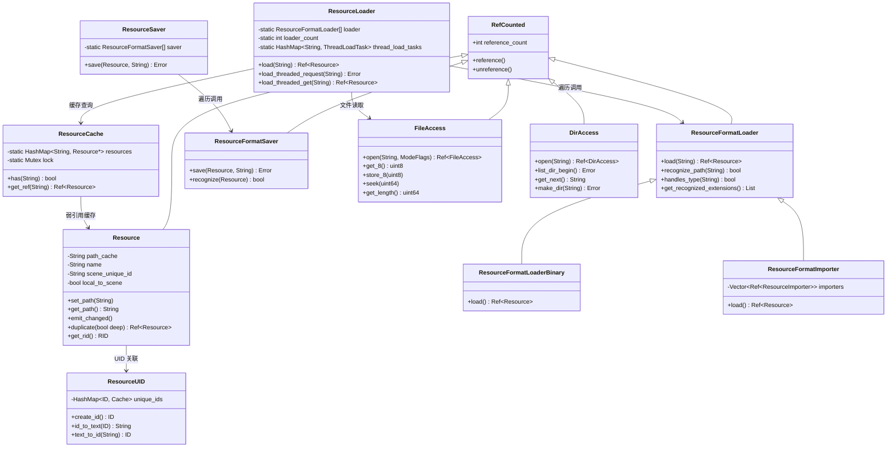

# 05 — IO 与资源系统 (I/O & Resource System)

> **核心对比结论**：Godot 用 RefCounted + 文本格式(.tres/.tscn) 构建轻量透明的资源体系，UE 用 UObject GC + 二进制 .uasset 构建重量级但高性能的资产管线。

---

## 目录

- [第 1 章：模块概览 — "UE 程序员 30 秒速览"](#第-1-章模块概览--ue-程序员-30-秒速览)
- [第 2 章：架构对比 — "同一个问题，两种解法"](#第-2-章架构对比--同一个问题两种解法)
- [第 3 章：核心实现对比 — "代码层面的差异"](#第-3-章核心实现对比--代码层面的差异)
- [第 4 章：UE → Godot 迁移指南](#第-4-章ue--godot-迁移指南)
- [第 5 章：性能对比](#第-5-章性能对比)
- [第 6 章：总结 — "一句话记住"](#第-6-章总结--一句话记住)

---

## 第 1 章：模块概览 — "UE 程序员 30 秒速览"

### 一句话说明

Godot 的 IO 与资源系统负责**文件访问抽象、资源基类定义、资源加载/保存/缓存、序列化编解码**，对应 UE 中 `FArchive` 序列化框架 + `UPackage`/`UObject` 资产体系 + `FAssetRegistryModule` 资产注册表 + `FPlatformFileManager` 文件抽象层的组合。

### 核心类/结构体列表

| # | Godot 类 | 源码路径 | 职责 | UE 对应物 |
|---|---------|---------|------|----------|
| 1 | `Resource` | `core/io/resource.h` | 所有资源的基类，引用计数管理 | `UObject`（资产基类） |
| 2 | `ResourceCache` | `core/io/resource.h` | 全局资源路径→实例缓存 | `FAssetRegistryModule` + `FindObject` |
| 3 | `ResourceLoader` | `core/io/resource_loader.h` | 资源加载调度器（同步/异步） | `FStreamableManager` + `StaticLoadObject` |
| 4 | `ResourceFormatLoader` | `core/io/resource_loader.h` | 格式加载器基类（插件式） | `UFactory` / `FLinkerLoad` |
| 5 | `ResourceSaver` | `core/io/resource_saver.h` | 资源保存调度器 | `UPackage::SavePackage` |
| 6 | `ResourceFormatSaver` | `core/io/resource_saver.h` | 格式保存器基类 | `FLinkerSave` |
| 7 | `ResourceFormatLoaderBinary` | `core/io/resource_format_binary.h` | .res 二进制格式加载 | `FLinkerLoad`（.uasset 加载） |
| 8 | `ResourceFormatImporter` | `core/io/resource_importer.h` | 导入管线调度器 | `UAssetImportData` + Editor Import Pipeline |
| 9 | `ResourceUID` | `core/io/resource_uid.h` | 资源唯一标识符系统 | `FSoftObjectPath` / `FAssetData::PackageName` |
| 10 | `FileAccess` | `core/io/file_access.h` | 跨平台文件读写抽象 | `IFileHandle` + `IPlatformFile` |
| 11 | `DirAccess` | `core/io/dir_access.h` | 跨平台目录操作抽象 | `IPlatformFile`（目录部分） |
| 12 | `Image` | `core/io/image.h` | 图像资源（CPU 端像素操作） | `UTexture2D` / `FImage` |
| 13 | `Marshalls`（编解码函数） | `core/io/marshalls.h` | 基础类型的字节序编解码 | `FArchive` 的 `operator<<` |
| 14 | `ResourceLoaderBinary` | `core/io/resource_format_binary.h` | 二进制资源文件解析器 | `FPackageFileSummary` + `FLinkerLoad` |

### Godot vs UE 概念速查表

| 概念 | Godot | UE |
|------|-------|-----|
| 资源基类 | `Resource : RefCounted` | `UObject`（GC 管理） |
| 资源生命周期 | 引用计数（`Ref<Resource>`） | 垃圾回收（GC） |
| 资源路径 | `res://path/to/file.tres` | `/Game/Path/To/Asset.Asset` |
| 资源唯一 ID | `ResourceUID::ID`（int64） | `FSoftObjectPath`（FName + SubPath） |
| 同步加载 | `ResourceLoader::load()` | `StaticLoadObject()` / `LoadObject<T>()` |
| 异步加载 | `ResourceLoader::load_threaded_request()` | `FStreamableManager::RequestAsyncLoad()` |
| 资源缓存 | `ResourceCache`（HashMap<String, Resource*>） | `FindObject` + `FAssetRegistryModule` |
| 文本资源格式 | `.tres`（文本）/ `.tscn`（场景） | 无原生等价（JSON 需自定义） |
| 二进制资源格式 | `.res` / `.scn` | `.uasset` / `.umap` |
| 文件抽象 | `FileAccess`（RefCounted） | `IFileHandle` + `IPlatformFile` |
| 序列化框架 | `Marshalls` + `Variant` 编解码 | `FArchive`（operator<< 双向） |
| 导入管线 | `ResourceFormatImporter` + `ResourceImporter` | Editor Import Pipeline + `UFactory` |
| 资源信号 | `Resource::changed` 信号 | `UPackage::PackageDirtyStateChangedEvent` |

---

## 第 2 章：架构对比 — "同一个问题，两种解法"

### 2.1 Godot 的架构设计

Godot 的 IO/资源系统采用**分层解耦**的设计，核心思想是"一切皆 Resource，格式加载器可插拔"：



**关键设计特征**：
- `Resource` 继承自 `RefCounted`，生命周期由引用计数管理
- `ResourceLoader` 维护一个 `ResourceFormatLoader` 数组（最多 64 个），按注册顺序遍历匹配
- `ResourceCache` 是一个全局的 `HashMap<String, Resource*>`，以路径为 key 做去重缓存
- 异步加载通过 `WorkerThreadPool` 实现，每个加载任务有独立的 `ThreadLoadTask`

### 2.2 UE 对应模块的架构设计

UE 的资产系统建立在 `UObject` 反射/GC 体系之上，核心组件包括：

- **`UObject`**：所有资产的基类，由 GC 管理生命周期
- **`UPackage`**：资产的容器，对应磁盘上的 `.uasset` 文件（`Engine/Source/Runtime/CoreUObject/Public/UObject/Package.h`）
- **`FArchive`**：双向序列化框架，通过 `operator<<` 实现读写统一（`Engine/Source/Runtime/Core/Public/Serialization/Archive.h`）
- **`FLinkerLoad` / `FLinkerSave`**：Package 的序列化器，负责 `.uasset` 的读写
- **`IAssetRegistry`**：全局资产注册表，维护所有资产的元数据索引（`Engine/Source/Runtime/AssetRegistry/Public/AssetRegistry/IAssetRegistry.h`）
- **`FStreamableManager`**：异步资产加载管理器（`Engine/Source/Runtime/Engine/Classes/Engine/StreamableManager.h`）
- **`FSoftObjectPath`**：软引用路径，支持延迟加载（`Engine/Source/Runtime/CoreUObject/Public/UObject/SoftObjectPath.h`）
- **`IPlatformFile` / `IFileHandle`**：平台文件抽象（`Engine/Source/Runtime/Core/Public/GenericPlatform/GenericPlatformFile.h`）

### 2.3 关键架构差异分析

#### 差异 1：资源生命周期管理 — 引用计数 vs 垃圾回收

**Godot** 的 `Resource` 继承自 `RefCounted`，使用确定性的引用计数管理生命周期。当最后一个 `Ref<Resource>` 被释放时，资源立即被销毁。`ResourceCache` 中存储的是裸指针（`Resource*`），不增加引用计数——这意味着缓存是一种"弱引用"机制。在 `ResourceCache::has()` 和 `ResourceCache::get_ref()` 中，如果发现资源的引用计数为 0（正在被销毁），会主动从缓存中移除：

```cpp
// core/io/resource.cpp — ResourceCache::has()
if (res && (*res)->get_reference_count() == 0) {
    (*res)->path_cache = String();
    resources.erase(p_path);
    res = nullptr;
}
```

**UE** 的 `UObject` 由垃圾回收器管理。资产通过 `AddToRoot()`、被其他 UObject 引用、或被 `FStreamableHandle` 持有来保持存活。GC 是非确定性的，资产可能在 GC 周期后才被回收。`UPackage` 作为资产容器，其 dirty 状态通过 `bDirty` 标志位和 `PackageDirtyStateChangedEvent` 委托来追踪。

**Trade-off**：Godot 的引用计数方案更简单、确定性更强，资源释放时机可预测；但无法处理循环引用（Godot 通过设计避免资源间的循环引用）。UE 的 GC 方案可以处理任意引用图，但引入了 GC 暂停和不确定的释放时机，对于大型开放世界项目需要精心调优 GC 参数。

#### 差异 2：格式加载器的插件化机制 — 数组遍历 vs 工厂模式

**Godot** 的 `ResourceLoader` 维护一个静态数组 `loader[MAX_LOADERS]`（最多 64 个），加载时按顺序遍历每个 `ResourceFormatLoader`，调用 `recognize_path()` 匹配文件扩展名，找到第一个匹配的加载器就执行加载。这种设计极其简洁——注册新格式只需调用 `add_resource_format_loader()`，甚至可以通过 GDScript 继承 `ResourceFormatLoader` 来自定义加载器：

```cpp
// core/io/resource_loader.cpp — ResourceLoader::_load()
for (int i = 0; i < loader_count; i++) {
    if (!loader[i]->recognize_path(p_path, p_type_hint)) {
        continue;
    }
    found = true;
    res = loader[i]->load(p_path, original_path, r_error, ...);
    if (res.is_valid()) break;
}
```

**UE** 使用更复杂的工厂模式。`UFactory` 负责创建/导入资产，`FLinkerLoad` 负责从 `.uasset` 反序列化。资产类型通过 `UClass` 反射系统识别，加载路径经过 `FPackageName` 解析、`FAssetRegistryModule` 查询、`FLinkerLoad` 反序列化等多个阶段。

**Trade-off**：Godot 的线性遍历在加载器数量少时（通常 < 20）性能完全足够，且代码极其简单易懂。UE 的工厂模式更适合大型团队协作和复杂的资产管线，但学习曲线陡峭。

#### 差异 3：序列化策略 — Variant 编解码 vs operator<< 双向流

**Godot** 没有统一的序列化框架。底层使用 `marshalls.h` 中的 `encode_variant()` / `decode_variant()` 函数将 `Variant` 类型编解码为字节流。`ResourceFormatLoaderBinary` 在此基础上实现了 `.res` 格式的读取，包含字符串表、外部资源引用表、内部资源偏移表等结构。文本格式（`.tres`/`.tscn`）则使用 `VariantParser` 进行人类可读的序列化。

**UE** 的 `FArchive` 是一个统一的双向序列化框架。通过重载 `operator<<`，同一段代码既可以用于序列化（写入）也可以用于反序列化（读取），由 `FArchive::IsLoading()` / `FArchive::IsSaving()` 标志位决定方向：

```cpp
// UE — FArchive 双向序列化示例
FArchive& operator<<(FArchive& Ar, FMyStruct& S) {
    Ar << S.Name;    // 同一行代码，读写方向由 Ar 决定
    Ar << S.Value;
    return Ar;
}
```

**Trade-off**：UE 的 `operator<<` 模式优雅且减少了代码重复，但调试困难（同一段代码两种行为）。Godot 的 Variant 编解码更直观，读写逻辑分离清晰，但需要为每种格式分别编写读写代码。Godot 的文本格式（`.tres`）是巨大的优势——可以用文本编辑器直接查看和修改资源，极大方便了版本控制和调试。

---

## 第 3 章：核心实现对比 — "代码层面的差异"

### 3.1 Resource vs UObject/UAsset：资源基类的设计差异

#### Godot 怎么做的

Godot 的 `Resource` 类定义在 `core/io/resource.h`，继承链为 `Resource → RefCounted → Object`。核心成员包括：

```cpp
// core/io/resource.h
class Resource : public RefCounted {
    GDCLASS(Resource, RefCounted);
private:
    String name;
    String path_cache;          // 资源路径，同时作为 ResourceCache 的 key
    String scene_unique_id;     // 场景内唯一 ID
    bool local_to_scene = false; // 是否为场景本地资源
    Node *local_scene = nullptr;
    SelfList<Resource> remapped_list; // 翻译重映射链表
    // ...
};
```

关键设计点：
1. **路径即身份**：`path_cache` 既是资源的标识符，也是 `ResourceCache` 的 key。调用 `set_path()` 时会自动注册/注销缓存
2. **变更通知**：通过 `emit_changed()` 信号通知依赖者，支持阻塞/延迟发射（`_block_emit_changed` / `_unblock_emit_changed`）
3. **深拷贝支持**：`duplicate()` 和 `duplicate_deep()` 使用 `thread_duplicate_remap_cache`（线程本地的 HashMap）避免循环拷贝
4. **RID 桥接**：`get_rid()` 可将 Resource 转换为 RenderingServer 的 RID，实现 CPU 端资源与 GPU 端资源的关联

#### UE 怎么做的

UE 的资产基类是 `UObject`（`Engine/Source/Runtime/CoreUObject/Public/UObject/Object.h`），所有资产都是 `UObject` 的子类。资产被包装在 `UPackage` 中（`Engine/Source/Runtime/CoreUObject/Public/UObject/Package.h`）：

```cpp
// UE — Package.h
class COREUOBJECT_API UPackage : public UObject {
    uint8 bDirty:1;                    // 脏标记
    FGuid Guid;                        // 包 GUID
    int64 FileSize;                    // 文件大小
    FName FileName;                    // 文件名
    FCustomVersionContainer *LinkerCustomVersion; // 自定义版本
    // ...
};
```

关键差异：
- UE 的 `UObject` 有完整的反射系统（`UClass`、`FProperty`），支持蓝图绑定
- `UPackage` 是资产的容器，一个 `.uasset` 文件对应一个 `UPackage`，可包含多个 `UObject`
- 生命周期由 GC 管理，通过 `AddToRoot()` 或被其他 UObject 引用来保持存活

#### 差异点评

| 维度 | Godot Resource | UE UObject/UPackage |
|------|---------------|-------------------|
| 继承深度 | 3 层（Object → RefCounted → Resource） | 1 层（UObject 即基类） |
| 生命周期 | 引用计数，确定性释放 | GC，非确定性释放 |
| 身份标识 | 路径字符串 (`res://...`) | FName + UPackage 层级 |
| 反射支持 | 有限（ClassDB + GDCLASS 宏） | 完整（UClass + UPROPERTY 等） |
| 内存开销 | 轻量（~100 字节基础开销） | 重量（~500+ 字节，含反射元数据） |
| 序列化 | 外部驱动（Loader/Saver 负责） | 内建（`Serialize(FArchive&)` 虚函数） |

Godot 的设计更轻量，适合中小型项目；UE 的设计更完备，适合大型 AAA 项目的复杂资产管线。

### 3.2 ResourceLoader vs FStreamableManager：同步/异步加载机制对比

#### Godot 怎么做的

Godot 的 `ResourceLoader`（`core/io/resource_loader.h` + `core/io/resource_loader.cpp`）提供两种加载模式：

**同步加载**：`ResourceLoader::load()` 直接在当前线程执行加载：

```cpp
// core/io/resource_loader.cpp
Ref<Resource> ResourceLoader::load(const String &p_path, ...) {
    LoadThreadMode thread_mode = LOAD_THREAD_FROM_CURRENT;
    // 如果在 WorkerThreadPool 任务中调用，则 spawn 新任务
    if (WorkerThreadPool::get_singleton()->get_caller_task_id() != WorkerThreadPool::INVALID_TASK_ID) {
        thread_mode = LOAD_THREAD_SPAWN_SINGLE;
    }
    Ref<LoadToken> load_token = _load_start(p_path, p_type_hint, thread_mode, p_cache_mode);
    Ref<Resource> res = _load_complete(*load_token.ptr(), r_error);
    return res;
}
```

**异步加载**：三步式 API：
1. `load_threaded_request(path)` — 发起异步请求，返回 Error
2. `load_threaded_get_status(path, &progress)` — 轮询状态和进度
3. `load_threaded_get(path)` — 获取加载结果

内部实现使用 `WorkerThreadPool` 分发任务，每个任务由 `ThreadLoadTask` 结构体跟踪：

```cpp
// core/io/resource_loader.h — ThreadLoadTask 关键字段
struct ThreadLoadTask {
    WorkerThreadPool::TaskID task_id;
    Thread::ID thread_id;
    ConditionVariable *cond_var;
    LoadToken *load_token;
    String local_path;
    float progress;
    ThreadLoadStatus status;
    ResourceFormatLoader::CacheMode cache_mode;
    Ref<Resource> resource;
    HashSet<String> sub_tasks;  // 子依赖追踪
};
```

**缓存模式**（`CacheMode`）是 Godot 的一个精巧设计：
- `CACHE_MODE_REUSE`：如果缓存中已有，直接返回（默认）
- `CACHE_MODE_REPLACE`：加载新版本并替换缓存中的旧版本
- `CACHE_MODE_IGNORE`：完全忽略缓存，加载独立副本
- `CACHE_MODE_IGNORE_DEEP` / `CACHE_MODE_REPLACE_DEEP`：递归应用到子资源

#### UE 怎么做的

UE 的资产加载分为多个层次：

1. **同步加载**：`StaticLoadObject()` / `LoadObject<T>()`，最终通过 `FLinkerLoad` 从 `.uasset` 反序列化
2. **异步加载**：`FStreamableManager::RequestAsyncLoad()`（`Engine/Source/Runtime/Engine/Classes/Engine/StreamableManager.h`），返回 `TSharedPtr<FStreamableHandle>`
3. **事件驱动异步加载**（EDL）：`AsyncLoadingThread` 在后台线程执行，通过 `FAsyncPackage` 管理

```cpp
// UE — FStreamableManager 异步加载
TSharedPtr<FStreamableHandle> Handle = StreamableManager.RequestAsyncLoad(
    SoftObjectPath,
    FStreamableDelegate::CreateUObject(this, &UMyClass::OnLoadComplete)
);
```

UE 的 `FStreamableHandle` 提供了更丰富的控制：
- `WaitUntilComplete()` — 阻塞等待
- `GetProgress()` — 获取进度
- `CancelHandle()` — 取消加载
- `ReleaseHandle()` — 释放句柄（允许 GC 回收）

#### 差异点评

| 维度 | Godot ResourceLoader | UE FStreamableManager |
|------|---------------------|----------------------|
| 异步 API 风格 | 路径为 key 的三步式 | Handle 对象式 |
| 进度追踪 | 递归计算子依赖进度 | Handle 内部追踪 |
| 取消支持 | 无直接取消 API | `CancelHandle()` |
| 线程模型 | WorkerThreadPool 单任务 | AsyncLoadingThread + EDL |
| 缓存控制 | 5 种 CacheMode | 依赖 GC + FindObject |
| 循环依赖检测 | 通过 `load_nesting` + `load_paths_stack` | 通过 `FAsyncPackage` 依赖图 |

Godot 的异步加载 API 更简洁（路径即 key），但功能较少（无取消）。UE 的 Handle 模式更灵活，但需要管理 Handle 的生命周期。Godot 的 `CacheMode` 设计非常实用，UE 中实现类似功能需要手动管理（`LOAD_NoWarn | LOAD_NoVerify` 等标志位组合）。

### 3.3 .tres/.tscn vs .uasset：文本格式 vs 二进制格式的 Trade-off

#### Godot 怎么做的

Godot 支持两种资源格式：

**文本格式**（`.tres` / `.tscn`）：
- 人类可读的键值对格式，类似 INI/TOML
- 由 `ResourceFormatLoaderText`（`scene/resources/resource_format_text.cpp`）处理
- 示例：
```
[gd_resource type="BoxShape3D" format=3]
[resource]
size = Vector3(1, 1, 1)
```

**二进制格式**（`.res` / `.scn`）：
- 由 `ResourceFormatLoaderBinary`（`core/io/resource_format_binary.h`）处理
- 文件结构包含：魔数、版本号、字符串表、外部资源表、内部资源表、属性数据

```cpp
// core/io/resource_format_binary.h — 二进制格式标志位
enum {
    FORMAT_FLAG_NAMED_SCENE_IDS = 1,
    FORMAT_FLAG_UIDS = 2,
    FORMAT_FLAG_REAL_T_IS_DOUBLE = 4,
    FORMAT_FLAG_HAS_SCRIPT_CLASS = 8,
    RESERVED_FIELDS = 11  // 预留字段数
};
```

`ResourceLoaderBinary` 的加载流程：
1. 读取文件头（魔数、版本、类型）
2. 构建字符串表（`string_map`）
3. 解析外部资源引用（`external_resources`）
4. 解析内部资源偏移表（`internal_resources`）
5. 逐个反序列化内部资源的属性（`parse_variant()`）

#### UE 怎么做的

UE 统一使用**二进制格式**（`.uasset` / `.umap`）：
- 文件由 `FPackageFileSummary`（头部）+ 导入/导出表 + 序列化数据组成
- 通过 `FLinkerLoad` 反序列化，支持版本化（`CustomVersionContainer`）
- 编辑器中可导出为文本格式（`.copy`），但不是原生工作流

```cpp
// UE — PackageFileSummary.h 关键字段
struct FPackageFileSummary {
    int32 Tag;                    // 魔数
    int32 FileVersionUE4;         // 引擎版本
    FGuid Guid;                   // 包 GUID
    TArray<FGenerationInfo> Generations;
    TArray<FCompressedChunk> CompressedChunks;
    // ...
};
```

#### 差异点评

| 维度 | Godot .tres/.tscn | UE .uasset |
|------|-------------------|-----------|
| 可读性 | ✅ 人类可读 | ❌ 二进制 |
| 版本控制 | ✅ Git diff 友好 | ❌ 需要专用 diff 工具 |
| 加载速度 | ⚠️ 文本解析较慢 | ✅ 二进制直接映射 |
| 文件大小 | ⚠️ 文本较大 | ✅ 二进制紧凑 |
| 合并冲突 | ✅ 可手动解决 | ❌ 几乎无法手动合并 |
| 安全性 | ⚠️ 可被篡改 | ✅ 不易篡改 |

Godot 的文本格式是其**最大的差异化优势之一**。对于独立开发者和小团队，能用 Git 管理资源文件、用文本编辑器修改属性、手动解决合并冲突，这些能力极大提升了开发效率。UE 的二进制格式在大型项目中性能更优，但需要 Perforce 等专用版本控制系统。

### 3.4 FileAccess vs FPlatformFileManager：文件抽象层设计

#### Godot 怎么做的

Godot 的 `FileAccess`（`core/io/file_access.h`）是一个继承自 `RefCounted` 的抽象类，通过工厂模式创建平台特定实现：

```cpp
// core/io/file_access.h — 核心设计
class FileAccess : public RefCounted {
public:
    enum AccessType : int32_t {
        ACCESS_RESOURCES,   // res:// 虚拟文件系统
        ACCESS_USERDATA,    // user:// 用户数据目录
        ACCESS_FILESYSTEM,  // 原生文件系统
        ACCESS_PIPE,        // 管道
        ACCESS_MAX
    };
    
    // 工厂方法 — 根据 AccessType 创建对应实现
    static Ref<FileAccess> create(AccessType p_access);
    static Ref<FileAccess> open(const String &p_path, int p_mode_flags, Error *r_error = nullptr);
    
    // 读写接口
    virtual uint8_t get_8() const;
    virtual bool store_8(uint8_t p_dest);
    virtual uint64_t get_buffer(uint8_t *p_dst, uint64_t p_length) const = 0;
    virtual bool store_buffer(const uint8_t *p_src, uint64_t p_length) = 0;
    // ...
};
```

关键特性：
- **三级访问类型**：`ACCESS_RESOURCES`（项目资源）、`ACCESS_USERDATA`（用户数据）、`ACCESS_FILESYSTEM`（原生文件系统）
- **装饰器模式**：`FileAccessCompressed`、`FileAccessEncrypted`、`FileAccessPack`、`FileAccessZip` 等装饰器可叠加
- **引用计数管理**：`Ref<FileAccess>` 自动关闭文件
- **静态便捷方法**：`FileAccess::get_file_as_bytes()`、`FileAccess::get_file_as_string()` 等一行式 API

#### UE 怎么做的

UE 使用 `IPlatformFile` 接口（`Engine/Source/Runtime/Core/Public/GenericPlatform/GenericPlatformFile.h`）和 `IFileHandle`：

```cpp
// UE — IPlatformFile 接口（简化）
class CORE_API IPlatformFile {
public:
    virtual IFileHandle* OpenRead(const TCHAR* Filename, bool bAllowWrite = false) = 0;
    virtual IFileHandle* OpenWrite(const TCHAR* Filename, bool bAppend = false, bool bAllowRead = false) = 0;
    virtual bool FileExists(const TCHAR* Filename) = 0;
    virtual bool DeleteFile(const TCHAR* Filename) = 0;
    // ...
};

// UE — IFileHandle 接口
class CORE_API IFileHandle {
public:
    virtual int64 Tell() = 0;
    virtual bool Seek(int64 NewPosition) = 0;
    virtual bool Read(uint8* Destination, int64 BytesToRead) = 0;
    virtual bool Write(const uint8* Source, int64 BytesToWrite) = 0;
    // ...
};
```

UE 通过 `FPlatformFileManager`（`Engine/Source/Runtime/Core/Public/HAL/PlatformFilemanager.h`）管理文件系统栈，支持链式装饰：

```cpp
// UE — 文件系统链
FPlatformFileManager::Get().GetPlatformFile()  // 获取栈顶文件系统
    → PakFile (IPlatformFile)
        → CachedFile (IPlatformFile)
            → PhysicalFile (IPlatformFile)  // 底层物理文件系统
```

#### 差异点评

| 维度 | Godot FileAccess | UE IPlatformFile + IFileHandle |
|------|-----------------|-------------------------------|
| 对象模型 | RefCounted（自动关闭） | 裸指针（需手动 delete） |
| 虚拟文件系统 | `res://` / `user://` 前缀 | Pak 文件系统链 |
| 装饰器 | 独立子类（Compressed/Encrypted） | 文件系统链式叠加 |
| 字节序 | `big_endian` 成员变量 | `FArchive::IsByteSwapping()` |
| 便捷 API | `get_file_as_string()` 等静态方法 | 需手动组合 |
| 异步 IO | 无原生支持 | `IAsyncReadFileHandle` |

Godot 的 `FileAccess` 更易用（RefCounted 自动管理、`res://` 路径直觉化），UE 的文件系统链更灵活（可在运行时动态插入/移除文件系统层）。UE 的 `IAsyncReadFileHandle` 提供了原生异步 IO 支持，这是 Godot 目前缺失的。

### 3.5 资源引用：ResourceUID vs FSoftObjectPath

#### Godot 怎么做的

Godot 的 `ResourceUID`（`core/io/resource_uid.h`）为每个资源分配一个 `int64` 类型的唯一 ID：

```cpp
// core/io/resource_uid.h
class ResourceUID : public Object {
public:
    typedef int64_t ID;
    constexpr const static ID INVALID_ID = -1;
    
    String id_to_text(ID p_id) const;    // 转为 "uid://xxx" 格式
    ID text_to_id(const String &p_text) const;
    ID create_id();                       // 生成新 UID
    void add_id(ID p_id, const String &p_path);  // 注册 UID→路径映射
    String get_id_path(ID p_id) const;    // UID→路径查询
    
private:
    HashMap<ID, Cache> unique_ids;        // UID→路径缓存
    HashMap<CharString, ID> reverse_cache; // 路径→UID 反向缓存
};
```

UID 的核心价值是**路径无关的资源引用**。当资源文件被重命名或移动时，UID 保持不变，引用不会断裂。UID 以 `uid://` 前缀的文本形式存储在 `.tres`/`.tscn` 文件中。对于不支持自定义 UID 的格式，Godot 会生成 `.uid` 伴随文件。

#### UE 怎么做的

UE 使用 `FSoftObjectPath`（`Engine/Source/Runtime/CoreUObject/Public/UObject/SoftObjectPath.h`）作为资源的软引用：

```cpp
// UE — FSoftObjectPath
struct FSoftObjectPath {
    FName AssetPathName;      // /Game/Path/Asset.Asset
    FString SubPathString;    // 子对象路径（可选）
    
    UObject* TryLoad() const;
    UObject* ResolveObject() const;
};
```

UE 还有 `FPrimaryAssetId`（类型 + 名称）和 `FAssetData`（包含完整元数据）等更高级的引用方式。

#### 差异点评

| 维度 | Godot ResourceUID | UE FSoftObjectPath |
|------|-------------------|-------------------|
| 标识符类型 | int64 数字 | FName 路径字符串 |
| 重命名安全 | ✅ UID 不变 | ⚠️ 需要 Redirector |
| 子对象引用 | ❌ 不支持 | ✅ SubPathString |
| 序列化大小 | 8 字节 | 可变（路径长度） |
| 人类可读性 | ⚠️ `uid://xxx`（不直观） | ✅ `/Game/Path/Asset` |

### 3.6 资源缓存：ResourceCache vs FAssetRegistryModule

#### Godot 怎么做的

`ResourceCache` 是一个极简的全局缓存（`core/io/resource.h`）：

```cpp
class ResourceCache {
    static Mutex lock;
    static HashMap<String, Resource *> resources;  // 路径→裸指针
    
public:
    static bool has(const String &p_path);
    static Ref<Resource> get_ref(const String &p_path);
};
```

- 缓存以**路径字符串**为 key，存储**裸指针**（不增加引用计数）
- 资源在 `set_path()` 时自动注册，在析构函数中自动注销
- 线程安全通过 `Mutex` 保证
- 当资源引用计数归零时，`get_ref()` 会检测并清理

#### UE 怎么做的

UE 的 `IAssetRegistry`（`Engine/Source/Runtime/AssetRegistry/Public/AssetRegistry/IAssetRegistry.h`）是一个功能丰富的资产索引系统：

- 维护所有资产的 `FAssetData`（类型、路径、标签、依赖关系等元数据）
- 支持按路径、类型、标签等多维度查询
- 异步扫描磁盘上的资产文件
- 追踪资产间的依赖关系（硬引用、软引用、管理引用）

#### 差异点评

Godot 的 `ResourceCache` 是一个纯粹的"已加载资源去重缓存"，功能单一但高效。UE 的 `IAssetRegistry` 是一个完整的"资产数据库"，支持复杂查询但内存开销大。对于 Godot 的项目规模（通常 < 10000 个资源），简单的 HashMap 完全足够；UE 面对的 AAA 项目可能有数十万个资产，需要索引系统来高效查询。

### 3.7 序列化：Marshalls vs FArchive 的序列化策略对比

#### Godot 怎么做的

Godot 的序列化分为两层：

**底层**：`marshalls.h` 提供基础类型的字节序编解码：

```cpp
// core/io/marshalls.h — 小端序编码
static inline unsigned int encode_uint32(uint32_t p_uint, uint8_t *p_arr) {
    for (int i = 0; i < 4; i++) {
        *p_arr = p_uint & 0xFF;
        p_arr++;
        p_uint >>= 8;
    }
    return sizeof(uint32_t);
}
```

**高层**：`encode_variant()` / `decode_variant()` 函数处理 Godot 的 `Variant` 类型（包含 40+ 种类型的联合体）。每个 Variant 序列化为 `[type_id | flags][data]` 格式。

**文本序列化**：`VariantParser` / `VariantWriter` 处理 `.tres`/`.tscn` 的文本格式。

#### UE 怎么做的

UE 的 `FArchive`（`Engine/Source/Runtime/Core/Public/Serialization/Archive.h`）是一个 2000+ 行的基类，核心是 `operator<<` 重载：

```cpp
// UE — FArchive 核心接口
class CORE_API FArchive : public FArchiveState {
public:
    virtual FArchive& operator<<(FName& Value);
    virtual FArchive& operator<<(UObject*& Value);
    virtual void Serialize(void* V, int64 Length);  // 原始字节序列化
    
    // 方向标志
    bool IsLoading() const;
    bool IsSaving() const;
    
    // 版本控制
    int32 UE4Ver() const;
    int32 CustomVer(const FGuid& Key) const;
};
```

UE 还有 `FStructuredArchive`（结构化序列化，支持 JSON 等格式）和 `FMemoryArchive`（内存序列化）等变体。

#### 差异点评

| 维度 | Godot Marshalls + Variant | UE FArchive |
|------|--------------------------|-------------|
| 设计模式 | 函数式（encode/decode 函数） | 面向对象（operator<< 重载） |
| 读写统一 | ❌ 分离的编码/解码函数 | ✅ 同一 operator<< |
| 版本控制 | 简单的 `ver_format` 整数 | 完整的 `CustomVersionContainer` |
| 类型系统 | 基于 Variant 类型 ID | 基于 C++ 类型 + UPROPERTY |
| 扩展性 | 添加新 Variant 类型 | 重载 operator<< |
| 调试友好度 | ✅ 读写分离，逻辑清晰 | ⚠️ 同一代码两种行为 |

---

## 第 4 章：UE → Godot 迁移指南

### 4.1 思维转换清单

1. **忘掉 GC，拥抱引用计数**：在 UE 中你可以随意持有 `UObject*`，GC 会处理生命周期。在 Godot 中，必须使用 `Ref<Resource>` 持有资源引用，裸指针会导致悬空引用。`ResourceCache` 中的裸指针是特殊设计，不要模仿。

2. **忘掉 UPackage，资源即文件**：UE 中一个 `.uasset` 可以包含多个 UObject（主资产 + 子对象）。Godot 中每个 `.tres` 文件通常对应一个 Resource，子资源通过 `sub_resource` 内联或 `ext_resource` 外部引用。没有"包"的概念。

3. **忘掉 FArchive 的 operator<<，学习 Variant 序列化**：Godot 没有统一的双向序列化框架。如果你需要自定义序列化，重写 `_get_property_list()` 和 `_get()` / `_set()` 虚函数来控制哪些属性被序列化。

4. **忘掉 AssetRegistry 查询，学习 ResourceLoader 的简单 API**：Godot 没有资产注册表。要检查资源是否存在，用 `ResourceLoader::exists()`；要加载资源，用 `ResourceLoader::load()`。没有按类型、标签查询资产的 API。

5. **忘掉 Redirector，学习 ResourceUID**：UE 中重命名资产会留下 `UObjectRedirector`。Godot 使用 `ResourceUID` 系统，资源的 UID 在创建时生成，重命名/移动文件时 UID 不变，引用自动保持有效。

6. **拥抱文本格式**：这是 Godot 最大的优势之一。`.tres` 和 `.tscn` 文件可以用文本编辑器打开、用 Git diff 查看变更、手动解决合并冲突。充分利用这一点。

7. **学习 CacheMode**：Godot 的 `ResourceFormatLoader::CacheMode` 提供了精细的缓存控制（REUSE/REPLACE/IGNORE），这在 UE 中需要复杂的标志位组合才能实现。

### 4.2 API 映射表

| UE API | Godot 等价 API | 备注 |
|--------|---------------|------|
| `StaticLoadObject()` / `LoadObject<T>()` | `ResourceLoader::load(path)` | 同步加载 |
| `FStreamableManager::RequestAsyncLoad()` | `ResourceLoader::load_threaded_request(path)` | 异步加载请求 |
| `FStreamableHandle::HasLoadCompleted()` | `ResourceLoader::load_threaded_get_status(path)` | 查询加载状态 |
| `FStreamableHandle::GetLoadedAsset()` | `ResourceLoader::load_threaded_get(path)` | 获取加载结果 |
| `UPackage::SavePackage()` | `ResourceSaver::save(resource, path)` | 保存资源 |
| `FindObject<T>()` | `ResourceCache::get_ref(path)` | 查找已加载资源 |
| `FSoftObjectPath(path)` | `ResourceUID::text_to_id("uid://...")` | 软引用 |
| `FSoftObjectPath::TryLoad()` | `ResourceLoader::load(path)` | 解析软引用 |
| `FPlatformFileManager::Get().GetPlatformFile()` | `FileAccess::open(path, mode)` | 打开文件 |
| `IFileHandle::Read()` | `FileAccess::get_buffer()` | 读取字节 |
| `IFileHandle::Write()` | `FileAccess::store_buffer()` | 写入字节 |
| `IPlatformFile::FileExists()` | `FileAccess::exists(path)` | 检查文件存在 |
| `FPaths::ProjectContentDir()` | `"res://"` 前缀 | 项目资源根目录 |
| `FPaths::ProjectSavedDir()` | `"user://"` 前缀 | 用户数据目录 |
| `FArchive& operator<<(T&)` | `encode_variant()` / `decode_variant()` | 序列化/反序列化 |
| `UObject::Serialize(FArchive&)` | 重写 `_get_property_list()` + `_get()`/`_set()` | 自定义序列化 |

### 4.3 陷阱与误区

#### 陷阱 1：资源路径大小写敏感

UE 的资产路径在 Windows 上不区分大小写（`/Game/MyAsset` 和 `/game/myasset` 等价）。Godot 的 `res://` 路径**在所有平台上都区分大小写**。如果你在 Windows 上开发时路径大小写不一致，部署到 Linux/Android 时会出现资源找不到的问题。

**建议**：始终使用小写路径，或在项目初期建立严格的命名规范。

#### 陷阱 2：Ref<Resource> 不是 TSharedPtr

UE 程序员可能会把 `Ref<Resource>` 类比为 `TSharedPtr<UObject>`，但它们有本质区别：
- `Ref<Resource>` 是**侵入式引用计数**（计数器在对象内部），不能对同一个裸指针创建多个独立的 `Ref`
- `Ref<Resource>` 不支持 `weak_ptr` 语义（`ResourceCache` 的弱引用是通过裸指针 + 引用计数检查实现的）
- 不要将 `Resource*` 裸指针存储在长期存活的数据结构中，始终使用 `Ref<Resource>`

#### 陷阱 3：异步加载的路径是全局 key

Godot 的异步加载以**路径字符串**作为全局唯一 key。如果你对同一路径发起多次 `load_threaded_request()`，后续请求会复用第一次的加载任务（引用计数增加）。这与 UE 的 `FStreamableHandle`（每次请求返回独立 Handle）不同。

```cpp
// Godot — 同一路径的多次请求会复用
ResourceLoader::load_threaded_request("res://my_resource.tres"); // 发起加载
ResourceLoader::load_threaded_request("res://my_resource.tres"); // 复用已有任务
```

#### 陷阱 4：没有 Cook 管线

UE 有完整的 Cook 管线（`UnrealBuildTool` + `CookOnTheFly`），将编辑器格式转换为运行时格式。Godot **没有 Cook 步骤**——导出时资源直接打包（可选压缩/加密），运行时加载的格式与编辑器中相同。这意味着：
- 不需要区分"编辑器资产"和"运行时资产"
- 但也意味着运行时可能加载不必要的编辑器元数据

#### 陷阱 5：emit_changed() 的线程安全

`Resource::emit_changed()` 在非主线程调用时，会通过 `ResourceLoader::resource_changed_emit()` 延迟到加载完成后再发射信号。不要在加载回调中依赖 `changed` 信号的即时性。

### 4.4 最佳实践

1. **优先使用 .tres 文本格式**：除非资源很大（如大型网格、纹理），否则始终使用 `.tres` 格式。这让版本控制和调试变得极其方便。

2. **善用 CacheMode**：
   - 热重载时用 `CACHE_MODE_REPLACE` 替换已加载的资源
   - 需要独立副本时用 `CACHE_MODE_IGNORE`
   - 默认用 `CACHE_MODE_REUSE` 避免重复加载

3. **异步加载模式**：
```gdscript
# GDScript 异步加载最佳实践
func _ready():
    ResourceLoader.load_threaded_request("res://heavy_resource.tres")

func _process(delta):
    var status = ResourceLoader.load_threaded_get_status("res://heavy_resource.tres")
    if status == ResourceLoader.THREAD_LOAD_LOADED:
        var res = ResourceLoader.load_threaded_get("res://heavy_resource.tres")
        _on_resource_loaded(res)
```

4. **自定义资源格式**：继承 `ResourceFormatLoader` 和 `ResourceFormatSaver`，通过 `ResourceLoader::add_resource_format_loader()` 注册，即可支持自定义文件格式。

---

## 第 5 章：性能对比

### 5.1 Godot 该模块的性能特征和瓶颈

#### 加载性能

1. **文本格式解析开销**：`.tres`/`.tscn` 的文本解析（`VariantParser`）比二进制格式慢 3-10 倍。对于大型场景文件（数千个节点），首次加载时间可能显著增加。

2. **线性遍历加载器**：`ResourceLoader::_load()` 对 `loader[]` 数组进行线性遍历（最多 64 个），每次调用 `recognize_path()` 进行扩展名匹配。虽然加载器数量通常 < 20，但对于频繁的小资源加载，这个开销不可忽略。

3. **单一互斥锁**：`ResourceCache` 使用单一 `Mutex` 保护所有操作。在高并发加载场景下，这可能成为瓶颈。UE 的 `FAssetRegistryModule` 使用更细粒度的锁。

4. **异步加载的 WorkerThreadPool 开销**：每个异步加载任务通过 `WorkerThreadPool::add_native_task()` 提交，任务调度有固定开销。对于大量小资源的批量加载，建议使用 `use_sub_threads = true` 让子依赖在同一任务中加载。

#### 内存性能

1. **ResourceCache 的弱引用设计**：缓存不持有强引用，资源在无人使用时自动释放。这避免了 UE 中常见的"资产泄漏"问题（忘记释放 `FStreamableHandle`）。

2. **Variant 序列化的内存分配**：`decode_variant()` 在反序列化时会进行大量的堆内存分配（String、Array、Dictionary 等），这是 Godot 资源加载的主要内存开销来源。

3. **字符串表优化**：`ResourceFormatLoaderBinary` 使用字符串表（`string_map`）避免重复存储相同的属性名，这是一个有效的内存优化。

### 5.2 与 UE 对应模块的性能差异

| 性能维度 | Godot | UE | 差异原因 |
|---------|-------|-----|---------|
| 冷启动加载 | ⚠️ 较慢（文本解析） | ✅ 快（二进制直接映射） | 文本 vs 二进制格式 |
| 热缓存命中 | ✅ 快（HashMap 查找） | ✅ 快（FindObject） | 两者都是 O(1) 查找 |
| 异步加载吞吐 | ⚠️ 中等 | ✅ 高（EDL + 异步 IO） | UE 有专用异步加载线程 |
| 内存占用 | ✅ 低（RefCounted 轻量） | ⚠️ 高（UObject 反射开销） | 对象模型差异 |
| 大量小资源 | ⚠️ 锁竞争 | ✅ 细粒度锁 | 锁粒度差异 |
| 资源卸载 | ✅ 即时（引用计数归零） | ⚠️ 延迟（等待 GC） | 生命周期管理差异 |

### 5.3 性能敏感场景的具体建议

1. **大型场景加载**：将 `.tscn` 转换为 `.scn`（二进制格式）可显著提升加载速度。在导出设置中启用"Convert Text Resources to Binary"。

2. **批量资源预加载**：使用 `load_threaded_request()` 配合 `use_sub_threads = true`，让 WorkerThreadPool 并行加载多个资源：
```gdscript
# 批量预加载
var paths = ["res://a.tres", "res://b.tres", "res://c.tres"]
for path in paths:
    ResourceLoader.load_threaded_request(path, "", true)  # use_sub_threads = true
```

3. **避免频繁的 ResourceCache 查询**：在热路径中缓存 `Ref<Resource>` 到局部变量，避免反复调用 `ResourceLoader::load()`（即使有缓存，仍有 Mutex 锁开销）。

4. **自定义二进制格式**：对于性能关键的自定义数据（如大型地图数据、AI 导航网格），考虑实现自定义的 `ResourceFormatLoader`，直接使用 `FileAccess` 读取二进制数据，跳过 Variant 序列化开销。

5. **Pack 文件优化**：导出时使用 `.pck` 打包文件，`FileAccessPack` 会将所有资源打包到单一文件中，减少文件系统调用次数。这类似于 UE 的 `.pak` 文件。

---

## 第 6 章：总结 — "一句话记住"

### 核心差异

> **Godot 的资源系统是"文件驱动"的（路径即身份，文本即格式），UE 的资产系统是"对象驱动"的（UObject 即一切，二进制即效率）。**

### 设计亮点（Godot 做得比 UE 好的地方）

1. **文本资源格式（.tres/.tscn）**：这是 Godot 最大的差异化优势。人类可读、Git 友好、可手动编辑和合并。对于独立开发者和小团队，这一特性的价值无法估量。UE 至今没有原生的文本资产格式。

2. **CacheMode 设计**：5 种缓存模式（REUSE/REPLACE/IGNORE/IGNORE_DEEP/REPLACE_DEEP）提供了精细的缓存控制，API 设计优雅。UE 中实现类似功能需要组合多个标志位和手动管理。

3. **引用计数的确定性释放**：资源在最后一个引用释放时立即销毁，不需要等待 GC。这让内存使用更可预测，特别适合内存受限的移动平台。

4. **可插拔的格式加载器**：通过 GDScript 继承 `ResourceFormatLoader` 即可支持自定义格式，无需修改引擎源码。UE 的 `UFactory` 系统虽然也支持扩展，但复杂度高得多。

5. **ResourceUID 的简洁设计**：一个 int64 即可唯一标识资源，比 UE 的 `FSoftObjectPath`（FName + SubPath 字符串）更轻量。

### 设计短板（Godot 不如 UE 的地方）

1. **缺乏统一序列化框架**：没有 `FArchive` 那样的双向序列化框架，自定义序列化需要分别编写读写代码，容易出现不一致。

2. **异步加载功能有限**：没有取消加载的 API，没有优先级控制，没有原生异步 IO。UE 的 `FStreamableHandle` + `AsyncLoadingThread` + `IAsyncReadFileHandle` 提供了完整的异步加载栈。

3. **缺乏资产注册表**：没有 `IAssetRegistry` 那样的全局资产索引，无法按类型、标签等维度查询资产。对于大型项目的资产管理是一个明显短板。

4. **文本格式的性能代价**：`.tres`/`.tscn` 的解析速度远慢于二进制格式，对于大型项目的加载时间有显著影响。

5. **单一互斥锁的 ResourceCache**：在高并发场景下可能成为瓶颈，UE 使用更细粒度的锁策略。

### UE 程序员的学习路径建议

**推荐阅读顺序**：

1. **`core/io/resource.h`** → 理解 Resource 基类，对比 UObject
2. **`core/io/resource_loader.h`** → 理解加载机制，对比 StaticLoadObject / FStreamableManager
3. **`core/io/file_access.h`** → 理解文件抽象，对比 IPlatformFile
4. **`core/io/resource_format_binary.h`** → 理解二进制格式，对比 FLinkerLoad
5. **`core/io/resource_uid.h`** → 理解 UID 系统，对比 FSoftObjectPath
6. **`core/io/marshalls.h`** → 理解序列化基础，对比 FArchive
7. **`core/io/resource_importer.h`** → 理解导入管线，对比 UFactory
8. **`scene/resources/resource_format_text.cpp`** → 理解 .tres/.tscn 文本格式（Godot 独有特性）

**实践建议**：
- 先用 GDScript 写一个简单的自定义 Resource 子类，体验 `.tres` 格式的便利
- 然后用 C++ 实现一个自定义 `ResourceFormatLoader`，理解格式加载器的插件机制
- 最后阅读 `ResourceLoader::_load_start()` 和 `_run_load_task()` 的源码，理解异步加载的完整流程

---

*本报告基于 Godot Engine 源码（`core/io/` 目录）和 Unreal Engine 源码（`Engine/Source/Runtime/` 目录）的交叉对比分析。所有源码路径均为实际文件路径，可直接定位查阅。*
