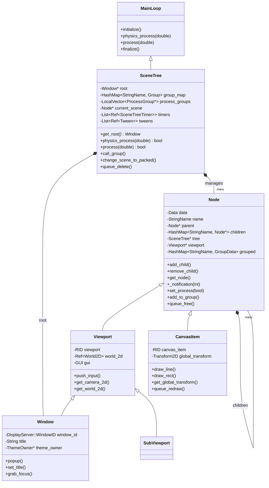

# 06 - 场景树核心 (Scene Tree Core)

> **核心对比结论**：Godot 用"一切皆节点"的树形结构统一管理场景，而 UE 用 Actor-Component 扁平化模式组织世界——前者简洁直觉，后者灵活强大。

---

## 目录

- [第 1 章：模块概览 — "UE 程序员 30 秒速览"](#第-1-章模块概览--ue-程序员-30-秒速览)
- [第 2 章：架构对比 — "同一个问题，两种解法"](#第-2-章架构对比--同一个问题两种解法)
- [第 3 章：核心实现对比 — "代码层面的差异"](#第-3-章核心实现对比--代码层面的差异)
- [第 4 章：UE → Godot 迁移指南](#第-4-章ue--godot-迁移指南)
- [第 5 章：性能对比](#第-5-章性能对比)
- [第 6 章：总结 — "一句话记住"](#第-6-章总结--一句话记住)

---

## 第 1 章：模块概览 — "UE 程序员 30 秒速览"

### 一句话说明

**场景树核心模块**是 Godot 引擎的场景管理中枢，负责节点树的构建、遍历、生命周期管理和帧循环驱动。它对应 UE 中 `UWorld` + `ULevel` + `UGameInstance` + `AGameModeBase` + `FEngineLoop` 的组合功能，但用一棵统一的节点树取代了 UE 中分散在多个子系统中的场景管理逻辑。

### 核心类/结构体列表

| # | Godot 类 | 源码路径 | 职责 | UE 对应物 |
|---|---------|---------|------|----------|
| 1 | `Node` | `scene/main/node.h` | 所有场景对象的基类，管理树形层级、生命周期、处理回调 | `AActor` + `UActorComponent` |
| 2 | `SceneTree` | `scene/main/scene_tree.h` | 主循环实现，管理整棵节点树、组系统、帧处理 | `UWorld` + `UGameInstance` |
| 3 | `Viewport` | `scene/main/viewport.h` | 渲染视口，管理 2D/3D 世界、输入分发、GUI 焦点 | `UGameViewportClient` + `ULocalPlayer` |
| 4 | `Window` | `scene/main/window.h` | 操作系统窗口抽象，继承自 Viewport，是场景树的根 | `SWindow` (Slate) |
| 5 | `Main` | `main/main.h` | 引擎入口，初始化和主循环驱动 | `FEngineLoop` |
| 6 | `MainTimerSync` | `main/main_timer_sync.h` | 帧时间同步，物理步长与渲染帧的协调 | `FApp::DeltaTime` + `FixedFrameRate` 逻辑 |
| 7 | `CanvasItem` | `scene/main/canvas_item.h` | 2D 可绘制节点基类，管理变换、绘制、材质 | `UWidget` / `SWidget` (2D 层面) |
| 8 | `CanvasLayer` | `scene/main/canvas_layer.h` | 2D 画布层，控制渲染层级 | 无直接对应（类似 UMG 的 ZOrder 层） |
| 9 | `PackedScene` | `scene/resources/packed_scene.cpp` | 场景序列化资源，可实例化为节点树 | `UBlueprint` + `UClass`（作为 SpawnActor 的模板） |
| 10 | `SceneTreeTimer` | `scene/main/scene_tree.cpp` | 轻量级定时器，挂载在 SceneTree 上 | `FTimerManager::SetTimer` |
| 11 | `SceneState` | `scene/resources/packed_scene.cpp` | PackedScene 的内部状态，存储节点属性和连接 | `UBlueprintGeneratedClass` 的序列化数据 |
| 12 | `SceneTreeFTI` | `scene/main/scene_tree_fti.h` | 固定时间步长插值（Fixed Timestep Interpolation） | `UCharacterMovementComponent` 的插值逻辑 |

### Godot vs UE 概念速查表

| Godot 概念 | UE 概念 | 关键差异 |
|-----------|--------|---------|
| `Node` | `AActor` / `UActorComponent` | Godot 一切皆 Node，UE 区分 Actor 和 Component |
| `SceneTree` | `UWorld` + `FEngineLoop` | Godot 的 SceneTree 既是世界容器又是主循环 |
| `Viewport` | `UGameViewportClient` | Godot 的 Viewport 是 Node，可嵌套；UE 的是独立子系统 |
| `PackedScene.instantiate()` | `UWorld::SpawnActor()` | Godot 实例化整棵子树；UE 生成单个 Actor |
| `Node.add_child()` | `AActor::AttachToActor()` | Godot 通过父子关系组织；UE 通过 Attachment 和 Level |
| `_ready() / _enter_tree()` | `BeginPlay()` | Godot 分两步（进树 + 就绪）；UE 合为一步 |
| `_process(delta)` | `Tick(DeltaTime)` | 功能等价，但 Godot 通过 notification 分发 |
| `_physics_process(delta)` | `TickComponent()` (固定步长) | Godot 原生支持固定物理步长处理 |
| `Node.add_to_group()` | `GameplayTag` / `ActorTag` | Godot 的 Group 更动态，可运行时增删 |
| `SceneTree.change_scene_to_packed()` | `UGameplayStatics::OpenLevel()` | Godot 场景切换更轻量，无需 Level Streaming |
| `queue_free()` | `AActor::Destroy()` | 都是延迟销毁，但 Godot 在帧末统一清理 |
| `_notification()` | `UObject::ProcessEvent()` | Godot 用整数通知码；UE 用反射函数调用 |

---

## 第 2 章：架构对比 — "同一个问题，两种解法"

### 2.1 Godot 的架构设计

Godot 的场景系统围绕一棵**单根节点树**构建。`SceneTree` 继承自 `MainLoop`，是引擎的主循环实现。树的根节点是一个 `Window` 对象（继承自 `Viewport` → `Node`），所有游戏内容都挂载在这棵树上。



**核心设计特征**：
- **单一继承树**：`Window` → `Viewport` → `Node` → `Object`，所有场景对象共享同一继承链
- **SceneTree 即 MainLoop**：`SceneTree` 直接继承 `MainLoop`，是引擎主循环的实现（源码：`scene/main/scene_tree.h:89`，`GDCLASS(SceneTree, MainLoop)`）
- **Group 系统**：通过 `HashMap<StringName, Group>` 实现节点分组，Group 内部维护 `Vector<Node*>` 排序列表（源码：`scene/main/scene_tree.h:117-120`）
- **ProcessGroup 多线程**：节点可以指定 `PROCESS_THREAD_GROUP_SUB_THREAD` 在子线程中处理（源码：`scene/main/scene_tree.h:96-113`）

### 2.2 UE 对应模块的架构设计

UE 的世界管理采用**多层分离架构**：

- **`FEngineLoop`**（`Runtime/Launch/Public/LaunchEngineLoop.h`）：最外层主循环，驱动所有子系统的 Tick
- **`UGameInstance`**：游戏实例，管理游戏生命周期，跨 Level 持久存在
- **`UWorld`**（`Engine/Classes/Engine/World.h`）：世界容器，管理所有 Actor、Level、物理场景
- **`ULevel`**：关卡容器，持有 Actor 列表
- **`AActor`**（`Engine/Classes/GameFramework/Actor.h`）：世界中的实体，通过 Component 组合功能
- **`UActorComponent`**：功能组件，附着在 Actor 上

UE 的 Actor 不形成严格的树形结构——它们平铺在 Level 中，通过 `AttachToActor` 建立松散的父子关系。Component 才是真正的功能载体。

### 2.3 关键架构差异分析

#### 差异一：设计哲学 — "一切皆节点" vs "Actor-Component 组合"

Godot 的核心哲学是**组合优于继承，但通过树形结构实现组合**。一个角色可能由以下节点树构成：

```
CharacterBody3D (根节点，处理物理)
├── MeshInstance3D (模型)
├── CollisionShape3D (碰撞体)
├── Camera3D (摄像机)
├── AnimationPlayer (动画)
└── Area3D (检测区域)
    └── CollisionShape3D
```

每个节点都是 `Node` 的子类，拥有完整的生命周期。这种设计的源码证据在 `node.h:46`：`class Node : public Object`，Node 直接继承 Object，是场景系统的原子单位。

UE 的等价结构是一个 `AActor` 持有多个 `UActorComponent`：

```cpp
// UE 中的等价结构
ACharacter (Actor)
├── USkeletalMeshComponent (组件)
├── UCapsuleComponent (组件)
├── UCameraComponent (组件)
├── UCharacterMovementComponent (组件)
└── UBoxComponent (组件，用于检测)
```

**关键 trade-off**：Godot 的节点树让场景编辑更直觉（所见即所得），但深层嵌套可能导致性能问题。UE 的 Actor-Component 模式更扁平，查找组件是 O(n) 遍历组件数组，但 Actor 之间的关系更松散，适合大规模开放世界。

#### 差异二：继承体系 — 深度继承 vs 宽度组合

Godot 的 `Viewport` 继承自 `Node`（`viewport.h:112`：`class Viewport : public Node`），`Window` 继承自 `Viewport`（`window.h:42`：`class Window : public Viewport`）。这意味着**窗口本身就是一个节点**，可以像任何节点一样被添加到树中。这是一个大胆的设计——在 UE 中，`SWindow` 是 Slate 框架的一部分，与 Actor 世界完全隔离。

Godot 的继承链深度：`Window` → `Viewport` → `Node` → `Object`（4 层）。而 UE 的 `AActor` → `UObject`（2 层），功能通过 Component 横向扩展。

**源码证据**：在 `node.h` 的 `Data` 结构体中（约第 200 行），`Viewport* viewport` 字段直接缓存在每个节点上，说明 Viewport 的概念深度嵌入了节点系统。每个节点在进入树时都会自动获取其所属的 Viewport 引用（`node.cpp:347-350`）：

```cpp
data.viewport = Object::cast_to<Viewport>(this);
if (!data.viewport && data.parent) {
    data.viewport = data.parent->data.viewport;
}
```

#### 差异三：模块耦合方式 — 紧耦合树 vs 松耦合子系统

Godot 的 `SceneTree` 同时承担了 UE 中多个子系统的职责：
- **世界管理**（`UWorld`）：通过 `root` Window 和节点树
- **主循环**（`FEngineLoop`）：通过继承 `MainLoop` 的 `physics_process()` 和 `process()`
- **定时器**（`FTimerManager`）：通过内部的 `List<Ref<SceneTreeTimer>> timers`
- **Tween 系统**：通过内部的 `List<Ref<Tween>> tweens`
- **多人游戏**（`UNetDriver`）：通过 `Ref<MultiplayerAPI> multiplayer`
- **延迟删除**（`FPendingCleanupObjects`）：通过 `List<ObjectID> delete_queue`

这种紧耦合设计让 Godot 的代码更紧凑（`scene_tree.cpp` 约 2200 行就实现了所有功能），但也意味着 SceneTree 是一个"上帝类"。UE 将这些职责分散到独立的子系统中，每个子系统可以独立演进，但增加了理解成本和调用链长度。

**源码证据**：`scene_tree.h` 中 SceneTree 的私有成员列表（约第 90-250 行）包含了 ProcessGroup、Group、Timer、Tween、Multiplayer、DeleteQueue 等完全不同领域的数据结构，全部集中在一个类中。

---

## 第 3 章：核心实现对比 — "代码层面的差异"

### 3.1 节点生命周期：`_enter_tree/_ready/_process/_exit_tree` vs `BeginPlay/Tick/EndPlay`

#### Godot 的实现

Godot 的节点生命周期分为多个精细阶段，通过 **notification 机制** 驱动。核心流程在 `node.cpp` 中实现：

**进入树阶段**（`_propagate_enter_tree()`，`node.cpp:335-383`）：
```cpp
void Node::_propagate_enter_tree() {
    // 1. 设置 tree 引用和深度
    if (data.parent) {
        data.tree = data.parent->data.tree;
        data.depth = data.parent->data.depth + 1;
    }
    
    // 2. 缓存 Viewport 引用
    data.viewport = Object::cast_to<Viewport>(this);
    if (!data.viewport && data.parent) {
        data.viewport = data.parent->data.viewport;
    }
    
    // 3. 注册到所有 Group
    for (KeyValue<StringName, GroupData> &E : data.grouped) {
        E.value.group = data.tree->add_to_group(E.key, this);
    }
    
    // 4. 发送 NOTIFICATION_ENTER_TREE
    notification(NOTIFICATION_ENTER_TREE);
    
    // 5. 调用 GDScript 虚函数 _enter_tree()
    GDVIRTUAL_CALL(_enter_tree);
    
    // 6. 发射信号
    emit_signal(SceneStringName(tree_entered));
    data.tree->node_added(this);
    
    // 7. 递归处理所有子节点
    for (KeyValue<StringName, Node *> &K : data.children) {
        if (!K.value->is_inside_tree()) {
            K.value->_propagate_enter_tree();
        }
    }
}
```

**就绪阶段**（`NOTIFICATION_READY`）在所有子节点都进入树后触发，保证子节点先于父节点就绪（自底向上）。

**退出树阶段**（`_propagate_exit_tree()`，`node.cpp:404-450`）：顺序与进入相反——先递归处理子节点，再处理自身，最后从 Group 中移除。

**处理阶段**在 `_notification` 中分发（`node.cpp:96-100`）：
```cpp
case NOTIFICATION_PROCESS: {
    GDVIRTUAL_CALL(_process, get_process_delta_time());
} break;
case NOTIFICATION_PHYSICS_PROCESS: {
    GDVIRTUAL_CALL(_physics_process, get_physics_process_delta_time());
} break;
```

#### UE 的实现

UE 的 Actor 生命周期在 `Actor.h`（约第 200 行注释）中有详细说明：

```
AActor::PostLoad/PostActorCreated → AActor::PostInitializeComponents → 
AActor::BeginPlay → AActor::Tick (每帧) → AActor::EndPlay → AActor::Destroyed
```

关键函数在 `Actor.h` 中声明：
- `virtual void BeginPlay()` （第 1679 行）：等价于 Godot 的 `_ready()`
- `virtual void Tick(float DeltaSeconds)` ：等价于 Godot 的 `_process(delta)`
- `virtual void EndPlay(const EEndPlayReason::Type EndPlayReason)` ：等价于 Godot 的 `_exit_tree()`

#### 差异点评

| 方面 | Godot | UE |
|------|-------|-----|
| 进入阶段 | 分为 `_enter_tree` 和 `_ready` 两步 | 合并为 `BeginPlay` 一步 |
| 就绪顺序 | 子节点先 `_ready`，父节点后 `_ready` | 无严格保证（依赖 `PostInitializeComponents`） |
| 处理回调 | 通过 notification 整数码分发 | 通过虚函数直接调用 |
| 物理处理 | `_physics_process` 独立于 `_process` | `Tick` 统一处理，Component 可选 `TickComponent` |
| 退出顺序 | 子节点先退出，父节点后退出 | `EndPlay` 无严格子对象顺序保证 |

**Godot 的优势**：两步初始化（`_enter_tree` + `_ready`）让开发者可以在 `_enter_tree` 中做早期设置（如注册信号），在 `_ready` 中做依赖子节点的初始化。UE 的 `BeginPlay` 需要开发者自己管理初始化顺序。

**UE 的优势**：虚函数调用比 notification 分发更直接，IDE 支持更好（可以直接跳转到定义）。Godot 的 notification 机制需要在 `_notification` 中写 switch-case，不够优雅。

### 3.2 主循环：`SceneTree::process/physics_process` vs `FEngineLoop::Tick`

#### Godot 的实现

Godot 的主循环由 `Main::iteration()`（`main/main.cpp:4794`）驱动，核心流程：

```cpp
bool Main::iteration() {
    // 1. 计算帧时间
    MainFrameTime advance = main_timer_sync.advance(physics_step, physics_ticks_per_second);
    
    // 2. 物理循环（可能执行多次）
    for (int iters = 0; iters < advance.physics_steps; ++iters) {
        OS::get_singleton()->get_main_loop()->iteration_prepare();  // FTI 准备
        PhysicsServer3D::get_singleton()->sync();                    // 物理同步
        PhysicsServer3D::get_singleton()->flush_queries();           // 刷新查询
        OS::get_singleton()->get_main_loop()->physics_process(...);  // SceneTree 物理处理
        PhysicsServer3D::get_singleton()->step(...);                 // 物理步进
        OS::get_singleton()->get_main_loop()->iteration_end();       // FTI 结束
    }
    
    // 3. 渲染帧处理（每帧一次）
    OS::get_singleton()->get_main_loop()->process(...);  // SceneTree 渲染处理
    
    // 4. 渲染
    RenderingServer::get_singleton()->sync();
    RenderingServer::get_singleton()->draw(...);
}
```

`SceneTree::process()`（`scene_tree.cpp:536-620`）的内部流程：
1. FTI 第一遍更新
2. 多人游戏轮询
3. 发射 `process_frame` 信号
4. 调用 `_process(false)` 处理所有节点
5. 刷新消息队列和变换通知
6. 场景切换刷新
7. 定时器和 Tween 处理
8. 延迟删除队列刷新
9. 无障碍更新
10. FTI 第二遍更新

#### UE 的实现

UE 的 `FEngineLoop::Tick()`（`LaunchEngineLoop.cpp`）是一个更复杂的流程：

```
FEngineLoop::Tick()
├── FStats::AdvanceFrame()
├── FCoreDelegates::OnBeginFrame
├── GEngine->UpdateTimeAndHandleMaxTickRate()
├── FSlateApplication::Tick()
├── GEngine->Tick()                    // UGameEngine::Tick
│   ├── UWorld::Tick()
│   │   ├── FTickTaskManager::StartFrame()
│   │   ├── 物理模拟
│   │   ├── Actor Tick (并行)
│   │   └── FTickTaskManager::EndFrame()
│   └── 网络复制
├── RHITick()
├── FrameEndSync
└── FCoreDelegates::OnEndFrame
```

#### 差异点评

**Godot 的设计更简洁**：整个主循环在 `Main::iteration()` 中约 200 行代码完成，物理和渲染帧的分离清晰明了。`MainTimerSync`（`main/main_timer_sync.h`）通过 `DeltaSmoother` 类平滑帧时间，使用 vsync 估算和滑动窗口算法（`MEASURE_FPS_OVER_NUM_FRAMES = 64`）来减少抖动。

**UE 的设计更强大**：`FTickTaskManager` 支持 Tick 依赖图和并行 Tick，可以充分利用多核。Godot 的 `ProcessGroup` 系统（`scene_tree.cpp:700-780`）也支持多线程处理，但粒度更粗——以 ProcessGroup 为单位并行，而非以单个节点为单位。

### 3.3 场景实例化：`PackedScene.instantiate()` vs `UWorld::SpawnActor()`

#### Godot 的实现

Godot 的场景实例化通过 `PackedScene::instantiate()`（`scene/resources/packed_scene.cpp:2505`）实现：

```cpp
Node *PackedScene::instantiate(GenEditState p_edit_state) const {
    Node *s = state->instantiate((SceneState::GenEditState)p_edit_state);
    if (!s) return nullptr;
    
    if (p_edit_state != GEN_EDIT_STATE_DISABLED) {
        s->set_scene_instance_state(state);
    }
    
    if (!is_built_in()) {
        s->set_scene_file_path(get_path());
    }
    
    s->notification(Node::NOTIFICATION_SCENE_INSTANTIATED);
    return s;
}
```

关键点：
- `PackedScene` 是一个 `Resource`，可以预加载和缓存
- `instantiate()` 返回一个**未挂载到树上的节点树**，需要手动 `add_child()`
- `SceneState` 内部存储了所有节点的属性、连接和组信息
- 实例化后发送 `NOTIFICATION_SCENE_INSTANTIATED`（通知码 20）

典型使用模式：
```gdscript
var scene = preload("res://enemy.tscn")
var enemy = scene.instantiate()
add_child(enemy)  # 此时触发 _enter_tree 和 _ready
```

#### UE 的实现

UE 的 `UWorld::SpawnActor()`（`Engine/Classes/Engine/World.h:3211`）：

```cpp
AActor* SpawnActor(UClass* InClass, FVector const* Location = NULL, 
                   FRotator const* Rotation = NULL, 
                   const FActorSpawnParameters& SpawnParameters = FActorSpawnParameters());
```

关键差异：
- `SpawnActor` 直接将 Actor 放入 World，**创建即注册**
- 需要指定位置和旋转（空间概念内置）
- `FActorSpawnParameters` 控制碰撞处理、命名模式等
- 支持 `SpawnActorDeferred` 延迟完成初始化

#### 差异点评

| 方面 | Godot `instantiate()` | UE `SpawnActor()` |
|------|----------------------|-------------------|
| 创建与注册 | 分离（先创建，后 add_child） | 合并（创建即注册到 World） |
| 模板类型 | `PackedScene`（整棵节点树） | `UClass`（单个 Actor 类） |
| 空间信息 | 不含（由节点自身 Transform 决定） | 必须指定 Location/Rotation |
| 碰撞处理 | 无内置碰撞检测 | `SpawnCollisionHandlingOverride` |
| 预加载 | `preload()` 编译时加载 | `LoadClass()` / `LoadObject()` |

**Godot 的优势**：`PackedScene` 可以实例化**任意复杂的节点树**，包括嵌套的子场景。这使得场景组合非常灵活——一个 "Enemy" 场景可以包含模型、碰撞体、AI 控制器、血条 UI 等所有子节点。UE 中实现同样效果需要在 Actor 的构造函数中手动创建所有 Component。

**UE 的优势**：`SpawnActor` 的原子性更强——创建即可用，不存在"创建了但还没加入世界"的中间状态。Godot 的两步模式（instantiate + add_child）虽然灵活，但也容易出错（忘记 add_child 导致节点泄漏）。

### 3.4 节点组（Group）vs GameplayTag：节点分类机制

#### Godot 的实现

Godot 的 Group 系统在 `SceneTree` 中通过 `HashMap<StringName, Group>` 实现（`scene_tree.h:117-120`）：

```cpp
struct Group {
    Vector<Node *> nodes;
    bool changed = false;
};
HashMap<StringName, Group> group_map;
```

节点加入组（`scene_tree.cpp:148-158`）：
```cpp
SceneTree::Group *SceneTree::add_to_group(const StringName &p_group, Node *p_node) {
    _THREAD_SAFE_METHOD_
    HashMap<StringName, Group>::Iterator E = group_map.find(p_group);
    if (!E) {
        E = group_map.insert(p_group, Group());
    }
    E->value.nodes.push_back(p_node);
    E->value.changed = true;
    return &E->value;
}
```

组调用（`scene_tree.cpp:220-290`）支持多种模式：
- `GROUP_CALL_DEFAULT`：立即正序调用
- `GROUP_CALL_REVERSE`：立即逆序调用
- `GROUP_CALL_DEFERRED`：延迟到帧末调用
- `GROUP_CALL_UNIQUE`：去重调用（同一帧内只调用一次）

#### UE 的对应机制

UE 没有完全等价的系统，但有几个近似机制：
- **Actor Tags**（`AActor::Tags`，`TArray<FName>`）：简单的标签列表
- **GameplayTags**（`FGameplayTag`）：层级化标签系统，支持父子关系匹配
- **Component 查询**：通过 `GetComponentsByClass()` 查找特定类型

#### 差异点评

Godot 的 Group 系统更**动态和功能丰富**：
- 可以运行时任意增删组成员
- 支持对组内所有节点批量调用方法（`call_group`）
- 支持对组内所有节点批量设置属性（`set_group`）
- 支持对组内所有节点批量发送通知（`notify_group`）

UE 的 GameplayTag 更**结构化**：
- 层级化标签（如 `Damage.Fire.DoT`）支持父标签匹配
- 编辑器中有专门的 Tag 管理界面
- 与 GameplayAbilitySystem 深度集成

### 3.5 通知/事件分发：`_notification()` vs `UObject::ProcessEvent()`

#### Godot 的实现

Godot 使用**整数通知码**系统。每个节点类在 `_notification(int p_notification)` 中处理感兴趣的通知。通知码定义在 `node.h:530-590`：

```cpp
enum {
    NOTIFICATION_ENTER_TREE = 10,
    NOTIFICATION_EXIT_TREE = 11,
    NOTIFICATION_READY = 13,
    NOTIFICATION_PAUSED = 14,
    NOTIFICATION_PHYSICS_PROCESS = 16,
    NOTIFICATION_PROCESS = 17,
    NOTIFICATION_PARENTED = 18,
    NOTIFICATION_UNPARENTED = 19,
    // ... 更多通知码
};
```

通知通过 `propagate_notification()` 在树中传播，支持正向和反向传播（`_propagate_reverse_notification`）。

#### UE 的实现

UE 使用**反射系统**驱动事件分发。`UObject::ProcessEvent()` 通过 `UFunction` 反射信息调用蓝图和 C++ 函数。Actor 的生命周期事件通过虚函数直接调用（`BeginPlay()`、`Tick()`），而蓝图事件通过 `ReceiveBeginPlay` 等 `BlueprintImplementableEvent` 分发。

#### 差异点评

Godot 的 notification 系统**更轻量**：整数比较 + switch-case 的开销远小于 UE 的反射调用。但缺点是不够类型安全——传错通知码不会编译报错。UE 的虚函数方式更符合 C++ 惯例，IDE 支持更好。

### 3.6 视口管理：`Viewport` vs `UGameViewportClient`

#### Godot 的实现

Godot 的 `Viewport` 是一个 **Node 子类**（`viewport.h:112`），这意味着视口可以嵌套在节点树中。`SubViewport` 可以作为子节点创建画中画效果、小地图等。

`Viewport` 管理的核心资源（`viewport.h` 私有成员）：
- `RID viewport`：渲染服务器中的视口资源
- `Ref<World2D> world_2d`：2D 物理世界
- `GUI gui`：完整的 GUI 状态机（焦点、拖拽、tooltip 等）
- 输入分组（`input_group`、`shortcut_input_group` 等）

#### UE 的实现

UE 的 `UGameViewportClient`（`Engine/Classes/Engine/GameViewportClient.h`）是一个独立的 `UObject` 子类，不在 Actor 层级中。它通过 `ULocalPlayer` 与玩家关联，通过 `FViewport` 与渲染系统交互。

#### 差异点评

Godot 将 Viewport 作为 Node 的设计**极其灵活**：
- 可以在场景中嵌套多个 SubViewport（小地图、后视镜、分屏）
- 每个 Viewport 有独立的 2D/3D 世界、输入处理和 GUI 系统
- 通过 `ViewportTexture` 可以将一个 Viewport 的渲染结果作为纹理使用

UE 的 Viewport 设计更**面向性能**：
- 单一主 Viewport，通过 SceneCapture 实现额外视口
- 渲染管线针对单 Viewport 优化
- 分屏通过 `ULocalPlayer` 的 ViewportClient 实现

### 3.7 帧同步：`MainTimerSync` vs `FApp::Tick`

#### Godot 的实现

`MainTimerSync`（`main/main_timer_sync.h`）是 Godot 帧时间管理的核心。它包含一个 `DeltaSmoother` 内部类，负责：

1. **VSync 估算**：通过 `_vsync_delta`（默认 16666μs ≈ 60Hz）估算显示器刷新率
2. **FPS 测量**：在 `MEASURE_FPS_OVER_NUM_FRAMES = 64` 帧窗口内测量实际 FPS
3. **Delta 平滑**：`smooth_delta()` 方法将实际帧时间平滑到 VSync 的整数倍
4. **物理步长控制**：`CONTROL_STEPS = 12` 帧的滑动窗口，保持物理步数稳定

`advance()` 方法返回 `MainFrameTime` 结构体：
```cpp
struct MainFrameTime {
    double process_step;           // 渲染帧 delta
    int physics_steps;             // 本帧需要执行的物理步数
    double interpolation_fraction; // 物理插值分数（用于 FTI）
};
```

#### UE 的实现

UE 的帧时间管理分散在多个地方：
- `FApp::SetDeltaTime()` / `FApp::GetDeltaTime()`
- `UEngine::UpdateTimeAndHandleMaxTickRate()`
- 固定帧率通过 `t.MaxFPS` 控制
- 物理子步通过 `UPhysicsSettings::MaxSubstepDeltaTime` 控制

#### 差异点评

Godot 的 `MainTimerSync` 设计更**精细**：
- 内置 VSync 感知的 delta 平滑，减少微抖动
- 物理步数的滑动窗口算法（`accumulated_physics_steps[CONTROL_STEPS]`）确保物理模拟的时间一致性
- `SceneTreeFTI`（Fixed Timestep Interpolation）提供物理帧间的自动插值

UE 的帧时间管理更**灵活**：
- 支持可变步长和固定步长的混合
- 物理子步系统允许在一个渲染帧内执行多个物理子步
- `FSlateApplication` 有独立的 Tick 时间管理

---

## 第 4 章：UE → Godot 迁移指南

### 4.1 思维转换清单

#### ① 忘掉 Actor-Component，拥抱节点树

**UE 思维**：创建一个 Actor，给它添加各种 Component（Mesh、Collision、Movement）。
**Godot 思维**：创建一个节点树，每个功能是一个子节点。根节点决定主要行为（如 `CharacterBody3D`），子节点提供附加功能。

```
// UE: 一个 Actor + 多个 Component
AMyCharacter
  - USkeletalMeshComponent
  - UCapsuleComponent
  - UCharacterMovementComponent

// Godot: 一棵节点树
CharacterBody3D
  ├── MeshInstance3D
  ├── CollisionShape3D
  └── AnimationPlayer
```

#### ② 忘掉 World/Level，拥抱 SceneTree

**UE 思维**：Actor 存在于 World 中，World 包含多个 Level，Level 可以流式加载。
**Godot 思维**：所有节点存在于一棵树中，"关卡"就是一个 PackedScene，切换关卡就是替换树的一个分支。

#### ③ 忘掉 `GetWorld()->SpawnActor()`，使用 `instantiate() + add_child()`

**UE 思维**：`SpawnActor` 一步完成创建和注册。
**Godot 思维**：先 `instantiate()` 创建节点树（此时节点不在树中），再 `add_child()` 挂载到树上。这两步分离让你可以在挂载前修改节点属性。

#### ④ 忘掉 `Tick()`，使用 `_process()` 和 `_physics_process()`

**UE 思维**：所有逻辑放在 `Tick()` 中，通过 `DeltaSeconds` 处理。
**Godot 思维**：渲染相关逻辑放 `_process(delta)`，物理相关逻辑放 `_physics_process(delta)`。物理处理以固定步长运行，天然适合物理模拟。

#### ⑤ 忘掉 `FindComponentByClass()`，使用 `get_node()` 和 `$` 语法

**UE 思维**：通过类型查找组件 `GetComponentByClass<UMyComponent>()`。
**Godot 思维**：通过路径获取节点 `get_node("MeshInstance3D")` 或 GDScript 语法糖 `$MeshInstance3D`。也可以用 `%UniqueNode` 访问唯一命名节点。

#### ⑥ 忘掉 `UPROPERTY()/UFUNCTION()` 宏，使用 `_bind_methods()`

**UE 思维**：用宏标记属性和函数以暴露给反射系统和蓝图。
**Godot 思维**：在 `_bind_methods()` 静态函数中注册属性和方法到 ClassDB。

#### ⑦ 忘掉 `FTimerManager`，使用 `SceneTree.create_timer()` 或 `Timer` 节点

**UE 思维**：通过 `GetWorldTimerManager().SetTimer()` 创建定时器。
**Godot 思维**：用 `await get_tree().create_timer(2.0).timeout` 或添加一个 `Timer` 子节点。

### 4.2 API 映射表

| UE API | Godot 等价 API | 备注 |
|--------|---------------|------|
| `UWorld::SpawnActor<T>()` | `packed_scene.instantiate()` + `add_child()` | Godot 分两步 |
| `AActor::Destroy()` | `node.queue_free()` | 都是延迟销毁 |
| `AActor::BeginPlay()` | `Node._ready()` | Godot 还有 `_enter_tree()` |
| `AActor::Tick(float)` | `Node._process(delta)` | 渲染帧回调 |
| `AActor::SetActorLocation()` | `node.position = Vector3(...)` | Godot 用属性赋值 |
| `AActor::GetComponentByClass<T>()` | `node.get_node("ChildName")` | 按路径而非类型 |
| `AActor::AttachToActor()` | `parent.add_child(child)` | Godot 用父子关系 |
| `UGameplayStatics::OpenLevel()` | `get_tree().change_scene_to_file()` | Godot 更轻量 |
| `GetWorldTimerManager().SetTimer()` | `get_tree().create_timer(sec)` | Godot 返回 awaitable |
| `AActor::Tags.Contains()` | `node.is_in_group("group_name")` | Godot 的 Group 更强大 |
| `UWorld::GetFirstPlayerController()` | `get_tree().get_first_node_in_group("player")` | 通过 Group 查找 |
| `GEngine->GameViewport` | `get_viewport()` | Godot 的 Viewport 是 Node |
| `AActor::SetReplicates(true)` | `node.rpc_config()` | Godot 的网络更简单 |
| `FCoreDelegates::OnBeginFrame` | `SceneTree.process_frame` 信号 | Godot 用信号 |
| `UObject::ProcessEvent()` | `Node._notification(int)` | 通知码 vs 反射调用 |

### 4.3 陷阱与误区

#### 陷阱一：忘记 `add_child()` 导致节点泄漏

```gdscript
# ❌ 错误：创建了节点但没有加入树，也没有手动释放
var enemy = enemy_scene.instantiate()
# 忘记 add_child(enemy)
# enemy 永远不会被自动释放！

# ✅ 正确：
var enemy = enemy_scene.instantiate()
add_child(enemy)

# 或者如果不需要了：
var enemy = enemy_scene.instantiate()
enemy.queue_free()  # 手动释放
```

在 UE 中，`SpawnActor` 创建的 Actor 自动注册到 World，由 GC 管理。Godot 中未加入树的节点不会被自动管理，必须手动释放。

#### 陷阱二：在 `_ready()` 中访问兄弟节点的时序问题

```gdscript
# ❌ 可能出错：兄弟节点可能还没 ready
func _ready():
    var sibling = get_parent().get_node("OtherChild")
    sibling.some_method()  # OtherChild 可能还没初始化完成

# ✅ 安全做法：延迟一帧
func _ready():
    await get_tree().process_frame
    var sibling = get_parent().get_node("OtherChild")
    sibling.some_method()
```

Godot 的 `_ready()` 是自底向上调用的——子节点先于父节点 ready，但兄弟节点的 ready 顺序取决于它们在树中的位置。UE 的 `BeginPlay` 也有类似问题，但 UE 程序员通常通过 `PostInitializeComponents` 来处理。

#### 陷阱三：在 `_process()` 中做物理操作

```gdscript
# ❌ 错误：在渲染帧中移动物理体
func _process(delta):
    move_and_slide()  # 不稳定！帧率变化会影响物理行为

# ✅ 正确：在物理帧中处理
func _physics_process(delta):
    move_and_slide()  # 固定步长，物理行为一致
```

UE 程序员习惯在 `Tick()` 中处理所有逻辑，但 Godot 严格区分渲染帧和物理帧。物理相关操作必须放在 `_physics_process()` 中。

#### 陷阱四：过度使用 `get_node()` 路径查找

```gdscript
# ❌ 性能差：每帧都做路径查找
func _process(delta):
    get_node("../Player").position  # 每帧遍历路径

# ✅ 缓存引用：
@onready var player = get_node("../Player")
func _process(delta):
    player.position  # 直接访问缓存的引用
```

UE 程序员习惯用 `UPROPERTY` 缓存组件引用，在 Godot 中应该用 `@onready` 达到同样效果。

### 4.4 最佳实践

1. **善用场景组合**：将可复用的功能封装为独立场景（.tscn），通过实例化组合。这比 UE 的 Actor 继承更灵活。

2. **善用 Group 系统**：用 `add_to_group("enemies")` 标记所有敌人，用 `get_tree().call_group("enemies", "take_damage", 10)` 批量操作。这比 UE 中遍历 World 中的 Actor 更高效。

3. **善用信号（Signal）**：Godot 的信号系统是观察者模式的原生实现，比 UE 的 Delegate 更轻量。用信号解耦节点间的通信。

4. **善用 `@onready`**：在 GDScript 中用 `@onready var x = $ChildNode` 缓存子节点引用，避免每帧查找。

5. **善用 `_enter_tree` + `_ready` 两步初始化**：在 `_enter_tree` 中注册信号和组，在 `_ready` 中做依赖子节点的初始化。

---

## 第 5 章：性能对比

### 5.1 Godot 场景树的性能特征

#### 节点数量瓶颈

Godot 的节点树遍历是 O(n) 的，每帧需要遍历所有启用了 `_process` 或 `_physics_process` 的节点。`SceneTree::_process_group()`（`scene_tree.cpp:700-760`）的核心循环：

```cpp
for (uint32_t i = 0; i < node_count; i++) {
    Node *n = nodes_ptr[i];
    if (!n->can_process() || !n->is_inside_tree()) continue;
    
    if (p_physics) {
        if (n->is_physics_processing_internal())
            n->notification(Node::NOTIFICATION_INTERNAL_PHYSICS_PROCESS);
        if (n->is_physics_processing())
            n->notification(Node::NOTIFICATION_PHYSICS_PROCESS);
    } else {
        if (n->is_processing_internal())
            n->notification(Node::NOTIFICATION_INTERNAL_PROCESS);
        if (n->is_processing())
            n->notification(Node::NOTIFICATION_PROCESS);
    }
}
```

每个节点的处理开销包括：
- `can_process()` 检查（暂停状态判断）
- `is_inside_tree()` 检查
- `notification()` 调用（虚函数 + switch-case）
- GDScript 虚函数调用（`GDVIRTUAL_CALL`）

对于大量简单节点（如子弹、粒子），这个开销可能成为瓶颈。Godot 官方建议在这种场景下使用 `MultiMeshInstance` 或服务器 API 直接操作。

#### ProcessGroup 多线程

Godot 4.x 引入了 `ProcessGroup` 系统（`scene_tree.h:96-113`），允许节点在子线程中处理：

```cpp
enum ProcessThreadGroup {
    PROCESS_THREAD_GROUP_INHERIT,
    PROCESS_THREAD_GROUP_MAIN_THREAD,
    PROCESS_THREAD_GROUP_SUB_THREAD,
};
```

`SceneTree::_process()`（`scene_tree.cpp:780-870`）中的多线程调度：
```cpp
if (using_threads) {
    WorkerThreadPool::GroupID id = WorkerThreadPool::get_singleton()->
        add_template_group_task(this, &SceneTree::_process_groups_thread, 
                                p_physics, local_process_group_cache.size(), -1, true);
    WorkerThreadPool::get_singleton()->wait_for_group_task_completion(id);
}
```

这比 UE 的 `FTickTaskManager` 粒度更粗（以 ProcessGroup 为单位而非单个 Actor），但实现更简单。

#### 内存布局

Node 的 `Data` 结构体（`node.h:195-280`）使用了位域压缩：
```cpp
ProcessMode process_mode : 3;
PhysicsInterpolationMode physics_interpolation_mode : 2;
AutoTranslateMode auto_translate_mode : 2;
bool physics_process : 1;
bool process : 1;
// ... 更多位域
```

这减少了每个节点的内存占用，但位域访问在某些架构上可能比普通 bool 慢。

子节点存储使用 `HashMap<StringName, Node*>`（`node.h:202`），支持 O(1) 按名称查找，但遍历顺序需要额外的 `children_cache`（`LocalVector<Node*>`）来维护。

### 5.2 与 UE 的性能差异

| 方面 | Godot | UE | 分析 |
|------|-------|-----|------|
| 节点/Actor 上限 | ~10,000 个活跃处理节点 | ~100,000+ 个 Actor（含 Tick 优化） | UE 的 Tick 依赖图和并行 Tick 更高效 |
| 场景切换 | 毫秒级（替换节点树分支） | 秒级（Level Streaming） | Godot 的场景切换极快 |
| 内存占用/节点 | ~200-500 字节/Node | ~1-4 KB/Actor | Godot 节点更轻量 |
| 多线程处理 | ProcessGroup 级别并行 | Actor/Component 级别并行 | UE 粒度更细 |
| 输入分发 | 通过 Group 遍历 | 通过 PlayerController 直接分发 | UE 更直接 |
| 物理插值 | 内置 FTI 系统 | 需要手动实现或使用 CMC | Godot 开箱即用 |

### 5.3 性能敏感场景的建议

1. **大量同类对象**（子弹、粒子）：不要为每个对象创建 Node。使用 `MultiMeshInstance3D` 或直接调用 `RenderingServer` / `PhysicsServer` API。这类似于 UE 中使用 ISMC（Instanced Static Mesh Component）。

2. **深层节点树**：避免超过 10 层的节点嵌套。`_propagate_enter_tree()` 是递归的，深层嵌套会增加栈深度和遍历时间。

3. **频繁的节点增删**：`add_child()` 和 `remove_child()` 涉及 HashMap 操作和信号发射。如果需要频繁创建/销毁对象，考虑使用**对象池**模式——隐藏节点而非删除，重用而非重新实例化。

4. **利用 ProcessGroup**：将 AI 等计算密集型节点设置为 `PROCESS_THREAD_GROUP_SUB_THREAD`，利用多核并行处理。但注意子线程中不能直接修改主线程的节点属性，需要使用 `call_deferred_thread_group()`。

5. **禁用不需要的处理**：默认情况下节点不处理 `_process` 和 `_physics_process`。只在需要时调用 `set_process(true)`。这比 UE 的 `PrimaryActorTick.bCanEverTick = false` 更细粒度。

---

## 第 6 章：总结 — "一句话记住"

### 核心差异一句话

**Godot 用一棵节点树统治一切，UE 用 Actor-Component 加多个子系统分而治之——前者学习曲线平缓、概念统一，后者扩展性强、适合大规模项目。**

### 设计亮点（Godot 做得比 UE 好的地方）

1. **概念统一性**：一切皆 Node 的设计让初学者只需理解一个核心概念。UE 需要同时理解 Actor、Component、World、Level、GameMode、GameState 等多个概念。

2. **场景组合的优雅**：PackedScene 可以嵌套实例化，场景就是"预制体"。UE 的 Blueprint 继承和 ChildActor 组合远不如 Godot 的场景嵌套直觉。

3. **两步初始化**：`_enter_tree` + `_ready` 的分离比 UE 的 `BeginPlay` 提供了更精细的初始化控制。

4. **内置物理插值**：`SceneTreeFTI` 提供开箱即用的固定时间步长插值，UE 需要手动实现或依赖 `UCharacterMovementComponent` 的内置插值。

5. **轻量级场景切换**：`change_scene_to_packed()` 只是替换节点树的一个分支，毫秒级完成。UE 的 Level 切换涉及大量资源加载和卸载。

6. **Group 系统的实用性**：`call_group()` 一行代码就能对所有同组节点执行操作，UE 需要遍历 World 中的 Actor 并逐个检查 Tag。

### 设计短板（Godot 不如 UE 的地方）

1. **大规模场景性能**：节点树的线性遍历在大量节点时成为瓶颈。UE 的 Tick 依赖图和并行 Tick 系统可以处理数量级更多的 Actor。

2. **SceneTree 是"上帝类"**：SceneTree 承担了太多职责（主循环、组管理、定时器、Tween、多人游戏、删除队列），违反了单一职责原则。UE 将这些分散到独立子系统中，更易维护和扩展。

3. **缺乏 Level Streaming**：Godot 没有 UE 那样的 World Partition 和 Level Streaming 系统，大型开放世界需要开发者自己实现分区加载。

4. **多线程粒度粗**：ProcessGroup 级别的并行不如 UE 的 Actor 级别并行细粒度，在多核利用率上有差距。

5. **网络同步原始**：Godot 的 `rpc()` 和 `MultiplayerAPI` 相比 UE 的 Replication 系统（属性同步、RPC、Relevancy、Dormancy）功能差距明显。

### UE 程序员的学习路径建议

**推荐阅读顺序**：

1. **`scene/main/node.h`** ★★★★★ — 最重要的文件。理解 Node 的 Data 结构体、notification 枚举、生命周期虚函数。重点关注 `ProcessMode`、`ProcessThreadGroup` 枚举和 `_propagate_enter_tree` 等传播函数。

2. **`scene/main/scene_tree.h`** ★★★★★ — 理解 SceneTree 如何继承 MainLoop，Group 和 ProcessGroup 的数据结构，以及 `physics_process()` / `process()` 的接口。

3. **`scene/main/node.cpp`** ★★★★☆ — 重点阅读 `_propagate_enter_tree()`（第 335 行）、`_propagate_exit_tree()`（第 404 行）和 `_notification()`（第 60 行）的实现。

4. **`scene/main/scene_tree.cpp`** ★★★★☆ — 重点阅读 `_process_group()`（第 700 行）、`_process()`（第 780 行）和 `physics_process()`（第 500 行）的实现。

5. **`main/main.cpp`** ★★★☆☆ — 重点阅读 `Main::iteration()`（第 4794 行），理解物理循环和渲染帧的调度。

6. **`scene/main/viewport.h`** ★★★☆☆ — 理解 Viewport 作为 Node 的设计，以及 GUI 状态机的结构。

7. **`main/main_timer_sync.h`** ★★☆☆☆ — 理解帧时间同步和 delta 平滑算法，对比 UE 的 `FApp::DeltaTime` 管理。

8. **`scene/resources/packed_scene.cpp`** ★★☆☆☆ — 理解 `instantiate()` 的实现，对比 UE 的 `SpawnActor`。

**实践建议**：从一个简单的 2D 游戏开始（如 Flappy Bird），体验节点树的构建和场景切换。然后尝试一个 3D 项目，感受 `_physics_process` 和 `CharacterBody3D` 的使用。最后尝试多人游戏，理解 Godot 的 RPC 系统与 UE Replication 的差异。
