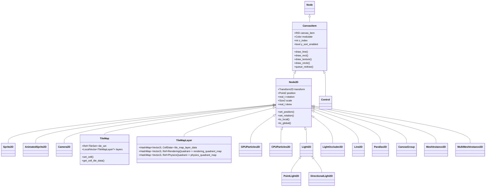

# 07 - 2D 场景节点 (2D Scene Nodes) 深度分析

> **核心结论：Godot 将 2D 作为一等公民内置于引擎核心，拥有独立的 CanvasItem 渲染管线和原生 Transform2D 体系；而 UE 的 2D 能力依赖 Paper2D 插件在 3D 世界中模拟，本质上是"3D 引擎上的 2D 补丁"。**

---

## 目录

- [第 1 章：模块概览 — "UE 程序员 30 秒速览"](#第-1-章模块概览--ue-程序员-30-秒速览)
- [第 2 章：架构对比 — "同一个问题，两种解法"](#第-2-章架构对比--同一个问题两种解法)
- [第 3 章：核心实现对比 — "代码层面的差异"](#第-3-章核心实现对比--代码层面的差异)
- [第 4 章：UE → Godot 迁移指南](#第-4-章ue--godot-迁移指南)
- [第 5 章：性能对比](#第-5-章性能对比)
- [第 6 章：总结 — "一句话记住"](#第-6-章总结--一句话记住)

---

## 第 1 章：模块概览 — "UE 程序员 30 秒速览"

### 一句话说明

Godot 的 `scene/2d/` 模块提供了完整的原生 2D 游戏开发节点体系——从基础变换（Node2D）、精灵渲染（Sprite2D）、相机控制（Camera2D）、瓦片地图（TileMap/TileMapLayer）到粒子系统（GPUParticles2D/CPUParticles2D）、2D 光照（Light2D）和视差滚动（Parallax2D）。这对应 UE 中需要 **Paper2D 插件 + 正交投影 Camera + UMG/Slate 渲染** 才能拼凑出来的 2D 能力。

### 核心类/结构体列表

| # | Godot 类 | 源码路径 | 职责 | UE 对应物 |
|---|---------|---------|------|----------|
| 1 | `CanvasItem` | `scene/main/canvas_item.h` | 所有 2D 可绘制节点的基类，提供 draw_* API、可见性、Z 排序 | `UWidget` / `SWidget`（UMG/Slate 基类） |
| 2 | `Node2D` | `scene/2d/node_2d.h` | 2D 变换节点基类，持有 Transform2D | `USceneComponent`（3D 变换）+ Paper2D 的 `UPaperSpriteComponent` |
| 3 | `Sprite2D` | `scene/2d/sprite_2d.h` | 2D 精灵渲染，支持帧动画、区域裁剪 | `UPaperSpriteComponent` |
| 4 | `AnimatedSprite2D` | `scene/2d/animated_sprite_2d.h` | 帧动画精灵，基于 SpriteFrames 资源 | `UPaperFlipbookComponent` |
| 5 | `Camera2D` | `scene/2d/camera_2d.h` | 2D 相机，内置平滑跟随、限制区域、拖拽边距 | `ACameraActor` + 正交投影设置 |
| 6 | `TileMap` | `scene/2d/tile_map.h` | 瓦片地图容器节点，管理多个 TileMapLayer | `UPaperTileMapComponent` |
| 7 | `TileMapLayer` | `scene/2d/tile_map_layer.h` | 单层瓦片地图，含渲染/物理/导航 Quadrant 系统 | Paper2D TileMap 的单层 |
| 8 | `GPUParticles2D` | `scene/2d/gpu_particles_2d.h` | GPU 加速 2D 粒子系统 | `UParticleSystemComponent`（Cascade/Niagara 2D 模式） |
| 9 | `CPUParticles2D` | `scene/2d/cpu_particles_2d.h` | CPU 2D 粒子系统，兼容性更好 | 无直接对应，需 Niagara CPU 模拟 |
| 10 | `Light2D` / `PointLight2D` / `DirectionalLight2D` | `scene/2d/light_2d.h` | 2D 光照系统，支持阴影 | 无原生对应，需自定义 Material/后处理 |
| 11 | `LightOccluder2D` | `scene/2d/light_occluder_2d.h` | 2D 光照遮挡体 | 无原生对应 |
| 12 | `Parallax2D` | `scene/2d/parallax_2d.h` | 视差滚动效果 | 需手动实现或使用 Material 偏移 |
| 13 | `Line2D` | `scene/2d/line_2d.h` | 2D 线条渲染，支持纹理、渐变、接头样式 | `USplineComponent` 的 2D 简化版 |
| 14 | `CanvasGroup` | `scene/2d/canvas_group.h` | 将子节点合并为一个绘制组 | `UCanvasPanel`（UMG 中的容器概念） |

### Godot vs UE 概念速查表

| 概念 | Godot | UE |
|------|-------|-----|
| 2D 基础变换 | `Node2D` + `Transform2D`（原生 2D 矩阵） | `AActor` + `FTransform`（3D 变换，Z=0 模拟 2D） |
| 2D 渲染管线 | `CanvasItem` → `RenderingServer` Canvas 管线 | Paper2D → 3D 渲染管线（正交投影） |
| 精灵 | `Sprite2D`（节点即精灵） | `UPaperSpriteComponent`（组件挂载到 Actor） |
| 帧动画 | `AnimatedSprite2D` + `SpriteFrames` 资源 | `UPaperFlipbookComponent` + `UPaperFlipbook` |
| 瓦片地图 | `TileMap` + `TileMapLayer` + `TileSet` 资源 | `UPaperTileMapComponent` + `UPaperTileSet` |
| 2D 相机 | `Camera2D`（原生 2D 相机，操控 Canvas Transform） | `ACameraActor` 设为正交投影模式 |
| 2D 粒子 | `GPUParticles2D` / `CPUParticles2D` | Niagara/Cascade 配置为 2D 模式 |
| 2D 光照 | `Light2D` + `LightOccluder2D`（原生 2D 光照管线） | 无原生支持，需自定义 Material |
| 2D 物理 | 内置于 TileMapLayer（Quadrant 系统自动生成碰撞体） | Paper2D 需手动配置碰撞 |
| 视差滚动 | `Parallax2D`（内置节点） | 需手动编码或 Material 技巧 |
| 绘制 API | `CanvasItem.draw_*()` 系列（30+ 绘制方法） | Slate `OnPaint()` / `FCanvas` |
| Z 排序 | `CanvasItem.z_index` + Y-Sort | Actor 的 TranslucentSortPriority |

---

## 第 2 章：架构对比 — "同一个问题，两种解法"

### 2.1 Godot 的 2D 架构设计

Godot 的 2D 系统建立在一个清晰的继承链上：`Node` → `CanvasItem` → `Node2D` → 各种具体 2D 节点。这个继承链的核心设计理念是 **"2D 是一等公民"**——2D 拥有完全独立于 3D 的渲染管线（Canvas 管线），使用原生的 `Transform2D`（3×2 矩阵）而非 3D 的 4×4 矩阵。



**关键架构特征：**

1. **CanvasItem 是 2D 世界的基石**：所有 2D 可见节点（包括 UI 的 `Control`）都继承自 `CanvasItem`。它持有一个 `RID canvas_item`，这是渲染服务器中的句柄，所有绘制命令都通过这个 RID 提交给 `RenderingServer`。

2. **Node2D 提供 2D 变换语义**：在 `CanvasItem` 之上，`Node2D` 添加了 `position`、`rotation`、`scale`、`skew` 四个分量，以及完整的 `Transform2D` 矩阵。变换的更新通过 `_update_transform()` 直接调用 `RenderingServer::canvas_item_set_transform()`，将变换矩阵推送到渲染线程。

3. **Quadrant 系统（TileMapLayer 独有）**：TileMapLayer 使用 Quadrant（象限）系统来批量管理瓦片的渲染、物理和导航。每个 Quadrant 是一组相邻瓦片的集合，共享一个 `canvas_item`（渲染）或 `body`（物理），大幅减少了 draw call 和物理体数量。

### 2.2 UE 的 2D 架构设计

UE 的 2D 能力主要来自两个途径：

1. **Paper2D 插件**：提供 `UPaperSpriteComponent`、`UPaperFlipbookComponent`、`UPaperTileMapComponent` 等组件。但这些本质上是 **3D 网格**——Paper2D 的 Sprite 实际上是一个面朝相机的四边形 Mesh，使用标准的 3D 渲染管线（Deferred/Forward）进行渲染。

2. **UMG/Slate**：UE 的 UI 框架提供了 2D 绘制能力（`SWidget::OnPaint()`、`FSlateDrawElement`），但它设计目标是 UI 而非游戏世界。

**UE 2D 的核心问题**：没有独立的 2D 渲染管线。所有 2D 内容都必须通过 3D 管线渲染，这意味着：
- 每个 Sprite 都是一个 3D Actor + Component，有完整的 3D 变换开销
- 正交投影需要手动配置 Camera
- 无原生 2D 光照系统
- 无原生 2D 物理优化（虽然可以用 Box2D 等第三方库）

### 2.3 关键架构差异分析

#### 差异 1：节点 vs 组件 — 设计哲学的根本分歧

Godot 采用 **"节点即实体"** 的设计：一个 `Sprite2D` 节点本身就是一个完整的可渲染实体，它同时拥有变换、渲染、可见性等所有能力。这源自 Godot 的 **组合式节点树** 哲学——通过将不同功能的节点组合在一起构建游戏对象。

```cpp
// Godot: Sprite2D 直接继承 Node2D，自身就是完整实体
// 源码: scene/2d/sprite_2d.h
class Sprite2D : public Node2D {
    GDCLASS(Sprite2D, Node2D);
    Ref<Texture2D> texture;
    bool centered = true;
    Point2 offset;
    // ... 所有属性直接在节点上
};
```

UE 采用 **"Actor + Component"** 模式：一个 2D 精灵需要一个 `AActor` 作为容器，再挂载 `UPaperSpriteComponent` 作为渲染组件。Actor 提供世界存在性，Component 提供具体功能。

```cpp
// UE: 需要 Actor + Component 组合
// Engine/Plugins/2D/Paper2D/Source/Paper2D/Classes/PaperSpriteComponent.h
class UPaperSpriteComponent : public UMeshComponent {
    UPROPERTY()
    UPaperSprite* SourceSprite;
    // Component 挂载到 Actor 上
};
```

**Trade-off 分析**：Godot 的节点模式更轻量（一个对象 vs 两个对象），但灵活性稍低——你不能在运行时给一个 Node2D 动态添加"精灵渲染能力"。UE 的 Component 模式更灵活（可以动态组合），但对于 2D 游戏来说过于重量级。对于 2D 游戏开发，Godot 的方案明显更高效。

#### 差异 2：原生 2D 变换 vs 3D 变换降维

Godot 的 `Node2D` 使用原生的 `Transform2D`（3×2 矩阵，6 个浮点数），直接在 2D 空间中进行变换计算：

```cpp
// 源码: scene/2d/node_2d.cpp
void Node2D::_update_transform() {
    transform.set_rotation_scale_and_skew(rotation, scale, skew);
    transform.columns[2] = position;
    RenderingServer::get_singleton()->canvas_item_set_transform(get_canvas_item(), transform);
    _notify_transform();
}
```

UE 的 Paper2D 使用标准的 `FTransform`（3D 变换：位置 FVector、旋转 FQuat、缩放 FVector），即使在纯 2D 场景中也要携带 Z 轴信息和四元数旋转：

```cpp
// UE: FTransform 包含 3D 数据
struct FTransform {
    FQuat Rotation;    // 四元数 (4 floats)
    FVector Translation; // 3D 位置 (3 floats)  
    FVector Scale3D;     // 3D 缩放 (3 floats)
    // 总计 10 floats，而 Godot 只需 6 floats
};
```

**Trade-off 分析**：Godot 的 Transform2D 在内存和计算上都更高效（6 vs 10 floats，2D 矩阵乘法 vs 四元数运算）。但 UE 的方案允许 2D 对象无缝过渡到 2.5D 或 3D 场景。对于纯 2D 游戏，Godot 的方案在性能上有明显优势。

#### 差异 3：独立 Canvas 管线 vs 复用 3D 管线

Godot 拥有完全独立的 **Canvas 渲染管线**。`CanvasItem` 的绘制命令（`draw_line`、`draw_texture` 等）被提交到 `RenderingServer` 的 Canvas 子系统，该子系统有自己的排序、批处理和渲染逻辑，完全独立于 3D 管线：

```cpp
// 源码: scene/main/canvas_item.h
// CanvasItem 提供 30+ 种 2D 绘制方法
void draw_line(const Point2 &p_from, const Point2 &p_to, const Color &p_color, ...);
void draw_rect(const Rect2 &p_rect, const Color &p_color, ...);
void draw_texture(RequiredParam<Texture2D> rp_texture, const Point2 &p_pos, ...);
void draw_circle(const Point2 &p_pos, real_t p_radius, const Color &p_color, ...);
void draw_polygon(const Vector<Point2> &p_points, const Vector<Color> &p_colors, ...);
void draw_mesh(RequiredParam<Mesh> rp_mesh, ...);
// ... 还有更多
```

UE 的 Paper2D 则完全复用 3D 渲染管线。每个 Paper2D Sprite 都是一个标准的 `UMeshComponent`，生成四边形 Mesh，通过 Deferred/Forward 渲染路径绘制。这意味着 2D 精灵会经历完整的 3D 渲染流程：深度测试、光照计算（即使不需要）、后处理等。

**Trade-off 分析**：Godot 的独立 Canvas 管线可以针对 2D 场景做专门优化（如 2D 批处理、跳过深度测试），渲染效率更高。但 UE 的方案让 2D 对象可以自然地与 3D 对象混合渲染，适合 2.5D 游戏。Godot 如果需要 2D/3D 混合，则需要通过 `SubViewport` 等机制来桥接。

---

## 第 3 章：核心实现对比 — "代码层面的差异"

### 3.1 Node2D vs Paper2D Actor：2D 基础变换

#### Godot 的实现

`Node2D`（`scene/2d/node_2d.h/cpp`）是 Godot 2D 世界的基础变换节点。它的设计极其精简——仅 122 行头文件、516 行实现。

**核心数据结构**：

```cpp
// scene/2d/node_2d.h
class Node2D : public CanvasItem {
    mutable MTFlag xform_dirty;      // 脏标记（支持多线程）
    mutable Point2 position;          // 位置
    mutable real_t rotation = 0.0;    // 旋转（弧度）
    mutable Size2 scale = Vector2(1, 1); // 缩放
    mutable real_t skew = 0.0;        // 倾斜
    Transform2D transform;            // 最终变换矩阵
};
```

**关键设计：延迟更新（Lazy Update）**

Node2D 使用脏标记模式来避免不必要的矩阵分解。当直接设置 `transform` 时，`position/rotation/scale/skew` 不会立即更新，而是标记为脏。只有在读取这些分量时才会从矩阵中提取：

```cpp
// scene/2d/node_2d.cpp
void Node2D::_update_xform_values() const {
    rotation = transform.get_rotation();
    skew = transform.get_skew();
    position = transform.columns[2];
    scale = transform.get_scale();
    _set_xform_dirty(false);
}

Point2 Node2D::get_position() const {
    if (_is_xform_dirty()) {
        _update_xform_values();  // 延迟计算
    }
    return position;
}
```

反之，当设置分量时，会立即重建矩阵并推送到渲染服务器：

```cpp
void Node2D::set_position(const Point2 &p_pos) {
    if (_is_xform_dirty()) { _update_xform_values(); }
    position = p_pos;
    _update_transform();  // 立即重建矩阵
}

void Node2D::_update_transform() {
    transform.set_rotation_scale_and_skew(rotation, scale, skew);
    transform.columns[2] = position;
    RenderingServer::get_singleton()->canvas_item_set_transform(get_canvas_item(), transform);
    _notify_transform();
}
```

**全局变换的计算**：

```cpp
// scene/2d/node_2d.cpp
void Node2D::set_global_position(const Point2 &p_pos) {
    CanvasItem *parent = get_parent_item();
    if (parent) {
        Transform2D inv = parent->get_global_transform().affine_inverse();
        set_position(inv.xform(p_pos));  // 通过父节点逆变换计算本地位置
    } else {
        set_position(p_pos);
    }
}
```

#### UE 的实现

UE 中没有专门的 "2D 变换节点"。Paper2D 的 Actor 使用标准的 `USceneComponent`（`Engine/Source/Runtime/Engine/Classes/Components/SceneComponent.h`），它管理 3D 空间中的 `FTransform`：

```cpp
// UE: SceneComponent.h (简化)
class USceneComponent : public UActorComponent {
    UPROPERTY()
    FVector RelativeLocation;    // 3D 位置
    UPROPERTY()
    FRotator RelativeRotation;   // 3D 旋转（Pitch/Yaw/Roll）
    UPROPERTY()
    FVector RelativeScale3D;     // 3D 缩放
    
    FTransform ComponentToWorld;  // 世界变换（含四元数）
};
```

#### 差异点评

| 对比维度 | Godot Node2D | UE SceneComponent |
|---------|-------------|-------------------|
| 变换矩阵 | Transform2D (3×2, 6 floats) | FTransform (Quat+Vec+Vec, 10 floats) |
| 内存占用 | ~24 bytes (矩阵) + ~24 bytes (分量) | ~40 bytes (FTransform) + ~36 bytes (分量) |
| 旋转表示 | 单个 real_t（弧度） | FRotator (3 floats) 或 FQuat (4 floats) |
| 倾斜(Skew) | 原生支持 | 不支持（需自定义） |
| 脏标记 | 有，支持多线程 (MTFlag) | 有，通过 bComponentToWorldUpdated |
| 渲染推送 | 直接调用 RenderingServer | 通过 FPrimitiveSceneProxy |

Godot 的方案在 2D 场景中更高效：更少的内存、更简单的数学运算、更直接的渲染路径。UE 的方案则为 2D/3D 混合提供了无缝支持。

### 3.2 Camera2D vs 正交投影相机：2D 视口控制

#### Godot 的实现

`Camera2D`（`scene/2d/camera_2d.h/cpp`）是 Godot 中最功能丰富的 2D 节点之一，共 213 行头文件、1008 行实现。它不是一个"真正的相机"，而是一个 **Canvas Transform 控制器**——通过修改 Viewport 的 canvas_transform 来实现视口滚动效果。

**核心机制**：

```cpp
// scene/2d/camera_2d.cpp
void Camera2D::_update_scroll() {
    if (!is_inside_tree() || !viewport) return;
    if (is_current()) {
        Transform2D xform;
        if (is_physics_interpolated_and_enabled()) {
            // 物理插值：在前一帧和当前帧之间插值
            xform = _interpolation_data.xform_prev.interpolate_with(
                _interpolation_data.xform_curr, 
                Engine::get_singleton()->get_physics_interpolation_fraction());
        } else {
            xform = get_camera_transform();
        }
        viewport->set_canvas_transform(xform);  // 关键：修改 Viewport 的 Canvas 变换
    }
}
```

**内置功能一览**：

1. **位置平滑跟随**：通过指数衰减插值实现平滑相机移动
```cpp
if (position_smoothing_enabled) {
    real_t c = position_smoothing_speed * delta;
    smoothed_camera_pos = ((camera_pos - smoothed_camera_pos) * c) + smoothed_camera_pos;
}
```

2. **旋转平滑**：
```cpp
if (rotation_smoothing_enabled) {
    real_t step = rotation_smoothing_speed * delta;
    camera_angle = Math::lerp_angle(camera_angle, get_global_rotation(), step);
}
```

3. **边界限制（Limit）**：四个方向的像素级限制
```cpp
int limit[4] = { -10000000, -10000000, 10000000, 10000000 }; // Left, top, right, bottom
```

4. **拖拽边距（Drag Margin）**：玩家在屏幕中心区域移动时相机不跟随，超出边距才开始跟随
```cpp
real_t drag_margin[4] = { 0.2, 0.2, 0.2, 0.2 };
```

5. **物理插值**：支持在物理帧之间进行变换插值，消除抖动
```cpp
struct InterpolationData {
    Transform2D xform_curr;
    Transform2D xform_prev;
    uint32_t last_update_physics_tick = UINT32_MAX;
};
```

#### UE 的实现

UE 没有专门的 2D 相机。实现 2D 视口控制需要：

1. 创建一个 `ACameraActor`
2. 将其 `UCameraComponent` 设置为正交投影模式
3. 手动编写跟随逻辑、平滑、边界限制等

```cpp
// UE: 需要手动配置正交投影
UCameraComponent* Camera = CreateDefaultSubobject<UCameraComponent>(TEXT("Camera"));
Camera->ProjectionMode = ECameraProjectionMode::Orthographic;
Camera->OrthoWidth = 1024.0f;
// 平滑跟随、边界限制等需要自己实现...
```

#### 差异点评

| 功能 | Godot Camera2D | UE 正交相机 |
|------|----------------|------------|
| 位置平滑 | 内置，一个属性开关 | 需自行实现 |
| 旋转平滑 | 内置 | 需自行实现 |
| 边界限制 | 内置（四方向像素级） | 需自行实现 |
| 拖拽边距 | 内置（Dead Zone 概念） | 需自行实现 |
| 物理插值 | 内置 | 需自行实现 |
| 缩放 | `zoom` 属性（Vector2） | 修改 OrthoWidth |
| 多相机切换 | `make_current()` 一行代码 | `SetViewTarget()` |
| 实现原理 | 修改 Canvas Transform | 修改 Camera 世界位置 |

Godot 的 Camera2D 是一个 **"开箱即用"** 的 2D 相机解决方案，UE 程序员在 UE 中需要几百行代码才能实现的功能，在 Godot 中只需设置几个属性。这是 Godot 作为 2D 引擎的核心优势之一。

### 3.3 TileMap/TileMapLayer vs Paper2D TileMap：瓦片地图系统

#### Godot 的实现

Godot 的瓦片地图系统是整个 `scene/2d/` 模块中最复杂的部分，由三个核心类组成：

1. **`TileSet`**（资源）：定义瓦片集，包含图集、物理形状、导航多边形、遮挡器等
2. **`TileMap`**（节点）：容器节点，管理多个 TileMapLayer
3. **`TileMapLayer`**（节点）：单层瓦片数据和渲染/物理/导航逻辑

**TileMapLayer 的 Quadrant 系统**是核心优化机制。源码中定义了三种 Quadrant：

```cpp
// scene/2d/tile_map_layer.h

// 渲染象限：将相邻瓦片合并为一个 canvas_item 绘制
class RenderingQuadrant : public RefCounted {
    Vector2i quadrant_coords;
    SelfList<CellData>::List cells;
    List<RID> canvas_items;          // 合并后的绘制项
    Vector2 canvas_items_position;
};

// 物理象限：将相邻瓦片的碰撞形状合并为一个物理体
class PhysicsQuadrant : public RefCounted {
    Vector2i quadrant_coords;
    SelfList<CellData>::List cells;
    HashMap<PhysicsBodyKey, PhysicsBodyValue, PhysicsBodyKeyHasher> bodies;
    LocalVector<Ref<ConvexPolygonShape2D>> shapes;
};
```

**CellData 结构**——每个瓦片的完整数据：

```cpp
// scene/2d/tile_map_layer.h
struct CellData {
    Vector2i coords;                    // 瓦片坐标
    TileMapCell cell;                   // 瓦片数据（source_id, atlas_coords, alternative）
    
    Ref<RenderingQuadrant> rendering_quadrant;  // 所属渲染象限
    LocalVector<LocalVector<RID>> occluders;     // 遮挡器
    
    Ref<PhysicsQuadrant> physics_quadrant;       // 所属物理象限
    
    LocalVector<RID> navigation_regions;          // 导航区域
    String scene;                                 // 场景实例
    TileData *runtime_tile_data_cache = nullptr;  // 运行时数据缓存
    
    SelfList<CellData> dirty_list_element;        // 脏列表链表节点
};
```

**数据存储**：使用 `HashMap<Vector2i, CellData>` 存储瓦片数据，支持无限大小的地图（不需要预定义尺寸）：

```cpp
// scene/2d/tile_map_layer.h
class TileMapLayer : public Node2D {
    HashMap<Vector2i, CellData> tile_map_layer_data;  // 核心数据
    int rendering_quadrant_size = 16;  // 渲染象限大小
    int physics_quadrant_size = 16;    // 物理象限大小
};
```

**Terrain 系统**：Godot 的 TileMap 内置了自动地形（Auto-Terrain）系统，可以根据约束条件自动选择正确的瓦片变体：

```cpp
// scene/2d/tile_map_layer.h
class TerrainConstraint {
    Ref<TileSet> tile_set;
    Vector2i base_cell_coords;
    int bit = -1;
    int terrain = -1;
    int priority = 1;
    // 用于自动地形匹配
};
```

#### UE Paper2D TileMap 的实现

UE 的 Paper2D TileMap（`UPaperTileMapComponent`）采用完全不同的架构：

- 基于固定大小的 2D 数组存储瓦片
- 每个瓦片是一个 `FPaperTileInfo` 结构
- 渲染通过生成 3D Mesh 实现
- 没有内置的 Quadrant 优化
- 没有自动地形系统
- 物理碰撞需要手动配置

#### 差异点评

| 对比维度 | Godot TileMap | UE Paper2D TileMap |
|---------|-------------|-------------------|
| 数据结构 | HashMap（稀疏，无限大小） | 2D 数组（固定大小） |
| 渲染优化 | Quadrant 批处理系统 | 生成 3D Mesh |
| 物理集成 | 自动生成碰撞体（Quadrant 合并） | 需手动配置 |
| 导航集成 | 自动生成导航区域 | 需手动配置 |
| 遮挡集成 | 自动生成遮挡器 | 不支持 |
| 自动地形 | 内置 Terrain 系统 | 不支持 |
| 多层支持 | TileMapLayer 节点（独立节点） | 内置层数组 |
| 运行时修改 | `_tile_data_runtime_update` 虚函数 | 需自行实现 |
| Y-Sort | 内置支持 | 需自行实现 |

Godot 的 TileMap 系统在功能完整性和性能优化上都远超 UE 的 Paper2D TileMap。特别是 Quadrant 系统的自动批处理和物理/导航集成，让开发者几乎不需要关心底层优化。

### 3.4 CanvasItem 绘制管线 vs Slate/UMG 渲染

#### Godot 的 draw_* API

`CanvasItem`（`scene/main/canvas_item.h`）提供了超过 30 种绘制方法，这些方法可以在任何 `CanvasItem` 子类的 `_draw()` 虚函数中调用：

```cpp
// scene/main/canvas_item.h - 绘制 API 摘录
void draw_line(const Point2 &p_from, const Point2 &p_to, const Color &p_color, ...);
void draw_polyline(const Vector<Point2> &p_points, const Color &p_color, ...);
void draw_arc(const Vector2 &p_center, real_t p_radius, ...);
void draw_rect(const Rect2 &p_rect, const Color &p_color, ...);
void draw_circle(const Point2 &p_pos, real_t p_radius, const Color &p_color, ...);
void draw_ellipse(const Point2 &p_pos, real_t p_major, real_t p_minor, ...);
void draw_texture(RequiredParam<Texture2D> rp_texture, const Point2 &p_pos, ...);
void draw_texture_rect(RequiredParam<Texture2D> rp_texture, const Rect2 &p_rect, ...);
void draw_texture_rect_region(RequiredParam<Texture2D> rp_texture, ...);
void draw_polygon(const Vector<Point2> &p_points, const Vector<Color> &p_colors, ...);
void draw_colored_polygon(const Vector<Point2> &p_points, const Color &p_color, ...);
void draw_mesh(RequiredParam<Mesh> rp_mesh, ...);
void draw_multimesh(RequiredParam<MultiMesh> rp_multimesh, ...);
void draw_string(RequiredParam<Font> rp_font, const Point2 &p_pos, const String &p_text, ...);
void draw_set_transform(const Point2 &p_offset, real_t p_rot, const Size2 &p_scale);
```

**使用方式**：

```gdscript
# GDScript 示例
func _draw():
    draw_circle(Vector2(100, 100), 50, Color.RED)
    draw_line(Vector2(0, 0), Vector2(200, 200), Color.WHITE, 2.0)
    draw_texture(my_texture, Vector2(50, 50))
```

**渲染流程**：
1. 节点调用 `queue_redraw()` 标记需要重绘
2. 引擎在帧末调用 `_draw()` 虚函数
3. `draw_*` 方法将绘制命令提交到 `RenderingServer`
4. `RenderingServer` 的 Canvas 子系统进行排序、批处理、渲染

**Sprite2D 的绘制实现**：

```cpp
// scene/2d/sprite_2d.cpp
void Sprite2D::_notification(int p_what) {
    switch (p_what) {
        case NOTIFICATION_DRAW: {
            if (texture.is_null()) return;
            RID ci = get_canvas_item();
            Rect2 src_rect, dst_rect;
            bool filter_clip_enabled;
            _get_rects(src_rect, dst_rect, filter_clip_enabled);
            texture->draw_rect_region(ci, dst_rect, src_rect, Color(1, 1, 1), false, filter_clip_enabled);
        } break;
    }
}
```

#### UE 的 Slate/UMG 绘制

UE 的 2D 绘制主要通过 Slate 框架：

```cpp
// UE: Slate 绘制方式
int32 SMyWidget::OnPaint(const FPaintArgs& Args, const FGeometry& AllottedGeometry,
    const FSlateRect& MyCullingRect, FSlateWindowElementList& OutDrawElements,
    int32 LayerId, const FWidgetStyle& InWidgetStyle, bool bParentEnabled) const
{
    FSlateDrawElement::MakeBox(OutDrawElements, LayerId, AllottedGeometry.ToPaintGeometry(),
        MyBrush, ESlateDrawEffect::None, FLinearColor::White);
    return LayerId;
}
```

#### 差异点评

| 对比维度 | Godot CanvasItem draw_* | UE Slate OnPaint |
|---------|------------------------|------------------|
| API 风格 | 即时模式（Immediate Mode） | 保留模式（Retained Mode） |
| 调用方式 | 在 `_draw()` 中直接调用 | 在 `OnPaint()` 中构建 DrawElement |
| 绘制类型 | 30+ 种原语（线、圆、弧、多边形、纹理、网格、文字...） | 主要是 Box、Line、Text、Spline |
| 坐标系 | 本地坐标（自动应用变换链） | 需要手动处理 Geometry |
| 批处理 | RenderingServer 自动批处理 | Slate 批处理 |
| 适用场景 | 游戏世界 2D 渲染 | UI 渲染 |
| 抗锯齿 | 内置参数支持 | 依赖 MSAA/FXAA |

Godot 的 draw_* API 是为游戏开发设计的即时模式绘制接口，使用简单直观。UE 的 Slate 则是为 UI 框架设计的，用于游戏世界的 2D 绘制并不方便。

---

## 第 4 章：UE → Godot 迁移指南

### 4.1 思维转换清单

#### ❌ 忘掉 1：Actor + Component 模式
在 UE 中，你习惯了 "创建 Actor → 添加 Component" 的模式。在 Godot 中，**节点本身就是功能单元**。一个 `Sprite2D` 不需要挂载到任何"容器"上——它自己就是一个完整的可渲染实体。

**UE 思维**：`APawn` → 添加 `UPaperSpriteComponent` → 添加 `UBoxComponent`
**Godot 思维**：`CharacterBody2D` → 添加子节点 `Sprite2D` → 添加子节点 `CollisionShape2D`

#### ❌ 忘掉 2：3D 坐标系中做 2D
在 UE 中做 2D 游戏，你需要时刻记住 "Z 轴设为 0"、"使用正交投影"、"锁定旋转轴"。在 Godot 中，**2D 世界就是 2D 的**——没有 Z 轴（排序用 `z_index` 属性），没有深度缓冲，变换就是 2D 矩阵。

#### ❌ 忘掉 3：手动管理相机跟随逻辑
在 UE 中，你可能写过几百行的相机跟随代码（平滑、边界、死区）。在 Godot 中，`Camera2D` **内置了所有这些功能**——只需在编辑器中勾选属性即可。

#### ✅ 重新学 1：节点树组合模式
Godot 的核心设计模式是 **节点树组合**。一个游戏角色不是一个"大类"，而是一棵节点树：

```
CharacterBody2D (物理+移动)
├── Sprite2D (渲染)
├── AnimationPlayer (动画)
├── CollisionShape2D (碰撞)
├── Camera2D (相机跟随)
└── Area2D (检测区域)
    └── CollisionShape2D
```

#### ✅ 重新学 2：信号（Signal）驱动的事件系统
UE 使用 Delegate/Event 和蓝图事件。Godot 使用 **Signal** 系统，它更轻量且与编辑器深度集成。

#### ✅ 重新学 3：CanvasItem 的绘制生命周期
理解 `queue_redraw()` → `NOTIFICATION_DRAW` → `_draw()` 的流程。这是 Godot 2D 自定义渲染的核心模式。

### 4.2 API 映射表

| UE API / 概念 | Godot 等价 API | 备注 |
|--------------|---------------|------|
| `UPaperSpriteComponent::SetSprite()` | `Sprite2D.set_texture()` | Godot 直接设置 Texture2D |
| `UPaperFlipbookComponent::SetFlipbook()` | `AnimatedSprite2D.set_sprite_frames()` | SpriteFrames 资源包含所有动画 |
| `UPaperFlipbookComponent::Play()` | `AnimatedSprite2D.play("anim_name")` | 直接传动画名 |
| `UCameraComponent::ProjectionMode = Orthographic` | `Camera2D`（默认就是 2D） | 不需要配置投影模式 |
| `AActor::SetActorLocation()` | `Node2D.set_position()` / `set_global_position()` | 区分本地和全局 |
| `AActor::SetActorRotation()` | `Node2D.set_rotation()` | 单个 float（弧度） |
| `UPaperTileMapComponent::SetTile()` | `TileMap.set_cell(layer, coords, source_id, atlas_coords)` | 需要指定层和图集坐标 |
| `FSlateDrawElement::MakeBox()` | `CanvasItem.draw_rect()` | 即时模式 vs 保留模式 |
| `FSlateDrawElement::MakeLine()` | `CanvasItem.draw_line()` | 更简洁的 API |
| `USceneComponent::GetComponentTransform()` | `Node2D.get_global_transform()` | 返回 Transform2D |
| `AActor::GetActorForwardVector()` | `Node2D.transform[0]`（X 轴方向） | 2D 中"前方"通常是 X 轴正方向 |
| `UParticleSystemComponent::Activate()` | `GPUParticles2D.set_emitting(true)` | 或 `CPUParticles2D` |
| `APointLight` (3D) | `PointLight2D` | 原生 2D 光照 |
| `SetViewTarget()` | `Camera2D.make_current()` | 一行代码切换相机 |
| `USceneComponent::AttachToComponent()` | 直接添加为子节点 `add_child()` | 节点树天然支持 |

### 4.3 陷阱与误区

#### 陷阱 1：不要用 3D 思维做 Z 排序

**UE 习惯**：通过调整 Actor 的 Z 坐标或 `TranslucentSortPriority` 来控制 2D 渲染顺序。

**Godot 正确做法**：使用 `CanvasItem.z_index` 属性（范围 -4096 到 4096）或启用 `y_sort_enabled` 让引擎根据 Y 坐标自动排序。

```gdscript
# 错误：试图用 Z 坐标排序（Godot 2D 没有 Z 坐标）
# position.z = 10  # ❌ 不存在

# 正确：使用 z_index
z_index = 10  # ✅
# 或启用 Y-Sort
y_sort_enabled = true  # ✅ 子节点按 Y 坐标排序
```

#### 陷阱 2：不要手写相机跟随代码

**UE 习惯**：在 Tick 中手动计算相机位置、应用平滑、检查边界。

**Godot 正确做法**：直接使用 Camera2D 的内置功能。

```gdscript
# 错误：手动实现相机跟随
# func _process(delta):
#     camera.position = camera.position.lerp(target.position, 0.1)  # ❌ 不需要

# 正确：Camera2D 作为目标的子节点，启用平滑
# 在编辑器中：
# - 将 Camera2D 添加为玩家角色的子节点
# - 启用 position_smoothing_enabled
# - 设置 position_smoothing_speed
# - 设置 limit（边界）
```

#### 陷阱 3：不要为每个瓦片创建单独的节点

**UE 习惯**：在 Paper2D 中，可能会为特殊瓦片创建单独的 Actor。

**Godot 正确做法**：使用 TileMap 的 `_tile_data_runtime_update` 虚函数来动态修改瓦片数据，或使用 TileSet 的 Scene 类型瓦片来嵌入场景。

```gdscript
# 正确：使用运行时瓦片数据更新
func _use_tile_data_runtime_update(layer, coords):
    return coords == special_tile_coords

func _tile_data_runtime_update(layer, coords, tile_data):
    tile_data.set_custom_data("health", current_health)
```

#### 陷阱 4：混淆 Node2D 和 Control 的坐标系

**UE 习惯**：UMG Widget 和游戏世界 Actor 使用不同的坐标系，这在 Godot 中也是如此。

**Godot 注意**：`Node2D` 和 `Control` 虽然都继承自 `CanvasItem`，但它们的坐标系和布局逻辑完全不同。`Node2D` 使用世界坐标（像素），`Control` 使用锚点+偏移的布局系统。不要试图将 `Control` 节点放在 `Node2D` 下面（虽然技术上可以，但行为会很奇怪）。

### 4.4 最佳实践

1. **善用场景继承**：将可复用的 2D 对象（如敌人、道具）做成独立场景（.tscn），然后在主场景中实例化。这类似于 UE 的 Blueprint，但更轻量。

2. **利用 Y-Sort 实现伪 3D 深度**：对于俯视角 2D 游戏，启用 `y_sort_enabled` 可以自动实现"靠下的物体遮挡靠上的物体"效果。

3. **TileMap 分层策略**：
   - 地面层：最底层，无碰撞
   - 碰撞层：墙壁等，启用碰撞
   - 装饰层：最上层，无碰撞
   - 每层使用独立的 `TileMapLayer` 节点

4. **粒子系统选择**：
   - 少量粒子（<100）或需要精确控制：使用 `CPUParticles2D`
   - 大量粒子（>100）且 GPU 可用：使用 `GPUParticles2D`

5. **自定义绘制优于大量节点**：如果需要绘制大量简单图形（如弹幕），使用 `_draw()` + `draw_*` API 比创建大量 Sprite2D 节点更高效。

---

## 第 5 章：性能对比

### 5.1 Godot 2D 模块的性能特征

#### 渲染性能

Godot 的 Canvas 渲染管线针对 2D 做了专门优化：

1. **自动批处理（Batching）**：相邻的、使用相同材质的 CanvasItem 会被自动合并为一个 draw call。这对于 TileMap 尤其重要——Quadrant 系统将 16×16 区域的瓦片合并为一个 canvas_item。

2. **Z-Index 排序**：Canvas 管线使用稳定排序，按 `z_index` → 节点树顺序排列，避免了 3D 管线中复杂的深度测试。

3. **裁剪优化**：不在视口内的 CanvasItem 会被自动跳过（通过 `visibility_rect` 或自动计算的边界框）。

#### TileMap 性能

TileMapLayer 的 Quadrant 系统是性能的关键：

```
// 假设一个 100×100 的瓦片地图
// 无 Quadrant：10,000 个 draw call + 10,000 个物理体
// 有 Quadrant（16×16）：~49 个 draw call + ~49 个物理体（合并后）
// 性能提升：约 200 倍
```

Quadrant 大小（`rendering_quadrant_size`）是可配置的，默认 16。更大的 Quadrant 意味着更少的 draw call，但更新单个瓦片时需要重建更大的区域。

#### 粒子性能

- **GPUParticles2D**：粒子模拟在 GPU 上进行，CPU 开销极低。但需要 GPU 支持 compute shader。通过 `RID particles` 直接与 RenderingServer 交互。
- **CPUParticles2D**：粒子模拟在 CPU 上进行，使用 `Mutex update_mutex` 保护数据。适合低端设备或需要精确控制的场景。

#### 变换计算性能

Node2D 的 `Transform2D` 操作（6 floats 的 3×2 矩阵）比 UE 的 `FTransform`（10 floats + 四元数运算）更快：

- 矩阵乘法：6 次乘法 + 4 次加法（2D）vs 64 次乘法 + 48 次加法（4×4 矩阵）
- 逆变换：2D 仿射逆 vs 3D 仿射逆
- 内存带宽：24 bytes vs 40+ bytes

### 5.2 与 UE 的性能差异

| 性能维度 | Godot 2D | UE Paper2D | 差异原因 |
|---------|---------|-----------|---------|
| Draw Call | 低（Canvas 批处理 + Quadrant） | 高（每个 Sprite 一个 Mesh） | Godot 有专门的 2D 批处理 |
| 变换计算 | 快（Transform2D, 6 floats） | 慢（FTransform, 10+ floats） | 原生 2D vs 3D 降维 |
| 内存占用 | 低（Node2D ~200 bytes） | 高（AActor + Components ~2KB+） | 节点 vs Actor+Component |
| TileMap | 极快（Quadrant 合并） | 慢（逐瓦片 Mesh） | Quadrant 系统 |
| 粒子 | GPU/CPU 双模式 | 仅 3D 粒子系统 | 专门的 2D 粒子优化 |
| 光照 | 原生 2D 光照（高效） | 需 3D 光照或自定义 | 独立的 2D 光照管线 |
| 物理 | 2D 物理引擎（GodotPhysics2D） | 3D 物理引擎模拟 2D | 专门的 2D 物理 |

### 5.3 性能敏感场景的建议

1. **大量精灵场景（弹幕、粒子效果）**：
   - 使用 `MultiMeshInstance2D` 而非大量 `Sprite2D` 节点
   - 或使用 `_draw()` 中的 `draw_multimesh()` 方法
   - GPUParticles2D 适合大量粒子（10,000+）

2. **大型 TileMap**：
   - 调整 `rendering_quadrant_size`：大地图用更大的值（32 或 64）
   - 使用多个 TileMapLayer 分离静态和动态内容
   - 避免频繁调用 `set_cell()`——批量修改后调用 `update_internals()`

3. **相机平滑**：
   - 使用物理插值（`physics_interpolation`）而非 `_process` 中的手动插值
   - Camera2D 的 `process_callback` 设为 `CAMERA2D_PROCESS_PHYSICS` 配合物理插值效果最佳

4. **2D 光照**：
   - 限制 `Light2D` 的 `z_range` 和 `layer_range` 以减少受影响的节点数
   - 使用 `item_cull_mask` 精确控制哪些节点受光照影响
   - 阴影（`LightOccluder2D`）开销较大，谨慎使用

5. **自定义绘制**：
   - `queue_redraw()` 会触发完整重绘，避免每帧调用
   - 对于需要每帧更新的内容，考虑直接操作 `RenderingServer` API

---

## 第 6 章：总结 — "一句话记住"

### 核心差异

> **Godot 的 2D 是"原生公民"——独立的 Canvas 管线、原生 Transform2D、内置的 TileMap/Camera2D/Light2D；UE 的 2D 是"3D 世界的投影"——Paper2D 本质上是 3D Mesh 的正交渲染。**

### 设计亮点（Godot 做得比 UE 好的地方）

1. **Camera2D 的开箱即用体验**：平滑跟随、边界限制、拖拽边距、物理插值——这些在 UE 中需要几百行代码的功能，Godot 只需勾选几个属性。这是 Godot 2D 开发体验的标杆。

2. **TileMap 的 Quadrant 系统**：自动将瓦片合并为批次进行渲染和物理处理，开发者无需关心底层优化。内置的 Terrain 自动地形系统更是锦上添花。

3. **原生 2D 光照系统**：`Light2D` + `LightOccluder2D` 提供了完整的 2D 光照和阴影方案，这在 UE 中完全没有对应物——你需要自定义 Material 或后处理才能实现类似效果。

4. **CanvasItem 的 draw_* API**：30+ 种即时模式绘制方法，覆盖了从基础图形到纹理、网格、文字的所有需求。API 设计简洁直观，远优于 Slate 的 DrawElement 模式。

5. **Transform2D 的效率**：原生 2D 变换矩阵在内存和计算上都比 UE 的 3D 变换更高效，这在大量 2D 对象的场景中差异显著。

### 设计短板（Godot 不如 UE 的地方）

1. **2D/3D 混合能力弱**：Godot 的 2D 和 3D 是两个独立的渲染管线，混合使用需要通过 `SubViewport` 桥接，不如 UE 中 Paper2D 对象可以自然地与 3D 对象共存。

2. **粒子系统功能深度不足**：Godot 的 `GPUParticles2D` 功能相比 UE 的 Niagara 系统要简单得多，缺少复杂的模块化粒子编辑器和高级特效能力。

3. **缺乏 Sprite 编辑器**：UE 的 Paper2D 有专门的 Sprite 编辑器（可以定义碰撞形状、Socket 等）。Godot 的 Sprite2D 相对简单，复杂的精灵配置需要通过其他节点组合实现。

4. **渲染管线可定制性有限**：UE 的渲染管线高度可定制（自定义 Pass、后处理链等），Godot 的 Canvas 管线虽然高效但定制空间较小。

5. **大规模场景的工具链**：UE 的 World Partition、Level Streaming 等大规模场景管理工具在 2D 场景中也可以使用，Godot 在这方面的工具链还不够成熟。

### UE 程序员的学习路径建议

**推荐阅读顺序**：

1. **`scene/main/canvas_item.h`** — 理解 2D 渲染的基石，特别是 draw_* API 和 z_index/y_sort 机制
2. **`scene/2d/node_2d.h` + `.cpp`** — 理解 2D 变换系统，对比 UE 的 FTransform
3. **`scene/2d/sprite_2d.h` + `.cpp`** — 最简单的 2D 渲染节点，理解 NOTIFICATION_DRAW 流程
4. **`scene/2d/camera_2d.h` + `.cpp`** — 理解 Godot 独特的 2D 相机系统
5. **`scene/2d/tile_map_layer.h`** — 理解 Quadrant 系统和 CellData 结构
6. **`scene/2d/light_2d.h`** — 理解 2D 光照系统（UE 中没有对应物）
7. **`scene/2d/gpu_particles_2d.h`** — 理解 2D 粒子系统

**实践建议**：

- 从一个简单的 2D 平台跳跃游戏开始，体验 Node2D + Sprite2D + Camera2D + TileMap 的工作流
- 尝试在 `_draw()` 中使用 draw_* API 实现自定义渲染效果
- 创建一个使用 Light2D + LightOccluder2D 的场景，体验 Godot 独有的 2D 光照系统
- 对比同一个 2D 场景在 Godot 和 UE 中的实现代码量——你会惊讶于 Godot 的简洁程度
