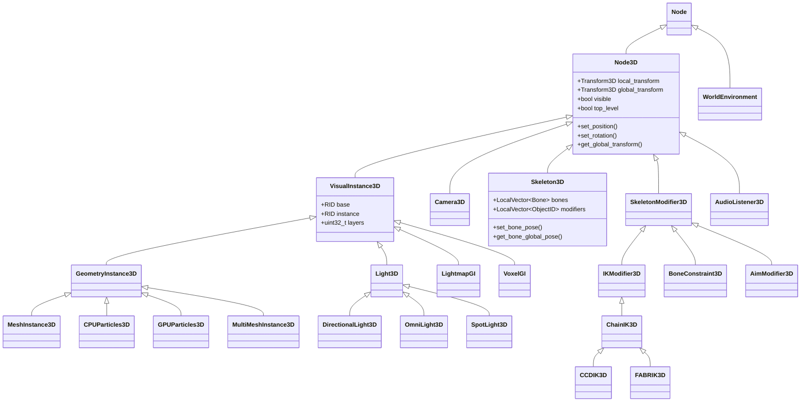

# 08 - 3D 场景节点 (3D Scene Nodes) 深度分析报告

> **核心结论**：Godot 用"节点即实体"的扁平继承体系统一了 3D 变换、渲染、骨骼和光照，而 UE 用 Actor + Component 组合模式将功能拆分到独立组件中。

---

## 目录

- [第 1 章：模块概览 — "UE 程序员 30 秒速览"](#第-1-章模块概览--ue-程序员-30-秒速览)
- [第 2 章：架构对比 — "同一个问题，两种解法"](#第-2-章架构对比--同一个问题两种解法)
- [第 3 章：核心实现对比 — "代码层面的差异"](#第-3-章核心实现对比--代码层面的差异)
- [第 4 章：UE → Godot 迁移指南](#第-4-章ue--godot-迁移指南)
- [第 5 章：性能对比](#第-5-章性能对比)
- [第 6 章：总结 — "一句话记住"](#第-6-章总结--一句话记住)

---

## 第 1 章：模块概览 — "UE 程序员 30 秒速览"

### 一句话说明

Godot 的 `scene/3d/` 模块提供了所有 3D 场景节点的实现——从基础变换（Node3D）、网格渲染（MeshInstance3D）、相机（Camera3D）、光源（Light3D）到骨骼动画（Skeleton3D）和全局光照（LightmapGI/VoxelGI），对应 UE 中 `AActor` + `USceneComponent` + `UStaticMeshComponent` + `USkeletalMeshComponent` + `ULightComponent` + `Lightmass/Lumen` 等模块的功能集合。

### 核心类/结构体列表

| # | Godot 类 | 源码路径 | 功能 | UE 对应物 |
|---|---------|---------|------|----------|
| 1 | `Node3D` | `scene/3d/node_3d.h` | 3D 变换基类，所有 3D 节点的根 | `USceneComponent` |
| 2 | `VisualInstance3D` | `scene/3d/visual_instance_3d.h` | 可视实例基类，管理 RID 和渲染层 | `UPrimitiveComponent` |
| 3 | `GeometryInstance3D` | `scene/3d/visual_instance_3d.h` | 几何实例基类，阴影/GI/LOD/材质覆盖 | `UMeshComponent` |
| 4 | `MeshInstance3D` | `scene/3d/mesh_instance_3d.h` | 静态/动态网格渲染节点 | `UStaticMeshComponent` |
| 5 | `Camera3D` | `scene/3d/camera_3d.h` | 3D 相机节点 | `UCameraComponent` + `APlayerCameraManager` |
| 6 | `Light3D` | `scene/3d/light_3d.h` | 光源基类（方向光/点光/聚光） | `ULightComponent` |
| 7 | `DirectionalLight3D` | `scene/3d/light_3d.h` | 方向光 | `UDirectionalLightComponent` |
| 8 | `OmniLight3D` | `scene/3d/light_3d.h` | 点光源 | `UPointLightComponent` |
| 9 | `SpotLight3D` | `scene/3d/light_3d.h` | 聚光灯 | `USpotLightComponent` |
| 10 | `Skeleton3D` | `scene/3d/skeleton_3d.h` | 骨骼系统节点 | `USkeleton` + `USkeletalMeshComponent` |
| 11 | `SkeletonModifier3D` | `scene/3d/skeleton_modifier_3d.h` | 骨骼修改器基类（IK/约束等） | `UAnimInstance` (AnimGraph Node) |
| 12 | `ChainIK3D` / `CCDIK3D` / `FABRIK3D` | `scene/3d/chain_ik_3d.h` 等 | IK 求解器 | `FAnimNode_CCDIK` / `FAnimNode_FABRIK` |
| 13 | `LightmapGI` | `scene/3d/lightmap_gi.h` | 光照贴图全局光照 | `Lightmass` (UE4) |
| 14 | `VoxelGI` | `scene/3d/voxel_gi.h` | 体素全局光照 | `Lumen` / `SVOGI` 概念类似 |
| 15 | `WorldEnvironment` | `scene/3d/world_environment.h` | 世界环境设置节点 | `APostProcessVolume` + `ASkyLight` |
| 16 | `SkinReference` | `scene/3d/skeleton_3d.h` | 蒙皮引用（骨骼-网格绑定） | `USkinnedMeshComponent::SkeletalMesh` |

### Godot vs UE 概念速查表

| Godot 概念 | UE 概念 | 关键差异 |
|-----------|--------|---------|
| `Node3D` | `USceneComponent` | Godot 是节点（场景树成员），UE 是组件（挂在 Actor 上） |
| `Node3D::Transform3D` | `FTransform` | Godot 用 Basis(3x3) + Origin，UE 用 Quat + Scale + Translation |
| `VisualInstance3D::layer_mask` | `UPrimitiveComponent::RenderingLayers` | 功能相同，Godot 20 层，UE 32 层 |
| `MeshInstance3D` + `Ref<Mesh>` | `UStaticMeshComponent` + `UStaticMesh*` | Godot 网格是 Resource（引用计数），UE 是 UObject（GC） |
| `Skeleton3D` (独立节点) | `USkeleton` (资产) + `USkeletalMeshComponent` | Godot 骨骼是场景树节点，UE 骨骼是资产 |
| `SkeletonModifier3D` | `FAnimNode_xxx` (AnimGraph) | Godot 是子节点链，UE 是动画蓝图图表节点 |
| `Camera3D::make_current()` | `APlayerController::SetViewTarget()` | Godot 相机自己声明"我是当前"，UE 由控制器指定 |
| `LightmapGI` | `Lightmass` | 都是离线烘焙，Godot 内置 CPU 光追，UE 用独立进程 |
| `VoxelGI` | `Lumen` (概念类似) | Godot 是简单体素方案，UE Lumen 是完整的动态 GI |
| `WorldEnvironment` | `APostProcessVolume` (Unbound) | Godot 是全局节点，UE 是体积 Actor |
| `Node3D::top_level` | `USceneComponent::bAbsoluteLocation` | 脱离父级变换继承 |
| `GeometryInstance3D::visibility_range` | `HLOD` / `ForcedLOD` | Godot 基于距离的可见性范围，UE 有更复杂的 LOD/HLOD 系统 |

---

## 第 2 章：架构对比 — "同一个问题，两种解法"

### 2.1 Godot 的架构设计

Godot 的 3D 场景系统建立在**节点继承体系**之上。所有 3D 功能都通过继承 `Node3D` 来实现，形成一棵清晰的类继承树：



**核心设计理念**：在 Godot 中，**节点就是实体**。一个 `MeshInstance3D` 节点同时拥有变换、可见性、渲染、材质覆盖等所有能力。不需要像 UE 那样在 Actor 上挂载多个 Component。

### 2.2 UE 对应模块的架构设计

UE 采用 **Actor + Component 组合模式**：

```
AActor
├── USceneComponent (RootComponent, 提供变换)
│   ├── UStaticMeshComponent (渲染静态网格)
│   ├── USkeletalMeshComponent (渲染骨骼网格)
│   ├── UCameraComponent (相机)
│   └── ULightComponent (光源)
│       ├── UDirectionalLightComponent
│       ├── UPointLightComponent
│       └── USpotLightComponent
└── UActorComponent (非空间组件)
```

UE 的 `USceneComponent` 定义在 `Engine/Source/Runtime/Engine/Classes/Components/SceneComponent.h`，它继承自 `UActorComponent`，提供变换和附着（Attachment）功能。关键成员包括：
- `AttachParent` / `AttachChildren`：组件级别的父子关系
- `RelativeLocation` / `RelativeRotation` / `RelativeScale3D`：相对变换
- `ComponentToWorld`：缓存的世界变换（`FTransform`）
- `Mobility`：Static / Stationary / Movable 三种移动性

### 2.3 关键架构差异分析

#### 差异 1：节点继承 vs 组件组合

**Godot** 采用**单继承节点体系**。`MeshInstance3D` 继承自 `GeometryInstance3D` → `VisualInstance3D` → `Node3D` → `Node`。一个节点天然拥有变换 + 渲染 + 材质管理的全部能力。这意味着在 Godot 中，你不能给一个 `Camera3D` 节点"附加"一个网格渲染能力——你需要创建一个子节点 `MeshInstance3D`。

**UE** 采用**组件组合模式**。一个 `AActor` 可以同时拥有 `UStaticMeshComponent`、`UCameraComponent`、`USpringArmComponent` 等多个组件。组件之间通过 `AttachParent` 形成层级关系，但它们都挂在同一个 Actor 上。

**Trade-off**：Godot 的方式更简单直观，学习曲线低，但灵活性不如 UE。UE 的组件模式更灵活（一个 Actor 可以有多个网格），但概念更复杂（Actor vs Component vs SceneComponent 的区别经常让新手困惑）。Godot 的节点树天然就是场景层级，而 UE 需要区分 Actor 层级（World Outliner）和 Component 层级（Details Panel）。

#### 差异 2：变换存储与脏标记策略

**Godot 的 Node3D**（`scene/3d/node_3d.h`）使用了一套精巧的**双脏标记系统**：
- `DIRTY_LOCAL_TRANSFORM`：当欧拉角/缩放被修改时，本地变换矩阵需要重建
- `DIRTY_EULER_ROTATION_AND_SCALE`：当变换矩阵被直接设置时，欧拉角/缩放需要反算
- `DIRTY_GLOBAL_TRANSFORM`：全局变换需要重新计算

这种设计的核心目的是**避免欧拉角 ↔ 矩阵转换的精度损失**。源码注释明确说明：

```cpp
// Euler needs to be kept separate because converting to Basis and back 
// may result in a different vector (which is troublesome for users
// editing in the inspector)
```

变换传播通过 `_propagate_transform_changed()` 递归向下标记所有子节点的全局变换为脏，但**不立即计算**——只在 `get_global_transform()` 被调用时才惰性求值。同时，Godot 还维护了一个 `node3d_children` 快速子节点列表（仅包含 Node3D 子节点），避免遍历所有类型的子节点。

**UE 的 USceneComponent**（`Components/SceneComponent.h`）使用 `FTransform ComponentToWorld` 缓存世界变换，通过 `UpdateComponentToWorld()` 更新。UE 的变换更新策略更加复杂：
- 支持 `EUpdateTransformFlags`（跳过物理同步、传播到子组件等）
- 支持 `ETeleportType`（瞬移 vs 平滑移动，影响物理模拟）
- 变换使用 `FTransform`（Quaternion + Scale + Translation），内部始终用四元数，不存在欧拉角精度问题

**Trade-off**：Godot 的双脏标记系统巧妙地解决了编辑器中欧拉角编辑的用户体验问题，但增加了代码复杂度。UE 直接用四元数避免了这个问题，但在编辑器中显示旋转时也需要做类似的转换处理。Godot 的惰性求值策略在大量节点但只有少数被查询时更高效；UE 的即时更新在需要物理同步的场景中更可靠。

#### 差异 3：渲染服务器通信模式

**Godot** 采用 **RID（Resource ID）+ RenderingServer** 模式。每个 `VisualInstance3D` 持有一个 `RID instance`，通过 `RenderingServer` 单例与渲染后端通信。这是一种**命令式 API**：

```cpp
// visual_instance_3d.h
RID base;      // 渲染资源（如 Mesh 的 RID）
RID instance;  // 渲染实例（场景中的一个实例）
```

所有渲染状态的修改都通过 `RS::get_singleton()->instance_set_xxx()` 调用完成。这种设计使得场景树和渲染后端完全解耦——渲染服务器可以运行在独立线程上。

**UE** 采用 **FPrimitiveSceneProxy** 模式。每个 `UPrimitiveComponent` 创建一个 `FPrimitiveSceneProxy` 对象，该对象生存在渲染线程上，是组件在渲染世界中的"代理"。游戏线程通过 `ENQUEUE_RENDER_COMMAND` 向渲染线程发送更新命令。

**Trade-off**：Godot 的 RID 模式更轻量，API 更简单，但抽象层次较低，需要手动管理更多状态。UE 的 SceneProxy 模式更重量级，但提供了更好的线程安全保证和更丰富的渲染功能（如自定义绘制路径）。

---

## 第 3 章：核心实现对比 — "代码层面的差异"

### 3.1 Node3D vs USceneComponent：3D 变换节点对比

#### Godot 的实现

**源码**：`scene/3d/node_3d.h` + `scene/3d/node_3d.cpp`

Node3D 的核心数据结构定义在内部 `Data` 结构体中：

```cpp
// scene/3d/node_3d.h
struct Data {
    Transform3D global_transform_interpolated;  // FTI 插值变换
    mutable Transform3D global_transform;       // 全局变换
    mutable Transform3D local_transform;        // 本地变换
    Transform3D local_transform_prev;           // 上一帧本地变换（FTI用）
    
    mutable EulerOrder euler_rotation_order = EulerOrder::YXZ;
    mutable Vector3 euler_rotation;
    mutable Vector3 scale = Vector3(1, 1, 1);
    
    mutable MTNumeric<uint32_t> dirty;  // 线程安全的脏标记
    
    bool top_level : 1;      // 是否脱离父级变换
    bool visible : 1;        // 可见性
    bool disable_scale : 1;  // 禁用缩放
    
    Node3D *parent = nullptr;
    LocalVector<Node3D *> node3d_children;  // 仅 Node3D 子节点的快速列表
};
```

全局变换的计算采用惰性求值：

```cpp
// scene/3d/node_3d.cpp
Transform3D Node3D::get_global_transform() const {
    uint32_t dirty = _read_dirty_mask();
    if (dirty & DIRTY_GLOBAL_TRANSFORM) {
        if (dirty & DIRTY_LOCAL_TRANSFORM) {
            _update_local_transform();  // 从欧拉角重建矩阵
        }
        Transform3D new_global;
        if (data.parent && !data.top_level) {
            new_global = data.parent->get_global_transform() * data.local_transform;
        } else {
            new_global = data.local_transform;
        }
        if (data.disable_scale) {
            new_global.basis.orthonormalize();
        }
        data.global_transform = new_global;
        _clear_dirty_bits(DIRTY_GLOBAL_TRANSFORM);
    }
    return data.global_transform;
}
```

值得注意的是 `MTNumeric<uint32_t> dirty` 的使用——这是一个线程安全的数值类型，在组处理（group processing）模式下使用原子操作，在单线程模式下使用普通赋值，兼顾了性能和安全性。

Godot 还实现了**帧变换插值（FTI, Frame Transform Interpolation）**系统，用于在物理帧率和渲染帧率不同步时平滑变换：

```cpp
// 物理 tick 时保存当前变换
void Node3D::fti_pump_xform() {
    data.local_transform_prev = get_transform();
}

// 渲染帧时插值
Transform3D Node3D::get_global_transform_interpolated() {
    if (SceneTree::is_fti_enabled() && is_inside_tree() && 
        !Engine::get_singleton()->is_in_physics_frame()) {
        // 使用预缓存的插值变换
        if (Object::cast_to<VisualInstance3D>(this) && _is_vi_visible() && 
            data.fti_global_xform_interp_set) {
            return data.global_transform_interpolated;
        }
        // ... 对不可见节点的回退处理
    }
    return get_global_transform();
}
```

#### UE 的实现

**源码**：`Engine/Source/Runtime/Engine/Classes/Components/SceneComponent.h`

UE 的 `USceneComponent` 使用 `FTransform` 存储变换：

```cpp
// SceneComponent.h (简化)
class USceneComponent : public UActorComponent {
    USceneComponent* AttachParent;
    TArray<USceneComponent*> AttachChildren;
    FName AttachSocketName;
    
    FVector RelativeLocation;
    FRotator RelativeRotation;
    FVector RelativeScale3D;
    
    // 缓存的世界变换
    FTransform ComponentToWorld;
    
    EComponentMobility::Type Mobility;  // Static/Stationary/Movable
};
```

UE 的变换更新是**即时的**，通过 `UpdateComponentToWorld()` 触发，并支持复杂的更新标志：

```cpp
void USceneComponent::SetRelativeLocation(FVector NewLocation) {
    RelativeLocation = NewLocation;
    UpdateComponentToWorld(EUpdateTransformFlags::None, ETeleportType::None);
}
```

#### 差异点评

| 对比维度 | Godot Node3D | UE USceneComponent |
|---------|-------------|-------------------|
| 变换表示 | `Basis(3x3)` + `Origin` | `FQuat` + `FVector Scale` + `FVector Translation` |
| 旋转存储 | 欧拉角 + 矩阵双存储 | 四元数为主，编辑器显示时转欧拉 |
| 更新策略 | 惰性求值（读时计算） | 即时更新（写时计算） |
| 线程安全 | `MTNumeric` 原子脏标记 | 游戏线程独占，渲染线程用 Proxy |
| 物理插值 | 内置 FTI 系统 | 需要自行实现或使用 `UCharacterMovementComponent` |
| 移动性 | 无概念（所有节点都可移动） | Static/Stationary/Movable 三级 |
| 父子关系 | 节点树天然层级 | `AttachParent` / `AttachChildren` 组件层级 |

**Godot 的优势**：惰性求值在大量静态节点场景中更高效；FTI 系统开箱即用；双存储避免欧拉角精度问题。

**UE 的优势**：Mobility 系统让渲染器可以对静态物体做更多优化（如静态光照、预计算遮挡）；四元数存储避免万向锁；组件模式更灵活。

### 3.2 MeshInstance3D vs UStaticMeshComponent：网格渲染对比

#### Godot 的实现

**源码**：`scene/3d/mesh_instance_3d.h`

```cpp
class MeshInstance3D : public GeometryInstance3D {
    Ref<Mesh> mesh;                              // 网格资源（引用计数）
    Ref<Skin> skin;                              // 蒙皮数据
    Ref<SkinReference> skin_ref;                 // 蒙皮引用
    NodePath skeleton_path;                      // 骨骼节点路径
    LocalVector<float> blend_shape_tracks;       // BlendShape 权重
    Vector<Ref<Material>> surface_override_materials;  // 表面材质覆盖
};
```

Godot 的 `MeshInstance3D` 同时承担了 UE 中 `UStaticMeshComponent` 和 `USkeletalMeshComponent` 的部分职责。通过设置 `skeleton_path` 和 `skin`，同一个 `MeshInstance3D` 可以变成蒙皮网格。

材质系统采用三级优先级：
1. `surface_override_materials`（实例级覆盖）
2. `GeometryInstance3D::material_override`（全局覆盖）
3. `Mesh` 资源自带的材质

碰撞生成也直接集成在节点上：

```cpp
// 从网格生成碰撞体
Node *create_trimesh_collision_node();
Node *create_convex_collision_node(bool p_clean, bool p_simplify);
Node *create_multiple_convex_collisions_node(...);
```

#### UE 的实现

**源码**：`Engine/Source/Runtime/Engine/Classes/Components/StaticMeshComponent.h`

UE 的 `UStaticMeshComponent` 继承自 `UMeshComponent` → `UPrimitiveComponent` → `USceneComponent`：

```cpp
class UStaticMeshComponent : public UMeshComponent {
    UPROPERTY(EditAnywhere, BlueprintReadOnly)
    UStaticMesh* StaticMesh;
    
    UPROPERTY(EditAnywhere)
    TArray<FStaticMeshComponentLODInfo> LODData;
    
    // 材质覆盖在 UMeshComponent 层
    // OverrideMaterials 数组
};
```

UE 严格区分了 `UStaticMeshComponent`（静态网格）和 `USkeletalMeshComponent`（骨骼网格），它们是完全不同的类，有不同的渲染路径和优化策略。

#### 差异点评

Godot 的 `MeshInstance3D` 是一个"万能"网格节点，通过配置可以表现为静态网格或蒙皮网格。这降低了学习成本，但也意味着渲染器无法像 UE 那样对静态网格和骨骼网格做针对性优化。UE 的分离设计虽然增加了类的数量，但允许每种类型有独立的 LOD 策略、渲染路径和内存布局优化。

### 3.3 Skeleton3D vs USkeleton：骨骼系统对比

#### Godot 的实现

**源码**：`scene/3d/skeleton_3d.h` + `scene/3d/skeleton_3d.cpp`

Godot 的骨骼系统设计最大的特点是：**Skeleton3D 是一个场景树节点**，而不是一个资产。

```cpp
// scene/3d/skeleton_3d.h
class Skeleton3D : public Node3D {
    struct Bone {
        String name;
        int parent = -1;
        Vector<int> child_bones;
        
        Transform3D rest;          // 绑定姿态
        Transform3D global_rest;   // 全局绑定姿态
        
        bool enabled = true;
        Vector3 pose_position;
        Quaternion pose_rotation;
        Vector3 pose_scale = Vector3(1, 1, 1);
        Transform3D global_pose;   // 全局姿态
        
        int nested_set_offset = 0; // 嵌套集偏移（优化遍历）
        int nested_set_span = 0;   // 嵌套集跨度
    };
    
    mutable LocalVector<Bone> bones;
    AHashMap<String, int> name_to_bone_index;  // 名称→索引快速查找
    LocalVector<ObjectID> modifiers;           // 骨骼修改器列表
};
```

**嵌套集（Nested Set）优化**是 Godot 骨骼系统的一个亮点。每个骨骼都有 `nested_set_offset` 和 `nested_set_span`，这使得判断"骨骼 A 是否是骨骼 B 的祖先"变成了 O(1) 操作，而标记子树脏也变成了连续内存的线性扫描：

```cpp
void Skeleton3D::_make_bone_global_pose_subtree_dirty(int p_bone) const {
    const Bone &bone = bones[p_bone];
    int span_offset = bone.nested_set_offset;
    if (bone_global_pose_dirty[span_offset]) return;  // 已脏，跳过
    
    int span_end = span_offset + bone.nested_set_span;
    for (int i = span_offset; i < span_end; i++) {
        bone_global_pose_dirty[i] = true;  // 连续内存，缓存友好
    }
}
```

骨骼修改器（Modifier）系统的工作流程：

```cpp
// skeleton_3d.cpp - NOTIFICATION_UPDATE_SKELETON
void Skeleton3D::_notification(int p_what) {
    // 1. 保存未修改的骨骼姿态
    for (uint32_t i = 0; i < bones.size(); i++) {
        bones_backup[i].save(bonesptr[i]);
    }
    
    // 2. 执行修改器链
    _process_modifiers();
    
    // 3. 更新蒙皮数据到 RenderingServer
    for (SkinReference *E : skin_bindings) {
        for (uint32_t i = 0; i < bind_count; i++) {
            rs->skeleton_bone_set_transform(skeleton, i, 
                bonesptr[bone_index].global_pose * skin->get_bind_pose(i));
        }
    }
    
    // 4. 恢复未修改的骨骼姿态（修改器结果只影响渲染）
    for (uint32_t i = 0; i < bones.size(); i++) {
        bones_backup[i].restore(bones[i]);
    }
}
```

这个"备份-修改-渲染-恢复"的流程非常关键：修改器的结果只用于渲染，不会永久改变骨骼姿态。这意味着下一帧的修改器计算始终基于动画系统输出的原始姿态，避免了累积误差。

#### UE 的实现

UE 的骨骼系统分为两个层次：

1. **`USkeleton`**（`Engine/Source/Runtime/Engine/Classes/Animation/Skeleton.h`）：骨骼资产，定义骨骼层级、绑定姿态、插槽等。是一个 `UObject` 资产，可以被多个 `USkeletalMesh` 共享。

2. **`USkeletalMeshComponent`**：运行时组件，持有 `USkeletalMesh` 引用，管理动画实例（`UAnimInstance`），驱动骨骼变换。

```cpp
// 简化的 UE 骨骼更新流程
void USkeletalMeshComponent::TickAnimation(float DeltaTime) {
    // 1. AnimInstance 评估动画图表
    AnimInstance->UpdateAnimation(DeltaTime);
    
    // 2. 评估 AnimGraph 节点（包括 IK、约束等）
    // 这些都在 FAnimInstanceProxy 中完成
    
    // 3. 输出最终骨骼变换到 ComponentSpaceTransforms
    // 4. 提交到渲染线程
}
```

#### 差异点评

| 对比维度 | Godot Skeleton3D | UE USkeleton + USkeletalMeshComponent |
|---------|-----------------|--------------------------------------|
| 骨骼定义 | 场景树节点（运行时创建/修改） | 资产（编辑器中定义，运行时只读） |
| 骨骼共享 | 每个 Skeleton3D 实例独立 | 多个 SkeletalMesh 可共享同一 USkeleton |
| 修改器系统 | 子节点链（SkeletonModifier3D） | AnimGraph 节点（FAnimNode_xxx） |
| 姿态存储 | Position + Quaternion + Scale 分离 | FTransform（统一结构） |
| 全局姿态计算 | 嵌套集优化 + 惰性求值 | 线性遍历 + ComponentSpace 缓存 |
| 蒙皮 | SkinReference + RenderingServer | GPU 蒙皮（Compute Shader） |
| 物理骨骼 | PhysicalBoneSimulator3D（已废弃） | PhysicsAsset + PhAT 编辑器 |

**Godot 的优势**：骨骼作为节点更直观，可以在运行时动态添加/删除骨骼；嵌套集优化使子树操作更高效；修改器的"备份-恢复"机制避免累积误差。

**UE 的优势**：骨骼资产共享减少内存；AnimGraph 提供可视化的动画逻辑编辑；GPU 蒙皮性能更好；PhAT 提供完整的物理骨骼编辑工具链。

### 3.4 SkeletonModifier3D/IK vs AnimInstance：骨骼修改器对比

#### Godot 的实现

**源码**：`scene/3d/skeleton_modifier_3d.h` + `scene/3d/skeleton_modifier_3d.cpp`

Godot 的骨骼修改器是一个**节点链**系统。所有修改器必须是 `Skeleton3D` 的直接子节点：

```cpp
class SkeletonModifier3D : public Node3D {
protected:
    bool active = true;
    real_t influence = 1.0;
    ObjectID skeleton_id;  // 缓存父骨骼引用
    
    virtual void _process_modification(double p_delta);
};
```

修改器的发现和执行：

```cpp
// skeleton_3d.cpp
void Skeleton3D::_find_modifiers() {
    modifiers.clear();
    for (int i = 0; i < get_child_count(); i++) {
        SkeletonModifier3D *c = Object::cast_to<SkeletonModifier3D>(get_child(i));
        if (c) {
            modifiers.push_back(c->get_instance_id());
        }
    }
}

void Skeleton3D::_process_modifiers() {
    for (const ObjectID &oid : modifiers) {
        SkeletonModifier3D *mod = cast_to<SkeletonModifier3D>(ObjectDB::get_instance(oid));
        real_t influence = mod->get_influence();
        if (influence < 1.0) {
            // 保存旧姿态 → 执行修改 → 插值混合
            mod->process_modification(update_delta);
            for (int i = 0; i < get_bone_count(); i++) {
                set_bone_pose(i, old_poses[i].interpolate_with(new_poses[i], influence));
            }
        } else {
            mod->process_modification(update_delta);
        }
    }
}
```

IK 系统的继承层次：`SkeletonModifier3D` → `IKModifier3D` → `ChainIK3D` → `CCDIK3D` / `FABRIK3D`

`ChainIK3D`（`scene/3d/chain_ik_3d.h`）实现了完整的 IK 链求解框架，包括：
- 根骨骼/末端骨骼配置
- 关节约束
- 链坐标系统（避免直接修改骨骼姿态，先在坐标空间求解再转换）
- 防翻转机制（`update_chain_coordinate_bw` / `update_chain_coordinate_fw`）

#### UE 的实现

UE 的骨骼修改通过 **AnimGraph** 系统实现。IK 节点是 `FAnimNode_xxx` 结构体，在 `FAnimInstanceProxy` 中评估：

```cpp
// UE 的 CCDIK 节点（简化）
struct FAnimNode_CCDIK : public FAnimNode_SkeletalControlBase {
    FBoneReference TipBone;
    FBoneReference RootBone;
    FVector EffectorLocation;
    int32 MaxIterations;
    float Precision;
    
    virtual void EvaluateSkeletalControl_AnyThread(
        FComponentSpacePoseContext& Output,
        TArray<FBoneTransform>& OutBoneTransforms) override;
};
```

UE 的 AnimGraph 是一个**可视化的节点图**，在动画蓝图编辑器中连接。每个节点在评估时接收上游的姿态输入，输出修改后的姿态。

#### 差异点评

Godot 的修改器系统更简单——就是子节点的顺序执行。但这也意味着缺少 UE AnimGraph 那样的**分支、混合、状态机**等复杂逻辑。在 Godot 中，如果你需要"只在某些条件下启用 IK"，你需要在代码中控制修改器的 `active` 属性；而在 UE 中，这可以通过 AnimGraph 的分支节点可视化实现。

Godot 的 `influence` 混合是全骨骼的线性插值，而 UE 的 `Alpha` 混合可以按骨骼权重精细控制。

### 3.5 Light3D vs ULightComponent：光源对比

#### Godot 的实现

**源码**：`scene/3d/light_3d.h`

```cpp
class Light3D : public VisualInstance3D {
    Color color;
    real_t param[PARAM_MAX] = {};  // 所有光源参数统一数组
    bool shadow = false;
    uint32_t cull_mask = 0;
    uint32_t shadow_caster_mask = 0xFFFFFFFF;
    RS::LightType type;
    BakeMode bake_mode = BAKE_DYNAMIC;
    Ref<Texture2D> projector;
    float temperature = 6500.0;
    
protected:
    RID light;  // RenderingServer 中的光源 RID
    Light3D(RenderingServer::LightType p_type);  // 构造时确定类型
};
```

Godot 的光源参数使用**统一的参数数组** `param[PARAM_MAX]`，通过枚举索引访问。这种设计使得所有光源类型共享同一套参数接口，子类只是在构造时设置不同的默认值。

三种光源子类非常轻量：

```cpp
class DirectionalLight3D : public Light3D {
    ShadowMode shadow_mode;  // 正交/2分割/4分割
    SkyMode sky_mode;        // 光+天空/仅光/仅天空
};

class OmniLight3D : public Light3D {
    ShadowMode shadow_mode;  // 双抛物面/立方体
};

class SpotLight3D : public Light3D {
    // 几乎没有额外成员
};
```

**BakeMode** 是 Godot 光源的一个重要概念：
- `BAKE_DISABLED`：不参与烘焙
- `BAKE_STATIC`：仅烘焙（运行时不产生实时光照）
- `BAKE_DYNAMIC`：参与烘焙且运行时也有实时光照

#### UE 的实现

**源码**：`Engine/Source/Runtime/Engine/Classes/Components/LightComponent.h`

UE 的光源系统更加复杂，继承层次为：`ULightComponentBase` → `ULightComponent` → `UDirectionalLightComponent` / `ULocalLightComponent` → `UPointLightComponent` / `USpotLightComponent`

```cpp
class ULightComponent : public ULightComponentBase {
    float Temperature;
    float SpecularScale;
    float ShadowResolutionScale;
    float ShadowBias;
    float ShadowSlopeBias;
    // ... 大量阴影相关参数
    
    UMaterialInterface* LightFunctionMaterial;  // 光照函数材质
    UTextureLightProfile* IESTexture;           // IES 光照配置文件
};
```

UE 的光源有 **Mobility** 概念（Static/Stationary/Movable），这直接影响光照的计算方式和性能特征。

#### 差异点评

| 对比维度 | Godot Light3D | UE ULightComponent |
|---------|-------------|-------------------|
| 参数管理 | 统一数组 `param[]` | 独立成员变量 |
| 阴影模式 | 方向光：正交/2分割/4分割 | CSM 最多 4 级 + 远距离阴影 |
| 光照函数 | 投影纹理（Texture2D） | 材质函数（完整材质系统） |
| IES 配置 | 不支持 | 完整支持 |
| 移动性 | 无（BakeMode 部分替代） | Static/Stationary/Movable |
| 色温 | 内置支持 | 内置支持 |
| 体积雾能量 | 独立参数 | 独立参数 |

### 3.6 LightmapGI/VoxelGI vs Lightmass/Lumen：全局光照对比

#### Godot 的实现

**LightmapGI**（`scene/3d/lightmap_gi.h`）：

Godot 的光照贴图烘焙是**内置的 CPU 光线追踪**方案。`LightmapGI` 节点配置烘焙参数，调用 `Lightmapper` 接口执行烘焙：

```cpp
class LightmapGI : public VisualInstance3D {
    BakeQuality bake_quality;      // Low/Medium/High/Ultra
    bool use_denoiser = true;      // 降噪
    int bounces = 3;               // 光线弹射次数
    float texel_scale = 1.0;       // 纹素密度
    int max_texture_size = 16384;  // 最大纹理尺寸
    bool directional = false;      // 方向性光照贴图
    GenerateProbes gen_probes;     // 光照探针生成
    
    // Shadowmask 支持
    LightmapGIData::ShadowmaskMode shadowmask_mode;
};
```

烘焙结果存储在 `LightmapGIData` 资源中，包含：
- 合并的光照纹理图集（`TextureLayered`）
- 阴影遮罩纹理（Shadowmask）
- 光照探针数据（球谐系数 + 四面体网格 + BSP 树）

**VoxelGI**（`scene/3d/voxel_gi.h`）：

体素全局光照是 Godot 的**实时/半实时 GI 方案**：

```cpp
class VoxelGI : public VisualInstance3D {
    Ref<VoxelGIData> probe_data;
    Subdiv subdiv = SUBDIV_128;        // 体素分辨率：64/128/256/512
    Vector3 size = Vector3(20, 20, 20); // 覆盖范围
};
```

VoxelGI 将场景体素化后存储在 3D 纹理中，运行时通过锥形追踪（Cone Tracing）计算间接光照。

#### UE 的实现

**Lightmass**（UE4 默认）：独立进程的离线光照烘焙系统，使用光子映射和最终聚集。支持：
- 光照贴图（Lightmap）
- 体积光照贴图（Volumetric Lightmap）
- 光照探针（Light Probe）
- Stationary 光源的阴影遮罩

**Lumen**（UE5）：完全动态的全局光照系统，基于：
- 软件光线追踪（Screen Space + Mesh Distance Fields）
- 硬件光线追踪（可选）
- 辐照度场缓存（Radiance Cache）
- 全局光照体积（Global Illumination Volume）

#### 差异点评

| 对比维度 | Godot LightmapGI | Godot VoxelGI | UE Lightmass | UE Lumen |
|---------|-----------------|--------------|-------------|---------|
| 类型 | 离线烘焙 | 实时/半实时 | 离线烘焙 | 完全动态 |
| 质量 | 中等 | 低-中 | 高 | 高 |
| 动态物体 | 光照探针 | 原生支持 | 间接光照缓存 | 原生支持 |
| 内存开销 | 纹理图集 | 3D 纹理 | 纹理图集 | 多级缓存 |
| 烘焙速度 | 较快（内置） | N/A | 较慢（独立进程） | N/A |
| Shadowmask | 支持 | 不支持 | 支持 | 不需要 |

Godot 的 GI 方案在功能和质量上与 UE 有明显差距。LightmapGI 是一个实用的离线方案，但缺少 Lightmass 的高级功能（如光子映射的焦散效果）。VoxelGI 是一个简单但有效的实时方案，但与 Lumen 的质量和功能不在同一量级。

---

## 第 4 章：UE → Godot 迁移指南

### 4.1 思维转换清单

1. **忘掉 Actor + Component，拥抱节点树**
   - UE 中你会创建一个 Actor，然后给它添加 StaticMeshComponent、CameraComponent 等。在 Godot 中，直接在场景树中添加 `MeshInstance3D`、`Camera3D` 等节点。节点的父子关系就是变换层级。

2. **忘掉 Mobility，所有节点都是 Movable**
   - Godot 没有 Static/Stationary/Movable 的概念。如果你需要静态光照优化，使用 `LightmapGI` 烘焙，并将光源的 `BakeMode` 设为 `BAKE_STATIC`。

3. **忘掉 AnimBlueprint，使用修改器子节点**
   - Godot 没有可视化的动画图表编辑器。骨骼修改（IK、约束等）通过在 `Skeleton3D` 下添加 `SkeletonModifier3D` 子节点实现。执行顺序就是子节点的顺序。

4. **忘掉 UObject 指针，使用 Ref<T> 和 NodePath**
   - 网格、材质等资源使用 `Ref<T>`（引用计数智能指针）。场景中的节点引用使用 `NodePath`（如 `MeshInstance3D::skeleton_path`）。

5. **忘掉渲染线程直接操作，使用 RenderingServer**
   - Godot 的渲染后端通过 `RenderingServer` 单例访问。你不需要（也不能）直接操作渲染线程的数据。所有渲染状态修改都通过 RS API 完成。

6. **忘掉 FTransform，习惯 Transform3D**
   - Godot 的 `Transform3D` = `Basis`(3x3 矩阵) + `Vector3 origin`。没有独立的 Scale 分量——缩放编码在 Basis 矩阵中。获取缩放需要 `basis.get_scale()`。

7. **忘掉 Blueprint 可视化脚本，使用 GDScript/C#**
   - Godot 的脚本系统更轻量。GDScript 是 Python 风格的脚本语言，C# 也有完整支持。没有类似 Blueprint 的可视化编程（VisualScript 已被移除）。

### 4.2 API 映射表

| UE API | Godot API | 备注 |
|--------|----------|------|
| `AActor::SetActorLocation()` | `Node3D::set_global_position()` | |
| `AActor::SetActorRotation()` | `Node3D::set_global_rotation()` | Godot 用弧度 |
| `USceneComponent::SetRelativeLocation()` | `Node3D::set_position()` | |
| `USceneComponent::GetComponentToWorld()` | `Node3D::get_global_transform()` | |
| `USceneComponent::AttachToComponent()` | `Node::reparent()` 或 `add_child()` | |
| `UStaticMeshComponent::SetStaticMesh()` | `MeshInstance3D::set_mesh()` | |
| `UMeshComponent::SetMaterial(idx, mat)` | `MeshInstance3D::set_surface_override_material(idx, mat)` | |
| `UCameraComponent::SetFieldOfView()` | `Camera3D::set_fov()` | |
| `APlayerController::SetViewTarget()` | `Camera3D::make_current()` | Godot 相机自己声明 |
| `ULightComponent::SetIntensity()` | `Light3D::set_param(PARAM_ENERGY, val)` | |
| `ULightComponent::SetLightColor()` | `Light3D::set_color()` | |
| `USkeletalMeshComponent::GetBoneTransform()` | `Skeleton3D::get_bone_global_pose()` | |
| `UAnimInstance::Montage_Play()` | `AnimationPlayer::play()` | 不同的动画系统 |
| `FAnimNode_CCDIK` | `CCDIK3D` (子节点) | Godot 是节点，UE 是 AnimGraph 节点 |
| `USceneComponent::SetVisibility()` | `Node3D::set_visible()` | |
| `AActor::SetActorScale3D()` | `Node3D::set_scale()` | |
| `USceneComponent::GetForwardVector()` | `Node3D::get_global_transform().basis.get_column(2)` | Godot -Z 是前方 |
| `UWorld::SpawnActor()` | `Node::add_child(node.instantiate())` | 场景实例化 |

### 4.3 陷阱与误区

#### 陷阱 1：前方向量的差异

UE 使用 **X 轴正方向**作为前方（`GetActorForwardVector()` 返回 X 轴），而 Godot 使用 **Z 轴负方向**作为前方。这意味着：

```gdscript
# Godot 中获取前方向量
var forward = -global_transform.basis.z  # 注意负号！

# 或者使用 look_at 时
node.look_at(target, Vector3.UP, true)  # use_model_front=true 使用 -Z
```

如果你从 UE 迁移角色控制代码，所有涉及前方向量的计算都需要调整。

#### 陷阱 2：旋转单位差异

UE 的 `FRotator` 使用**度数**，而 Godot 的 `Node3D::rotation` 使用**弧度**。Godot 提供了 `rotation_degrees` 属性作为便利接口，但在代码中操作旋转时要注意：

```gdscript
# 错误：直接用度数
node.rotation.y = 90  # 这是 90 弧度！

# 正确：使用弧度
node.rotation.y = deg_to_rad(90)
# 或使用度数接口
node.rotation_degrees.y = 90
```

#### 陷阱 3：骨骼姿态是绝对的，不是相对于 Rest 的

在 UE 中，动画数据通常是相对于绑定姿态（Reference Pose）的增量。而在 Godot 4 中，`Skeleton3D::set_bone_pose()` 设置的是**绝对姿态**，不是相对于 Rest 的偏移：

```gdscript
# Godot 4 中设置骨骼姿态
# 这是绝对姿态，不是相对于 rest 的偏移
skeleton.set_bone_pose_position(bone_idx, Vector3(0, 1, 0))

# 如果你想要相对于 rest 的偏移，需要手动计算
var rest = skeleton.get_bone_rest(bone_idx)
var offset = Transform3D(Basis(), Vector3(0, 0.5, 0))
skeleton.set_bone_pose(bone_idx, rest * offset)
```

#### 陷阱 4：没有 Component 的概念

UE 程序员习惯给 Actor 添加多个同类型 Component（如多个 StaticMeshComponent）。在 Godot 中，每个 `MeshInstance3D` 就是一个独立节点。如果你需要一个"角色"有多个网格部件，你需要创建多个 `MeshInstance3D` 子节点：

```
CharacterBody3D
├── MeshInstance3D (身体)
├── MeshInstance3D (武器)
├── MeshInstance3D (头盔)
└── Camera3D
```

#### 陷阱 5：光源没有 Mobility

UE 程序员习惯通过设置光源的 Mobility 来控制光照质量和性能。Godot 没有这个概念。要实现类似效果：
- **Static 光源** → 设置 `BakeMode = BAKE_STATIC`，使用 `LightmapGI` 烘焙
- **Stationary 光源** → 设置 `BakeMode = BAKE_DYNAMIC`（烘焙间接光 + 实时直接光）
- **Movable 光源** → 设置 `BakeMode = BAKE_DISABLED`

### 4.4 最佳实践

1. **善用场景实例化**：Godot 的场景（.tscn）可以像 UE 的 Blueprint 一样被实例化。将可复用的 3D 对象（如灯具、家具）做成独立场景。

2. **利用 visibility_range 做 LOD**：`GeometryInstance3D` 的 `visibility_range_begin/end` 可以实现基于距离的 LOD 切换，类似 UE 的 HLOD。

3. **骨骼修改器的顺序很重要**：修改器按子节点顺序执行。通常的顺序是：动画 → 约束 → IK → 物理模拟。

4. **使用 top_level 脱离变换继承**：当你需要一个子节点不跟随父节点变换时（如 UI 元素、特效），设置 `top_level = true`，类似 UE 的 `bAbsoluteLocation`。

5. **Camera3D 的 Environment 覆盖**：Camera3D 可以直接设置 `Environment` 资源，覆盖 `WorldEnvironment` 的设置。这类似 UE 中 Camera 的 PostProcess Settings 覆盖。

---

## 第 5 章：性能对比

### 5.1 Godot 3D 场景模块的性能特征

#### 变换更新

Godot 的惰性求值策略意味着：
- **读少写多**的场景（如大量移动但很少查询全局变换的粒子）：性能优秀，因为脏标记传播是 O(子树大小)，但不触发实际计算
- **读多写少**的场景（如大量静态物体偶尔被查询）：性能优秀，因为缓存的全局变换直接返回
- **读写均衡**的场景：与 UE 的即时更新策略性能相当

`node3d_children` 快速列表避免了遍历非 Node3D 子节点的开销，这在混合节点类型的场景中是一个重要优化。

#### 骨骼系统

Godot 的嵌套集优化使得：
- 子树脏标记：O(子树大小)，连续内存访问，缓存友好
- 祖先判断：O(1)
- 全局姿态更新：惰性求值，只计算被查询的骨骼链

但 Godot 的骨骼更新在**单线程**上执行，而 UE 的 `FParallelAnimationCompletionTask` 可以在工作线程上并行评估多个骨骼网格的动画。

#### 渲染提交

Godot 通过 `RenderingServer` 的 RID 系统提交渲染数据。每次变换更新都需要调用 `RS::instance_set_transform()`，这是一个跨线程的命令。FTI 系统通过批量更新减少了这些调用的频率。

### 5.2 与 UE 的性能差异

| 性能维度 | Godot | UE | 分析 |
|---------|-------|-----|------|
| 变换更新 | 惰性求值，单线程 | 即时更新，可并行 | 小场景 Godot 更快，大场景 UE 更好 |
| 骨骼动画 | 单线程，嵌套集优化 | 多线程并行评估 | UE 在多角色场景中优势明显 |
| 网格渲染 | RID 命令式 API | SceneProxy + 渲染线程 | UE 的渲染管线更成熟 |
| 光照贴图 | 内置 CPU 光追 | Lightmass（独立进程） | UE 烘焙质量更高，但更慢 |
| 实时 GI | VoxelGI（简单体素） | Lumen（多级缓存） | UE 质量远超 Godot |
| 内存占用 | 节点开销较小 | Component 开销较大 | Godot 在小项目中更轻量 |
| 物理插值 | 内置 FTI | 需自行实现 | Godot 开箱即用 |

### 5.3 性能敏感场景的建议

1. **大量静态物体**：使用 `MultiMeshInstance3D`（类似 UE 的 `InstancedStaticMeshComponent`）进行实例化渲染，避免每个物体一个节点。

2. **多角色场景**：Godot 的骨骼更新是单线程的，大量骨骼角色会成为瓶颈。考虑：
   - 减少骨骼数量
   - 使用 `visibility_range` 在远距离禁用骨骼更新
   - 对远处角色使用简化的动画

3. **光照优化**：
   - 尽可能使用 `LightmapGI` 烘焙静态光照
   - 限制实时阴影的光源数量
   - 使用 `distance_fade` 在远距离禁用光源

4. **变换层级深度**：Godot 的全局变换计算需要递归到根节点。避免过深的节点层级（超过 10 层会有明显开销）。

5. **FTI 系统**：对于需要物理插值的场景，确保启用 FTI（`ProjectSettings::physics/common/physics_interpolation`），这可以在低物理帧率下保持视觉平滑。

---

## 第 6 章：总结 — "一句话记住"

### 核心差异

> **Godot 用"节点即实体"的继承体系让 3D 开发更简单直观，UE 用"Actor + Component"的组合模式让大型项目更灵活可扩展。**

### 设计亮点（Godot 做得比 UE 好的地方）

1. **内置物理插值（FTI）**：Godot 的 `Node3D` 原生支持帧变换插值，无需额外代码即可在低物理帧率下获得平滑的视觉效果。UE 需要自行实现或依赖特定组件（如 `UCharacterMovementComponent` 的网络预测平滑）。

2. **双脏标记的欧拉角保持**：Godot 的 `DIRTY_EULER_ROTATION_AND_SCALE` / `DIRTY_LOCAL_TRANSFORM` 双向脏标记系统，巧妙地在矩阵和欧拉角之间保持一致性，避免了编辑器中旋转值"跳变"的问题。

3. **骨骼嵌套集优化**：`Skeleton3D` 使用嵌套集（Nested Set）数据结构优化骨骼层级遍历，使子树脏标记和祖先判断都非常高效。这是一个教科书级的数据结构应用。

4. **修改器的"备份-恢复"机制**：骨骼修改器的结果只影响渲染输出，不会永久改变骨骼姿态。这避免了 IK/约束的累积误差问题，是一个优雅的设计。

5. **简洁的 API 设计**：`Camera3D::make_current()` 比 UE 的 `APlayerController::SetViewTarget()` + `APlayerCameraManager` 链条简单得多。

### 设计短板（Godot 不如 UE 的地方）

1. **缺少 Mobility 概念**：UE 的 Static/Stationary/Movable 三级移动性让渲染器可以对静态物体做大量优化（预计算光照、静态遮挡剔除等）。Godot 缺少这种机制，所有物体都被视为可移动的。

2. **骨骼动画单线程**：Godot 的骨骼更新和修改器处理都在主线程上执行，无法利用多核 CPU。UE 的动画系统可以并行评估多个骨骼网格。

3. **全局光照方案差距大**：Godot 的 VoxelGI 与 UE 的 Lumen 在质量和功能上有数量级的差距。LightmapGI 也不如 Lightmass 成熟。

4. **缺少可视化骨骼修改器编辑**：UE 的 AnimGraph 提供了强大的可视化动画逻辑编辑器。Godot 的修改器只能通过代码或属性面板配置，缺少直观的流程编辑工具。

5. **网格类型不分离**：`MeshInstance3D` 同时处理静态和蒙皮网格，无法像 UE 那样对不同类型做针对性的渲染路径优化。

### UE 程序员的学习路径建议

**推荐阅读顺序**：

1. **`scene/3d/node_3d.h`** ★★★ — 理解 Godot 3D 节点的基础，特别是变换系统和脏标记机制
2. **`scene/3d/visual_instance_3d.h`** ★★★ — 理解 RID 和 RenderingServer 的交互模式
3. **`scene/3d/mesh_instance_3d.h`** ★★ — 对比 UStaticMeshComponent，理解网格渲染节点
4. **`scene/3d/skeleton_3d.h`** ★★★ — 重点理解嵌套集优化和修改器系统
5. **`scene/3d/skeleton_modifier_3d.h`** ★★ — 理解骨骼修改器的设计模式
6. **`scene/3d/light_3d.h`** ★ — 光源系统相对简单，快速浏览即可
7. **`scene/3d/camera_3d.h`** ★ — 相机系统，注意 FTI 插值属性的使用
8. **`scene/3d/lightmap_gi.h`** + **`scene/3d/voxel_gi.h`** ★★ — 全局光照方案，对比 Lightmass/Lumen

**实践建议**：从一个简单的 3D 场景开始（一个网格 + 一个光源 + 一个相机），然后逐步添加骨骼角色和 IK。在这个过程中，你会自然地理解 Godot 节点树的工作方式，以及它与 UE Actor/Component 模式的本质区别。
