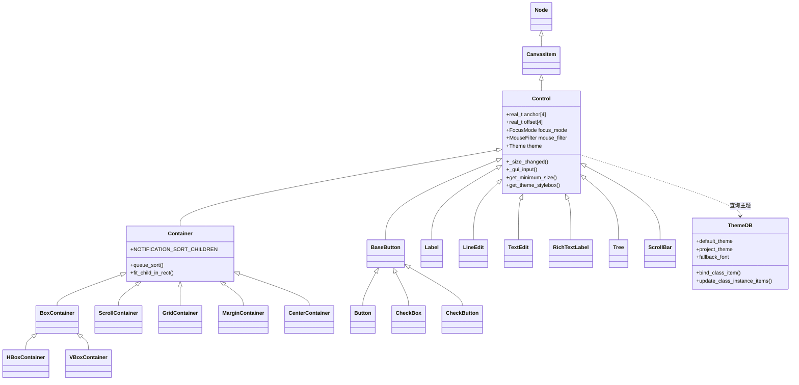

# 09 - GUI/UI 系统 (GUI / UI System)

> **核心结论**：Godot 用一棵 Control 节点树统一了布局、渲染和事件分发，而 UE 用 Slate + UMG 双层架构将底层渲染与上层蓝图解耦——前者轻量直觉，后者灵活但复杂。

---

## 目录

- [第 1 章：模块概览 — "UE 程序员 30 秒速览"](#第-1-章模块概览--ue-程序员-30-秒速览)
- [第 2 章：架构对比 — "同一个问题，两种解法"](#第-2-章架构对比--同一个问题两种解法)
- [第 3 章：核心实现对比 — "代码层面的差异"](#第-3-章核心实现对比--代码层面的差异)
- [第 4 章：UE → Godot 迁移指南](#第-4-章ue--godot-迁移指南)
- [第 5 章：性能对比](#第-5-章性能对比)
- [第 6 章：总结 — "一句话记住"](#第-6-章总结--一句话记住)

---

## 第 1 章：模块概览 — "UE 程序员 30 秒速览"

### 一句话说明

Godot 的 GUI 系统以 `Control` 节点为基类，通过场景树（SceneTree）组织所有 UI 控件，内置锚点/边距布局、Theme 主题系统和信号驱动的事件模型。它对标 UE 的 **UMG (Unreal Motion Graphics) + Slate** 框架，但将 UE 的双层架构（Slate 底层 + UMG 上层）合并为单一的节点体系。

### 核心类/结构体列表

| # | Godot 类 | 源码路径 | 职责 | UE 对应物 |
|---|---------|---------|------|----------|
| 1 | `Control` | `scene/gui/control.h` | UI 基类，管理锚点/偏移/主题/焦点/输入 | `UWidget` + `SWidget` |
| 2 | `Container` | `scene/gui/container.h` | 自动布局容器基类 | `UPanelWidget` |
| 3 | `BoxContainer` / `HBoxContainer` / `VBoxContainer` | `scene/gui/box_container.h` | 线性排列容器 | `UHorizontalBox` / `UVerticalBox` |
| 4 | `ScrollContainer` | `scene/gui/scroll_container.h` | 可滚动容器 | `UScrollBox` |
| 5 | `BaseButton` | `scene/gui/base_button.h` | 按钮基类（状态机 + 快捷键） | `UButton` (Slate: `SButton`) |
| 6 | `Button` | `scene/gui/button.h` | 文本+图标按钮 | `UButton` |
| 7 | `Label` | `scene/gui/label.h` | 静态文本显示 | `UTextBlock` (Slate: `STextBlock`) |
| 8 | `RichTextLabel` | `scene/gui/rich_text_label.h` | 富文本（BBCode/特效/表格） | `URichTextBlock` |
| 9 | `LineEdit` | `scene/gui/line_edit.h` | 单行文本输入 | `UEditableText` (Slate: `SEditableText`) |
| 10 | `TextEdit` | `scene/gui/text_edit.h` | 多行文本编辑器 | `UMultiLineEditableText` |
| 11 | `Tree` | `scene/gui/tree.h` | 树形列表控件 | `UTreeView` (Slate: `STreeView`) |
| 12 | `ThemeDB` | `scene/theme/theme_db.h` | 全局主题管理单例 | `FSlateStyleSet` / UMG Style 系统 |
| 13 | `Theme` | `scene/resources/theme.h` | 主题资源（颜色/字体/样式盒） | `FSlateStyleSet` + `USlateWidgetStyleAsset` |
| 14 | `ThemeOwner` / `ThemeContext` | `scene/theme/theme_db.h` | 主题继承链管理 | Slate Style 继承链 |

### Godot vs UE 概念速查表

| 概念 | Godot | UE |
|------|-------|-----|
| UI 基类 | `Control` (继承自 `CanvasItem → Node`) | `UWidget` (UMG) / `SWidget` (Slate) |
| 布局定位 | 锚点 (Anchor) + 偏移 (Offset) + 生长方向 (GrowDirection) | `FAnchorData` (Anchors + Offsets + Alignment) in `UCanvasPanelSlot` |
| 自动布局容器 | `Container` 子类 (`HBoxContainer`, `VBoxContainer`, `GridContainer`...) | `UPanelWidget` 子类 (`UHorizontalBox`, `UVerticalBox`, `UGridPanel`...) |
| 尺寸策略 | `SizeFlags` (FILL / EXPAND / SHRINK_BEGIN/CENTER/END) | `FSlateChildSize` (Fill / Auto) + Slot Alignment |
| 主题/样式 | `Theme` 资源 + `ThemeDB` 单例 + 控件级 override | `FSlateStyleSet` + `USlateWidgetStyleAsset` |
| 事件处理 | 信号 (Signal) + `_gui_input()` 虚函数 + `NOTIFICATION_*` | 委托 (Delegate) + `OnKeyDown()` / `OnMouseButtonDown()` 等虚函数 |
| 焦点导航 | `FocusMode` + `focus_neighbor` 四方向 NodePath | `UWidgetNavigation` + Slate `FNavigationConfig` |
| 拖放 | `get_drag_data()` / `can_drop_data()` / `drop_data()` 虚函数 | `UDragDropOperation` + `OnDragDetected` / `OnDrop` |
| 富文本 | `RichTextLabel` (BBCode 标记 + 内置特效) | `URichTextBlock` + `URichTextBlockDecorator` |
| UI 动画 | 通过 `AnimationPlayer` / `Tween` 节点 | `UWidgetAnimation` (UMG 内置时间轴) |
| 渲染层级 | 场景树顺序 (后绘制的在上) | `ZOrder` in `UCanvasPanelSlot` |
| 双层架构 | **无** — Control 即是逻辑也是渲染 | Slate (C++ 渲染层) + UMG (Blueprint 逻辑层) |

---

## 第 2 章：架构对比 — "同一个问题，两种解法"

### 2.1 Godot 的架构设计

Godot 的 GUI 系统建立在场景树（SceneTree）之上，所有 UI 控件都是 `Node` 的子类。核心继承链为：

```
Node → CanvasItem → Control → [具体控件]
```

`Control` 是所有 UI 元素的基类，它同时承担了：
- **布局计算**（锚点/偏移/最小尺寸）
- **渲染**（通过 `CanvasItem` 的绘制接口）
- **输入事件分发**（`_gui_input` 虚函数 + 鼠标过滤器）
- **主题管理**（Theme 查找链 + 缓存）
- **焦点管理**（四方向邻居 + 焦点模式）
- **无障碍访问**（Accessibility API）



**关键设计特点**：
- **单层架构**：没有 Slate/UMG 的分层，Control 节点既是逻辑对象也是渲染对象
- **场景树即 UI 树**：UI 层级关系直接由场景树的父子关系决定
- **信号驱动**：UI 事件通过 Godot 的信号系统（Signal）传播，而非委托链

### 2.2 UE 对应模块的架构设计

UE 的 UI 系统采用经典的**双层架构**：

```
Slate (C++ 底层) ← SWidget 体系
    ↑ 包装
UMG (Blueprint 上层) ← UWidget 体系
```

- **Slate 层**（`Runtime/SlateCore` + `Runtime/Slate`）：纯 C++ 的即时模式 UI 框架，`SWidget` 是基类。负责实际的布局计算、渲染和输入处理。
  - 源码路径：`Engine/Source/Runtime/SlateCore/Public/Widgets/SWidget.h`
  - 关键子类：`SCompoundWidget`、`SLeafWidget`、`SPanel`
- **UMG 层**（`Runtime/UMG`）：基于 UObject 的 Blueprint 友好层，`UWidget` 是基类。每个 `UWidget` 内部持有一个 `TSharedPtr<SWidget>` 作为底层实现。
  - 源码路径：`Engine/Source/Runtime/UMG/Public/Components/Widget.h`
  - 关键子类：`UPanelWidget`、`UUserWidget`

布局信息存储在 **Slot** 对象中（如 `UCanvasPanelSlot` 中的 `FAnchorData`），而非控件本身。

### 2.3 关键架构差异分析

#### 差异 1：单层 vs 双层架构 — 设计哲学差异

Godot 选择了**单层统一架构**：`Control` 节点同时是场景树节点、渲染对象和逻辑对象。这意味着你在编辑器中看到的 UI 节点树就是运行时的完整 UI 结构，没有任何中间层。这种设计的优势在于**认知负担极低**——UE 程序员需要理解 `SWidget` 和 `UWidget` 的关系、`SynchronizeProperties()` 的同步时机、`TakeWidget()` / `RebuildWidget()` 的生命周期，而 Godot 程序员只需要理解一棵节点树。

UE 的**双层架构**则是为了解决一个核心矛盾：Slate 是高性能的 C++ 框架，但 Blueprint 设计师需要一个更友好的接口。`UWidget` 作为 `UObject` 子类可以被 Blueprint 引用、序列化和 GC 管理，而底层的 `SWidget` 使用 `TSharedPtr` 引用计数管理内存。这种分层带来了更好的**关注点分离**和**性能优化空间**（Slate 可以独立于 UObject 系统进行批量渲染优化），但代价是两层之间的同步复杂性。

**源码证据**：
- Godot `Control` 直接继承 `CanvasItem`（`scene/gui/control.h:44`），无中间层
- UE `UWidget` 持有 `TSharedPtr<SWidget> MyWidget`（`Engine/Source/Runtime/UMG/Public/Components/Widget.h`），需要 `SynchronizeProperties()` 同步

#### 差异 2：布局信息归属 — 继承体系差异

在 Godot 中，布局信息（锚点、偏移、尺寸标志）**存储在 Control 自身**。每个 `Control` 都有 `data.anchor[4]`、`data.offset[4]`、`data.h_size_flags` 等成员变量（`scene/gui/control.h:218-230`）。这意味着控件"知道"自己想要如何被布局。

在 UE 中，布局信息存储在 **Slot 对象**中。例如 `UCanvasPanelSlot` 包含 `FAnchorData LayoutData`（`Engine/Source/Runtime/UMG/Public/Components/CanvasPanelSlot.h:72`），其中有 `FAnchors Anchors`、`FMargin Offsets` 和 `FVector2D Alignment`。Slot 是父容器分配给子控件的"插槽"，布局信息属于"父子关系"而非"子控件自身"。

这两种设计各有 trade-off：
- **Godot 方式**：控件可以独立设置自己的布局参数，即使还没有父节点。但这也意味着同一个控件在不同容器中无法有不同的布局参数（除非容器覆盖）。
- **UE 方式**：布局参数与容器类型绑定（`UCanvasPanelSlot` vs `UHorizontalBoxSlot` vs `UOverlaySlot`），更灵活但也更复杂。同一个控件放入不同容器会自动获得不同类型的 Slot。

#### 差异 3：容器布局机制 — 模块耦合方式差异

Godot 的 `Container` 基类通过**通知机制**驱动布局：当子节点的最小尺寸变化时，`Container` 收到 `_child_minsize_changed()` 回调，调用 `queue_sort()` 延迟排序，最终在 `NOTIFICATION_SORT_CHILDREN` 通知中执行具体的布局算法（`scene/gui/container.cpp:119-128`）。子控件通过 `SizeFlags`（FILL、EXPAND、SHRINK_BEGIN/CENTER/END）告诉容器自己的布局偏好。

UE 的容器布局则通过 Slate 的 **`ArrangeChildren()` + `OnPaint()`** 两阶段流程实现。`SBoxPanel`（对应 `UHorizontalBox`/`UVerticalBox`）在 `OnArrangeChildren()` 中计算每个子 Slot 的几何信息，然后在 `OnPaint()` 中按计算好的几何信息绘制。布局参数通过 `FSlotBase` 的 `SizeParam`（Auto/Fill）和 `HAlign`/`VAlign` 控制。

**关键区别**：Godot 的容器布局是**延迟的、基于通知的**（`queue_sort()` 使用 `call_deferred`），而 UE Slate 的布局是**即时的、每帧计算的**（在 Slate 的 Prepass + ArrangeChildren 阶段）。Godot 的方式减少了不必要的重新布局，但可能导致一帧的延迟；UE 的方式保证了布局的即时性，但每帧都有布局开销。

---

## 第 3 章：核心实现对比 — "代码层面的差异"

### 3.1 Control vs UWidget：UI 基类的设计差异

#### Godot 怎么做的

`Control` 类（`scene/gui/control.h`，769 行）继承自 `CanvasItem`，是所有 UI 控件的基类。它的核心数据全部封装在一个私有的 `Data` 结构体中（约 100 个成员变量），涵盖：

- **定位与尺寸**：`anchor[4]`、`offset[4]`、`pos_cache`、`size_cache`、`minimum_size_cache`
- **容器尺寸策略**：`h_size_flags`、`v_size_flags`、`expand`（stretch ratio）
- **输入**：`mouse_filter`（STOP/PASS/IGNORE）、`focus_mode`、`focus_neighbor[4]`
- **主题**：`theme_owner`、`theme`、`theme_type_variation`、6 种类型的 override map 和 cache map
- **国际化**：`layout_dir`、`is_rtl`

布局计算的核心在 `_size_changed()` 函数（`scene/gui/control.cpp:1760`）：

```cpp
void Control::_size_changed() {
    Rect2 parent_rect = get_parent_anchorable_rect();
    real_t edge_pos[4];
    for (int i = 0; i < 4; i++) {
        real_t area = parent_rect.size[i & 1];
        edge_pos[i] = data.offset[i] + (data.anchor[i] * area);
    }
    Point2 new_pos_cache = Point2(edge_pos[0], edge_pos[1]);
    Size2 new_size_cache = Point2(edge_pos[2], edge_pos[3]) - new_pos_cache;
    // ... 最小尺寸约束 + GrowDirection 处理 ...
}
```

公式为：`edge_position = offset + anchor * parent_size`。四条边（左、上、右、下）各有独立的锚点和偏移值。

#### UE 怎么做的

UE 的 UI 基类分为两层：

1. **`SWidget`**（`Engine/Source/Runtime/SlateCore/Public/Widgets/SWidget.h`，1861 行）：Slate 底层基类，使用 `TSharedPtr` 管理生命周期。核心接口包括 `Paint()`、`Tick()`、`OnFocusReceived()`、`OnKeyDown()`、`OnMouseButtonDown()` 等虚函数。布局通过 `ComputeDesiredSize()` + `ArrangeChildren()` 两阶段完成。

2. **`UWidget`**（`Engine/Source/Runtime/UMG/Public/Components/Widget.h`，1138 行）：UMG 上层基类，继承自 `UVisual`（`UObject` 子类）。每个 `UWidget` 通过 `TakeWidget()` 创建并持有一个 `SWidget` 实例。布局信息存储在 `UPanelSlot` 子类中。

UE 的锚点系统在 `UCanvasPanelSlot` 中实现（`Engine/Source/Runtime/UMG/Public/Components/CanvasPanelSlot.h`）：

```cpp
USTRUCT(BlueprintType)
struct FAnchorData {
    FMargin Offsets;      // 四边偏移
    FAnchors Anchors;     // 锚点 (Min/Max 各一个 FVector2D)
    FVector2D Alignment;  // 对齐枢轴点
};
```

#### 差异点评

| 维度 | Godot Control | UE UWidget + SWidget |
|------|--------------|---------------------|
| 内存管理 | 场景树管理生命周期（手动 `queue_free()` 或父节点释放） | `SWidget` 用 `TSharedPtr` 引用计数；`UWidget` 用 UObject GC |
| 线程安全 | 主线程操作，`ERR_MAIN_THREAD_GUARD` 保护 | Slate 有 Game Thread / Slate Thread 分离 |
| 数据结构 | 单一 `Data` 结构体，所有布局/主题/焦点数据集中 | 分散在 `SWidget`（渲染）、`UWidget`（逻辑）、`UPanelSlot`（布局）三处 |
| 锚点模型 | 4 个独立锚点值 (0~1) + 4 个偏移值 | `FAnchors`（Min/Max 各一个 2D 向量）+ `FMargin` 偏移 + `Alignment` 枢轴 |
| 扩展性 | 通过 GDExtension / GDScript 虚函数覆盖 | C++ 继承 `SWidget` 或 Blueprint 继承 `UUserWidget` |

**Trade-off 分析**：Godot 的单层设计使得 `Control` 类非常"胖"（769 行头文件，4475 行实现），但使用起来极其简单。UE 的分层设计使得每一层都更精简，但理解整个系统需要跨越多个文件和概念。对于小型项目，Godot 的方式更高效；对于大型团队项目，UE 的分层更有利于职责分离。

### 3.2 锚点/边距布局 vs UMG Slot/Anchor：布局系统对比

#### Godot 怎么做的

Godot 的布局系统有三种模式（`scene/gui/control.h:167-172`）：

```cpp
enum LayoutMode {
    LAYOUT_MODE_POSITION,      // 绝对定位
    LAYOUT_MODE_ANCHORS,       // 锚点+偏移
    LAYOUT_MODE_CONTAINER,     // 由父容器控制
    LAYOUT_MODE_UNCONTROLLED,  // 不受控
};
```

锚点布局的核心公式在 `_size_changed()`（`scene/gui/control.cpp:1760-1838`）中：

```
edge_position[side] = offset[side] + anchor[side] * parent_area_size
```

每条边有独立的锚点（0.0~1.0）和偏移（像素值）。例如：
- 锚点全为 0，偏移为 (10, 10, 110, 60) → 固定位置 (10,10)，固定大小 (100,50)
- 锚点为 (0, 0, 1, 0)，偏移为 (10, 10, -10, 60) → 水平拉伸，左右各留 10px 边距

当计算出的尺寸小于 `minimum_size` 时，`GrowDirection` 决定如何调整位置：

```cpp
if (minimum_size.width > new_size_cache.width) {
    if (data.h_grow == GROW_DIRECTION_BEGIN) {
        new_pos_cache.x += new_size_cache.width - minimum_size.width;
    } else if (data.h_grow == GROW_DIRECTION_BOTH) {
        new_pos_cache.x += 0.5 * (new_size_cache.width - minimum_size.width);
    }
    new_size_cache.width = minimum_size.width;
}
```

Godot 还提供了 `LayoutPreset` 枚举（16 种预设，如 `PRESET_FULL_RECT`、`PRESET_CENTER` 等），方便快速设置常见的锚点组合。

#### UE 怎么做的

UE 的锚点系统在 `UCanvasPanelSlot` 中实现，底层由 `SConstraintCanvas` 处理。`FAnchorData` 包含：

- `FAnchors Anchors`：`Minimum` (FVector2D) 和 `Maximum` (FVector2D)，对应四个锚点值
- `FMargin Offsets`：四边偏移
- `FVector2D Alignment`：枢轴点（0,0 为左上角，1,1 为右下角）

UE 的锚点模型比 Godot 多了一个 **Alignment（对齐枢轴）** 概念。当锚点的 Min 和 Max 相同时（点锚点），Offsets 表示位置和大小；当 Min ≠ Max 时（拉伸锚点），Offsets 表示四边的边距。

**关键区别**：UE 的 Alignment 允许控件围绕任意点旋转/缩放，而 Godot 使用单独的 `pivot_offset` 属性实现类似功能。UE 的布局信息存储在 Slot 中（属于父容器），Godot 的布局信息存储在 Control 自身。

#### 差异点评

Godot 的锚点系统更**直觉**：4 个锚点 + 4 个偏移，公式简单明了。UE 的系统更**灵活**：Alignment 枢轴点是一个强大的概念，但也增加了理解成本。对于大多数 UI 布局场景，两者能力等价；但 UE 的 Slot 模式在"同一控件在不同容器中有不同布局"的场景下更自然。

### 3.3 Container 自动布局 vs UMG Panel：容器布局策略

#### Godot 怎么做的

Godot 的容器布局基于 `Container` 基类（`scene/gui/container.h`）和通知机制：

1. **子节点变化触发**：`add_child_notify()` / `remove_child_notify()` 连接子控件的 `size_flags_changed`、`minimum_size_changed`、`visibility_changed` 信号到容器的 `queue_sort()`（`scene/gui/container.cpp:40-52`）

2. **延迟排序**：`queue_sort()` 使用 `call_deferred` 延迟执行 `_sort_children()`，避免一帧内多次重排

3. **具体布局**：子类在 `NOTIFICATION_SORT_CHILDREN` 中实现具体算法。以 `BoxContainer::_resort()` 为例（`scene/gui/box_container.cpp:46-250`）：
   - 第一遍：计算所有子控件的最小尺寸，统计可拉伸元素
   - 循环：逐步剔除无法满足最小尺寸的拉伸元素
   - 最终遍：调用 `fit_child_in_rect()` 设置每个子控件的位置和大小

`fit_child_in_rect()` 是容器布局的核心工具函数（`scene/gui/container.cpp:131-162`），它根据子控件的 `SizeFlags` 决定如何在分配的矩形内放置控件：

```cpp
void Container::fit_child_in_rect(Control *p_child, const Rect2 &p_rect) {
    Size2 minsize = p_child->get_combined_minimum_size();
    Rect2 r = p_rect;
    if (!(p_child->get_h_size_flags().has_flag(SIZE_FILL))) {
        r.size.x = minsize.width;
        if (p_child->get_h_size_flags().has_flag(SIZE_SHRINK_END)) {
            r.position.x += rtl ? 0 : (p_rect.size.width - minsize.width);
        } else if (p_child->get_h_size_flags().has_flag(SIZE_SHRINK_CENTER)) {
            r.position.x += Math::floor((p_rect.size.x - minsize.width) / 2);
        }
    }
    // ... 垂直方向类似 ...
    p_child->set_rect(r);
}
```

#### UE 怎么做的

UE 的容器布局在 Slate 层实现。以 `SBoxPanel`（`UHorizontalBox`/`UVerticalBox` 的底层）为例：

- `ComputeDesiredSize()`：遍历所有子 Slot，累加 Auto 尺寸的子控件的 DesiredSize
- `OnArrangeChildren()`：根据 Slot 的 `SizeParam`（Auto/Fill）分配空间，Fill 类型按比例分配剩余空间
- Slot 属性：`FSlotBase::SizeParam`（Auto/Fill + FillWeight）、`HAlign`、`VAlign`、`Padding`

UE 的布局是**每帧执行**的（在 Slate 的 Prepass 阶段），而非延迟触发。

#### 差异点评

| 维度 | Godot Container | UE Panel (Slate) |
|------|----------------|-----------------|
| 触发时机 | 延迟（`call_deferred`），按需触发 | 每帧（Slate Prepass），始终执行 |
| 尺寸策略 | `SizeFlags` 位域（FILL/EXPAND/SHRINK_*） | `SizeParam`（Auto/Fill）+ `FillWeight` + `HAlign/VAlign` |
| 拉伸比例 | `stretch_ratio` 属性 | `FillWeight` 属性 |
| 最小尺寸 | `get_combined_minimum_size()`（含 custom_minimum_size） | `ComputeDesiredSize()` |
| RTL 支持 | 内置 `is_layout_rtl()` 检查 | `FlowDirection` 属性 |

Godot 的延迟排序策略在频繁变化的场景下更高效（合并多次变化为一次排序），但可能导致一帧的视觉延迟。UE 的每帧布局保证了即时性，但在复杂 UI 中可能成为性能瓶颈。

### 3.4 Theme vs UMG Style：主题/样式系统对比

#### Godot 怎么做的

Godot 的主题系统由三个核心组件构成：

1. **`Theme` 资源**（`scene/resources/theme.h`）：存储 6 种类型的主题项——Icon、StyleBox、Font、FontSize、Color、Constant。每种类型按 `(控件类型名, 项目名)` 二维索引。

2. **`ThemeDB` 单例**（`scene/theme/theme_db.h`）：管理全局主题层级：
   - `default_theme`：引擎默认主题
   - `project_theme`：项目级主题
   - `fallback_*`：最终回退值（字体、图标、样式盒等）

3. **控件级 Theme Override**：每个 `Control` 可以通过 `add_theme_*_override()` 覆盖特定主题项，存储在 `data.theme_*_override` HashMap 中。

主题查找链（从高优先级到低）：
```
控件级 Override → 控件自身 Theme → 父节点 Theme → ... → 项目 Theme → 默认 Theme → Fallback
```

`ThemeDB` 还提供了 **Theme Item Binding** 机制（`scene/theme/theme_db.h:50-65`），通过宏 `BIND_THEME_ITEM` 将主题项绑定到控件的 `theme_cache` 结构体：

```cpp
#define BIND_THEME_ITEM(m_data_type, m_class, m_prop)                                    \
    ThemeDB::get_singleton()->bind_class_item(m_data_type, get_class_static(),            \
        #m_prop, #m_prop,                                                                 \
        [](Node *p_instance, const StringName &p_item_name, const StringName &p_type_name) { \
            m_class *p_cast = Object::cast_to<m_class>(p_instance);                       \
            p_cast->theme_cache.m_prop = p_cast->get_theme_item(...);                     \
        })
```

这使得每个控件都有一个 `theme_cache` 结构体，在主题变化时自动更新，避免了每次绘制时的主题查找开销。例如 `Button` 的 `theme_cache` 包含了所有状态的 StyleBox、颜色、字体等（`scene/gui/button.h:80-120`）。

#### UE 怎么做的

UE 的样式系统基于 `FSlateStyleSet`：

- **`FSlateStyleSet`**：一个命名的样式集合，存储 `FSlateBrush`、`FTextBlockStyle`、`FButtonStyle` 等样式对象
- **`FSlateApplication::Get().GetRenderer()`**：全局渲染器管理样式
- **`FSlateStyleRegistry`**：注册和查找样式集
- **UMG 层**：`USlateWidgetStyleAsset` 资源，可在 Blueprint 中引用

UE 的样式查找是**扁平的**——通过样式名直接在 `FSlateStyleSet` 中查找，没有 Godot 那样的层级继承链。

#### 差异点评

Godot 的 Theme 系统更**层级化**和**动态**：
- 支持节点树级别的主题继承（子节点自动继承父节点的 Theme）
- 支持运行时动态切换主题
- `theme_cache` 机制避免了重复查找

UE 的样式系统更**静态**和**类型安全**：
- 样式在编译时或加载时确定
- 强类型的样式结构体（`FButtonStyle`、`FTextBlockStyle`）
- 更适合大型项目的样式管理

### 3.5 Control 焦点系统 vs UMG Navigation：UI 导航机制

#### Godot 怎么做的

Godot 的焦点系统内置在 `Control` 中（`scene/gui/control.h:67-72`）：

```cpp
enum FocusMode {
    FOCUS_NONE,           // 不可聚焦
    FOCUS_CLICK,          // 仅点击聚焦
    FOCUS_ALL,            // 点击+键盘聚焦
    FOCUS_ACCESSIBILITY,  // 仅无障碍聚焦
};
```

焦点导航通过四个方向的 `NodePath` 实现（`data.focus_neighbor[4]`），加上 `focus_next` 和 `focus_prev` 用于 Tab 顺序。如果没有显式设置邻居，系统会通过 `_window_find_focus_neighbor()` 自动查找最近的可聚焦控件。

此外，Godot 还引入了 `FocusBehaviorRecursive`（`scene/gui/control.h:73-77`），允许递归地禁用/启用子树的焦点行为。

#### UE 怎么做的

UE 的焦点导航通过 `UWidgetNavigation` 类实现（`Engine/Source/Runtime/UMG/Public/Blueprint/WidgetNavigation.h`），支持四个方向的导航规则：

- `Escape`：跳出当前控件
- `Explicit`：指定目标控件
- `Wrap`：循环导航
- `Stop`：停止导航
- `Custom`：自定义委托

Slate 层有 `FNavigationConfig` 提供更底层的导航控制。

#### 差异点评

Godot 的焦点系统更**简单直接**——通过 NodePath 指定邻居，自动查找作为回退。UE 的系统更**灵活**——支持多种导航策略和自定义委托。对于手柄/键盘驱动的 UI（如主机游戏），UE 的导航系统更成熟；对于鼠标驱动的 UI，Godot 的简单模型已经足够。

### 3.6 信号驱动 vs 事件委托：UI 事件处理模式差异

#### Godot 怎么做的

Godot 的 UI 事件处理有三个层次：

1. **`_gui_input(Ref<InputEvent>)` 虚函数**：控件可以覆盖此函数处理输入事件。通过 `accept_event()` 阻止事件继续传播。

2. **信号（Signal）**：控件发出预定义信号，如 `BaseButton` 的 `pressed`、`toggled`；`LineEdit` 的 `text_changed`、`text_submitted`。

3. **通知（Notification）**：`NOTIFICATION_MOUSE_ENTER`、`NOTIFICATION_FOCUS_ENTER` 等。

鼠标事件通过 `MouseFilter` 控制传播（`scene/gui/control.h:88-92`）：
```cpp
enum MouseFilter {
    MOUSE_FILTER_STOP,    // 处理并阻止传播
    MOUSE_FILTER_PASS,    // 处理但继续传播
    MOUSE_FILTER_IGNORE   // 完全忽略
};
```

#### UE 怎么做的

UE 的事件处理分为两层：

1. **Slate 层**：虚函数模式——`OnMouseButtonDown()`、`OnKeyDown()` 等返回 `FReply`（Handled/Unhandled）控制传播。

2. **UMG 层**：委托模式——`OnClicked`、`OnPressed`、`OnTextChanged` 等动态多播委托，可在 Blueprint 中绑定。

```cpp
// UE Slate 层
virtual FReply OnMouseButtonDown(const FGeometry& MyGeometry, const FPointerEvent& MouseEvent);

// UE UMG 层
UPROPERTY(BlueprintAssignable, Category="Button|Event")
FOnButtonClickedEvent OnClicked;
```

#### 差异点评

| 维度 | Godot 信号 | UE 委托 |
|------|-----------|---------|
| 连接方式 | `connect()` / 编辑器可视化连接 | `AddDynamic()` / Blueprint 绑定 |
| 类型安全 | 运行时检查参数 | 编译时类型检查（C++ 委托） |
| 多播 | 信号天然支持多个接收者 | 多播委托 (`FMulticastDelegate`) |
| 传播控制 | `MouseFilter` + `accept_event()` | `FReply::Handled()` / `FReply::Unhandled()` |
| 性能 | 信号调用有一定开销（Variant 装箱） | C++ 委托接近直接函数调用 |

Godot 的信号系统更**统一**（所有节点都用同一套信号机制），UE 的委托系统更**高性能**（C++ 层面的类型安全和零开销抽象）。

---

## 第 4 章：UE → Godot 迁移指南

### 4.1 思维转换清单

1. **忘掉 Slate/UMG 双层**：在 Godot 中没有"底层渲染控件"和"上层逻辑控件"的区分。`Control` 就是一切——它既是渲染对象，也是逻辑对象，也是场景树节点。不需要 `TakeWidget()`、`SynchronizeProperties()` 或 `RebuildWidget()`。

2. **忘掉 Slot 对象**：布局信息直接设置在 `Control` 上（`set_anchor()`、`set_offset()`），而非通过父容器的 Slot。当 Control 被放入 Container 时，Container 会直接操作子控件的位置和大小。

3. **重新学习信号系统**：UE 的 `DECLARE_DYNAMIC_MULTICAST_DELEGATE` + `AddDynamic()` 在 Godot 中对应 `signal` 声明 + `connect()`。Godot 的信号更轻量，但参数是 `Variant` 类型（类似 UE 的 `FProperty`）。

4. **重新学习 Theme 系统**：UE 的 `FSlateStyleSet` 是扁平的样式注册表，Godot 的 `Theme` 是层级化的资源。你需要理解 Theme 的继承链：控件 Override → 节点 Theme → 父节点 Theme → 项目 Theme → 默认 Theme。

5. **重新学习最小尺寸机制**：UE 的 `ComputeDesiredSize()` 在 Godot 中对应 `get_minimum_size()` 虚函数。但 Godot 还有 `custom_minimum_size` 属性，允许手动设置最小尺寸下限。容器布局完全基于最小尺寸 + SizeFlags 工作。

6. **忘掉 Widget Blueprint**：Godot 没有"Widget Blueprint"的概念。UI 界面就是普通的场景（.tscn），可以被实例化为子场景。这比 UE 的 Widget Blueprint 更灵活（可以混合 2D/3D 节点），但也意味着没有专门的 UI 编辑器模式。

7. **重新学习 RTL 支持**：Godot 内置了完整的 RTL（从右到左）布局支持，通过 `LayoutDirection` 和 `is_layout_rtl()` 控制。这在 UE 中需要通过 `FlowDirection` 和额外配置实现。

### 4.2 API 映射表

| UE API | Godot 等价 API | 说明 |
|--------|---------------|------|
| `UWidget::SetVisibility(ESlateVisibility)` | `Control::set_visible(bool)` / `Control::show()` / `Control::hide()` | Godot 没有 Collapsed/HitTestInvisible 等细分状态 |
| `UWidget::SetRenderTransform()` | `Control::set_rotation()` / `Control::set_scale()` / `Control::set_pivot_offset()` | 分开设置而非统一的 Transform |
| `UCanvasPanelSlot::SetAnchors()` | `Control::set_anchor(Side, float)` | 逐边设置，或用 `set_anchors_preset()` |
| `UCanvasPanelSlot::SetOffsets()` | `Control::set_offset(Side, float)` | 逐边设置 |
| `UCanvasPanelSlot::SetAlignment()` | `Control::set_pivot_offset_ratio(Vector2)` | 类似但不完全等价 |
| `UHorizontalBox::AddChildToHorizontalBox()` | `HBoxContainer.add_child(node)` | 直接添加子节点 |
| `UButton::OnClicked` | `Button.pressed` 信号 | `button.connect("pressed", callable)` |
| `UTextBlock::SetText()` | `Label::set_text()` | 直接设置 |
| `UEditableText::OnTextChanged` | `LineEdit.text_changed` 信号 | 参数为新文本字符串 |
| `UScrollBox::ScrollToStart()` | `ScrollContainer::set_v_scroll(0)` | 手动设置滚动位置 |
| `UWidget::SetToolTipText()` | `Control::set_tooltip_text()` | 直接设置 |
| `FSlateStyleSet::Get<FButtonStyle>()` | `Control::get_theme_stylebox("normal")` | 按名称查找主题项 |
| `UWidget::SetFocus()` | `Control::grab_focus()` | 获取焦点 |
| `UWidgetNavigation` | `Control::set_focus_neighbor(Side, NodePath)` | 逐方向设置 |
| `UWidget::RemoveFromParent()` | `node.get_parent().remove_child(node)` 或 `node.queue_free()` | 从树中移除 |

### 4.3 陷阱与误区

#### 陷阱 1：Container 会覆盖子控件的位置和大小

**UE 思维**：在 UE 中，即使控件在 Panel 中，你仍然可以通过 Slot 精确控制位置。

**Godot 现实**：当 `Control` 被放入 `Container` 时，其 `LayoutMode` 自动变为 `LAYOUT_MODE_CONTAINER`，锚点和偏移设置**被容器完全接管**。你无法手动设置被容器管理的控件的位置——容器会在 `NOTIFICATION_SORT_CHILDREN` 中通过 `fit_child_in_rect()` 强制设置。

**解决方案**：如果需要在容器内精确定位，使用 `MarginContainer` 添加边距，或将控件设为 `top_level` 脱离容器管理。

#### 陷阱 2：最小尺寸传播是延迟的

**UE 思维**：Slate 的 `ComputeDesiredSize()` 在每帧的 Prepass 中同步计算。

**Godot 现实**：`update_minimum_size()` 触发的重新计算是通过 `call_deferred` 延迟执行的。如果你在同一帧内修改了控件内容并立即查询其大小，可能得到旧值。

**解决方案**：如果需要立即获取最新尺寸，调用 `get_combined_minimum_size()` 会触发缓存更新（`_update_minimum_size_cache()` 检查 `minimum_size_valid` 标志）。

#### 陷阱 3：MouseFilter 的默认值因控件类型而异

**UE 思维**：UE 的 `Visibility` 统一控制可见性和命中测试。

**Godot 现实**：`Control` 的默认 `MouseFilter` 是 `MOUSE_FILTER_STOP`（处理并阻止传播），但 `Container` 的默认值是 `MOUSE_FILTER_PASS`（`scene/gui/container.cpp:234`）。如果你的自定义容器没有正确设置 MouseFilter，可能会意外拦截鼠标事件。

**解决方案**：始终显式设置 `mouse_filter`，不要依赖默认值。

#### 陷阱 4：Theme Override 的优先级

**UE 思维**：UE 的样式是全局注册的，通过名称查找。

**Godot 现实**：Theme 有复杂的查找链。控件级 Override 优先级最高，但 `theme_type_variation` 可以改变查找的类型名。如果你设置了 Override 但看不到效果，可能是因为控件使用了 `theme_type_variation` 指向了另一个类型。

### 4.4 最佳实践

1. **善用 Container 嵌套**：Godot 的 UI 布局哲学是"容器嵌套"。不要试图用锚点实现所有布局——用 `VBoxContainer` + `HBoxContainer` + `MarginContainer` 的组合来构建响应式布局，就像 CSS Flexbox 一样。

2. **利用 Theme 继承**：在场景树的根节点设置 Theme，所有子控件自动继承。需要局部样式变化时，在子树根节点设置新的 Theme 或使用 `theme_type_variation`。

3. **信号连接用 Callable**：优先使用 `callable_mp()` 连接信号（C++）或 `connect("signal_name", Callable(self, "method"))` (GDScript)，而非旧的字符串方式。

4. **自定义控件覆盖 `_get_minimum_size()`**：如果你创建自定义控件，务必覆盖 `_get_minimum_size()` 虚函数返回正确的最小尺寸，否则容器布局会出问题。

5. **使用 `theme_cache`**：在自定义控件中，通过 `BIND_THEME_ITEM` 宏将主题项绑定到 `theme_cache` 结构体，避免在 `_draw()` 中频繁调用 `get_theme_*()` 方法。

---

## 第 5 章：性能对比

### 5.1 Godot GUI 系统的性能特征

#### 优势

1. **延迟布局**：`Container::queue_sort()` 使用 `call_deferred`，将同一帧内的多次布局请求合并为一次执行。这在频繁修改 UI 属性的场景下（如动画驱动的 UI）非常高效。

2. **Theme 缓存**：`theme_cache` 机制（通过 `BIND_THEME_ITEM` 宏）将主题查找结果缓存在控件实例中，只在主题变化时更新。绘制时直接读取缓存，无需遍历主题继承链。

3. **最小尺寸缓存**：`minimum_size_cache` + `minimum_size_valid` 标志避免了重复计算最小尺寸。只有当内容变化时才标记为无效。

4. **RichTextLabel 多线程**：`RichTextLabel` 支持多线程文本排版（`scene/gui/rich_text_label.h:609-614`），通过 `WorkerThreadPool::TaskID` 在后台线程处理文本布局，避免阻塞主线程。

#### 瓶颈

1. **深层嵌套的容器树**：每次子控件尺寸变化都会向上传播 `minimum_size_changed` 信号，触发父容器的 `queue_sort()`。深层嵌套（>10 层）可能导致级联的重新布局。

2. **大量控件的场景**：Godot 的 UI 控件是完整的 `Node` 对象，每个都有场景树开销（通知分发、信号连接等）。1000+ 个控件的 UI 会有明显的内存和 CPU 开销。

3. **Theme 查找链**：虽然有缓存，但主题变化时需要遍历整个子树更新缓存（`_theme_changed()` 递归传播）。频繁切换主题可能导致卡顿。

4. **信号开销**：Godot 的信号系统使用 `Variant` 传参，有装箱/拆箱开销。在高频事件（如 `mouse_moved`）中，这个开销可能累积。

### 5.2 与 UE 对应模块的性能差异

| 维度 | Godot | UE (Slate + UMG) |
|------|-------|-------------------|
| 布局计算 | 延迟 + 按需，低频场景更优 | 每帧计算，高频场景更稳定 |
| 渲染批处理 | CanvasItem 合批（基于材质/纹理） | Slate 批处理（基于 Layer/Clipping） |
| 控件实例开销 | ~1-2KB/控件（Node 基础开销） | SWidget ~200-500B，UWidget 额外 ~500B-1KB |
| 文本排版 | TextServer 抽象层（ICU/HarfBuzz） | Slate Text（FreeType/HarfBuzz） |
| 虚拟化列表 | `Tree` 控件内置虚拟化 | `SListView`/`STreeView` 完整虚拟化 |
| GPU 渲染 | CanvasItem 走 2D 渲染管线 | Slate 有专门的渲染管线 + Retainer Box 缓存 |

### 5.3 性能敏感场景的建议

1. **大量列表项**：使用 `Tree` 控件而非手动创建大量 `Label`/`Button` 节点。`Tree` 内置了虚拟化渲染，只绘制可见行。

2. **频繁更新的 UI**：避免在 `_process()` 中每帧修改 UI 属性。使用信号驱动的更新模式，只在数据变化时更新 UI。

3. **复杂富文本**：`RichTextLabel` 的 `threaded` 属性可以启用多线程排版。对于大量文本内容，设置 `threaded = true` 并使用 `is_finished()` 检查排版完成。

4. **主题切换**：避免运行时频繁切换全局 Theme。如果需要局部样式变化，使用控件级 Override 而非切换整个 Theme。

5. **减少容器嵌套**：将容器嵌套控制在 5 层以内。如果布局过于复杂，考虑使用自定义 `Container` 子类一次性完成布局，而非多层嵌套。

---

## 第 6 章：总结 — "一句话记住"

### 核心差异

> Godot 用一棵 Control 节点树做完了 UE 需要 Slate + UMG + Slot + StyleSet 四套系统才能做的事——更简单，但也更"胖"。

### 设计亮点（Godot 做得比 UE 好的地方）

1. **零学习曲线的布局系统**：锚点 + 偏移的公式 `edge = offset + anchor * parent_size` 简单到可以心算。不需要理解 Slot 类型、DesiredSize 传播、ArrangeChildren 流程。

2. **层级化的 Theme 系统**：Theme 沿场景树继承，支持节点级 Override，比 UE 的扁平 StyleSet 更适合"局部换肤"场景。`theme_cache` + `BIND_THEME_ITEM` 宏提供了优雅的缓存机制。

3. **内置 RTL 支持**：从 `Control` 基类到每个具体控件，RTL 布局是一等公民。`is_layout_rtl()` 检查贯穿整个布局和渲染流程。

4. **RichTextLabel 的 BBCode + 特效系统**：内置 Shake、Wave、Tornado、Rainbow、Pulse 等文本特效，以及多线程排版支持。UE 的 `URichTextBlock` 需要自定义 Decorator 才能实现类似效果。

5. **Container 的延迟排序**：`queue_sort()` + `call_deferred` 自动合并同帧内的多次布局请求，减少不必要的计算。

### 设计短板（Godot 不如 UE 的地方）

1. **缺乏双层架构的灵活性**：UE 的 Slate/UMG 分层允许 C++ 程序员直接操作高性能的 Slate 层，而设计师使用 UMG 层。Godot 的单层架构意味着所有人都在同一个抽象层工作，无法针对性能热点"下沉"到更底层。

2. **控件实例开销较大**：每个 `Control` 都是完整的 `Node`，携带场景树管理、信号系统、通知分发等基础设施。在需要数千个 UI 元素的场景（如大型数据表格），这个开销比 Slate 的轻量 `SWidget` 更显著。

3. **虚拟化支持有限**：只有 `Tree` 控件内置了虚拟化。UE 的 `SListView` / `STreeView` 提供了更通用的虚拟化列表框架，支持自定义行控件。

4. **缺少 Retainer Box 等渲染优化**：UE 的 `URetainerBox` 可以将子树渲染到纹理缓存，减少每帧的渲染开销。Godot 没有等价的内置机制（需要手动使用 `SubViewport`）。

5. **动画系统不如 UMG 集成**：UE 的 `UWidgetAnimation` 与 UMG 编辑器深度集成，支持关键帧动画、曲线编辑。Godot 需要使用通用的 `AnimationPlayer` 或 `Tween`，没有专门的 UI 动画编辑器。

### UE 程序员的学习路径建议

**推荐阅读顺序**：

1. **`scene/gui/control.h`** ★★★ — 理解 `Control` 的数据结构和 API，这是整个 GUI 系统的基石。重点关注 `Data` 结构体、`LayoutMode` 枚举、`SizeFlags` 和 `MouseFilter`。

2. **`scene/gui/control.cpp` 的 `_size_changed()` 函数**（第 1760 行）★★★ — 理解锚点布局的核心算法，这是从 UE Anchor 系统迁移的关键。

3. **`scene/gui/container.cpp`** ★★ — 理解容器的排序机制（`queue_sort` → `NOTIFICATION_SORT_CHILDREN`）和 `fit_child_in_rect()` 工具函数。

4. **`scene/gui/box_container.cpp` 的 `_resort()` 函数** ★★ — 理解 BoxContainer 的布局算法，这是最常用的容器。

5. **`scene/theme/theme_db.h`** ★★ — 理解 Theme 系统的全局管理和 `BIND_THEME_ITEM` 宏。

6. **`scene/gui/base_button.h`** ★ — 理解按钮的状态机（DrawMode）和事件处理模式，作为学习其他控件的模板。

7. **`scene/gui/rich_text_label.h`** ★ — 理解 Godot 最复杂的控件之一，包括 BBCode 解析、Item 树结构和多线程排版。

**实践建议**：从一个简单的 UI 场景开始（如登录界面），用 Godot 编辑器拖拽 Control 节点构建布局，然后阅读对应的源码理解底层机制。重点体会"场景树即 UI 树"的设计哲学——这是与 UE 最大的思维差异。
