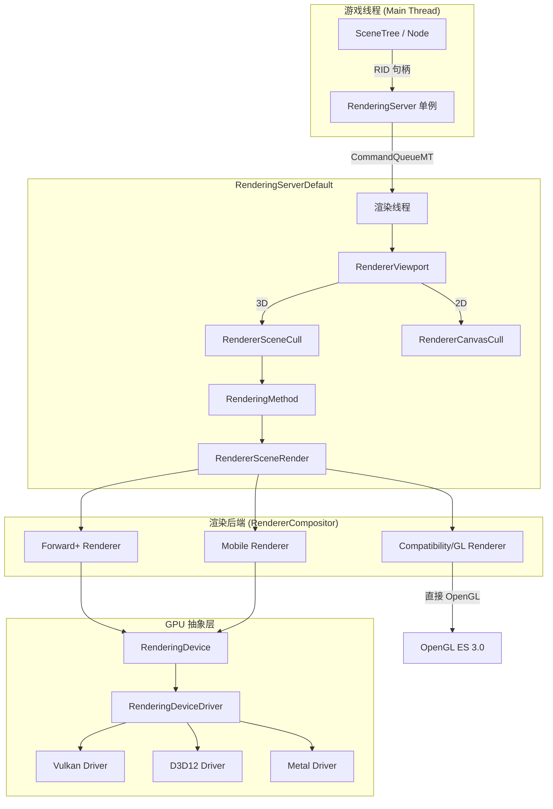
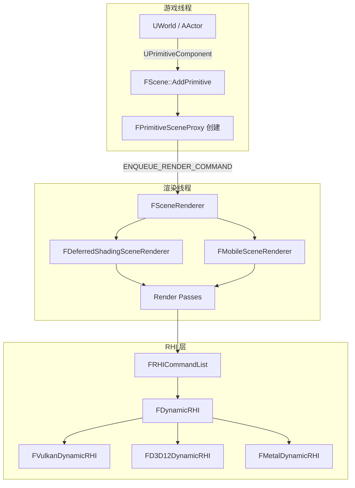

# 渲染服务器 (Rendering Server) — Godot vs UE 深度对比分析

> **一句话核心结论**：Godot 用 Server 单例 + RID 句柄将渲染完全隔离为独立线程服务，而 UE 用 RHI + 渲染线程 + 场景代理实现同样的线程安全目标，两者殊途同归但抽象粒度截然不同。

---

## 目录

- [第 1 章：模块概览 — "UE 程序员 30 秒速览"](#第-1-章模块概览--ue-程序员-30-秒速览)
- [第 2 章：架构对比 — "同一个问题，两种解法"](#第-2-章架构对比--同一个问题两种解法)
- [第 3 章：核心实现对比 — "代码层面的差异"](#第-3-章核心实现对比--代码层面的差异)
- [第 4 章：UE → Godot 迁移指南](#第-4-章ue--godot-迁移指南)
- [第 5 章：性能对比](#第-5-章性能对比)
- [第 6 章：总结 — "一句话记住"](#第-6-章总结--一句话记住)

---

## 第 1 章：模块概览 — "UE 程序员 30 秒速览"

### 这个模块做什么？

Godot 的 **Rendering Server** 是整个渲染系统的统一入口——它相当于 UE 中 `FSceneRenderer` + `RHI` + `FSceneViewport` + `FCanvasRenderer` 的合体。所有渲染操作（创建纹理、提交 Mesh、设置光照、绘制 2D Canvas）都通过这个单例 Server 的 RID（Resource ID）句柄系统进行，实现了游戏线程与渲染线程的完全解耦。

### 核心类/结构体列表

| # | Godot 类 | 源码路径 | 职责 | UE 对应物 |
|---|---------|---------|------|----------|
| 1 | `RenderingServer` | `servers/rendering/rendering_server.h` | 渲染 API 总入口（抽象基类） | `GEngine` + `FSceneInterface` |
| 2 | `RenderingServerDefault` | `servers/rendering/rendering_server_default.h` | RS 的默认实现，含命令队列 | `FRenderingThread` + `ENQUEUE_RENDER_COMMAND` |
| 3 | `RenderingDevice` | `servers/rendering/rendering_device.h` | 低级 GPU 抽象（类 RHI） | `FDynamicRHI` / `FRHICommandList` |
| 4 | `RenderingDeviceDriver` | `servers/rendering/rendering_device_driver.h` | 图形 API 驱动接口 | `FVulkanDynamicRHI` / `FD3D12DynamicRHI` |
| 5 | `RenderingDeviceCommons` | `servers/rendering/rendering_device_commons.h` | RD 共享枚举和数据结构 | `RHIDefinitions.h` |
| 6 | `RendererCompositor` | `servers/rendering/renderer_compositor.h` | 渲染后端工厂（Forward+/Mobile/Compat） | `FSceneRenderer` 子类选择 |
| 7 | `RendererSceneCull` | `servers/rendering/renderer_scene_cull.h` | 场景剔除与实例管理 | `FScene` + `FPrimitiveSceneProxy` |
| 8 | `RendererViewport` | `servers/rendering/renderer_viewport.h` | 视口渲染管理 | `FSceneViewport` + `FViewport` |
| 9 | `RendererCanvasCull` | `servers/rendering/renderer_canvas_cull.h` | 2D Canvas 剔除与渲染 | `FSlateRenderer` / `FCanvasRenderer` |
| 10 | `RenderingMethod` | `servers/rendering/rendering_method.h` | 渲染方法抽象接口 | `FSceneRenderer` (Deferred/Forward) |
| 11 | `ShaderLanguage` | `servers/rendering/shader_language.h` | Godot Shader 语言解析器 | HLSL Cross Compiler |
| 12 | `ShaderCompiler` | `servers/rendering/shader_compiler.h` | Shader → GLSL/SPIR-V 编译 | `FShaderCompilerEnvironment` |
| 13 | `RenderingDeviceGraph` | `servers/rendering/rendering_device_graph.h` | 渲染图（自动 barrier 管理） | `FRDGBuilder` (RDG) |
| 14 | `RendererSceneRender` | `servers/rendering/renderer_scene_render.h` | 场景渲染抽象 | `FDeferredShadingSceneRenderer` |

### Godot vs UE 概念速查表

| 概念 | Godot | UE |
|------|-------|-----|
| 渲染 API 入口 | `RenderingServer` 单例 | `GEngine->GetWorldContexts()` + `FSceneRenderer` |
| GPU 抽象层 | `RenderingDevice` (RD) | `FDynamicRHI` / `RHICmdList` |
| 图形驱动接口 | `RenderingDeviceDriver` | `FVulkanDynamicRHI` / `FD3D12DynamicRHI` |
| 资源句柄 | `RID`（64-bit 整数） | `FRHITexture*` / `FRHIBuffer*`（指针） |
| 渲染线程通信 | `CommandQueueMT` | `ENQUEUE_RENDER_COMMAND` / `FRenderCommandFence` |
| 渲染管线选择 | Forward+ / Mobile / Compatibility | Deferred / Forward+ / Mobile |
| 着色器语言 | Godot Shading Language (类 GLSL) | HLSL + USF 宏系统 |
| 场景剔除 | `RendererSceneCull` + `DynamicBVH` | `FScene` + `FPrimitiveOctree` |
| 视口管理 | `RendererViewport` | `FSceneViewport` + `FViewInfo` |
| 2D 渲染 | `RendererCanvasCull` + `RendererCanvasRender` | Slate / UMG (Widget 系统) |
| 渲染图 | `RenderingDeviceGraph` | `FRDGBuilder` (Render Dependency Graph) |
| 后处理 | `CompositorEffect` 回调系统 | Post Process Volume + Material |
| 全局着色器参数 | `global_shader_parameter_*` | Global Shader Parameters / CVars |

---

## 第 2 章：架构对比 — "同一个问题，两种解法"

### 2.1 Godot 渲染架构总览

Godot 的渲染系统采用了经典的 **Server 架构模式**——这是 Godot 引擎最具特色的设计之一。整个渲染系统被封装为一个独立的"服务"，游戏逻辑通过 RID 句柄与之交互，完全不持有渲染资源的直接引用。



**关键设计点**：

1. **RID 句柄系统**：所有渲染资源（纹理、Mesh、材质、光源等）都通过 `RID`（一个 64-bit 整数）引用。游戏线程永远不持有 GPU 资源的直接指针。这在 `rendering_server.h` 中体现为所有 API 都以 `RID` 作为参数：

```cpp
// servers/rendering/rendering_server.h
virtual RID texture_2d_create(const Ref<Image> &p_image) = 0;
virtual void light_set_color(RID p_light, const Color &p_color) = 0;
virtual void instance_set_transform(RID p_instance, const Transform3D &p_transform) = 0;
```

2. **命令队列**：`RenderingServerDefault` 使用 `CommandQueueMT` 将游戏线程的调用序列化到渲染线程执行。这在 `rendering_server_default.h` 中通过宏系统实现：

```cpp
// servers/rendering/rendering_server_default.h
mutable CommandQueueMT command_queue;
// FUNC3 宏展开后会将调用推入命令队列
FUNC3(texture_2d_update, RID, const Ref<Image> &, int)
```

3. **三层渲染后端**：通过 `RendererCompositor` 工厂模式，Godot 支持三种渲染管线：
   - **Forward+**：桌面端高质量渲染（Clustered Forward+）
   - **Mobile**：移动端优化渲染（Forward）
   - **Compatibility**：OpenGL ES 3.0 兼容模式

### 2.2 UE 渲染架构简述

UE 的渲染系统采用了完全不同的架构思路：



**UE 的关键设计**：
- **场景代理模式**：每个可渲染组件创建一个 `FPrimitiveSceneProxy`，这是游戏线程数据在渲染线程的"镜像"
- **RHI 指针系统**：资源通过 `TRefCountPtr<FRHITexture>` 等引用计数智能指针管理
- **渲染依赖图 (RDG)**：UE 5 引入 `FRDGBuilder` 自动管理资源生命周期和 barrier

### 2.3 关键架构差异分析

#### 差异一：Server 隔离 vs 场景代理 — 线程安全的两种哲学

**Godot 的 Server 模式**是一种彻底的"消息传递"架构。游戏线程通过 `RenderingServer` 单例发送命令，渲染线程异步执行。两个线程之间**没有共享的可变状态**——所有数据通过命令队列的值拷贝传递。这种设计源自 Godot 的核心哲学：简单、可预测、不易出错。

```cpp
// Godot: 游戏线程只操作 RID，不接触 GPU 资源
RID mesh = RenderingServer::get_singleton()->mesh_create();
RenderingServer::get_singleton()->instance_set_transform(instance, transform);
```

**UE 的场景代理模式**则是一种"共享数据 + 同步协议"架构。`FPrimitiveSceneProxy` 在渲染线程创建，但游戏线程可以通过 `ENQUEUE_RENDER_COMMAND` 向其发送更新。这种设计更灵活，但也更容易出现线程安全问题——UE 开发者需要时刻注意哪些数据可以在哪个线程访问。

**Trade-off**：Godot 的方式更安全但灵活性较低（所有操作必须通过 Server API）；UE 的方式更灵活但需要开发者有更强的线程安全意识。

#### 差异二：RID 句柄 vs 智能指针 — 资源管理的两种策略

Godot 的 `RID` 是一个不透明的 64-bit 整数，内部由 `RID_Owner` 模板类管理，使用分页数组（PagedArray）实现 O(1) 查找。这种设计的优势在于：
- 跨线程传递零成本（只是一个整数）
- 不存在悬垂指针问题（RID 失效后查找返回 null）
- 序列化/反序列化极其简单

```cpp
// servers/rendering/rendering_server.h - RID 无处不在
virtual void mesh_surface_set_material(RID p_mesh, int p_surface, RID p_material) = 0;
virtual RID mesh_surface_get_material(RID p_mesh, int p_surface) const = 0;
```

UE 使用 `TRefCountPtr` 引用计数指针管理 RHI 资源，配合 `FRHIResource` 基类的引用计数机制。这种方式更符合 C++ 惯例，但跨线程传递时需要注意引用计数的原子操作开销。

**Trade-off**：RID 更轻量但需要额外的查找表开销；智能指针更直观但有原子引用计数的开销。

#### 差异三：统一 Server vs 分散子系统 — 模块耦合方式

Godot 将**所有**渲染功能集中在一个 `RenderingServer` 类中（2000+ 行头文件），包括纹理、Mesh、光照、粒子、视口、Canvas 等。这是一个"上帝类"设计，虽然违反了单一职责原则，但带来了极大的 API 一致性——开发者只需要知道一个入口点。

```cpp
// rendering_server.h 中包含了所有渲染子系统的 API
/* TEXTURE API */
virtual RID texture_2d_create(...) = 0;
/* MESH API */
virtual RID mesh_create() = 0;
/* Light API */
virtual RID directional_light_create() = 0;
/* VIEWPORT API */
virtual RID viewport_create() = 0;
/* CANVAS (2D) */
virtual RID canvas_create() = 0;
```

UE 则将渲染功能分散到多个独立子系统：`FScene`、`FSceneRenderer`、`FRHICommandList`、`FSlateRenderer` 等，每个子系统有自己的 API 和生命周期管理。这种设计更模块化，但学习曲线更陡峭。

在 Godot 内部，`RenderingServerDefault` 实际上将请求分发到不同的存储后端（`RendererTextureStorage`、`RendererMeshStorage` 等），实现了内部的职责分离：

```cpp
// rendering_server_default.h - 内部分发到不同存储
#define ServerName RendererTextureStorage
#define server_name RSG::texture_storage
FUNCRIDTEX1(texture_2d, const Ref<Image> &)
```

---

## 第 3 章：核心实现对比 — "代码层面的差异"

### 3.1 RenderingDevice vs RHI — GPU 抽象层对比

#### Godot 的实现

`RenderingDevice`（简称 RD）是 Godot 4 引入的现代 GPU 抽象层，设计灵感明显来自 Vulkan API。它提供了显式的资源管理、命令缓冲区、管线状态对象等概念。

**核心架构分为三层**：

1. **`RenderingDeviceCommons`**（`rendering_device_commons.h`）：定义所有共享的枚举和数据结构，如 `DataFormat`（200+ 种像素格式，直接映射 Vulkan 的 `VkFormat`）、`TextureUsageBits`、`PipelineRasterizationState` 等。

2. **`RenderingDevice`**（`rendering_device.h`）：高级 GPU API，管理资源生命周期、命令录制、帧同步。关键特性包括：
   - **Staging Buffer 管理**：自动处理 CPU→GPU 数据传输的暂存缓冲区
   - **渲染图（RenderingDeviceGraph）**：自动插入 barrier 和资源状态转换
   - **Transfer Worker Pool**：异步数据传输的工作线程池
   - **帧管理**：三重缓冲的帧资源管理

```cpp
// rendering_device.h - 核心资源创建 API
RID texture_create(const TextureFormat &p_format, const TextureView &p_view, 
                   const Vector<Vector<uint8_t>> &p_data = Vector<Vector<uint8_t>>());
RID uniform_buffer_create(uint32_t p_size_bytes, Span<uint8_t> p_data = {});
RID render_pipeline_create(RID p_shader, FramebufferFormatID p_framebuffer_format, ...);
DrawListID draw_list_begin(RID p_framebuffer, BitField<DrawFlags> p_draw_flags = DRAW_DEFAULT_ALL, ...);
```

3. **`RenderingDeviceDriver`**（`rendering_device_driver.h`）：最底层的驱动接口，直接映射到图形 API。使用轻量级的 `ID` 结构体（内部是 `uint64_t`）作为驱动层句柄：

```cpp
// rendering_device_driver.h - 驱动层 ID 定义
DEFINE_ID(Buffer);
DEFINE_ID(Texture);
DEFINE_ID(Shader);
DEFINE_ID(Pipeline);
// 驱动层 API
virtual BufferID buffer_create(uint64_t p_size, BitField<BufferUsageBits> p_usage, ...) = 0;
virtual TextureID texture_create(const TextureFormat &p_format, const TextureView &p_view) = 0;
```

#### UE 的实现

UE 的 RHI 同样分为多层：

- **`FRHICommandList`**（`Runtime/RHI/Public/RHICommandList.h`）：命令录制接口，类似 Godot 的 `draw_list_*` / `compute_list_*` API
- **`FDynamicRHI`**（`Runtime/RHI/Public/DynamicRHI.h`）：动态 RHI 接口，类似 `RenderingDeviceDriver`
- **`FRHIResource`**：所有 RHI 资源的基类，使用引用计数

#### 差异点评

| 对比维度 | Godot RD | UE RHI |
|---------|---------|--------|
| 资源句柄 | `RID`（整数，RID_Owner 管理） | `TRefCountPtr<FRHIResource>`（引用计数指针） |
| 命令录制 | `draw_list_begin/end` + `compute_list_begin/end` | `FRHICommandList` 流式录制 |
| Barrier 管理 | `RenderingDeviceGraph` 自动推导 | `FRDGBuilder` 自动 + 手动 `Transition` |
| 多线程录制 | 单线程录制（Transfer Worker 异步传输） | 多线程并行录制（`FRHICommandList::Parallel`） |
| 管线缓存 | 内置 `pipeline_cache_*` API | `FPipelineStateCache` + PSO 预编译 |
| Shader 编译 | GLSL → SPIR-V（运行时） | HLSL → 各平台字节码（离线 + 运行时） |

**Godot RD 的优势**：API 更简洁，自动 barrier 管理降低了使用门槛，三层架构清晰。
**UE RHI 的优势**：多线程命令录制、更成熟的 PSO 缓存系统、更广泛的平台支持。

### 3.2 场景剔除：RendererSceneCull vs FScene

#### Godot 的实现

`RendererSceneCull`（`renderer_scene_cull.h`，1417 行）是 Godot 的场景管理和剔除核心。它继承自 `RenderingMethod`，管理所有 3D 实例的生命周期和可见性判断。

**关键数据结构**：

- **`DynamicBVH`**：使用动态包围体层次结构进行空间加速。每个实例在 BVH 中有一个节点，支持高效的插入、删除和查询。
- **`Instance` 结构体**：包含变换、材质、可见性等所有实例数据
- **`Scenario`**：场景容器，持有 BVH 树和所有实例列表
- **`Frustum`**：优化的视锥体结构，预计算平面符号以加速 AABB 测试

```cpp
// renderer_scene_cull.h - 核心剔除数据结构
struct InstanceBounds {
    real_t bounds[6]; // 紧凑的 AABB 存储
};

struct Frustum {
    Vector<Plane> planes;
    Vector<PlaneSign> plane_signs; // 预计算的平面符号，加速 AABB 测试
};
```

剔除流程：
1. 从 `Viewport` 获取相机参数，构建视锥体
2. 使用 `DynamicBVH` 进行粗粒度剔除
3. 可选的遮挡剔除（`RendererSceneOcclusionCull`）
4. 将可见实例按材质/距离排序
5. 提交给 `RendererSceneRender` 进行实际渲染

#### UE 的实现

UE 使用 `FScene` 管理所有场景数据，剔除由 `FSceneRenderer::ComputeViewVisibility` 驱动：

- **`FPrimitiveOctree`**：八叉树空间索引（UE 5 中部分替换为 Nanite 的 GPU 剔除）
- **`FPrimitiveSceneProxy`**：每个可渲染组件的渲染线程代理
- **GPU 驱动剔除**：UE 5 的 Nanite 使用 GPU 进行层次化剔除

#### 差异点评

| 对比维度 | Godot | UE |
|---------|-------|-----|
| 空间索引 | DynamicBVH（CPU） | Octree + GPU 剔除（Nanite） |
| 遮挡剔除 | CPU 软件光栅化 | GPU HZB + Nanite GPU 剔除 |
| 实例管理 | `RID_Owner<Instance>` 分页数组 | `TArray<FPrimitiveSceneProxy*>` |
| 排序策略 | `BinSortedArray` 按优先级分桶 | `FMeshDrawCommand` 排序 |
| 线程模型 | 单线程剔除 | 多线程并行剔除（TaskGraph） |

**Godot 的 trade-off**：CPU 剔除简单可靠，适合中小规模场景；但面对大规模场景（10 万+ 实例）时性能不如 UE 的 GPU 驱动方案。

### 3.3 Shader 编译管线：Godot Shading Language vs HLSL/USF

#### Godot 的实现

Godot 使用自定义的着色器语言（Godot Shading Language），语法类似 GLSL 但有重要扩展。编译管线分为两个阶段：

**阶段 1：解析**（`ShaderLanguage`，`shader_language.h`）
- 自定义的词法分析器和递归下降解析器
- 支持 `shader_type`（spatial / canvas_item / particles / sky / fog）
- 内置 `render_mode` 声明（如 `unshaded`、`blend_mix`）
- 支持 `#include` 通过 `ShaderInclude` 资源

```cpp
// shader_language.h - Token 类型定义
enum TokenType {
    TK_TYPE_VEC2, TK_TYPE_VEC3, TK_TYPE_VEC4,
    TK_TYPE_MAT2, TK_TYPE_MAT3, TK_TYPE_MAT4,
    TK_TYPE_SAMPLER2D, TK_TYPE_SAMPLERCUBE,
    // ... 100+ token types
};
```

**阶段 2：编译**（`ShaderCompiler`，`shader_compiler.h`）
- 将 AST 转换为目标平台的着色器代码（GLSL 或 GLSL for SPIR-V）
- 通过 `IdentifierActions` 系统处理 `render_mode` 和内置变量映射
- 生成 uniform 布局信息和纹理绑定

```cpp
// shader_compiler.h - 编译入口
Error compile(RS::ShaderMode p_mode, const String &p_code, 
              IdentifierActions *p_actions, const String &p_path, 
              GeneratedCode &r_gen_code);
```

最终，生成的 GLSL 代码通过 `RenderingDevice::shader_compile_spirv_from_source` 编译为 SPIR-V 字节码。

#### UE 的实现

UE 使用 HLSL 作为着色器语言，配合 USF（Unreal Shader Format）宏系统：

- **USF 宏系统**：通过 `#include` 和宏定义实现跨平台着色器编写
- **离线编译**：Cook 阶段将 HLSL 编译为各平台字节码（DXBC/DXIL/SPIR-V/Metal SL）
- **Shader Permutation**：通过 `DECLARE_SHADER_PERMUTATION_IMPL` 管理着色器变体
- **运行时编译**：支持 PSO 预编译和异步编译

#### 差异点评

| 对比维度 | Godot | UE |
|---------|-------|-----|
| 着色器语言 | 自定义（类 GLSL） | HLSL + USF 宏 |
| 编译时机 | 运行时编译 | 离线 Cook + 运行时 PSO |
| 变体管理 | `render_mode` + 条件编译 | Shader Permutation 系统 |
| 跨平台策略 | Godot SL → GLSL → SPIR-V | HLSL → 各平台字节码 |
| 调试支持 | 有限（可查看生成的 GLSL） | PIX / RenderDoc / Shader 调试器 |
| 学习曲线 | 低（类 GLSL，文档友好） | 高（USF 宏系统复杂） |

**Godot 的优势**：着色器语言简单直观，`shader_type` 系统让不同类型的着色器有清晰的入口点定义，非常适合快速原型开发。

**UE 的优势**：离线编译避免了运行时卡顿，Shader Permutation 系统更适合 AAA 级别的复杂着色器管理。

### 3.4 视口渲染：RendererViewport vs FSceneViewport

#### Godot 的实现

`RendererViewport`（`renderer_viewport.h`）管理所有视口的渲染流程。每个 `Viewport` 结构体包含完整的渲染配置：

```cpp
// renderer_viewport.h - Viewport 结构体核心字段
struct Viewport {
    RID self;
    Size2i internal_size;
    Size2i size;
    RID camera;
    RID scenario;
    RS::ViewportScaling3DMode scaling_3d_mode;  // FSR / FSR2 / MetalFX
    float scaling_3d_scale;
    RS::ViewportMSAA msaa_3d;
    RS::ViewportScreenSpaceAA screen_space_aa;   // FXAA / SMAA
    bool use_taa;
    bool use_occlusion_culling;
    RS::ViewportDebugDraw debug_draw;
    // Canvas 层管理
    HashMap<RID, CanvasData> canvas_map;
    // 渲染统计
    RenderingMethod::RenderInfo render_info;
};
```

**渲染流程**（`draw_viewports` 方法）：
1. 排序活跃视口（按父子关系）
2. 对每个视口：配置 3D 渲染缓冲区
3. 绘制 3D 场景（通过 `RenderingMethod::render_camera`）
4. 绘制 2D Canvas 层（按 `CanvasKey` 排序）
5. 将结果 blit 到屏幕

#### UE 的实现

UE 的视口系统更加分散：
- `FSceneViewport`：管理视口大小和输入
- `FViewInfo`：包含相机参数和渲染设置
- `FSceneRenderer::Render`：执行实际渲染

#### 差异点评

Godot 的 `Viewport` 是一个自包含的渲染单元，可以嵌套（`parent_viewport`）、可以渲染到纹理、可以独立配置 AA/缩放等。这种设计使得"画中画"、分屏、小地图等功能实现起来非常自然。

UE 的视口系统更加灵活但也更复杂，需要配合 `UGameViewportClient`、`APlayerController` 等多个类协同工作。

### 3.5 Canvas 渲染：RendererCanvasCull vs Slate/UMG

#### Godot 的实现

`RendererCanvasCull`（`renderer_canvas_cull.h`）是 Godot 2D 渲染的核心。它管理一个树形结构的 Canvas Item 层次：

```cpp
// renderer_canvas_cull.h - Canvas Item 结构
struct Item : public RendererCanvasRender::Item {
    RID parent;
    int z_index;
    bool sort_y;           // Y-sort 支持
    Color modulate;
    Vector<Item *> child_items;
    InstanceUniforms instance_uniforms;  // 每实例 Shader 参数
    // 可见性通知
    VisibilityNotifierData *visibility_notifier = nullptr;
};
```

Godot 的 2D 渲染是**一等公民**——它有独立的渲染管线、独立的光照系统（`CanvasLight`）、独立的遮挡系统（`CanvasLightOccluder`），甚至支持 2D 骨骼动画和粒子系统。

`RenderingServer` 提供了丰富的 2D 绘制 API：

```cpp
// rendering_server.h - 2D 绘制 API
virtual void canvas_item_add_line(RID p_item, const Point2 &p_from, const Point2 &p_to, ...) = 0;
virtual void canvas_item_add_texture_rect(RID p_item, const Rect2 &p_rect, RID p_texture, ...) = 0;
virtual void canvas_item_add_polygon(RID p_item, const Vector<Point2> &p_points, ...) = 0;
virtual void canvas_item_add_mesh(RID p_item, const RID &p_mesh, ...) = 0;
```

#### UE 的实现

UE 的 2D 渲染主要通过两个系统：
- **Slate**：底层 UI 渲染框架，使用批处理的 `FSlateDrawElement`
- **UMG (UMG Widget)**：高级 UI 框架，基于 Slate 构建

UE 没有独立的 2D 游戏渲染管线——2D 游戏通常通过 3D 场景的正交投影实现。

#### 差异点评

这是 Godot 相对 UE **最大的架构优势之一**。Godot 的 2D 渲染系统是从底层专门设计的，支持：
- 独立的 2D 光照和阴影
- Z-index 和 Y-sort 排序
- 2D 物理插值
- Canvas Group（用于实现遮罩、模糊等效果）
- SDF（Signed Distance Field）用于 2D 光照

UE 的 2D 能力主要局限于 UI 层面（Slate/UMG），不适合制作纯 2D 游戏。

---

## 第 4 章：UE → Godot 迁移指南

### 4.1 思维转换清单

1. **忘掉场景代理，拥抱 RID**：在 UE 中你习惯了 `FPrimitiveSceneProxy` 这种"渲染线程镜像"模式。在 Godot 中，你只需要操作 `RID` 句柄——`RenderingServer` 会处理所有线程安全问题。不要试图直接访问 GPU 资源。

2. **忘掉 RHI 命令列表，使用 RenderingDevice**：UE 中你可能习惯了 `FRHICommandList` 的流式命令录制。Godot 的 `RenderingDevice` 提供了类似但更简化的 API（`draw_list_begin/end`），且自动管理 barrier。

3. **忘掉 HLSL，学习 Godot Shading Language**：虽然语法类似 GLSL，但 Godot 的着色器有独特的 `shader_type`、`render_mode` 和内置变量系统。好消息是它比 HLSL + USF 简单得多。

4. **忘掉 Deferred Rendering 是默认选项**：Godot 默认使用 **Forward+**（Clustered Forward）而非 Deferred。这意味着透明物体处理更自然，但某些屏幕空间效果的实现方式不同。

5. **忘掉 Blueprint Material Editor，使用 Shader 代码**：Godot 没有 UE 那样的可视化材质编辑器（Material Graph）。所有自定义着色器都通过代码编写，但 Godot 的 `VisualShader` 节点编辑器提供了类似的可视化能力。

6. **重新学习 2D 渲染**：如果你要做 2D 游戏，Godot 的 2D 渲染系统远比 UE 强大。学习 `CanvasItem`、`CanvasLayer`、2D 光照等概念。

7. **重新理解视口**：Godot 的 `Viewport` 是一个强大的渲染单元，可以嵌套、可以渲染到纹理。这比 UE 的 `SceneCapture2D` 更灵活。

### 4.2 API 映射表

| UE API / 概念 | Godot 等价 API | 备注 |
|--------------|---------------|------|
| `UStaticMeshComponent` | `MeshInstance3D` + `RenderingServer.instance_create()` | Godot 节点自动管理 RS 实例 |
| `FRHITexture2D` | `RenderingServer.texture_2d_create()` → `RID` | 返回 RID 而非指针 |
| `FRHIVertexBuffer` | `RenderingDevice.vertex_buffer_create()` → `RID` | 低级 API 在 RD 层 |
| `FRHICommandList.DrawIndexedPrimitive()` | `RenderingDevice.draw_list_draw()` | 需要先 begin draw list |
| `ENQUEUE_RENDER_COMMAND` | `RenderingServer.call_on_render_thread()` | 或直接调用 RS API（自动排队） |
| `FSceneRenderer::Render()` | `RendererViewport.draw_viewports()` | 内部调用，用户通常不直接接触 |
| `UMaterialInstanceDynamic` | `ShaderMaterial` + `material_set_param()` | Godot 材质参数更直接 |
| `FPostProcessSettings` | `Environment` + `CompositorEffect` | 后处理通过 Environment 资源配置 |
| `FRDGBuilder` | `RenderingDeviceGraph`（内部使用） | Godot 的渲染图对用户透明 |
| `UTextureRenderTarget2D` | `SubViewport` + `viewport_get_texture()` | Viewport 即 Render Target |
| `FSlateDrawElement` | `CanvasItem.draw_*()` / `canvas_item_add_*()` | Godot 2D 绘制更丰富 |
| `ADirectionalLight` | `DirectionalLight3D` + `RS.directional_light_create()` | 节点封装 RS API |
| `FSceneView` | `Camera3D` + `RS.camera_create()` | 相机通过 RS 管理 |
| `UWorld` | `Scenario`（`RS.scenario_create()`） | 场景容器概念 |

### 4.3 陷阱与误区

#### 陷阱 1：不要在渲染线程直接操作节点

UE 程序员可能习惯在渲染线程回调中访问游戏对象。在 Godot 中，**永远不要**在 `call_on_render_thread` 的回调中访问 `Node` 或 `SceneTree`。只能操作 `RID` 和 `RenderingDevice` API。

```gdscript
# ❌ 错误：在渲染回调中访问节点
RenderingServer.call_on_render_thread(func():
    var pos = some_node.position  # 危险！跨线程访问
)

# ✅ 正确：只操作 RID
var rid = RenderingServer.instance_create()
RenderingServer.call_on_render_thread(func():
    # 只使用 RenderingDevice API
    var rd = RenderingServer.get_rendering_device()
    rd.buffer_update(buffer_rid, 0, data.size(), data)
)
```

#### 陷阱 2：RID 不会自动释放

UE 的 `TRefCountPtr` 会自动释放资源。Godot 的 `RID` 不会——你必须手动调用 `RenderingServer.free_rid(rid)` 或 `RenderingDevice.free_rid(rid)`。忘记释放会导致 GPU 内存泄漏。

```gdscript
# 必须手动释放
var texture_rid = RenderingServer.texture_2d_create(image)
# ... 使用 texture_rid ...
RenderingServer.free_rid(texture_rid)  # 不要忘记！
```

#### 陷阱 3：Forward+ 不是 Deferred

如果你习惯了 UE 的 Deferred Rendering，注意 Godot 的 Forward+ 在以下方面不同：
- **GBuffer 不可用**：没有 GBuffer 可以读取，屏幕空间效果的实现方式不同
- **光照计算**：使用 Clustered Forward 而非 Deferred Light Pass
- **透明物体**：Forward+ 天然支持透明物体的正确光照，不需要 UE 那样的特殊处理
- **带宽**：Forward+ 在移动端通常更省带宽（不需要写入/读取 GBuffer）

#### 陷阱 4：Shader 编译卡顿

Godot 的着色器在运行时编译（首次使用时），这可能导致帧率卡顿。UE 通过 PSO 预编译和异步编译缓解了这个问题。在 Godot 中，可以通过以下方式缓解：
- 使用 `mesh_generate_pipelines()` 预编译管线
- 利用着色器缓存（自动保存到 `.godot/shader_cache/`）
- 减少着色器变体数量

### 4.4 最佳实践

1. **优先使用节点 API，必要时才用 RenderingServer**：Godot 的节点系统（`MeshInstance3D`、`Light3D` 等）已经封装了 RS API。只有在需要极致性能或自定义渲染时才直接使用 `RenderingServer`。

2. **善用 MultiMesh 替代实例化**：Godot 的 `MultiMesh`（`RS.multimesh_create()`）是批量渲染相同 Mesh 的最佳方式，类似 UE 的 `InstancedStaticMeshComponent` 但 API 更简洁。

3. **利用 CompositorEffect 实现自定义后处理**：Godot 4.x 引入了 `CompositorEffect`，允许在渲染管线的特定阶段插入自定义渲染代码，类似 UE 的 `SceneViewExtension`。

4. **使用 SubViewport 替代 SceneCapture**：Godot 的 `SubViewport` 比 UE 的 `SceneCapture2D` 更灵活——它是一个完整的渲染管线，可以有自己的 Camera、Environment 和 Canvas 层。

---

## 第 5 章：性能对比

### 5.1 Godot 渲染性能特征

#### 优势

1. **轻量级 RID 系统**：RID 传递只是 64-bit 整数拷贝，比 UE 的引用计数指针更轻量。`RID_Owner` 使用分页数组实现 O(1) 查找，缓存友好。

2. **自动 Barrier 管理**：`RenderingDeviceGraph` 自动推导资源依赖和插入 barrier，避免了手动管理的错误和冗余 barrier。

3. **2D 渲染高效**：专门设计的 2D 管线，Canvas Item 批处理、2D SDF 光照等都经过优化。

4. **内存占用小**：整个渲染系统的内存开销远小于 UE，适合中小型项目。

#### 瓶颈

1. **单线程剔除**：`RendererSceneCull` 主要在单线程执行，面对大规模场景（10 万+ 实例）时成为瓶颈。UE 使用 TaskGraph 并行剔除和 GPU 驱动剔除（Nanite）。

2. **运行时 Shader 编译**：首次使用着色器时的编译卡顿是已知问题。虽然有缓存机制，但冷启动时仍然明显。

3. **Draw Call 合批有限**：虽然有 MultiMesh 和 Canvas 批处理，但整体的 Draw Call 合批能力不如 UE 的 `FMeshDrawCommand` 合并系统。

4. **缺少 GPU 驱动渲染**：没有类似 Nanite 的 GPU 驱动几何管线，大规模场景的几何处理能力有限。

5. **Transfer Worker 限制**：异步数据传输的工作线程池大小有限（`transfer_worker_pool_max_size`），大量资源流式加载时可能成为瓶颈。

### 5.2 与 UE 的性能差异

| 场景类型 | Godot 表现 | UE 表现 | 差距原因 |
|---------|-----------|---------|---------|
| 小型 3D 场景（<1000 物体） | ★★★★★ | ★★★★☆ | Godot 轻量级开销更小 |
| 大型开放世界（10 万+ 物体） | ★★☆☆☆ | ★★★★★ | UE 有 Nanite/GPU 剔除/HLOD |
| 2D 游戏 | ★★★★★ | ★★☆☆☆ | Godot 2D 管线专门优化 |
| 复杂材质/Shader | ★★★☆☆ | ★★★★★ | UE 离线编译 + PSO 缓存更成熟 |
| 移动端 | ★★★★☆ | ★★★★☆ | 两者都有移动端优化管线 |
| VR/XR | ★★★☆☆ | ★★★★★ | UE 的 VR 优化更成熟 |

### 5.3 性能敏感场景建议

1. **大量相同物体**：使用 `MultiMesh`，一次 Draw Call 渲染数千实例。设置 `multimesh_allocate_data` 时启用 `p_use_indirect = true` 以支持 GPU 间接绘制。

2. **复杂 UI**：利用 Canvas Group 减少 overdraw，使用 `canvas_item_set_visibility_notifier` 避免渲染屏幕外的 UI 元素。

3. **Shader 卡顿**：在加载屏幕期间预热着色器，调用 `RenderingServer.mesh_generate_pipelines()` 预编译管线。

4. **大型场景**：启用遮挡剔除（`viewport_set_use_occlusion_culling`），合理设置 LOD bias（`instance_geometry_set_lod_bias`），使用 Visibility Range 实现手动 HLOD。

5. **内存优化**：使用 `TEXTURE_USAGE_TRANSIENT_BIT` 标记不需要持久化的纹理（如深度缓冲），在 TBDR GPU 上可显著节省内存和带宽。

---

## 第 6 章：总结 — "一句话记住"

### 核心差异

> **Godot 用一个"渲染服务"统一所有渲染操作，UE 用多个子系统协作完成同样的事——Godot 更简单统一，UE 更灵活强大。**

### 设计亮点（Godot 做得比 UE 好的地方）

1. **Server + RID 架构**：线程安全"免费"获得，不需要开发者理解复杂的线程模型。这是 Godot 最优雅的设计之一。

2. **一等公民的 2D 渲染**：独立的 2D 渲染管线、2D 光照、2D 物理插值——这是 UE 完全无法比拟的。对于 2D 游戏开发者来说，Godot 是更好的选择。

3. **三层 GPU 抽象**：`RenderingServer` → `RenderingDevice` → `RenderingDeviceDriver` 的三层设计清晰优雅，比 UE 的 RHI 层次更容易理解。

4. **自动 Barrier 管理**：`RenderingDeviceGraph` 让开发者不需要手动管理资源状态转换，降低了使用低级 GPU API 的门槛。

5. **Viewport 即 Render Target**：Godot 的 Viewport 概念统一了屏幕渲染和离屏渲染，比 UE 的 `SceneCapture` + `RenderTarget` 分离设计更直观。

### 设计短板（Godot 不如 UE 的地方）

1. **缺少 GPU 驱动渲染**：没有 Nanite 级别的 GPU 几何管线，大规模场景处理能力有限。

2. **单线程剔除瓶颈**：场景剔除主要在单线程执行，无法充分利用多核 CPU。

3. **运行时 Shader 编译**：缺少成熟的离线编译和 PSO 预编译系统，首次使用着色器时有明显卡顿。

4. **RenderingServer "上帝类"**：2000+ 行的头文件，所有渲染 API 集中在一个类中，维护和扩展困难。

5. **有限的多线程命令录制**：不支持 UE 那样的多线程并行命令录制，在 GPU 密集场景中可能成为 CPU 瓶颈。

6. **材质系统简单**：没有 UE Material Editor 那样强大的可视化材质编辑器和材质函数库。

### UE 程序员的学习路径建议

**推荐阅读顺序**：

1. **`rendering_server.h`**（必读）：理解 RID 句柄系统和所有渲染 API 的入口。重点关注 `TEXTURE API`、`MESH API`、`VIEWPORT API`、`CANVAS` 四个部分。

2. **`rendering_device.h`**（必读）：理解 Godot 的 GPU 抽象层，对比 UE 的 RHI。重点关注 `texture_create`、`draw_list_*`、`compute_list_*` API。

3. **`renderer_viewport.h`**（推荐）：理解 Godot 的视口渲染流程，特别是 `Viewport` 结构体和 `draw_viewports` 方法。

4. **`renderer_scene_cull.h`**（推荐）：理解场景剔除流程，对比 UE 的 `FScene`。重点关注 `Instance` 结构体和 `DynamicBVH` 的使用。

5. **`shader_compiler.h` + `shader_language.h`**（按需）：如果你需要编写自定义着色器，理解 Godot 的着色器编译管线。

6. **`rendering_device_driver.h`**（深入）：如果你想理解 Godot 如何与 Vulkan/D3D12/Metal 交互，这是最底层的接口。

**实践建议**：从一个简单的 3D 场景开始，使用 `RenderingServer` API 手动创建 Mesh、材质和实例，感受 RID 系统的工作方式。然后尝试使用 `RenderingDevice` 编写一个简单的 Compute Shader，体验 Godot 的低级 GPU API。
