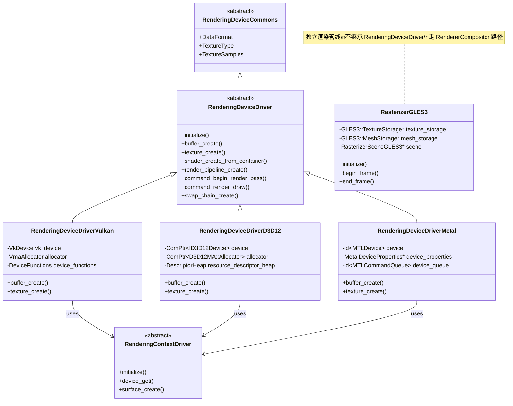

# Godot 图形驱动层 (Graphics Drivers) 深度分析

> **核心结论**：Godot 用一个统一的 `RenderingDeviceDriver` 纯虚接口实现多后端驱动，而 UE 用 `FDynamicRHI` 巨型接口 + 独立模块实现 RHI，前者更轻量后者更全面。

---

## 目录

- [第 1 章：模块概览 — "UE 程序员 30 秒速览"](#第-1-章模块概览--ue-程序员-30-秒速览)
- [第 2 章：架构对比 — "同一个问题，两种解法"](#第-2-章架构对比--同一个问题两种解法)
- [第 3 章：核心实现对比 — "代码层面的差异"](#第-3-章核心实现对比--代码层面的差异)
- [第 4 章：UE → Godot 迁移指南](#第-4-章ue--godot-迁移指南)
- [第 5 章：性能对比](#第-5-章性能对比)
- [第 6 章：总结 — "一句话记住"](#第-6-章总结--一句话记住)

---

## 第 1 章：模块概览 — "UE 程序员 30 秒速览"

### 一句话说明

Godot 的 `drivers/` 目录下的图形驱动层负责将渲染命令翻译为具体的 GPU API 调用（Vulkan/D3D12/Metal/OpenGL），**对应 UE 的 RHI 实现层**（`VulkanRHI`、`D3D12RHI`、`MetalRHI` 模块）。

### 核心类/结构体列表

| # | Godot 类/结构体 | 职责 | UE 对应物 |
|---|----------------|------|----------|
| 1 | `RenderingDeviceDriver` | 图形驱动纯虚基类，定义所有 GPU 操作接口 | `FDynamicRHI` |
| 2 | `RenderingDeviceDriverVulkan` | Vulkan 驱动实现 | `FVulkanDynamicRHI` |
| 3 | `RenderingDeviceDriverD3D12` | D3D12 驱动实现 | `FD3D12DynamicRHI` |
| 4 | `RenderingDeviceDriverMetal` | Metal 驱动实现 | `FMetalDynamicRHI` |
| 5 | `RenderingContextDriverVulkan` | Vulkan 实例/物理设备/Surface 管理 | `FVulkanDevice` + Instance 管理 |
| 6 | `RenderingContextDriverD3D12` | D3D12 Adapter/Factory 管理 | `FD3D12Adapter` |
| 7 | `RasterizerGLES3` | OpenGL ES 3.0 兼容渲染器（完整渲染管线） | 无（UE 已放弃 OpenGL） |
| 8 | `GLES3::MeshStorage` | GLES3 网格/骨骼/MultiMesh 存储管理 | `FRHIVertexBuffer` / `FRHIIndexBuffer` |
| 9 | `VersatileResourceTemplate` | 多类型资源的统一分页分配器模板 | 无直接对应（UE 用独立 `TRefCountPtr`） |
| 10 | `RenderingShaderContainerFormatVulkan` | Vulkan Shader 容器格式（SPIR-V） | `FVulkanShaderFactory` |
| 11 | `RDD::BufferID` / `TextureID` 等 | 轻量级不透明资源句柄（uint64） | `FRHIBuffer*` / `FRHITexture*`（引用计数指针） |
| 12 | `MDCommandBuffer` (Metal) | Metal 命令缓冲区封装 | `FMetalCommandBuffer` |

### Godot vs UE 概念速查表

| 概念 | Godot | UE |
|------|-------|-----|
| **RHI 抽象基类** | `RenderingDeviceDriver` (857 行) | `FDynamicRHI` (1988 行) |
| **Vulkan 驱动** | `RenderingDeviceDriverVulkan` | `FVulkanDynamicRHI` |
| **D3D12 驱动** | `RenderingDeviceDriverD3D12` | `FD3D12DynamicRHI` |
| **Metal 驱动** | `RenderingDeviceDriverMetal` | `FMetalDynamicRHI` |
| **OpenGL 支持** | `RasterizerGLES3`（完整保留） | 已废弃/移除 |
| **资源句柄** | `uint64` 不透明 ID（零开销） | `TRefCountPtr<FRHIResource>`（引用计数） |
| **内存分配** | VMA (Vulkan) / D3D12MA / Metal 原生 | VMA (Vulkan) / D3D12MA / Metal 原生 |
| **Pipeline Cache** | 驱动层内置管理 | `FPipelineStateCache` 独立系统 |
| **Shader 编译** | `RenderingShaderContainer` 预编译容器 | `FShaderCodeLibrary` + 运行时编译 |
| **命令缓冲区** | `CommandBufferID`（轻量句柄） | `FRHICommandList`（重量级命令列表） |
| **同步原语** | `FenceID` / `SemaphoreID` | `FRHIGPUFence` / `FGraphEventRef` |
| **Context/Device 分离** | `RenderingContextDriver` + `RenderingDeviceDriver` | 合并在 `FDynamicRHI` 中 |

---

## 第 2 章：架构对比 — "同一个问题，两种解法"

### 2.1 Godot 的架构设计

Godot 的图形驱动层采用了**双层抽象**设计：

1. **Context 层** (`RenderingContextDriver`)：负责 GPU 实例创建、物理设备枚举、Surface 管理
2. **Device 层** (`RenderingDeviceDriver`)：负责所有 GPU 资源创建和命令录制



**关键设计特点**：
- `RenderingDeviceDriver` 是一个**纯虚接口**，约 857 行，定义了 Buffer、Texture、Shader、Pipeline、RenderPass、CommandBuffer、SwapChain 等所有 GPU 操作
- 资源使用 `uint64` 不透明 ID（如 `BufferID`、`TextureID`），通过宏 `DEFINE_ID` 生成类型安全的包装
- GLES3 走**完全独立的渲染路径**（`RendererCompositor`），不通过 `RenderingDeviceDriver`

### 2.2 UE 的架构设计

UE 的 RHI 层采用**单层巨型接口**设计：

- `FDynamicRHI` 是所有 RHI 实现的基类，包含数百个虚函数（约 1988 行头文件）
- 每个 RHI 实现（`FVulkanDynamicRHI`、`FD3D12DynamicRHI`、`FMetalDynamicRHI`）作为独立模块
- 资源使用**引用计数智能指针**（`TRefCountPtr<FRHIResource>`）
- 通过 `IRHICommandContext` 分离命令录制上下文

```
FDynamicRHI (基类, ~1988行)
├── FVulkanDynamicRHI (VulkanRHI 模块)
├── FD3D12DynamicRHI (D3D12RHI 模块)  
├── FMetalDynamicRHI (MetalRHI 模块)
└── FNullDynamicRHI (空实现)
```

### 2.3 关键架构差异分析

#### 差异 1：Context/Device 分离 vs 单体接口

**Godot** 将图形上下文管理（实例创建、设备枚举、Surface）和设备操作（资源创建、命令录制）分为两个独立的类层次：`RenderingContextDriver` 和 `RenderingDeviceDriver`。这种分离使得：
- Context 可以独立于 Device 进行初始化和管理
- 多个 Device 可以共享同一个 Context（理论上支持多 GPU）
- 代码职责更清晰，每个类的复杂度更低

**UE** 将所有功能合并在 `FDynamicRHI` 中。`FVulkanDynamicRHI` 既管理 `VkInstance` 的创建，也管理所有资源操作。这导致单个类非常庞大（`VulkanDynamicRHI.h` 约 543 行仅声明），但好处是调用路径更直接，不需要跨对象查找。

**源码证据**：
- Godot: `servers/rendering/rendering_device_driver.h` — 纯虚接口
- Godot: `drivers/vulkan/rendering_context_driver_vulkan.h` — Context 独立管理
- UE: `Engine/Source/Runtime/RHI/Public/DynamicRHI.h` — 合并接口
- UE: `Engine/Source/Runtime/VulkanRHI/Public/VulkanDynamicRHI.h` — 实现

#### 差异 2：资源句柄设计 — 零开销 ID vs 引用计数指针

**Godot** 使用 `uint64` 不透明 ID 作为资源句柄。通过 `DEFINE_ID` 宏生成类型安全的 ID 类型（`BufferID`、`TextureID` 等）。这些 ID 通常直接存储原生 API 句柄或内存地址，**零额外开销**：

```cpp
// Godot: servers/rendering/rendering_device_driver.h
struct ID {
    uint64_t id = 0;
};
#define DEFINE_ID(m_name) \
    struct m_name##ID : public ID { ... };
```

**UE** 使用 `TRefCountPtr<FRHIResource>` 引用计数智能指针。每个 RHI 资源都继承自 `FRHIResource`，带有原子引用计数器。这提供了自动生命周期管理，但每次赋值/拷贝都有原子操作开销：

```cpp
// UE: Engine/Source/Runtime/RHI/Public/RHIResources.h
class FRHIResource {
    mutable FThreadSafeCounter NumRefs;
    // ...
};
typedef TRefCountPtr<FRHIBuffer> FBufferRHIRef;
```

**Trade-off**：Godot 的方式更高效但需要手动管理生命周期（驱动层负责 `buffer_free`/`texture_free`）；UE 的方式更安全但有运行时开销。

#### 差异 3：OpenGL 兼容层的存废

**Godot** 保留了完整的 GLES3 渲染路径（`RasterizerGLES3`），作为低端设备的后备方案。这个路径**完全独立于** `RenderingDeviceDriver` 体系，走 `RendererCompositor` 接口：

```cpp
// Godot: drivers/gles3/rasterizer_gles3.h
class RasterizerGLES3 : public RendererCompositor {
    // 完整的渲染管线：Canvas + Scene + Storage
    GLES3::TextureStorage *texture_storage;
    GLES3::MeshStorage *mesh_storage;
    RasterizerSceneGLES3 *scene;
};
```

**UE** 在 UE4 后期已经**完全放弃了 OpenGL**（除了 ES 3.1 在部分移动平台的残留支持），全面转向 Vulkan/D3D12/Metal。这意味着 UE 不需要维护两套完全不同的渲染架构。

**Trade-off**：Godot 保留 GLES3 使其能在 WebGL、老旧移动设备和低端 PC 上运行，但代价是维护两套完全不同的渲染管线（`RenderingDevice` 路径 vs `RendererCompositor` 路径），增加了代码复杂度。UE 放弃 OpenGL 后可以专注于现代 API 的优化，但失去了对低端硬件的支持。

---

## 第 3 章：核心实现对比 — "代码层面的差异"

### 3.1 Vulkan 驱动 vs VulkanRHI：封装粒度和抽象层级

#### Godot 的实现

Godot 的 `RenderingDeviceDriverVulkan`（`drivers/vulkan/rendering_device_driver_vulkan.h`，744 行）是一个相对精简的 Vulkan 封装。其核心设计原则在文件头部明确说明：

```cpp
// Design principles:
// - Vulkan structs are zero-initialized and fields not requiring 
//   a non-zero value are omitted
// - Very little validation is done, and normally only in dev or debug builds
// - We allocate as little as possible in functions expected to be quick
// - We try to back opaque ids with the native ones or memory addresses
```

**内存管理**：使用 VMA（Vulkan Memory Allocator）进行内存分配，并针对小分配有专门的池化策略：

```cpp
// drivers/vulkan/rendering_device_driver_vulkan.h
VmaAllocator allocator = nullptr;
HashMap<uint32_t, VmaPool> small_allocs_pools;
VmaPool _find_or_create_small_allocs_pool(uint32_t p_mem_type_index);
```

**资源管理**：使用 `PagedAllocator` + `VersatileResourceTemplate` 进行统一的资源分配，避免频繁的堆分配：

```cpp
using VersatileResource = VersatileResourceTemplate<
    BufferInfo, TextureInfo, VertexFormatInfo, 
    ShaderInfo, UniformSetInfo, RenderPassInfo, CommandBufferInfo>;
PagedAllocator<VersatileResource, true> resources_allocator;
```

**Descriptor Set 管理**：采用按类型分池的策略，每种 descriptor set 布局对应一组池，每个池最多 64 个 set：

```cpp
struct DescriptorSetPoolKey {
    uint16_t uniform_type[UNIFORM_TYPE_MAX] = {};
};
using DescriptorSetPools = RBMap<DescriptorSetPoolKey, 
    HashMap<VkDescriptorPool, uint32_t>>;
```

#### UE 的实现

UE 的 `FVulkanDynamicRHI`（`Engine/Source/Runtime/VulkanRHI/Public/VulkanDynamicRHI.h`，543 行）是一个更重量级的封装。它直接暴露了大量 RHI 级别的 API，包括：

- 每种资源类型（Texture2D、Texture3D、TextureCube、TextureArray）都有独立的创建函数
- 渲染线程和游戏线程的 API 都有对应版本（`_RenderThread` 后缀）
- 包含 Viewport 管理、Pipeline Cache 管理等高层功能

```cpp
// UE: VulkanDynamicRHI.h
virtual FTexture2DRHIRef RHICreateTexture2D(...) final override;
virtual FTexture2DArrayRHIRef RHICreateTexture2DArray(...) final override;
virtual FTexture3DRHIRef RHICreateTexture3D(...) final override;
virtual FTextureCubeRHIRef RHICreateTextureCube(...) final override;
// 每种纹理类型都有独立的创建函数
```

#### 差异点评

| 维度 | Godot | UE |
|------|-------|-----|
| 接口粒度 | 统一的 `texture_create()` 处理所有纹理类型 | 每种纹理类型独立函数 |
| 资源封装 | `BufferInfo`/`TextureInfo` 内部结构体 | `FVulkanTexture2D` 等独立类 |
| 内存分配 | VMA + 小分配池化 | VMA + LRU 缓存 |
| Descriptor 管理 | 按类型分池 + 线性池 | 独立 Descriptor Pool 管理器 |
| 代码量 | ~744 行（头文件） | ~543 行（头文件）+ 大量 Private 头文件 |

**Godot 的优势**：接口更统一，一个 `texture_create` 处理所有纹理类型，减少了 API 表面积。`VersatileResourceTemplate` 的分页分配器设计非常巧妙，通过编译期计算最大资源大小来实现零碎片的内存池。

**UE 的优势**：更细粒度的 API 允许针对每种资源类型进行特定优化。渲染线程版本的 API 可以避免不必要的线程同步。

### 3.2 GLES3 兼容层：Godot 保留 OpenGL 的策略 vs UE 放弃 OpenGL

#### Godot 的 GLES3 实现

Godot 的 GLES3 后端是一个**完全独立的渲染管线**，不通过 `RenderingDeviceDriver` 接口。它继承自 `RendererCompositor`，拥有自己的：

- **存储系统**：`GLES3::TextureStorage`、`GLES3::MeshStorage`、`GLES3::MaterialStorage`
- **渲染器**：`RasterizerCanvasGLES3`（2D）、`RasterizerSceneGLES3`（3D）
- **效果系统**：`CopyEffects`、`CubemapFilter`、`Glow`、`PostEffects`

```cpp
// drivers/gles3/rasterizer_gles3.h
class RasterizerGLES3 : public RendererCompositor {
    GLES3::Config *config;
    GLES3::TextureStorage *texture_storage;
    GLES3::MeshStorage *mesh_storage;
    GLES3::LightStorage *light_storage;
    RasterizerCanvasGLES3 *canvas;
    RasterizerSceneGLES3 *scene;
};
```

GLES3 的 `MeshStorage`（`drivers/gles3/storage/mesh_storage.h`，650 行）展示了 OpenGL 风格的资源管理：

```cpp
// drivers/gles3/storage/mesh_storage.h
struct Mesh::Surface {
    GLuint vertex_buffer = 0;      // OpenGL Buffer Object
    GLuint attribute_buffer = 0;
    GLuint skin_buffer = 0;
    GLuint index_buffer = 0;
    // VAO 缓存机制
    struct Version {
        uint32_t input_mask = 0;
        GLuint vertex_array = 0;   // Vertex Array Object
    };
    Version *versions = nullptr;
};
```

值得注意的是 GLES3 的 VAO 缓存策略：按 `input_mask` 缓存 Vertex Array Object，避免每帧重建：

```cpp
// 线性搜索 VAO 缓存（通常只有 3-4 个版本）
for (uint32_t i = 0; i < s->version_count; i++) {
    if (s->versions[i].input_mask != p_input_mask) continue;
    r_vertex_array_gl = s->versions[i].vertex_array;
    return;
}
// 未命中则创建新版本
```

#### UE 的策略

UE 在 UE4 后期已经完全放弃了 OpenGL 后端。`Engine/Source/Runtime/` 下没有 OpenGL RHI 模块。UE 的最低图形 API 要求是：
- Windows: D3D11 / D3D12 / Vulkan
- Android: Vulkan（ES 3.1 仅残留支持）
- iOS/macOS: Metal
- Linux: Vulkan

#### 差异点评

Godot 保留 GLES3 的**核心原因**是其目标平台覆盖范围更广：
1. **WebGL**：浏览器环境只支持 WebGL 2.0（基于 GLES3）
2. **低端移动设备**：许多 Android 设备不支持 Vulkan
3. **老旧 PC**：部分集成显卡不支持 Vulkan

代价是 Godot 需要维护**两套完全不同的渲染架构**：
- `RenderingDevice` 路径（Vulkan/D3D12/Metal）→ Forward+ / Mobile 渲染器
- `RendererCompositor` 路径（GLES3）→ Compatibility 渲染器

这意味着新的渲染特性需要在两个路径中分别实现，或者只在 `RenderingDevice` 路径中实现（GLES3 路径功能受限）。

### 3.3 Metal 驱动 vs MetalRHI：Apple 平台图形支持对比

#### Godot 的 Metal 实现

Godot 的 `RenderingDeviceDriverMetal`（`drivers/metal/rendering_device_driver_metal.h`，525 行）使用 Objective-C++ 直接与 Metal API 交互：

```objc
// drivers/metal/rendering_device_driver_metal.h
class RenderingDeviceDriverMetal : public RenderingDeviceDriver {
    id<MTLDevice> device = nil;
    id<MTLCommandQueue> device_queue = nil;
    id<MTLBinaryArchive> archive = nil;
    MetalDeviceProperties *device_properties = nullptr;
    MetalDeviceProfile device_profile;
    PixelFormats *pixel_formats = nullptr;
    std::unique_ptr<MDResourceCache> resource_cache;
};
```

**独特设计**：
1. **Shader Cache**：使用 SHA256 哈希的 Metal 源码作为 key，缓存编译后的 shader：
   ```cpp
   HashMap<SHA256Digest, ShaderCacheEntry *> _shader_cache;
   ```

2. **Fence 实现**：提供两种 Fence 策略——`FenceEvent`（基于 `MTLSharedEvent`）和 `FenceSemaphore`（基于 `dispatch_semaphore_t`）：
   ```cpp
   struct FenceEvent : public Fence {
       id<MTLSharedEvent> event;
       uint64_t value;
   };
   struct FenceSemaphore : public Fence {
       dispatch_semaphore_t semaphore;
   };
   ```

3. **设备能力探测**：通过 `MetalDeviceProfile` 和 `MetalDeviceProperties` 精确匹配不同 Apple 芯片的能力。

#### UE 的 MetalRHI

UE 的 `FMetalDynamicRHI`（`Engine/Source/Runtime/Apple/MetalRHI/Private/MetalDynamicRHI.h`）同样使用 Objective-C++，但规模更大，包含：
- 完整的 Viewport 管理
- 渲染线程和游戏线程的双版本 API
- On-chip memory 优化（Tile-based 架构特有）
- Pipeline State Object 缓存

#### 差异点评

| 维度 | Godot Metal | UE MetalRHI |
|------|-------------|-------------|
| Shader 缓存 | SHA256 哈希 + 弱引用 | Binary Archive + Library Cache |
| Fence 策略 | 双策略（Event/Semaphore） | 统一 Event 策略 |
| 设备适配 | DeviceProfile 精确匹配 | Feature Level 粗粒度匹配 |
| Tile Memory | 不特殊处理 | On-chip memory 优化 |

### 3.4 RenderingDeviceDriver 接口 vs FDynamicRHI 接口：驱动抽象设计对比

#### Godot 的接口设计

`RenderingDeviceDriver`（`servers/rendering/rendering_device_driver.h`）的设计原则在文件头部有详细说明：

```cpp
// Design principles:
// - Very little validation is done
// - Error reporting is generally simple: returning an id of 0 or false
// - Certain enums/constants follow Vulkan values/layout
// - We allocate as little as possible and use alloca() whenever suitable
// - We try to back opaque ids with native ones or memory addresses
// - Using VectorView to take array-like arguments
```

接口特点：
1. **Vulkan 风格的枚举**：`PipelineStageBits`、`BarrierAccessBits` 等直接映射 Vulkan 枚举值
2. **统一的资源创建**：一个 `texture_create` 处理所有纹理类型
3. **显式的 Barrier API**：`command_pipeline_barrier` 直接暴露管线屏障
4. **Subpass 支持**：`render_pass_create` 支持多 Subpass 定义

```cpp
// Godot 的 Barrier 接口 - 直接暴露 Vulkan 风格的管线屏障
virtual void command_pipeline_barrier(
    CommandBufferID p_cmd_buffer,
    BitField<PipelineStageBits> p_src_stages,
    BitField<PipelineStageBits> p_dst_stages,
    VectorView<MemoryAccessBarrier> p_memory_barriers,
    VectorView<BufferBarrier> p_buffer_barriers,
    VectorView<TextureBarrier> p_texture_barriers) = 0;
```

#### UE 的接口设计

`FDynamicRHI`（`Engine/Source/Runtime/RHI/Public/DynamicRHI.h`）的设计更偏向高层抽象：

1. **资源类型细分**：每种纹理类型（2D、3D、Cube、Array）有独立创建函数
2. **隐式的状态管理**：通过 `ERHIAccess` 枚举管理资源状态，Transition 由 RHI 层自动处理
3. **渲染线程安全**：大量 `_RenderThread` 后缀的函数用于渲染线程直接调用
4. **Lock/Unlock 模式**：资源数据访问使用 Lock/Unlock 模式而非 Map/Unmap

```cpp
// UE 的 Transition 接口 - 更高层的抽象
virtual void RHICreateTransition(
    FRHITransition* Transition, 
    ERHIPipeline SrcPipelines, 
    ERHIPipeline DstPipelines,
    ERHICreateTransitionFlags CreateFlags, 
    TArrayView<const FRHITransitionInfo> Infos) final override;
```

#### 差异点评

| 维度 | Godot `RenderingDeviceDriver` | UE `FDynamicRHI` |
|------|-------------------------------|-------------------|
| 接口风格 | Vulkan-centric（偏底层） | 高层抽象（隐藏 API 差异） |
| 函数数量 | ~80 个纯虚函数 | ~200+ 个虚函数 |
| 资源状态 | 显式 Barrier（调用者负责） | 隐式 Transition（RHI 层管理） |
| 线程模型 | 单线程录制 | 多线程 + 渲染线程版本 |
| 错误处理 | 返回空 ID 或 false | 异常 + 断言 |
| 数据传递 | `VectorView`（零拷贝） | `TArrayView` / `TArray`（可能拷贝） |

**Godot 的 Trade-off**：Vulkan-centric 的设计使得 Vulkan 后端几乎是零开销的直通调用，但 D3D12 和 Metal 后端需要做更多的翻译工作。例如，D3D12 没有原生的 Subpass 概念，需要在驱动层模拟。

**UE 的 Trade-off**：高层抽象使得所有后端的实现复杂度更均匀，但 Vulkan 后端可能无法充分利用某些底层特性。大量的虚函数调用也带来了一定的间接调用开销。

---

## 第 4 章：UE → Godot 迁移指南

### 4.1 思维转换清单

1. **忘掉 `FDynamicRHI` 的巨型接口，学习 `RenderingDeviceDriver` 的精简设计**
   - UE 的 RHI 接口有 200+ 个函数，Godot 只有约 80 个。Godot 通过统一的资源创建函数（如一个 `texture_create` 处理所有纹理类型）大幅减少了 API 表面积。

2. **忘掉引用计数资源管理，学习手动生命周期管理**
   - UE 中 `FBufferRHIRef` 等智能指针自动管理资源生命周期。Godot 中你必须显式调用 `buffer_free()`、`texture_free()` 等函数。`RenderingDevice`（更高层）负责跟踪资源生命周期。

3. **忘掉隐式 Transition，学习显式 Barrier**
   - UE 的 `RHICreateTransition` 提供了高层的资源状态管理。Godot 直接暴露 Vulkan 风格的 `command_pipeline_barrier`，你需要手动管理资源的布局转换。

4. **忘掉渲染线程 API，学习单线程命令录制**
   - UE 有大量 `_RenderThread` 后缀的 API 用于渲染线程直接调用。Godot 的驱动层 API 是单线程的，命令录制在主线程完成。

5. **忘掉 OpenGL 已死，学习 GLES3 兼容路径**
   - 如果你的项目需要支持 WebGL 或低端设备，需要了解 Godot 的 `RasterizerGLES3` 路径。这是一个完全独立的渲染管线，与 `RenderingDevice` 路径无关。

6. **忘掉 Feature Level 分级，学习 Capabilities 查询**
   - UE 使用 `ERHIFeatureLevel`（ES3_1、SM5、SM6）进行粗粒度的功能分级。Godot 使用细粒度的 `Capabilities` 查询（`has_feature`、`limit_get`、`api_trait_get`）来检测具体功能支持。

### 4.2 API 映射表

| UE API | Godot 等价 API | 说明 |
|--------|---------------|------|
| `FDynamicRHI::RHICreateVertexBuffer()` | `RDD::buffer_create(BUFFER_USAGE_VERTEX_BIT)` | Godot 统一 Buffer 创建 |
| `FDynamicRHI::RHICreateIndexBuffer()` | `RDD::buffer_create(BUFFER_USAGE_INDEX_BIT)` | 同上，通过 usage flag 区分 |
| `FDynamicRHI::RHICreateTexture2D()` | `RDD::texture_create()` | 统一纹理创建 |
| `FDynamicRHI::RHICreateSamplerState()` | `RDD::sampler_create()` | 采样器创建 |
| `FDynamicRHI::RHICreateGraphicsPipelineState()` | `RDD::render_pipeline_create()` | 渲染管线创建 |
| `FDynamicRHI::RHICreateComputeShader()` | `RDD::shader_create_from_container()` | Shader 从预编译容器创建 |
| `FDynamicRHI::RHICreateUniformBuffer()` | `RDD::buffer_create(BUFFER_USAGE_UNIFORM_BIT)` | 统一 Buffer |
| `FRHICommandList::DrawPrimitive()` | `RDD::command_render_draw()` | 绘制命令 |
| `FRHICommandList::DrawIndexedPrimitive()` | `RDD::command_render_draw_indexed()` | 索引绘制 |
| `FRHICommandList::SetViewport()` | `RDD::command_render_set_viewport()` | 设置视口 |
| `FRHICommandList::SetScissorRect()` | `RDD::command_render_set_scissor()` | 设置裁剪矩形 |
| `FDynamicRHI::RHICreateViewport()` | `RDD::swap_chain_create()` | 交换链/视口创建 |
| `FDynamicRHI::RHICreateRenderQuery()` | `RDD::timestamp_query_pool_create()` | 查询池创建 |
| `FRHICommandList::Transition()` | `RDD::command_pipeline_barrier()` | 资源状态转换 |
| `LockVertexBuffer_BottomOfPipe()` | `RDD::buffer_map()` | Buffer 映射 |
| `UnlockVertexBuffer_BottomOfPipe()` | `RDD::buffer_unmap()` | Buffer 取消映射 |

### 4.3 陷阱与误区

#### 陷阱 1：不要假设 GLES3 路径和 RenderingDevice 路径共享代码

UE 程序员可能会假设所有渲染后端共享同一套资源管理代码。在 Godot 中，GLES3 路径（`RasterizerGLES3`）和 RenderingDevice 路径（`RenderingDeviceDriverVulkan` 等）是**完全独立的**。GLES3 有自己的 `MeshStorage`、`TextureStorage`、`MaterialStorage`，与 `RenderingDevice` 的资源系统没有任何关系。

如果你在 `RenderingDeviceDriver` 层面做了修改，GLES3 路径不会受到任何影响，反之亦然。

#### 陷阱 2：Godot 的 Barrier 是 Vulkan 语义的

UE 的 `RHICreateTransition` 使用了抽象的 `ERHIAccess` 枚举，RHI 层会自动翻译为对应 API 的状态转换。Godot 的 `command_pipeline_barrier` 直接使用 Vulkan 风格的 `PipelineStageBits` 和 `BarrierAccessBits`。

这意味着在 D3D12 后端中，Godot 需要将 Vulkan 风格的 Barrier 翻译为 D3D12 的 Resource Barrier，这个翻译过程在 `RenderingDeviceDriverD3D12::_resource_transition_batch` 中完成。如果你习惯了 UE 的抽象 Transition API，需要注意 Godot 的 Barrier 语义更接近 Vulkan 原生。

#### 陷阱 3：Descriptor Set 管理差异

UE 使用 Root Signature（D3D12）或 Descriptor Set Layout（Vulkan）来管理着色器资源绑定，并且有复杂的 Descriptor Heap 管理。Godot 的 `uniform_set_create` 接口更简单，但内部实现差异很大：

- **Vulkan 后端**：使用按类型分池的 `DescriptorSetPools`，支持线性池优化
- **D3D12 后端**：使用 `DescriptorHeap` + `CPUDescriptorHeapPool`，需要手动管理 GPU 可见堆
- **Metal 后端**：使用 Argument Buffer 机制

### 4.4 最佳实践

1. **优先使用 `RenderingDevice` 而非直接操作 Driver**
   - `RenderingDevice`（`servers/rendering/rendering_device.h`）是 Driver 之上的高层封装，提供了资源生命周期管理、自动 Barrier 插入等功能。除非你在开发新的图形后端，否则不需要直接操作 `RenderingDeviceDriver`。

2. **利用 `VersatileResourceTemplate` 进行资源分配**
   - 如果你需要在驱动层添加新的资源类型，使用 `VersatileResourceTemplate` 可以避免频繁的堆分配。只需将新类型添加到模板参数列表中。

3. **理解 `ApiTrait` 系统**
   - Godot 使用 `api_trait_get()` 来查询不同后端的行为差异（如 `API_TRAIT_HONORS_PIPELINE_BARRIERS`、`API_TRAIT_BUFFERS_REQUIRE_TRANSITIONS`）。在编写跨后端代码时，使用这些 trait 来适配不同 API 的行为。

4. **Shader 使用预编译容器**
   - Godot 使用 `RenderingShaderContainer` 作为 Shader 的预编译容器格式。不同后端有各自的容器格式（`RenderingShaderContainerFormatVulkan`、`RenderingShaderContainerFormatD3D12`、`RenderingShaderContainerFormatMetal`）。不要尝试在运行时编译 Shader。

---

## 第 5 章：性能对比

### 5.1 Godot 图形驱动层的性能特征

#### 优势

1. **零开销资源句柄**：`uint64` ID 直接存储原生句柄或内存地址，没有引用计数的原子操作开销。在高频资源绑定场景（如每帧绑定数千个 Uniform Set）中，这比 UE 的 `TRefCountPtr` 更高效。

2. **分页分配器**：`PagedAllocator<VersatileResource>` 避免了频繁的堆分配/释放。所有驱动层资源（Buffer、Texture、Shader 等）共享同一个分配器，内存碎片更少。

3. **`VectorView` 零拷贝参数传递**：驱动层 API 使用 `VectorView` 传递数组参数，避免了 `std::vector` 或 `TArray` 的拷贝开销。

4. **`alloca()` 栈分配**：在快速路径中使用 `alloca()` 进行临时分配，避免堆分配：
   ```cpp
   #define ALLOCA_ARRAY(m_type, m_count) ((m_type *)alloca(sizeof(m_type) * (m_count)))
   ```

#### 瓶颈

1. **单线程命令录制**：Godot 的命令录制是单线程的，不像 UE 支持多线程并行录制。在 Draw Call 密集的场景中，这可能成为 CPU 瓶颈。

2. **Vulkan-centric 的 Barrier 翻译**：D3D12 后端需要将 Vulkan 风格的 Barrier 翻译为 D3D12 Resource Barrier，这个翻译过程有一定开销。`RenderingDeviceDriverD3D12` 中的 `_resource_transition_batch` 和 `_resource_transitions_flush` 需要维护每个子资源的状态跟踪。

3. **GLES3 路径的性能限制**：GLES3 后端受限于 OpenGL 的状态机模型，无法利用现代 API 的并行特性。VAO 缓存虽然减少了状态切换，但仍然是线性搜索。

4. **Descriptor Set 池碎片**：Vulkan 后端的 Descriptor Set 按类型分池策略虽然减少了碎片，但在 Uniform 类型组合多样的场景中，可能创建大量小池。

### 5.2 与 UE 的性能差异

| 维度 | Godot | UE | 分析 |
|------|-------|-----|------|
| 资源创建开销 | 更低（分页分配 + 零开销 ID） | 更高（引用计数 + 独立堆分配） | Godot 在资源密集场景中更快 |
| 命令录制吞吐 | 更低（单线程） | 更高（多线程并行录制） | UE 在 Draw Call 密集场景中优势明显 |
| Barrier/Transition | Vulkan 后端零开销，D3D12 有翻译开销 | 统一抽象，各后端均匀 | 取决于目标 API |
| Shader 编译 | 预编译容器，运行时零编译 | 运行时编译 + PSO 缓存 | Godot 首次加载更快 |
| 内存使用 | 更低（精简数据结构） | 更高（丰富的元数据） | Godot 在内存受限平台更友好 |
| GPU 利用率 | 取决于渲染器实现 | 更高（更成熟的渲染管线） | UE 的渲染管线更优化 |

### 5.3 性能敏感场景建议

1. **高 Draw Call 场景**：Godot 的单线程命令录制是主要瓶颈。建议使用 MultiMesh、GPUParticles 等批处理技术减少 Draw Call 数量。

2. **频繁资源创建/销毁**：Godot 的分页分配器在这方面表现优秀。但要注意 Descriptor Set 池的碎片问题，尽量复用 Uniform Set。

3. **跨平台部署**：如果目标平台包含低端设备，GLES3 路径是必要的但性能有限。建议为不同平台选择合适的渲染器（Forward+/Mobile/Compatibility）。

4. **Shader 加载**：Godot 的预编译 Shader 容器避免了运行时编译的卡顿，但首次导入时的编译时间较长。建议在开发阶段预热 Shader 缓存。

---

## 第 6 章：总结 — "一句话记住"

### 核心差异

**Godot 用 ~80 个纯虚函数的精简接口 + Vulkan-centric 设计实现多后端驱动；UE 用 ~200+ 个虚函数的巨型接口 + 高层抽象实现 RHI，前者更轻量高效，后者更全面成熟。**

### 设计亮点（Godot 做得比 UE 好的地方）

1. **`VersatileResourceTemplate` 分页分配器**：通过编译期计算最大资源大小，实现了零碎片的统一资源池。这比 UE 为每种资源类型独立分配更高效。

2. **零开销资源句柄**：`uint64` ID 直接映射原生句柄，没有引用计数开销。在资源密集的渲染循环中，这个优势非常显著。

3. **Context/Device 分离**：清晰的职责划分使得代码更易理解和维护。Context 管理实例/设备/Surface，Device 管理资源/命令。

4. **保留 GLES3 兼容层**：虽然增加了维护成本，但使 Godot 能在 WebGL 和低端设备上运行，覆盖了 UE 无法触及的平台。

5. **预编译 Shader 容器**：避免了运行时 Shader 编译的卡顿问题，用户体验更流畅。

### 设计短板（Godot 不如 UE 的地方）

1. **单线程命令录制**：UE 支持多线程并行录制命令，在 Draw Call 密集场景中性能优势明显。Godot 的单线程模型在复杂场景中可能成为瓶颈。

2. **Vulkan-centric 的接口设计**：虽然对 Vulkan 后端友好，但 D3D12 和 Metal 后端需要额外的翻译层。UE 的高层抽象对所有后端更公平。

3. **缺少高级渲染特性的驱动支持**：UE 的 RHI 层支持 Ray Tracing、Mesh Shader、Variable Rate Shading 等高级特性。Godot 的驱动层对这些特性的支持还在逐步完善中。

4. **两套渲染架构的维护成本**：`RenderingDevice` 路径和 `RendererCompositor` 路径完全独立，新特性需要双重实现或只在一个路径中可用。

5. **缺少渲染线程**：UE 有独立的渲染线程，可以与游戏线程并行工作。Godot 的渲染命令在主线程录制，限制了 CPU 利用率。

### UE 程序员的学习路径建议

**推荐阅读顺序**：

1. **`servers/rendering/rendering_device_driver.h`**（857 行）— 先理解接口定义，这是所有驱动的契约
2. **`drivers/vulkan/rendering_device_driver_vulkan.h`**（744 行）— 最完整的实现，Vulkan 程序员会感到亲切
3. **`drivers/d3d12/rendering_device_driver_d3d12.h`**（943 行）— 看 D3D12 如何适配 Vulkan-centric 接口
4. **`drivers/metal/rendering_device_driver_metal.h`**（525 行）— Metal 的独特设计（Shader Cache、双 Fence 策略）
5. **`drivers/gles3/rasterizer_gles3.h`**（143 行）— 了解独立的 GLES3 渲染路径

**关键对比阅读**：
- Godot `RenderingDeviceDriver::buffer_create()` vs UE `FDynamicRHI::RHICreateVertexBuffer()`
- Godot `command_pipeline_barrier()` vs UE `RHICreateTransition()`
- Godot `VersatileResourceTemplate` vs UE `FRHIResource` 引用计数体系
- Godot `RasterizerGLES3` vs UE 无对应（理解 Godot 的平台覆盖策略）
