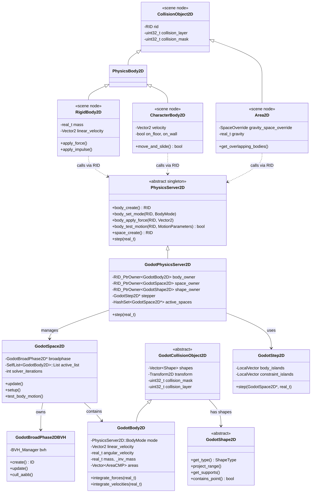

# Godot 2D 物理引擎深度分析：PhysicsServer2D 架构 vs UE Chaos/PhysX

> **核心结论**：Godot 用"服务器单例 + RID 句柄"将 2D 物理完全解耦于场景树，UE 则将物理深度嵌入组件体系——前者轻量可替换，后者功能强大但耦合度高。

---

## 目录

- [第 1 章：模块概览 — "UE 程序员 30 秒速览"](#第-1-章模块概览--ue-程序员-30-秒速览)
- [第 2 章：架构对比 — "同一个问题，两种解法"](#第-2-章架构对比--同一个问题两种解法)
- [第 3 章：核心实现对比 — "代码层面的差异"](#第-3-章核心实现对比--代码层面的差异)
- [第 4 章：UE → Godot 迁移指南](#第-4-章ue--godot-迁移指南)
- [第 5 章：性能对比](#第-5-章性能对比)
- [第 6 章：总结 — "一句话记住"](#第-6-章总结--一句话记住)

---

## 第 1 章：模块概览 — "UE 程序员 30 秒速览"

### 一句话说明

Godot 的 2D 物理模块提供了一个**完整的自研 2D 刚体物理引擎**（GodotPhysics2D），通过 `PhysicsServer2D` 抽象接口与场景层解耦。这相当于 UE 中 Chaos/PhysX 物理子系统的 2D 简化版，但 Godot 将其作为**一等公民**独立实现，而非 3D 物理的投影。

### 核心类/结构体列表

| # | Godot 类 | 职责 | UE 对应物 |
|---|---------|------|----------|
| 1 | `PhysicsServer2D` | 物理服务器抽象接口（单例） | `FPhysInterface` / `FPhysScene` |
| 2 | `GodotPhysicsServer2D` | 默认物理服务器实现 | Chaos 物理场景实现 |
| 3 | `GodotSpace2D` | 物理空间（世界） | `FPhysScene` / `UWorld` 物理子系统 |
| 4 | `GodotBody2D` | 内部刚体表示 | `FBodyInstance` |
| 5 | `GodotShape2D` | 碰撞形状基类 | `FPhysicsShapeHandle` / `UBodySetup` |
| 6 | `GodotCollisionObject2D` | 碰撞对象基类 | `UPrimitiveComponent`（碰撞部分） |
| 7 | `GodotBroadPhase2DBVH` | BVH 宽相检测 | Chaos BVH / PhysX Broadphase |
| 8 | `GodotCollisionSolver2D` | 窄相碰撞求解器 | Chaos NarrowPhase / GJK-EPA |
| 9 | `GodotStep2D` | 物理步进管线 | `FPhysicsSolverBase::Advance()` |
| 10 | `GodotConstraint2D` / `GodotJoint2D` | 约束/关节基类 | `FConstraintInstance` / `UPhysicsConstraintComponent` |
| 11 | `RigidBody2D`（场景节点） | 刚体节点 | `UStaticMeshComponent` + Simulate Physics |
| 12 | `CharacterBody2D`（场景节点） | 角色物理控制器 | `ACharacter` + `UCharacterMovementComponent` |
| 13 | `Area2D`（场景节点） | 触发/重力区域 | `ATriggerVolume` / `UBoxComponent`（Overlap） |
| 14 | `CollisionShape2D`（场景节点） | 碰撞形状节点 | `UShapeComponent`（`USphereComponent` 等） |
| 15 | `PhysicsDirectBodyState2D` | 直接物理状态访问 | `FBodyInstance::GetPhysicsActorHandle()` |
| 16 | `PhysicsDirectSpaceState2D` | 空间查询接口 | `UWorld::LineTraceSingleByChannel()` 系列 |

### Godot vs UE 概念速查表

| 概念 | Godot 2D | UE |
|------|---------|-----|
| 物理世界 | `GodotSpace2D`（通过 RID 引用） | `FPhysScene`（每个 `UWorld` 一个） |
| 物理服务器 | `PhysicsServer2D::get_singleton()` | 无统一单例，分散在 `FPhysInterface` / `FPhysScene` |
| 刚体 | `RigidBody2D` 节点 → 内部 `GodotBody2D` | `UPrimitiveComponent` + `FBodyInstance` |
| 角色控制器 | `CharacterBody2D`（Kinematic Body + `move_and_slide`） | `ACharacter` + `UCharacterMovementComponent` |
| 触发区域 | `Area2D` 节点 | `ATriggerVolume` / `UShapeComponent`（设为 Overlap） |
| 碰撞形状 | `CollisionShape2D` 子节点 + `Shape2D` 资源 | `UShapeComponent`（直接作为组件） |
| 碰撞层/掩码 | `collision_layer` / `collision_mask`（32 位） | `ECollisionChannel` + `FCollisionResponseContainer` |
| 射线检测 | `PhysicsDirectSpaceState2D::intersect_ray()` | `UWorld::LineTraceSingleByChannel()` |
| 物理材质 | `PhysicsMaterial` 资源 | `UPhysicalMaterial` |
| 关节/约束 | `PinJoint2D` / `DampedSpringJoint2D` / `GrooveJoint2D` | `UPhysicsConstraintComponent` |
| 连续碰撞检测 | `CCDMode`（Ray / Shape） | `bUseCCD` on `FBodyInstance` |
| 物理步进 | `GodotStep2D::step()` — 单线程 + 约束并行 | Chaos `FPBDRigidsSolver::AdvanceOneTimeStep()` — 全并行 |
| 自定义力积分 | `_integrate_forces()` 虚函数回调 | `FCalculateCustomPhysics` 委托 |
| 对象标识 | `RID`（Resource ID，轻量句柄） | `UObject*` 指针 + `FBodyInstance` |

---

## 第 2 章：架构对比 — "同一个问题，两种解法"

### 2.1 Godot 2D 物理架构

Godot 的 2D 物理系统采用经典的**服务器-客户端**架构，分为三层：

1. **场景层**（Scene Layer）：`RigidBody2D`、`CharacterBody2D`、`Area2D` 等节点，面向用户
2. **服务器接口层**（Server Interface）：`PhysicsServer2D` 抽象类，定义所有物理操作的纯虚接口
3. **实现层**（Implementation）：`GodotPhysicsServer2D` + `GodotSpace2D` + `GodotBody2D` 等，实际物理模拟



### 2.2 UE 物理架构（简要）

UE 的物理系统采用**组件嵌入式**架构：

- `UPrimitiveComponent` 是所有可碰撞组件的基类，内含 `FBodyInstance`
- `FBodyInstance` 持有对底层物理引擎（Chaos/PhysX）的 Actor Handle
- `FPhysScene` 管理整个物理场景，由 `UWorld` 持有
- 角色物理通过 `UCharacterMovementComponent`（约 5000+ 行）实现，是一个极其复杂的组件
- 碰撞检测通过 `ECollisionChannel` 枚举 + `FCollisionResponseContainer` 矩阵管理

### 2.3 关键架构差异分析

#### 差异一：服务器单例 vs 组件嵌入 — 设计哲学的根本分歧

Godot 的 `PhysicsServer2D` 是一个**全局单例抽象接口**，所有物理操作都通过 RID（Resource ID）句柄间接进行。场景节点（如 `RigidBody2D`）只是"前端包装"，它们在 `_notification(NOTIFICATION_ENTER_TREE)` 时向服务器注册，获得一个 RID，之后所有物理操作都通过 `PhysicsServer2D::get_singleton()->body_xxx(rid, ...)` 进行。

```cpp
// Godot: 场景节点通过 RID 与物理服务器交互
// 源码: scene/2d/physics/collision_object_2d.h
class CollisionObject2D : public Node2D {
    RID rid;  // 物理服务器中的句柄
    // 所有物理操作都通过 PhysicsServer2D::get_singleton() + rid 进行
};
```

UE 则将物理**深度嵌入组件体系**。`UPrimitiveComponent` 直接持有 `FBodyInstance`，`FBodyInstance` 又直接持有底层物理引擎的 Actor Handle。没有中间的抽象服务器层。

```cpp
// UE: 组件直接持有物理实例
// 源码: Engine/Source/Runtime/Engine/Classes/PhysicsEngine/BodyInstance.h
struct FBodyInstance {
    FPhysicsActorHandle ActorHandle;  // 直接持有底层物理引擎句柄
    // 物理操作直接在 FBodyInstance 上调用
};
```

**Trade-off 分析**：Godot 的服务器模式使得物理引擎可以**热替换**（通过 `PhysicsServer2DManager::register_server()`），且物理线程与场景线程天然隔离。但 RID 间接访问带来了额外的查找开销（`RID_PtrOwner` 的哈希查找）。UE 的直接嵌入方式性能更高（指针直达），但物理引擎与组件系统深度耦合，替换物理后端需要大量适配工作。

#### 差异二：节点组合 vs 组件聚合 — 碰撞形状的挂载方式

Godot 中碰撞形状是**独立的子节点**。一个 `RigidBody2D` 需要添加 `CollisionShape2D` 子节点来定义碰撞体积，`CollisionShape2D` 又引用一个 `Shape2D` 资源。这是 Godot 节点树哲学的体现——一切皆节点。

```
# Godot 场景树结构
RigidBody2D
├── CollisionShape2D (shape = CircleShape2D)
├── CollisionShape2D (shape = RectangleShape2D)  # 可以有多个
└── Sprite2D
```

UE 中碰撞形状是**组件**（`USphereComponent`、`UBoxComponent` 等），直接附加到 Actor 上。或者更常见的是，碰撞形状由 `UStaticMesh` 的 `UBodySetup` 自动生成。

```
// UE Actor 结构
AMyActor
├── UStaticMeshComponent (Root, 自带碰撞)
├── USphereComponent (额外碰撞体积)
└── UBoxComponent (触发区域)
```

**Trade-off 分析**：Godot 的节点方式更加**可视化和直观**——在编辑器中可以直接看到和编辑每个碰撞形状的位置和大小。但节点树的深度增加了遍历开销。UE 的组件方式更紧凑，且碰撞形状可以从 Mesh 自动生成，减少了手动配置工作。

#### 差异三：2D 物理独立实现 vs 3D 物理的 2D 投影

这是最关键的架构差异。Godot 的 2D 物理是**完全独立的实现**，有自己的 `PhysicsServer2D`、`GodotSpace2D`、`GodotBody2D`、`GodotShape2D` 等完整类体系，与 3D 物理（`PhysicsServer3D`）完全平行。2D 物理使用 `Vector2`、`Transform2D`，所有算法都是原生 2D 的。

```cpp
// Godot: 独立的 2D 碰撞求解器，使用 SAT 算法
// 源码: modules/godot_physics_2d/godot_collision_solver_2d_sat.cpp (1211 行)
// 完全基于 2D 向量运算，无 3D 投影
```

UE **没有独立的 2D 物理引擎**。UE 的 2D 游戏（如 Paper2D）使用的仍然是 3D 物理引擎（Chaos/PhysX），只是将 Z 轴锁定。这意味着 UE 的"2D 物理"实际上是 3D 物理的约束版本，带有 3D 物理的全部开销。

**Trade-off 分析**：Godot 的独立 2D 物理在纯 2D 游戏中**效率更高**（无 Z 轴计算开销），且 API 更贴合 2D 开发思维。但这也意味着 Godot 需要维护两套完全独立的物理代码。UE 的统一方式减少了代码维护量，且 2D 和 3D 物理可以无缝混合，但对纯 2D 场景来说是"杀鸡用牛刀"。

---

## 第 3 章：核心实现对比 — "代码层面的差异"

### 3.1 PhysicsServer2D vs FPhysInterface：物理服务器抽象

#### Godot 怎么做的

Godot 的 `PhysicsServer2D`（源码：`servers/physics_2d/physics_server_2d.h`，859 行）是一个**纯虚抽象类**，定义了约 120+ 个虚函数，涵盖：

- **Shape API**：8 种形状的创建（`world_boundary_shape_create()`、`circle_shape_create()` 等）
- **Space API**：空间创建、参数设置、直接状态访问
- **Area API**：区域创建、形状管理、监控回调
- **Body API**：刚体创建、模式设置、力/冲量施加、碰撞检测
- **Joint API**：Pin、Groove、DampedSpring 三种关节
- **生命周期**：`init()`、`step()`、`sync()`、`flush_queries()`、`finish()`

所有操作都通过 `RID` 句柄进行，这是 Godot 服务器架构的核心设计：

```cpp
// 源码: servers/physics_2d/physics_server_2d.h
class PhysicsServer2D : public Object {
    static PhysicsServer2D *singleton;
public:
    // 所有对象通过 RID 引用
    virtual RID body_create() = 0;
    virtual void body_set_mode(RID p_body, BodyMode p_mode) = 0;
    virtual void body_apply_force(RID p_body, const Vector2 &p_force, 
                                   const Vector2 &p_position = Vector2()) = 0;
    
    // 物理步进
    virtual void step(real_t p_step) = 0;
    virtual void sync() = 0;
    virtual void flush_queries() = 0;
};
```

具体实现 `GodotPhysicsServer2D`（源码：`modules/godot_physics_2d/godot_physics_server_2d.h`）使用 `RID_PtrOwner` 模板将 RID 映射到内部对象：

```cpp
// 源码: modules/godot_physics_2d/godot_physics_server_2d.h
class GodotPhysicsServer2D : public PhysicsServer2D {
    mutable RID_PtrOwner<GodotShape2D, true> shape_owner;
    mutable RID_PtrOwner<GodotSpace2D, true> space_owner;
    mutable RID_PtrOwner<GodotArea2D, true> area_owner;
    mutable RID_PtrOwner<GodotBody2D, true> body_owner{ 65536, 1048576 };
    mutable RID_PtrOwner<GodotJoint2D, true> joint_owner;
};
```

注意 `body_owner` 的初始化参数 `{ 65536, 1048576 }`——预分配 64K 个槽位，最大支持 1M 个物理体，这暗示了 Godot 对大规模 2D 物理场景的考量。

物理引擎的注册和替换通过 `PhysicsServer2DManager` 实现：

```cpp
// 源码: modules/godot_physics_2d/register_types.cpp
void initialize_godot_physics_2d_module(ModuleInitializationLevel p_level) {
    PhysicsServer2DManager::get_singleton()->register_server(
        "GodotPhysics2D", callable_mp_static(_createGodotPhysics2DCallback));
    PhysicsServer2DManager::get_singleton()->set_default_server("GodotPhysics2D");
}
```

#### UE 怎么做的

UE 没有统一的物理服务器抽象。物理操作分散在多个层次：

- **`FPhysInterface`**（已废弃）/ **`FPhysicsCommand`**：底层物理命令
- **`FPhysScene`**：物理场景管理，由 `UWorld` 持有
- **`FBodyInstance`**（源码：`Engine/Source/Runtime/Engine/Classes/PhysicsEngine/BodyInstance.h`，57KB）：物理体实例，直接嵌入 `UPrimitiveComponent`
- **`UWorld` 查询函数**：`LineTraceSingleByChannel()`、`SweepSingleByChannel()` 等

```cpp
// UE: 物理操作直接在组件/实例上调用
// 源码: BodyInstance.h
struct FBodyInstance {
    void AddForce(const FVector& Force, ...);
    void AddImpulse(const FVector& Impulse, ...);
    bool LineTrace(FHitResult& OutHit, ...);
    // 直接持有底层物理引擎句柄
    FPhysicsActorHandle ActorHandle;
};
```

#### 差异点评

| 维度 | Godot | UE |
|------|-------|-----|
| 抽象层次 | 高（纯虚接口 + RID） | 低（直接指针） |
| 可替换性 | ✅ 运行时可替换物理后端 | ❌ 编译时绑定 |
| 访问开销 | RID 哈希查找（O(1) 但有常数开销） | 直接指针（零开销） |
| API 统一性 | ✅ 所有操作通过单一接口 | ❌ 分散在多个类中 |
| 线程安全 | 通过 `PhysicsServer2DWrapMT` 包装 | 通过物理线程命令队列 |

Godot 的设计更**优雅和可扩展**，但 UE 的设计更**高效和实用**。对于 2D 游戏的规模，Godot 的 RID 开销可以忽略不计。

### 3.2 CharacterBody2D vs ACharacter + UCharacterMovementComponent：角色物理控制器

#### Godot 怎么做的

`CharacterBody2D`（源码：`scene/2d/physics/character_body_2d.h` + `.cpp`，共约 940 行）是 Godot 中最重要的角色控制节点。它继承自 `PhysicsBody2D`，使用 **Kinematic Body** 模式，核心方法是 `move_and_slide()`。

`move_and_slide()` 的实现流程：

```
1. 获取 delta 时间
2. 处理平台速度（如果站在移动平台上）
3. 根据 motion_mode 分支：
   - MOTION_MODE_GROUNDED: _move_and_slide_grounded() — 地面模式
   - MOTION_MODE_FLOATING: _move_and_slide_floating() — 浮动模式（太空/水下）
4. 计算真实速度
5. 处理离开平台时的速度继承
```

地面模式 `_move_and_slide_grounded()` 的核心逻辑（约 200 行）：

```cpp
// 源码: scene/2d/physics/character_body_2d.cpp
void CharacterBody2D::_move_and_slide_grounded(double p_delta, bool p_was_on_floor) {
    Vector2 motion = velocity * p_delta;
    
    for (int iteration = 0; iteration < max_slides; ++iteration) {
        PhysicsServer2D::MotionParameters parameters(get_global_transform(), motion, margin);
        parameters.recovery_as_collision = true;
        
        PhysicsServer2D::MotionResult result;
        bool collided = move_and_collide(parameters, result, false, !sliding_enabled);
        
        if (collided) {
            _set_collision_direction(result);  // 判断是地面/墙壁/天花板
            
            // 斜坡停止、恒速移动、墙壁阻挡等复杂逻辑...
            motion = result.remainder.slide(result.collision_normal);
        }
    }
    
    _snap_on_floor(p_was_on_floor, vel_dir_facing_up);  // 地面吸附
}
```

关键设计特点：
- **`move_and_slide()` 是用户主动调用的**，通常在 `_physics_process()` 中
- 内置了**地面检测**（`is_on_floor()`）、**墙壁检测**（`is_on_wall()`）、**天花板检测**（`is_on_ceiling()`）
- 支持**斜坡处理**：`floor_stop_on_slope`、`floor_constant_speed`、`floor_max_angle`
- 支持**移动平台**：自动跟踪平台速度，离开时可选择继承速度
- 支持**地面吸附**：`floor_snap_length` 防止下坡时"飞起来"
- 两种运动模式：`MOTION_MODE_GROUNDED`（平台游戏）和 `MOTION_MODE_FLOATING`（太空射击）

#### UE 怎么做的

UE 的角色物理由 `ACharacter`（源码：`GameFramework/Character.h`）+ `UCharacterMovementComponent`（源码：`GameFramework/CharacterMovementComponent.h`，177KB！）实现。

`UCharacterMovementComponent` 是 UE 中最复杂的单个组件之一，约 **5000+ 行头文件**，支持：
- Walking、Falling、Swimming、Flying、Custom 等多种移动模式
- 网络同步（Replication + Client Prediction + Server Correction）
- 根运动（Root Motion）
- 导航网格集成
- 物理交互（推动物理对象）

```cpp
// UE: CharacterMovementComponent.h (极度简化)
class UCharacterMovementComponent : public UPawnMovementComponent {
    // 移动模式
    EMovementMode MovementMode;
    
    // 地面检测
    FFindFloorResult CurrentFloor;
    void FindFloor(const FVector& CapsuleLocation, FFindFloorResult& OutFloorResult, ...);
    
    // 核心移动函数
    virtual void PerformMovement(float DeltaTime);
    virtual void PhysWalking(float deltaTime, int32 Iterations);
    virtual void PhysFalling(float deltaTime, int32 Iterations);
    
    // 网络同步
    virtual void SimulateMovement(float DeltaTime);
    virtual void ServerMove_HandleMoveData(const FCharacterMoveResponseDataContainer& MoveResponseData);
};
```

#### 差异点评

| 维度 | Godot `CharacterBody2D` | UE `UCharacterMovementComponent` |
|------|------------------------|----------------------------------|
| 代码量 | ~940 行（头文件 + 实现） | ~5000+ 行头文件，实现更多 |
| 复杂度 | 简洁，核心逻辑约 200 行 | 极其复杂，覆盖所有边界情况 |
| 移动模式 | 2 种（Grounded / Floating） | 5+ 种（Walking / Falling / Swimming / Flying / Custom） |
| 网络同步 | ❌ 不内置 | ✅ 完整的客户端预测 + 服务器校正 |
| 根运动 | ❌ 不内置 | ✅ 完整支持 |
| 使用方式 | 用户在 `_physics_process` 中设置 velocity 并调用 `move_and_slide()` | 组件自动在 Tick 中执行，用户通过 `AddInputVector()` 驱动 |
| 斜坡处理 | ✅ 内置（`floor_max_angle` 等） | ✅ 内置（`WalkableFloorAngle` 等） |
| 移动平台 | ✅ 内置 | ✅ 内置 |
| 学习曲线 | 低——API 直观 | 高——需要理解大量内部状态 |

**Godot 的优势**：`CharacterBody2D` 的 `move_and_slide()` 设计极其优雅——用户只需设置 `velocity` 然后调用一个函数，所有碰撞响应自动处理。这对 2D 平台游戏来说是**完美的抽象级别**。

**UE 的优势**：`UCharacterMovementComponent` 虽然复杂，但覆盖了**所有可能的 3D 角色移动场景**，包括网络同步这个关键特性。对于需要多人联机的项目，UE 的方案开箱即用。

### 3.3 RigidBody2D vs UPrimitiveComponent(Simulate Physics)：刚体模拟

#### Godot 怎么做的

`RigidBody2D`（源码：`scene/2d/physics/rigid_body_2d.h`）是场景层的刚体节点，内部通过 `PhysicsServer2D` 操作 `GodotBody2D`（源码：`modules/godot_physics_2d/godot_body_2d.h/.cpp`）。

力积分过程（`GodotBody2D::integrate_forces()`，源码：`godot_body_2d.cpp`）：

```cpp
void GodotBody2D::integrate_forces(real_t p_step) {
    // 1. 收集重力和阻尼（从重叠的 Area2D 中按优先级合并）
    for (int i = ac - 1; i >= 0 && !stopped; i--) {
        // 按 AreaSpaceOverrideMode 合并重力
        // COMBINE / COMBINE_REPLACE / REPLACE / REPLACE_COMBINE
    }
    
    // 2. 添加默认空间的重力和阻尼
    if (!gravity_done) {
        gravity += default_area->compute_gravity(get_transform().get_origin());
    }
    
    // 3. 应用阻尼模式（Combine / Replace）
    gravity *= gravity_scale;
    
    // 4. 力积分（半隐式欧拉）
    if (!omit_force_integration) {
        Vector2 force = gravity * mass + applied_force + constant_force;
        real_t torque = applied_torque + constant_torque;
        
        real_t damp = 1.0 - p_step * total_linear_damp;
        linear_velocity *= damp;
        angular_velocity *= angular_damp_new;
        
        linear_velocity += _inv_mass * force * p_step;
        angular_velocity += _inv_inertia * torque * p_step;
    }
}
```

速度积分（`integrate_velocities()`）：

```cpp
void GodotBody2D::integrate_velocities(real_t p_step) {
    Vector2 total_linear_velocity = linear_velocity + biased_linear_velocity;
    real_t total_angular_velocity = angular_velocity + biased_angular_velocity;
    
    real_t angle = get_transform().get_rotation() + total_angular_velocity * p_step;
    Vector2 pos = get_transform().get_origin() + total_linear_velocity * p_step;
    
    // 处理质心偏移
    if (center_of_mass.length_squared() > CMP_EPSILON2) {
        pos += center_of_mass - center_of_mass.rotated(angle_delta);
    }
    
    _set_transform(Transform2D(angle, pos));
}
```

关键特性：
- **四种 Body 模式**：`STATIC`、`KINEMATIC`、`RIGID`、`RIGID_LINEAR`（无旋转的刚体）
- **自定义力积分**：通过 `_integrate_forces()` 虚函数或 `set_force_integration_callback()` 回调
- **冻结模式**：`FREEZE_MODE_STATIC`（变为静态）/ `FREEZE_MODE_KINEMATIC`（变为运动学）
- **接触监控**：`contact_monitor` 可以追踪所有接触的物体
- **CCD 模式**：`CCD_MODE_CAST_RAY`（射线）/ `CCD_MODE_CAST_SHAPE`（形状）

#### UE 怎么做的

UE 中刚体模拟通过 `UPrimitiveComponent` + `FBodyInstance` 实现：

```cpp
// UE: 启用物理模拟
UStaticMeshComponent* Mesh = CreateDefaultSubobject<UStaticMeshComponent>("Mesh");
Mesh->SetSimulatePhysics(true);  // 启用刚体模拟
Mesh->SetMassOverrideInKg(NAME_None, 10.0f);
Mesh->AddForce(FVector(100, 0, 0));
```

底层由 Chaos 物理引擎处理，使用 Position-Based Dynamics (PBD) 或传统的 Sequential Impulse 求解器。

#### 差异点评

| 维度 | Godot `RigidBody2D` | UE 刚体模拟 |
|------|---------------------|-------------|
| 积分方法 | 半隐式欧拉（Semi-implicit Euler） | Chaos: PBD / PhysX: TGS |
| 约束求解 | Sequential Impulse（迭代次数可配置） | Chaos: PBD 迭代 / PhysX: TGS |
| 重力来源 | Area2D 重叠区域按优先级合并 | `UWorld` 全局重力 + Physics Volume |
| 阻尼模型 | 指数衰减 `v *= (1 - dt * damp)` | 类似，但更复杂的阻尼模型 |
| 质量属性 | 从形状 AABB 面积自动计算 | 从碰撞几何体精确计算 |
| 自定义积分 | `_integrate_forces()` 回调 | `FCalculateCustomPhysics` 委托 |
| 睡眠机制 | 基于速度阈值 + 时间 | 类似，但有更复杂的岛屿睡眠 |

### 3.4 Area2D vs UTriggerComponent：触发区域

#### Godot 怎么做的

`Area2D`（源码：`scene/2d/physics/area_2d.h/.cpp`）在 Godot 中是一个**多功能节点**，同时承担三个角色：

1. **触发区域**：检测物体进入/离开（类似 UE 的 Overlap）
2. **重力区域**：覆盖区域内的重力方向和大小
3. **阻尼区域**：覆盖区域内的线性/角阻尼

```cpp
// 源码: scene/2d/physics/area_2d.h
class Area2D : public CollisionObject2D {
    // 重力覆盖
    SpaceOverride gravity_space_override;
    Vector2 gravity_vec;
    real_t gravity;
    bool gravity_is_point;  // 点重力（向中心吸引）
    
    // 阻尼覆盖
    SpaceOverride linear_damp_space_override;
    SpaceOverride angular_damp_space_override;
    
    // 监控
    bool monitoring;   // 是否检测其他物体
    bool monitorable;  // 是否可被其他 Area2D 检测
    
    // 音频总线覆盖
    bool audio_bus_override;
    StringName audio_bus;
};
```

Area2D 的重力覆盖机制特别精巧——多个 Area2D 重叠时，通过 `SpaceOverride` 模式和 `priority` 决定如何合并：

```cpp
// 五种空间覆盖模式
enum SpaceOverride {
    SPACE_OVERRIDE_DISABLED,        // 不覆盖
    SPACE_OVERRIDE_COMBINE,         // 与之前的值叠加
    SPACE_OVERRIDE_COMBINE_REPLACE, // 叠加后，忽略后续所有
    SPACE_OVERRIDE_REPLACE,         // 替换之前的值
    SPACE_OVERRIDE_REPLACE_COMBINE  // 替换之前的值，但允许后续叠加
};
```

这个设计在 `GodotBody2D::integrate_forces()` 中被使用——遍历所有重叠的 Area2D，按优先级从高到低合并重力和阻尼值。

#### UE 怎么做的

UE 中触发区域通过 `UShapeComponent`（设置为 Overlap）或 `ATriggerVolume` 实现：

```cpp
// UE: 创建触发区域
USphereComponent* TriggerSphere = CreateDefaultSubobject<USphereComponent>("Trigger");
TriggerSphere->SetCollisionProfileName("OverlapAll");
TriggerSphere->OnComponentBeginOverlap.AddDynamic(this, &AMyActor::OnOverlapBegin);
TriggerSphere->OnComponentEndOverlap.AddDynamic(this, &AMyActor::OnOverlapEnd);
```

重力覆盖通过 `APhysicsVolume` 实现：

```cpp
// UE: 物理体积
class APhysicsVolume : public AVolume {
    float TerminalVelocity;
    int32 Priority;
    float FluidFriction;
    bool bWaterVolume;
    // 重力通过 GetGravityZ() 覆盖
};
```

#### 差异点评

| 维度 | Godot `Area2D` | UE 触发/物理体积 |
|------|----------------|-----------------|
| 统一性 | ✅ 一个节点同时处理触发 + 重力 + 阻尼 + 音频 | ❌ 触发、重力、音频分别由不同类处理 |
| 重力覆盖 | 5 种合并模式，支持点重力 | 简单的优先级覆盖 |
| 信号/事件 | `body_entered` / `body_exited` 信号 | `OnComponentBeginOverlap` / `OnComponentEndOverlap` 委托 |
| 查询 | `get_overlapping_bodies()` / `get_overlapping_areas()` | `GetOverlappingActors()` / `GetOverlappingComponents()` |
| 音频集成 | ✅ 内置音频总线覆盖 | ❌ 需要额外实现 |

Godot 的 `Area2D` 设计更加**统一和优雅**——一个节点解决了 UE 需要多个类才能完成的功能。特别是重力覆盖的 5 种合并模式，为 2D 游戏中常见的"水下区域"、"太空区域"、"风力区域"等提供了开箱即用的支持。

### 3.5 物理步进管线对比

#### Godot 的物理步进

`GodotStep2D::step()`（源码：`modules/godot_physics_2d/godot_step_2d.cpp`，307 行）实现了完整的物理步进管线：

```
1. 锁定空间 (p_space->lock())
2. 设置空间 (p_space->setup()) — 更新惯性等
3. 积分力 (integrate_forces) — 遍历活跃体列表
4. 更新宽相 (p_space->update()) — BVH 更新，生成碰撞对
5. 生成约束岛屿 — Area 约束 + Body 约束
6. 设置约束 (WorkerThreadPool 并行)
7. 预求解约束 (单线程，线程不安全)
8. 求解约束岛屿 (WorkerThreadPool 并行，迭代求解)
9. 积分速度 (integrate_velocities)
10. 睡眠检测 (_check_suspend)
11. 解锁空间
```

```cpp
// 源码: modules/godot_physics_2d/godot_step_2d.cpp
void GodotStep2D::step(GodotSpace2D *p_space, real_t p_delta) {
    p_space->lock();
    p_space->setup();
    
    // 积分力
    const SelfList<GodotBody2D> *b = body_list->first();
    while (b) {
        b->self()->integrate_forces(p_delta);
        b = b->next();
    }
    
    p_space->update();  // 宽相更新
    
    // 岛屿生成 + 约束求解（部分并行）
    WorkerThreadPool::get_singleton()->add_template_group_task(
        this, &GodotStep2D::_setup_constraint, nullptr, total_constraint_count);
    
    // 求解（按岛屿并行）
    WorkerThreadPool::get_singleton()->add_template_group_task(
        this, &GodotStep2D::_solve_island, nullptr, island_count);
    
    // 积分速度
    while (b) {
        b->self()->integrate_velocities(p_delta);
        b = b->next();
    }
    
    // 睡眠检测
    for (uint32_t i = 0; i < body_island_count; ++i) {
        _check_suspend(body_islands[i]);
    }
    
    p_space->unlock();
}
```

#### UE 的物理步进

UE Chaos 的步进管线更加复杂，涉及多线程物理任务：

```
1. 物理线程接收游戏线程的命令
2. 宽相检测 (Spatial Acceleration)
3. 窄相检测 (GJK + EPA)
4. 约束图构建
5. PBD/TGS 迭代求解
6. 速度积分
7. 结果回写到游戏线程
```

#### 差异点评

| 维度 | Godot `GodotStep2D` | UE Chaos Solver |
|------|---------------------|-----------------|
| 线程模型 | 主线程 + WorkerThreadPool 并行约束求解 | 独立物理线程 + 任务并行 |
| 宽相算法 | BVH（`BVH_Manager`） | 多种（BVH / Grid / Sweep-and-Prune） |
| 窄相算法 | SAT（Separating Axis Theorem） | GJK + EPA |
| 约束求解 | Sequential Impulse（SI） | PBD / TGS |
| 岛屿检测 | 基于约束图的 DFS 遍历 | 类似，但更复杂的并行岛屿 |
| 代码量 | ~307 行 | 数千行 |

---

## 第 4 章：UE → Godot 迁移指南

### 4.1 思维转换清单

#### 1. 忘掉"组件即物理" — 重新学"节点树 + 服务器"

在 UE 中，你习惯了 `UPrimitiveComponent` 直接就是物理体。在 Godot 中，物理体是**节点**（`RigidBody2D`），碰撞形状是**子节点**（`CollisionShape2D`），形状数据是**资源**（`Shape2D`）。三者分离。

#### 2. 忘掉"Collision Channel 矩阵" — 重新学"Layer/Mask 位运算"

UE 的碰撞通道是命名枚举 + 响应矩阵（Block/Overlap/Ignore）。Godot 使用 32 位的 `collision_layer`（我在哪些层）和 `collision_mask`（我检测哪些层），碰撞发生当且仅当 `A.layer & B.mask || B.layer & A.mask`。更简单，但需要手动规划层分配。

#### 3. 忘掉"自动 Tick 移动" — 重新学"手动调用 move_and_slide()"

UE 的 `UCharacterMovementComponent` 自动在 Tick 中执行移动。Godot 的 `CharacterBody2D` 需要你在 `_physics_process()` 中**手动设置 velocity 并调用 `move_and_slide()`**。这给了你更多控制权，但也意味着更多责任。

#### 4. 忘掉"物理材质在 Mesh 上" — 重新学"PhysicsMaterial 在 Body 上"

UE 中物理材质（`UPhysicalMaterial`）通常关联到 `UMaterialInterface` 或 `FBodyInstance`。Godot 中 `PhysicsMaterial` 直接设置在 `RigidBody2D` 节点上，包含 `bounce` 和 `friction` 属性。

#### 5. 忘掉"物理体积是特殊 Actor" — 重新学"Area2D 是万能触发器"

UE 中触发区域、重力区域、水体区域是不同的类。Godot 中 `Area2D` 一个节点搞定所有——通过 `gravity_space_override`、`linear_damp_space_override` 等属性配置。

### 4.2 API 映射表

| UE API | Godot 等价 API | 备注 |
|--------|---------------|------|
| `UPrimitiveComponent::SetSimulatePhysics(true)` | 使用 `RigidBody2D` 节点 | Godot 中节点类型决定物理行为 |
| `FBodyInstance::AddForce()` | `RigidBody2D::apply_force()` | 持续力 |
| `FBodyInstance::AddImpulse()` | `RigidBody2D::apply_impulse()` | 瞬时冲量 |
| `UCharacterMovementComponent::AddInputVector()` | `CharacterBody2D.velocity = ...` + `move_and_slide()` | 需手动调用 |
| `ACharacter::IsOnFloor()` / `IsFalling()` | `CharacterBody2D::is_on_floor()` | 直接查询 |
| `UWorld::LineTraceSingleByChannel()` | `PhysicsDirectSpaceState2D::intersect_ray()` | 通过空间状态查询 |
| `UWorld::SweepSingleByChannel()` | `PhysicsDirectSpaceState2D::cast_motion()` | 形状扫描 |
| `UShapeComponent::OnComponentBeginOverlap` | `Area2D.body_entered` 信号 | 信号 vs 委托 |
| `UShapeComponent::OnComponentEndOverlap` | `Area2D.body_exited` 信号 | 信号 vs 委托 |
| `APhysicsVolume::GetGravityZ()` | `Area2D.gravity` + `gravity_direction` | 更灵活的重力配置 |
| `FBodyInstance::SetCollisionProfileName()` | `CollisionObject2D.collision_layer` / `collision_mask` | 位掩码 vs 命名配置 |
| `UPhysicsConstraintComponent` | `PinJoint2D` / `DampedSpringJoint2D` / `GrooveJoint2D` | 2D 专用关节类型 |
| `FBodyInstance::bUseCCD` | `RigidBody2D.continuous_cd` | CCD 模式 |
| `UPrimitiveComponent::SetMassOverrideInKg()` | `RigidBody2D.mass` | 直接属性 |
| `FCalculateCustomPhysics` | `RigidBody2D._integrate_forces()` | 自定义力积分回调 |
| `UPrimitiveComponent::GetOverlappingActors()` | `Area2D::get_overlapping_bodies()` | 查询重叠物体 |

### 4.3 陷阱与误区

#### 陷阱 1：在 `_process()` 中调用 `move_and_slide()`

`move_and_slide()` 应该在 `_physics_process()` 中调用，因为它依赖固定的物理帧率。虽然 Godot 做了兼容处理（会自动使用 `get_process_delta_time()`），但在 `_process()` 中调用会导致物理行为不稳定，特别是在帧率波动时。

```gdscript
# ❌ 错误
func _process(delta):
    velocity.y += gravity * delta
    move_and_slide()

# ✅ 正确
func _physics_process(delta):
    velocity.y += gravity * delta
    move_and_slide()
```

#### 陷阱 2：混淆 `RigidBody2D` 和 `CharacterBody2D`

UE 程序员可能习惯用 `SetSimulatePhysics(true)` 来让角色受物理影响。在 Godot 中：
- **`RigidBody2D`** = 完全由物理引擎控制（像 UE 的 Simulate Physics）
- **`CharacterBody2D`** = 由代码控制移动，物理只做碰撞检测（像 UE 的 `UCharacterMovementComponent`）

不要试图用 `RigidBody2D` 做角色控制器——虽然技术上可行，但会失去 `move_and_slide()` 的所有便利。

#### 陷阱 3：忘记添加 `CollisionShape2D` 子节点

在 UE 中，`UStaticMeshComponent` 自带碰撞。在 Godot 中，`RigidBody2D` / `CharacterBody2D` / `Area2D` **必须**添加 `CollisionShape2D` 子节点才能参与碰撞。没有碰撞形状的物理节点会在编辑器中显示警告，但不会报错——物体会"穿过"一切。

#### 陷阱 4：碰撞层/掩码的方向性

Godot 的碰撞检测是**双向的**：`A.layer & B.mask || B.layer & A.mask`。但 `Area2D` 的监控是**单向的**——只有 `monitoring = true` 的 Area2D 才会检测到物体进入。如果你的 Area2D 没有触发信号，检查 `monitoring` 和 `monitorable` 属性。

#### 陷阱 5：RID 的生命周期

Godot 的物理对象通过 RID 引用。当场景节点被 `queue_free()` 时，对应的物理对象会被自动清理。但如果你直接通过 `PhysicsServer2D` 创建了物理对象（高级用法），你需要手动调用 `PhysicsServer2D::free_rid()` 来释放。

### 4.4 最佳实践

1. **使用 `CharacterBody2D` 而非 `RigidBody2D` 做角色**：`move_and_slide()` 为 2D 平台游戏量身定制
2. **善用 `Area2D` 的重力覆盖**：水下区域、太空区域、风力区域都可以用 `Area2D` 实现
3. **碰撞层规划**：提前规划好 32 个碰撞层的分配（如：Layer 1 = 玩家，Layer 2 = 敌人，Layer 3 = 地形...）
4. **使用 `PhysicsDirectSpaceState2D` 做射线检测**：
   ```gdscript
   var space_state = get_world_2d().direct_space_state
   var query = PhysicsRayQueryParameters2D.create(from, to)
   var result = space_state.intersect_ray(query)
   ```
5. **利用 `_integrate_forces()` 做自定义物理**：当 `RigidBody2D` 的默认行为不够时，覆盖此方法

---

## 第 5 章：性能对比

### 5.1 Godot 2D 物理的性能特征

#### 宽相检测：BVH

Godot 使用 `BVH_Manager`（源码：`modules/godot_physics_2d/godot_broad_phase_2d_bvh.h`）进行宽相检测，将碰撞对象分为**静态树**和**动态树**两棵 BVH：

```cpp
// 源码: godot_broad_phase_2d_bvh.h
enum Tree {
    TREE_STATIC = 0,
    TREE_DYNAMIC = 1,
};

BVH_Manager<GodotCollisionObject2D, 2, true, 128, 
    UserPairTestFunction<GodotCollisionObject2D>,
    UserCullTestFunction<GodotCollisionObject2D>,
    Rect2, Vector2> bvh;
```

BVH 的叶节点容量为 128，这意味着每个叶节点最多包含 128 个对象。对于大多数 2D 游戏场景，这是一个合理的配置。

#### 窄相检测：SAT

Godot 使用 **Separating Axis Theorem (SAT)**（源码：`modules/godot_physics_2d/godot_collision_solver_2d_sat.cpp`，1211 行）进行窄相碰撞检测。SAT 对凸多边形非常高效，但对复杂形状（凹多边形）需要分解为凸部分。

#### 约束求解：Sequential Impulse

约束求解使用经典的 **Sequential Impulse (SI)** 方法，迭代次数通过 `SPACE_PARAM_SOLVER_ITERATIONS` 配置（默认 16 次）。约束设置和求解通过 `WorkerThreadPool` 并行化：

```cpp
// 约束设置 — 并行
WorkerThreadPool::get_singleton()->add_template_group_task(
    this, &GodotStep2D::_setup_constraint, nullptr, total_constraint_count);

// 约束求解 — 按岛屿并行
WorkerThreadPool::get_singleton()->add_template_group_task(
    this, &GodotStep2D::_solve_island, nullptr, island_count);
```

#### 性能瓶颈

1. **力积分是单线程的**：`integrate_forces()` 遍历活跃体列表是串行的
2. **预求解是单线程的**：`_pre_solve_island()` 因线程安全问题无法并行
3. **RID 查找开销**：每次通过 `PhysicsServer2D` 操作都需要 RID → 指针的哈希查找
4. **SAT 对复杂形状效率下降**：凸多边形顶点数越多，SAT 轴数越多

### 5.2 与 UE 的性能差异

| 维度 | Godot 2D Physics | UE Chaos/PhysX |
|------|-------------------|----------------|
| 宽相 | BVH（双树） | BVH / Grid / SAP（可选） |
| 窄相 | SAT | GJK + EPA |
| 求解器 | Sequential Impulse | PBD / TGS |
| 并行度 | 部分并行（约束设置 + 岛屿求解） | 全面并行（物理线程 + 任务图） |
| 内存布局 | 对象指针链表（`SelfList`） | 连续内存（SOA 布局） |
| 适用规模 | 数百到数千个活跃物体 | 数万到数十万个物体 |
| 2D 优化 | ✅ 原生 2D，无 Z 轴开销 | ❌ 3D 引擎模拟 2D，有额外开销 |

### 5.3 性能敏感场景建议

1. **大量静态碰撞体**：使用 `StaticBody2D`，它们不参与力积分和速度积分，只在宽相中存在
2. **弹幕/粒子碰撞**：考虑直接使用 `PhysicsDirectSpaceState2D::intersect_point()` 或 `intersect_ray()` 而非创建大量物理体
3. **减少约束求解迭代**：对于不需要高精度的场景，降低 `SPACE_PARAM_SOLVER_ITERATIONS`（默认 16，可降到 4-8）
4. **利用睡眠机制**：确保 `can_sleep = true`，让静止的刚体自动进入睡眠状态
5. **碰撞层优化**：合理使用 `collision_mask` 减少不必要的碰撞检测对
6. **避免过多 Area2D 重叠**：每个重叠的 Area2D 都会在 `integrate_forces()` 中被遍历
7. **CCD 按需启用**：`CCD_MODE_CAST_SHAPE` 比 `CCD_MODE_CAST_RAY` 更精确但更慢，只对高速小物体启用

### 5.4 Godot 的性能优势场景

对于**纯 2D 游戏**，Godot 的物理性能实际上可能**优于 UE**：

- **无 Z 轴计算**：所有向量运算都是 2D 的，减少 33% 的计算量
- **更轻量的对象**：`GodotBody2D` 比 `FBodyInstance` 小得多
- **更简单的碰撞形状**：2D 形状（圆、矩形、胶囊、凸多边形）比 3D 形状简单
- **SAT 在 2D 中非常高效**：2D SAT 的轴数远少于 3D GJK 的迭代次数

---

## 第 6 章：总结 — "一句话记住"

### 核心差异

> **Godot 用"服务器 + RID"将 2D 物理做成可替换的独立模块，UE 将物理深度嵌入组件体系——Godot 更轻量优雅，UE 更强大全面。**

### 设计亮点（Godot 做得比 UE 好的地方）

1. **原生 2D 物理**：不是 3D 物理的投影，而是从算法到数据结构都为 2D 优化的独立实现。这在纯 2D 游戏中带来了显著的性能优势和更直观的 API。

2. **`CharacterBody2D` 的 `move_and_slide()` 设计**：一个函数调用解决了角色移动、碰撞响应、斜坡处理、平台跟踪等所有问题。相比 UE 的 `UCharacterMovementComponent`（5000+ 行），Godot 的方案在 2D 场景中更加简洁高效。

3. **`Area2D` 的统一设计**：触发检测 + 重力覆盖 + 阻尼覆盖 + 音频覆盖，一个节点搞定。5 种 `SpaceOverride` 模式提供了灵活的物理环境配置能力。

4. **物理服务器可替换**：通过 `PhysicsServer2DManager::register_server()`，可以在运行时替换整个物理后端，这对于需要特殊物理行为的项目（如确定性物理）非常有价值。

### 设计短板（Godot 不如 UE 的地方）

1. **无内置网络同步**：`CharacterBody2D` 没有任何网络同步支持。UE 的 `UCharacterMovementComponent` 内置了完整的客户端预测 + 服务器校正，这对多人游戏至关重要。

2. **求解器精度有限**：Sequential Impulse 求解器在复杂约束场景（如多关节链）中的稳定性不如 UE Chaos 的 PBD 或 PhysX 的 TGS。

3. **并行度不足**：力积分和预求解仍然是单线程的，在大量活跃物体的场景中会成为瓶颈。UE 的物理系统全面并行化。

4. **缺少高级碰撞功能**：没有 UE 的 Physical Material Surface Type（用于脚步声等）、没有 Destructible Mesh 物理、没有 Cloth 模拟。

5. **调试工具较弱**：UE 有 `p.Chaos.DebugDraw` 等丰富的物理调试可视化工具，Godot 的物理调试信息相对有限。

### UE 程序员的学习路径建议

**推荐阅读顺序**：

1. **`scene/2d/physics/character_body_2d.h` + `.cpp`**（~940 行）— 最先读这个，理解 `move_and_slide()` 的设计，这是你在 Godot 中最常用的物理 API

2. **`servers/physics_2d/physics_server_2d.h`**（859 行）— 理解服务器抽象接口，这是 Godot 物理架构的核心

3. **`scene/2d/physics/rigid_body_2d.h`**（247 行）— 理解刚体节点如何包装服务器 API

4. **`scene/2d/physics/area_2d.h`**（201 行）— 理解 Area2D 的多功能设计

5. **`modules/godot_physics_2d/godot_step_2d.cpp`**（307 行）— 理解物理步进管线，对比 UE 的物理 Tick

6. **`modules/godot_physics_2d/godot_body_2d.cpp`**（763 行）— 深入理解力积分和速度积分的实现

7. **`modules/godot_physics_2d/godot_space_2d.h`**（207 行）— 理解物理空间的概念，对比 UE 的 `FPhysScene`

**实践建议**：从一个简单的 2D 平台游戏开始，使用 `CharacterBody2D` + `move_and_slide()` 实现角色移动，用 `Area2D` 实现触发区域和重力变化区域，用 `RigidBody2D` 实现可推动的物理道具。这个过程会让你快速建立 Godot 2D 物理的直觉。
