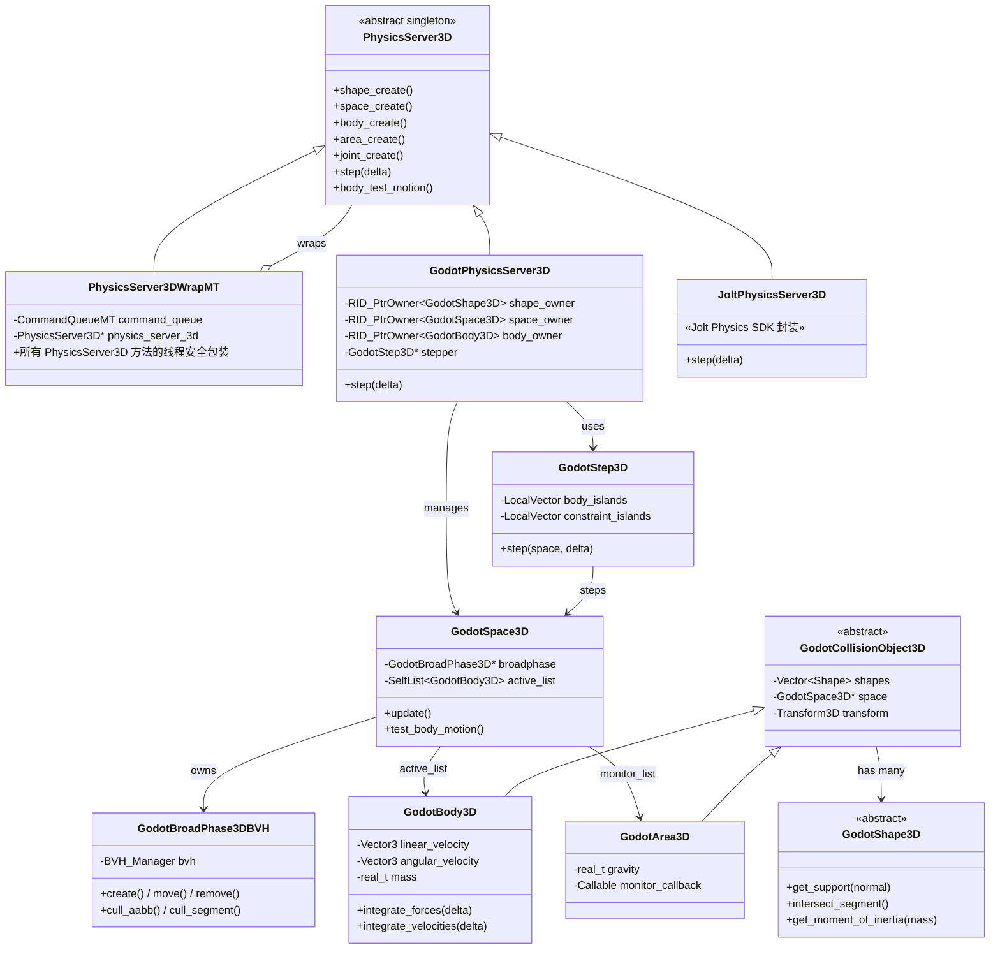
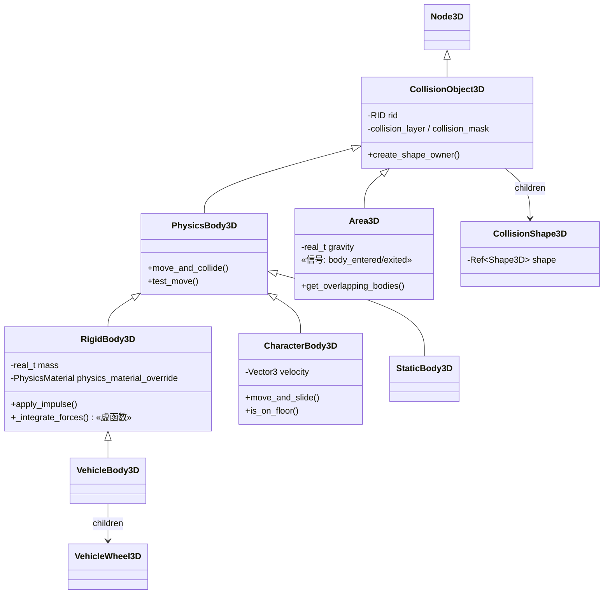

# Godot 3D 物理引擎源码深度分析

> **核心对比结论：Godot 用一个轻量级的 Server 单例 + 可插拔后端架构实现了 UE 需要 PhysX/Chaos + FBodyInstance + UPrimitiveComponent 三层才能完成的物理系统。**

---

## 目录

- [第 1 章：模块概览 — "UE 程序员 30 秒速览"](#第-1-章模块概览--ue-程序员-30-秒速览)
- [第 2 章：架构对比 — "同一个问题，两种解法"](#第-2-章架构对比--同一个问题两种解法)
- [第 3 章：核心实现对比 — "代码层面的差异"](#第-3-章核心实现对比--代码层面的差异)
- [第 4 章：UE → Godot 迁移指南](#第-4-章ue--godot-迁移指南)
- [第 5 章：性能对比](#第-5-章性能对比)
- [第 6 章：总结 — "一句话记住"](#第-6-章总结--一句话记住)

---

## 第 1 章：模块概览 — "UE 程序员 30 秒速览"

### 一句话说明

Godot 的 3D 物理模块通过 `PhysicsServer3D` 抽象接口统一管理所有物理对象（刚体、区域、关节、软体），场景节点（`RigidBody3D`、`CharacterBody3D`、`Area3D`）只是这个服务器的"前端包装"。这对应 UE 中 **Chaos Physics / PhysX** 底层引擎 + **FBodyInstance** 中间层 + **UPrimitiveComponent** 场景层的三层架构。

### 核心类/结构体列表

| # | Godot 类 | 源码路径 | 职责 | UE 对应物 |
|---|---------|---------|------|----------|
| 1 | `PhysicsServer3D` | `servers/physics_3d/physics_server_3d.h` | 物理世界抽象接口（单例） | `FPhysScene` / `FPhysScene_Chaos` |
| 2 | `GodotPhysicsServer3D` | `modules/godot_physics_3d/godot_physics_server_3d.h` | 内置物理后端实现 | PhysX SDK / Chaos Solver |
| 3 | `JoltPhysicsServer3D` | `modules/jolt_physics/jolt_physics_server_3d.h` | Jolt 物理后端实现 | PhysX SDK（第三方替代） |
| 4 | `PhysicsServer3DWrapMT` | `servers/physics_3d/physics_server_3d_wrap_mt.h` | 多线程安全包装器 | `FPhysScene::OnStartFrame` 线程调度 |
| 5 | `RigidBody3D` | `scene/3d/physics/rigid_body_3d.h` | 刚体场景节点 | `UStaticMeshComponent` + `FBodyInstance`（Simulate Physics） |
| 6 | `CharacterBody3D` | `scene/3d/physics/character_body_3d.h` | 角色运动控制器 | `ACharacter` + `UCharacterMovementComponent` |
| 7 | `Area3D` | `scene/3d/physics/area_3d.h` | 触发区域 / 重力覆盖 | `ATriggerVolume` / `UPhysicsVolume` |
| 8 | `CollisionShape3D` | `scene/3d/physics/collision_shape_3d.h` | 碰撞形状子节点 | `UShapeComponent` / `UBodySetup` |
| 9 | `VehicleBody3D` | `scene/3d/physics/vehicle_body_3d.h` | 车辆物理模拟 | `UWheeledVehicleMovementComponent` |
| 10 | `GodotBody3D` | `modules/godot_physics_3d/godot_body_3d.h` | 内部刚体数据表示 | Chaos `FPBDRigidParticle` / PhysX `PxRigidDynamic` |
| 11 | `GodotSpace3D` | `modules/godot_physics_3d/godot_space_3d.h` | 物理空间（世界） | `FPhysScene_Chaos` 内部 Solver |
| 12 | `GodotShape3D` | `modules/godot_physics_3d/godot_shape_3d.h` | 碰撞形状基类 | PhysX `PxShape` / Chaos `FImplicitObject` |
| 13 | `GodotStep3D` | `modules/godot_physics_3d/godot_step_3d.h` | 物理模拟步进器 | Chaos `FPBDRigidsSolver::AdvanceOneTimeStep` |
| 14 | `GodotBroadPhase3DBVH` | `modules/godot_physics_3d/godot_broad_phase_3d_bvh.h` | BVH 宽相碰撞检测 | PhysX `PxBroadPhase` / Chaos `FSpatialAcceleration` |
| 15 | `GodotCollisionSolver3D` | `modules/godot_physics_3d/godot_collision_solver_3d.h` | 窄相碰撞求解器 | PhysX `PxContactModifyCallback` / Chaos 碰撞管线 |
| 16 | `PhysicsMaterial` | `scene/resources/physics_material.h` | 物理材质资源 | `UPhysicalMaterial` |
| 17 | `PhysicsDirectBodyState3D` | `servers/physics_3d/physics_server_3d.h` | 物理帧内直接状态访问 | `FBodyInstance::GetUnrealWorldTransform()` |
| 18 | `PhysicsDirectSpaceState3D` | `servers/physics_3d/physics_server_3d.h` | 空间查询接口（射线/形状检测） | `UWorld::LineTraceSingleByChannel()` |

### Godot vs UE 概念速查表

| 概念 | Godot | UE |
|------|-------|-----|
| 物理世界 | `PhysicsServer3D`（全局单例） | `FPhysScene_Chaos`（每个 UWorld 一个） |
| 物理后端 | GodotPhysics3D / Jolt（可插拔模块） | Chaos / PhysX（编译时选择） |
| 刚体 | `RigidBody3D` 节点 | `UPrimitiveComponent` + `FBodyInstance`（SimulatePhysics=true） |
| 运动学体 | `CharacterBody3D` 节点 | `ACharacter` + `UCharacterMovementComponent` |
| 触发区域 | `Area3D` 节点 | `ATriggerVolume` / `UBoxComponent`（GenerateOverlapEvents） |
| 碰撞形状 | `CollisionShape3D`（子节点） | `UBodySetup`（资产内嵌） / `UShapeComponent` |
| 物理材质 | `PhysicsMaterial`（Resource） | `UPhysicalMaterial`（UObject 资产） |
| 射线检测 | `PhysicsDirectSpaceState3D::intersect_ray()` | `UWorld::LineTraceSingleByChannel()` |
| 碰撞层 | `collision_layer` / `collision_mask`（32 位掩码） | `ECollisionChannel` + `FCollisionResponseContainer` |
| 物理步进 | `PhysicsServer3D::step()` → `GodotStep3D::step()` | `FPhysScene_Chaos::OnStartFrame()` → Chaos Solver |
| 资源句柄 | `RID`（Resource ID） | `FPhysicsActorHandle` / `PxActor*` |
| 线程安全 | `PhysicsServer3DWrapMT`（命令队列） | `FPhysScene` 锁 + Physics Thread |
| 约束/关节 | `PhysicsServer3D::joint_make_*()` | `FConstraintInstance` / `UPhysicsConstraintComponent` |
| 车辆物理 | `VehicleBody3D` + `VehicleWheel3D` | `UWheeledVehicleMovementComponent` |

---

## 第 2 章：架构对比 — "同一个问题，两种解法"

### 2.1 Godot 的架构设计

Godot 的 3D 物理系统采用经典的 **Server-Client 架构**，这是 Godot 引擎的核心设计哲学之一。整个物理系统分为三层：



**场景层（前端）**：



### 2.2 UE 对应模块的架构设计

UE 的物理系统采用 **组件化 + 中间层** 架构：

- **底层**：Chaos Solver（或 PhysX SDK）—— 纯物理模拟引擎
- **中间层**：`FBodyInstance` —— 连接 UE 对象系统和底层物理引擎的桥梁
- **场景层**：`UPrimitiveComponent`（及其子类）—— 拥有 `FBodyInstance` 成员的场景组件
- **高级层**：`UCharacterMovementComponent`、`UWheeledVehicleMovementComponent` 等 —— 游戏逻辑级别的运动控制

关键文件：
- `Engine/Source/Runtime/Engine/Public/Physics/Experimental/PhysScene_Chaos.h` —— Chaos 物理场景
- `Engine/Source/Runtime/Engine/Classes/PhysicsEngine/BodyInstance.h` —— 物理体实例（~1250 行）
- `Engine/Source/Runtime/Engine/Classes/GameFramework/CharacterMovementComponent.h` —— 角色运动组件（~177KB！）

### 2.3 关键架构差异分析

#### 差异 1：Server 单例 vs 组件分散 —— 物理世界的管理哲学

**Godot** 将所有物理操作集中到一个全局单例 `PhysicsServer3D` 中。所有物理对象（body、area、shape、joint）都通过 `RID`（Resource ID）来引用，场景节点只是这些 RID 的"持有者"。这意味着物理数据和场景数据是**完全解耦**的：

```cpp
// Godot: 场景节点通过 RID 与物理服务器通信
// scene/3d/physics/collision_object_3d.h
class CollisionObject3D : public Node3D {
    RID rid;  // 物理服务器中的句柄
    // 所有物理操作都通过 PhysicsServer3D::get_singleton()->xxx(rid, ...) 完成
};
```

**UE** 则将物理状态嵌入到组件中。`FBodyInstance` 是一个 USTRUCT，直接作为 `UPrimitiveComponent` 的成员变量存在。物理状态和渲染/场景状态紧密耦合：

```cpp
// UE: FBodyInstance 直接嵌入组件
// Engine/Source/Runtime/Engine/Classes/PhysicsEngine/BodyInstance.h
USTRUCT()
struct ENGINE_API FBodyInstance { ... };
// 在 UPrimitiveComponent 中：
UPROPERTY() FBodyInstance BodyInstance;
```

**Trade-off 分析**：Godot 的 Server 模式使得物理后端可以完全替换（GodotPhysics → Jolt 只需换一个模块），但增加了一层间接调用的开销。UE 的嵌入模式访问更直接，但切换物理后端（PhysX → Chaos）需要大量重构（UE 实际上花了多个版本才完成这个迁移）。

#### 差异 2：节点树组合 vs 组件聚合 —— 碰撞形状的组织方式

**Godot** 使用**节点树组合**模式：碰撞形状是独立的 `CollisionShape3D` 节点，作为 `CollisionObject3D` 的子节点存在。一个物理体可以有多个碰撞形状子节点，每个都有自己的 Transform：

```
RigidBody3D
├── CollisionShape3D (BoxShape3D)
├── CollisionShape3D (SphereShape3D)
└── MeshInstance3D
```

**UE** 使用**资产内嵌**模式：碰撞形状定义在 `UBodySetup` 中，作为 `UStaticMesh` 或 `USkeletalMesh` 资产的一部分。运行时通过 `FBodyInstance::InitBody()` 从 `UBodySetup` 创建物理形状。也可以使用 `UShapeComponent`（`UBoxComponent`、`USphereComponent`）作为独立组件。

**Trade-off 分析**：Godot 的节点树方式更直观，在编辑器中可以直接看到和操作每个碰撞形状，适合快速原型开发。UE 的资产内嵌方式更适合大型项目，碰撞数据和渲染数据绑定在一起，减少了运行时的组装开销，但编辑碰撞形状需要专门的工具（Physics Asset Editor）。

#### 差异 3：可插拔后端 vs 编译时绑定 —— 物理引擎的选择策略

**Godot** 通过 `PhysicsServer3DManager` 实现运行时可插拔的物理后端：

```cpp
// modules/godot_physics_3d/register_types.cpp
void initialize_godot_physics_3d_module(ModuleInitializationLevel p_level) {
    PhysicsServer3DManager::get_singleton()->register_server("GodotPhysics3D", 
        callable_mp_static(_createGodotPhysics3DCallback));
    PhysicsServer3DManager::get_singleton()->set_default_server("GodotPhysics3D");
}
```

Jolt 模块也以同样的方式注册，用户可以在项目设置中选择使用哪个后端。两个后端都实现了完全相同的 `PhysicsServer3D` 接口。

**UE** 的物理后端选择是**编译时决定**的，通过预处理宏控制：

```cpp
// PhysScene_Chaos.h
class FPhysScene_Chaos : public FChaosScene { ... };
// 或 PhysScene_PhysX.h
class FPhysScene_PhysX { ... };
```

虽然 UE 也有 `FPhysicsInterface` 抽象层，但实际上 Chaos 和 PhysX 的 API 差异很大，切换需要重新编译整个引擎。

**Trade-off 分析**：Godot 的可插拔设计极其优雅，但要求所有后端都严格遵循同一接口，这限制了后端特有功能的暴露。UE 的编译时绑定允许更深度的优化和更丰富的后端特有 API，但迁移成本极高。

---

## 第 3 章：核心实现对比 — "代码层面的差异"

### 3.1 PhysicsServer3D vs FPhysScene：物理世界抽象对比

#### Godot 怎么做的

Godot 的 `PhysicsServer3D`（`servers/physics_3d/physics_server_3d.h`，1074 行）是一个纯虚基类，定义了物理系统的完整 API。它是一个**全局单例**，通过 `PhysicsServer3D::get_singleton()` 访问。

核心设计特点：
1. **RID 句柄系统**：所有物理对象（shape、space、body、area、joint）都通过 `RID` 引用，不暴露内部指针
2. **统一的参数枚举**：`BodyParameter`、`BodyState`、`SpaceParameter` 等枚举统一了参数访问方式
3. **生命周期管理**：`xxx_create()` 创建，`free_rid()` 销毁，简洁明了

```cpp
// servers/physics_3d/physics_server_3d.h
class PhysicsServer3D : public Object {
    static PhysicsServer3D *singleton;
public:
    // 形状创建
    virtual RID sphere_shape_create() = 0;
    virtual RID box_shape_create() = 0;
    // 空间管理
    virtual RID space_create() = 0;
    virtual void space_set_active(RID p_space, bool p_active) = 0;
    // 刚体管理
    virtual RID body_create() = 0;
    virtual void body_set_mode(RID p_body, BodyMode p_mode) = 0;
    virtual void body_set_space(RID p_body, RID p_space) = 0;
    // 模拟步进
    virtual void step(real_t p_step) = 0;
};
```

具体实现 `GodotPhysicsServer3D`（`modules/godot_physics_3d/godot_physics_server_3d.h`）使用 `RID_PtrOwner` 模板管理内部对象的生命周期：

```cpp
// modules/godot_physics_3d/godot_physics_server_3d.h
class GodotPhysicsServer3D : public PhysicsServer3D {
    mutable RID_PtrOwner<GodotShape3D, true> shape_owner;
    mutable RID_PtrOwner<GodotSpace3D, true> space_owner;
    mutable RID_PtrOwner<GodotBody3D, true> body_owner{ 65536, 1048576 };
    // body_owner 预分配 65536 个槽位，最大 1048576
    GodotStep3D *stepper = nullptr;
    HashSet<GodotSpace3D *> active_spaces;
};
```

#### UE 怎么做的

UE 的 `FPhysScene_Chaos`（`Engine/Source/Runtime/Engine/Public/Physics/Experimental/PhysScene_Chaos.h`，343 行）继承自 `FChaosScene`，每个 `UWorld` 拥有一个物理场景实例。

核心设计特点：
1. **Proxy 模式**：物理对象通过 `IPhysicsProxyBase` 代理与 Chaos Solver 通信
2. **组件映射**：维护 `PhysicsProxyToComponentMap` 和 `ComponentToPhysicsProxyMap` 双向映射
3. **事件驱动**：碰撞事件通过 `HandleCollisionEvents` 回调分发

```cpp
// PhysScene_Chaos.h
class FPhysScene_Chaos : public FChaosScene {
    // 组件 ↔ 物理代理 双向映射
    TMap<IPhysicsProxyBase*, UPrimitiveComponent*> PhysicsProxyToComponentMap;
    TMap<UPrimitiveComponent*, TArray<IPhysicsProxyBase*>> ComponentToPhysicsProxyMap;
    
    // 力/扭矩操作都需要 FBodyInstance 参数
    void AddForce_AssumesLocked(FBodyInstance* BodyInstance, const FVector& Force, ...);
    void AddTorque_AssumesLocked(FBodyInstance* BodyInstance, const FVector& Torque, ...);
};
```

#### 差异点评

| 维度 | Godot | UE |
|------|-------|-----|
| 对象引用 | `RID`（轻量级整数句柄） | `FPhysicsActorHandle` / 指针 |
| 世界数量 | 支持多个 Space（通过 `space_create()`） | 每个 UWorld 一个 FPhysScene |
| API 风格 | 过程式（`body_set_param(rid, param, value)`） | 面向对象（`BodyInstance->SetMassOverrideInKg()`） |
| 内存管理 | `RID_PtrOwner` 池分配 | UObject GC + 手动管理 |

Godot 的 RID 系统更轻量，避免了 UObject 反射系统的开销，但也失去了蓝图可见性和序列化便利性。UE 的方式更适合大型团队协作（设计师可以在编辑器中直接调整物理参数），但运行时开销更大。

### 3.2 GodotPhysics vs Jolt vs Chaos vs PhysX：物理后端选择策略

#### Godot 的后端注册机制

Godot 通过 `PhysicsServer3DManager` 实现后端注册：

```cpp
// modules/godot_physics_3d/register_types.cpp
static PhysicsServer3D *_createGodotPhysics3DCallback() {
    bool using_threads = GLOBAL_GET("physics/3d/run_on_separate_thread");
    PhysicsServer3D *physics_server_3d = memnew(GodotPhysicsServer3D(using_threads));
    return memnew(PhysicsServer3DWrapMT(physics_server_3d, using_threads));
}

void initialize_godot_physics_3d_module(ModuleInitializationLevel p_level) {
    PhysicsServer3DManager::get_singleton()->register_server("GodotPhysics3D",
        callable_mp_static(_createGodotPhysics3DCallback));
    PhysicsServer3DManager::get_singleton()->set_default_server("GodotPhysics3D");
}
```

注意 `PhysicsServer3DWrapMT` 的包装模式：无论底层后端是什么，都会被包装一层线程安全的命令队列。这是一个**装饰器模式**的经典应用。

**GodotPhysics3D** 是 Godot 的内置物理引擎，特点：
- 纯 C++ 实现，无第三方依赖
- 使用 GJK-EPA 算法进行凸体碰撞检测（`modules/godot_physics_3d/gjk_epa.cpp`）
- SAT（分离轴定理）用于特化的形状对碰撞（`godot_collision_solver_3d_sat.cpp`，2006 行）
- BVH 宽相碰撞检测（`godot_broad_phase_3d_bvh.h`）
- 基于岛的约束求解器（`godot_step_3d.cpp`）

**Jolt** 是 Godot 4.x 新增的高性能物理后端（`modules/jolt_physics/`），基于 Jolt Physics 库，特点：
- 工业级物理引擎，性能远超 GodotPhysics
- 支持更精确的碰撞检测和约束求解
- 实现了完全相同的 `PhysicsServer3D` 接口

#### UE 的后端选择

UE 的物理后端选择是编译时决定的：
- **PhysX**（UE4 默认）：NVIDIA 开发的成熟物理引擎
- **Chaos**（UE5 默认）：Epic 自研的物理引擎，支持大规模破坏

```cpp
// 通过预处理宏选择
#if PHYSICS_INTERFACE_PHYSX
    // PhysX 路径
#elif WITH_CHAOS
    // Chaos 路径
#endif
```

#### 差异点评

| 维度 | Godot | UE |
|------|-------|-----|
| 切换方式 | 项目设置中选择（运行时） | 编译时宏定义 |
| 默认后端 | GodotPhysics3D（轻量） | Chaos（UE5）/ PhysX（UE4） |
| 高性能选项 | Jolt（可选模块） | Chaos（内置） |
| 接口一致性 | 100% 相同的 `PhysicsServer3D` 接口 | 有 `FPhysicsInterface` 但实际差异大 |
| 第三方扩展 | 任何人都可以写新后端 | 需要修改引擎源码 |

### 3.3 CharacterBody3D vs ACharacter+CMC：角色移动控制器对比

#### Godot 怎么做的

`CharacterBody3D`（`scene/3d/physics/character_body_3d.h`，186 行）是 Godot 中角色移动的核心节点。它继承自 `PhysicsBody3D`，使用**运动学**方式处理移动（不受物理引擎直接驱动）。

核心方法是 `move_and_slide()`，它在内部执行以下流程：

```cpp
// scene/3d/physics/character_body_3d.h
class CharacterBody3D : public PhysicsBody3D {
    // 两种运动模式
    enum MotionMode {
        MOTION_MODE_GROUNDED,  // 地面模式（有重力、地面检测）
        MOTION_MODE_FLOATING,  // 浮动模式（太空/水下）
    };
    
    // 核心状态
    Vector3 velocity;           // 当前速度（用户设置）
    Vector3 floor_normal;       // 地面法线
    Vector3 wall_normal;        // 墙壁法线
    CollisionState collision_state;  // floor/wall/ceiling 状态
    
    // 地面参数
    real_t floor_max_angle = 45°;    // 最大地面角度
    real_t floor_snap_length = 0.1;  // 地面吸附距离
    bool floor_stop_on_slope = true; // 斜坡停止
    bool floor_constant_speed = false; // 斜坡恒速
    int max_slides = 6;              // 最大滑动迭代次数
    
    // 核心方法
    bool move_and_slide();  // 执行移动 + 碰撞响应
    void apply_floor_snap(); // 吸附到地面
};
```

`move_and_slide()` 的内部实现分为两个路径：
- `_move_and_slide_grounded()`：地面模式，处理地面检测、斜坡、楼梯、平台等
- `_move_and_slide_floating()`：浮动模式，简单的碰撞滑动

关键实现细节：
1. 使用 `PhysicsServer3D::body_test_motion()` 进行运动测试
2. 碰撞后沿碰撞面滑动（最多 `max_slides` 次迭代）
3. 通过 `floor_snap_length` 实现下坡时的地面吸附
4. `CollisionState` 联合体同时追踪 floor/wall/ceiling 状态

#### UE 怎么做的

UE 的角色移动由 `ACharacter`（Actor）+ `UCharacterMovementComponent`（组件）共同实现。`UCharacterMovementComponent`（`CharacterMovementComponent.h`，177KB！）是 UE 中最复杂的组件之一。

核心特点：
- 支持多种移动模式：Walking、Falling、Swimming、Flying、Custom
- 内置网络同步（Replication）支持
- 支持 Root Motion
- 复杂的地面检测（`FindFloor()`）和斜坡处理
- 内置加速/减速模型

```cpp
// UE: CharacterMovementComponent.h (简化)
class UCharacterMovementComponent : public UPawnMovementComponent {
    // 移动模式
    EMovementMode MovementMode;
    
    // 地面检测
    FFindFloorResult CurrentFloor;
    float MaxStepHeight;
    float WalkableFloorAngle;
    
    // 移动参数
    float MaxWalkSpeed;
    float MaxAcceleration;
    float BrakingDecelerationWalking;
    float GroundFriction;
    float AirControl;
    
    // 核心方法
    virtual void PerformMovement(float DeltaTime);
    virtual void PhysWalking(float DeltaTime, int32 Iterations);
    virtual void PhysFalling(float DeltaTime, int32 Iterations);
};
```

#### 差异点评

| 维度 | Godot `CharacterBody3D` | UE `CMC` |
|------|------------------------|----------|
| 代码量 | ~186 行（头文件） | ~177KB（头文件） |
| 复杂度 | 简洁，核心逻辑清晰 | 极其复杂，覆盖所有场景 |
| 速度控制 | 用户直接设置 `velocity` | 内置加速/减速/摩擦模型 |
| 移动模式 | 2 种（Grounded/Floating） | 5+ 种（Walk/Fall/Swim/Fly/Custom） |
| 网络同步 | 无内置支持 | 完整的预测/校正/回滚 |
| Root Motion | 无内置支持 | 完整支持 |
| 地面检测 | `body_test_motion()` + 法线角度 | `FindFloor()` + 复杂的 Step-Up 逻辑 |
| 自定义难度 | 低（代码简单，易于理解和修改） | 高（需要理解大量内部状态） |

**核心哲学差异**：Godot 的 `CharacterBody3D` 是一个**最小化的运动学框架**，它只提供碰撞检测和滑动响应，速度计算完全由用户在 `_physics_process()` 中控制。UE 的 CMC 是一个**完整的运动模拟系统**，内置了物理模型、网络同步、动画集成等。

对于 UE 程序员来说，Godot 的方式意味着你需要自己实现加速/减速/摩擦/空中控制等逻辑，但好处是你对运动有**完全的控制权**，不需要与 CMC 的内部状态"斗争"。

### 3.4 物理材质：PhysicsMaterial vs UPhysicalMaterial

#### Godot 怎么做的

Godot 的 `PhysicsMaterial`（`scene/resources/physics_material.h`，70 行）极其简洁：

```cpp
// scene/resources/physics_material.h
class PhysicsMaterial : public Resource {
    real_t friction = 1.0;   // 摩擦系数
    bool rough = false;       // 粗糙模式（影响组合方式）
    real_t bounce = 0.0;      // 弹性系数
    bool absorbent = false;   // 吸收模式（影响组合方式）
    
    // 计算后的值（rough/absorbent 用负值编码组合模式）
    real_t computed_friction() const {
        return rough ? -friction : friction;
    }
    real_t computed_bounce() const {
        return absorbent ? -bounce : bounce;
    }
};
```

Godot 用一个巧妙的技巧：通过**负值**来编码摩擦/弹性的组合模式。当 `rough=true` 时，`computed_friction()` 返回负值，物理引擎内部会将其解释为"取两个材质中较大的摩擦值"而非默认的平均值。

#### UE 怎么做的

UE 的 `UPhysicalMaterial`（`PhysicsCore/Public/PhysicalMaterials/PhysicalMaterial.h`，129 行）功能更丰富：

```cpp
// UE: PhysicalMaterial.h
class UPhysicalMaterial : public UObject {
    float Friction;                    // 动摩擦
    float StaticFriction;              // 静摩擦（Godot 没有区分）
    EFrictionCombineMode FrictionCombineMode;  // 显式的组合模式枚举
    float Restitution;                 // 弹性
    EFrictionCombineMode RestitutionCombineMode;
    float Density;                     // 密度（Godot 没有）
    float SleepLinearVelocityThreshold;  // 休眠阈值
    float SleepAngularVelocityThreshold;
    int32 SleepCounterThreshold;
    float RaiseMassToPower;            // 质量缩放
    float DestructibleDamageThresholdScale;  // 破坏阈值
    EPhysicalSurface SurfaceType;      // 表面类型（脚步声等）
};
```

#### 差异点评

| 维度 | Godot `PhysicsMaterial` | UE `UPhysicalMaterial` |
|------|------------------------|----------------------|
| 参数数量 | 4 个（friction, rough, bounce, absorbent） | 12+ 个 |
| 静/动摩擦 | 不区分 | 区分 StaticFriction / Friction |
| 组合模式 | 用 bool 编码（rough/absorbent） | 显式枚举（Average/Min/Multiply/Max） |
| 密度 | 无（质量直接设置在 Body 上） | 有（用于自动计算质量） |
| 表面类型 | 无 | 有（用于脚步声、粒子效果等） |
| 休眠参数 | 在 Space 级别设置 | 在材质级别设置 |

Godot 的物理材质设计体现了"够用就好"的哲学。对于大多数游戏来说，摩擦和弹性两个参数足够了。UE 的设计更适合 AAA 级别的物理模拟需求。

### 3.5 射线检测：PhysicsRayQueryParameters3D vs FCollisionQueryParams

#### Godot 怎么做的

Godot 的射线检测通过 `PhysicsDirectSpaceState3D` 进行：

```cpp
// servers/physics_3d/physics_server_3d.h
class PhysicsDirectSpaceState3D : public Object {
    struct RayParameters {
        Vector3 from;
        Vector3 to;
        HashSet<RID> exclude;           // 排除列表
        uint32_t collision_mask = UINT32_MAX;
        bool collide_with_bodies = true;
        bool collide_with_areas = false;
        bool hit_from_inside = false;
        bool hit_back_faces = true;
        bool pick_ray = false;
    };
    
    struct RayResult {
        Vector3 position;
        Vector3 normal;
        RID rid;
        ObjectID collider_id;
        Object *collider = nullptr;
        int shape = 0;
        int face_index = -1;
    };
    
    virtual bool intersect_ray(const RayParameters &p_parameters, RayResult &r_result) = 0;
};
```

GDScript 中的使用方式：

```gdscript
var space_state = get_world_3d().direct_space_state
var query = PhysicsRayQueryParameters3D.create(from, to)
query.collision_mask = 0x01
query.collide_with_areas = true
var result = space_state.intersect_ray(query)
if result:
    print(result.position, result.normal, result.collider)
```

除了射线检测，还支持：
- `intersect_point()`：点查询
- `intersect_shape()`：形状重叠查询
- `cast_motion()`：形状扫描（sweep）
- `collide_shape()`：形状碰撞点查询
- `rest_info()`：最近碰撞信息

#### UE 怎么做的

UE 的射线检测通过 `UWorld` 的方法进行：

```cpp
// UE 射线检测
FHitResult HitResult;
FCollisionQueryParams QueryParams;
QueryParams.AddIgnoredActor(this);
QueryParams.bTraceComplex = true;

bool bHit = GetWorld()->LineTraceSingleByChannel(
    HitResult,
    Start,
    End,
    ECC_Visibility,
    QueryParams
);
```

UE 提供了更多的查询变体：
- `LineTraceSingleByChannel` / `LineTraceMultiByChannel`
- `LineTraceSingleByObjectType` / `LineTraceMultiByObjectType`
- `LineTraceSingleByProfile`
- `SweepSingleByChannel` / `SweepMultiByChannel`
- `OverlapMultiByChannel`

#### 差异点评

| 维度 | Godot | UE |
|------|-------|-----|
| 查询入口 | `PhysicsDirectSpaceState3D`（需要获取） | `UWorld`（直接访问） |
| 参数封装 | `PhysicsRayQueryParameters3D`（RefCounted 对象） | `FCollisionQueryParams`（栈上结构体） |
| 碰撞过滤 | `collision_mask`（32 位掩码） | `ECollisionChannel` + `FCollisionResponseContainer` |
| 结果格式 | `Dictionary`（GDScript）/ `RayResult`（C++） | `FHitResult`（结构体） |
| 异步查询 | 不支持 | 支持（`AsyncLineTraceByChannel`） |
| 调试可视化 | 需要手动绘制 | `DrawDebugLine` 内置支持 |

Godot 的碰撞过滤使用简单的 32 位掩码（`collision_layer` 和 `collision_mask`），而 UE 使用更复杂的碰撞通道系统（`ECollisionChannel`），每个通道可以独立设置 Block/Overlap/Ignore 响应。UE 的系统更灵活但也更复杂。

### 3.6 物理模拟步进：GodotStep3D 的岛求解器

#### Godot 怎么做的

`GodotStep3D::step()`（`modules/godot_physics_3d/godot_step_3d.cpp`，418 行）是 Godot 内置物理引擎的核心模拟循环：

```
1. 锁定空间 (space->lock())
2. 更新惯性等属性 (space->setup())
3. 积分力 → 更新速度 (integrate_forces)
4. 更新软体运动预测 (predict_motion)
5. 更新宽相碰撞 (space->update())
6. 生成约束岛 (populate_island)
   - 区域约束岛
   - 刚体约束岛
   - 软体约束岛
7. 设置约束 (setup_constraint) [多线程]
8. 预求解岛 (pre_solve_island) [单线程]
9. 求解约束岛 (solve_island) [多线程]
10. 积分速度 → 更新位置 (integrate_velocities)
11. 休眠检测 (check_suspend)
12. 更新软体约束 (solve_constraints)
13. 解锁空间 (space->unlock())
```

关键实现细节：

```cpp
// godot_step_3d.cpp - 约束求解使用 WorkerThreadPool
uint32_t total_constraint_count = all_constraints.size();
WorkerThreadPool::GroupID group_task = WorkerThreadPool::get_singleton()->add_template_group_task(
    this, &GodotStep3D::_setup_constraint, nullptr, total_constraint_count, -1, true, 
    SNAME("Physics3DConstraintSetup"));
WorkerThreadPool::get_singleton()->wait_for_group_task_completion(group_task);
```

岛求解器使用**优先级迭代**：

```cpp
void GodotStep3D::_solve_island(uint32_t p_island_index, void *p_userdata) {
    int current_priority = 1;
    while (constraint_count > 0) {
        for (int i = 0; i < iterations; i++) {
            for (uint32_t ci = 0; ci < constraint_count; ++ci) {
                constraint_island[ci]->solve(delta);
            }
        }
        // 提升优先级，只保留高优先级约束继续迭代
        ++current_priority;
        // ... 过滤低优先级约束
    }
}
```

#### UE 怎么做的

UE 的 Chaos 物理引擎使用更复杂的求解器架构：
- **PBD（Position Based Dynamics）** 求解器
- 支持子步进（Sub-stepping）
- 独立的物理线程
- 基于 `FPBDRigidsSolver` 的并行求解

```cpp
// PhysScene_Chaos.h
class FPhysScene_Chaos : public FChaosScene {
    virtual float OnStartFrame(float InDeltaTime) override;
    // Chaos 内部使用独立的 Solver 线程
};
```

#### 差异点评

Godot 的步进器设计简洁明了，整个流程在一个函数中完成，使用 `WorkerThreadPool` 进行约束求解的并行化。UE 的 Chaos 使用更复杂的异步架构，物理模拟在独立线程上运行，通过 Proxy 机制与游戏线程同步。

---

## 第 4 章：UE → Godot 迁移指南

### 4.1 思维转换清单

#### ❌ 忘掉 1：组件化物理 → 节点树物理

在 UE 中，你习惯了在 `UPrimitiveComponent` 上设置 `SimulatePhysics=true`，碰撞形状定义在 `UBodySetup` 中。在 Godot 中，你需要**创建专门的物理节点**（`RigidBody3D`、`StaticBody3D`），然后添加 `CollisionShape3D` 子节点。

```
UE 思维：StaticMeshComponent.SetSimulatePhysics(true)
Godot 思维：创建 RigidBody3D 节点 → 添加 CollisionShape3D 子节点 → 添加 MeshInstance3D 子节点
```

#### ❌ 忘掉 2：CMC 的自动运动模型 → 手动控制速度

UE 的 `CharacterMovementComponent` 有内置的加速/减速/摩擦模型，你只需要设置 `MaxWalkSpeed` 和 `AddInputVector()`。在 Godot 中，你需要在 `_physics_process()` 中**手动计算速度**：

```gdscript
# Godot: 你需要自己实现加速/减速
func _physics_process(delta):
    var input_dir = Input.get_vector("left", "right", "forward", "back")
    var direction = (transform.basis * Vector3(input_dir.x, 0, input_dir.y)).normalized()
    
    if direction:
        velocity.x = move_toward(velocity.x, direction.x * SPEED, ACCEL * delta)
        velocity.z = move_toward(velocity.z, direction.z * SPEED, ACCEL * delta)
    else:
        velocity.x = move_toward(velocity.x, 0, DECEL * delta)
        velocity.z = move_toward(velocity.z, 0, DECEL * delta)
    
    velocity.y -= GRAVITY * delta  # 手动应用重力
    move_and_slide()
```

#### ❌ 忘掉 3：碰撞通道系统 → 简单掩码

UE 的碰撞通道（`ECollisionChannel`）+ 响应矩阵（Block/Overlap/Ignore）非常强大但复杂。Godot 使用简单的 32 位 `collision_layer`（我在哪些层）和 `collision_mask`（我检测哪些层）。

#### ❌ 忘掉 4：FBodyInstance 的中间层 → 直接操作节点

在 UE 中，很多物理操作需要通过 `FBodyInstance` 进行。在 Godot 中，直接操作节点即可：

```gdscript
# Godot: 直接在节点上操作
rigid_body.apply_impulse(Vector3(0, 10, 0))
rigid_body.linear_velocity = Vector3.ZERO
rigid_body.mass = 5.0
```

#### ❌ 忘掉 5：物理资产编辑器 → 节点树编辑

UE 的骨骼物理需要在 Physics Asset Editor 中编辑。Godot 中直接在场景树中添加 `CollisionShape3D` 节点，所见即所得。

#### 🔄 重新学 1：PhysicsServer3D 的 RID 系统

当你需要底层控制时，可以直接调用 `PhysicsServer3D` 的 API：

```gdscript
var ps = PhysicsServer3D
var body = ps.body_create()
ps.body_set_mode(body, PhysicsServer3D.BODY_MODE_RIGID)
ps.body_set_space(body, get_world_3d().space)
```

#### 🔄 重新学 2：信号驱动的碰撞事件

Godot 使用信号（Signal）而非委托（Delegate）来处理碰撞事件：

```gdscript
# Area3D 的重叠检测
area.body_entered.connect(_on_body_entered)
area.body_exited.connect(_on_body_exited)

# RigidBody3D 的碰撞检测（需要启用 contact_monitor）
rigid_body.body_entered.connect(_on_body_entered)
```

### 4.2 API 映射表

| UE API | Godot 等价 API | 备注 |
|--------|---------------|------|
| `UPrimitiveComponent::SetSimulatePhysics(true)` | 使用 `RigidBody3D` 节点 | Godot 中物理类型由节点类型决定 |
| `UPrimitiveComponent::AddImpulse()` | `RigidBody3D.apply_impulse()` | 参数顺序不同 |
| `UPrimitiveComponent::AddForce()` | `RigidBody3D.apply_force()` | - |
| `UPrimitiveComponent::SetPhysicsLinearVelocity()` | `RigidBody3D.linear_velocity = ...` | 直接属性赋值 |
| `UCharacterMovementComponent::AddInputVector()` | `CharacterBody3D.velocity = ...; move_and_slide()` | 需要手动计算速度 |
| `ACharacter::IsOnFloor()` | `CharacterBody3D.is_on_floor()` | 功能相同 |
| `UWorld::LineTraceSingleByChannel()` | `space_state.intersect_ray(query)` | 需要先获取 space_state |
| `UWorld::SweepSingleByChannel()` | `space_state.cast_motion(query)` | - |
| `UWorld::OverlapMultiByChannel()` | `space_state.intersect_shape(query)` | - |
| `FBodyInstance::SetMassOverrideInKg()` | `RigidBody3D.mass = ...` | 直接设置 |
| `UPhysicalMaterial` | `PhysicsMaterial` | Godot 版本更简洁 |
| `UPhysicsConstraintComponent` | `PhysicsServer3D.joint_make_*()` 或场景中的 Joint 节点 | - |
| `FBodyInstance::SetCollisionProfileName()` | `CollisionObject3D.collision_layer/mask` | 掩码 vs 配置文件 |
| `UPrimitiveComponent::OnComponentHit` | `RigidBody3D.body_entered` 信号 | 需要启用 contact_monitor |
| `ATriggerVolume::OnActorBeginOverlap` | `Area3D.body_entered` 信号 | - |
| `UPrimitiveComponent::SetCollisionEnabled()` | `CollisionShape3D.disabled = true` | 在形状级别控制 |
| `FBodyInstance::bLockXRotation` | `PhysicsBody3D.set_axis_lock()` | - |

### 4.3 陷阱与误区

#### 陷阱 1：RigidBody3D 不能直接设置 Transform

在 UE 中，你可以随时 `SetWorldLocation()` 来移动一个模拟中的物理体。在 Godot 中，**直接设置 `RigidBody3D` 的 `position` 或 `transform` 会被物理引擎覆盖**。正确的做法是：

```gdscript
# ❌ 错误：直接设置位置（会被物理引擎覆盖）
rigid_body.position = Vector3(10, 0, 0)

# ✅ 正确方式 1：使用 _integrate_forces 回调
func _integrate_forces(state: PhysicsDirectBodyState3D):
    state.transform = Transform3D(Basis(), Vector3(10, 0, 0))

# ✅ 正确方式 2：临时冻结
rigid_body.freeze = true
rigid_body.position = Vector3(10, 0, 0)
rigid_body.freeze = false
```

#### 陷阱 2：CharacterBody3D 的 velocity 不会自动衰减

UE 的 CMC 有内置的摩擦和减速。Godot 的 `CharacterBody3D.velocity` 是**持久的**——如果你不手动减速，角色会一直以相同速度移动：

```gdscript
# ❌ 错误：只在有输入时设置速度，松开后角色不会停
func _physics_process(delta):
    if Input.is_action_pressed("forward"):
        velocity.z = -SPEED
    move_and_slide()  # 松开后 velocity.z 仍然是 -SPEED！

# ✅ 正确：手动处理减速
func _physics_process(delta):
    if Input.is_action_pressed("forward"):
        velocity.z = -SPEED
    else:
        velocity.z = move_toward(velocity.z, 0, DECEL * delta)
    move_and_slide()
```

#### 陷阱 3：碰撞检测需要显式启用

在 UE 中，`OnComponentHit` 默认就能工作。在 Godot 中，`RigidBody3D` 的碰撞信号需要**手动启用 `contact_monitor`** 并设置 `max_contacts_reported`：

```gdscript
# 必须启用才能收到 body_entered/body_exited 信号
rigid_body.contact_monitor = true
rigid_body.max_contacts_reported = 4
```

#### 陷阱 4：物理帧率与渲染帧率分离

Godot 的物理默认以 60Hz 运行（`_physics_process`），渲染帧率独立。角色移动逻辑应该放在 `_physics_process()` 而非 `_process()` 中。这与 UE 的 `Tick()` 不同——UE 的 `Tick` 默认与渲染帧率绑定，物理子步进在内部处理。

### 4.4 最佳实践

1. **使用 `move_and_slide()` 而非手动调用 `move_and_collide()`**：`move_and_slide()` 已经处理了滑动、地面检测、平台跟随等复杂逻辑。

2. **善用 `Area3D` 做触发检测**：不要用 `RigidBody3D` 做触发器，`Area3D` 专门为此设计，性能更好。

3. **复杂物理逻辑使用 `_integrate_forces()`**：这是 Godot 版的 "Custom Physics"，在物理步进中被调用，可以直接访问 `PhysicsDirectBodyState3D`。

4. **大量物理对象时考虑 Jolt 后端**：GodotPhysics3D 适合简单场景，Jolt 在大量刚体场景下性能显著更好。

5. **使用 `PhysicsServer3D` 直接 API 做批量操作**：当需要创建大量物理对象时，直接调用 Server API 比创建节点更高效。

---

## 第 5 章：性能对比

### 5.1 Godot 物理模块的性能特征

#### GodotPhysics3D 的性能瓶颈

1. **宽相碰撞检测**：使用 BVH（Bounding Volume Hierarchy），对于静态场景效率良好，但大量动态对象时更新开销较大。源码位于 `godot_broad_phase_3d_bvh.h`，使用模板化的 `BVH_Manager`。

2. **窄相碰撞检测**：
   - 凸体对凸体：使用 GJK-EPA 算法（`gjk_epa.cpp`，694 行）
   - 特化形状对：使用 SAT 算法（`godot_collision_solver_3d_sat.cpp`，2006 行）
   - SAT 对特定形状对（球-球、球-盒等）有优化路径，但通用凸体碰撞依赖 GJK-EPA

3. **约束求解**：基于岛的迭代求解器（`godot_step_3d.cpp`），使用 `WorkerThreadPool` 并行化。默认迭代次数由 `SpaceParameter::SPACE_PARAM_SOLVER_ITERATIONS` 控制。

4. **单线程瓶颈**：
   - `_pre_solve_island()` 在单线程上运行（注释明确说明 "thread-unsafe processing"）
   - 力积分（`integrate_forces`）和速度积分（`integrate_velocities`）是串行的

#### Jolt 后端的性能优势

Jolt Physics 是一个工业级物理引擎（由 Guerrilla Games 开发），相比 GodotPhysics3D：
- 更高效的宽相（多层 BVH + SIMD 优化）
- 更稳定的约束求解器
- 更好的多线程并行化
- 支持更多的碰撞形状优化路径

### 5.2 与 UE 的性能差异

| 维度 | Godot (GodotPhysics) | Godot (Jolt) | UE (Chaos) |
|------|---------------------|--------------|------------|
| 刚体数量上限（实用） | ~500-1000 | ~5000-10000 | ~10000+ |
| 宽相算法 | BVH | 多层 BVH + SIMD | SAP + Grid |
| 窄相算法 | GJK-EPA + SAT | Jolt 内置 | GJK + EPA + 特化 |
| 约束求解器 | 迭代式（Sequential Impulse） | Jolt 内置 | PBD（Position Based） |
| 多线程 | 部分并行（约束求解） | 完全并行 | 完全并行 + 独立线程 |
| CCD（连续碰撞检测） | 基础支持 | 完整支持 | 完整支持 |
| 破坏系统 | 无 | 无 | 完整支持（Chaos Destruction） |

### 5.3 性能敏感场景的建议

1. **大量刚体场景（>500）**：务必切换到 Jolt 后端。GodotPhysics3D 的串行力积分和有限的并行化在大量对象时会成为瓶颈。

2. **射线检测密集场景**：Godot 的射线检测是同步的，大量射线检测会阻塞物理帧。考虑：
   - 使用 `collision_mask` 减少检测范围
   - 分帧执行射线检测
   - 使用 `Area3D` 替代频繁的射线检测

3. **复杂碰撞形状**：避免使用 `ConcavePolygonShape3D` 做动态物体的碰撞形状。使用多个凸体（`ConvexPolygonShape3D`）组合代替。

4. **休眠优化**：确保 `can_sleep` 为 true（默认值），让不活跃的物体进入休眠状态。GodotPhysics3D 的岛系统会自动检测可以休眠的物体组。

5. **物理帧率**：默认 60Hz 对大多数游戏足够。如果物理精度要求不高，可以降低到 30Hz 以节省 CPU 时间。

6. **避免在 `_physics_process` 中做射线检测**：射线检测应该在 `_physics_process` 中进行（因为需要访问 `PhysicsDirectSpaceState3D`），但要控制数量。

---

## 第 6 章：总结 — "一句话记住"

### 核心差异

> **Godot 用 Server 单例 + RID 句柄 + 可插拔后端实现了一个轻量级但完整的物理系统；UE 用 FBodyInstance 中间层 + Chaos/PhysX 底层引擎实现了一个重量级但功能全面的物理系统。**

### 设计亮点（Godot 做得比 UE 好的地方）

1. **可插拔物理后端**：通过 `PhysicsServer3DManager` 实现运行时切换物理引擎，这是 UE 至今未能优雅实现的。从 PhysX 到 Chaos 的迁移让 Epic 付出了巨大代价。

2. **简洁的 API 设计**：`CharacterBody3D` 的 186 行头文件 vs UE CMC 的 177KB，Godot 的设计让开发者更容易理解和自定义角色运动。

3. **节点树碰撞编辑**：直接在场景树中添加 `CollisionShape3D`，所见即所得，比 UE 的 Physics Asset Editor 更直观。

4. **RID 系统的轻量级**：避免了 UObject 反射系统的开销，物理对象的创建和销毁更快。

5. **PhysicsServer3DWrapMT 的装饰器模式**：优雅地将线程安全与物理实现分离，任何后端都自动获得线程安全包装。

### 设计短板（Godot 不如 UE 的地方）

1. **GodotPhysics3D 性能有限**：内置物理引擎在大规模场景下性能远不如 Chaos/PhysX。虽然 Jolt 弥补了这一差距，但它是可选模块而非默认。

2. **缺少破坏系统**：UE 的 Chaos Destruction 提供了完整的物理破坏支持，Godot 没有对应功能。

3. **缺少内置网络物理同步**：UE 的 CMC 内置了完整的网络预测/校正/回滚，Godot 需要完全自己实现。

4. **碰撞过滤系统简单**：32 位掩码 vs UE 的碰撞通道 + 响应矩阵，在复杂项目中可能不够用。

5. **缺少异步物理查询**：UE 支持异步射线检测，Godot 的所有查询都是同步的。

6. **物理材质功能有限**：没有静/动摩擦区分、没有密度、没有表面类型系统。

### UE 程序员的学习路径建议

**推荐阅读顺序**：

1. **第一步**：`scene/3d/physics/physics_body_3d.h`（70 行）—— 理解 Godot 物理节点的基类
2. **第二步**：`scene/3d/physics/character_body_3d.h`（186 行）—— 理解角色运动控制器（对标 CMC）
3. **第三步**：`scene/3d/physics/rigid_body_3d.h`（246 行）—— 理解刚体节点
4. **第四步**：`servers/physics_3d/physics_server_3d.h`（1074 行）—— 理解物理服务器接口（核心！）
5. **第五步**：`modules/godot_physics_3d/godot_step_3d.cpp`（418 行）—— 理解物理模拟循环
6. **第六步**：`modules/godot_physics_3d/godot_body_3d.h`（394 行）—— 理解内部刚体实现
7. **第七步**：`modules/godot_physics_3d/godot_space_3d.h`（211 行）—— 理解物理空间
8. **第八步**：`scene/3d/physics/area_3d.h`（232 行）—— 理解触发区域（对标 TriggerVolume）

**总阅读量**：约 2900 行核心代码，一个下午即可通读。相比之下，UE 的 `CharacterMovementComponent.h` 单个文件就有 177KB。这正是 Godot 物理系统的最大优势——**可理解性**。
