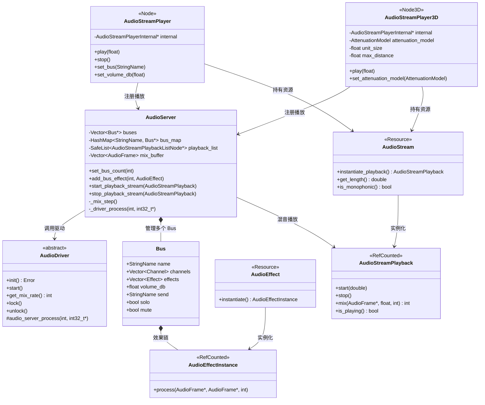

# 14. 音频系统 (Audio System) — Godot vs UE 源码深度对比

> **核心结论：Godot 用一个轻量级的 Bus 混音管线 + 节点化播放器取代了 UE 庞大的 AudioDevice/Submix/SoundCue 体系，以极简设计换取了易用性，但在空间音效和高级混音能力上有明显差距。**

---

## 目录

- [第 1 章：模块概览 — "UE 程序员 30 秒速览"](#第-1-章模块概览--ue-程序员-30-秒速览)
- [第 2 章：架构对比 — "同一个问题，两种解法"](#第-2-章架构对比--同一个问题两种解法)
- [第 3 章：核心实现对比 — "代码层面的差异"](#第-3-章核心实现对比--代码层面的差异)
- [第 4 章：UE → Godot 迁移指南](#第-4-章ue--godot-迁移指南)
- [第 5 章：性能对比](#第-5-章性能对比)
- [第 6 章：总结 — "一句话记住"](#第-6-章总结--一句话记住)

---

## 第 1 章：模块概览 — "UE 程序员 30 秒速览"

### 一句话概括

Godot 的音频系统是一个 **单例 AudioServer + Bus 混音管线 + 节点化播放器** 的轻量架构，对标 UE 的 `FAudioDevice` + `USoundSubmix` + `UAudioComponent` 体系，但复杂度低一个数量级。

### 核心类/结构体列表

| # | Godot 类 | 源码路径 | 职责 | UE 对应物 |
|---|---------|---------|------|----------|
| 1 | `AudioServer` | `servers/audio/audio_server.h` | 音频服务器单例，管理 Bus、混音、播放 | `FAudioDevice` / `FMixerDevice` |
| 2 | `AudioDriver` | `servers/audio/audio_server.h` | 平台音频驱动抽象 | `IAudioMixerPlatformInterface` |
| 3 | `AudioDriverManager` | `servers/audio/audio_server.h` | 驱动管理器，初始化和切换驱动 | `FAudioDeviceManager` |
| 4 | `AudioStream` | `servers/audio/audio_stream.h` | 音频资源抽象（Resource） | `USoundWave` / `USoundBase` |
| 5 | `AudioStreamPlayback` | `servers/audio/audio_stream.h` | 音频播放实例（运行时状态） | `FActiveSound` / `FWaveInstance` |
| 6 | `AudioStreamPlayer` | `scene/audio/audio_stream_player.h` | 2D 音频播放节点 | `UAudioComponent`（非空间化） |
| 7 | `AudioStreamPlayer3D` | `scene/3d/audio_stream_player_3d.h` | 3D 空间音频播放节点 | `UAudioComponent`（空间化） |
| 8 | `AudioEffect` | `servers/audio/audio_effect.h` | 音频效果基类 | `USoundEffectSubmixPreset` |
| 9 | `AudioEffectInstance` | `servers/audio/audio_effect.h` | 音频效果运行时实例 | `FSoundEffectSubmix` |
| 10 | `AudioBusLayout` | `servers/audio/audio_server.h` | Bus 布局序列化资源 | `USoundSubmix`（资产层面） |
| 11 | `AudioStreamPlaybackResampled` | `servers/audio/audio_stream.h` | 带重采样的播放基类 | 内置于 `FMixerSourceManager` |
| 12 | `AudioStreamRandomizer` | `servers/audio/audio_stream.h` | 随机播放流（元流） | `USoundCue` + `SoundNodeRandom` |
| 13 | `AudioStreamMicrophone` | `servers/audio/audio_stream.h` | 麦克风输入流 | `UAudioCapture` |
| 14 | `AudioEffectReverb` | `servers/audio/effects/audio_effect_reverb.h` | 混响效果 | `USubmixEffectReverbPreset` |
| 15 | `AudioEffectCompressor` | `servers/audio/effects/audio_effect_compressor.h` | 压缩器效果 | `USubmixEffectDynamicsProcessorPreset` |

### Godot vs UE 概念速查表

| 概念 | Godot | UE |
|------|-------|-----|
| 音频服务器/设备 | `AudioServer`（单例） | `FAudioDevice` / `FMixerDevice` |
| 混音管线节点 | **Bus**（按名称引用） | **Submix**（UObject 资产） |
| 音频资源 | `AudioStream`（Resource） | `USoundWave` / `USoundBase` |
| 音频播放组件 | `AudioStreamPlayer` / `AudioStreamPlayer3D`（Node） | `UAudioComponent`（UActorComponent） |
| 音频效果 | `AudioEffect`（挂在 Bus 上） | `USoundEffectSubmixPreset`（挂在 Submix 上） |
| 音频效果链 | Bus 上的 `Vector<Effect>` | `USoundEffectSourcePresetChain` / Submix Effect Chain |
| 空间衰减设置 | `AudioStreamPlayer3D` 内置属性 | `USoundAttenuation`（独立资产） |
| 声音随机化 | `AudioStreamRandomizer` | `USoundCue` + 节点图 |
| 音频总线布局 | `AudioBusLayout`（.tres 资源） | Submix 图（UObject 引用树） |
| 声音并发控制 | `max_polyphony` 属性 | `USoundConcurrency`（独立资产） |
| 音频驱动 | `AudioDriver`（平台抽象） | `IAudioMixerPlatformInterface` |
| 麦克风输入 | `AudioStreamMicrophone` | `UAudioCapture` |

---

## 第 2 章：架构对比 — "同一个问题，两种解法"

### 2.1 Godot 音频架构



**Godot 音频管线流程：**

1. `AudioStreamPlayer.play()` → 创建 `AudioStreamPlayback` → 注册到 `AudioServer.playback_list`
2. 音频驱动线程回调 `AudioDriver::audio_server_process()` → `AudioServer::_driver_process()` → `AudioServer::_mix_step()`
3. `_mix_step()` 遍历所有活跃的 `playback_list`，调用每个 `AudioStreamPlayback::mix()` 获取 PCM 数据
4. 将混合后的数据写入对应 Bus 的 channel buffer
5. 从最后一个 Bus 向前处理效果链（`AudioEffectInstance::process()`）
6. 处理 Bus Send（将子 Bus 的输出累加到父 Bus）
7. Master Bus 的输出写入驱动的输出缓冲区

### 2.2 UE 音频架构（简要）

UE 的音频架构远比 Godot 复杂，核心层次为：

```
FAudioDeviceManager
  └── FAudioDevice / FMixerDevice
        ├── FMixerSourceManager（管理所有音源）
        │     └── FMixerSourceVoice（单个音源）
        ├── FMixerSubmix（混音子通道，树状结构）
        │     ├── Master Submix
        │     ├── Reverb Submix
        │     ├── EQ Submix
        │     └── 用户自定义 Submix...
        └── IAudioMixerPlatformInterface（平台抽象）
```

场景层面：
- `UAudioComponent`（USceneComponent 子类）→ 创建 `FActiveSound` → 生成 `FWaveInstance`
- `USoundBase` → `USoundWave`（原始音频）/ `USoundCue`（节点图组合音频）
- `USoundAttenuation`（独立衰减资产）
- `USoundConcurrency`（独立并发控制资产）
- `USoundSubmix`（UObject 资产，定义混音路由）

### 2.3 关键架构差异分析

#### 差异一：混音管线设计哲学 — Bus vs Submix

**Godot 的 Bus 系统** 是一个扁平的、按索引排列的数组（`Vector<Bus*> buses`），Bus 之间通过 `send` 字段（StringName）建立路由关系。整个 Bus 布局存储在一个 `.tres` 资源文件中（`AudioBusLayout`），在编辑器中通过底部面板可视化编辑。Bus 的数量通常很少（默认只有 Master），最多支持 256 个。

**UE 的 Submix 系统** 则是一个完整的 UObject 资产树。每个 `USoundSubmix` 是一个独立的资产文件，可以在内容浏览器中创建和管理。Submix 之间通过 `ParentSubmix` 指针形成树状结构，支持更复杂的路由拓扑。UE 还区分了 `USoundSubmix`（标准混音）、`USoundfieldSubmix`（声场格式）和 `UEndpointSubmix`（自定义输出端点）。

**Trade-off 分析：** Godot 的 Bus 系统极其简单直观，适合小型项目快速搭建音频管线。但它缺乏 UE Submix 系统的灵活性——无法在运行时动态创建复杂的混音拓扑，也不支持声场编码等高级功能。UE 的 Submix 系统虽然强大，但学习曲线陡峭，对于简单项目来说过于复杂。

> 源码证据：Godot `AudioServer::_mix_step()` 中 Bus 处理是简单的反向遍历（`servers/audio/audio_server.cpp`），而 UE 的 `FMixerDevice::OnProcessAudioStream()` 需要处理复杂的 Submix 图遍历（`AudioMixer/Private/AudioMixerDevice.cpp`）。

#### 差异二：播放器节点 vs 组件 — 继承体系差异

**Godot** 将音频播放器设计为三个独立的节点类：
- `AudioStreamPlayer`（继承 `Node`）— 非空间化 2D 音频
- `AudioStreamPlayer3D`（继承 `Node3D`）— 3D 空间音频
- `AudioStreamPlayer2D`（继承 `Node2D`）— 2D 空间音频（用于 2D 游戏的距离衰减）

三者共享一个内部实现类 `AudioStreamPlayerInternal`，通过组合而非继承来复用代码。

**UE** 只有一个 `UAudioComponent`（继承 `USceneComponent`），通过 `bAllowSpatialization` 标志和 `USoundAttenuation` 资产来控制是否进行空间化。这是典型的 UE "一个组件做所有事" 的设计风格。

**Trade-off 分析：** Godot 的分离设计更符合其节点组合哲学——你选择哪个节点就决定了音频的行为模式，不需要额外配置。但这也意味着如果你想在运行时切换一个音源从 2D 到 3D，你需要替换整个节点。UE 的统一组件设计更灵活，可以在运行时动态调整空间化行为，但初始配置更复杂。

> 源码证据：`AudioStreamPlayerInternal`（`scene/audio/audio_stream_player_internal.h`）被三个播放器节点共享，而 UE 的 `UAudioComponent`（`Components/AudioComponent.h`）是一个 771 行的庞大类。

#### 差异三：音频资源模型 — Stream/Playback vs SoundBase/ActiveSound

**Godot** 采用 `AudioStream` + `AudioStreamPlayback` 的双层模型：
- `AudioStream` 是 `Resource`，代表音频数据（类似 UE 的 `USoundWave`）
- `AudioStreamPlayback` 是 `RefCounted`，代表一次播放的运行时状态
- `AudioStream::instantiate_playback()` 创建播放实例，支持多实例（polyphony）

**UE** 采用更复杂的多层模型：
- `USoundBase` → `USoundWave`（原始音频）/ `USoundCue`（节点图）
- `FActiveSound`（活跃音频实例，管理生命周期）
- `FWaveInstance`（最终的波形实例，一个 ActiveSound 可产生多个）

**Trade-off 分析：** Godot 的模型更简洁，`AudioStream` 通过 GDVirtual 机制支持 GDExtension 和 GDScript 自定义实现，扩展性好。但它缺少 UE `USoundCue` 那样的可视化音频节点图编辑器——Godot 的 `AudioStreamRandomizer` 只是一个简单的随机/顺序播放器，远不如 SoundCue 的节点图灵活。

> 源码证据：`AudioStream` 的 `GDVIRTUAL0RC_REQUIRED(Ref<AudioStreamPlayback>, _instantiate_playback)` 宏（`servers/audio/audio_stream.h`）允许脚本层完全自定义音频流。

---

## 第 3 章：核心实现对比 — "代码层面的差异"

### 3.1 AudioServer Bus 架构 vs UE AudioMixer：音频混合管线对比

#### Godot 的实现

Godot 的混音核心在 `AudioServer::_mix_step()`（`servers/audio/audio_server.cpp`）。整个混音过程在音频驱动线程中执行：

```cpp
// servers/audio/audio_server.cpp - _mix_step() 核心逻辑
void AudioServer::_mix_step() {
    // 1. 处理 Solo 链
    for (int i = 0; i < buses.size(); i++) {
        Bus *bus = buses[i];
        if (bus->solo) {
            solo_mode = true;
            bus->soloed = true;
            // 向上追溯 send 链，标记所有父 Bus 为 soloed
            do {
                if (!bus_map.has(bus->send)) {
                    bus = buses[0]; // 发送到 Master
                } else {
                    bus = bus_map[bus->send];
                }
                bus->soloed = true;
            } while (bus != buses[0]);
        }
    }

    // 2. 遍历所有活跃播放，混音到对应 Bus
    for (AudioStreamPlaybackListNode *playback : playback_list) {
        // 调用 stream_playback->mix() 获取 PCM 数据
        unsigned int mixed_frames = playback->stream_playback->mix(
            &buf[LOOKAHEAD_BUFFER_SIZE], playback->pitch_scale.get(), buffer_size);
        
        // 将混合数据写入目标 Bus 的 channel buffer
        for (int idx = 0; idx < MAX_BUSES_PER_PLAYBACK; idx++) {
            if (!bus_details.bus_active[idx]) continue;
            int bus_idx = thread_find_bus_index(bus_details.bus[idx]);
            for (int channel_idx = 0; channel_idx < channel_count; channel_idx++) {
                _mix_step_for_channel(channel_buf, buf, prev_vol, cur_vol, ...);
            }
        }
    }

    // 3. 从后向前处理 Bus 效果和 Send
    for (int i = buses.size() - 1; i >= 0; i--) {
        Bus *bus = buses[i];
        // 处理效果链
        if (!bus->bypass) {
            for (int j = 0; j < bus->effects.size(); j++) {
                bus->channels[k].effect_instances[j]->process(
                    bus->channels[k].buffer.ptr(), 
                    temp_buffer[k].ptrw(), buffer_size);
                SWAP(bus->channels[k].buffer, temp_buffer[k]);
            }
        }
        // 处理 Send（将当前 Bus 输出累加到目标 Bus）
        if (send) {
            AudioFrame *target_buf = thread_get_channel_mix_buffer(send->index_cache, k);
            for (uint32_t j = 0; j < buffer_size; j++) {
                target_buf[j] += buf[j];
            }
        }
    }
}
```

关键设计点：
- **固定缓冲区大小**：`buffer_size = 512`（硬编码），约 11.6ms @ 44100Hz
- **Lookahead Buffer**：64 帧的前瞻缓冲区，用于突然停止时的淡出处理
- **线程安全**：使用 `SafeList`、`std::atomic`、`SafeNumeric` 实现无锁音频线程通信
- **Bus 路由**：通过 `StringName send` 字段实现简单的单向路由

#### UE 的实现

UE 的混音核心在 `FMixerDevice`（`AudioMixer/Public/AudioMixerDevice.h`）：

```cpp
// UE AudioMixer/Public/AudioMixerDevice.h
class FMixerDevice : public FAudioDevice, public IAudioMixer {
    // Submix 管理
    TMap<const USoundSubmixBase*, FMixerSubmixPtr> Submixes;
    TArray<FMixerSubmixPtr> DefaultEndpointSubmixes;
    TArray<FMixerSubmixPtr> ExternalEndpointSubmixes;
    
    // 音源管理
    TUniquePtr<FMixerSourceManager> SourceManager;
    
    // 主 Submix
    TArray<USoundSubmix*> MasterSubmixes;  // Master, Reverb, EQ
    TArray<FMixerSubmixPtr> MasterSubmixInstances;
    
    // 平台接口
    IAudioMixerPlatformInterface* AudioMixerPlatform;
    
    virtual bool OnProcessAudioStream(AlignedFloatBuffer& OutputBuffer) override;
};
```

UE 的混音管线特点：
- **多线程架构**：游戏线程、音频线程、音频渲染线程三线程分离
- **Submix 图**：树状 Submix 结构，支持复杂路由
- **Source Effect Chain**：每个音源可以有独立的效果链（`USoundEffectSourcePresetChain`）
- **Submix Effect Chain**：每个 Submix 也有效果链
- **命令队列**：`TQueue<TFunction<void()>> CommandQueue` 用于跨线程通信

#### 差异点评

| 维度 | Godot | UE |
|------|-------|-----|
| 混音线程模型 | 单线程（驱动回调线程） | 三线程（Game/Audio/Render） |
| 路由拓扑 | 扁平数组 + StringName Send | 树状 Submix 图 |
| 效果挂载点 | 仅 Bus 级别 | Source 级别 + Submix 级别 |
| 缓冲区大小 | 固定 512 帧 | 可配置（`CallbackBufferFrameSize`） |
| 动态路由 | 运行时可改 Bus Send | 运行时可改 Submix Send Level |

**Godot 的优势**：实现简洁，约 2000 行代码完成整个混音管线；无锁设计减少了线程竞争。
**UE 的优势**：三线程架构可以更好地利用多核 CPU；Source-level 效果链允许每个音源有独立的 DSP 处理。

### 3.2 AudioStreamPlayer vs UAudioComponent：音频播放节点对比

#### Godot 的实现

`AudioStreamPlayer` 是一个极其轻量的节点（`scene/audio/audio_stream_player.h`，仅 119 行头文件）：

```cpp
// scene/audio/audio_stream_player.cpp
void AudioStreamPlayer::play(float p_from_pos) {
    // 1. 通过 internal 创建 playback 实例
    Ref<AudioStreamPlayback> stream_playback = internal->play_basic();
    if (stream_playback.is_null()) return;
    
    // 2. 注册到 AudioServer
    AudioServer::get_singleton()->start_playback_stream(
        stream_playback, internal->bus, _get_volume_vector(), 
        p_from_pos, internal->pitch_scale);
    
    // 3. 确保不超过 polyphony 限制
    internal->ensure_playback_limit();
    
    // 4. Sample 播放处理（用于低延迟播放）
    if (stream_playback->get_is_sample() && 
        stream_playback->get_sample_playback().is_valid()) {
        // ...
    }
}
```

核心特点：
- **组合模式**：通过 `AudioStreamPlayerInternal` 共享实现
- **Bus 路由**：通过 `StringName bus` 属性指定目标 Bus
- **音量向量**：`_get_volume_vector()` 根据 `MixTarget`（Stereo/Surround/Center）生成 4 通道音量向量
- **Polyphony**：`max_polyphony` 控制同时播放的最大实例数

#### UE 的实现

`UAudioComponent`（`Components/AudioComponent.h`，771 行头文件）是一个功能丰富的场景组件：

```cpp
// UE Components/AudioComponent.h
UCLASS()
class ENGINE_API UAudioComponent : public USceneComponent {
    UPROPERTY() USoundBase* Sound;
    UPROPERTY() TArray<FAudioComponentParam> InstanceParameters;
    UPROPERTY() USoundClass* SoundClassOverride;
    UPROPERTY() USoundAttenuation* AttenuationSettings;
    UPROPERTY() FSoundAttenuationSettings AttenuationOverrides;
    UPROPERTY() TSet<USoundConcurrency*> ConcurrencySet;
    UPROPERTY() USoundEffectSourcePresetChain* SourceEffectChain;
    
    // 丰富的委托系统
    UPROPERTY() FOnAudioFinished OnAudioFinished;
    UPROPERTY() FOnAudioPlayStateChanged OnAudioPlayStateChanged;
    UPROPERTY() FOnAudioVirtualizationChanged OnAudioVirtualizationChanged;
    UPROPERTY() FOnAudioPlaybackPercent OnAudioPlaybackPercent;
    
    // 淡入淡出
    virtual void FadeIn(float Duration, float VolumeLevel, float StartTime, EAudioFaderCurve Curve);
    virtual void FadeOut(float Duration, float VolumeLevel, EAudioFaderCurve Curve);
    
    // Submix Send
    void SetSubmixSend(USoundSubmixBase* Submix, float SendLevel);
    void SetSourceBusSendPreEffect(USoundSourceBus* Bus, float Level);
    void SetSourceBusSendPostEffect(USoundSourceBus* Bus, float Level);
};
```

#### 差异点评

| 功能 | Godot AudioStreamPlayer | UE UAudioComponent |
|------|------------------------|-------------------|
| 代码量 | ~119 行头文件 | ~771 行头文件 |
| 淡入淡出 | 无内置支持（需手动 Tween） | 内置 `FadeIn`/`FadeOut` |
| 参数系统 | 通过 `AudioStream` 参数 | `InstanceParameters` + SoundCue 参数 |
| 并发控制 | `max_polyphony`（简单计数） | `USoundConcurrency`（复杂策略） |
| 虚拟化 | 无 | 支持声音虚拟化/实体化 |
| 效果链 | 无（效果在 Bus 上） | `SourceEffectChain`（每音源独立） |
| 事件回调 | `finished` 信号 | 多种委托（完成/状态变化/虚拟化/进度） |
| Quartz 同步 | 无 | `PlayQuantized()` 量化播放 |

**Godot 的优势**：API 极简，5 分钟上手；节点化设计与场景树天然集成。
**UE 的优势**：功能全面，支持虚拟化、量化播放、丰富的回调系统，适合 AAA 级音频需求。

### 3.3 空间音效：AudioStreamPlayer3D vs Attenuation Settings

#### Godot 的实现

`AudioStreamPlayer3D`（`scene/3d/audio_stream_player_3d.h`）将所有空间音效参数内置在节点中：

```cpp
// scene/3d/audio_stream_player_3d.h
class AudioStreamPlayer3D : public Node3D {
    enum AttenuationModel {
        ATTENUATION_INVERSE_DISTANCE,
        ATTENUATION_INVERSE_SQUARE_DISTANCE,
        ATTENUATION_LOGARITHMIC,
        ATTENUATION_DISABLED,
    };
    
    AttenuationModel attenuation_model = ATTENUATION_INVERSE_DISTANCE;
    float unit_size = 10.0;
    float max_db = 3.0;
    float max_distance = 0.0;
    
    // 发射角度（锥形衰减）
    bool emission_angle_enabled = false;
    float emission_angle = 45.0;
    float emission_angle_filter_attenuation_db = -12.0;
    
    // 衰减滤波器
    float attenuation_filter_cutoff_hz = 5000.0;
    float attenuation_filter_db = -24.0;
    
    // 多普勒效应
    DopplerTracking doppler_tracking = DOPPLER_TRACKING_DISABLED;
    
    // 声像强度
    float panning_strength = 1.0f;
};
```

Godot 的空间音效计算在 `_update_panning()` 中完成，每帧更新：
- 根据 `attenuation_model` 计算距离衰减
- 根据听者方向计算声像（panning）
- 通过 `AudioServer::set_playback_highshelf_params()` 设置高架滤波器模拟空气吸收
- 支持 `Area3D` 覆盖区域的混响效果

#### UE 的实现

UE 将衰减设置抽象为独立资产 `USoundAttenuation`（`Sound/SoundAttenuation.h`）：

```cpp
// UE Sound/SoundAttenuation.h
struct FSoundAttenuationSettings : public FBaseAttenuationSettings {
    uint8 bAttenuate : 1;           // 距离衰减
    uint8 bSpatialize : 1;          // 空间化
    uint8 bAttenuateWithLPF : 1;    // 空气吸收
    uint8 bEnableListenerFocus : 1; // 听者焦点
    uint8 bEnableOcclusion : 1;     // 遮挡
    uint8 bEnableReverbSend : 1;    // 混响发送
    uint8 bEnablePriorityAttenuation : 1; // 优先级衰减
    uint8 bEnableSubmixSends : 1;   // Submix 发送
    
    ESoundSpatializationAlgorithm SpatializationAlgorithm; // Panning / HRTF
    float BinauralRadius;
    EAirAbsorptionMethod AbsorptionMethod;
    
    // 焦点系统
    float FocusAzimuth, NonFocusAzimuth;
    float FocusDistanceScale, NonFocusDistanceScale;
    
    // 遮挡系统
    float OcclusionLowPassFilterFrequency;
    float OcclusionVolumeAttenuation;
    float OcclusionInterpolationTime;
    
    // 混响发送
    EReverbSendMethod ReverbSendMethod;
    float ReverbWetLevelMin, ReverbWetLevelMax;
    
    // Submix 发送
    TArray<FAttenuationSubmixSendSettings> SubmixSendSettings;
    
    // 插件扩展
    FSoundAttenuationPluginSettings PluginSettings;
};
```

#### 差异点评

| 功能 | Godot AudioStreamPlayer3D | UE SoundAttenuation |
|------|--------------------------|-------------------|
| 衰减模型 | 4 种内置模型 | 多种 + 自定义曲线 |
| HRTF | 不支持 | 支持（通过插件） |
| 遮挡 | 不支持（需自行实现） | 内置射线检测遮挡 |
| 听者焦点 | 不支持 | 内置焦点系统 |
| 空气吸收 | 简单高架滤波器 | 可配置 LPF/HPF + 自定义曲线 |
| 混响发送 | 通过 Area3D 覆盖 | 基于距离的自动混响发送 |
| 多普勒 | 支持（Idle/Physics 步进） | 支持 |
| 资产复用 | 参数内嵌在节点中 | 独立资产，可跨组件复用 |

**Godot 的优势**：所有参数直接在节点上，所见即所得，适合快速原型。
**UE 的优势**：功能远超 Godot——HRTF 双耳渲染、射线遮挡、听者焦点、自定义衰减曲线、插件扩展等，是 AAA 级空间音效的标配。

### 3.4 音频效果链 vs USoundEffectPreset：音效处理对比

#### Godot 的实现

Godot 的音频效果系统基于 `AudioEffect` / `AudioEffectInstance` 双层模型（`servers/audio/audio_effect.h`）：

```cpp
// servers/audio/audio_effect.h
class AudioEffectInstance : public RefCounted {
public:
    virtual void process(const AudioFrame *p_src_frames, 
                        AudioFrame *p_dst_frames, int p_frame_count);
    virtual bool process_silence() const;
};

class AudioEffect : public Resource {
public:
    virtual Ref<AudioEffectInstance> instantiate();
};
```

效果挂载在 Bus 上，在 `_mix_step()` 中按顺序处理：

```cpp
// servers/audio/audio_server.cpp - 效果处理
if (!bus->bypass) {
    for (int j = 0; j < bus->effects.size(); j++) {
        if (!bus->effects[j].enabled) continue;
        for (int k = 0; k < bus->channels.size(); k++) {
            bus->channels[k].effect_instances[j]->process(
                bus->channels[k].buffer.ptr(),
                temp_buffer[k].ptrw(), buffer_size);
        }
        // 交换缓冲区
        for (int k = 0; k < bus->channels.size(); k++) {
            SWAP(bus->channels[k].buffer, temp_buffer[k]);
        }
    }
}
```

Godot 内置了 **16 种音频效果**：

| 效果 | 类名 | 说明 |
|------|------|------|
| 放大 | `AudioEffectAmplify` | 简单音量增益 |
| 捕获 | `AudioEffectCapture` | 音频数据捕获 |
| 合唱 | `AudioEffectChorus` | 合唱效果 |
| 压缩 | `AudioEffectCompressor` | 动态压缩器（支持 Sidechain） |
| 延迟 | `AudioEffectDelay` | 延迟/回声 |
| 失真 | `AudioEffectDistortion` | 多种失真模式 |
| EQ | `AudioEffectEQ` | 参数均衡器（6/10/21 段） |
| 滤波器 | `AudioEffectFilter` | 多种滤波器（LP/HP/BP/Notch） |
| 硬限制器 | `AudioEffectHardLimiter` | 硬限幅器 |
| 限制器 | `AudioEffectLimiter` | 软限幅器 |
| 声像 | `AudioEffectPanner` | 左右声像 |
| 移相 | `AudioEffectPhaser` | 移相效果 |
| 变调 | `AudioEffectPitchShift` | 音高偏移 |
| 录音 | `AudioEffectRecord` | 音频录制 |
| 混响 | `AudioEffectReverb` | 混响效果 |
| 频谱分析 | `AudioEffectSpectrumAnalyzer` | FFT 频谱分析 |
| 立体声增强 | `AudioEffectStereoEnhance` | 立体声宽度 |

以 `AudioEffectReverb` 为例（`servers/audio/effects/audio_effect_reverb.h`）：

```cpp
class AudioEffectReverbInstance : public AudioEffectInstance {
    Ref<AudioEffectReverb> base;
    float tmp_src[Reverb::INPUT_BUFFER_MAX_SIZE];
    float tmp_dst[Reverb::INPUT_BUFFER_MAX_SIZE];
    Reverb reverb[2]; // 左右声道各一个混响实例
    
    virtual void process(const AudioFrame *p_src_frames, 
                        AudioFrame *p_dst_frames, int p_frame_count) override;
};
```

#### UE 的实现

UE 的效果系统分为两层：
1. **Source Effect**（`USoundEffectSourcePreset`）— 挂在单个音源上
2. **Submix Effect**（`USoundEffectSubmixPreset`）— 挂在 Submix 上

```cpp
// UE Sound/SoundEffectPreset.h
class USoundEffectSourcePreset : public USoundEffectPreset { ... };
class USoundEffectSubmixPreset : public USoundEffectPreset { ... };

// UAudioComponent 可以有独立的 Source Effect Chain
UPROPERTY() USoundEffectSourcePresetChain* SourceEffectChain;
```

#### 差异点评

| 维度 | Godot | UE |
|------|-------|-----|
| 效果挂载层级 | 仅 Bus 级别 | Source 级别 + Submix 级别 |
| 内置效果数量 | 16 种 | 更多（含 Dynamics Processor、Convolution Reverb 等） |
| 效果参数修改 | 直接修改 Resource 属性 | Preset 系统 + 运行时覆盖 |
| 自定义效果 | GDExtension / GDScript | C++ 插件 |
| Sidechain | `AudioEffectCompressor` 支持 | 更完善的 Sidechain 路由 |
| 卷积混响 | 不支持 | 内置 `USubmixEffectConvolutionReverbPreset` |

**Godot 的优势**：效果 API 极简（`process()` 一个函数），GDScript 可直接实现自定义效果。
**UE 的优势**：双层效果系统（Source + Submix）提供更精细的控制；卷积混响等高级效果开箱即用。

---

## 第 4 章：UE → Godot 迁移指南

### 4.1 思维转换清单

1. **忘掉 SoundCue 节点图**：Godot 没有可视化音频节点图编辑器。`AudioStreamRandomizer` 只提供简单的随机/顺序播放。如果需要复杂的音频逻辑（如根据参数混合不同音频），需要在 GDScript 中手动实现，或使用 `AudioStreamPlayback` 的参数系统。

2. **忘掉 Submix 资产**：Godot 的 Bus 不是独立资产，而是在编辑器底部面板统一管理的全局配置。Bus 通过名称（StringName）引用，不是对象引用。你不能在文件系统中"看到"一个 Bus。

3. **忘掉 SoundAttenuation 资产**：Godot 的空间衰减参数直接内嵌在 `AudioStreamPlayer3D` 节点上。没有独立的衰减资产可以跨节点复用——如果需要统一配置，考虑使用 `@export` 资源或脚本封装。

4. **忘掉 Source Effect Chain**：Godot 的效果只能挂在 Bus 上，不能挂在单个音源上。如果需要对单个音源应用独特效果，你需要为它创建一个专用 Bus。

5. **重新学习节点选择**：在 UE 中你只有 `UAudioComponent`，在 Godot 中你需要根据场景选择 `AudioStreamPlayer`（非空间化）、`AudioStreamPlayer2D`（2D 空间化）或 `AudioStreamPlayer3D`（3D 空间化）。

6. **重新学习 Bus 路由**：UE 的 Submix 是树状引用，Godot 的 Bus 是通过 `send` 属性指定父 Bus 名称。默认所有 Bus 发送到 "Master"。

7. **重新学习音频资源格式**：Godot 主要使用 `.ogg`（Ogg Vorbis）和 `.wav`，不支持 UE 常用的平台特定压缩格式。`.mp3` 也支持但不推荐用于游戏音效（适合背景音乐）。

### 4.2 API 映射表

| UE API | Godot 等价 API | 备注 |
|--------|---------------|------|
| `UAudioComponent::Play()` | `AudioStreamPlayer.play()` | Godot 支持 `from_position` 参数 |
| `UAudioComponent::Stop()` | `AudioStreamPlayer.stop()` | |
| `UAudioComponent::SetPaused()` | `AudioStreamPlayer.set_stream_paused()` | |
| `UAudioComponent::FadeIn()` | 无内置，用 `Tween` + `volume_db` | 需手动实现 |
| `UAudioComponent::FadeOut()` | 无内置，用 `Tween` + `volume_db` | 需手动实现 |
| `UAudioComponent::SetVolumeMultiplier()` | `AudioStreamPlayer.set_volume_db()` | Godot 用 dB，UE 用线性乘数 |
| `UAudioComponent::SetPitchMultiplier()` | `AudioStreamPlayer.set_pitch_scale()` | |
| `UAudioComponent::SetSound()` | `AudioStreamPlayer.set_stream()` | |
| `UAudioComponent::IsPlaying()` | `AudioStreamPlayer.is_playing()` | |
| `UAudioComponent::OnAudioFinished` | `AudioStreamPlayer.finished` 信号 | Godot 用信号系统 |
| `UAudioComponent::SetSubmixSend()` | `AudioStreamPlayer.set_bus()` | Godot 只能设置主 Bus，不支持多路 Send |
| `UAudioComponent::AdjustAttenuation()` | 直接修改 `AudioStreamPlayer3D` 属性 | 无独立衰减资产 |
| `FAudioDevice::SetSoundMixClassOverride()` | `AudioServer.set_bus_volume_db()` | |
| `USoundSubmix` 效果链 | `AudioServer.add_bus_effect()` | |
| `USoundCue` 节点图 | `AudioStreamRandomizer` 或 GDScript 逻辑 | 功能差距大 |
| `UAudioComponent::GetPlayState()` | `AudioStreamPlayer.is_playing()` + `get_stream_paused()` | Godot 无枚举状态 |
| `GEngine->GetAudioDeviceManager()` | `AudioServer.get_singleton()` | |

### 4.3 陷阱与误区

#### 陷阱 1：音量单位差异

UE 使用线性乘数（`VolumeMultiplier`，默认 1.0），Godot 使用分贝（`volume_db`，默认 0.0 dB）。

```gdscript
# 错误：直接用 UE 的线性值
audio_player.volume_db = 0.5  # 这是 -6 dB 的意思，不是 50% 音量！

# 正确：转换线性值到 dB
audio_player.volume_db = linear_to_db(0.5)  # ≈ -6.02 dB
# 或者直接使用 volume_linear 属性（Godot 4.x）
audio_player.volume_linear = 0.5
```

#### 陷阱 2：Bus 名称是字符串，不是引用

UE 的 Submix 是 UObject 引用，编译时就能检查有效性。Godot 的 Bus 通过 `StringName` 引用，拼写错误不会在编辑器中报错，只会在运行时静默回退到 Master Bus。

```gdscript
# 危险：拼写错误不会报错
audio_player.bus = "SFX"   # 如果 Bus 名是 "Sfx"，会静默发送到 Master
audio_player.bus = &"SFX"  # 使用 StringName 字面量，同样的问题
```

#### 陷阱 3：没有内置淡入淡出

UE 程序员习惯了 `FadeIn()`/`FadeOut()`，但 Godot 的 `AudioStreamPlayer` 没有这些方法。需要手动使用 `Tween`：

```gdscript
# Godot 中实现淡出
func fade_out(duration: float) -> void:
    var tween = create_tween()
    tween.tween_property($AudioStreamPlayer, "volume_db", -80.0, duration)
    tween.tween_callback($AudioStreamPlayer.stop)
```

#### 陷阱 4：Polyphony 行为差异

UE 的 `USoundConcurrency` 提供多种策略（停止最远的、停止最安静的、停止最旧的等）。Godot 的 `max_polyphony` 只是简单地停止最旧的播放实例，没有策略选择。

#### 陷阱 5：3D 音频节点必须在场景树中

Godot 的 `AudioStreamPlayer3D` 依赖场景树中的位置信息。如果节点不在场景树中（例如被 `remove_child()` 移除），空间音效计算会失效。UE 的 `UAudioComponent` 只要有有效的 `WorldLocation` 就能工作。

### 4.4 最佳实践

1. **使用 Bus 分组管理音量**：创建 "Music"、"SFX"、"Voice" 等 Bus，所有播放器指定对应 Bus。这是 Godot 中最接近 UE SoundClass 的做法。

2. **用 AudioStreamRandomizer 替代简单 SoundCue**：对于"从多个音效中随机选一个播放"的需求，`AudioStreamRandomizer` 完全够用。

3. **用 Area3D 实现区域混响**：Godot 的 `AudioStreamPlayer3D` 支持通过 `Area3D` 节点覆盖 Bus 和混响设置，这是实现环境音效的推荐方式。

4. **善用 AudioEffectCapture 做音频分析**：在 Bus 上挂载 `AudioEffectCapture` 可以获取实时音频数据，用于音频可视化等需求。

5. **考虑 Sample 播放模式**：Godot 4.x 引入了 `PlaybackType::PLAYBACK_TYPE_SAMPLE`，可以将音频预加载为 Sample 以获得更低的播放延迟，类似 UE 的 `bRetainOnCompletion` 优化。

---

## 第 5 章：性能对比

### 5.1 Godot 音频系统的性能特征

#### 混音管线开销

Godot 的混音管线在 `_mix_step()` 中是 **单线程** 执行的，所有操作在音频驱动回调线程中完成。关键性能参数：

- **缓冲区大小**：固定 512 帧（约 11.6ms @ 44100Hz）
- **每帧混音复杂度**：O(P × B × C)，其中 P = 活跃播放数，B = 每播放最大 Bus 数（6），C = 通道数（1-4）
- **效果处理**：O(E × C × N)，其中 E = 效果数，C = 通道数，N = 缓冲区大小

源码中的性能关键路径（`servers/audio/audio_server.cpp`）：

```cpp
// 音量插值 — 每帧每采样都要做线性插值
for (unsigned int frame_idx = 0; frame_idx < buffer_size; frame_idx++) {
    float lerp_param = (float)frame_idx / buffer_size;
    p_out_buf[frame_idx] += (p_vol_final * lerp_param + 
                             (1 - lerp_param) * p_vol_start) * p_source_buf[frame_idx];
}
```

这段代码没有使用 SIMD 优化，是逐帧标量计算。

#### 线程安全开销

Godot 使用 `SafeList`（基于链表的无锁数据结构）管理播放列表。`_find_playback_list_node()` 是线性搜索：

```cpp
AudioStreamPlaybackListNode *AudioServer::_find_playback_list_node(
    Ref<AudioStreamPlayback> p_playback) {
    for (AudioStreamPlaybackListNode *playback_list_node : playback_list) {
        if (playback_list_node->stream_playback == p_playback) {
            return playback_list_node;
        }
    }
    return nullptr;
}
```

当活跃播放数量较多时（>50），这个线性搜索可能成为瓶颈。

#### 内存管理

- `AudioStreamPlaybackListNode` 使用 `new`/`delete`，通过 `SafeList::maybe_cleanup()` 延迟释放
- Bus 的 `bus_details_graveyard` 使用两帧延迟删除策略，避免音频线程访问已释放内存
- 效果实例在 Bus 效果列表变化时全部重建（`_update_bus_effects()`）

### 5.2 与 UE 的性能差异

| 维度 | Godot | UE |
|------|-------|-----|
| 混音线程 | 单线程 | 多线程（Source Manager 可并行处理） |
| SIMD 优化 | 无 | 广泛使用（`AlignedFloatBuffer`、`BufferVectorOperations`） |
| 最大音源数 | 无硬限制（但性能线性下降） | 可配置（默认 32 个并发源） |
| 音源优先级 | 无（先到先得） | 基于距离/音量的优先级系统 |
| 虚拟化 | 无 | 支持（超出限制的音源被虚拟化，不消耗 DSP） |
| 缓冲区大小 | 固定 512 帧 | 可配置（平台相关） |
| 内存对齐 | 无特殊处理 | `AlignedFloatBuffer`（SIMD 对齐） |

### 5.3 性能敏感场景的建议

1. **控制同时播放数量**：Godot 没有 UE 的虚拟化系统，每个活跃播放都会消耗 CPU。建议使用 `max_polyphony` 限制每个播放器的实例数，并在游戏逻辑层面管理全局音源数量。

2. **减少 Bus 效果数量**：每个 Bus 上的效果都会在每个混音步骤中处理所有通道。混响和压缩器是最耗 CPU 的效果，尽量只在 Master Bus 或少数关键 Bus 上使用。

3. **使用 Sample 播放模式**：对于短音效（如枪声、脚步声），使用 `PLAYBACK_TYPE_SAMPLE` 可以减少流式解码的开销。

4. **避免频繁的 Bus 切换**：`set_playback_bus_volumes_linear()` 会分配新的 `AudioStreamPlaybackBusDetails` 并将旧的放入 graveyard，频繁调用会增加 GC 压力。

5. **3D 音频的 `max_distance` 优化**：设置合理的 `max_distance` 可以让超出范围的音源自动静音，减少不必要的混音计算。

6. **Profile 工具**：Godot 的音频 Profiler 可以在调试器中查看每个 Bus 效果的 CPU 时间（`bus->effects[j].prof_time`），利用它找出性能热点。

---

## 第 6 章：总结 — "一句话记住"

### 核心差异

> **Godot 的音频系统是"够用就好"的极简设计，UE 的音频系统是"面面俱到"的工业级方案。**

### 设计亮点（Godot 做得比 UE 好的地方）

1. **极低的学习曲线**：拖一个 `AudioStreamPlayer` 节点，设置 `stream` 属性，调用 `play()`——三步完成音频播放。UE 需要理解 SoundBase、SoundCue、AudioComponent、SoundClass、SoundMix、Attenuation、Concurrency 等一系列概念。

2. **GDScript 可扩展的音频流**：通过 `GDVIRTUAL` 机制，开发者可以用 GDScript 或 GDExtension 实现完全自定义的 `AudioStream` 和 `AudioStreamPlayback`，这在 UE 中需要 C++ 插件开发。

3. **无锁音频线程设计**：Godot 使用 `SafeList` + `std::atomic` 实现了无锁的音频线程通信，避免了 UE 中 `FCriticalSection` 可能带来的优先级反转问题。

4. **Bus 编辑器的直观性**：Godot 编辑器底部的 Bus 面板可以实时可视化音频电平、拖拽效果、调整路由，比 UE 的 Submix 图编辑器更直观。

5. **轻量级代码库**：整个音频服务器约 2200 行 C++（`audio_server.cpp`），加上所有效果约 5000 行。UE 的 AudioMixer 模块仅 `AudioMixerDevice.cpp` 就超过 2000 行。

### 设计短板（Godot 不如 UE 的地方）

1. **无 HRTF 双耳渲染**：Godot 只有简单的声像（panning），不支持 HRTF 空间化。UE 通过插件系统支持多种 HRTF 方案（如 Oculus Audio、Steam Audio）。

2. **无射线遮挡系统**：Godot 没有内置的音频遮挡检测。UE 的 `FSoundAttenuationSettings` 支持基于射线检测的实时遮挡，包括复杂碰撞体。

3. **无 SoundCue 节点图**：Godot 缺少 UE SoundCue 那样的可视化音频逻辑编辑器，复杂的音频行为需要纯代码实现。

4. **无音源级效果链**：效果只能挂在 Bus 上，不能挂在单个音源上。如果 10 个音源需要不同的效果处理，你需要 10 个 Bus。

5. **无虚拟化系统**：当音源数量超过硬件能力时，Godot 没有智能的虚拟化/优先级系统来管理。UE 可以自动虚拟化低优先级音源，在条件满足时恢复播放。

6. **无卷积混响**：Godot 的混响是算法混响（`Reverb` 类），不支持基于 IR（脉冲响应）的卷积混响。UE 内置了 `USubmixEffectConvolutionReverbPreset`。

7. **单线程混音**：Godot 的整个混音管线在单线程中执行，无法利用多核 CPU。UE 的 `FMixerSourceManager` 可以并行处理多个音源。

### UE 程序员的学习路径建议

**推荐阅读顺序：**

1. **`servers/audio/audio_server.h`** — 先理解 AudioServer 单例和 Bus 结构体，这是整个系统的核心
2. **`servers/audio/audio_stream.h`** — 理解 AudioStream/AudioStreamPlayback 的双层模型
3. **`scene/audio/audio_stream_player.h`** + `audio_stream_player.cpp` — 看最简单的播放器如何与 AudioServer 交互
4. **`scene/3d/audio_stream_player_3d.h`** — 理解空间音效的实现方式
5. **`servers/audio/audio_effect.h`** + 任意一个效果实现（推荐 `audio_effect_reverb.h`）— 理解效果系统
6. **`servers/audio/audio_server.cpp` 中的 `_mix_step()`** — 深入理解混音管线的完整流程

**预计学习时间：** 有 UE 音频经验的开发者，约 2-3 小时可以完全理解 Godot 音频系统的架构和实现。Godot 的音频代码量约为 UE 的 1/10，但覆盖了 80% 的常见需求。
