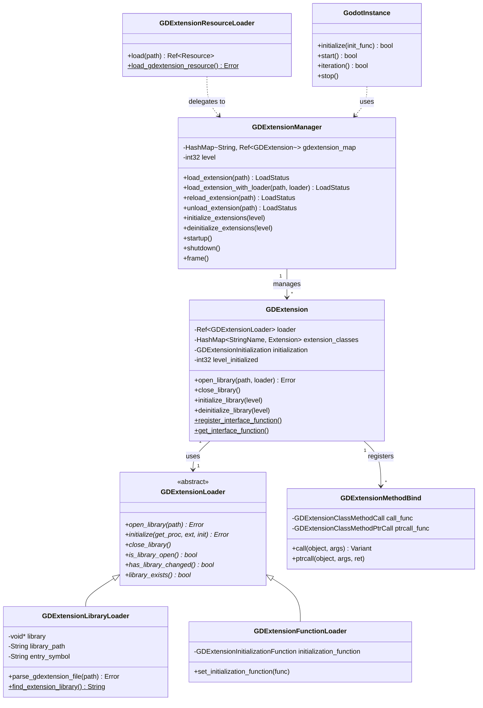

# GDExtension 扩展系统 — Godot vs UE 深度对比分析

> **一句话核心结论**：Godot 用 C ABI + 函数指针表实现了跨语言、跨编译器的原生扩展机制，而 UE 用 C++ 虚函数 + 宏魔法绑定模块，两者在"解耦程度 vs 开发便利性"上做了截然相反的取舍。

---

## 目录

- [第 1 章：模块概览 — "UE 程序员 30 秒速览"](#第-1-章模块概览--ue-程序员-30-秒速览)
- [第 2 章：架构对比 — "同一个问题，两种解法"](#第-2-章架构对比--同一个问题两种解法)
- [第 3 章：核心实现对比 — "代码层面的差异"](#第-3-章核心实现对比--代码层面的差异)
- [第 4 章：UE → Godot 迁移指南](#第-4-章ue--godot-迁移指南)
- [第 5 章：性能对比](#第-5-章性能对比)
- [第 6 章：总结 — "一句话记住"](#第-6-章总结--一句话记住)

---

## 第 1 章：模块概览 — "UE 程序员 30 秒速览"

### 这个模块做什么？

GDExtension 是 Godot 的**原生扩展接口系统**，允许开发者用 C/C++/Rust/Go 等任何能生成动态库的语言编写引擎扩展，无需重新编译引擎。它对标 UE 的 **Plugin/Module 系统 + IModuleInterface**，但设计哲学完全不同：Godot 选择了 **C ABI 作为唯一的二进制接口**，而 UE 使用 **C++ 虚函数 + IMPLEMENT_MODULE 宏**。

### 核心类/结构体列表

| # | Godot 类/结构体 | 职责 | UE 对应物 |
|---|---|---|---|
| 1 | `GDExtension` | 扩展库资源对象，管理一个 .so/.dll 的生命周期 | `FModuleManager::FModuleInfo` |
| 2 | `GDExtensionManager` | 全局单例，管理所有扩展的加载/卸载/初始化 | `FModuleManager` |
| 3 | `GDExtensionLoader` | 抽象加载器基类（策略模式） | 无直接对应（UE 内嵌在 FModuleManager 中） |
| 4 | `GDExtensionLibraryLoader` | 从 .gdextension 配置文件加载动态库 | `FModuleManager` 内部的 DLL 加载逻辑 |
| 5 | `GDExtensionFunctionLoader` | 从函数指针直接加载（用于 libgodot 嵌入场景） | 无直接对应 |
| 6 | `GDExtensionMethodBind` | 将扩展方法绑定到 ClassDB 的方法对象 | `UFunction` + Native 函数指针 |
| 7 | `GDExtensionInitialization` | 初始化回调结构体（C ABI） | `IModuleInterface` 虚函数 |
| 8 | `GDExtensionResourceLoader` | 将 .gdextension 文件作为 Resource 加载 | `.uplugin` 描述文件解析 |
| 9 | `GDExtensionEditorPlugins` | 编辑器插件注册/注销管理 | `IModularFeatures` / Editor Plugin 注册 |
| 10 | `GodotInstance` | 嵌入式 Godot 实例（libgodot 模式） | 无直接对应（UE 不支持被嵌入） |
| 11 | `GDExtensionAPIDump` | 导出引擎 API 的 JSON 描述 | 无直接对应（UE 用 UHT 生成绑定） |
| 12 | `CallableCustomExtension` | 扩展自定义 Callable 实现 | `FNativeFuncPtr` / 自定义委托 |
| 13 | `GDExtensionEditorHelp` | 扩展文档 XML 加载到编辑器帮助系统 | 无直接对应 |

### Godot vs UE 概念速查表

| 概念 | Godot (GDExtension) | UE (Module/Plugin) |
|---|---|---|
| 扩展描述文件 | `.gdextension`（INI 格式 ConfigFile） | `.uplugin`（JSON 格式） |
| 二进制接口 | **C ABI**（函数指针表） | **C++ ABI**（虚函数 + 导出符号） |
| 入口函数 | `GDExtensionInitializationFunction`（C 函数） | `InitializeModule()`（extern "C" 导出） |
| 模块管理器 | `GDExtensionManager`（单例 Object） | `FModuleManager`（单例，非 UObject） |
| 初始化级别 | 4 级：Core → Servers → Scene → Editor | 无分级（StartupModule/ShutdownModule） |
| 热重载 | 支持（TOOLS_ENABLED，保存/恢复实例状态） | 支持（WITH_HOT_RELOAD，类重新实例化） |
| 类注册 | 通过 C ABI 回调注册到 ClassDB | 通过 UHT 生成的反射代码自动注册 |
| 方法绑定 | `GDExtensionMethodBind`（函数指针三件套） | `UFunction` + `UFUNCTION()` 宏 |
| 版本兼容 | `compatibility_minimum` / `compatibility_maximum` | Build ID 匹配 |
| 跨语言支持 | 原生支持（C ABI 天然跨语言） | 仅 C++（蓝图通过反射间接支持） |
| 静态链接模式 | `GDExtensionFunctionLoader`（libgodot） | `IS_MONOLITHIC` + `FStaticallyLinkedModuleRegistrant` |

---

## 第 2 章：架构对比 — "同一个问题，两种解法"

### 2.1 Godot GDExtension 架构



### 2.2 UE Module/Plugin 架构（简要）

UE 的模块系统围绕 `FModuleManager`（单例）和 `IModuleInterface`（接口）构建：

- **`FModuleManager`**（`Runtime/Core/Public/Modules/ModuleManager.h`）：全局单例，维护 `TMap<FName, ModuleInfoRef> Modules`，负责加载/卸载 DLL、调用 `InitializeModule()` 入口函数、管理模块生命周期
- **`IModuleInterface`**（`Runtime/Core/Public/Modules/ModuleInterface.h`）：所有模块必须实现的 C++ 接口，提供 `StartupModule()` / `ShutdownModule()` / `SupportsDynamicReloading()` 等虚函数
- **`IMPLEMENT_MODULE` 宏**：在非单体构建中导出 `extern "C" InitializeModule()` 函数；在单体构建中通过 `FStaticallyLinkedModuleRegistrant` 静态注册
- **`FModuleInfo`**：内部类，存储模块的 DLL 句柄、`IModuleInterface` 实例、加载顺序等

### 2.3 关键架构差异分析

#### 差异 1：C ABI vs C++ ABI — 设计哲学的根本分歧

**Godot 选择了 C ABI 作为扩展接口的唯一边界。** 这意味着引擎和扩展之间的所有通信都通过 C 函数指针完成，没有任何 C++ 类型（虚函数表、模板、异常）跨越 DLL 边界。在 `gdextension_interface.cpp` 中，引擎通过 `gdextension_setup_interface()` 注册了超过 120 个 C 函数到一个 `HashMap<StringName, GDExtensionInterfaceFunctionPtr>` 中，扩展通过 `gdextension_get_proc_address(const char *p_name)` 按名称查找这些函数。

**UE 则直接使用 C++ ABI。** 模块通过 `extern "C" InitializeModule()` 导出一个工厂函数，返回 `IModuleInterface*` 指针，之后所有交互都通过 C++ 虚函数调用。`IMPLEMENT_MODULE` 宏（`ModuleManager.h` 第 870+ 行）在非单体构建中生成这个导出函数，在单体构建中通过 `FStaticallyLinkedModuleRegistrant` 模板类进行静态注册。

**Trade-off 分析**：Godot 的 C ABI 方案牺牲了开发便利性（需要 godot-cpp 等绑定层来包装 C 接口），换来了**编译器无关性**（GCC 编译的扩展可以在 MSVC 编译的引擎上运行）和**语言无关性**（Rust、Go、D 等语言都可以直接调用 C ABI）。UE 的 C++ ABI 方案开发体验更好（直接继承 `IModuleInterface`），但要求扩展和引擎使用**完全相同的编译器版本和编译选项**，这也是 UE 插件经常出现"版本不兼容"问题的根源。

#### 差异 2：分级初始化 vs 扁平生命周期

**Godot 的 GDExtension 有 4 个初始化级别**，定义在 `gdextension.h` 中：

```cpp
enum InitializationLevel {
    INITIALIZATION_LEVEL_CORE = 0,    // 核心类型系统
    INITIALIZATION_LEVEL_SERVERS = 1, // 服务器（渲染、物理等）
    INITIALIZATION_LEVEL_SCENE = 2,   // 场景系统
    INITIALIZATION_LEVEL_EDITOR = 3   // 编辑器
};
```

`GDExtensionManager::initialize_extensions()` 在引擎启动的不同阶段被调用，每个扩展可以声明自己的 `minimum_initialization_level`，只在达到该级别时才开始初始化。反初始化则按相反顺序进行。

**UE 的模块生命周期是扁平的**：`StartupModule()` 在 DLL 加载后调用，`ShutdownModule()` 在卸载前调用。模块间的依赖关系通过 `LoadOrder`（`FModuleInfo::CurrentLoadOrder` 静态计数器）隐式管理——卸载时按加载顺序的逆序执行。

**Trade-off 分析**：Godot 的分级初始化更加精确，扩展可以明确声明自己依赖哪个层级的引擎功能，避免在引擎尚未准备好时就尝试使用高层 API。UE 的扁平模型更简单，但依赖管理完全靠开发者在 `StartupModule()` 中手动 `LoadModuleChecked()` 来保证，容易出现初始化顺序问题。

#### 差异 3：资源化扩展 vs 独立模块

**Godot 将 GDExtension 视为一种 Resource**（`GDExtension` 继承自 `Resource`），通过 `GDExtensionResourceLoader` 像加载纹理、场景一样加载扩展。`.gdextension` 文件是一个 INI 格式的配置文件，描述了不同平台的库路径、依赖项、版本兼容性等。这种设计使得扩展可以被 Godot 的资源系统统一管理，包括缓存、引用计数等。

**UE 的模块是独立于资源系统的**。`FModuleManager` 直接管理 DLL 文件，模块信息存储在 `FModuleInfo` 中（包含 DLL 句柄、文件路径等）。`.uplugin` 文件虽然描述了插件元数据，但它不是 UObject 资源系统的一部分。

**Trade-off 分析**：Godot 的资源化方案使得扩展可以享受资源系统的所有好处（路径解析、平台适配、编辑器集成），但也意味着扩展的加载受限于资源系统的约束。UE 的独立方案更灵活，模块可以在引擎启动的极早期加载（甚至在 UObject 系统初始化之前），但缺少统一的管理接口。

---

## 第 3 章：核心实现对比 — "代码层面的差异"

### 3.1 扩展加载流程

#### Godot 怎么做的

GDExtension 的加载流程涉及多个类的协作，核心路径如下：

**入口**：`GDExtensionManager::load_extension()`（`gdextension_manager.cpp` 第 108 行）

```cpp
// gdextension_manager.cpp
GDExtensionManager::LoadStatus GDExtensionManager::load_extension(const String &p_path) {
    if (Engine::get_singleton()->is_recovery_mode_hint()) {
        return LOAD_STATUS_FAILED;
    }
    Ref<GDExtensionLibraryLoader> loader;
    loader.instantiate();
    return load_extension_with_loader(p_path, loader);
}
```

`load_extension_with_loader()` 创建 `GDExtension` 实例，调用 `open_library()` → `_load_extension_internal()` → `_finish_load_extension()`。

**库加载**：`GDExtensionLibraryLoader::open_library()`（`gdextension_library_loader.cpp` 第 175 行）首先调用 `parse_gdextension_file()` 解析 `.gdextension` 配置文件，提取 `entry_symbol`、`compatibility_minimum`、平台特定的库路径等信息。然后通过 `OS::get_singleton()->open_dynamic_library()` 加载动态库。

**初始化**：`GDExtensionLibraryLoader::initialize()`（第 210 行）通过 `OS::get_dynamic_library_symbol_handle()` 获取入口函数指针，然后调用它：

```cpp
GDExtensionInitializationFunction initialization_function = 
    (GDExtensionInitializationFunction)entry_funcptr;
GDExtensionBool ret = initialization_function(
    p_get_proc_address,  // 引擎提供的函数查找接口
    p_extension.ptr(),   // GDExtension 对象指针（作为 library token）
    r_initialization     // 输出：初始化回调结构体
);
```

扩展的入口函数接收三个参数：一个 `get_proc_address` 函数指针（用于查找引擎 API）、一个 library 指针（用于后续注册类时标识自己）、一个输出结构体（填入初始化/反初始化回调和最低初始化级别）。

#### UE 怎么做的

**入口**：`FModuleManager::LoadModuleWithFailureReason()`（`ModuleManager.h` 中声明，实现在 `ModuleManager.cpp`）

UE 的加载流程：
1. 在 `FModuleMap Modules` 中查找模块名
2. 如果是非单体构建，通过 `OS::get_singleton()->open_dynamic_library()` 加载 DLL
3. 查找 `InitializeModule` 导出符号，调用它获取 `IModuleInterface*`
4. 调用 `IModuleInterface::StartupModule()`
5. 如果是单体构建，从 `StaticallyLinkedModuleInitializers` 中查找预注册的工厂委托

```cpp
// ModuleManager.h - IMPLEMENT_MODULE 宏（非单体构建）
extern "C" DLLEXPORT IModuleInterface* InitializeModule()
{
    return new ModuleImplClass();
}
```

#### 差异点评

| 维度 | Godot | UE |
|---|---|---|
| 入口函数签名 | C 函数，接收 `get_proc_address` + library token | C 函数，返回 `IModuleInterface*` |
| 接口发现 | 运行时按名称查找（`get_proc_address`） | 编译时链接（C++ 虚函数表） |
| 配置文件 | `.gdextension`（INI 格式，含平台/架构标签） | `.uplugin`（JSON 格式）+ `.Build.cs`（C# 构建脚本） |
| 版本检查 | `compatibility_minimum/maximum` 语义版本比较 | Build ID 精确匹配 |
| 错误恢复 | Recovery Mode 下跳过所有扩展加载 | 无内建恢复模式 |

Godot 的方案在**跨平台库选择**上更优雅——`.gdextension` 文件中可以用标签（如 `windows.x86_64`、`linux.arm64`）指定不同平台的库路径，`find_extension_library()` 会自动选择最匹配的库。UE 则依赖 UBT（Unreal Build Tool）在编译时为每个平台生成正确的二进制文件。

### 3.2 类注册机制

#### Godot 怎么做的

GDExtension 通过一系列 C ABI 回调函数将自定义类注册到 Godot 的 `ClassDB` 中。核心函数是 `_register_extension_class_internal()`（`gdextension.cpp` 第 350+ 行）：

```cpp
static void _register_extension_class_internal(
    GDExtensionClassLibraryPtr p_library,        // GDExtension* 指针
    GDExtensionConstStringNamePtr p_class_name,  // 新类名
    GDExtensionConstStringNamePtr p_parent_class_name, // 父类名
    const GDExtensionClassCreationInfo5 *p_extension_funcs, // 回调函数集
    const ClassCreationDeprecatedInfo *p_deprecated_funcs = nullptr
);
```

`GDExtensionClassCreationInfo5` 结构体包含了一个类的所有行为回调：`set_func`、`get_func`、`get_property_list_func`、`notification_func`、`create_instance_func`、`free_instance_func` 等。这些都是 C 函数指针，引擎在需要时通过这些指针调用扩展代码。

注册过程会创建一个 `Extension` 结构体，填充 `ObjectGDExtension` 数据，然后调用 `ClassDB::register_extension_class()` 将其注册到全局类数据库中。

方法注册通过 `_register_extension_class_method()`（第 530 行）完成，它创建 `GDExtensionMethodBind` 对象：

```cpp
// GDExtensionMethodBind 持有三种调用方式的函数指针
GDExtensionClassMethodCall call_func;           // Variant 调用（最灵活）
GDExtensionClassMethodValidatedCall validated_call_func; // 验证调用
GDExtensionClassMethodPtrCall ptrcall_func;     // 指针调用（最快）
```

#### UE 怎么做的

UE 的类注册完全由 **UHT（Unreal Header Tool）** 在编译时自动完成。开发者只需在头文件中使用宏：

```cpp
// UE 方式
UCLASS()
class MYPLUGIN_API UMyClass : public UObject {
    GENERATED_BODY()
    
    UFUNCTION(BlueprintCallable)
    void MyMethod();
    
    UPROPERTY(EditAnywhere)
    float MyProperty;
};
```

UHT 扫描这些宏，生成 `.generated.h` 和 `.gen.cpp` 文件，其中包含反射注册代码。运行时通过 `UClass` 的静态构造函数自动注册到 `UObjectBase` 系统中。

#### 差异点评

**Godot 的手动注册 vs UE 的自动生成**是两种截然不同的策略：

- **Godot**：扩展开发者（或绑定库如 godot-cpp）需要显式调用注册函数，逐个注册类、方法、属性、信号。这给了开发者完全的控制权，但也意味着大量的样板代码。godot-cpp 通过 C++ 模板和宏来简化这个过程，但底层仍然是 C ABI 调用。
- **UE**：UHT 自动处理一切，开发者只需要写标准 C++ 代码加上宏标注。这极大地减少了样板代码，但也引入了对 UHT 工具链的强依赖，且无法支持 C++ 以外的语言。

Godot 的方案在**版本兼容性**上做了大量工作——从 `_register_extension_class` 到 `_register_extension_class5`，每个版本的注册函数都保留了向后兼容的适配层（`gdextension.cpp` 第 200-350 行），旧版扩展的回调会被转换为最新版本的格式。UE 则通过 Build ID 严格匹配，不兼容就直接拒绝加载。

### 3.3 接口函数表（C ABI 桥接层）

#### Godot 怎么做的

`gdextension_interface.cpp`（1871 行）是整个 GDExtension 系统的核心——它定义了引擎暴露给扩展的所有 C 函数。`gdextension_setup_interface()` 函数（第 1740+ 行）通过 `REGISTER_INTERFACE_FUNC` 宏注册了超过 120 个函数：

```cpp
#define REGISTER_INTERFACE_FUNC(m_name) \
    GDExtension::register_interface_function(#m_name, \
        (GDExtensionInterfaceFunctionPtr)&gdextension_##m_name)

void gdextension_setup_interface() {
    REGISTER_INTERFACE_FUNC(get_godot_version2);
    REGISTER_INTERFACE_FUNC(mem_alloc2);
    REGISTER_INTERFACE_FUNC(mem_free2);
    REGISTER_INTERFACE_FUNC(variant_new_copy);
    REGISTER_INTERFACE_FUNC(variant_call);
    REGISTER_INTERFACE_FUNC(object_method_bind_call);
    REGISTER_INTERFACE_FUNC(classdb_get_method_bind);
    REGISTER_INTERFACE_FUNC(classdb_construct_object2);
    // ... 100+ more
}
```

这些函数覆盖了：
- **内存管理**：`mem_alloc2`、`mem_realloc2`、`mem_free2`
- **Variant 操作**：创建、销毁、调用、类型转换、运算符等（约 50 个函数）
- **字符串操作**：UTF-8/16/32/Latin1 编码转换（约 20 个函数）
- **Object 操作**：方法调用、实例绑定、类型转换等
- **ClassDB 操作**：构造对象、获取方法绑定、获取类标签
- **编辑器操作**：添加/移除插件、加载帮助文档

扩展通过 `get_proc_address("function_name")` 获取这些函数的指针，然后直接调用。

#### UE 怎么做的

UE 没有等价的"接口函数表"概念。模块直接链接引擎的 C++ 头文件和导入库，通过正常的 C++ 函数调用访问引擎 API。所有的 `CORE_API`、`ENGINE_API` 等宏标记的类和函数都可以直接使用。

```cpp
// UE 模块直接使用引擎 API
#include "Engine/Engine.h"
#include "UObject/UObjectGlobals.h"

void UMyClass::DoSomething() {
    // 直接调用，无需函数指针查找
    UObject* Obj = NewObject<UMyOtherClass>();
    GEngine->AddOnScreenDebugMessage(-1, 5.f, FColor::Red, TEXT("Hello"));
}
```

#### 差异点评

Godot 的函数指针表方案有几个显著优势：

1. **ABI 稳定性**：函数通过名称查找，即使引擎内部重构了函数签名，只要保留旧名称的兼容实现，扩展就不会崩溃
2. **按需加载**：扩展只获取自己需要的函数指针，不需要链接整个引擎
3. **版本协商**：扩展可以先检查函数是否存在，再决定是否使用新功能

但代价是**间接调用开销**（每次调用都是函数指针间接跳转）和**开发复杂度**（需要绑定层来包装这些 C 函数）。

UE 的直接链接方案开发体验极佳，但**任何引擎 API 变更都可能导致二进制不兼容**，这也是为什么 UE 插件在引擎版本升级时经常需要重新编译。

### 3.4 热重载机制

#### Godot 怎么做的

GDExtension 的热重载实现在 `gdextension.cpp` 的 `prepare_reload()` 和 `finish_reload()` 中（仅 `TOOLS_ENABLED` 编辑器构建）：

**准备阶段**（`prepare_reload()`，第 900+ 行）：
1. 标记所有扩展类和方法为 `is_reloading = true`
2. 遍历所有实例，保存它们的属性状态到 `instance_state`
3. 只保存 `PROPERTY_USAGE_STORAGE` 标记的属性，且跳过默认值

**卸载/重新加载**（`GDExtensionManager::reload_extension()`，`gdextension_manager.cpp` 第 145 行）：
1. 调用 `_unload_extension_internal()` 反初始化
2. 调用 `clear_instance_bindings()` 清理实例绑定
3. 关闭旧库，打开新库
4. 调用 `_load_extension_internal()` 重新初始化

**完成阶段**（`finish_reload()`，第 960+ 行）：
1. 清理未重新注册的类和方法（标记为 invalid）
2. 对存活的实例调用 `reset_internal_extension()` 重新绑定扩展数据
3. 恢复之前保存的属性状态
4. 发送 `NOTIFICATION_EXTENSION_RELOADED` 通知

```cpp
// gdextension.cpp - finish_reload() 关键逻辑
for (KeyValue<StringName, Extension> &E : extension_classes) {
    for (const KeyValue<ObjectID, Extension::InstanceState> &S : E.value.instance_state) {
        Object *obj = ObjectDB::get_instance(S.key);
        if (!obj) continue;
        // 恢复属性
        for (const Pair<String, Variant> &state : S.value.properties) {
            obj->set(state.first, state.second);
        }
    }
}
```

#### UE 怎么做的

UE 的热重载（`WITH_HOT_RELOAD`）通过 `GIsHotReload` 全局标志和 `GetClassesToReinstanceForHotReload()` 实现。核心思路是：
1. 编译新的 DLL（带唯一后缀）
2. 加载新 DLL，创建新的 `UClass` 对象
3. 通过 `FBlueprintCompileReinstancer` 将旧类的所有实例迁移到新类
4. 卸载旧 DLL

UE 的方案更重量级，涉及整个 UObject 系统的类重新实例化。

#### 差异点评

Godot 的热重载更轻量——它直接在原有对象上替换扩展数据（`ObjectGDExtension`），不需要重新创建对象。这得益于 GDExtension 的"组合优于继承"设计：扩展数据是对象的一个附加层，可以独立替换。

UE 的热重载更彻底但也更危险——它需要重新实例化所有受影响的对象，这在大型场景中可能非常耗时，且容易出现引用悬挂问题。不过 UE 的 Live Coding 功能在某些场景下可以避免完整的热重载。

---

## 第 4 章：UE → Godot 迁移指南

### 4.1 思维转换清单

1. **忘掉 UHT，拥抱手动注册**：UE 程序员习惯了 `UCLASS()`、`UFUNCTION()` 宏自动生成反射代码。在 Godot GDExtension 中，你需要通过 godot-cpp 的 `ClassDB::bind_method()` 手动注册每个方法和属性。虽然 godot-cpp 提供了类似的宏简化，但底层机制完全不同——不是代码生成，而是运行时注册。

2. **忘掉 C++ ABI 依赖，理解 C ABI 边界**：UE 模块可以直接 `#include` 引擎头文件并调用 C++ API。GDExtension 的所有引擎交互都通过 C 函数指针进行。godot-cpp 封装了这些细节，但你需要理解：你的代码和引擎运行在不同的 C++ 运行时中，不能直接传递 C++ 对象（如 `std::string`）跨越边界。

3. **忘掉扁平的 StartupModule，理解分级初始化**：GDExtension 有 4 个初始化级别。如果你的扩展需要使用场景节点，必须声明 `minimum_initialization_level = SCENE`。在 Core 级别初始化时尝试创建 Node 会失败。

4. **忘掉 Build ID 精确匹配，理解语义版本兼容**：UE 插件必须和引擎版本精确匹配。GDExtension 使用 `compatibility_minimum` / `compatibility_maximum` 语义版本范围，一个扩展可以兼容多个 Godot 版本。

5. **忘掉 .Build.cs 构建系统，理解 .gdextension 配置**：UE 用 C# 脚本（`.Build.cs`）描述模块依赖和编译选项。Godot 用简单的 INI 格式 `.gdextension` 文件描述库路径和平台标签，构建系统（SCons/CMake）完全独立于引擎。

6. **忘掉 UObject 反射的自动性，理解 Variant 类型系统**：UE 的 `FProperty` 系统自动处理序列化和反射。GDExtension 中，你需要通过 Variant 类型系统手动处理类型转换，godot-cpp 的 `ptrcall` 机制可以绕过 Variant 获得更好的性能。

### 4.2 API 映射表

| UE API / 概念 | Godot GDExtension 等价 | 说明 |
|---|---|---|
| `IMPLEMENT_MODULE(MyModule, ModuleName)` | `.gdextension` 文件 + 入口函数 | Godot 不需要宏，用配置文件声明入口 |
| `IModuleInterface::StartupModule()` | `GDExtensionInitialization::initialize` 回调 | 按级别调用，不是一次性的 |
| `IModuleInterface::ShutdownModule()` | `GDExtensionInitialization::deinitialize` 回调 | 按级别逆序调用 |
| `FModuleManager::Get().LoadModule()` | `GDExtensionManager::load_extension()` | 路径是 `.gdextension` 文件路径 |
| `FModuleManager::Get().UnloadModule()` | `GDExtensionManager::unload_extension()` | 会触发反初始化 |
| `FModuleManager::Get().IsModuleLoaded()` | `GDExtensionManager::is_extension_loaded()` | 按路径查询 |
| `UCLASS()` / `GENERATED_BODY()` | `classdb_register_extension_class5()` | 手动注册或通过 godot-cpp 宏 |
| `UFUNCTION(BlueprintCallable)` | `classdb_register_extension_class_method()` | 需要填充 `GDExtensionClassMethodInfo` |
| `UPROPERTY(EditAnywhere)` | `classdb_register_extension_class_property()` | 需要指定 setter/getter 函数名 |
| `NewObject<T>()` | `classdb_construct_object2()` | 通过 C ABI 函数指针调用 |
| `Cast<T>(Obj)` | `object_cast_to()` + class tag | 基于 class tag 指针比较 |
| `GEngine->AddOnScreenDebugMessage()` | `print_error()` / `print_warning()` | C ABI 日志函数 |
| `FModuleManager::FModulesChangedEvent` | `GDExtensionManager::extensions_reloaded` 信号 | Godot 使用信号系统 |
| `.uplugin` JSON 描述 | `.gdextension` INI 配置 | 格式不同，信息类似 |
| `IS_MONOLITHIC` 单体构建 | `GDExtensionFunctionLoader` (libgodot) | Godot 通过函数指针直接加载 |

### 4.3 陷阱与误区

#### 陷阱 1：不要跨 DLL 边界传递 C++ 对象

UE 程序员习惯在模块间传递 `FString`、`TArray` 等 C++ 对象。在 GDExtension 中，**所有跨边界的数据必须通过 C ABI 类型传递**。Godot 的 `StringName`、`String`、`Variant` 等类型在 C ABI 层面都是不透明指针（`GDExtensionStringNamePtr`、`GDExtensionVariantPtr`），godot-cpp 会自动处理转换，但如果你直接使用 C ABI，必须使用引擎提供的构造/析构函数。

```cpp
// 错误：直接传递 C++ 字符串
void my_func(const std::string& str); // ❌ 跨 ABI 边界不安全

// 正确：使用 Godot 的 String 类型（通过 C ABI 函数操作）
void my_func(GDExtensionConstStringPtr p_str); // ✅
```

#### 陷阱 2：初始化级别不匹配导致的崩溃

如果你的扩展在 `INITIALIZATION_LEVEL_CORE` 时尝试注册继承自 `Node` 的类，会失败，因为 `Node` 类在 `INITIALIZATION_LEVEL_SCENE` 才注册。UE 没有这个问题，因为所有引擎类在模块加载前就已经注册完毕。

```cpp
// .gdextension 文件中必须正确声明
[configuration]
entry_symbol = "my_extension_init"
compatibility_minimum = "4.3"

// 入口函数中必须设置正确的最低级别
void my_extension_init(..., GDExtensionInitialization *r_initialization) {
    r_initialization->minimum_initialization_level = GDEXTENSION_INITIALIZATION_SCENE;
    // 不要设为 CORE，除非你只注册不依赖场景系统的类
}
```

#### 陷阱 3：热重载时的方法签名变更

Godot 的热重载会尝试复用已有的 `GDExtensionMethodBind` 对象（`try_update()`，`gdextension.cpp` 第 140 行）。如果方法签名发生了不兼容的变更（参数数量、类型、static/vararg 标志），旧的 MethodBind 会被标记为 `valid = false` 并放入 `invalid_methods` 列表。调用这些方法会打印错误而不是崩溃，但行为可能不符合预期。UE 的热重载会完全重新实例化对象，不存在这个问题。

### 4.4 最佳实践

1. **使用 godot-cpp 而不是裸 C ABI**：godot-cpp 提供了类似 UE 的开发体验，包括 `GDCLASS` 宏、`ClassDB::bind_method()` 等，大幅减少样板代码。

2. **善用 `compatibility_minimum`**：设置为你实际测试过的最低 Godot 版本，而不是随意设置。这样你的扩展可以在多个 Godot 版本上工作。

3. **在编辑器构建中启用 `reloadable`**：在 `.gdextension` 文件中设置 `reloadable = true`，并确保你的类实现了 `recreate_instance_func`，这样可以在编辑器中实现热重载，大幅提升开发效率。

4. **利用 ptrcall 优化性能**：GDExtensionMethodBind 支持三种调用方式——`call`（Variant）、`validated_call`、`ptrcall`（指针）。对于性能敏感的方法，确保提供 `ptrcall_func`，它避免了 Variant 装箱/拆箱的开销。

5. **使用 `extension_api.json` 验证兼容性**：Godot 可以导出 `extension_api.json`（通过 `GDExtensionAPIDump`），godot-cpp 使用它来生成绑定代码。在 CI 中验证你的扩展与目标 Godot 版本的 API 兼容性。

---

## 第 5 章：性能对比

### 5.1 Godot GDExtension 的性能特征

#### 函数调用开销

GDExtension 的方法调用有三个层级，性能从低到高：

1. **Variant Call**（`call_func`）：最灵活但最慢，参数和返回值都是 `Variant`，涉及类型检查和装箱/拆箱。适用于 GDScript 调用扩展方法的场景。

2. **Validated Call**（`validated_call_func`）：参数已经过类型验证，但仍然是 `Variant` 格式。如果扩展没有提供 `validated_call_func`，引擎会自动回退到 ptrcall 路径（`gdextension.cpp` 第 110-130 行）：
   ```cpp
   if (validated_call_func) {
       validated_call_func(method_userdata, extension_instance, ...);
   } else {
       // 回退到 ptrcall，比 variant call 快
       const void **argptrs = (const void **)alloca(argument_count * sizeof(void *));
       for (uint32_t i = 0; i < argument_count; i++) {
           argptrs[i] = VariantInternal::get_opaque_pointer(p_args[i]);
       }
       ptrcall_func(method_userdata, extension_instance, ...);
   }
   ```

3. **PtrCall**（`ptrcall_func`）：最快，参数直接以原始指针传递，无 Variant 开销。这是 C++ 扩展间调用的首选路径。

#### 接口函数查找开销

`gdextension_get_proc_address()` 通过 `HashMap<StringName, GDExtensionInterfaceFunctionPtr>` 查找函数指针。这是 O(1) 的哈希查找，但只在初始化时执行一次——扩展会缓存获取到的函数指针，后续调用直接使用缓存的指针，没有额外开销。

#### 动态库加载开销

`GDExtensionLibraryLoader::open_library()` 涉及：
- 解析 `.gdextension` 配置文件（`ConfigFile::load()`）
- 版本兼容性检查（字符串解析 + 数值比较）
- 平台库路径匹配（遍历 `[libraries]` 节的所有键）
- `OS::open_dynamic_library()`（操作系统级 DLL 加载）

这些操作只在启动时执行一次，不影响运行时性能。

### 5.2 与 UE 的性能差异

| 维度 | Godot GDExtension | UE Module |
|---|---|---|
| 方法调用（C++ → C++） | ptrcall：1 次函数指针间接跳转 | 直接虚函数调用或内联 |
| 方法调用（脚本 → 原生） | Variant call：类型检查 + 装箱 | Blueprint VM → Native：类似开销 |
| 模块加载时间 | 解析 INI + dlopen | dlopen（无额外解析） |
| 内存开销 | 每个方法 1 个 `GDExtensionMethodBind` 对象 | 每个方法 1 个 `UFunction` 对象（更重） |
| 接口函数查找 | HashMap 查找（初始化时一次） | 编译时链接（零开销） |
| 热重载 | 轻量（替换扩展数据，保留对象） | 重量（重新实例化所有对象） |

**关键性能差异**：Godot 的 ptrcall 路径与 UE 的直接 C++ 调用相比，多了一次函数指针间接跳转。在现代 CPU 上，这个开销通常可以忽略（几纳秒），但在极端热路径（如每帧调用百万次的物理计算）中可能累积。UE 的优势在于编译器可以对直接调用进行内联优化，而函数指针调用无法内联。

### 5.3 性能敏感场景的建议

1. **优先使用 ptrcall**：确保你的 godot-cpp 绑定生成了 ptrcall 路径。对于高频调用的方法，ptrcall 比 Variant call 快一个数量级。

2. **批量操作优于逐个调用**：由于每次跨 ABI 调用都有固定开销，尽量设计批量操作的 API（如一次传入数组而不是逐个元素调用）。

3. **避免在热路径中使用 Variant**：Variant 的装箱/拆箱涉及内存分配和类型检查。在性能敏感的代码中，使用类型化的 API（如 `PackedFloat64Array` 而不是 `Array`）。

4. **考虑使用 `register_main_loop_callbacks`**：GDExtension 支持注册主循环回调（`startup_callback`、`shutdown_callback`、`frame_callback`），这些回调直接在引擎主循环中执行，避免了通过 ClassDB 的间接调用开销。

5. **热重载的性能影响**：热重载过程中会遍历所有实例保存/恢复状态，对于大量实例的场景可能造成明显的卡顿。在性能测试时应禁用热重载（`reloadable = false`）。

---

## 第 6 章：总结 — "一句话记住"

### 核心差异

**Godot 用 C ABI 函数指针表实现了"编译器无关、语言无关"的扩展系统；UE 用 C++ ABI + UHT 代码生成实现了"开发体验优先"的模块系统。**

### 设计亮点（Godot 做得比 UE 好的地方）

1. **跨语言支持**：C ABI 天然支持任何能生成动态库的语言（Rust、Go、D、Zig 等），而 UE 只支持 C++。这使得 Godot 的扩展生态更加多元化。

2. **版本兼容性**：`compatibility_minimum` / `compatibility_maximum` 语义版本范围允许一个扩展兼容多个 Godot 版本，而 UE 的 Build ID 精确匹配意味着每次引擎更新都需要重新编译插件。

3. **轻量热重载**：Godot 的热重载只替换扩展数据而不重新创建对象，比 UE 的完整重新实例化更快、更安全。

4. **嵌入式支持**：`libgodot` + `GodotInstance` 允许将 Godot 引擎嵌入到其他应用程序中，UE 不支持这种使用模式。

5. **Recovery Mode**：`GDExtensionManager` 在恢复模式下会跳过所有扩展加载，防止有问题的扩展导致编辑器无法启动。UE 没有类似的内建机制。

### 设计短板（Godot 不如 UE 的地方）

1. **开发体验**：即使有 godot-cpp，GDExtension 的开发体验仍然不如 UE 的 `UCLASS()` / `UFUNCTION()` 宏 + UHT 自动生成。手动注册类、方法、属性的样板代码较多。

2. **调试支持**：C ABI 边界使得跨 DLL 调试更困难。UE 的 C++ 模块可以无缝单步调试进入引擎代码。

3. **编译时类型安全**：UE 的 UHT 在编译时验证反射标注的正确性。GDExtension 的注册错误只能在运行时发现。

4. **工具链成熟度**：UE 的 UBT + UHT 工具链经过多年打磨，自动处理模块依赖、平台适配、增量编译等。Godot 的 GDExtension 构建需要开发者自行配置 SCons/CMake。

5. **线程安全**：UE 的 `FModuleManager` 使用 `FCriticalSection` 保护模块映射表的并发访问。Godot 的 `GDExtensionManager` 没有显式的线程安全保护，依赖于引擎的单线程加载假设。

### UE 程序员的学习路径建议

1. **第一步**：阅读 `core/extension/gdextension_loader.h`（47 行）— 理解加载器抽象接口，这是整个系统的设计基础
2. **第二步**：阅读 `core/extension/gdextension.h`（242 行）— 理解 `GDExtension` 类的结构，特别是 `Extension` 内部结构体和初始化级别枚举
3. **第三步**：阅读 `core/extension/gdextension_manager.h`（105 行）+ `.cpp`（500 行）— 理解扩展的完整生命周期管理
4. **第四步**：阅读 `core/extension/gdextension_library_loader.cpp`（396 行）— 理解 `.gdextension` 文件解析和动态库加载的具体实现
5. **第五步**：浏览 `core/extension/gdextension_interface.cpp`（1871 行）— 不需要逐行阅读，重点看 `gdextension_setup_interface()` 函数了解引擎暴露了哪些 C ABI 函数
6. **第六步**：阅读 `core/extension/gdextension.cpp` 中的 `_register_extension_class_internal()` 和 `GDExtensionMethodBind` 类 — 理解类和方法的注册机制

**推荐对照阅读**：在阅读 Godot 源码的同时，对照 UE 的 `Runtime/Core/Public/Modules/ModuleManager.h` 和 `ModuleInterface.h`，你会发现两个引擎在解决同一个问题（"如何让第三方代码扩展引擎"）时做出了多么不同的设计选择。
