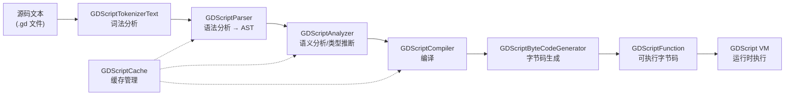
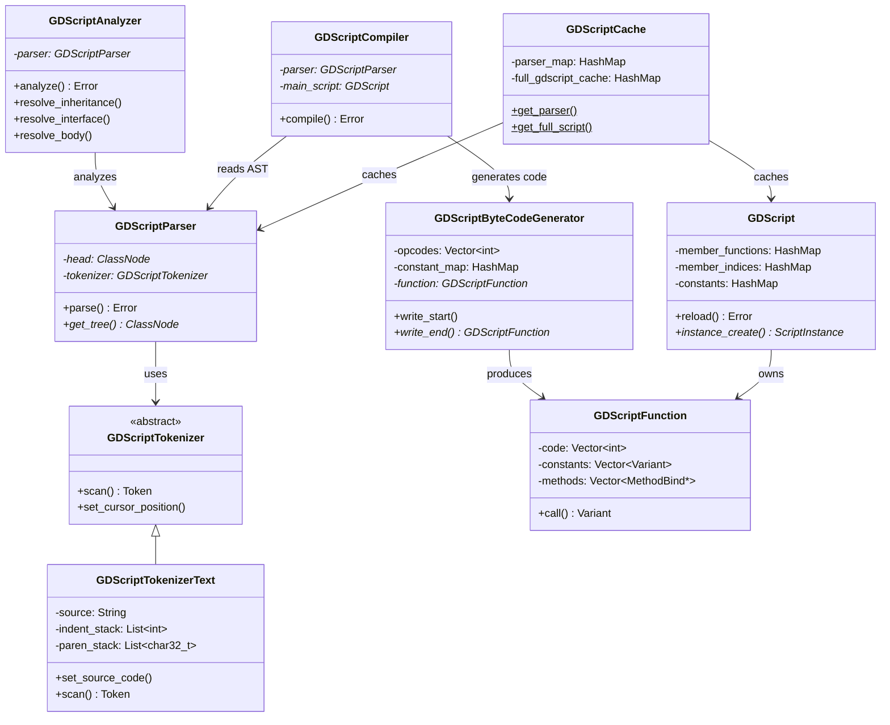

# GDScript 脚本系统深度分析：Godot 自研脚本语言 vs UE Blueprint VM

> **一句话总结**：GDScript 是一套从词法分析到字节码 VM 的完整自研编译管线，对标 UE 的 Blueprint VM + Kismet 编译器，以"轻量文本脚本"取代"可视化节点图"，换取更快的迭代速度和更低的认知负担。

---

## 目录

- [第 1 章：模块概览 — "UE 程序员 30 秒速览"](#第-1-章模块概览--ue-程序员-30-秒速览)
- [第 2 章：架构对比 — "同一个问题，两种解法"](#第-2-章架构对比--同一个问题两种解法)
- [第 3 章：核心实现对比 — "代码层面的差异"](#第-3-章核心实现对比--代码层面的差异)
- [第 4 章：UE → Godot 迁移指南](#第-4-章ue--godot-迁移指南)
- [第 5 章：性能对比](#第-5-章性能对比)
- [第 6 章：总结 — "一句话记住"](#第-6-章总结--一句话记住)

---

## 第 1 章：模块概览 — "UE 程序员 30 秒速览"

### 1.1 模块定位

GDScript 是 Godot 引擎的**自研脚本语言**，涵盖从源码文本到字节码执行的完整编译管线。它在 Godot 中的角色等同于 UE 中 **Blueprint 可视化脚本 + Kismet 字节码编译器 + Blueprint VM** 的组合——都是引擎内置的、面向游戏逻辑的高级脚本系统。

关键区别在于：UE 选择了**可视化节点图**（Blueprint Graph）作为脚本的表现形式，而 Godot 选择了**类 Python 的文本语言**。这一选择深刻影响了两个引擎的编译管线架构、运行时性能特征和开发者体验。

### 1.2 核心类/结构体列表

| # | Godot 类 | 源码位置 | 职责 | UE 对应物 |
|---|---------|---------|------|----------|
| 1 | `GDScriptTokenizer` | `gdscript_tokenizer.h` | 词法分析器基类，将源码文本拆分为 Token 流 | 无直接对应（Blueprint 是可视化节点，无需词法分析） |
| 2 | `GDScriptTokenizerText` | `gdscript_tokenizer.h:248` | 文本词法分析器实现，处理缩进/换行 | 无直接对应 |
| 3 | `GDScriptParser` | `gdscript_parser.h` | 语法分析器，将 Token 流构建为 AST | `FKismetCompilerContext`（将 Blueprint Graph 转为中间表示） |
| 4 | `GDScriptParser::DataType` | `gdscript_parser.h:97` | 类型系统核心，表示编译期类型信息 | `FEdGraphPinType`（Blueprint 引脚类型） |
| 5 | `GDScriptAnalyzer` | `gdscript_analyzer.h` | 语义分析器，类型推断/检查/继承解析 | `FKismetCompilerContext::ValidateNode()` |
| 6 | `GDScriptCompiler` | `gdscript_compiler.h` | 编译器，将 AST 转为字节码 | `FKismetCompilerContext::CompileFunction()` |
| 7 | `GDScriptByteCodeGenerator` | `gdscript_byte_codegen.h` | 字节码生成器，产出 `GDScriptFunction` | `FScriptBuilderBase`（生成 Blueprint 字节码） |
| 8 | `GDScriptFunction` | `gdscript_function.h` | 运行时函数对象，持有字节码和常量池 | `UFunction`（持有 Blueprint 字节码 `Script[]`） |
| 9 | `GDScript` | `gdscript.h` | 脚本资源类，持有成员函数/变量/子类 | `UBlueprintGeneratedClass` |
| 10 | `GDScriptInstance` | `gdscript.h:370` | 脚本实例，绑定到具体 Object | `UObject` 实例（Blueprint 实例化后的对象） |
| 11 | `GDScriptLanguage` | `gdscript.h:420` | 语言单例，管理全局状态/调试/调用栈 | `FScriptCore` + `UEdGraphSchema_K2` |
| 12 | `GDScriptCache` | `gdscript_cache.h` | 脚本缓存系统，管理解析/编译状态 | `FBlueprintCompilationManager` |
| 13 | `GDScriptFunctionState` | `gdscript_function.h:600` | 协程状态对象，支持 `await` | `FLatentActionInfo` + `UBlueprintAsyncActionBase` |
| 14 | `GDScriptLambdaCallable` | `gdscript_lambda_callable.h` | Lambda 闭包的 Callable 封装 | 无直接对应（Blueprint 不支持 Lambda） |
| 15 | `GDScriptCodeGenerator` | `gdscript_codegen.h` | 代码生成器抽象接口 | `FKismetFunctionContext` |

### 1.3 Godot vs UE 概念速查表

| 概念 | Godot (GDScript) | UE (Blueprint) |
|------|------------------|----------------|
| 脚本语言形式 | 类 Python 文本语言 | 可视化节点图 |
| 编译管线 | Tokenizer → Parser → Analyzer → Compiler → ByteCode | Graph → KismetCompiler → Blueprint Bytecode |
| 字节码格式 | `Vector<int>` 整数数组 + 操作数内联 | `TArray<uint8> Script` 字节数组 |
| VM 分发方式 | Computed goto（GCC/Clang）/ switch-case（MSVC） | 函数指针表 `GNatives[]` |
| 类型系统 | 渐进式类型（可选类型注解） | 强类型（引脚类型固定） |
| 异步编程 | `await` 关键字 + Signal | Latent Action + Async Task |
| 热重载 | 保存即重载（脚本级） | Live Coding（C++ 级）/ Blueprint 重编译 |
| 调试 | 内置断点 + 远程调试器 | Blueprint Debugger + Visual Studio |
| 闭包/Lambda | 原生支持 `func(x): return x + 1` | 不支持（需用事件分发器模拟） |
| 继承模型 | 单继承 + `extends` 关键字 | 单继承 + Blueprint 父类 |
| 导出属性 | `@export` 注解 | `UPROPERTY(EditAnywhere)` |
| 信号/事件 | `signal` 关键字 + `emit` | Event Dispatcher / Delegate |

---

## 第 2 章：架构对比 — "同一个问题，两种解法"

### 2.1 GDScript 编译管线架构

GDScript 采用经典的**五阶段编译管线**，从源码文本到可执行字节码：



**核心类关系图：**



### 2.2 UE Blueprint 编译管线架构

UE 的 Blueprint 编译管线与 GDScript 有本质不同——它的"源码"不是文本，而是**可视化节点图**：

```
Blueprint Graph (UEdGraph)
    → FKismetCompilerContext (Kismet 编译器)
        → FKismetFunctionContext (函数编译上下文)
            → UBlueprintGeneratedClass (生成的类)
                → UFunction::Script[] (字节码)
                    → ProcessLocalScriptFunction (VM 执行)
```

UE 的关键类：
- `UBlueprint`：Blueprint 资产，持有 `UEdGraph` 节点图
- `FKismetCompilerContext`：Kismet 编译器上下文，负责将节点图转为字节码
- `UBlueprintGeneratedClass`：编译产物，继承自 `UClass`
- `UFunction`：持有 `TArray<uint8> Script` 字节码数组
- `ScriptCore.cpp::ProcessLocalScriptFunction()`：Blueprint VM 执行循环

### 2.3 关键架构差异分析

#### 差异一：文本语言 vs 可视化节点图 — 根本性的设计哲学分歧

GDScript 选择了**文本语言**作为脚本形式，这意味着它需要一套完整的编译器前端（Tokenizer → Parser → Analyzer），这在 `gdscript_tokenizer.h`、`gdscript_parser.h`、`gdscript_analyzer.h` 中实现。GDScriptParser 定义了超过 30 种 AST 节点类型（`ClassNode`、`FunctionNode`、`VariableNode`、`AwaitNode` 等），构成了一棵完整的抽象语法树。

UE 的 Blueprint 则完全跳过了词法和语法分析阶段——因为"源码"就是已经结构化的节点图（`UEdGraph` + `UEdGraphNode`）。Kismet 编译器直接遍历节点图生成字节码，不需要 Tokenizer 和 Parser。

**Trade-off 分析**：GDScript 的文本形式带来了更好的版本控制体验（diff/merge 友好）、更快的编辑速度（键盘 > 鼠标拖线）、更低的存储开销。但 Blueprint 的可视化形式对非程序员更友好，且节点图天然具有"自文档化"特性。从源码规模看，GDScript 的编译器前端（tokenizer + parser + analyzer）合计超过 13000 行代码，这是 UE Blueprint 不需要承担的复杂度。

#### 差异二：渐进式类型 vs 强类型 — 类型系统的设计取舍

GDScript 采用**渐进式类型系统**（Gradual Typing），在 `GDScriptParser::DataType` 中通过 `TypeSource` 枚举区分四种类型来源：

```cpp
// gdscript_parser.h
enum TypeSource {
    UNDETECTED,           // 完全动态，可以是任何类型
    INFERRED,             // 推断出类型，但仍然是动态的
    ANNOTATED_EXPLICIT,   // 显式类型注解，静态类型
    ANNOTATED_INFERRED,   // 静态类型但来自赋值推断
};
```

这意味着 GDScript 代码可以完全不写类型注解（像 Python 一样动态），也可以加上类型注解获得静态检查和性能优化。`GDScriptAnalyzer` 在语义分析阶段进行类型推断和兼容性检查（`is_type_compatible()`），但不会因为缺少类型注解而报错。

UE Blueprint 则是**强类型系统**——每个引脚（Pin）都有固定的 `FEdGraphPinType`，连线时必须类型匹配。这在编辑时就能捕获类型错误，但也增加了使用门槛。

**Trade-off 分析**：GDScript 的渐进式类型降低了入门门槛，允许快速原型开发，但可能在运行时才发现类型错误。UE Blueprint 的强类型在编辑时就能捕获错误，但每次修改都需要确保类型匹配。从 VM 性能角度看，GDScript 有类型注解时可以生成 `OPCODE_*_VALIDATED` 系列优化指令（如 `OPCODE_CALL_METHOD_BIND_VALIDATED_RETURN`），直接使用函数指针调用，跳过运行时类型查找。

#### 差异三：单文件自包含 vs 分离式资产 — 模块耦合方式

GDScript 的一个 `.gd` 文件就是一个完整的类定义，包含继承声明、成员变量、函数、信号、内部类等所有信息。`GDScript` 类（`gdscript.h`）直接持有 `member_functions`、`member_indices`、`constants`、`subclasses` 等 HashMap，形成自包含的类结构。

UE 的 Blueprint 则是一个复杂的资产系统：`UBlueprint` 持有多个 `UEdGraph`（事件图、函数图、宏图），编译后生成 `UBlueprintGeneratedClass`，类的成员信息分散在 `UFunction`、`FProperty`、`UEnum` 等多个 UObject 子类中。

**Trade-off 分析**：GDScript 的自包含设计使得脚本加载和缓存更简单（`GDScriptCache` 只需管理路径到脚本的映射），但不支持 Blueprint 那样的"组件化"编辑（如单独编辑一个函数图）。UE 的分离式设计支持更细粒度的编辑和版本控制，但增加了资产管理的复杂度。

---

## 第 3 章：核心实现对比 — "代码层面的差异"

### 3.1 编译管线：Tokenizer → Parser → Analyzer → Compiler → ByteCode

#### Godot 的实现

**词法分析（Tokenizer）**

`GDScriptTokenizerText`（`gdscript_tokenizer.h:248`）是一个手写的词法分析器，逐字符扫描源码文本。它的核心特性是**缩进敏感**——通过 `indent_stack` 跟踪缩进层级，在缩进变化时生成 `INDENT` 和 `DEDENT` Token：

```cpp
// gdscript_tokenizer.h
List<int> indent_stack;
List<List<int>> indent_stack_stack; // 用于 Lambda 的缩进栈嵌套
List<char32_t> paren_stack;        // 括号匹配栈
char32_t indent_char = '\0';       // 缩进字符（tab 或 space）
```

Token 类型定义了约 130 种 Token（`Token::Type` 枚举），涵盖关键字、运算符、字面量等。值得注意的是，GDScript 的 Token 中包含 `AWAIT`、`SIGNAL`、`PRELOAD` 等 Godot 特有的关键字。

**语法分析（Parser）**

`GDScriptParser`（`gdscript_parser.h`）使用 **Pratt 解析器**（运算符优先级解析）处理表达式，使用递归下降处理语句和声明。它定义了完整的优先级表：

```cpp
// gdscript_parser.h
enum Precedence {
    PREC_NONE,
    PREC_ASSIGNMENT,
    PREC_CAST,
    PREC_TERNARY,
    PREC_LOGIC_OR,
    // ... 直到
    PREC_PRIMARY,
};
```

每种 Token 类型关联一个 `ParseRule`，包含前缀解析函数、中缀解析函数和优先级。这种设计使得添加新运算符非常简单。

Parser 产出的 AST 以 `ClassNode` 为根节点，包含 `FunctionNode`、`VariableNode`、`SuiteNode`（代码块）等子节点。每个节点都携带 `DataType` 信息，供后续语义分析使用。

**语义分析（Analyzer）**

`GDScriptAnalyzer`（`gdscript_analyzer.h`）是编译管线中最复杂的阶段，负责：

1. **继承解析**：`resolve_class_inheritance()` 递归解析类的继承链
2. **接口解析**：`resolve_class_interface()` 解析类的成员签名
3. **函数体解析**：`resolve_class_body()` 解析函数体内的表达式和语句
4. **类型推断**：通过 `reduce_*()` 系列函数对表达式进行类型推断
5. **类型兼容性检查**：`is_type_compatible()` 检查赋值和参数传递的类型安全

Analyzer 使用 `GDScriptParserRef` 的状态机来管理解析进度：

```cpp
// gdscript_cache.h
enum Status {
    EMPTY,              // 未解析
    PARSED,             // 已完成语法分析
    INHERITANCE_SOLVED, // 已解析继承关系
    INTERFACE_SOLVED,   // 已解析接口（成员签名）
    FULLY_SOLVED,       // 完全解析（包括函数体）
};
```

这种分阶段解析设计解决了**循环依赖**问题——两个脚本可以互相引用，只要在解析接口阶段就能获取到对方的类型信息。

**编译与字节码生成**

`GDScriptCompiler`（`gdscript_compiler.h`）遍历 AST，通过 `GDScriptByteCodeGenerator`（`gdscript_byte_codegen.h`）生成字节码。编译器的核心方法是 `_parse_expression()` 和 `_parse_block()`，分别处理表达式和语句块。

字节码生成器维护了丰富的映射表来优化运行时查找：

```cpp
// gdscript_byte_codegen.h
HashMap<Variant, int> constant_map;                          // 常量池
RBMap<Variant::ValidatedOperatorEvaluator, int> operator_func_map; // 验证过的运算符
RBMap<MethodBind *, int> method_bind_map;                    // 原生方法绑定
RBMap<GDScriptFunction *, int> lambdas_map;                  // Lambda 函数
```

#### UE 的实现

UE 的 Blueprint 编译由 `FKismetCompilerContext`（`KismetCompiler.h`）驱动。由于 Blueprint 的"源码"是节点图，编译过程是：

1. **节点展开**：将高级节点（如 ForEach、Timeline）展开为基础节点
2. **执行路径排序**：确定节点的执行顺序
3. **字节码生成**：为每个节点生成对应的字节码指令

UE 的字节码存储在 `UFunction::Script`（`TArray<uint8>`）中，每条指令以一个 `EExprToken` 枚举值开头，后跟操作数。

**差异点评**：GDScript 的编译管线更接近传统编程语言编译器，有清晰的阶段划分和中间表示（AST）。UE 的 Kismet 编译器则更像一个"图到字节码的翻译器"，没有独立的 AST 阶段。GDScript 的设计更有利于实现高级语言特性（如类型推断、Lambda、模式匹配），而 UE 的设计更适合可视化编辑的即时反馈。

### 3.2 VM 执行：GDScript VM vs Blueprint VM

#### Godot 的 GDScript VM

GDScript VM 的核心在 `gdscript_vm.cpp` 的 `GDScriptFunction::call()` 方法中，这是一个约 3500 行的巨型函数。它使用了两种分发策略：

**Computed Goto（GCC/Clang）**：

```cpp
// gdscript_vm.cpp
#if defined(__GNUC__) || defined(__clang__)
#define OPCODES_TABLE                                    \
    static const void *switch_table_ops[] = {            \
        &&OPCODE_OPERATOR,                               \
        &&OPCODE_OPERATOR_VALIDATED,                     \
        // ... 130+ 个标签地址
    };
#define OPCODE_SWITCH(m_test) goto *switch_table_ops[m_test];
#define DISPATCH_OPCODE goto *switch_table_ops[_code_ptr[ip]]
```

**Switch-Case（MSVC）**：

```cpp
#else
#define OPCODE_SWITCH(m_test)       \
    __assume(m_test <= OPCODE_END); \
    switch (m_test)
#define DISPATCH_OPCODE continue
#endif
```

Computed goto 通过直接跳转到标签地址避免了 switch-case 的分支预测开销，在 GCC/Clang 上可以获得约 15-20% 的性能提升。

GDScript VM 的指令集约有 130 条操作码（`GDScriptFunction::Opcode` 枚举），分为以下几类：

| 指令类别 | 示例 | 数量 | 说明 |
|---------|------|------|------|
| 运算符 | `OPCODE_OPERATOR`, `OPCODE_OPERATOR_VALIDATED` | 2 | 通用/验证运算 |
| 属性访问 | `OPCODE_SET_NAMED`, `OPCODE_GET_NAMED_VALIDATED` | 14 | 键/索引/命名访问 |
| 赋值 | `OPCODE_ASSIGN`, `OPCODE_ASSIGN_TYPED_BUILTIN` | 10 | 通用/类型化赋值 |
| 类型转换 | `OPCODE_CAST_TO_BUILTIN`, `OPCODE_CAST_TO_NATIVE` | 3 | 类型转换 |
| 构造 | `OPCODE_CONSTRUCT`, `OPCODE_CONSTRUCT_TYPED_ARRAY` | 6 | 对象/容器构造 |
| 函数调用 | `OPCODE_CALL`, `OPCODE_CALL_METHOD_BIND_VALIDATED_RETURN` | 16 | 各种调用方式 |
| 控制流 | `OPCODE_JUMP`, `OPCODE_JUMP_IF`, `OPCODE_RETURN` | 12 | 跳转/返回 |
| 迭代 | `OPCODE_ITERATE_BEGIN_INT`, `OPCODE_ITERATE_ARRAY` | 40+ | 类型特化迭代 |
| 类型调整 | `OPCODE_TYPE_ADJUST_BOOL`, `OPCODE_TYPE_ADJUST_INT` | 30+ | 栈槽类型初始化 |
| 协程 | `OPCODE_AWAIT`, `OPCODE_AWAIT_RESUME` | 2 | 异步等待 |
| Lambda | `OPCODE_CREATE_LAMBDA`, `OPCODE_CREATE_SELF_LAMBDA` | 2 | 闭包创建 |

一个关键的性能优化是**验证指令**（Validated Opcodes）。当编译器知道操作数的确切类型时，会生成 `*_VALIDATED` 版本的指令，这些指令直接使用函数指针调用，跳过运行时类型查找：

```cpp
// 未验证版本：需要运行时查找方法
OPCODE_CALL_METHOD_BIND        // 通过 MethodBind* 调用，需要参数打包
// 验证版本：直接函数指针调用
OPCODE_CALL_METHOD_BIND_VALIDATED_RETURN  // 直接调用验证过的方法
```

地址编码使用 24 位地址 + 高位类型标记：

```cpp
// gdscript_function.h
enum Address {
    ADDR_BITS = 24,
    ADDR_MASK = ((1 << ADDR_BITS) - 1),
    ADDR_TYPE_STACK = 0,    // 栈上变量
    ADDR_TYPE_CONSTANT = 1, // 常量池
    ADDR_TYPE_MEMBER = 2,   // 成员变量
};
```

#### UE 的 Blueprint VM

UE 的 Blueprint VM 在 `ScriptCore.cpp` 的 `ProcessLocalScriptFunction()` 中实现。它使用**函数指针分发**：

```cpp
// ScriptCore.cpp
void ProcessLocalScriptFunction(UObject* Context, FFrame& Stack, RESULT_DECL)
{
    // 执行字节码直到遇到 EX_Return
    while (*Stack.Code != EX_Return)
    {
        Stack.Step(Stack.Object, Buffer);  // 分发到对应的原生函数
    }
}
```

`Stack.Step()` 通过 `GNatives[]` 函数指针数组分发到对应的 `DEFINE_FUNCTION` 实现。每条指令都是一个独立的 C++ 函数（如 `execLocalVariable`、`execVirtualFunction`），通过 `DEFINE_FUNCTION` 宏定义。

UE 的字节码指令约有 90+ 种（`EExprToken` 枚举），包括：
- 变量访问：`EX_LocalVariable`, `EX_InstanceVariable`, `EX_ClassSparseDataVariable`
- 函数调用：`EX_VirtualFunction`, `EX_FinalFunction`, `EX_CallMath`
- 控制流：`EX_Jump`, `EX_JumpIfNot`, `EX_PushExecutionFlow`
- 常量：`EX_IntConst`, `EX_FloatConst`, `EX_StringConst`

**差异点评**：

| 对比维度 | GDScript VM | Blueprint VM |
|---------|-------------|--------------|
| 分发方式 | Computed goto / switch-case | 函数指针表 `GNatives[]` |
| 指令粒度 | 粗粒度（单条指令完成复杂操作） | 细粒度（每条指令是独立函数） |
| 栈模型 | 基于 `Variant` 数组的栈 | 基于 `FFrame` 的执行帧 |
| 类型特化 | 大量类型特化指令（迭代器 40+ 种） | 较少特化，依赖运行时多态 |
| 调用开销 | 验证调用直接使用函数指针 | 所有调用经过 `ProcessEvent` |
| 代码规模 | ~3500 行单函数 | ~3800 行分散在多个函数中 |

GDScript VM 的 computed goto 分发在理论上比 UE 的函数指针分发更快，因为避免了函数调用的开销（保存/恢复寄存器、栈帧管理）。但 UE 的函数指针方式更模块化，每条指令可以独立编译和调试。

### 3.3 类型推断 vs 强类型：类型系统差异

#### Godot 的渐进式类型

GDScript 的类型系统核心是 `GDScriptParser::DataType`（`gdscript_parser.h:97`），它支持以下类型种类：

```cpp
enum Kind {
    BUILTIN,    // 内置类型（int, float, String, Vector3 等）
    NATIVE,     // 原生引擎类（Node, Resource 等）
    SCRIPT,     // 脚本类型（其他 GDScript/C# 脚本）
    CLASS,      // GDScript 内部类
    ENUM,       // 枚举类型
    VARIANT,    // 可以是任何类型（动态）
    RESOLVING,  // 正在解析中（防止循环引用）
    UNRESOLVED, // 未解析
};
```

类型推断在 `GDScriptAnalyzer` 的 `reduce_*()` 系列函数中完成。例如 `reduce_binary_op()` 会根据两个操作数的类型推断结果类型，`reduce_call()` 会根据函数签名推断返回类型。

关键的类型兼容性检查在 `is_type_compatible()` 中：

```cpp
// gdscript_analyzer.h
bool is_type_compatible(
    const GDScriptParser::DataType &p_target,
    const GDScriptParser::DataType &p_source,
    bool p_allow_implicit_conversion = false,
    const GDScriptParser::Node *p_source_node = nullptr
);
```

当变量有类型注解时，编译器会生成类型化的赋值指令（如 `OPCODE_ASSIGN_TYPED_BUILTIN`），在运行时进行类型检查。当没有类型注解时，使用通用的 `OPCODE_ASSIGN`，不做类型检查。

运行时类型检查由 `GDScriptDataType::is_type()` 方法完成（`gdscript_function.h`），它支持内置类型、原生类型、脚本类型的层级检查。

#### UE 的 Blueprint 强类型

UE Blueprint 的类型系统基于 `FEdGraphPinType`，每个引脚在创建时就确定了类型。类型检查在编辑时（连线时）就完成了——如果类型不匹配，连线会被拒绝。

Blueprint 的类型信息通过 UE 的反射系统（`FProperty`）在运行时也可用，但 VM 执行时通常不需要额外的类型检查，因为编译器已经保证了类型安全。

**差异点评**：GDScript 的渐进式类型是一个精心设计的折中——它允许快速原型开发（不写类型），也支持生产级代码的类型安全（写类型注解）。UE Blueprint 的强类型更安全，但也更僵硬。从性能角度看，GDScript 有类型注解时可以生成与 Blueprint 类似效率的代码，但没有类型注解时会有额外的运行时开销。

### 3.4 协程（await）vs Latent Action：异步编程模型

#### Godot 的 await 机制

GDScript 的 `await` 是一个**语言级协程**实现，在 `gdscript_vm.cpp:2553` 的 `OPCODE_AWAIT` 中实现。其工作原理：

1. **遇到 await 表达式**：检查表达式结果是否是 `Signal` 类型
2. **如果是同步结果**：直接跳过 `OPCODE_AWAIT_RESUME`，继续执行
3. **如果是异步 Signal**：
   - 创建 `GDScriptFunctionState` 对象
   - 将当前栈帧（所有局部变量）复制到 `CallState` 中
   - 将 `GDScriptFunctionState` 连接到 Signal 的 `_signal_callback`
   - 返回 `GDScriptFunctionState` 作为函数返回值
4. **Signal 触发时**：通过 `_signal_callback` 恢复执行，从 `OPCODE_AWAIT_RESUME` 继续

```cpp
// gdscript_vm.cpp - OPCODE_AWAIT 核心逻辑
Ref<GDScriptFunctionState> gdfs = memnew(GDScriptFunctionState);
gdfs->function = this;
gdfs->state.stack.resize(alloca_size);
// 复制整个栈帧
for (int i = FIXED_ADDRESSES_MAX; i < _stack_size; i++) {
    memnew_placement(&gdfs->state.stack.write[sizeof(Variant) * i], Variant(stack[i]));
}
gdfs->state.ip = ip + 2;  // 保存恢复点
gdfs->state.line = line;
// 连接到 Signal
Error err = sig.connect(
    Callable(gdfs.ptr(), "_signal_callback").bind(retvalue),
    Object::CONNECT_ONE_SHOT
);
```

这种设计的优雅之处在于：`await` 可以等待任何 `Signal`，包括自定义信号、定时器信号、HTTP 请求完成信号等。而且 `await` 可以嵌套——一个 `await` 的函数返回 `GDScriptFunctionState`，调用者可以再次 `await` 这个状态。

#### UE 的 Latent Action

UE 的异步编程主要通过两种机制：

1. **Latent Action**：通过 `FLatentActionInfo` 和 `FLatentActionManager` 实现。Blueprint 中的 Delay、MoveTo 等节点都是 Latent Action。它们在 `UWorld::Tick()` 中被轮询更新。

2. **Async Task**：通过 `UBlueprintAsyncActionBase` 实现。这些是独立的 UObject，通过事件分发器（Delegate）通知完成。

```cpp
// UE Latent Action 示例
UFUNCTION(BlueprintCallable, meta=(Latent, LatentInfo="LatentInfo"))
void Delay(float Duration, FLatentActionInfo LatentInfo);
```

**差异点评**：

| 对比维度 | GDScript await | UE Latent Action |
|---------|---------------|-----------------|
| 语法 | `await signal` 一行代码 | 需要特殊的 Latent 节点 |
| 实现 | 栈帧保存/恢复（协程） | 轮询更新（状态机） |
| 灵活性 | 可以 await 任何 Signal | 只能用于预定义的 Latent 函数 |
| 嵌套 | 天然支持嵌套 await | 需要手动管理执行流 |
| 性能 | 栈帧复制有开销 | 轮询有持续开销 |
| 取消 | 通过 `GDScriptFunctionState` 管理 | 通过 `FLatentActionManager` 管理 |

GDScript 的 `await` 更接近现代编程语言的 async/await 模式（如 C# 的 async/await、Kotlin 的 coroutine），使用体验更自然。UE 的 Latent Action 更像传统的回调模式，但与引擎的 Tick 系统集成更紧密。

### 3.5 热重载 vs Live Coding

#### Godot 的 GDScript 热重载

GDScript 的热重载在 `GDScriptLanguage::reload_all_scripts()`（`gdscript.cpp:2385`）中实现。流程如下：

1. **收集所有已加载的脚本**：遍历 `script_list` 链表
2. **按继承依赖排序**：确保基类先于子类重载
3. **保存实例状态**：遍历每个脚本的所有实例，保存成员变量值
4. **重新编译脚本**：重新执行完整的编译管线
5. **恢复实例状态**：将保存的成员变量值恢复到新实例

```cpp
// gdscript.cpp - 热重载核心逻辑
scripts.sort_custom<GDScriptDepSort>(); // 按依赖排序
for (Ref<GDScript> &scr : scripts) {
    // 保存所有实例的状态
    while (scr->instances.front()) {
        Object *obj = scr->instances.front()->get();
        List<Pair<StringName, Variant>> state;
        obj->get_script_instance()->get_property_state(state);
        map[obj->get_instance_id()] = state;
        obj->set_script(Variant()); // 移除旧脚本
    }
}
```

热重载还需要处理 Lambda 函数指针的替换。`GDScriptCompiler` 通过 `_get_function_ptr_replacements()` 方法建立旧函数到新函数的映射，然后通过 `GDScript::UpdatableFuncPtr` 机制更新所有引用。

#### UE 的 Live Coding

UE 的 Live Coding 是 C++ 级别的热重载，通过重新编译修改的 `.cpp` 文件并热补丁到运行中的进程。Blueprint 的重编译则是在编辑器中点击"Compile"按钮触发。

**差异点评**：GDScript 的热重载是**保存即生效**的，开发者修改 `.gd` 文件后，引擎会自动检测变化并重新编译。这比 UE 的 Live Coding（需要手动触发编译）和 Blueprint 重编译（需要点击按钮）都更快。但 GDScript 的热重载在处理复杂的状态恢复时可能出现问题（如引用类型的成员变量），而 UE 的 Live Coding 由于是 C++ 级别的，可以更精确地控制热补丁范围。

---

## 第 4 章：UE → Godot 迁移指南

### 4.1 思维转换清单

1. **忘掉 Blueprint 节点图，拥抱文本代码**：GDScript 是纯文本语言，所有逻辑都用代码表达。不要试图在 Godot 中寻找"可视化脚本"的替代品（Godot 曾有 VisualScript 但已移除）。文本代码的迭代速度远快于拖线。

2. **忘掉 UPROPERTY/UFUNCTION 宏，使用注解**：GDScript 用 `@export`、`@onready`、`@rpc` 等注解替代 UE 的宏系统。注解更轻量，不需要头文件/实现文件分离。

3. **忘掉强类型思维，接受渐进式类型**：GDScript 允许不写类型注解。在原型阶段可以完全动态，在生产阶段再添加类型注解。不要一开始就给每个变量加类型——这不是 GDScript 的最佳实践。

4. **忘掉 Latent Action，使用 await**：GDScript 的 `await` 比 UE 的 Latent Action 更直观。任何返回 Signal 的函数都可以被 await，不需要特殊的 Latent 标记。

5. **忘掉 UObject 反射系统的复杂性**：GDScript 的反射是语言内置的，不需要 `GENERATED_BODY()`、`UCLASS()`、`UPROPERTY()` 等宏。每个 GDScript 类自动具有完整的反射能力。

6. **忘掉编译等待时间**：GDScript 的编译是毫秒级的（解释型语言），不需要等待 C++ 编译。保存文件后立即生效。

7. **忘掉头文件/实现文件分离**：GDScript 一个 `.gd` 文件就是一个完整的类，声明和实现在同一个文件中。

### 4.2 API 映射表

| UE API / 概念 | GDScript 等价 | 说明 |
|---------------|--------------|------|
| `UCLASS()` | `class_name MyClass` | 全局类名注册 |
| `UPROPERTY(EditAnywhere)` | `@export var prop: Type` | 编辑器可见属性 |
| `UPROPERTY(BlueprintReadOnly)` | `var prop: Type` (无 @export) | 脚本内部属性 |
| `UFUNCTION(BlueprintCallable)` | `func my_func():` | 普通函数（自动可调用） |
| `UFUNCTION(BlueprintPure)` | `func my_func() -> Type:` | 有返回值的函数 |
| `DECLARE_DYNAMIC_MULTICAST_DELEGATE` | `signal my_signal(arg: Type)` | 信号/事件声明 |
| `OnMyEvent.Broadcast()` | `my_signal.emit(arg)` | 触发信号 |
| `OnMyEvent.AddDynamic()` | `my_signal.connect(callable)` | 连接信号 |
| `FLatentActionInfo` / Delay | `await get_tree().create_timer(1.0).timeout` | 异步等待 |
| `Cast<AMyActor>(obj)` | `obj as MyClass` 或 `obj is MyClass` | 类型转换/检查 |
| `TSubclassOf<AActor>` | `var my_class: GDScript` | 类引用 |
| `GetWorld()->SpawnActor()` | `var node = MyScene.instantiate()` | 实例化 |
| `UE_LOG(LogTemp, Warning, ...)` | `print()` / `push_warning()` | 日志输出 |
| `FMath::Lerp()` | `lerp(a, b, t)` | 数学工具函数 |
| `TArray<int>` | `var arr: Array[int]` | 类型化数组 |
| `TMap<String, int>` | `var dict: Dictionary[String, int]` | 类型化字典 |
| `Super::BeginPlay()` | `super()` | 调用父类方法 |
| `GetComponentByClass<UMeshComponent>()` | `get_node("MeshInstance3D")` 或 `$MeshInstance3D` | 获取子节点 |

### 4.3 陷阱与误区

#### 陷阱 1：不要用 UE 的组件思维来组织 Godot 代码

UE 程序员习惯用 `UActorComponent` 来组合功能（如 `UCharacterMovementComponent`、`UCameraComponent`）。在 Godot 中，虽然也有节点组合，但 GDScript 更鼓励**继承 + 脚本附加**的模式。

```gdscript
# ❌ UE 思维：试图创建"组件脚本"
class_name HealthComponent extends Node
# 然后在其他脚本中 get_node("HealthComponent")

# ✅ Godot 思维：直接在节点脚本中实现
extends CharacterBody3D
var health: int = 100
func take_damage(amount: int) -> void:
    health -= amount
```

#### 陷阱 2：不要过度使用类型注解

UE 程序员习惯了 C++ 的强类型，可能会给 GDScript 的每个变量都加类型注解。但 GDScript 的类型系统是渐进式的，过度使用类型注解会降低代码的灵活性，且在某些场景下（如处理 Variant 类型的信号参数）反而会引入不必要的类型转换。

```gdscript
# ❌ 过度类型注解
var my_dict: Dictionary[String, Variant] = {}
var result: Variant = my_dict.get("key")

# ✅ 适度类型注解
var my_dict := {}
var result = my_dict.get("key")
```

#### 陷阱 3：不要忽视 GDScript 的信号系统

UE 程序员可能习惯用直接函数调用来通信。在 Godot 中，信号（Signal）是首选的解耦通信方式，它比 UE 的 Delegate 更轻量、更易用。

```gdscript
# ❌ UE 思维：直接调用
func _on_enemy_died():
    get_parent().get_node("ScoreManager").add_score(100)

# ✅ Godot 思维：使用信号
signal enemy_died(score: int)
func die():
    enemy_died.emit(100)
# 在场景树中连接信号，而不是硬编码路径
```

#### 陷阱 4：await 不等于多线程

GDScript 的 `await` 是**单线程协程**，不是多线程。它只是暂停当前函数的执行，等待 Signal 触发后恢复。所有代码仍然在主线程上执行。如果需要真正的多线程，应该使用 `Thread` 类。

### 4.4 最佳实践

1. **使用 `@onready` 替代 `_ready()` 中的节点获取**：
```gdscript
@onready var sprite: Sprite2D = $Sprite2D  # 在 _ready() 时自动赋值
```

2. **使用类型推断 `:=` 而不是显式类型**：
```gdscript
var speed := 100.0  # 自动推断为 float，比 var speed: float = 100.0 更简洁
```

3. **使用 `match` 替代复杂的 if-elif 链**：
```gdscript
match state:
    State.IDLE:
        process_idle()
    State.RUNNING:
        process_running()
    _:
        push_warning("Unknown state")
```

4. **善用 `preload()` 进行编译期资源加载**：
```gdscript
const BulletScene = preload("res://scenes/bullet.tscn")  # 编译期加载，零运行时开销
```

---

## 第 5 章：性能对比

### 5.1 GDScript 的性能特征

GDScript VM 的性能瓶颈主要在以下几个方面：

**1. Variant 装箱/拆箱开销**

GDScript 的所有值都通过 `Variant` 类型传递，这是一个联合体（union）类型，可以持有任何 Godot 支持的类型。每次操作都需要检查 Variant 的实际类型并提取值，这引入了额外的间接层。

在 `gdscript_vm.cpp` 中，栈上的每个槽位都是一个 `Variant` 对象：
```cpp
Variant *stack = nullptr;  // 栈是 Variant 数组
```

**2. 动态分发开销**

当没有类型注解时，函数调用需要在运行时查找方法：
- `OPCODE_CALL`：通过字符串名查找方法，最慢
- `OPCODE_CALL_METHOD_BIND`：通过 `MethodBind*` 调用，中等
- `OPCODE_CALL_METHOD_BIND_VALIDATED_RETURN`：直接函数指针，最快

**3. 迭代器特化**

GDScript VM 为常见的迭代类型提供了特化指令（如 `OPCODE_ITERATE_INT`、`OPCODE_ITERATE_ARRAY`），避免了通用迭代器的虚函数调用开销。这是一个重要的优化——`for i in range(1000)` 使用 `OPCODE_ITERATE_RANGE` 而不是通用的 `OPCODE_ITERATE`，性能差异可达 5-10 倍。

**4. 类型注解的性能影响**

添加类型注解可以显著提升性能：
- 类型化的赋值（`OPCODE_ASSIGN_TYPED_BUILTIN`）可以跳过类型检查
- 类型化的函数调用可以使用验证版本的指令
- 类型化的容器（`Array[int]`）可以避免元素类型检查

### 5.2 与 UE Blueprint VM 的性能差异

| 性能维度 | GDScript VM | Blueprint VM | 分析 |
|---------|-------------|--------------|------|
| 指令分发 | Computed goto（~2ns/指令） | 函数指针（~5ns/指令） | GDScript 更快，避免函数调用开销 |
| 函数调用 | 验证调用接近原生 | 所有调用经过 ProcessEvent | GDScript 验证调用更快 |
| 属性访问 | 验证访问直接偏移 | 通过 FProperty 间接访问 | 相当 |
| 数学运算 | Variant 装箱有开销 | 同样有装箱开销 | 相当 |
| 内存分配 | 栈上 Variant 数组 | 栈上字节数组 | UE 更紧凑 |
| 字符串操作 | Godot String（COW） | FString（堆分配） | 相当 |
| 整体吞吐 | ~10-50x 慢于 C++ | ~10-100x 慢于 C++ | GDScript 略快于 Blueprint |

### 5.3 性能敏感场景的建议

1. **计算密集型逻辑**：不要用 GDScript 写物理模拟、路径查找等计算密集型代码。使用 GDExtension（C++/Rust）或引擎内置功能。这与 UE 中"不要用 Blueprint 写性能关键代码"的建议一致。

2. **大量对象迭代**：如果需要遍历数千个对象，考虑使用类型化数组（`Array[Node]`）和类型注解，让 VM 生成优化指令。

3. **频繁的属性访问**：将频繁访问的属性缓存到局部变量中：
```gdscript
# ❌ 每帧都通过节点路径查找
func _process(delta):
    $Sprite2D.position.x += speed * delta

# ✅ 缓存引用
@onready var sprite: Sprite2D = $Sprite2D
func _process(delta):
    sprite.position.x += speed * delta
```

4. **使用内置方法而非手写循环**：GDScript 的内置方法（如 `Array.filter()`、`Array.map()`）在引擎内部用 C++ 实现，比 GDScript 循环快得多。

5. **避免在 `_process()` 中创建临时对象**：Variant 的构造和析构有开销，尽量复用对象。

---

## 第 6 章：总结 — "一句话记住"

### 核心差异

> **GDScript 用"文本编译器 + 字节码 VM"实现了 UE Blueprint 用"可视化节点图 + 函数指针分发"实现的同一目标：让游戏逻辑开发者不需要写 C++ 也能高效开发。**

### 设计亮点（Godot 做得比 UE 好的地方）

1. **await 协程**：GDScript 的 `await` 是语言级特性，比 UE 的 Latent Action 更优雅、更灵活。一行 `await` 可以等待任何 Signal，而 UE 需要专门的 Latent 节点或 Async Task 类。

2. **渐进式类型系统**：允许从完全动态到完全静态的平滑过渡，适合从原型到生产的开发流程。UE Blueprint 的强类型在原型阶段反而是负担。

3. **编译速度**：GDScript 的编译是毫秒级的，保存即生效。UE 的 C++ 编译需要数秒到数分钟，即使是 Blueprint 重编译也需要明显的等待。

4. **Lambda 和闭包**：GDScript 原生支持 Lambda 表达式和闭包捕获，Blueprint 完全不支持这一特性。

5. **版本控制友好**：文本格式的 `.gd` 文件天然支持 diff/merge，而 Blueprint 的二进制 `.uasset` 文件几乎无法进行有意义的 diff。

6. **Computed Goto 优化**：GDScript VM 在 GCC/Clang 上使用 computed goto 分发，比 UE 的函数指针分发更高效。

### 设计短板（Godot 不如 UE 的地方）

1. **非程序员不友好**：GDScript 是文本语言，对美术和策划不如 Blueprint 的可视化节点图直观。UE 的 Blueprint 让非程序员也能参与游戏逻辑开发。

2. **缺乏 JIT 编译**：GDScript 是纯解释执行（字节码 VM），没有 JIT 编译器。对于计算密集型任务，性能远不如 UE 的 C++ 原生代码。

3. **单线程限制**：GDScript 的 `await` 是单线程协程，不支持真正的并行执行。UE 的 Task Graph 和 Async Task 可以利用多核。

4. **生态系统规模**：GDScript 是 Godot 专有语言，社区和工具链规模远小于 UE 的 C++/Blueprint 生态。

5. **调试工具成熟度**：GDScript 的调试器功能相对基础，不如 UE 的 Blueprint Debugger（支持断点、变量监视、执行流可视化）和 Visual Studio 的 C++ 调试体验。

6. **缺乏编译期优化**：GDScript 编译器不做常量折叠、死代码消除、内联等优化。UE 的 Kismet 编译器虽然也有限，但 C++ 编译器（MSVC/Clang）提供了强大的优化能力。

### 为什么自研脚本语言：GDScript vs Lua/Python/C#

Godot 选择自研 GDScript 而非使用现有语言，主要原因：

| 考量 | GDScript | Lua | Python | C# |
|------|----------|-----|--------|-----|
| 引擎集成深度 | ★★★★★ 完美集成 | ★★★ 需要绑定层 | ★★ 需要绑定层 + GIL 问题 | ★★★★ 通过 Mono/.NET |
| 学习曲线 | ★★★★ 类 Python 语法 | ★★★★ 简洁 | ★★★★★ 最流行 | ★★★ 较复杂 |
| 编辑器集成 | ★★★★★ 原生支持 | ★★ 需要额外工具 | ★★ 需要额外工具 | ★★★★ 通过 C# 插件 |
| 二进制大小 | ★★★★★ 极小 | ★★★★ 小 | ★★ 较大 | ★ 需要 .NET 运行时 |
| 热重载 | ★★★★★ 原生支持 | ★★★ 可实现 | ★★ 困难 | ★★★ 通过 .NET |
| 类型安全 | ★★★★ 渐进式类型 | ★★ 动态类型 | ★★★ 类型提示 | ★★★★★ 强类型 |

GDScript 的核心优势是**与引擎的零摩擦集成**——它的类型系统直接映射 Godot 的 Variant 系统，它的继承模型直接映射 Godot 的节点系统，它的信号机制直接映射 Godot 的 Signal 系统。使用外部语言需要一个绑定层来桥接这些概念，这不仅增加了复杂度，也增加了性能开销。

值得注意的是，Godot 4 也支持 C#（通过 .NET 集成）和 GDExtension（C++/Rust/其他语言），GDScript 并不是唯一选择。但 GDScript 仍然是 Godot 的"第一公民"语言，拥有最好的编辑器集成和最快的迭代速度。

### UE 程序员的学习路径建议

**推荐阅读顺序：**

1. **`gdscript_function.h`**（546 行）— 先理解 `Opcode` 枚举和 `GDScriptFunction` 的数据结构，这是 VM 的核心
2. **`gdscript_tokenizer.h`**（231 行）— 理解 Token 类型定义，了解 GDScript 的语法元素
3. **`gdscript_parser.h`**（1239 行）— 理解 AST 节点类型，这是编译管线的中间表示
4. **`gdscript.h`**（693 行）— 理解 `GDScript` 和 `GDScriptInstance` 的关系，类比 `UBlueprintGeneratedClass` 和 `UObject`
5. **`gdscript_vm.cpp`**（3446 行）— 重点阅读 `OPCODE_CALL_*` 和 `OPCODE_AWAIT` 的实现
6. **`gdscript_compiler.h`**（239 行）— 理解编译器如何将 AST 转为字节码
7. **`gdscript_analyzer.h`**（312 行）— 理解类型推断和语义分析
8. **`gdscript_cache.h`**（134 行）— 理解脚本缓存和依赖管理

**关键对比阅读：**
- GDScript VM (`gdscript_vm.cpp`) ↔ UE Blueprint VM (`ScriptCore.cpp::ProcessLocalScriptFunction`)
- GDScript 类型系统 (`GDScriptParser::DataType`) ↔ UE 引脚类型 (`FEdGraphPinType`)
- GDScript 热重载 (`GDScriptLanguage::reload_all_scripts`) ↔ UE Live Coding (`ILiveCodingModule`)
