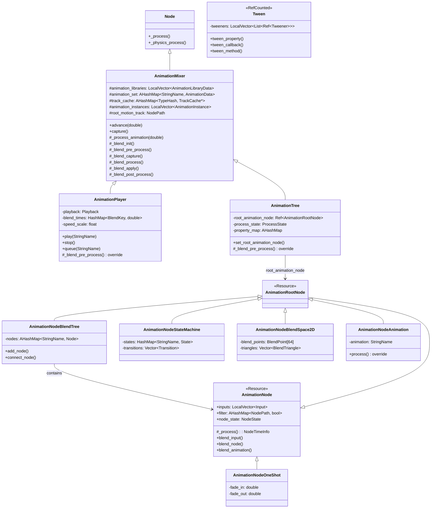

# 17. 动画系统 (Animation System) — Godot vs UE 源码深度对比

> **一句话总结**：Godot 用轻量级节点树 + 数据驱动的方式实现动画混合，而 UE 用重量级 AnimBlueprint + 编译期代码生成实现高性能动画管线。

---

## 目录

- [第 1 章：模块概览 — "UE 程序员 30 秒速览"](#第-1-章模块概览--ue-程序员-30-秒速览)
- [第 2 章：架构对比 — "同一个问题，两种解法"](#第-2-章架构对比--同一个问题两种解法)
- [第 3 章：核心实现对比 — "代码层面的差异"](#第-3-章核心实现对比--代码层面的差异)
- [第 4 章：UE → Godot 迁移指南](#第-4-章ue--godot-迁移指南)
- [第 5 章：性能对比](#第-5-章性能对比)
- [第 6 章：总结 — "一句话记住"](#第-6-章总结--一句话记住)

---

## 第 1 章：模块概览 — "UE 程序员 30 秒速览"

### 1.1 模块定位

Godot 的动画系统负责**关键帧动画播放、动画混合树、状态机、BlendSpace 以及程序化插值（Tween）**。它对应 UE 中 `UAnimInstance` + `AnimBlueprint` + `AnimMontage` + `UBlendSpace` + `UTimelineComponent` 的功能集合。

核心设计差异在于：**Godot 将动画系统建立在场景树节点（Node）之上**，`AnimationPlayer` 和 `AnimationTree` 都是场景中的节点，直接操作同级或子级节点的属性；而 **UE 将动画系统建立在组件（Component）+ 蓝图虚拟机之上**，`UAnimInstance` 是 `USkeletalMeshComponent` 的内部对象，通过编译后的 AnimGraph 驱动骨骼姿态。

### 1.2 核心类/结构体列表

| # | Godot 类 | 源码路径 | 职责 | UE 对应物 |
|---|---------|---------|------|----------|
| 1 | `AnimationMixer` | `scene/animation/animation_mixer.h` | 动画混合基类，管理动画库、缓存、混合管线 | `UAnimInstance`（基类部分） |
| 2 | `AnimationPlayer` | `scene/animation/animation_player.h` | 简单动画播放器，支持队列和混合 | `UAnimSingleNodeInstance` / `PlayAnimation` |
| 3 | `AnimationTree` | `scene/animation/animation_tree.h` | 动画混合树宿主，驱动 AnimationNode 图 | `UAnimInstance` + `AnimBlueprint` |
| 4 | `AnimationNode` | `scene/animation/animation_tree.h` | 混合树节点基类 | `FAnimNode_Base` |
| 5 | `AnimationNodeBlendTree` | `scene/animation/animation_blend_tree.h` | 混合树容器（图编辑器） | AnimGraph（编辑器层面） |
| 6 | `AnimationNodeStateMachine` | `scene/animation/animation_node_state_machine.h` | 动画状态机 | `FAnimNode_StateMachine` |
| 7 | `AnimationNodeStateMachinePlayback` | `scene/animation/animation_node_state_machine.h` | 状态机运行时播放控制 | `FAnimNode_StateMachine`（运行时部分） |
| 8 | `AnimationNodeStateMachineTransition` | `scene/animation/animation_node_state_machine.h` | 状态转换规则 | `FAnimationTransitionBetweenStates` |
| 9 | `AnimationNodeBlendSpace2D` | `scene/animation/animation_blend_space_2d.h` | 2D 混合空间 | `UBlendSpace` |
| 10 | `AnimationNodeBlendSpace1D` | `scene/animation/animation_blend_space_1d.h` | 1D 混合空间 | `UBlendSpace1D` |
| 11 | `AnimationNodeAnimation` | `scene/animation/animation_blend_tree.h` | 叶节点，引用具体动画 | `FAnimNode_SequencePlayer` |
| 12 | `AnimationNodeOneShot` | `scene/animation/animation_blend_tree.h` | 一次性动画覆盖 | `AnimMontage`（概念类似） |
| 13 | `AnimationNodeTransition` | `scene/animation/animation_blend_tree.h` | 混合树内的过渡节点 | `FAnimNode_TransitionResult` |
| 14 | `Tween` | `scene/animation/tween.h` | 程序化属性插值 | `UTimelineComponent` / `FTimerManager` |
| 15 | `AnimationNodeExtension` | `scene/animation/animation_node_extension.h` | 自定义动画节点扩展接口 | 自定义 `FAnimNode_Base` 子类 |

### 1.3 Godot vs UE 概念速查表

| 概念 | Godot | UE |
|------|-------|-----|
| 动画播放器 | `AnimationPlayer`（Node） | `USkeletalMeshComponent::PlayAnimation()` |
| 动画混合树 | `AnimationTree` + `AnimationNodeBlendTree` | `AnimBlueprint` + `AnimGraph` |
| 动画状态机 | `AnimationNodeStateMachine` | `FAnimNode_StateMachine` + `FBakedAnimationStateMachine` |
| 混合空间 | `AnimationNodeBlendSpace2D` | `UBlendSpace` |
| 一次性动画 | `AnimationNodeOneShot` | `UAnimMontage` |
| 动画资源 | `Animation`（Resource） | `UAnimSequence`（UObject） |
| 动画库 | `AnimationLibrary` | 无直接对应（UE 用资产管理） |
| 程序化插值 | `Tween` | `UTimelineComponent` / `FTimeline` |
| 根运动 | `AnimationMixer::root_motion_track` | `UAnimInstance::RootMotionMode` |
| 动画通知 | Method Track / Signal | `UAnimNotify` / `UAnimNotifyState` |
| 动画混合基类 | `AnimationMixer` | `UAnimInstance`（部分） |
| 动画节点基类 | `AnimationNode`（Resource） | `FAnimNode_Base`（USTRUCT） |

---

## 第 2 章：架构对比 — "同一个问题，两种解法"

### 2.1 Godot 动画系统架构

Godot 4.x 的动画系统经历了重大重构，引入了 `AnimationMixer` 作为 `AnimationPlayer` 和 `AnimationTree` 的公共基类。整个架构可以用以下类图表示：



**关键设计点**：
- `AnimationMixer` 是 `Node` 的子类，直接参与场景树的 `_process` / `_physics_process` 回调
- `AnimationNode` 是 `Resource` 的子类，可以被序列化、共享和复用
- 混合管线通过模板方法模式实现：`_blend_init → _blend_pre_process → _blend_capture → _blend_calc_total_weight → _blend_process → _blend_apply → _blend_post_process`

### 2.2 UE 动画系统架构

UE 的动画系统围绕 `UAnimInstance` 构建，它是 `USkeletalMeshComponent` 的内部对象：

```
USkeletalMeshComponent
  └── UAnimInstance (AnimBlueprint 的运行时实例)
        ├── FAnimInstanceProxy (工作线程代理)
        │     ├── FAnimNode_StateMachine (状态机节点)
        │     ├── FAnimNode_BlendSpacePlayer (混合空间播放器)
        │     ├── FAnimNode_SequencePlayer (序列播放器)
        │     └── ... (其他 AnimNode)
        ├── Montage 系统
        │     ├── FAnimMontageInstance
        │     └── SlotAnimationTrack
        └── AnimNotify 队列
```

**关键设计点**：
- `UAnimInstance` 继承自 `UObject`，拥有完整的反射和 GC 支持
- `FAnimNode_Base` 是 `USTRUCT`（值类型），不是 `UObject`，避免了 GC 开销
- AnimBlueprint 在编译期生成 `UAnimBlueprintGeneratedClass`，运行时直接执行编译后的节点图
- `FAnimInstanceProxy` 实现了动画更新的多线程支持

### 2.3 关键架构差异分析

#### 差异 1：节点 vs 组件 — 动画系统的挂载方式

**Godot** 将 `AnimationPlayer` 和 `AnimationTree` 设计为场景树中的独立节点。它们通过 `root_node` 属性指定动画作用的根节点，然后通过 `NodePath` 定位要驱动的属性。这意味着一个 `AnimationPlayer` 可以驱动场景中**任意节点的任意属性**——不仅是骨骼变换，还包括材质参数、UI 属性、甚至其他节点的可见性。

```
# Godot 场景树
CharacterBody3D
  ├── Skeleton3D
  ├── AnimationPlayer    ← 独立节点，通过 NodePath 驱动任意属性
  └── AnimationTree      ← 独立节点，引用 AnimationPlayer 的动画库
```

**UE** 将 `UAnimInstance` 绑定在 `USkeletalMeshComponent` 内部。动画系统天然与骨骼网格耦合，要驱动非骨骼属性需要通过 `AnimNotify`、`Curve` 或 `PropertyAccess` 等间接机制。

```cpp
// UE: AnimInstance 与 SkeletalMeshComponent 强耦合
// Engine/Source/Runtime/Engine/Classes/Animation/AnimInstance.h
UCLASS(transient, Blueprintable, Within=SkeletalMeshComponent)
class ENGINE_API UAnimInstance : public UObject
```

**Trade-off**：Godot 的方式更灵活（一个动画可以同时驱动 3D 变换、UI 和音频），但缺乏 UE 那种针对骨骼动画的深度优化。UE 的方式在骨骼动画场景下性能更优，但通用性较差。

#### 差异 2：Resource vs USTRUCT — 动画节点的内存模型

**Godot** 的 `AnimationNode` 继承自 `Resource`（引用计数对象），每个节点都是堆分配的独立对象，通过 `Ref<AnimationNode>` 管理生命周期。这使得动画节点可以被序列化到磁盘、在编辑器中可视化编辑、甚至在运行时动态创建和替换。

```cpp
// Godot: AnimationNode 是 Resource
// scene/animation/animation_tree.h
class AnimationNode : public Resource {
    GDCLASS(AnimationNode, Resource);
    // ...
    LocalVector<Input> inputs;
    AHashMap<NodePath, bool> filter;
};
```

**UE** 的 `FAnimNode_Base` 是 `USTRUCT`（值类型），它们被内联存储在 `UAnimBlueprintGeneratedClass` 的内存布局中。AnimBlueprint 编译器在编译期确定所有节点的内存偏移，运行时通过指针偏移直接访问，无需任何间接寻址。

```cpp
// UE: FAnimNode_Base 是 USTRUCT（值类型）
// Engine/Source/Runtime/Engine/Classes/Animation/AnimNodeBase.h
USTRUCT()
struct ENGINE_API FAnimNode_Base { ... };
```

**Trade-off**：Godot 的 Resource 模型提供了极大的灵活性和运行时可修改性，但每次访问节点都需要通过引用计数指针间接寻址。UE 的 USTRUCT 模型在编译期固化了内存布局，运行时访问几乎零开销，但牺牲了运行时动态修改的能力。

#### 差异 3：统一混合管线 vs 分离的更新/求值

**Godot** 的 `AnimationMixer` 实现了一个统一的混合管线，在单次 `_process_animation()` 调用中完成从数据收集到属性应用的全部流程：

```cpp
// scene/animation/animation_mixer.cpp:1001
void AnimationMixer::_process_animation(double p_delta, bool p_update_only) {
    _blend_init();
    if (cache_valid && _blend_pre_process(p_delta, track_count, track_map)) {
        _blend_capture(p_delta);
        _blend_calc_total_weight();
        _blend_process(p_delta, p_update_only);
        clear_animation_instances();
        _blend_apply();
        _blend_post_process();
        emit_signal(SNAME("mixer_applied"));
    }
}
```

**UE** 将动画处理分为明确的 **Update**（逻辑更新）和 **Evaluate**（姿态求值）两个阶段，并且支持在不同线程上执行：

```cpp
// UE 的两阶段处理
// 1. Update_AnyThread - 更新时间、状态转换等逻辑
virtual void Update_AnyThread(const FAnimationUpdateContext& Context) override;
// 2. Evaluate_AnyThread - 计算最终骨骼姿态
virtual void Evaluate_AnyThread(FPoseContext& Output) override;
```

**Trade-off**：Godot 的统一管线更简单直观，但难以实现多线程优化。UE 的分离设计允许 Update 和 Evaluate 在不同帧或不同线程上执行，支持更复杂的并行策略，但增加了系统复杂度。

---

## 第 3 章：核心实现对比 — "代码层面的差异"

### 3.1 AnimationPlayer vs UAnimSingleNodeInstance：关键帧动画播放

#### Godot 的实现

`AnimationPlayer` 继承自 `AnimationMixer`，是最简单的动画播放方式。它维护一个 `Playback` 结构体来跟踪当前播放状态：

```cpp
// scene/animation/animation_player.h
struct Playback {
    PlaybackData current;
    StringName assigned;
    bool seeked = false;
    bool started = false;
    List<Blend> blend;  // 混合队列
} playback;
```

播放流程的核心在 `_blend_pre_process` 中：

```cpp
// scene/animation/animation_player.cpp:302
bool AnimationPlayer::_blend_pre_process(double p_delta, int p_track_count,
    const AHashMap<NodePath, int> &p_track_map) {
    if (!playback.current.from) {
        _set_process(false);
        return false;
    }
    // ...
    _blend_playback_data(p_delta, started);
    return true;
}
```

`AnimationPlayer` 的关键特性：
- **动画队列**：通过 `queue()` 方法实现动画排队播放
- **混合时间**：通过 `blend_times` HashMap 为每对动画设置独立的过渡时间
- **自动捕获**：`auto_capture` 功能可以在切换动画时自动捕获当前姿态进行平滑过渡
- **Section 播放**：支持通过 Marker 或时间范围播放动画的特定片段

`AnimationPlayer` 的动画数据存储在 `AnimationLibrary` 中，这是 Godot 4.x 引入的组织方式：

```cpp
// scene/animation/animation_mixer.h
struct AnimationLibraryData {
    StringName name;
    Ref<AnimationLibrary> library;
};
LocalVector<AnimationLibraryData> animation_libraries;
AHashMap<StringName, AnimationData> animation_set; // 扁平化的动画查找表
```

#### UE 的实现

UE 中最接近 `AnimationPlayer` 的是 `UAnimSingleNodeInstance`，它用于在不需要完整 AnimBlueprint 的场景下播放单个动画：

```cpp
// Engine/Source/Runtime/Engine/Classes/Animation/AnimSingleNodeInstance.h
UCLASS(transient, NotBlueprintable)
class ENGINE_API UAnimSingleNodeInstance : public UAnimInstance
```

但更常见的是通过 `USkeletalMeshComponent::PlayAnimation()` 直接播放，或者使用 `UAnimMontage` 系统。UE 的动画资源（`UAnimSequence`）是独立的 UObject 资产，通过资产管理系统组织，不需要类似 `AnimationLibrary` 的容器。

#### 差异点评

| 对比维度 | Godot AnimationPlayer | UE 动画播放 |
|---------|----------------------|------------|
| 驱动目标 | 任意节点的任意属性 | 主要是骨骼变换 |
| 动画存储 | AnimationLibrary（Resource） | UAnimSequence（UObject 资产） |
| 混合方式 | 内置 blend_times + capture | Montage 系统 / AnimBP |
| 队列播放 | 内置 queue() 支持 | 需要自行实现或用 Montage |
| 通用性 | ★★★★★ | ★★★ |
| 骨骼动画性能 | ★★★ | ★★★★★ |

### 3.2 AnimationTree vs AnimBlueprint：动画混合树

#### Godot 的实现

`AnimationTree` 同样继承自 `AnimationMixer`，但它通过一个 `AnimationRootNode` 来驱动整个混合图：

```cpp
// scene/animation/animation_tree.h
class AnimationTree : public AnimationMixer {
    Ref<AnimationRootNode> root_animation_node;
    AnimationNode::ProcessState process_state;
    // 参数系统
    mutable AHashMap<StringName, Pair<Variant, bool>> property_map;
};
```

`AnimationTree` 的核心处理流程在 `_blend_pre_process` 中启动根节点的处理：

```cpp
// AnimationTree 的 _blend_pre_process 会调用根节点的 _pre_process
// 根节点递归处理所有子节点，最终通过 blend_animation() 将动画实例注册到 AnimationMixer
```

**参数系统**是 `AnimationTree` 的重要特性。每个 `AnimationNode` 可以声明参数，这些参数被统一存储在 `AnimationTree` 的 `property_map` 中，并通过 GDScript 的属性访问语法暴露：

```gdscript
# GDScript 中直接设置动画树参数
$AnimationTree.set("parameters/blend_amount", 0.5)
$AnimationTree.set("parameters/StateMachine/playback", "idle")
```

#### UE 的实现

UE 的 `AnimBlueprint` 是一个完整的蓝图类，继承自 `UBlueprint`：

```cpp
// Engine/Source/Runtime/Engine/Classes/Animation/AnimBlueprint.h
UCLASS(BlueprintType)
class ENGINE_API UAnimBlueprint : public UBlueprint, public IInterface_PreviewMeshProvider {
    UPROPERTY()
    USkeleton* TargetSkeleton;
    
    UPROPERTY(EditAnywhere, Category = Optimization)
    bool bUseMultiThreadedAnimationUpdate;
};
```

AnimBlueprint 在编译期通过 `FAnimBlueprintCompiler` 生成 `UAnimBlueprintGeneratedClass`，其中包含：
- 所有 `FAnimNode_Base` 实例的内存布局
- 节点之间的连接关系（`FPoseLink`）
- 状态机的烘焙数据（`FBakedAnimationStateMachine`）

运行时，`UAnimInstance` 通过 `FAnimInstanceProxy` 在工作线程上执行动画图的 Update 和 Evaluate。

#### 差异点评

| 对比维度 | Godot AnimationTree | UE AnimBlueprint |
|---------|---------------------|-----------------|
| 节点类型 | Resource（堆分配） | USTRUCT（内联存储） |
| 参数访问 | 字符串路径 + Variant | 编译期属性绑定 |
| 编辑器 | 可视化节点图 | 可视化蓝图图 |
| 多线程 | 不支持 | 支持（FAnimInstanceProxy） |
| 运行时修改 | 完全支持 | 需要重新编译 |
| 编译优化 | 无 | 编译期内存布局优化 |
| 调试 | 编辑器实时预览 | 蓝图调试 + Persona |

### 3.3 AnimationNodeStateMachine vs FAnimNode_StateMachine：状态机

#### Godot 的实现

Godot 的状态机由三个类协作实现：

1. **`AnimationNodeStateMachine`**（`scene/animation/animation_node_state_machine.h`）：状态机的数据容器，存储状态和转换规则
2. **`AnimationNodeStateMachineTransition`**：转换规则，包含切换模式、条件表达式、交叉淡入时间等
3. **`AnimationNodeStateMachinePlayback`**：运行时播放控制器，实现 A* 寻路、状态转换逻辑

```cpp
// scene/animation/animation_node_state_machine.h
class AnimationNodeStateMachine : public AnimationRootNode {
    HashMap<StringName, State> states;
    Vector<Transition> transitions;
    
    enum StateMachineType {
        STATE_MACHINE_TYPE_ROOT,    // 根状态机
        STATE_MACHINE_TYPE_NESTED,  // 嵌套状态机
        STATE_MACHINE_TYPE_GROUPED, // 分组状态机
    };
};
```

Godot 状态机的独特特性：
- **A* 寻路**：`travel()` 方法使用 A* 算法自动寻找从当前状态到目标状态的最短路径
- **表达式条件**：转换条件支持 `Expression` 对象，可以编写复杂的条件表达式
- **三种状态机类型**：Root、Nested、Grouped，支持层次化状态机
- **Start/End 特殊状态**：内置的起始和结束状态节点

```cpp
// 状态机播放器中的 A* 寻路
struct AStarCost {
    float distance = 0.0;
    StringName prev;
};
bool _make_travel_path(AnimationTree *p_tree, AnimationNodeStateMachine *p_state_machine,
    bool p_is_allow_transition_to_self, Vector<StringName> &r_path, bool p_test_only);
```

转换规则支持多种切换模式：

```cpp
// scene/animation/animation_node_state_machine.h
enum SwitchMode {
    SWITCH_MODE_IMMEDIATE,  // 立即切换
    SWITCH_MODE_SYNC,       // 同步切换（保持时间位置）
    SWITCH_MODE_AT_END,     // 当前动画结束后切换
};

enum AdvanceMode {
    ADVANCE_MODE_DISABLED,  // 禁用
    ADVANCE_MODE_ENABLED,   // 启用（手动触发）
    ADVANCE_MODE_AUTO,      // 自动（条件满足时自动触发）
};
```

#### UE 的实现

UE 的状态机通过 `FAnimNode_StateMachine` 实现，它在编译期被"烘焙"为 `FBakedAnimationStateMachine`：

```cpp
// Engine/Source/Runtime/Engine/Classes/Animation/AnimNode_StateMachine.h
USTRUCT()
struct ENGINE_API FAnimNode_StateMachine : public FAnimNode_Base {
    UPROPERTY()
    int32 StateMachineIndexInClass;  // 指向烘焙数据的索引
    
    UPROPERTY(EditAnywhere)
    int32 MaxTransitionsPerFrame;    // 每帧最大转换次数
    
protected:
    int32 CurrentState;
    float ElapsedTime;
    TArray<FAnimationActiveTransitionEntry> ActiveTransitionArray;
    TArray<FPoseLink> StatePoseLinks;
};
```

UE 状态机的特点：
- **编译期烘焙**：状态和转换在 AnimBlueprint 编译时被烘焙为 `FBakedAnimationStateMachine`
- **转换规则是蓝图图**：每个转换条件是一个独立的蓝图图，可以包含任意逻辑
- **Conduit 节点**：支持"管道"状态，用于实现复杂的转换逻辑
- **自定义混合图**：转换过程可以使用自定义的混合图（Custom Blend Graph）
- **多转换支持**：`MaxTransitionsPerFrame` 控制每帧最大转换次数，支持快速连续转换

```cpp
// UE 的活跃转换条目
struct FAnimationActiveTransitionEntry {
    float ElapsedTime;
    float Alpha;
    float CrossfadeDuration;
    int32 NextState;
    int32 PreviousState;
    UBlendProfile* BlendProfile;  // 支持逐骨骼混合
    EAlphaBlendOption BlendOption;
};
```

#### 差异点评

| 对比维度 | Godot StateMachine | UE StateMachine |
|---------|-------------------|-----------------|
| 数据存储 | 运行时 HashMap | 编译期烘焙数组 |
| 转换条件 | Expression 字符串 / 布尔参数 | 蓝图图（任意逻辑） |
| 路径寻找 | 内置 A* 寻路 | 无（需手动指定） |
| 逐骨骼混合 | 不支持 | 支持（BlendProfile） |
| 嵌套支持 | 三种类型（Root/Nested/Grouped） | 支持嵌套 |
| 运行时修改 | 完全支持 | 需要重新编译 |
| 调试 | 编辑器可视化 | Persona 调试器 |

### 3.4 BlendSpace2D vs UBlendSpace：混合空间

#### Godot 的实现

`AnimationNodeBlendSpace2D` 使用 Delaunay 三角剖分来实现 2D 混合空间：

```cpp
// scene/animation/animation_blend_space_2d.h
class AnimationNodeBlendSpace2D : public AnimationRootNode {
    enum { MAX_BLEND_POINTS = 64 };
    
    struct BlendPoint {
        StringName name;
        Ref<AnimationRootNode> node;
        Vector2 position;
    };
    
    struct BlendTriangle {
        int points[3] = {};
    };
    
    BlendPoint blend_points[MAX_BLEND_POINTS];
    Vector<BlendTriangle> triangles;
    
    // 三种混合模式
    enum BlendMode {
        BLEND_MODE_INTERPOLATED,      // 插值混合
        BLEND_MODE_DISCRETE,          // 离散（最近点）
        BLEND_MODE_DISCRETE_CARRY,    // 离散（保持时间）
    };
    
    bool auto_triangles = true;  // 自动三角剖分
};
```

Godot 的混合空间特点：
- 固定数组存储（最多 64 个混合点），避免动态分配
- 支持自动三角剖分（`auto_triangles`）
- 三种混合模式：插值、离散、离散保持
- 混合点可以是任意 `AnimationRootNode`，不仅限于动画序列

三角剖分后的混合权重计算：

```cpp
// scene/animation/animation_blend_space_2d.h
void _blend_triangle(const Vector2 &p_pos, const Vector2 *p_points, float *r_weights);
```

#### UE 的实现

UE 的 `UBlendSpace` 继承自 `UBlendSpaceBase`，使用网格化的方式实现混合：

```cpp
// Engine/Source/Runtime/Engine/Classes/Animation/BlendSpaceBase.h
struct FBlendParameter {
    float Min;
    float Max;
    int32 GridNum;  // 网格分割数
};

struct FBlendSample {
    UAnimSequence* Animation;
    FVector SampleValue;
    float RateScale;
};

struct FEditorElement {
    static const int32 MAX_VERTICES = 3;
    int32 Indices[MAX_VERTICES];
    float Weights[MAX_VERTICES];
};
```

UE 混合空间的特点：
- 基于网格的采样系统，预计算每个网格元素的权重
- 支持输入插值（`FInterpolationParameter`），平滑输入变化
- 支持逐骨骼插值速度（`FPerBoneInterpolation`）
- 支持 Axis to Scale Animation（用速度轴驱动动画播放速率）
- 混合点只能是 `UAnimSequence`

```cpp
// Engine/Source/Runtime/Engine/Classes/Animation/BlendSpace.h
class UBlendSpace : public UBlendSpaceBase {
    // 用哪个轴来缩放动画速度
    UPROPERTY(EditAnywhere, Category = InputInterpolation)
    TEnumAsByte<EBlendSpaceAxis> AxisToScaleAnimation;
};
```

#### 差异点评

| 对比维度 | Godot BlendSpace2D | UE BlendSpace |
|---------|-------------------|---------------|
| 采样方式 | Delaunay 三角剖分 | 网格化预计算 |
| 最大采样点 | 64 | 无硬限制 |
| 输入平滑 | 无内置 | 内置插值参数 |
| 逐骨骼插值 | 不支持 | 支持 |
| 速率缩放 | 不支持 | 支持（AxisToScaleAnimation） |
| 混合点类型 | 任意 AnimationRootNode | 仅 UAnimSequence |
| 混合模式 | 3 种 | 1 种（插值） |

### 3.5 Tween vs UE Timeline：程序化动画

#### Godot 的实现

`Tween` 是 Godot 中用于程序化属性插值的核心类，继承自 `RefCounted`：

```cpp
// scene/animation/tween.h
class Tween : public RefCounted {
    LocalVector<List<Ref<Tweener>>> tweeners;  // 步骤列表
    int current_step = -1;
    int loops = 1;
    float speed_scale = 1;
    
    // 12 种过渡类型 × 4 种缓动类型 = 48 种插值曲线
    enum TransitionType {
        TRANS_LINEAR, TRANS_SINE, TRANS_QUINT, TRANS_QUART,
        TRANS_QUAD, TRANS_EXPO, TRANS_ELASTIC, TRANS_CUBIC,
        TRANS_CIRC, TRANS_BOUNCE, TRANS_BACK, TRANS_SPRING,
    };
    
    enum EaseType {
        EASE_IN, EASE_OUT, EASE_IN_OUT, EASE_OUT_IN,
    };
    
    // 函数指针表，避免运行时分支
    static interpolater interpolaters[TRANS_MAX][EASE_MAX];
};
```

Tween 的设计采用了**链式调用**模式：

```gdscript
# GDScript 中的 Tween 使用
var tween = create_tween()
tween.tween_property($Sprite, "position", Vector2(200, 100), 1.0)
     .set_trans(Tween.TRANS_ELASTIC)
     .set_ease(Tween.EASE_OUT)
tween.tween_callback(func(): print("done"))
```

Tween 支持多种 Tweener 类型：
- `PropertyTweener`：属性插值
- `IntervalTweener`：等待间隔
- `CallbackTweener`：回调执行
- `MethodTweener`：方法参数插值
- `SubtweenTweener`：嵌套 Tween

缓动方程实现在 `easing_equations.h` 中，使用经典的 Robert Penner 缓动公式：

```cpp
// scene/animation/easing_equations.h
namespace Elastic {
    static real_t in(real_t t, real_t b, real_t c, real_t d) {
        // ...弹性缓动实现
        float p = d * 0.3f;
        float a = c * std::pow(2, 10 * t);
        float s = p / 4;
        return -(a * std::sin((t * d - s) * (2 * Math::PI) / p)) + b;
    }
};
```

#### UE 的实现

UE 中对应 Tween 的是 `UTimelineComponent`（蓝图 Timeline）和 `FTimeline`：

```cpp
// UTimelineComponent 是一个 ActorComponent
// 通过曲线资产驱动属性变化
UCLASS()
class ENGINE_API UTimelineComponent : public UActorComponent {
    UPROPERTY()
    FTimeline TheTimeline;
    
    // 通过委托绑定属性更新
    FOnTimelineFloat InterpFunction;
    FOnTimelineEvent TimelineFinishedFunc;
};
```

UE 的 Timeline 特点：
- 基于曲线资产（`UCurveFloat`、`UCurveVector`）
- 是 ActorComponent，需要挂载到 Actor 上
- 通过委托（Delegate）驱动属性更新
- 在蓝图中有专门的 Timeline 节点编辑器

#### 差异点评

| 对比维度 | Godot Tween | UE Timeline |
|---------|-------------|-------------|
| 类型 | RefCounted（轻量级） | ActorComponent（重量级） |
| 创建方式 | `create_tween()`（代码创建） | 蓝图编辑器 / C++ |
| 缓动曲线 | 48 种内置 | 自定义曲线资产 |
| 链式调用 | ✅ 原生支持 | ❌ 不支持 |
| 并行/串行 | `parallel()` / `chain()` | 需要多个 Timeline |
| 嵌套 | `SubtweenTweener` | 不支持 |
| 灵活性 | ★★★★★ | ★★★ |
| 可视化编辑 | ❌ | ✅（蓝图 Timeline 编辑器） |

### 3.6 AnimationMixer：Godot 4.x 的动画混合基类

`AnimationMixer` 是 Godot 4.x 引入的关键重构，它将 `AnimationPlayer` 和 `AnimationTree` 的公共逻辑提取到了一个基类中。

#### 核心混合管线

```cpp
// scene/animation/animation_mixer.cpp:1001
void AnimationMixer::_process_animation(double p_delta, bool p_update_only) {
    _blend_init();           // 1. 初始化：重置所有 TrackCache
    _blend_pre_process();    // 2. 预处理：子类填充 animation_instances
    _blend_capture();        // 3. 捕获：处理 capture 过渡动画
    _blend_calc_total_weight(); // 4. 权重计算：归一化（非确定性模式）
    _blend_process();        // 5. 混合处理：遍历所有动画实例，计算混合值
    clear_animation_instances(); // 6. 清理实例
    _blend_apply();          // 7. 应用：将混合结果写入场景节点
    _blend_post_process();   // 8. 后处理：子类特定逻辑
}
```

#### TrackCache 系统

`AnimationMixer` 使用 `TrackCache` 系统来缓存动画轨道的目标对象和混合状态：

```cpp
// scene/animation/animation_mixer.h
struct TrackCache {
    bool root_motion = false;
    Animation::TrackType type;
    NodePath path;
    int blend_idx = -1;
    ObjectID object_id;
    real_t total_weight = 0.0;
};

// 特化的缓存类型
struct TrackCacheTransform : public TrackCache { /* 位置/旋转/缩放 */ };
struct TrackCacheBlendShape : public TrackCache { /* 混合形状 */ };
struct TrackCacheValue : public TrackCache { /* 通用属性值 */ };
struct TrackCacheMethod : public TrackCache { /* 方法调用 */ };
struct TrackCacheAudio : public TrackCache { /* 音频播放 */ };
struct TrackCacheAnimation : public TrackCache { /* 子动画 */ };
```

缓存使用 `Animation::TypeHash` 作为键，这是一个基于轨道路径和类型的哈希值，确保快速查找。

#### 确定性 vs 非确定性混合

`AnimationMixer` 支持两种混合模式：

```cpp
bool deterministic = false;

// 非确定性模式（默认）：权重归一化
if (!deterministic) {
    if (Math::is_zero_approx(track->total_weight)) {
        continue;
    }
    blend = blend / track->total_weight;  // 归一化
}
```

- **确定性模式**：权重直接使用，总权重可以超过 1.0，适合叠加动画
- **非确定性模式**：权重自动归一化到 1.0，确保混合结果稳定

#### UE 中的对应

UE 没有直接对应 `AnimationMixer` 的类。最接近的是 `FAnimInstanceProxy`，它管理动画图的更新和求值，但其职责更偏向多线程代理而非混合管线抽象。UE 的混合逻辑分散在各个 `FAnimNode` 的 `Evaluate_AnyThread` 实现中，通过 `FPoseContext` 在节点间传递姿态数据。

---

## 第 4 章：UE → Godot 迁移指南

### 4.1 思维转换清单

#### 1. 忘掉"AnimBlueprint 是一个类" — 重新学"AnimationTree 是一个节点"

在 UE 中，AnimBlueprint 是一个完整的蓝图类，有自己的事件图、变量和函数。在 Godot 中，`AnimationTree` 只是场景树中的一个节点，它的"逻辑"完全由其内部的 `AnimationNode` 图决定。你不需要创建一个"动画类"，只需要在场景中添加一个 `AnimationTree` 节点并配置它的节点图。

#### 2. 忘掉"动画只能驱动骨骼" — 重新学"动画可以驱动一切"

UE 的动画系统天然与 `USkeletalMeshComponent` 绑定。在 Godot 中，`Animation` 资源可以包含任意 `NodePath` 的任意属性轨道。一个动画可以同时驱动角色的骨骼变换、材质颜色、粒子发射率和 UI 元素的透明度。

#### 3. 忘掉"Montage 是独立系统" — 重新学"OneShot 是混合树的一部分"

UE 的 `AnimMontage` 是一个独立于 AnimGraph 的系统，通过 Slot 节点注入到动画图中。Godot 没有 Montage 的概念，取而代之的是 `AnimationNodeOneShot`，它是混合树中的一个普通节点。要实现类似 Montage 的效果，你需要在混合树中放置一个 OneShot 节点，然后通过代码触发它。

#### 4. 忘掉"编译期优化" — 重新学"运行时灵活性"

UE 的 AnimBlueprint 在编译期固化了节点布局和连接关系。Godot 的 `AnimationTree` 完全是运行时数据，你可以在游戏运行时动态添加、删除和重新连接动画节点。这带来了极大的灵活性，但也意味着你需要自己注意性能。

#### 5. 忘掉"FAnimInstanceProxy 多线程" — 重新学"单线程但简单"

UE 的动画系统支持在工作线程上执行动画更新和求值。Godot 的动画系统完全在主线程上运行。这意味着你不需要担心线程安全问题，但也意味着复杂的动画图可能成为性能瓶颈。

### 4.2 API 映射表

| UE API | Godot 等价 API | 备注 |
|--------|---------------|------|
| `UAnimInstance::NativeUpdateAnimation()` | `AnimationTree._process()` / 脚本 `_process` | Godot 通过节点的 process 回调更新参数 |
| `UAnimInstance::Montage_Play()` | `AnimationTree.set("parameters/OneShot/request", AnimationNodeOneShot.ONE_SHOT_REQUEST_FIRE)` | 通过参数触发 OneShot |
| `USkeletalMeshComponent::PlayAnimation()` | `AnimationPlayer.play("anim_name")` | 直接播放 |
| `UAnimInstance::GetCurrentStateName()` | `state_machine_playback.get_current_node()` | 获取当前状态 |
| `UAnimInstance::SetRootMotionMode()` | `AnimationMixer.set_root_motion_track()` | 设置根运动轨道 |
| `UBlendSpace::GetBlendInput()` | `AnimationTree.set("parameters/BlendSpace2D/blend_position", Vector2(...))` | 设置混合空间输入 |
| `FAnimNode_StateMachine::SetState()` | `state_machine_playback.travel("state_name")` | 状态转换（Godot 支持自动寻路） |
| `UTimelineComponent::Play()` | `var tween = create_tween(); tween.tween_property(...)` | 程序化动画 |
| `UAnimNotify::Notify()` | Animation Method Track / `animation_finished` signal | 动画事件通知 |
| `UAnimInstance::GetInstanceAssetPlayerLength()` | `AnimationPlayer.get_current_animation_length()` | 获取动画长度 |
| `UAnimMontage::GetSectionLength()` | `AnimationPlayer.get_section_end_time() - get_section_start_time()` | Section 长度 |
| `FAlphaBlend::GetBlendedValue()` | `Tween.run_equation(trans, ease, t, b, c, d)` | 插值计算 |

### 4.3 陷阱与误区

#### 陷阱 1：AnimationPlayer 和 AnimationTree 不要同时激活

UE 程序员可能会尝试同时使用 `AnimationPlayer` 播放动画和 `AnimationTree` 做混合。在 Godot 中，如果两者同时激活且作用于相同的节点，它们会互相覆盖。正确做法是：
- **简单场景**：只用 `AnimationPlayer`
- **复杂混合**：只用 `AnimationTree`，让它引用 `AnimationPlayer` 的动画库

```gdscript
# 正确：AnimationTree 引用 AnimationPlayer 的动画
$AnimationTree.active = true
$AnimationPlayer.active = false  # 禁用 AnimationPlayer 的自动播放
```

#### 陷阱 2：参数路径是字符串，拼写错误不会报错

UE 的 AnimBlueprint 变量有编译期类型检查。Godot 的 `AnimationTree` 参数通过字符串路径访问，拼写错误只会在运行时静默失败：

```gdscript
# 错误：拼写错误不会报错，只是不生效
$AnimationTree.set("parameters/blen_amount", 0.5)  # 应该是 blend_amount

# 建议：使用常量或 @export 变量
const BLEND_PARAM = "parameters/Blend2/blend_amount"
$AnimationTree.set(BLEND_PARAM, 0.5)
```

#### 陷阱 3：Tween 不是持久对象

UE 的 `UTimelineComponent` 是 Actor 的组件，生命周期与 Actor 绑定。Godot 的 `Tween` 是 `RefCounted` 对象，如果没有引用持有它，它会被自动回收。此外，`Tween` 默认绑定到创建它的节点，节点被销毁时 Tween 也会停止。

```gdscript
# 错误：Tween 可能在下一帧就被回收
func _ready():
    var tween = create_tween()  # 绑定到当前节点，OK
    
# 注意：如果节点被 queue_free()，Tween 也会停止
```

#### 陷阱 4：状态机的 travel() 不等于立即切换

UE 的状态机转换是即时的（在同一帧内完成条件检查和转换）。Godot 的 `travel()` 使用 A* 寻路，可能需要经过多个中间状态才能到达目标。如果你需要立即跳转，使用 `start()` 而不是 `travel()`：

```gdscript
# travel() - 寻路到目标状态（可能经过中间状态）
playback.travel("run")

# start() - 立即跳转到目标状态（无过渡）
playback.start("run")
```

### 4.4 最佳实践

#### 1. 善用 AnimationLibrary 组织动画

```gdscript
# 按角色状态组织动画库
# "locomotion/idle", "locomotion/walk", "locomotion/run"
# "combat/attack1", "combat/attack2"
# "interaction/pickup", "interaction/use"
```

#### 2. 使用 Capture 实现平滑过渡

Godot 4.x 的 `capture()` 功能类似于 UE 的 Inertialization，可以从当前姿态平滑过渡到新动画：

```gdscript
# 类似 UE 的 Inertialization
$AnimationPlayer.play_with_capture("new_anim", 0.3)
```

#### 3. 复杂逻辑用 AnimationNodeExtension

如果内置的动画节点不够用，可以通过 `AnimationNodeExtension` 创建自定义节点：

```gdscript
class_name CustomAnimNode extends AnimationNodeExtension

func _process_animation_node(playback_info: PackedFloat64Array, test_only: bool) -> PackedFloat32Array:
    # 自定义混合逻辑
    pass
```

---

## 第 5 章：性能对比

### 5.1 Godot 动画系统的性能特征

#### 内存模型

Godot 的动画系统使用以下关键数据结构：

- **TrackCache**（`AHashMap<Animation::TypeHash, TrackCache*>`）：使用哈希表缓存轨道目标，首次播放时构建，后续复用
- **animation_instances**（`LocalVector<AnimationInstance>`）：每帧临时构建的动画实例列表
- **track_map**（`AHashMap<NodePath, int>`）：NodePath 到轨道索引的映射

内存访问模式：
- TrackCache 是堆分配的多态对象（通过虚析构函数），缓存不友好
- 每帧遍历所有活跃动画的所有轨道，对每个轨道进行类型分发（switch-case）
- 属性应用通过 `ObjectDB::get_instance()` 查找目标对象，涉及全局哈希表查找

#### CPU 开销分析

```
_process_animation() 的主要开销：
├── _blend_init()          ~5%   重置缓存值
├── _blend_pre_process()   ~10%  构建动画实例（子类实现）
├── _blend_capture()       ~5%   捕获过渡处理
├── _blend_process()       ~50%  核心混合计算（最重）
│   ├── 遍历所有 AnimationInstance
│   ├── 对每个轨道进行插值计算
│   └── 累加混合权重
├── _blend_apply()         ~25%  将结果写入场景节点
│   ├── ObjectDB 查找
│   ├── 属性设置（可能触发信号）
│   └── Skeleton3D 骨骼更新
└── _blend_post_process()  ~5%   信号发射等
```

#### 瓶颈

1. **单线程执行**：整个动画管线在主线程上运行，无法利用多核
2. **ObjectDB 查找**：每帧对每个轨道都需要通过 `ObjectDB::get_instance()` 验证目标对象是否有效
3. **Variant 类型系统**：`TrackCacheValue` 使用 `Variant` 存储值，涉及类型转换开销
4. **NodePath 解析**：缓存构建时需要解析 NodePath，虽然有缓存但首次开销较大

### 5.2 UE 动画系统的性能特征

#### 内存模型

UE 的动画系统针对性能做了深度优化：

- **FCompactPose**：紧凑的骨骼姿态存储，连续内存布局
- **FAnimNode 内联存储**：所有动画节点内联在 `UAnimBlueprintGeneratedClass` 中，无间接寻址
- **FPoseLink**：编译期确定的节点连接，通过内存偏移直接访问

#### CPU 开销优势

- **多线程支持**：通过 `FAnimInstanceProxy` 在工作线程上执行 Update 和 Evaluate
- **编译期优化**：AnimBlueprint 编译器生成优化的节点布局和连接
- **批量骨骼更新**：使用 SIMD 指令批量处理骨骼变换
- **LOD 系统**：根据距离自动降低动画更新频率

### 5.3 性能对比总结

| 性能维度 | Godot | UE | 差距 |
|---------|-------|-----|------|
| 单角色骨骼动画 | 中等 | 优秀 | UE 快 2-5x |
| 大量角色（100+） | 较差 | 优秀 | UE 快 5-10x（多线程+LOD） |
| 通用属性动画 | 优秀 | 中等 | Godot 更灵活 |
| 内存占用 | 较大（Variant+RefCounted） | 较小（USTRUCT+紧凑布局） | UE 省 30-50% |
| 缓存友好性 | 较差（多态+哈希表） | 优秀（内联+连续内存） | UE 明显更优 |

### 5.4 性能敏感场景建议

1. **大量 NPC 动画**：考虑使用 `AnimationPlayer` 而非 `AnimationTree`，减少混合树遍历开销
2. **简单循环动画**：直接使用 `AnimationPlayer.play()`，不需要混合树
3. **Tween vs AnimationPlayer**：对于简单的属性过渡，`Tween` 比 `AnimationPlayer` 更轻量
4. **减少轨道数量**：每个轨道都有固定的处理开销，合并不必要的轨道
5. **使用确定性模式**：如果不需要权重归一化，`deterministic = true` 可以跳过归一化计算
6. **Root Motion 优化**：只在需要时启用根运动，它会增加额外的插值计算

---

## 第 6 章：总结 — "一句话记住"

### 核心差异

> **Godot 用"万物皆可动画"的通用节点系统换取灵活性，UE 用"骨骼动画专精"的编译期优化换取性能。**

### 设计亮点（Godot 做得比 UE 好的地方）

1. **AnimationMixer 基类抽象**：将 AnimationPlayer 和 AnimationTree 的公共逻辑统一到一个基类中，代码复用度极高。UE 的 `UAnimInstance` 和 `UAnimSingleNodeInstance` 之间的代码复用不如 Godot 优雅。

2. **万物皆可动画**：一个 Animation 资源可以同时驱动 3D 变换、材质参数、UI 属性、音频等。UE 需要通过多个不同的系统（AnimBP、Sequencer、Timeline）才能实现类似效果。

3. **状态机 A* 寻路**：`travel()` 方法自动寻找最短路径，开发者不需要手动管理复杂的状态转换逻辑。UE 的状态机需要显式定义每个转换。

4. **Tween 的链式 API**：`create_tween().tween_property(...).set_trans(...).set_ease(...)` 的链式调用比 UE 的 Timeline 组件更简洁直观。

5. **运行时动态性**：可以在运行时动态修改动画树结构，这在 UE 中几乎不可能（需要重新编译 AnimBlueprint）。

### 设计短板（Godot 不如 UE 的地方）

1. **无多线程支持**：整个动画管线在主线程上运行，大量角色场景下成为严重瓶颈。UE 的 `FAnimInstanceProxy` 支持完整的多线程动画更新。

2. **无编译期优化**：动画节点是运行时 Resource 对象，每次访问都需要间接寻址。UE 的 USTRUCT 节点在编译期固化内存布局，运行时零开销。

3. **无 Montage 系统**：`AnimationNodeOneShot` 功能远不如 UE 的 `AnimMontage` 丰富。Montage 支持 Section、Slot、多层叠加等高级功能。

4. **无逐骨骼混合 Profile**：UE 的 `UBlendProfile` 允许为不同骨骼设置不同的混合权重和速度。Godot 的混合是全局的，虽然有 Filter 但粒度不够细。

5. **无动画 LOD**：UE 可以根据距离自动降低动画更新频率和骨骼数量。Godot 没有内置的动画 LOD 系统。

6. **无 AnimNotify 系统**：UE 的 `UAnimNotify` 和 `UAnimNotifyState` 提供了丰富的动画事件系统。Godot 只有 Method Track 和 Signal，功能相对简单。

### UE 程序员的学习路径建议

1. **第一步**：阅读 `animation_mixer.h`（445 行），理解 Godot 动画系统的基类设计和混合管线
2. **第二步**：阅读 `animation_player.h`（283 行），理解最简单的动画播放方式
3. **第三步**：阅读 `animation_tree.h`（361 行），理解动画混合树的宿主节点
4. **第四步**：阅读 `animation_blend_tree.h`（412 行），理解各种混合节点的实现
5. **第五步**：阅读 `animation_node_state_machine.h`（351 行），理解状态机的实现
6. **第六步**：阅读 `tween.h`（244 行），理解程序化动画系统
7. **实践**：创建一个简单的角色动画项目，依次使用 AnimationPlayer → AnimationTree → StateMachine → BlendSpace → Tween

**推荐的源码阅读顺序**：
```
animation_mixer.h → animation_player.h → animation_tree.h 
→ animation_blend_tree.h → animation_node_state_machine.h 
→ animation_blend_space_2d.h → tween.h
```

先理解基类 `AnimationMixer` 的混合管线设计，再看两个子类如何分别实现简单播放和复杂混合，最后看各种动画节点的具体实现。这个顺序与 UE 中先理解 `UAnimInstance` 再理解 `AnimGraph` 节点的学习路径类似。
