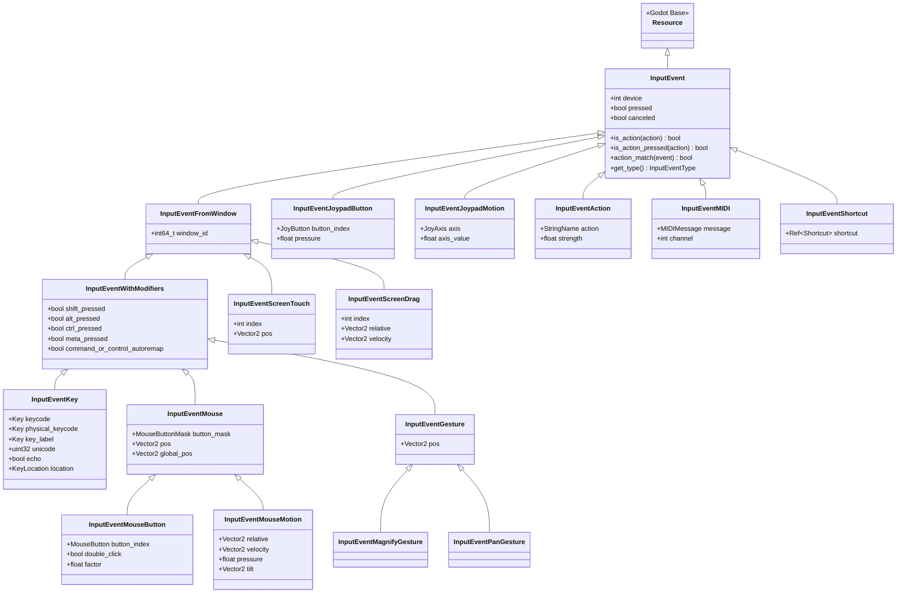
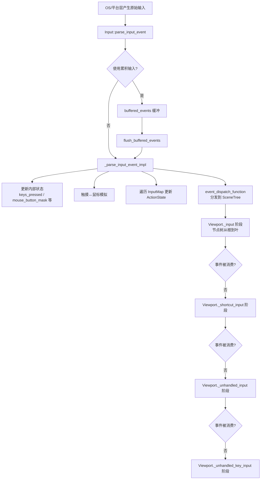

# 18. 输入系统 (Input System) — Godot vs UE 源码深度对比

> **一句话核心结论**：Godot 用"事件对象继承树 + 全局单例轮询"实现轻量输入，UE 用"组件栈 + 动作/轴映射 + InputComponent 优先级"实现重量级但高度可扩展的输入管道。

---

## 目录

- [第 1 章：模块概览 — "UE 程序员 30 秒速览"](#第-1-章模块概览--ue-程序员-30-秒速览)
- [第 2 章：架构对比 — "同一个问题，两种解法"](#第-2-章架构对比--同一个问题两种解法)
- [第 3 章：核心实现对比 — "代码层面的差异"](#第-3-章核心实现对比--代码层面的差异)
- [第 4 章：UE → Godot 迁移指南](#第-4-章ue--godot-迁移指南)
- [第 5 章：性能对比](#第-5-章性能对比)
- [第 6 章：总结 — "一句话记住"](#第-6-章总结--一句话记住)

---

## 第 1 章：模块概览 — "UE 程序员 30 秒速览"

### 1.1 模块定位

Godot 的输入系统位于 `core/input/` 目录下，负责：
- 定义所有输入事件类型（键盘、鼠标、手柄、触摸、手势、MIDI）
- 管理动作映射（Action Mapping）
- 提供全局输入状态查询（`Input` 单例）
- 手柄映射数据库（SDL GameController DB 兼容）

**对应 UE 模块**：`UPlayerInput`（传统输入）+ `EnhancedInput`（增强输入）+ `UInputComponent`（输入组件栈）

### 1.2 核心类/结构体列表

| # | Godot 类 | 源码位置 | 职责 | UE 对应物 |
|---|---------|---------|------|----------|
| 1 | `Input` | `core/input/input.h` | 全局输入单例，状态查询与事件分发 | `UPlayerInput` |
| 2 | `InputEvent` | `core/input/input_event.h` | 输入事件基类（继承自 Resource） | `FInputEvent` / `FKeyEvent` |
| 3 | `InputEventKey` | `core/input/input_event.h` | 键盘事件 | `FKeyEvent` |
| 4 | `InputEventMouseButton` | `core/input/input_event.h` | 鼠标按钮事件 | `FPointerEvent` |
| 5 | `InputEventMouseMotion` | `core/input/input_event.h` | 鼠标移动事件 | `FPointerEvent` (MouseMove) |
| 6 | `InputEventJoypadButton` | `core/input/input_event.h` | 手柄按钮事件 | `FKey` (Gamepad_*) |
| 7 | `InputEventJoypadMotion` | `core/input/input_event.h` | 手柄摇杆/扳机事件 | `FKey` (Gamepad_LeftX 等) |
| 8 | `InputEventScreenTouch` | `core/input/input_event.h` | 触摸事件 | `ETouchType` / Touch 系统 |
| 9 | `InputEventAction` | `core/input/input_event.h` | 动作事件（虚拟输入） | `FInputActionKeyMapping` |
| 10 | `InputMap` | `core/input/input_map.h` | 动作映射管理单例 | `UPlayerInput::ActionMappings` |
| 11 | `InputEventWithModifiers` | `core/input/input_event.h` | 带修饰键的事件基类 | `FModifierKeysState` |
| 12 | `InputEventFromWindow` | `core/input/input_event.h` | 带窗口 ID 的事件基类 | 无直接对应（UE 单窗口为主） |
| 13 | `InputEventGesture` | `core/input/input_event.h` | 手势事件基类 | `FGestureRecognizer` |
| 14 | `Shortcut` | `core/input/shortcut.h` | 快捷键资源 | `FInputChord` |
| 15 | `ActionState` | `core/input/input.h` (内部) | 动作状态缓存 | `FKeyState` |

### 1.3 Godot vs UE 概念速查表

| 概念 | Godot | UE (传统) | UE (EnhancedInput) |
|------|-------|----------|-------------------|
| 输入事件基类 | `InputEvent : Resource` | `FInputEvent` (Slate 层) | `FInputActionValue` |
| 全局输入查询 | `Input` 单例 | `UPlayerInput` (PlayerController 内) | `UEnhancedPlayerInput` |
| 动作映射 | `InputMap` 单例 | `UPlayerInput::ActionMappings` | `UInputMappingContext` |
| 动作定义 | 字符串名 (StringName) | `FName` ActionName | `UInputAction` (UObject 资产) |
| 轴输入 | `Input.get_axis()` / `get_vector()` | `UPlayerInput::AxisMappings` | `UInputAction` (Value Type = Axis1D/2D/3D) |
| 输入处理回调 | `_input()` / `_unhandled_input()` | `SetupPlayerInputComponent()` | `BindAction()` |
| 输入消费 | `Viewport.set_input_as_handled()` | `bConsumeInput` on binding | `bConsumeInput` on binding |
| 手柄映射 | SDL GameController DB | `InputSettings` + 平台层 | `UInputMappingContext` |
| 死区 | `InputMap::Action::deadzone` | `FInputAxisProperties::DeadZone` | `UInputModifierDeadZone` |
| 输入缓冲 | `buffered_events` + 累积 | 每帧 `ProcessInputStack` | 每帧 `ProcessInputStack` |
| 触摸模拟鼠标 | `emulate_mouse_from_touch` | `bUseMouseForTouch` | 同传统 |
| 输入传播方向 | 节点树从叶到根冒泡 | InputComponent 栈从高优先级到低 | 同传统 |

---

## 第 2 章：架构对比 — "同一个问题，两种解法"

### 2.1 Godot 输入系统架构

Godot 的输入系统采用**"事件对象 + 全局单例 + 节点树冒泡"**三层架构：



**输入事件处理流程**：



### 2.2 UE 输入系统架构（简要）

UE 的传统输入系统采用**"PlayerController → PlayerInput → InputComponent 栈"**架构：

```
平台层 (FGenericApplication)
    ↓ FInputEvent
Slate 应用层 (FSlateApplication::ProcessKeyDownEvent 等)
    ↓ 路由到 Viewport
APlayerController::InputKey / InputAxis
    ↓
UPlayerInput::InputKey → 更新 KeyStateMap
    ↓
UPlayerInput::ProcessInputStack
    ↓ 遍历 InputComponent 栈（高优先级 → 低优先级）
    ↓ 匹配 ActionMappings / AxisMappings
    ↓ 触发绑定的委托
UInputComponent::BindAction / BindAxis 回调
```

**关键 UE 源码文件**：
- `Engine/Source/Runtime/Engine/Classes/GameFramework/PlayerInput.h` — 输入处理核心
- `Engine/Source/Runtime/Engine/Classes/Components/InputComponent.h` — 输入组件绑定

### 2.3 关键架构差异分析

#### 差异一：事件表示 — "对象继承树" vs "FKey + EInputEvent 枚举"

**Godot** 将每种输入类型建模为独立的 C++ 类，形成一棵深度为 4 层的继承树（`Resource → InputEvent → InputEventFromWindow → InputEventWithModifiers → InputEventKey`）。每个事件都是一个 `Resource` 对象，拥有引用计数（`Ref<T>`），可以被序列化、存储为资产、在 GDScript 中直接操作。这种设计的核心优势是**类型安全和自描述性**——你拿到一个 `InputEventKey`，它自身就携带了 keycode、physical_keycode、unicode、modifiers、echo 等全部信息，不需要额外查表。

**UE** 则采用更扁平的方式：所有输入最终归结为 `FKey`（一个 `FName` 包装）+ `EInputEvent`（Pressed/Released/Repeat 等枚举）。键盘、鼠标、手柄按钮都统一为 `FKey`，通过 `EKeys::LeftMouseButton`、`EKeys::Gamepad_LeftX` 等命名空间区分。这种设计更**统一和扁平**，但丢失了类型层面的区分——你需要自己判断一个 `FKey` 是键盘键还是手柄轴。

**Trade-off**：Godot 的继承树让 `action_match()` 可以在每个子类中实现多态匹配逻辑（如 `InputEventJoypadMotion::action_match` 处理死区和方向），代码组织清晰但类数量多。UE 的扁平 FKey 方案更适合大规模输入重映射和序列化，但匹配逻辑集中在 `UPlayerInput::ProcessInputStack` 中，复杂度较高。

#### 差异二：输入处理链 — "节点树冒泡" vs "InputComponent 栈优先级"

**Godot** 的输入传播基于场景树（SceneTree）。当一个输入事件到达 Viewport 后，会经历四个阶段：
1. `_input()` — 从根节点向下传播，任何节点可以消费事件
2. `_shortcut_input()` — 快捷键处理
3. `_unhandled_input()` — 未被处理的输入
4. `_unhandled_key_input()` — 未被处理的键盘输入

节点通过 `set_process_input(true)` 等方法注册接收输入，通过 `get_viewport().set_input_as_handled()` 消费事件阻止继续传播。这种设计与 Godot 的"一切皆节点"哲学一致，输入处理权与场景树结构绑定。

**UE** 的输入传播基于 `InputComponent` 栈。`APlayerController` 维护一个按优先级排序的 `TArray<UInputComponent*>`，`ProcessInputStack` 从栈顶（最高优先级）向栈底遍历。每个 `UInputComponent` 通过 `BindAction` / `BindAxis` 注册回调，匹配成功后可以选择消费（`bConsumeInput`）阻止低优先级组件接收。这种设计将输入处理权与**组件**而非场景层级绑定，更适合 UE 的 Actor-Component 架构。

**Trade-off**：Godot 的节点树冒泡直觉简单，适合 2D 游戏和 UI 密集场景，但在复杂 3D 游戏中可能需要手动管理哪些节点处理输入。UE 的 InputComponent 栈提供了显式的优先级控制（如 UI 层 > 游戏层 > 默认层），更适合多层输入需求，但学习曲线更陡。

#### 差异三：动作映射 — "全局单例 + 字符串" vs "资产对象 + 映射上下文"

**Godot** 的 `InputMap` 是一个全局单例，动作用 `StringName` 标识，映射关系存储在 `ProjectSettings`（`project.godot` 文件的 `[input]` 节）。运行时通过 `InputMap::load_from_project_settings()` 加载。每个动作包含一个 `List<Ref<InputEvent>>` 作为绑定的输入事件列表，加上一个 `deadzone` 值。这种设计极其简洁——定义一个动作只需要一个字符串名和几个输入事件。

**UE** 的传统输入使用 `FInputActionKeyMapping`（动作映射）和 `FInputAxisKeyMapping`（轴映射），存储在 `DefaultInput.ini` 中。EnhancedInput 则更进一步，将动作定义为 `UInputAction`（UObject 资产），映射关系封装在 `UInputMappingContext` 中，支持 `UInputModifier`（修改器，如死区、缩放）和 `UInputTrigger`（触发器，如按住、双击）的链式组合。

**Trade-off**：Godot 的方案零配置成本，适合快速原型和中小项目。UE EnhancedInput 的资产化方案提供了极高的可扩展性（自定义 Modifier/Trigger）和运行时动态切换映射上下文的能力，但配置复杂度也显著更高。

---

## 第 3 章：核心实现对比 — "代码层面的差异"

### 3.1 InputEvent 继承树 vs FInputEvent：输入事件类型体系对比

#### Godot 的实现

Godot 的 `InputEvent` 继承自 `Resource`（`core/input/input_event.h:55`），这意味着每个输入事件都是一个引用计数的对象，可以被 GDScript 直接操作：

```cpp
// core/input/input_event.h
class InputEvent : public Resource {
    GDCLASS(InputEvent, Resource);
    int device = 0;
protected:
    bool canceled = false;
    bool pressed = false;
    // ...
public:
    bool is_action(const StringName &p_action, bool p_exact_match = false) const;
    bool is_action_pressed(const StringName &p_action, ...) const;
    virtual bool action_match(const Ref<InputEvent> &p_event, ...) const;
    virtual InputEventType get_type() const { return InputEventType::INVALID; }
};
```

关键设计点：
1. **`action_match()` 虚函数**：每个子类实现自己的匹配逻辑。例如 `InputEventJoypadMotion::action_match()`（`core/input/input_event.cpp`）会处理死区、方向匹配和强度计算：

```cpp
// core/input/input_event.cpp - InputEventJoypadMotion::action_match
bool InputEventJoypadMotion::action_match(...) const {
    Ref<InputEventJoypadMotion> jm = p_event;
    if (jm.is_null()) return false;
    
    bool match = axis == jm->axis;
    if (p_exact_match) {
        match &= (axis_value < 0) == (jm->axis_value < 0);
    }
    if (match) {
        float jm_abs_axis_value = Math::abs(jm->get_axis_value());
        bool same_direction = (((axis_value < 0) == (jm->axis_value < 0)) || jm->axis_value == 0);
        bool pressed_state = same_direction && jm_abs_axis_value >= p_deadzone;
        // 计算 strength 使用 inverse_lerp 从死区到 1.0 的映射
        if (pressed_state && p_deadzone != 1.0f) {
            *r_strength = CLAMP(Math::inverse_lerp(p_deadzone, 1.0f, jm_abs_axis_value), 0.0f, 1.0f);
        }
    }
    return match;
}
```

2. **`InputEventType` 枚举**（`core/input/input_enums.h`）：每个叶子类通过 `get_type()` 返回类型标识，支持快速类型判断而无需 RTTI：

```cpp
// core/input/input_enums.h
enum class InputEventType {
    INVALID = -1, KEY, MOUSE_BUTTON, MOUSE_MOTION,
    JOY_MOTION, JOY_BUTTON, SCREEN_TOUCH, SCREEN_DRAG,
    MAGNIFY_GESTURE, PAN_GESTURE, MIDI, SHORTCUT, ACTION, MAX,
};
```

3. **事件是 Resource**：这意味着 `InputEvent` 可以被保存为 `.tres` 文件、在编辑器中可视化编辑、作为导出变量暴露。这是 Godot 独有的设计——输入事件本身就是数据资产。

#### UE 的实现

UE 的输入事件在 Slate 层使用 `FInputEvent` 家族（`FKeyEvent`、`FPointerEvent` 等），但到了 Gameplay 层，所有输入被抽象为 `FKey` + `EInputEvent`：

```cpp
// Engine/Source/Runtime/Engine/Classes/GameFramework/PlayerInput.h
// UPlayerInput 通过 KeyStateMap 跟踪所有按键状态
TMap<FKey, FKeyState> KeyStateMap;

// 输入处理入口
virtual bool InputKey(FKey Key, enum EInputEvent Event, float AmountDepressed, bool bGamepad);
bool InputAxis(FKey Key, float Delta, float DeltaTime, int32 NumSamples, bool bGamepad);
```

`FKeyState` 存储每个键的完整状态（按下时间、事件计数等），而 `FKey` 是一个统一的键标识符。

#### 差异点评

| 维度 | Godot | UE |
|------|-------|-----|
| 事件表示 | 多态对象（15+ 个类） | 扁平 FKey + 枚举 |
| 类型安全 | 编译期（RTTI cast） | 运行时（FKey 名称比较） |
| 可序列化 | 天然支持（Resource） | 需要额外序列化逻辑 |
| 内存开销 | 每个事件一个堆对象 | FKey 是轻量值类型 |
| 扩展性 | 需要新增 C++ 类 | 注册新 FKey 即可 |

**结论**：Godot 的方案更"面向对象"，适合脚本层直接操作；UE 的方案更"数据驱动"，适合大规模输入系统。

### 3.2 InputMap vs EnhancedInput InputAction：动作映射机制对比

#### Godot 的实现

`InputMap`（`core/input/input_map.h`）是一个全局单例，核心数据结构极其简洁：

```cpp
// core/input/input_map.h
class InputMap : public Object {
    struct Action {
        int id;
        float deadzone;
        List<Ref<InputEvent>> inputs;  // 绑定的输入事件列表
    };
    
    HashMap<StringName, Action> input_map;  // 动作名 → 动作定义
};
```

动作映射的加载来自 `ProjectSettings`（`core/input/input_map.cpp`）：

```cpp
// core/input/input_map.cpp - load_from_project_settings
void InputMap::load_from_project_settings() {
    input_map.clear();
    List<PropertyInfo> pinfo;
    ProjectSettings::get_singleton()->get_property_list(&pinfo);
    for (const PropertyInfo &pi : pinfo) {
        if (!pi.name.begins_with("input/")) continue;
        String name = pi.name.substr(pi.name.find_char('/') + 1);
        Dictionary action = GLOBAL_GET(pi.name);
        float deadzone = action.has("deadzone") ? (float)action["deadzone"] : DEFAULT_DEADZONE;
        Array events = action["events"];
        add_action(name, deadzone);
        for (int i = 0; i < events.size(); i++) {
            Ref<InputEvent> event = events[i];
            if (event.is_null()) continue;
            action_add_event(name, event);
        }
    }
}
```

事件匹配通过 `_find_event` 实现，遍历动作的所有绑定事件，调用每个事件的 `action_match()` 虚函数：

```cpp
// core/input/input_map.cpp
List<Ref<InputEvent>>::Element *InputMap::_find_event(Action &p_action, 
    const Ref<InputEvent> &p_event, ...) const {
    for (List<Ref<InputEvent>>::Element *E = p_action.inputs.front(); E; E = E->next()) {
        int device = E->get()->get_device();
        if (device == ALL_DEVICES || device == p_event->get_device()) {
            if (E->get()->action_match(p_event, p_exact_match, p_action.deadzone, ...)) {
                return E;
            }
        }
    }
    return nullptr;
}
```

**特别注意**：`ALL_DEVICES = -1` 是一个特殊值，表示该绑定匹配任何设备。这是 Godot 处理多设备输入的简洁方式。

#### UE 的实现

UE 传统输入使用 `FInputActionKeyMapping`（`PlayerInput.h`）：

```cpp
// PlayerInput.h
struct FInputActionKeyMapping {
    FName ActionName;       // 动作名
    uint8 bShift:1;         // 修饰键
    uint8 bCtrl:1;
    uint8 bAlt:1;
    uint8 bCmd:1;
    FKey Key;               // 绑定的键
};
```

UE 的 `ProcessInputStack` 在每帧遍历 InputComponent 栈，对每个组件的每个 ActionBinding 调用 `GetChordsForAction`，检查 `KeyStateMap` 中对应键的状态是否满足触发条件。

EnhancedInput 则将动作定义为 `UInputAction` 资产，支持 `Value Type`（Bool/Axis1D/Axis2D/Axis3D），并通过 `UInputMappingContext` 管理映射关系，每个映射可以附加 Modifier 和 Trigger 链。

#### 差异点评

| 维度 | Godot InputMap | UE 传统 | UE EnhancedInput |
|------|---------------|---------|------------------|
| 动作标识 | StringName | FName | UInputAction (UObject) |
| 映射存储 | project.godot | DefaultInput.ini | UInputMappingContext 资产 |
| 死区处理 | 每动作一个 float | 每轴一个 FInputAxisProperties | UInputModifierDeadZone |
| 修饰键 | 事件对象自带 | 映射结构体字段 | UInputModifier 链 |
| 运行时修改 | `InputMap.add_action()` | `AddActionMapping()` | `AddMappingContext()` |
| 多上下文 | 不支持（全局唯一） | 不支持 | 支持（优先级栈） |

**结论**：Godot 的 InputMap 胜在简洁，5 行代码就能定义一个动作。UE EnhancedInput 胜在灵活性，支持运行时切换映射上下文（如驾驶模式 vs 步行模式），但配置成本高得多。

### 3.3 _input/_unhandled_input vs APlayerController::InputComponent：输入处理链

#### Godot 的实现

Godot 的输入处理链通过 `Node` 类的四个虚函数实现（`scene/main/node.h`）：

```cpp
// scene/main/node.h
class Node : public Object {
    virtual void _input(const Ref<InputEvent> &p_event);           // 第一阶段
    virtual void shortcut_input(const Ref<InputEvent> &p_event);   // 第二阶段
    virtual void unhandled_input(const Ref<InputEvent> &p_event);  // 第三阶段
    virtual void unhandled_key_input(const Ref<InputEvent> &p_event); // 第四阶段
    
    // GDScript 虚函数绑定
    GDVIRTUAL1(_input, RequiredParam<InputEvent>)
    GDVIRTUAL1(_shortcut_input, RequiredParam<InputEvent>)
    GDVIRTUAL1(_unhandled_input, RequiredParam<InputEvent>)
    GDVIRTUAL1(_unhandled_key_input, RequiredParam<InputEvent>)
};
```

节点需要显式启用输入处理：
```gdscript
# GDScript
func _ready():
    set_process_input(true)          # 启用 _input
    set_process_unhandled_input(true) # 启用 _unhandled_input
```

**传播顺序**：Viewport 按照节点树的深度优先顺序遍历，每个阶段独立传播。在 `_input` 阶段，如果某个节点调用了 `get_viewport().set_input_as_handled()`，后续节点将不再收到该事件。

**Input 单例的轮询模式**：除了回调模式，Godot 还支持在 `_process` / `_physics_process` 中直接轮询：

```cpp
// core/input/input.cpp
bool Input::is_action_just_pressed(const StringName &p_action, bool p_exact) const {
    // ...
    if (Engine::get_singleton()->is_in_physics_frame()) {
        return pressed_requirement && 
               E->value.pressed_physics_frame == Engine::get_singleton()->get_physics_frames();
    } else {
        return pressed_requirement && 
               E->value.pressed_process_frame == Engine::get_singleton()->get_process_frames();
    }
}
```

注意这里的帧号比较：`pressed_physics_frame` 被设置为 `get_physics_frames() + 1`（`core/input/input.cpp` 中 `_parse_input_event_impl`），因为输入可能在物理帧中途到达，最早能响应的是下一个物理帧。

#### UE 的实现

UE 的输入处理通过 `UPlayerInput::ProcessInputStack`（`PlayerInput.h`）实现：

```cpp
// PlayerInput.h
virtual void ProcessInputStack(
    const TArray<UInputComponent*>& InputComponentStack, 
    const float DeltaTime, 
    const bool bGamePaused);
```

`InputComponentStack` 是一个按优先级排序的数组，由 `APlayerController` 在每帧构建。典型的栈结构：
1. UI InputComponent（最高优先级）
2. 当前 Pawn 的 InputComponent
3. PlayerController 的 InputComponent（最低优先级）

每个 `UInputComponent` 通过 `BindAction` 注册回调：
```cpp
// 典型 UE 用法
void AMyCharacter::SetupPlayerInputComponent(UInputComponent* PlayerInputComponent) {
    PlayerInputComponent->BindAction("Jump", IE_Pressed, this, &AMyCharacter::Jump);
    PlayerInputComponent->BindAxis("MoveForward", this, &AMyCharacter::MoveForward);
}
```

#### 差异点评

| 维度 | Godot | UE |
|------|-------|-----|
| 处理模型 | 回调 + 轮询双模式 | 回调为主（委托绑定） |
| 传播方向 | 节点树深度优先 | InputComponent 栈优先级 |
| 消费机制 | `set_input_as_handled()` | `bConsumeInput` 标志 |
| 处理阶段 | 4 个阶段（input/shortcut/unhandled/unhandled_key） | 1 个阶段（ProcessInputStack） |
| 注册方式 | `set_process_input(true)` | `BindAction()` / `BindAxis()` |
| 帧同步 | 区分 process_frame 和 physics_frame | 统一在 Tick 中处理 |

**结论**：Godot 的四阶段模型提供了更细粒度的输入处理控制（特别是 `_unhandled_input` 对于游戏逻辑很有用——只处理 UI 没消费的输入）。UE 的 InputComponent 栈更适合复杂的多层输入场景，但需要手动管理组件优先级。

### 3.4 输入传播：节点树冒泡 vs UE InputComponent 优先级

#### Godot 的节点树冒泡

Godot 的输入传播与场景树结构紧密耦合。`Input` 单例在 `_parse_input_event_impl` 中完成状态更新后，通过 `event_dispatch_function` 将事件分发到 `SceneTree`：

```cpp
// core/input/input.cpp - _parse_input_event_impl 末尾
if (event_dispatch_function) {
    _THREAD_SAFE_UNLOCK_
    event_dispatch_function(p_event);
    _THREAD_SAFE_LOCK_
}
```

`event_dispatch_function` 指向 `SceneTree` 的输入分发函数，后者将事件传递给当前 `Viewport`，Viewport 再按照四个阶段遍历节点树。

**关键特性**：
- **触摸↔鼠标模拟**在 `_parse_input_event_impl` 中完成，模拟事件会递归调用自身（`_parse_input_event_impl(button_event, true)`），`p_is_emulated` 标志防止无限递归
- **事件累积**（`accumulate`）：连续的鼠标移动事件可以合并为一个，减少处理次数。`InputEventMouseMotion::accumulate()` 会累加 `relative` 和 `screen_relative`，但使用最新的 `position` 和 `velocity`
- **线程安全**：`Input` 类使用 `_THREAD_SAFE_CLASS_` 宏，所有公共方法都有互斥锁保护。在分发事件时会临时释放锁（`_THREAD_SAFE_UNLOCK_`），允许其他线程提交新事件

#### UE 的 InputComponent 优先级

UE 的 `ProcessInputStack` 遍历 InputComponent 栈时，对每个组件：
1. 检查所有 `ActionBindings`，调用 `GetChordsForAction` 匹配
2. 检查所有 `AxisBindings`，调用 `DetermineAxisValue` 计算轴值
3. 匹配成功的绑定触发委托，如果 `bConsumeInput` 为 true，则调用 `ConsumeKey` 标记该键已消费
4. 后续组件检查 `IsKeyConsumed` 跳过已消费的键

```cpp
// PlayerInput.h 中的关键方法
void ConsumeKey(FKey Key);
bool IsKeyConsumed(FKey Key, const FKeyState* KeyState = nullptr) const;
```

#### 差异点评

Godot 的四阶段模型本质上是一种**语义分层**：`_input` 用于 UI 和高优先级处理，`_unhandled_input` 用于游戏逻辑。这种分层是隐式的（由开发者选择在哪个回调中处理），而 UE 的优先级是显式的（由 InputComponent 在栈中的位置决定）。

对于 UE 程序员来说，最重要的心智模型转换是：**在 Godot 中，你不需要"注册"输入绑定到组件上，而是在节点的虚函数中直接检查事件**。这更像是 UE 中在 `APlayerController::InputKey` 中手动处理输入，而不是通过 `BindAction` 声明式绑定。

---

## 第 4 章：UE → Godot 迁移指南

### 4.1 思维转换清单

| # | UE 思维 | Godot 思维 | 说明 |
|---|--------|-----------|------|
| 1 | "在 SetupPlayerInputComponent 中 BindAction" | "在 _unhandled_input 中检查 event.is_action_pressed" | Godot 不需要预先绑定，直接在回调中检查 |
| 2 | "InputComponent 栈决定优先级" | "节点树位置 + 四阶段回调决定优先级" | UI 节点用 `_input`，游戏逻辑用 `_unhandled_input` |
| 3 | "AxisMappings 定义连续轴" | "用 `Input.get_axis()` 或 `Input.get_vector()` 组合两个动作" | Godot 没有独立的轴映射，用两个动作（正/负）组合 |
| 4 | "EnhancedInput 的 Modifier/Trigger 链" | "在代码中手动处理（或用 deadzone 属性）" | Godot 没有 Modifier/Trigger 抽象，逻辑写在脚本中 |
| 5 | "UInputAction 是 UObject 资产" | "动作是字符串名，在 Project Settings > Input Map 中定义" | Godot 的动作定义更轻量，但不支持复杂的值类型 |
| 6 | "PlayerController 拥有 PlayerInput" | "Input 是全局单例，任何地方都能访问" | 不需要获取 PlayerController 引用 |
| 7 | "bConsumeInput 阻止低优先级组件" | "get_viewport().set_input_as_handled() 阻止后续节点" | 消费机制类似但作用域不同 |

### 4.2 API 映射表

| UE API | Godot API | 备注 |
|--------|-----------|------|
| `PlayerInputComponent->BindAction("Jump", IE_Pressed, ...)` | `func _unhandled_input(event): if event.is_action_pressed("jump"): ...` | 回调 vs 轮询 |
| `PlayerInputComponent->BindAxis("MoveForward", ...)` | `var axis = Input.get_axis("move_back", "move_forward")` | Godot 用两个动作组合 |
| `IsInputKeyDown(EKeys::W)` | `Input.is_key_pressed(KEY_W)` | 直接键查询 |
| `WasInputKeyJustPressed(EKeys::Space)` | `Input.is_action_just_pressed("jump")` | 建议用动作而非直接键 |
| `GetInputAxisValue(EKeys::Gamepad_LeftX)` | `Input.get_joy_axis(0, JOY_AXIS_LEFT_X)` | 手柄轴查询 |
| `APlayerController::SetInputMode(FInputModeGameOnly)` | `Input.set_mouse_mode(Input.MOUSE_MODE_CAPTURED)` | 鼠标模式 |
| `UInputMappingContext::AddMapping(...)` | `InputMap.add_action("my_action"); InputMap.action_add_event(...)` | 运行时添加映射 |
| `GetInputAnalogKeyState(EKeys::Gamepad_LeftTriggerAxis)` | `Input.get_action_strength("aim")` | 模拟量查询 |
| `UPlayerInput::FlushPressedKeys()` | `Input.release_pressed_events()` | 清除按键状态 |
| `APlayerController::SetVirtualJoystickVisibility(true)` | `Input.set_emulate_touch_from_mouse(true)` | 触摸模拟 |
| `UInputComponent::bBlockInput` | `Node.set_process_input(false)` | 禁用输入处理 |
| `FInputActionKeyMapping` | `InputMap.Action` (内部结构) | 动作映射数据 |

### 4.3 陷阱与误区

#### 陷阱 1：在 `_input` 中处理游戏逻辑

**问题**：UE 程序员习惯在 `SetupPlayerInputComponent` 中统一绑定所有输入。迁移到 Godot 后，可能会把所有逻辑都放在 `_input()` 中。

**后果**：`_input` 在 UI 之前执行（或与 UI 同阶段），游戏逻辑可能会"抢走" UI 应该处理的输入。

**正确做法**：游戏逻辑应该放在 `_unhandled_input()` 中，这样 UI 控件（如按钮、文本框）可以在 `_input` 阶段先消费事件。

```gdscript
# ❌ 错误：在 _input 中处理游戏逻辑
func _input(event):
    if event.is_action_pressed("shoot"):
        shoot()  # 即使鼠标点击了 UI 按钮也会触发！

# ✅ 正确：在 _unhandled_input 中处理
func _unhandled_input(event):
    if event.is_action_pressed("shoot"):
        shoot()  # 只有 UI 没消费的点击才会触发
```

#### 陷阱 2：忘记 `is_action_just_pressed` 的帧同步行为

**问题**：Godot 的 `is_action_just_pressed` 在 `_process` 和 `_physics_process` 中行为不同。在 `_process` 中它检查 `pressed_process_frame`，在 `_physics_process` 中检查 `pressed_physics_frame`。

**后果**：如果在 `_physics_process` 中检查，由于物理帧率可能低于渲染帧率，快速按键可能被"错过"。

**源码证据**（`core/input/input.cpp`）：
```cpp
if (Engine::get_singleton()->is_in_physics_frame()) {
    return pressed_requirement && 
           E->value.pressed_physics_frame == Engine::get_singleton()->get_physics_frames();
} else {
    return pressed_requirement && 
           E->value.pressed_process_frame == Engine::get_singleton()->get_process_frames();
}
```

**正确做法**：对于需要精确检测的输入（如跳跃），使用 `_unhandled_input` 回调而非轮询，或确保在正确的帧类型中检查。

#### 陷阱 3：手柄映射的 ALL_DEVICES 语义

**问题**：在 Godot 的 InputMap 中，默认创建的输入事件 `device` 为 `-1`（`ALL_DEVICES`），表示匹配任何设备。UE 程序员可能习惯为每个玩家绑定特定设备。

**后果**：在本地多人游戏中，所有手柄的输入都会触发同一个动作。

**正确做法**：为多人游戏场景，需要在运行时为每个玩家创建设备特定的动作映射，或在 `_input` 回调中检查 `event.device`。

### 4.4 最佳实践

1. **优先使用动作而非直接键检查**：`Input.is_action_pressed("jump")` 优于 `Input.is_key_pressed(KEY_SPACE)`，因为动作可以在 Project Settings 中重映射。

2. **使用 `get_vector()` 处理 2D 移动**：
```gdscript
var direction = Input.get_vector("move_left", "move_right", "move_up", "move_down")
velocity = direction * speed
```
`get_vector()` 内部会处理圆形死区和归一化，比手动组合两个轴更正确。

3. **利用 `_unhandled_input` 的语义**：将游戏输入放在 `_unhandled_input`，将 UI 快捷键放在 `_shortcut_input`，将调试输入放在 `_input`。

4. **事件对象不要重用**：Godot 在 DEBUG 模式下会警告同一帧内重复解析同一个事件对象。每次需要发送自定义事件时，创建新实例或调用 `duplicate()`。

5. **善用 `Input.get_action_strength()`**：对于模拟输入（如手柄扳机），使用 `get_action_strength()` 获取 0.0~1.0 的连续值，而非 `is_action_pressed()` 的布尔值。

---

## 第 5 章：性能对比

### 5.1 Godot 输入系统的性能特征

#### 事件处理开销

Godot 的 `_parse_input_event_impl`（`core/input/input.cpp`）在每个输入事件到达时执行以下操作：

1. **类型检查和状态更新**：通过 `Ref<T>` 的动态转换（类似 `dynamic_cast`）判断事件类型，更新 `keys_pressed`、`mouse_button_mask` 等集合。使用 `RBSet`（红黑树）存储按键状态，查找复杂度 O(log n)。

2. **动作匹配**：遍历 `InputMap` 的所有动作（`for (const KeyValue<StringName, InputMap::Action> &E : InputMap::get_singleton()->get_action_map())`），对每个动作调用 `event_get_index`。这是 O(A × E) 复杂度，其中 A 是动作数量，E 是每个动作的平均事件绑定数。

3. **ActionState 缓存更新**：`_update_action_cache` 遍历所有设备状态和事件索引，复杂度 O(D × E)，其中 D 是设备数量。

**瓶颈分析**：
- 对于典型游戏（20-50 个动作，每个 2-3 个绑定），动作匹配开销可忽略
- `MAX_EVENT = 32` 限制了每个动作的最大绑定数，`ActionState::DeviceState` 使用固定大小数组（`bool pressed[32]`），缓存友好
- 事件累积（`use_accumulated_input`）可以显著减少鼠标移动事件的处理次数

#### 内存开销

每个 `InputEvent` 是一个堆分配的 `Resource` 对象，通过 `Ref<T>`（引用计数智能指针）管理。对于高频事件（如鼠标移动），事件累积机制将多个事件合并为一个，避免了大量小对象的分配。

`ActionState` 使用 `HashMap<int, DeviceState>` 存储每设备状态，`DeviceState` 内部是固定大小数组，内存布局紧凑。

#### 线程安全开销

`Input` 类使用 `_THREAD_SAFE_CLASS_` 宏（基于 `Mutex`），所有公共方法都有锁保护。在事件分发时临时释放锁，允许并发提交。这在大多数场景下开销可忽略，但在极高频输入场景（如 VR 手柄 1000Hz 轮询）可能成为瓶颈。

### 5.2 与 UE 的性能差异

| 维度 | Godot | UE |
|------|-------|-----|
| 事件对象分配 | 堆分配 + 引用计数 | 栈分配（FKeyEvent 等）或 KeyStateMap 原地更新 |
| 动作匹配 | O(A × E) 每事件 | O(C × B) 每帧（C=组件数，B=绑定数） |
| 状态存储 | RBSet (红黑树) | TMap (哈希表) |
| 锁机制 | 全局 Mutex | 主线程单线程处理（GameThread） |
| 事件累积 | 支持（减少处理次数） | 不支持（每个事件独立处理） |

**关键差异**：UE 的输入处理严格在 GameThread 上执行，不需要锁。Godot 的 `Input` 单例需要处理来自不同线程的输入（如手柄连接事件可能来自平台线程），因此需要互斥锁保护。

### 5.3 性能敏感场景建议

1. **高频鼠标输入**：启用 `use_accumulated_input`（默认开启），将连续鼠标移动合并为单个事件。

2. **大量动作映射**：如果游戏有 100+ 个动作，每个输入事件都会遍历所有动作进行匹配。考虑将不常用的动作分组，在不需要时通过 `InputMap.erase_action()` 移除。

3. **多人本地游戏**：每个设备的状态独立存储在 `ActionState::device_states` 中，设备数量增加会线性增加 `_update_action_cache` 的开销。

4. **VR/高刷新率**：考虑使用 `set_agile_input_event_flushing(true)` 启用敏捷刷新，在每帧多次刷新输入缓冲区，减少输入延迟。

---

## 第 6 章：总结 — "一句话记住"

### 核心差异

> **Godot 的输入系统是"事件对象 + 全局单例 + 节点树冒泡"的轻量方案；UE 是"FKey 状态机 + InputComponent 栈 + 委托绑定"的重量级方案。**

### 设计亮点（Godot 做得比 UE 好的地方）

1. **InputEvent 是 Resource**：输入事件可以被序列化、存储为资产、在编辑器中可视化编辑。这在 UE 中没有对应物——你无法把一个 `FKeyEvent` 保存为资产。

2. **四阶段输入处理**：`_input` → `_shortcut_input` → `_unhandled_input` → `_unhandled_key_input` 的分层设计，让 UI 和游戏逻辑的输入处理自然分离，无需手动管理 InputComponent 优先级。

3. **`get_vector()` 内置圆形死区**：一行代码就能获得正确的 2D 移动向量，包含死区处理和归一化。UE 需要在 EnhancedInput 中配置 DeadZone Modifier 才能达到同样效果。

4. **触摸↔鼠标双向模拟**：`emulate_touch_from_mouse` 和 `emulate_mouse_from_touch` 开箱即用，对移动端开发非常友好。

5. **事件累积**：`InputEventMouseMotion::accumulate()` 自动合并连续鼠标移动，减少处理开销，UE 没有对应机制。

### 设计短板（Godot 不如 UE 的地方）

1. **没有 Modifier/Trigger 抽象**：UE EnhancedInput 的 `UInputModifier`（死区、缩放、反转、曲线）和 `UInputTrigger`（按住、双击、长按）提供了声明式的输入处理管道。Godot 需要在脚本中手动实现这些逻辑。

2. **没有映射上下文**：UE 的 `UInputMappingContext` 支持运行时动态切换输入映射（如从步行切换到驾驶），Godot 需要手动添加/删除动作来模拟。

3. **动作值类型单一**：Godot 的动作只有 `pressed`（bool）和 `strength`（float）两种值。UE EnhancedInput 支持 Bool、Axis1D、Axis2D、Axis3D 四种值类型，更适合复杂输入场景。

4. **缺少 Chord（组合键）原生支持**：UE 的 `FInputChord` 原生支持组合键绑定（如 Ctrl+Shift+S），Godot 需要在事件的修饰键字段中手动匹配。

5. **全局单例的局限**：`Input` 和 `InputMap` 都是全局单例，在多玩家本地分屏场景中不如 UE 的 per-PlayerController `UPlayerInput` 灵活。

### UE 程序员的学习路径建议

1. **第一步**：阅读 `core/input/input_event.h`，理解 InputEvent 继承树——这是整个系统的基础
2. **第二步**：阅读 `core/input/input_map.h` 和 `input_map.cpp` 的 `load_from_project_settings()`，理解动作映射如何从项目设置加载
3. **第三步**：阅读 `core/input/input.cpp` 的 `_parse_input_event_impl()`，理解事件处理的完整流程（状态更新 → 模拟 → 动作匹配 → 分发）
4. **第四步**：在 Godot 编辑器中打开 Project Settings > Input Map，实际创建几个动作并绑定按键，然后在 GDScript 中用 `_unhandled_input` 和 `Input.is_action_just_pressed` 两种方式处理
5. **第五步**：阅读 `core/input/input.cpp` 的手柄映射部分（`parse_mapping`、`joy_button`、`joy_axis`），理解 SDL GameController DB 兼容层

**推荐源码阅读顺序**：
```
core/input/input_enums.h      → 枚举定义（5 分钟）
core/input/input_event.h      → 事件继承树（15 分钟）
core/input/input_map.h        → 动作映射接口（10 分钟）
core/input/input.h            → Input 单例接口（10 分钟）
core/input/input.cpp          → 核心实现（30 分钟，重点看 _parse_input_event_impl）
core/input/input_map.cpp      → 映射实现（20 分钟，重点看 _find_event 和 load_from_project_settings）
```
