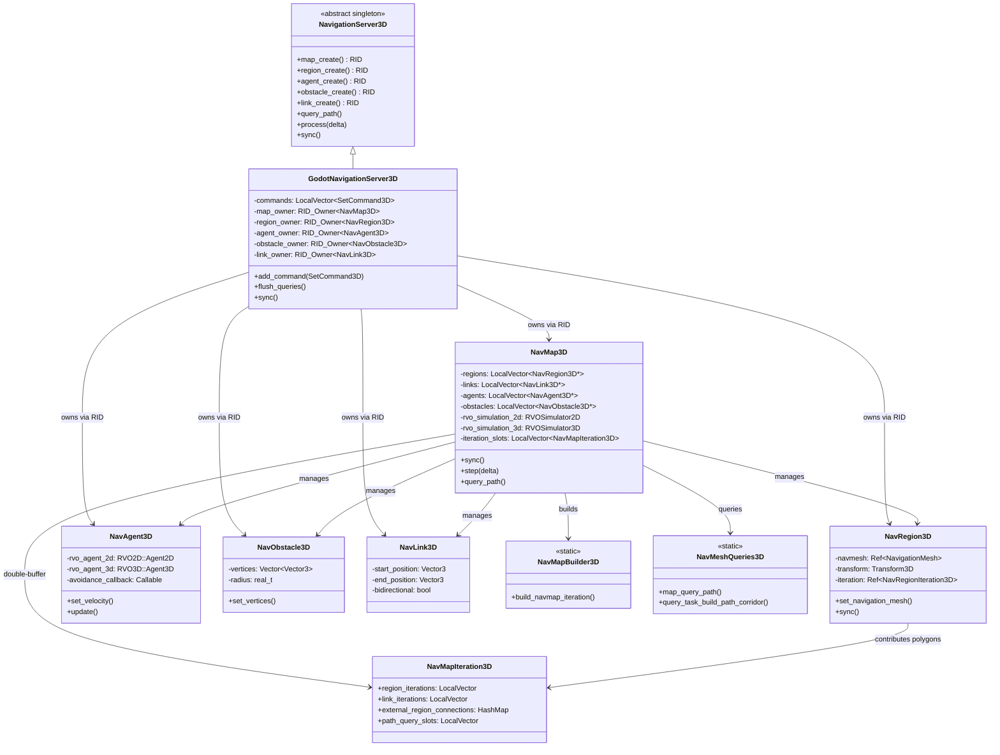

# 19. 导航系统 (Navigation System) — Godot vs UE 源码深度对比

> **一句话总结**：Godot 用轻量级 Server 单例 + RID 句柄 + 自研 A* 实现导航，UE 用重量级 Recast/Detour 中间件 + UObject 体系构建工业级导航系统。

---

## 目录

- [第 1 章：模块概览 — "UE 程序员 30 秒速览"](#第-1-章模块概览--ue-程序员-30-秒速览)
- [第 2 章：架构对比 — "同一个问题，两种解法"](#第-2-章架构对比--同一个问题两种解法)
- [第 3 章：核心实现对比 — "代码层面的差异"](#第-3-章核心实现对比--代码层面的差异)
- [第 4 章：UE → Godot 迁移指南](#第-4-章ue--godot-迁移指南)
- [第 5 章：性能对比](#第-5-章性能对比)
- [第 6 章：总结 — "一句话记住"](#第-6-章总结--一句话记住)

---

## 第 1 章：模块概览 — "UE 程序员 30 秒速览"

### 1.1 模块定位

Godot 的导航系统由 `NavigationServer2D` / `NavigationServer3D` 两个独立的 Server 单例驱动，负责导航网格管理、A* 寻路、RVO 避障和导航链接。对应 UE 中的 `UNavigationSystemV1` + `ARecastNavMesh` + Detour 寻路 + `UCrowdManager` (RVO) 的完整导航栈。

Godot 的核心设计哲学是 **Server-Client 分离**：场景节点（如 `NavigationRegion3D`、`NavigationAgent3D`）只是 "客户端"，真正的数据和计算全部在 Server 端通过 RID 句柄管理。这与 UE 中导航数据直接绑定到 `AActor`/`UActorComponent` 的方式形成鲜明对比。

### 1.2 核心类/结构体列表

| # | Godot 类 | 职责 | UE 对应物 |
|---|---------|------|----------|
| 1 | `NavigationServer3D` | 导航系统 3D 服务端单例（纯虚接口） | `UNavigationSystemV1` |
| 2 | `NavigationServer2D` | 导航系统 2D 服务端单例（纯虚接口） | 无直接对应（UE 无原生 2D 导航） |
| 3 | `GodotNavigationServer3D` | 3D 导航服务端的默认实现 | `UNavigationSystemV1`（具体实现） |
| 4 | `NavMap3D` | 导航地图，管理 Region/Agent/Obstacle | `ARecastNavMesh` + `FNavDataGenerator` |
| 5 | `NavRegion3D` | 导航区域，持有导航网格多边形 | `ANavMeshBoundsVolume` + NavMesh Tile |
| 6 | `NavAgent3D` | 导航代理，参与 RVO 避障 | `UCrowdFollowingComponent` / RVO Agent |
| 7 | `NavObstacle3D` | 导航障碍物（静态/动态） | `UNavModifierComponent` / Detour Obstacle |
| 8 | `NavLink3D` | 导航链接（跳跃、传送等） | `ANavLinkProxy` / `INavLinkCustomInterface` |
| 9 | `NavMeshQueries3D` | 寻路查询引擎（A* + 后处理） | `dtNavMeshQuery` (Detour) |
| 10 | `NavMapBuilder3D` | 导航地图构建器（边连接、区域合并） | `FRecastNavMeshGenerator` |
| 11 | `NavMeshGenerator3D` | 导航网格烘焙器（Recast 集成） | `FRecastNavMeshGenerator::GenerateTile` |
| 12 | `NavigationPathQueryParameters3D` | 寻路查询参数封装 | `FPathFindingQuery` |
| 13 | `NavigationPathQueryResult3D` | 寻路查询结果封装 | `FNavMeshPath` / `UNavigationPath` |
| 14 | `NavMapIteration3D` | 地图迭代快照（双缓冲读写分离） | 无直接对应（UE 用锁保护） |

### 1.3 Godot vs UE 概念速查表

| 概念 | Godot | UE |
|------|-------|-----|
| 导航系统入口 | `NavigationServer3D` 单例 (RID API) | `UNavigationSystemV1` (UObject, World 子系统) |
| 导航数据载体 | `NavMap3D` + `NavRegion3D` (RID) | `ARecastNavMesh` (AActor, 放置在关卡中) |
| 导航网格资源 | `NavigationMesh` (Resource) | `UNavMeshData` / dtNavMesh (Recast Tile) |
| 寻路算法 | 自研 A* on polygon graph | Detour A* (`dtNavMeshQuery::findPath`) |
| 路径后处理 | Corridor Funnel / Edge Centered / None | String Pulling (Detour `findStraightPath`) |
| 避障算法 | RVO2D + RVO3D (内置库) | RVO2 via `UCrowdManager` (Detour Crowd) |
| 导航链接 | `NavLink3D` (双向/单向, RID) | `ANavLinkProxy` / `INavLinkCustomInterface` |
| 导航层过滤 | `navigation_layers` (uint32 bitmask) | `FNavAgentProperties` + `UNavigationQueryFilter` |
| 异步烘焙 | `bake_from_source_geometry_data_async` | `FRecastNavMeshGenerator` (Tile-based async) |
| 调试可视化 | Server 内置 debug 材质/颜色 | `ARecastNavMesh::DrawDebugHelpers` + Editor |
| 2D 导航 | 原生 `NavigationServer2D` | 无原生支持 |
| 动态更新 | Region dirty → async rebuild iteration | Dirty Area → Tile rebuild (时间切片) |

---

## 第 2 章：架构对比 — "同一个问题，两种解法"

### 2.1 Godot 导航系统架构

Godot 的导航系统采用经典的 **Server-Client 架构**，与渲染服务器（RenderingServer）、物理服务器（PhysicsServer）保持一致的设计模式。



### 2.2 UE 导航系统架构（简要）

UE 的导航系统是一个深度集成到 World 中的 UObject 子系统：

- **`UNavigationSystemV1`**：继承自 `UNavigationSystemBase`，作为 `UWorld` 的子对象存在。管理所有 `ANavigationData` 实例、导航八叉树（`FNavigationOctree`）、脏区域控制器等。
- **`ARecastNavMesh`**：继承自 `ANavigationData`（继承自 `AActor`），是放置在关卡中的 Actor。内部持有 `dtNavMesh`（Recast/Detour 的核心数据结构）和 `FPImplRecastNavMesh`（Detour 查询封装）。
- **`FRecastNavMeshGenerator`**：负责 Tile-based 的异步导航网格生成，使用 Recast 库进行体素化、区域划分、轮廓提取和多边形网格生成。
- **`UCrowdManager`**：基于 Detour Crowd 的 RVO 避障管理器。

**关键源码路径**：
- `Engine/Source/Runtime/NavigationSystem/Public/NavigationSystem.h` — `UNavigationSystemV1`
- `Engine/Source/Runtime/NavigationSystem/Public/NavMesh/RecastNavMesh.h` — `ARecastNavMesh`
- `Engine/Source/Runtime/NavigationSystem/Public/NavMesh/RecastNavMeshGenerator.h` — 生成器
- `Engine/Source/Runtime/Engine/Classes/AI/NavigationSystemBase.h` — 基类

### 2.3 关键架构差异分析

#### 差异 1：Server 单例 vs World 子系统 — 设计哲学的根本分歧

Godot 的 `NavigationServer3D` 是一个**全局单例**，通过 `NavigationServer3D::get_singleton()` 访问，所有导航操作都通过 RID 句柄进行。这意味着导航数据完全脱离场景树，Server 端的 `NavMap3D`、`NavRegion3D` 等对象不是 `Node`，不参与场景树的生命周期管理。场景节点（如 `NavigationRegion3D`）只是 "代理"，在 `_enter_tree` 时向 Server 注册 RID，在 `_exit_tree` 时释放。

```cpp
// Godot: servers/navigation_3d/navigation_server_3d.h
class NavigationServer3D : public Object {
    GDCLASS(NavigationServer3D, Object);
    static NavigationServer3D *singleton;
    // 所有 API 都是 RID-based 的纯虚函数
    virtual RID map_create() = 0;
    virtual void map_set_active(RID p_map, bool p_active) = 0;
};
```

UE 的 `UNavigationSystemV1` 是 **World 的子对象**（`UCLASS(Within=World)`），生命周期与 World 绑定。导航数据 `ARecastNavMesh` 是放置在关卡中的 `AActor`，参与 UObject 的 GC、序列化和反射系统。

```cpp
// UE: NavigationSystem.h
UCLASS(Within=World, config=Engine, defaultconfig)
class NAVIGATIONSYSTEM_API UNavigationSystemV1 : public UNavigationSystemBase {
    UPROPERTY(Transient)
    ANavigationData* MainNavData;
    UPROPERTY(Transient)
    TArray<ANavigationData*> NavDataSet;
};
```

**Trade-off 分析**：Godot 的 Server 模式带来了极低的耦合度和清晰的线程边界（Server 可以在独立线程运行），但代价是 API 不够直观（需要手动管理 RID 生命周期）。UE 的 UObject 集成让导航数据可以直接在编辑器中可视化编辑、序列化保存，但也带来了更高的内存开销和更复杂的线程安全问题。

#### 差异 2：自研寻路 vs Recast/Detour 中间件 — 控制权与成熟度的博弈

Godot 的寻路完全自研：`NavMeshQueries3D` 实现了基于多边形图的 A* 算法，`NavMapBuilder3D` 负责构建多边形间的连接关系。导航网格的烘焙虽然也使用了 Recast 库（通过 `NavMeshGenerator3D` 中的状态机可以看到 `BAKE_STATE_CREATE_HEIGHTFIELD`、`BAKE_STATE_CREATING_CONTOURS` 等 Recast 典型步骤），但寻路查询完全是自己实现的。

```cpp
// Godot: modules/navigation_3d/3d/nav_mesh_queries_3d.cpp
// 自研 A* 实现，直接操作 NavigationPoly 结构
void NavMeshQueries3D::_query_task_build_path_corridor(...) {
    // This is an implementation of the A* algorithm.
    uint32_t least_cost_id = p_query_task.path_query_slot->poly_to_id[begin_poly];
    bool found_route = false;
    // ... 使用 Heap 数据结构进行 A* 搜索
}
```

UE 则完全依赖 Detour 库进行寻路：`dtNavMeshQuery::findPath()` 执行 A* 搜索，`findStraightPath()` 执行 String Pulling 后处理。UE 的 `FPImplRecastNavMesh` 是对 Detour 查询接口的封装。

**Trade-off 分析**：Godot 自研寻路的优势是完全可控、易于定制（如自定义路径后处理模式 `PATH_POSTPROCESSING_NONE`），且代码量相对较小（`nav_mesh_queries_3d.cpp` 约 1369 行）。劣势是缺少 Detour 多年积累的优化（如 Tile-based 局部更新、层级寻路等）。UE 的 Detour 集成经过大量商业项目验证，但定制难度较高，且 Detour 的 C 风格 API 与 UE 的 C++ 风格存在阻抗不匹配。

#### 差异 3：双缓冲迭代 vs 锁保护 — 并发策略的差异

Godot 的 `NavMap3D` 使用了精巧的**双缓冲迭代机制**（`iteration_slots`）：地图构建在后台线程完成，构建完成后通过 ping-pong 切换 `iteration_slot_index` 来发布新数据，读取端通过 `NavMapIterationRead3D` RAII 守卫获取当前迭代的读锁。

```cpp
// Godot: modules/navigation_3d/nav_map_3d.h
uint32_t iteration_slot_index = 0;
LocalVector<NavMapIteration3D> iteration_slots; // 双缓冲
mutable RWLock iteration_slot_rwlock;

// 切换时只需要写锁一瞬间
void NavMap3D::_sync_iteration() {
    iteration_slot_rwlock.write_lock();
    uint32_t next = (iteration_slot_index + 1) % 2;
    iteration_slot_index = next;
    iteration_slot_rwlock.write_unlock();
}
```

UE 的 `ARecastNavMesh` 使用更传统的锁机制：`RECAST_ASYNC_REBUILDING` 宏控制是否启用异步重建，Tile 数据的访问通过 critical section 保护。`FNavRegenTimeSliceManager` 提供时间切片机制来分摊重建开销。

**Trade-off 分析**：Godot 的双缓冲方案在读多写少的场景下几乎无锁（读操作只需要一次极短的 read_lock 来获取 slot index），非常适合多个 Agent 同时查询路径的场景。UE 的方案更灵活（支持 Tile 级别的局部更新），但在高并发查询时可能产生更多锁竞争。

---

## 第 3 章：核心实现对比 — "代码层面的差异"

### 3.1 NavigationServer vs UNavigationSystemV1：导航系统架构

#### Godot 的实现

Godot 的导航系统采用**命令队列模式**（Command Pattern）。`GodotNavigationServer3D` 中所有修改操作（set 类方法）不会立即执行，而是封装为 `SetCommand3D` 对象加入队列，在 `sync()` 阶段统一执行。

```cpp
// Godot: modules/navigation_3d/3d/godot_navigation_server_3d.h
// COMMAND_2 宏展开后生成两个方法：
// 1. map_set_active() — 创建命令对象加入队列
// 2. _cmd_map_set_active() — 实际执行逻辑
COMMAND_2(map_set_active, RID, p_map, bool, p_active);

// 资源通过 RID_Owner 管理
mutable RID_Owner<NavMap3D> map_owner;
mutable RID_Owner<NavRegion3D> region_owner;
mutable RID_Owner<NavAgent3D> agent_owner;
```

Server 的生命周期由 `NavigationServer3DManager` 管理，支持注册多个 Server 实现并选择默认实现：

```cpp
// Godot: servers/navigation_3d/navigation_server_3d.h
class NavigationServer3DManager : public Object {
    Vector<ClassInfo> navigation_servers;
    void register_server(const String &p_name, const Callable &p_create_callback);
    NavigationServer3D *new_default_server();
};
```

**关键源码路径**：
- `servers/navigation_3d/navigation_server_3d.h` — 抽象接口（581 行）
- `modules/navigation_3d/3d/godot_navigation_server_3d.h` — 默认实现（305 行）

#### UE 的实现

UE 的 `UNavigationSystemV1` 是一个庞大的类（`NavigationSystem.h` 有 1302 行），直接管理：
- `NavDataSet`：所有 `ANavigationData` 实例的数组
- `FNavigationOctreeController`：导航八叉树，用于空间查询
- `FNavigationDirtyAreasController`：脏区域管理，驱动增量更新
- `UCrowdManagerBase`：人群避障管理器

```cpp
// UE: NavigationSystem.h
UCLASS(Within=World, config=Engine, defaultconfig)
class NAVIGATIONSYSTEM_API UNavigationSystemV1 : public UNavigationSystemBase {
    UPROPERTY(Transient)
    ANavigationData* MainNavData;
    UPROPERTY(config, EditAnywhere, Category = Agents)
    TArray<FNavDataConfig> SupportedAgents;
    // 支持多种 Agent 类型，每种有独立的 NavData
};
```

#### 差异点评

| 维度 | Godot | UE |
|------|-------|-----|
| 类规模 | 接口 ~580 行，实现 ~305 行 | 单文件 ~1302 行 |
| 修改策略 | 命令队列延迟执行 | 直接修改 + 脏标记 |
| 资源管理 | RID_Owner（类型安全的句柄池） | UObject GC + UPROPERTY |
| 多 Agent 类型 | 单一 Map，通过 navigation_layers 过滤 | 多 NavData 实例，每种 Agent 独立 NavMesh |
| 可替换性 | Server 可通过 Manager 替换实现 | 通过 NavigationSystemConfig 配置 |

Godot 的命令队列模式确保了线程安全（所有修改在 sync 时串行执行），但增加了一帧延迟。UE 的直接修改模式响应更快，但需要更复杂的锁机制来保证线程安全。

### 3.2 导航网格生成与使用

#### Godot 的实现

Godot 的导航网格生成分为两个阶段：

**阶段 1：源几何体解析**（`NavMeshGenerator3D::parse_source_geometry_data`）
- 遍历场景树，收集可行走几何体
- 支持自定义解析器（`source_geometry_parser_create`）
- 结果存储在 `NavigationMeshSourceGeometryData3D` 中

**阶段 2：烘焙**（`NavMeshGenerator3D::bake_from_source_geometry_data`）
- 使用 Recast 库进行体素化和多边形生成
- 状态机驱动，包含完整的 Recast 流水线：

```cpp
// Godot: modules/navigation_3d/3d/nav_mesh_generator_3d.h
enum NavMeshBakeState {
    BAKE_STATE_CONFIGURATION,
    BAKE_STATE_CALC_GRID_SIZE,
    BAKE_STATE_CREATE_HEIGHTFIELD,
    BAKE_STATE_MARK_WALKABLE_TRIANGLES,
    BAKE_STATE_CONSTRUCT_COMPACT_HEIGHTFIELD,
    BAKE_STATE_ERODE_WALKABLE_AREA,
    BAKE_STATE_SAMPLE_PARTITIONING,
    BAKE_STATE_CREATING_CONTOURS,
    BAKE_STATE_CREATING_POLYMESH,
    BAKE_STATE_CONVERTING_NATIVE_NAVMESH,
    BAKE_STATE_BAKE_FINISHED,
};
```

烘焙完成后，`NavigationMesh` 资源被设置到 `NavRegion3D`，Region 将网格数据转换为内部的 `Nav3D::Polygon` 数组。然后 `NavMapBuilder3D` 负责构建多边形间的连接关系：

```cpp
// Godot: modules/navigation_3d/3d/nav_map_builder_3d.h
class NavMapBuilder3D {
    static void _build_step_gather_region_polygons(NavMapIterationBuild3D &r_build);
    static void _build_step_find_edge_connection_pairs(NavMapIterationBuild3D &r_build);
    static void _build_step_merge_edge_connection_pairs(NavMapIterationBuild3D &r_build);
    static void _build_step_edge_connection_margin_connections(NavMapIterationBuild3D &r_build);
    static void _build_step_navlink_connections(NavMapIterationBuild3D &r_build);
};
```

**关键源码路径**：
- `modules/navigation_3d/3d/nav_mesh_generator_3d.h` — 烘焙器（123 行）
- `modules/navigation_3d/3d/nav_map_builder_3d.cpp` — 地图构建（433 行）
- `modules/navigation_3d/nav_region_3d.h` — 区域（134 行）

#### UE 的实现

UE 的导航网格生成由 `FRecastNavMeshGenerator` 驱动，采用 **Tile-based** 架构：
- 世界被划分为固定大小的 Tile（默认 `RECAST_MIN_TILE_SIZE = 300`）
- 每个 Tile 独立生成，支持异步和时间切片
- 使用完整的 Recast 流水线：体素化 → 区域划分（Watershed/Monotone/ChunkyMonotone）→ 轮廓提取 → 多边形网格生成
- 生成的 Tile 数据存储在 `dtNavMesh` 中，支持运行时动态添加/移除 Tile

```cpp
// UE: RecastNavMesh.h
#define RECAST_MAX_SEARCH_NODES  2048
#define RECAST_MIN_TILE_SIZE     300.f
#define RECAST_MAX_AREAS         64
```

#### 差异点评

| 维度 | Godot | UE |
|------|-------|-----|
| 网格粒度 | 整个 Region 一次性烘焙 | Tile-based 分块烘焙 |
| 动态更新 | Region 整体重建 | 单个 Tile 局部重建 |
| 区域划分 | 通过 Recast 参数配置 | Watershed/Monotone/ChunkyMonotone 可选 |
| 连接构建 | 自研边匹配 + margin 连接 | Detour 内置 off-mesh link |
| 数据格式 | `Nav3D::Polygon` (自研) | `dtNavMesh` (Detour 原生) |

Godot 的 Region 级别重建在小型场景中足够高效，但在大型开放世界中，无法像 UE 那样只重建受影响的 Tile。UE 的 Tile-based 架构是为大型场景设计的，但也带来了更高的内存开销（每个 Tile 需要独立的头信息和连接数据）。

### 3.3 寻路 Agent 对比：NavigationAgent vs AIController MoveTo

#### Godot 的实现

Godot 的 `NavAgent3D` 是一个轻量级的数据容器，主要存储 RVO 避障参数：

```cpp
// Godot: modules/navigation_3d/nav_agent_3d.h
class NavAgent3D : public NavRid3D {
    Vector3 position;
    Vector3 velocity;
    real_t radius, height, max_speed;
    real_t time_horizon_agents, time_horizon_obstacles;
    int max_neighbors;
    real_t neighbor_distance;
    
    RVO2D::Agent2D rvo_agent_2d;  // 2D RVO 代理
    RVO3D::Agent3D rvo_agent_3d;  // 3D RVO 代理
    bool use_3d_avoidance = false;
    
    Callable avoidance_callback;  // 避障结果回调
};
```

**关键设计**：Godot 的 Agent 不负责寻路！寻路是通过 `NavigationServer3D::query_path()` 独立完成的。Agent 只参与 RVO 避障计算，计算完成后通过 `avoidance_callback` 通知场景节点。场景层的 `NavigationAgent3D` 节点负责协调寻路和避障：

```
用户调用 NavigationAgent3D.target_position = xxx
  → NavigationAgent3D 调用 NavigationServer3D::query_path() 获取路径
  → NavigationAgent3D 沿路径移动，每帧设置 agent velocity
  → NavAgent3D 参与 RVO 避障，计算 safe_velocity
  → avoidance_callback 返回 safe_velocity
  → NavigationAgent3D 使用 safe_velocity 移动角色
```

#### UE 的实现

UE 的寻路和移动是深度集成的：

```
AIController::MoveToLocation()
  → UPathFollowingComponent::RequestMove()
  → UNavigationSystemV1::FindPathSync() / FindPathAsync()
    → ARecastNavMesh::FindPath()
      → dtNavMeshQuery::findPath() (Detour A*)
      → dtNavMeshQuery::findStraightPath() (String Pulling)
  → UPathFollowingComponent 沿路径移动
  → UCrowdFollowingComponent (可选) 参与 Detour Crowd 避障
```

UE 的 `UCrowdFollowingComponent` 继承自 `UPathFollowingComponent`，将寻路和避障统一在一个组件中。Detour Crowd 不仅做 RVO 避障，还会根据避障结果调整路径。

#### 差异点评

| 维度 | Godot | UE |
|------|-------|-----|
| 寻路与避障 | 完全解耦（独立 API） | 深度集成（CrowdFollowing） |
| Agent 职责 | 仅 RVO 避障数据 | 寻路 + 路径跟随 + 避障 |
| 回调机制 | Callable 回调 | Delegate + Component 事件 |
| 路径调整 | 避障不影响路径 | Crowd 可调整路径 |
| 多 Agent 类型 | 单一类型，layers 过滤 | `FNavAgentProperties` 多类型 |

Godot 的解耦设计更灵活（可以只用寻路不用避障，或只用避障不用寻路），但需要用户自己协调两者。UE 的集成方案开箱即用，但定制难度更高。

### 3.4 避障系统：RVO 实现对比

#### Godot 的实现

Godot 内置了 RVO2D 和 RVO3D 两个避障库，直接集成在 `NavMap3D` 中：

```cpp
// Godot: modules/navigation_3d/nav_map_3d.h
class NavMap3D : public NavRid3D {
    RVO2D::RVOSimulator2D rvo_simulation_2d;
    RVO3D::RVOSimulator3D rvo_simulation_3d;
    LocalVector<NavAgent3D *> active_2d_avoidance_agents;
    LocalVector<NavAgent3D *> active_3d_avoidance_agents;
};
```

避障计算在 `step()` 方法中执行，支持多线程并行：

```cpp
// Godot: modules/navigation_3d/nav_map_3d.cpp
void NavMap3D::step(double p_delta_time) {
    rvo_simulation_2d.setTimeStep(float(p_delta_time));
    if (active_2d_avoidance_agents.size() > 0) {
        if (use_threads && avoidance_use_multiple_threads) {
            // 使用 WorkerThreadPool 并行计算每个 Agent 的避障
            WorkerThreadPool::GroupID group_task = 
                WorkerThreadPool::get_singleton()->add_template_group_task(
                    this, &NavMap3D::compute_single_avoidance_step_2d,
                    active_2d_avoidance_agents.ptr(),
                    active_2d_avoidance_agents.size(), -1, true,
                    SNAME("RVOAvoidanceAgents2D"));
            WorkerThreadPool::get_singleton()->wait_for_group_task_completion(group_task);
        }
    }
}
```

每个 Agent 的避障步骤：
1. `computeNeighbors()` — 使用 KdTree 查找邻近 Agent
2. `computeNewVelocity()` — RVO 算法计算安全速度
3. `update()` — 更新 Agent 状态

**障碍物处理**：`NavObstacle3D` 的顶点被转换为 RVO2D 的 `Obstacle2D` 链表，构建到 KdTree 中。注意 Godot 的静态障碍物只支持 2D 避障（Y 坐标被忽略）：

```cpp
// Godot: nav_map_3d.cpp
#ifdef TOOLS_ENABLED
if (_obstacle_vertex.y != 0) {
    WARN_PRINT_ONCE("Y coordinates of static obstacle vertices are ignored.");
}
#endif
```

**避障层系统**：Godot 提供了 `avoidance_layers` 和 `avoidance_mask` 的 bitmask 过滤机制，以及 `avoidance_priority` 优先级系统，允许精细控制哪些 Agent 之间需要互相避让。

#### UE 的实现

UE 使用 Detour Crowd 库（`dtCrowd`）进行避障，通过 `UCrowdManager` 管理：
- Detour Crowd 内置了 RVO 避障
- 支持路径优化（Crowd 会根据避障结果调整路径）
- 支持分离行为（Separation）、队列行为（Queue）等高级行为
- 通过 `dtCrowdAgentParams` 配置 Agent 参数

**关键源码路径**：
- `Engine/Source/Runtime/AIModule/Private/Navigation/CrowdManager.cpp`

#### 差异点评

| 维度 | Godot | UE |
|------|-------|-----|
| RVO 库 | 内置 RVO2D + RVO3D | Detour Crowd (内置 RVO) |
| 2D/3D 选择 | 每个 Agent 可独立选择 | 统一 3D |
| 静态障碍物 | 仅 2D 平面避障 | 3D 体积避障 |
| 高级行为 | 无（纯 RVO） | 分离、队列等 |
| 路径协调 | 避障与路径独立 | Crowd 可调整路径 |
| 并行计算 | WorkerThreadPool 并行 | 单线程（Detour Crowd 限制） |

Godot 的 RVO 实现更轻量，且支持 2D/3D 独立选择（对 2D 游戏友好）。但缺少 Detour Crowd 的高级行为（如队列、分离）。Godot 的多线程避障计算是一个亮点，在大量 Agent 场景下可能比 UE 的单线程 Crowd 更快。

---

## 第 4 章：UE → Godot 迁移指南

### 4.1 思维转换清单

1. **忘掉 NavMesh Actor，拥抱 Server API**
   - UE 中你习惯在关卡中放置 `ARecastNavMesh` 和 `ANavMeshBoundsVolume`。在 Godot 中，导航数据通过 `NavigationServer3D` 的 RID API 管理，场景节点只是代理。你需要习惯 `NavigationServer3D.map_create()` → `region_create()` → `region_set_map()` 这样的流程。

2. **忘掉 AIController::MoveTo，学习 NavigationAgent3D 的回调模式**
   - UE 中 `AIController::MoveToLocation()` 是一站式解决方案。Godot 中你需要自己协调 `NavigationAgent3D` 的路径查询和移动逻辑。设置 `target_position` 后，每帧在 `_physics_process` 中获取 `get_next_path_position()` 并自己移动角色。

3. **忘掉 NavigationQueryFilter，学习 navigation_layers**
   - UE 的 `UNavigationQueryFilter` 支持复杂的区域代价修改和过滤。Godot 使用简单的 `uint32` bitmask（`navigation_layers`）进行过滤，没有运行时代价修改能力。如果需要不同代价，使用 Region 的 `enter_cost` 和 `travel_cost`。

4. **忘掉 Tile-based 增量更新，接受 Region 级别重建**
   - UE 中修改一小块地形只会重建受影响的 Tile。Godot 中修改导航网格会触发整个 Region 的重建。对于大型场景，需要将导航网格拆分为多个小 Region。

5. **忘掉 CrowdManager 的高级行为，学习纯 RVO 回调**
   - UE 的 `UCrowdManager` 提供分离、队列等高级行为。Godot 的避障是纯 RVO，通过 `avoidance_callback` 返回安全速度。如果需要高级行为，需要自己在回调中实现。

6. **拥抱 2D 导航的原生支持**
   - UE 没有原生 2D 导航系统。Godot 提供完整的 `NavigationServer2D`，对 2D 游戏开发是巨大优势。

### 4.2 API 映射表

| UE API | Godot 等价 API | 备注 |
|--------|---------------|------|
| `UNavigationSystemV1::GetNavigationSystem()` | `NavigationServer3D.get_singleton()` | Godot 是全局单例 |
| `UNavigationSystemV1::FindPathSync()` | `NavigationServer3D.query_path()` | 支持同步和异步回调 |
| `UNavigationSystemV1::ProjectPointToNavigation()` | `NavigationServer3D.map_get_closest_point()` | — |
| `UNavigationSystemV1::GetRandomReachablePointInRadius()` | `NavigationServer3D.map_get_random_point()` | 通过 layers 过滤 |
| `ARecastNavMesh` (放置在关卡) | `NavigationRegion3D` (场景节点) | Godot 节点只是代理 |
| `ANavMeshBoundsVolume` | 无直接对应 | Godot 的 Region 自带边界 |
| `AIController::MoveToLocation()` | `NavigationAgent3D.target_position = pos` | 需要自己处理移动 |
| `UPathFollowingComponent::GetRemainingPathCost()` | `NavigationAgent3D.distance_to_target()` | — |
| `ANavLinkProxy` | `NavigationLink3D` (场景节点) | — |
| `UCrowdManager` | `NavigationServer3D` 内置 RVO | 无独立 Crowd 管理器 |
| `UNavigationQueryFilter` | `navigation_layers` (uint32 bitmask) | 功能更简单 |
| `FNavDataConfig::AgentRadius/Height` | `NavigationMesh.agent_radius/height` | 烘焙参数 |
| `dtNavMeshQuery::findPath()` | `NavMeshQueries3D::query_task_build_path_corridor()` | 自研 A* |
| `FRecastNavMeshGenerator::GenerateTile()` | `NavMeshGenerator3D::bake_from_source_geometry_data()` | 整体烘焙 vs Tile |
| `UNavModifierComponent` | `NavigationObstacle3D` (场景节点) | — |

### 4.3 陷阱与误区

#### 陷阱 1：RID 生命周期管理

UE 程序员习惯了 UObject 的自动 GC。在 Godot 中，通过 `NavigationServer3D` 创建的 RID 必须手动释放（`free_rid()`），否则会内存泄漏。场景节点（如 `NavigationRegion3D`）会在 `_exit_tree` 时自动释放，但如果你直接使用 Server API，必须自己管理。

```gdscript
# 错误：忘记释放 RID
var map = NavigationServer3D.map_create()
# ... 使用后忘记 free_rid

# 正确：
var map = NavigationServer3D.map_create()
# ... 使用完毕
NavigationServer3D.free_rid(map)
```

#### 陷阱 2：命令延迟执行

Godot 的 `NavigationServer3D` 使用命令队列，修改操作不会立即生效。如果你在设置 Region 后立即查询路径，可能得到旧数据。需要等待 `map_changed` 信号或调用 `map_force_update()`。

```gdscript
# 陷阱：设置后立即查询
NavigationServer3D.region_set_navigation_mesh(region, navmesh)
var path = NavigationServer3D.map_get_path(map, from, to, true)  # 可能返回旧路径！

# 正确：等待更新
NavigationServer3D.region_set_navigation_mesh(region, navmesh)
NavigationServer3D.map_force_update(map)  # 强制同步
var path = NavigationServer3D.map_get_path(map, from, to, true)
```

#### 陷阱 3：避障回调在主线程

Godot 的 RVO 避障计算可以在工作线程并行执行，但 `avoidance_callback` 的分发（`dispatch_callbacks()`）在主线程。如果回调中执行了耗时操作，会阻塞主线程。

#### 陷阱 4：2D 和 3D 导航完全独立

Godot 的 `NavigationServer2D` 和 `NavigationServer3D` 是完全独立的系统，不能混用。不能将 2D Agent 注册到 3D Map，反之亦然。这与 UE 中只有一个统一的导航系统不同。

### 4.4 最佳实践

1. **优先使用场景节点而非直接 Server API**
   - `NavigationRegion3D`、`NavigationAgent3D`、`NavigationLink3D`、`NavigationObstacle3D` 这些节点封装了 RID 生命周期管理，减少出错概率。

2. **合理拆分 Region**
   - 由于 Godot 不支持 Tile-based 局部更新，大型场景应拆分为多个小 Region。修改时只需重建受影响的 Region。

3. **使用异步烘焙**
   - `bake_from_source_geometry_data_async()` 在后台线程执行烘焙，不会阻塞主线程。配合回调使用：
   ```gdscript
   NavigationServer3D.bake_from_source_geometry_data_async(
       navmesh, source_geo, _on_bake_complete)
   ```

4. **利用 navigation_layers 做区域过滤**
   - 不同类型的 NPC（飞行、地面、水中）使用不同的 navigation_layers，一个 Map 即可服务多种 Agent。

5. **避障优先级控制**
   - 使用 `avoidance_priority` 让重要角色（如玩家、Boss）在避障中获得更高优先级，避免被小怪推开。

---

## 第 5 章：性能对比

### 5.1 Godot 导航系统的性能特征

#### 寻路性能

Godot 的 A* 寻路实现（`NavMeshQueries3D`）有以下性能特征：

- **路径查询槽位**：`NavMapIteration3D` 维护固定数量的 `PathQuerySlot`（默认 4 个），每个槽位预分配了 `path_corridor` 和 `traversable_polys` 堆。并发查询通过信号量（`path_query_slots_semaphore`）控制，超过槽位数的查询会等待。
- **多边形搜索限制**：支持 `path_search_max_polygons` 和 `path_search_max_distance` 限制搜索范围，避免在大型地图上搜索过多多边形。
- **路径简化**：`simplify_path` 使用 Douglas-Peucker 算法减少路径点数量。

```cpp
// Godot: nav_mesh_queries_3d.h
struct PathQuerySlot {
    LocalVector<Nav3D::NavigationPoly> path_corridor;
    Heap<Nav3D::NavigationPoly *, ...> traversable_polys;
    AHashMap<const Nav3D::Polygon *, uint32_t> poly_to_id;
};
```

**瓶颈**：
- 路径查询槽位数量固定（默认 4），高并发场景下可能成为瓶颈
- 没有层级寻路（Hierarchical Pathfinding），大型地图上长距离寻路开销较大
- `poly_to_id` 使用 `AHashMap`，在多边形数量很大时哈希查找开销不可忽略

#### 避障性能

- **KdTree 加速**：RVO 使用 KdTree 进行邻近查询，复杂度 O(n log n)
- **多线程并行**：避障计算通过 `WorkerThreadPool` 并行执行，每个 Agent 独立计算
- **2D/3D 分离**：2D 和 3D 避障 Agent 分别处理，减少不必要的计算

**瓶颈**：
- 每帧重建 KdTree（`_update_rvo_agents_tree_2d/3d`），Agent 数量很大时开销显著
- 静态障碍物每次 dirty 时重建所有 RVO Obstacle（`_update_rvo_obstacles_tree_2d`）

#### 地图构建性能

- **异步构建**：`NavMapBuilder3D::build_navmap_iteration()` 在工作线程执行
- **双缓冲**：构建完成后通过 ping-pong 切换，读取端几乎无等待
- **Region 异步迭代**：每个 Region 可以独立异步构建其迭代数据

### 5.2 与 UE 的性能差异

| 维度 | Godot | UE | 分析 |
|------|-------|-----|------|
| 寻路算法 | 自研 A* (polygon graph) | Detour A* (tile-based) | Detour 经过更多优化，支持层级寻路 |
| 并发查询 | 4 个固定槽位 | `RECAST_MAX_SEARCH_NODES=2048` | UE 支持更多并发 |
| 增量更新 | Region 级别重建 | Tile 级别重建 | UE 在大型场景中优势明显 |
| 避障并行 | WorkerThreadPool 多线程 | 单线程 (Detour Crowd) | Godot 在大量 Agent 时更快 |
| 内存占用 | 较低（自研数据结构） | 较高（Detour 完整数据） | Godot 更适合移动端 |
| 时间切片 | 无 | `FNavRegenTimeSliceManager` | UE 可控制每帧重建时间 |

### 5.3 性能敏感场景建议

1. **大量 Agent 寻路**（>100 个）
   - Godot：增加 `path_query_slots_max`，使用 `path_search_max_polygons` 限制搜索范围，考虑分帧查询
   - 避障方面 Godot 的多线程 RVO 有优势

2. **大型开放世界**
   - Godot：将世界拆分为多个小 Region，使用 `navigation_layers` 过滤不需要的区域
   - 这是 Godot 的弱项，缺少 Tile-based 局部更新

3. **动态环境**（频繁修改导航网格）
   - Godot：尽量减少 Region 大小，使用异步烘焙
   - UE 的 Tile-based 增量更新在此场景下优势巨大

4. **移动端/低端设备**
   - Godot 的轻量级实现更适合，内存占用更低
   - 使用 2D 避障（`use_3d_avoidance = false`）减少计算量

---

## 第 6 章：总结 — "一句话记住"

### 核心差异

**Godot 用 Server 单例 + RID + 自研 A* 构建了一个轻量灵活的导航系统；UE 用 Recast/Detour 中间件 + UObject 体系构建了一个工业级的重量级导航系统。**

### 设计亮点（Godot 做得比 UE 好的地方）

1. **原生 2D 导航支持**：`NavigationServer2D` 是完整的 2D 导航系统，对 2D 游戏开发者是巨大福利。UE 完全没有原生 2D 导航。

2. **多线程避障**：Godot 的 RVO 避障通过 `WorkerThreadPool` 并行计算每个 Agent，在大量 Agent 场景下比 UE 的单线程 Detour Crowd 更快。

3. **双缓冲迭代机制**：`NavMapIteration3D` 的 ping-pong 双缓冲设计让寻路查询几乎无锁，读写分离非常优雅。

4. **2D/3D 避障可选**：每个 Agent 可以独立选择使用 2D 或 3D 避障，对于主要在平面移动的角色可以节省计算量。

5. **Server 可替换**：`NavigationServer3DManager` 允许注册自定义 Server 实现，可以完全替换导航系统的后端。

### 设计短板（Godot 不如 UE 的地方）

1. **缺少 Tile-based 增量更新**：这是最大的短板。大型场景中修改一小块区域需要重建整个 Region，而 UE 只需重建受影响的 Tile。

2. **缺少层级寻路**：没有 Hierarchical Pathfinding，长距离寻路在大型地图上性能不佳。

3. **缺少高级避障行为**：没有 Detour Crowd 的分离、队列等高级行为，需要用户自己实现。

4. **路径查询并发限制**：固定的 PathQuerySlot 数量（默认 4）限制了并发查询能力。

5. **缺少运行时区域代价修改**：UE 的 `UNavigationQueryFilter` 可以在运行时动态修改区域代价，Godot 只能通过 Region 的固定 `travel_cost` 控制。

6. **缺少导航八叉树**：UE 的 `FNavigationOctree` 提供高效的空间查询，Godot 没有类似的加速结构。

### UE 程序员的学习路径建议

**推荐阅读顺序**：

1. **先读接口**：`servers/navigation_3d/navigation_server_3d.h` — 理解 Server API 的全貌（581 行，纯虚接口，一目了然）

2. **再读实现**：`modules/navigation_3d/3d/godot_navigation_server_3d.h` — 理解命令队列模式和 RID 管理

3. **核心数据结构**：`modules/navigation_3d/nav_utils_3d.h` — 理解 `Polygon`、`Connection`、`NavigationPoly` 等核心结构

4. **寻路引擎**：`modules/navigation_3d/3d/nav_mesh_queries_3d.cpp` — 理解自研 A* 实现（重点看 `_query_task_build_path_corridor`）

5. **地图构建**：`modules/navigation_3d/3d/nav_map_builder_3d.cpp` — 理解边连接和区域合并

6. **避障系统**：`modules/navigation_3d/nav_map_3d.cpp` 中的 `step()` 和 `_sync_avoidance()` — 理解 RVO 集成

7. **双缓冲机制**：`modules/navigation_3d/3d/nav_map_iteration_3d.h` — 理解迭代快照和读写分离

**预计学习时间**：有 UE 导航系统经验的程序员，约 2-3 天可以完全理解 Godot 导航系统的架构和实现。核心代码量约 5000 行（不含 2D 部分），远小于 UE 的导航系统代码量。
