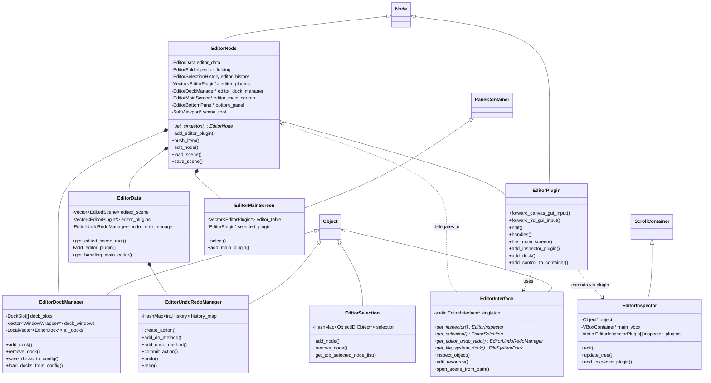

# 20 - 编辑器框架 (Editor Framework)

> **核心结论**：Godot 编辑器是一个用自身 UI 框架构建的单体 Node 应用，而 UE 编辑器是基于 Slate 的模块化 Tab 系统——前者极致统一，后者极致可扩展。

---

## 目录

- [第 1 章：模块概览 — "UE 程序员 30 秒速览"](#第-1-章模块概览--ue-程序员-30-秒速览)
- [第 2 章：架构对比 — "同一个问题，两种解法"](#第-2-章架构对比--同一个问题两种解法)
- [第 3 章：核心实现对比 — "代码层面的差异"](#第-3-章核心实现对比--代码层面的差异)
- [第 4 章：UE → Godot 迁移指南](#第-4-章ue--godot-迁移指南)
- [第 5 章：性能对比](#第-5-章性能对比)
- [第 6 章：总结 — "一句话记住"](#第-6-章总结--一句话记住)

---

## 第 1 章：模块概览 — "UE 程序员 30 秒速览"

### 一句话说明

Godot 的编辑器框架（`editor/` 目录）负责构建整个编辑器 UI、管理编辑器插件、属性检查器和 Dock 面板，功能上对应 UE 的 **LevelEditor 模块 + PropertyEditor 模块 + UnrealEd 模块**的组合。但最大的区别在于：**Godot 编辑器本身就是一个 Godot 应用**——它使用自己的 Control 节点系统来构建 UI，而 UE 编辑器使用独立的 Slate UI 框架。

### 核心类/结构体列表

| # | Godot 类 | 源码位置 | 职责 | UE 对应物 |
|---|---------|---------|------|----------|
| 1 | `EditorNode` | `editor/editor_node.h` | 编辑器主框架，单例，管理所有编辑器子系统 | `FLevelEditorModule` + `SLevelEditor` |
| 2 | `EditorPlugin` | `editor/plugins/editor_plugin.h` | 编辑器插件基类，扩展编辑器功能 | `IModuleInterface` + `FEditorModeBase` |
| 3 | `EditorInterface` | `editor/editor_interface.h` | 编辑器公共 API 门面，暴露给脚本和插件 | `GEditor` (UEditorEngine) |
| 4 | `EditorInspector` | `editor/inspector/editor_inspector.h` | 属性检查器面板 | `IDetailsView` / `SDetailsView` |
| 5 | `EditorProperty` | `editor/inspector/editor_inspector.h` | 单个属性编辑器控件 | `IPropertyHandle` + `IDetailCustomization` |
| 6 | `EditorInspectorPlugin` | `editor/inspector/editor_inspector.h` | Inspector 插件，自定义属性显示 | `IDetailCustomization` / `IPropertyTypeCustomization` |
| 7 | `EditorData` | `editor/editor_data.h` | 编辑器数据管理（场景列表、插件状态、自定义类型） | `FEditorModeTools` + `UEditorEngine` 内部状态 |
| 8 | `EditorSelection` | `editor/editor_data.h` | 编辑器选择集管理 | `USelection` / `FEditorModeTools::GetSelectedActors()` |
| 9 | `EditorUndoRedoManager` | `editor/editor_undo_redo_manager.h` | 编辑器撤销/重做管理器（多历史） | `FScopedTransaction` + `GEditor->Trans` |
| 10 | `EditorDockManager` | `editor/docks/editor_dock_manager.h` | Dock 面板管理器 | `FTabManager` / `FLayoutService` |
| 11 | `EditorMainScreen` | `editor/editor_main_screen.h` | 主屏幕切换（2D/3D/Script/AssetLib） | `FLevelEditorModule` 的 Tab 系统 |
| 12 | `EditorSelectionHistory` | `editor/editor_data.h` | 对象编辑历史导航 | `FEditorModeTools` 选择历史 |
| 13 | `EditorLog` | `editor/editor_log.h` | 编辑器日志面板 | `SOutputLog` / `FOutputLogModule` |
| 14 | `EditorFileDialog` | `editor/gui/editor_file_dialog.h` | 编辑器文件对话框 | `IDesktopPlatform::OpenFileDialog` |
| 15 | `EditorPlugins` | `editor/plugins/editor_plugin.h` | 插件工厂注册表（静态） | `FModuleManager` 插件注册 |

### Godot vs UE 概念速查表

| 概念 | Godot | UE | 关键差异 |
|------|-------|-----|---------|
| 编辑器主框架 | `EditorNode` (单例 Node) | `FLevelEditorModule` + `SLevelEditor` (Slate Widget) | Godot 是 Node 树的一部分；UE 是独立模块 |
| 编辑器插件 | `EditorPlugin` (继承 Node) | `IModuleInterface` / `FEditorModeBase` | Godot 插件是场景树中的节点；UE 是 DLL 模块 |
| 属性面板 | `EditorInspector` (ScrollContainer) | `IDetailsView` (SCompoundWidget) | Godot 用自己的 Control 节点；UE 用 Slate |
| 属性自定义 | `EditorInspectorPlugin` | `IDetailCustomization` | Godot 用虚函数回调；UE 用 DetailBuilder 模式 |
| Dock 系统 | `EditorDockManager` + `TabContainer` | `FTabManager` + `SDockTab` | Godot 固定槽位；UE 完全自由布局 |
| 撤销/重做 | `EditorUndoRedoManager` (多历史) | `FScopedTransaction` + `UTransactor` | Godot 按场景分历史；UE 全局事务 |
| 编辑器扩展脚本 | `@tool` 脚本 + `EditorPlugin` | `EditorUtilityWidget` + `Blutility` | Godot 直接在场景脚本中运行；UE 需要专门的 Utility 类 |
| 编辑器 GUI 框架 | 自身的 Control 节点系统 | Slate (独立 C++ UI 框架) | Godot 编辑器 = Godot 应用；UE 编辑器 ≠ UE 游戏 |
| 主屏幕切换 | `EditorMainScreen` (2D/3D/Script) | Tab 系统 (Viewport/Blueprint/等) | Godot 互斥切换；UE 可同时打开多个 |
| 编辑器公共 API | `EditorInterface` (单例) | `GEditor` (UEditorEngine 全局指针) | Godot 有清晰的 API 门面；UE 分散在多个子系统 |
| 场景管理 | `EditorData::EditedScene` | `UWorld` + `ULevel` | Godot 多场景标签页；UE 单世界多关卡 |
| 选择集 | `EditorSelection` (Object) | `USelection` (UObject) | 接口相似，但 Godot 更轻量 |

---

## 第 2 章：架构对比 — "同一个问题，两种解法"

### 2.1 Godot 编辑器架构

Godot 编辑器的核心设计哲学是 **"编辑器即 Godot 应用"**（Editor-as-a-Godot-App）。整个编辑器就是一个运行在 Godot 引擎上的应用程序，使用 Godot 自己的 `Control` 节点来构建所有 UI。



**关键架构特征：**

- `EditorNode` 继承自 `Node`，是整个编辑器的根节点，采用**单例模式**
- 所有编辑器 UI 都是 `Control` 节点，与游戏 UI 使用完全相同的系统
- `EditorInterface` 作为**门面模式**（Facade），为插件和脚本提供稳定的公共 API
- 插件系统通过 `EditorPlugin`（也是 Node）实现，插件被添加到场景树中

### 2.2 UE 编辑器架构

UE 编辑器采用**模块化架构**，核心是 `FLevelEditorModule`（实现 `IModuleInterface`），UI 层使用独立的 **Slate** 框架。

```
UE 编辑器核心架构：
┌─────────────────────────────────────────────────────┐
│                  FModuleManager                      │
│  ┌──────────────┐  ┌──────────────┐  ┌────────────┐ │
│  │LevelEditor   │  │PropertyEditor│  │UnrealEd    │ │
│  │Module        │  │Module        │  │Module      │ │
│  │(IModuleIface)│  │(IModuleIface)│  │(IModuleIf.)│ │
│  └──────┬───────┘  └──────┬───────┘  └─────┬──────┘ │
│         │                 │                 │        │
│  ┌──────▼───────┐  ┌──────▼───────┐  ┌─────▼──────┐ │
│  │SLevelEditor  │  │SDetailsView  │  │FEditorMode │ │
│  │(Slate Widget)│  │(Slate Widget)│  │Tools       │ │
│  └──────────────┘  └──────────────┘  └────────────┘ │
│                                                      │
│  ┌─────────────────────────────────────────────────┐ │
│  │         FTabManager (Dock/Tab 系统)              │ │
│  │  SDockTab | SDockTab | SDockTab | SDockTab      │ │
│  └─────────────────────────────────────────────────┘ │
└─────────────────────────────────────────────────────┘
```

**关键架构特征：**

- 编辑器由多个独立的 `IModuleInterface` 模块组成，通过 `FModuleManager` 管理
- UI 使用 **Slate** 框架（独立于 UMG/游戏 UI），`SWidget` 体系
- Tab/Dock 系统使用 `FTabManager`，支持完全自由的布局拖拽
- 属性面板通过 `FPropertyEditorModule` 提供，支持 `IDetailCustomization` 自定义

### 2.3 关键架构差异分析

#### 差异 1：编辑器与引擎的关系 —— "自举" vs "分层"

**Godot 的"自举"（Self-Hosting）设计**是其最独特的架构决策。`EditorNode` 继承自 `Node`（见 `editor/editor_node.h:109`），编辑器的所有 UI 控件（按钮、面板、对话框）都是 `Control` 节点。这意味着编辑器本身就是一个 Godot 场景树。当你在编辑器中看到一个按钮时，它和你在游戏中创建的 `Button` 节点是**完全相同的类**。

```cpp
// Godot: editor/editor_node.h
class EditorNode : public Node {  // 编辑器就是一个 Node！
    GDCLASS(EditorNode, Node);
    // ...
    SubViewport *scene_root = nullptr; // 被编辑的场景在这个 SubViewport 中渲染
};
```

**UE 的"分层"设计**则完全不同。UE 编辑器使用 **Slate**——一个独立于 UMG 的 C++ UI 框架。`SLevelEditor` 继承自 `SCompoundWidget`，与游戏中的 `UUserWidget` 完全是两套系统。编辑器模块通过 `IModuleInterface` 注册，与游戏运行时完全解耦。

```cpp
// UE: Engine/Source/Editor/LevelEditor/Public/LevelEditor.h
class FLevelEditorModule : public IModuleInterface,
    public IHasMenuExtensibility, public IHasToolBarExtensibility {
    // 编辑器是一个独立的 DLL 模块
};
```

**Trade-off 分析**：Godot 的自举设计带来了极致的一致性——学会了 Godot UI 就等于学会了编辑器扩展，但也意味着编辑器的性能受限于引擎自身的 UI 系统。UE 的分层设计让编辑器可以使用更高效的 Slate 框架（Slate 针对工具 UI 做了大量优化），但开发者需要同时学习 Slate 和 UMG 两套 UI 系统。

#### 差异 2：插件系统 —— "Node 生命周期" vs "模块生命周期"

Godot 的 `EditorPlugin` 继承自 `Node`（见 `editor/plugins/editor_plugin.h`），这意味着插件拥有完整的 Node 生命周期（`_ready()`、`_process()`、`_notification()` 等）。插件通过 `EditorPlugins::add_by_type<T>()` 静态注册（见 `editor/register_editor_types.cpp`），在编辑器启动时被实例化并添加到场景树中。

```cpp
// Godot: editor/plugins/editor_plugin.h
class EditorPlugin : public Node {  // 插件是 Node
    GDCLASS(EditorPlugin, Node);
    // 虚函数接口
    virtual bool handles(Object *p_object) const;
    virtual void edit(Object *p_object);
    virtual bool has_main_screen() const;
};
```

UE 的编辑器扩展则通过 `IModuleInterface` 实现。每个编辑器功能是一个独立的 DLL 模块，通过 `FModuleManager::LoadModule()` 动态加载。模块有自己的 `StartupModule()` / `ShutdownModule()` 生命周期。

```cpp
// UE: Engine/Source/Editor/LevelEditor/Public/LevelEditor.h
class FLevelEditorModule : public IModuleInterface {
    virtual void StartupModule() override;
    virtual void ShutdownModule() override;
};
```

**Trade-off 分析**：Godot 的 Node 插件模型更简单直观——你可以用 GDScript 写一个 `@tool` 脚本来扩展编辑器，门槛极低。但这也意味着所有插件都在同一个进程空间中运行，一个插件崩溃可能影响整个编辑器。UE 的模块系统支持动态加载/卸载（`SupportsDynamicReloading()`），理论上更健壮，但开发一个编辑器模块的复杂度远高于 Godot。

#### 差异 3：Dock/Tab 系统 —— "固定槽位" vs "自由布局"

Godot 的 `EditorDockManager`（见 `editor/docks/editor_dock_manager.h`）使用**固定槽位**系统。编辑器定义了 `DOCK_SLOT_LEFT_UL`、`DOCK_SLOT_RIGHT_BR` 等预设位置（共 10 个槽位），Dock 面板只能放置在这些预定义的位置中。

```cpp
// Godot: editor/docks/dock_constants.h
enum DockSlot {
    DOCK_SLOT_NONE = -1,
    DOCK_SLOT_LEFT_UL, DOCK_SLOT_LEFT_BL,
    DOCK_SLOT_LEFT_UR, DOCK_SLOT_LEFT_BR,
    DOCK_SLOT_RIGHT_UL, DOCK_SLOT_RIGHT_BL,
    DOCK_SLOT_RIGHT_UR, DOCK_SLOT_RIGHT_BR,
    DOCK_SLOT_BOTTOM,
    DOCK_SLOT_MAX
};
```

UE 的 `FTabManager` 则提供**完全自由的布局系统**。任何 `SDockTab` 都可以拖拽到任意位置、拆分为独立窗口、与其他 Tab 合并。布局通过 `FLayoutSaveRestore` 持久化。

```cpp
// UE: Engine/Source/Editor/LevelEditor/Public/LevelEditor.h
class FLevelEditorModule : public IModuleInterface {
    TSharedPtr<FTabManager> LevelEditorTabManager;
    // Tab 可以自由注册、拖拽、拆分
};
```

**Trade-off 分析**：Godot 的固定槽位系统更简单、更可预测，用户不容易把布局搞乱，但灵活性有限。UE 的自由布局系统功能强大，支持多显示器工作流，但也更容易让新手迷失在复杂的布局中。Godot 4.x 已经增加了浮动窗口支持（`dock_windows`），正在向更灵活的方向发展。

---

## 第 3 章：核心实现对比 — "代码层面的差异"

### 3.1 EditorNode vs FLevelEditorModule：编辑器主框架

#### Godot 的实现

`EditorNode`（`editor/editor_node.h`，约 1060 行头文件 + 9155 行实现）是一个**巨型单例类**，承担了编辑器几乎所有的顶层职责：

- 菜单系统（Scene/Project/Editor/Help 菜单）
- 场景管理（打开/保存/切换场景标签页）
- 插件管理（注册/启用/禁用插件）
- 布局管理（保存/加载编辑器布局）
- 主题管理（编辑器主题和图标缓存）
- 导出管理（项目导出流程）

```cpp
// Godot: editor/editor_node.h - 核心成员变量
class EditorNode : public Node {
    static EditorNode *singleton;           // 全局单例
    EditorData editor_data;                 // 编辑器数据（内联成员，非指针）
    Vector<EditorPlugin *> editor_plugins;  // 所有已注册插件
    EditorDockManager *editor_dock_manager; // Dock 管理
    EditorMainScreen *editor_main_screen;   // 主屏幕（2D/3D/Script）
    SubViewport *scene_root;                // 被编辑场景的根视口
    // ... 200+ 个成员变量
};
```

`EditorNode` 的 `_notification()` 方法处理大量编辑器事件，`_menu_option_confirm()` 是一个巨大的 switch-case，处理所有菜单操作（约 50+ 个枚举值）。

#### UE 的实现

UE 将编辑器职责分散到多个模块中：

- `FLevelEditorModule`（`Engine/Source/Editor/LevelEditor/Public/LevelEditor.h`）：关卡编辑器模块，管理视口和 Tab
- `SLevelEditor`（`Engine/Source/Editor/LevelEditor/Private/SLevelEditor.h`）：Slate Widget，实际的 UI 布局
- `FPropertyEditorModule`（`Engine/Source/Editor/PropertyEditor/Public/PropertyEditorModule.h`）：属性编辑器模块
- `UEditorEngine`（`GEditor`）：编辑器引擎实例

```cpp
// UE: LevelEditor.h - 模块化设计
class FLevelEditorModule : public IModuleInterface,
    public IHasMenuExtensibility,      // 菜单扩展接口
    public IHasToolBarExtensibility {   // 工具栏扩展接口
    
    TSharedPtr<FExtensibilityManager> MenuExtensibilityManager;
    TSharedPtr<FExtensibilityManager> ToolBarExtensibilityManager;
    TSharedPtr<FTabManager> LevelEditorTabManager;
    TWeakPtr<SLevelEditor> LevelEditorInstancePtr;
    
    // 事件委托系统
    FActorSelectionChangedEvent ActorSelectionChangedEvent;
    FMapChangedEvent MapChangedEvent;
};
```

#### 差异点评

| 维度 | Godot EditorNode | UE FLevelEditorModule |
|------|-----------------|----------------------|
| 设计模式 | 上帝类（God Object） | 模块化 + 组合 |
| 代码规模 | 单文件 ~10000 行 | 分散在 10+ 个文件中 |
| 扩展方式 | 直接修改或通过 EditorPlugin | 通过 Extender/Delegate 注入 |
| 耦合度 | 高（直接持有所有子系统引用） | 低（通过模块接口通信） |
| 可维护性 | 较差（修改风险高） | 较好（模块独立） |

Godot 的 `EditorNode` 是典型的"上帝类"反模式，但这也是 Godot 团队有意为之的设计——在一个相对小型的编辑器中，集中管理比分散管理更高效。UE 的模块化设计更适合大型团队协作，但也带来了更高的学习曲线和更多的间接层。

### 3.2 EditorPlugin vs IModuleInterface：编辑器插件机制

#### Godot 的实现

Godot 的 `EditorPlugin`（`editor/plugins/editor_plugin.h`）是一个继承自 `Node` 的基类，通过虚函数定义插件接口：

```cpp
// Godot: editor/plugins/editor_plugin.h
class EditorPlugin : public Node {
    // 核心虚函数
    virtual bool handles(Object *p_object) const;  // 是否处理此对象
    virtual void edit(Object *p_object);            // 编辑对象
    virtual bool has_main_screen() const;           // 是否有主屏幕
    virtual void make_visible(bool p_visible);      // 显示/隐藏
    
    // 输入转发
    virtual bool forward_canvas_gui_input(const Ref<InputEvent> &p_event);
    virtual EditorPlugin::AfterGUIInput forward_3d_gui_input(Camera3D *p_camera, const Ref<InputEvent> &p_event);
    
    // 扩展能力
    void add_dock(EditorDock *p_dock);
    void add_control_to_container(CustomControlContainer p_location, Control *p_control);
    void add_inspector_plugin(const Ref<EditorInspectorPlugin> &p_plugin);
    void add_import_plugin(const Ref<EditorImportPlugin> &p_importer);
    void add_export_plugin(const Ref<EditorExportPlugin> &p_exporter);
};
```

插件注册通过静态工厂模式（`editor/register_editor_types.cpp`）：

```cpp
// Godot: editor/register_editor_types.cpp
void register_editor_types() {
    EditorPlugins::add_by_type<AnimationTreeEditorPlugin>();
    EditorPlugins::add_by_type<ShaderEditorPlugin>();
    EditorPlugins::add_by_type<Skeleton3DEditorPlugin>();
    // ... 50+ 内置插件
}
```

`EditorPlugins` 使用一个静态数组存储工厂函数（最多 128 个），在 `EditorNode::init_plugins()` 中逐一实例化。

#### UE 的实现

UE 的编辑器扩展通过多种机制实现：

1. **模块级扩展**：实现 `IModuleInterface`，在 `.uplugin` 中声明
2. **编辑器模式**：继承 `FEditorModeBase`，通过 `FEditorModeRegistry` 注册
3. **Detail Customization**：通过 `FPropertyEditorModule::RegisterCustomClassLayout()` 注册
4. **Extender 系统**：通过 `FExtensibilityManager` 扩展菜单和工具栏

```cpp
// UE: PropertyEditorModule.h - 属性自定义注册
class FPropertyEditorModule : public IModuleInterface {
    // 注册类级别的自定义布局
    virtual void RegisterCustomClassLayout(FName ClassName, 
        FOnGetDetailCustomizationInstance DetailLayoutDelegate);
    
    // 注册属性类型级别的自定义
    virtual void RegisterCustomPropertyTypeLayout(FName PropertyTypeName, 
        FOnGetPropertyTypeCustomizationInstance PropertyTypeLayoutDelegate);
};
```

#### 差异点评

| 维度 | Godot EditorPlugin | UE IModuleInterface |
|------|-------------------|---------------------|
| 基类 | `Node`（场景树节点） | `IModuleInterface`（纯接口） |
| 生命周期 | Node 生命周期 (_ready, _process) | Module 生命周期 (Startup, Shutdown) |
| 脚本支持 | 完整（GDScript/C# @tool） | 有限（Blueprint Utility） |
| 注册方式 | 静态工厂 + 运行时 addon | .uplugin 描述文件 + 模块加载 |
| 输入处理 | 直接转发 (forward_canvas_gui_input) | 通过 InputProcessor 链 |
| 最大数量 | 128（硬编码限制） | 无限制 |

Godot 的插件系统最大优势是**脚本友好**——你可以用 GDScript 写一个完整的编辑器插件，只需在 `addons/` 目录下创建 `plugin.cfg` 和一个继承 `EditorPlugin` 的脚本。UE 的模块系统更强大但门槛更高，通常需要 C++ 开发。

### 3.3 Inspector vs DetailsPanel：属性面板实现

#### Godot 的实现

`EditorInspector`（`editor/inspector/editor_inspector.h`）继承自 `ScrollContainer`，是一个完整的 UI 控件。它通过**插件链**来构建属性编辑器：

```cpp
// Godot: editor/inspector/editor_inspector.h
class EditorInspector : public ScrollContainer {
    static Ref<EditorInspectorPlugin> inspector_plugins[MAX_PLUGINS]; // 最多 1024 个插件
    static int inspector_plugin_count;
    
    Object *object = nullptr;          // 当前编辑的对象
    VBoxContainer *main_vbox = nullptr; // 属性列表容器
    
    // 属性编辑器缓存
    HashMap<StringName, List<EditorProperty *>> editor_property_map;
    
    void update_tree();  // 重建整个属性树
    void edit(Object *p_object);  // 设置编辑对象
};
```

属性编辑流程：
1. 调用 `edit(object)` 设置目标对象
2. `update_tree()` 遍历对象的所有属性
3. 对每个属性，依次询问所有 `EditorInspectorPlugin` 是否能处理
4. 插件通过 `parse_property()` 返回自定义编辑器，或使用默认编辑器

`EditorProperty`（同文件）是单个属性编辑器的基类，继承自 `Container`：

```cpp
// Godot: editor/inspector/editor_inspector.h
class EditorProperty : public Container {
    Object *object = nullptr;
    StringName property;
    
    // 属性状态
    bool read_only = false;
    bool checkable = false;
    bool keying = false;      // 动画关键帧支持
    bool deletable = false;
    bool pinned = false;
    bool favorited = false;
    
    // 核心方法
    void emit_changed(const StringName &p_property, const Variant &p_value, ...);
    virtual void update_property();
};
```

#### UE 的实现

UE 的属性面板通过 `FPropertyEditorModule` 创建 `IDetailsView` 实例：

```cpp
// UE: PropertyEditorModule.h
TSharedRef<IDetailsView> CreateDetailView(const FDetailsViewArgs& DetailsViewArgs);
```

`IDetailsView`（`Engine/Source/Editor/PropertyEditor/Public/IDetailsView.h`）是一个 Slate Widget 接口，提供了丰富的配置选项：

```cpp
// UE: IDetailsView.h
struct FDetailsViewArgs {
    ENameAreaSettings NameAreaSettings;
    uint32 bUpdatesFromSelection : 1;  // 是否跟随选择
    uint32 bLockable : 1;             // 是否可锁定
    uint32 bAllowSearch : 1;          // 是否允许搜索
    uint32 bAllowFavoriteSystem : 1;  // 是否允许收藏
    uint32 bForceHiddenPropertyVisibility : 1; // 强制显示隐藏属性
    float ColumnWidth;                 // 列宽比例
    // ... 20+ 配置项
};

class IDetailsView : public SCompoundWidget {
    virtual void SetObjects(const TArray<UObject*>& InObjects, ...) = 0;
    virtual void RegisterInstancedCustomPropertyLayout(UStruct* Class, ...) = 0;
    virtual void SetIsPropertyVisibleDelegate(FIsPropertyVisible) = 0;
    virtual FOnFinishedChangingProperties& OnFinishedChangingProperties() const = 0;
};
```

UE 的属性自定义通过两个层级实现：
1. **类级别**：`IDetailCustomization` —— 自定义整个类的属性布局
2. **属性类型级别**：`IPropertyTypeCustomization` —— 自定义特定类型的编辑器

#### 差异点评

| 维度 | Godot EditorInspector | UE IDetailsView |
|------|----------------------|-----------------|
| UI 框架 | Control 节点 (ScrollContainer) | Slate Widget (SCompoundWidget) |
| 属性发现 | 通过 Object::get_property_list() | 通过 UProperty 反射 |
| 自定义层级 | 单层（EditorInspectorPlugin） | 双层（Class + PropertyType） |
| 多对象编辑 | 不原生支持 | 原生支持（MultipleObjects） |
| 搜索/过滤 | 基础文本搜索 | 高级过滤（可见性委托） |
| 收藏系统 | 有（favorited 属性） | 有（FavoriteSystem） |
| 动画关键帧 | 内置 keying 支持 | 通过 IDetailKeyframeHandler |
| 属性 Revert | 内置 EditorPropertyRevert | 通过 CDO 对比 |

Godot 的 Inspector 更简洁统一，但功能相对有限。UE 的 DetailsView 功能极其丰富（支持多对象编辑、属性矩阵、自定义行可见性等），但 API 复杂度也高得多。对于 UE 程序员来说，Godot 的 Inspector 插件系统会感觉"太简单了"——但这正是 Godot 的设计哲学：**够用就好**。

### 3.4 编辑器 GUI：Control 节点 vs Slate

#### Godot 的实现

Godot 编辑器的所有 UI 都使用引擎自身的 `Control` 节点系统。以 `EditorLog` 为例（`editor/editor_log.h`）：

```cpp
// Godot: editor/editor_log.h
class EditorLog : public EditorDock {  // EditorDock 继承自 VBoxContainer
    RichTextLabel *log = nullptr;       // 日志显示
    Button *clear_button = nullptr;     // 清除按钮
    Button *copy_button = nullptr;      // 复制按钮
    LineEdit *search_box = nullptr;     // 搜索框
    // 所有 UI 元素都是标准的 Control 节点
};
```

编辑器主题通过 Godot 的 `Theme` 系统管理，`EditorNode` 持有一个 `Ref<Theme> theme`，所有编辑器控件共享这个主题。

#### UE 的实现

UE 编辑器使用 **Slate** 框架，这是一个完全独立于 UMG 的 C++ UI 系统：

```cpp
// UE 的 Slate 声明式 UI 风格
SNew(SVerticalBox)
+ SVerticalBox::Slot()
.AutoHeight()
[
    SNew(STextBlock)
    .Text(FText::FromString("Hello"))
    .Font(FCoreStyle::GetDefaultFontStyle("Bold", 14))
]
+ SVerticalBox::Slot()
.FillHeight(1.0f)
[
    SNew(SListView<TSharedPtr<FItem>>)
    .ListItemsSource(&Items)
    .OnGenerateRow(this, &SMyWidget::OnGenerateRow)
]
```

#### 差异点评

| 维度 | Godot Control 节点 | UE Slate |
|------|-------------------|----------|
| 声明方式 | 代码创建 + `memnew()` | 声明式宏 `SNew()` |
| 布局系统 | Container 节点（VBox/HBox/Grid） | Slot 系统（SVerticalBox::Slot） |
| 样式系统 | Theme 资源 | FSlateStyleSet |
| 渲染后端 | 引擎自身渲染管线 | 独立的 Slate 渲染器 |
| 脚本可用 | 完全可用（GDScript/C#） | 仅 C++ |
| 性能 | 受限于引擎 UI 系统 | 针对工具 UI 优化 |
| 学习曲线 | 低（与游戏 UI 相同） | 高（独立的框架） |

### 3.5 @tool 脚本 vs Editor Utility Widget：编辑器扩展方式

#### Godot 的实现

Godot 使用 `@tool` 注解让脚本在编辑器中运行：

```gdscript
# Godot: 一个简单的编辑器插件
@tool
extends EditorPlugin

func _enter_tree():
    add_custom_type("MyNode", "Node", preload("my_node.gd"), preload("icon.png"))

func _exit_tree():
    remove_custom_type("MyNode")
```

`@tool` 脚本可以直接访问编辑器 API（通过 `EditorInterface` 单例），修改场景树，响应编辑器事件。这是 Godot 编辑器扩展的**主要方式**。

#### UE 的实现

UE 提供 `EditorUtilityWidget`（`Engine/Source/Editor/Blutility/Classes/EditorUtilityWidget.h`）作为 Blueprint 编辑器扩展：

```cpp
// UE: EditorUtilityWidget.h
UCLASS(Abstract, meta = (ShowWorldContextPin), config = Editor)
class BLUTILITY_API UEditorUtilityWidget : public UUserWidget {
    UFUNCTION(BlueprintCallable, BlueprintImplementableEvent, Category = "Editor")
    void Run();
    
    UPROPERTY(Category = Settings, EditDefaultsOnly, BlueprintReadOnly)
    bool bAutoRunDefaultAction;
};
```

UE 还有 `EditorUtilityBlueprint`（Editor Utility Blueprint）和 Python 脚本支持。

#### 差异点评

| 维度 | Godot @tool | UE Editor Utility |
|------|------------|-------------------|
| 语言 | GDScript / C# / GDExtension | Blueprint / Python / C++ |
| 集成深度 | 完全集成（可修改场景树） | 受限（主要用于工具 UI） |
| 热重载 | 支持（脚本修改即时生效） | Blueprint 支持，C++ 需要 Hot Reload |
| 分发方式 | addons/ 目录 + plugin.cfg | .uplugin 文件 |
| 编辑器 API 访问 | 完整（EditorInterface） | 有限（需要 C++ 暴露） |
| 安全性 | 低（@tool 可执行任意代码） | 较高（Blueprint 沙箱） |

---

## 第 4 章：UE → Godot 迁移指南

### 4.1 思维转换清单

1. **忘掉 Slate，拥抱 Control 节点**
   在 UE 中，编辑器 UI 用 Slate（`SNew(SVerticalBox)` 等），游戏 UI 用 UMG。在 Godot 中，**编辑器和游戏使用完全相同的 UI 系统**。你在游戏中学到的 `VBoxContainer`、`Button`、`RichTextLabel` 等知识，直接适用于编辑器扩展。不需要学习新的 UI 框架。

2. **忘掉模块系统，拥抱 EditorPlugin**
   UE 中扩展编辑器需要创建一个 C++ 模块（`.Build.cs`、`.uplugin`、`IModuleInterface`）。在 Godot 中，只需要一个 `@tool` 脚本继承 `EditorPlugin`，放在 `addons/` 目录下，配上一个 `plugin.cfg` 文件即可。**不需要编译任何东西**。

3. **忘掉 IDetailCustomization，拥抱 EditorInspectorPlugin**
   UE 中自定义属性面板需要实现 `IDetailCustomization` 并通过 `FPropertyEditorModule` 注册。在 Godot 中，继承 `EditorInspectorPlugin`，实现 `_can_handle()` 和 `_parse_property()` 即可。API 更简单，但功能也更有限。

4. **忘掉 FTabManager 的自由布局，适应固定 Dock 槽位**
   UE 的 Tab 可以自由拖拽到任何位置。Godot 的 Dock 有固定的槽位（左上/左下/右上/右下/底部等）。你的自定义 Dock 需要通过 `EditorPlugin::add_dock()` 添加到预定义位置。

5. **忘掉 FScopedTransaction，学习 EditorUndoRedoManager**
   UE 中撤销操作用 `FScopedTransaction` 包裹代码块。Godot 中需要显式调用 `EditorUndoRedoManager::create_action()` → `add_do_method()` → `add_undo_method()` → `commit_action()`。Godot 的撤销系统**按场景分历史**（每个打开的场景有独立的撤销栈），这与 UE 的全局事务模型不同。

6. **忘掉 GEditor 全局指针，使用 EditorInterface 单例**
   UE 中通过 `GEditor` 访问编辑器功能（`GEditor->PlayInEditor()`、`GEditor->GetSelectedActors()` 等）。Godot 中对应的是 `EditorInterface::get_singleton()`，它提供了一个更干净的 API 门面。

7. **拥抱"编辑器就是游戏"的思维**
   在 Godot 中，编辑器本身就是一个 Godot 应用。这意味着你可以在 `@tool` 脚本中使用 `_process()` 来实现编辑器中的实时更新，使用信号系统来通信，甚至可以在编辑器中播放动画。这种统一性是 Godot 最大的优势之一。

### 4.2 API 映射表

| UE API | Godot 等价 API | 说明 |
|--------|---------------|------|
| `GEditor` | `EditorInterface::get_singleton()` | 编辑器全局访问点 |
| `FLevelEditorModule::Get()` | `EditorNode::get_singleton()` | 编辑器主框架（Godot 中通常不直接使用） |
| `GEditor->GetSelectedActors()` | `EditorInterface::get_selection()` | 获取选择集 |
| `FPropertyEditorModule::CreateDetailView()` | `EditorInspector.new()` | 创建属性面板 |
| `IDetailCustomization` | `EditorInspectorPlugin` | 属性面板自定义 |
| `FScopedTransaction` | `EditorUndoRedoManager::create_action()` | 撤销事务 |
| `FModuleManager::LoadModule()` | `EditorInterface::set_plugin_enabled()` | 加载/启用插件 |
| `SNew(SVerticalBox)` | `VBoxContainer.new()` | 垂直布局 |
| `FTabManager::RegisterTabSpawner()` | `EditorPlugin::add_dock()` | 注册 Dock 面板 |
| `GEditor->PlayInEditor()` | `EditorInterface::play_main_scene()` | 运行游戏 |
| `FSlateApplication::Get()` | `DisplayServer::get_singleton()` | 窗口/输入管理 |
| `UEditorUtilityWidget` | `@tool extends EditorPlugin` | 编辑器工具脚本 |
| `FExtensibilityManager::GetMenuExtender()` | `EditorPlugin::add_tool_menu_item()` | 扩展菜单 |
| `IPropertyHandle` | `EditorProperty::get_edited_property()` | 属性句柄 |
| `FPropertyEditorModule::RegisterCustomPropertyTypeLayout()` | `EditorPlugin::add_inspector_plugin()` | 注册属性类型自定义 |
| `GEditor->GetEditorWorldContext()` | `EditorInterface::get_edited_scene_root()` | 获取当前编辑的场景 |

### 4.3 陷阱与误区

#### 陷阱 1：@tool 脚本的"危险性"

UE 程序员习惯了 Blueprint 的沙箱环境——Blueprint 编辑器工具很难意外破坏项目。但 Godot 的 `@tool` 脚本**在编辑器中拥有完全的执行权限**。一个 `@tool` 脚本中的 `_process()` 方法会在编辑器中每帧执行，如果其中有 bug（比如无限创建节点），可能导致编辑器卡死甚至项目文件损坏。

**最佳实践**：
- 在 `@tool` 脚本中始终检查 `Engine.is_editor_hint()` 来区分编辑器和运行时行为
- 避免在 `_process()` 中执行重操作
- 使用 `EditorUndoRedoManager` 确保所有修改可撤销

#### 陷阱 2：Inspector 插件的生命周期

UE 的 `IDetailCustomization` 在每次选择变化时重新创建。Godot 的 `EditorInspectorPlugin` 是**持久存在的**——它在插件启用时注册，在插件禁用时移除。插件的 `_parse_property()` 方法会在 Inspector 重建时被调用，但插件实例本身不会被销毁重建。

**常见错误**：在 `EditorInspectorPlugin` 中缓存对象引用而不检查有效性。

#### 陷阱 3：编辑器 Dock 的固定槽位

UE 程序员习惯了 `FTabManager` 的自由布局——任何 Tab 都可以拖到任何位置。在 Godot 中，通过 `EditorPlugin::add_dock()` 添加的 Dock 会被放置在预定义的槽位中。虽然用户可以在槽位之间拖拽，但不能创建新的分割区域。

**最佳实践**：
- 使用 `EditorDock` 类（而非直接使用 `Control`）来创建 Dock 面板
- 在 `plugin.cfg` 中指定默认的 Dock 位置
- 考虑使用底部面板（`add_control_to_bottom_panel()`）作为替代

#### 陷阱 4：撤销系统的场景隔离

UE 的撤销系统是全局的——一个 `FScopedTransaction` 可以包含跨多个对象的修改。Godot 的 `EditorUndoRedoManager` 按场景分隔历史（见 `editor/editor_undo_redo_manager.h` 中的 `history_map`）。如果你的操作涉及多个场景中的对象，需要使用 `GLOBAL_HISTORY` 特殊历史 ID。

```cpp
// Godot: editor/editor_undo_redo_manager.h
enum SpecialHistory {
    GLOBAL_HISTORY = 0,     // 全局历史（跨场景）
    REMOTE_HISTORY = -9,    // 远程调试历史
    INVALID_HISTORY = -99,  // 无效
};
```

### 4.4 最佳实践：用"Godot 的方式"做事

1. **优先使用 GDScript 编写编辑器插件**
   除非有性能需求，否则用 GDScript 写编辑器插件比 C++ 快得多。GDScript 的热重载让你可以即时看到修改效果。

2. **利用信号系统进行编辑器通信**
   Godot 的信号系统在编辑器中同样可用。`EditorSelection` 发出 `selection_changed` 信号，`EditorInspector` 发出 `property_edited` 信号。使用信号而非轮询。

3. **使用 EditorInterface 而非 EditorNode**
   `EditorInterface` 是官方推荐的编辑器 API 入口。虽然 `EditorNode::get_singleton()` 也可以访问，但 `EditorInterface` 的 API 更稳定，不会在版本更新中频繁变化。

4. **善用 @tool 脚本的实时预览**
   Godot 的 `@tool` 脚本可以在编辑器中实时运行，这是 UE 的 Construction Script 的超集。你可以用它实现编辑器中的实时预览、自动布局、程序化生成等功能。

5. **遵循 Godot 的节点组合模式**
   不要试图用 UE 的组件模式来思考。在 Godot 中，编辑器扩展也是节点——用节点组合来构建复杂的编辑器工具。

---

## 第 5 章：性能对比

### 5.1 Godot 编辑器框架的性能特征

#### Inspector 重建性能

Godot 的 `EditorInspector::update_tree()` 在每次选择变化时**完全重建**属性树。这意味着：
- 遍历对象的所有属性（通过 `Object::get_property_list()`）
- 对每个属性，依次询问所有已注册的 `EditorInspectorPlugin`（最多 1024 个）
- 创建新的 `EditorProperty` 控件并添加到 VBoxContainer

对于属性数量较多的对象（如 `Node3D` 有 50+ 个属性），这个过程可能需要几十毫秒。Godot 通过 `editor_property_map` 缓存来优化重复编辑同一对象的情况。

#### 编辑器 UI 渲染性能

由于编辑器使用引擎自身的渲染管线，编辑器 UI 的渲染与游戏视口共享 GPU 资源。在编辑复杂场景时，编辑器 UI 的响应速度可能受到影响。Godot 通过以下机制缓解：
- `update_spinner` 控制编辑器刷新频率（可设为"仅在变化时更新"）
- `unfocused_low_processor_usage_mode_enabled` 在编辑器失焦时降低刷新率
- `refresh_countdown` 在 Inspector 中实现延迟刷新

#### 场景切换性能

`EditorData` 维护一个 `Vector<EditedScene>` 来管理多个打开的场景。场景切换时需要保存/恢复编辑器状态（`save_editor_states` / `restore_edited_scene_state`），包括选择集、历史记录、自定义状态等。对于大型场景，这个过程可能有明显延迟。

### 5.2 与 UE 的性能差异

| 性能维度 | Godot | UE | 分析 |
|---------|-------|-----|------|
| Inspector 重建 | 完全重建（~10-50ms） | 增量更新（~1-5ms） | UE 的 DetailsView 支持增量更新，只刷新变化的属性 |
| UI 渲染 | 与游戏共享渲染管线 | 独立 Slate 渲染器 | UE 的 Slate 有独立的渲染路径，不受游戏场景影响 |
| 插件加载 | 启动时全部加载 | 按需动态加载 | UE 可以延迟加载模块，Godot 在启动时加载所有插件 |
| 内存占用 | 较低（~200-500MB） | 较高（~1-4GB） | Godot 编辑器整体更轻量 |
| 大型项目 | 文件系统扫描可能慢 | 资产注册表优化 | UE 的 AssetRegistry 比 Godot 的 EditorFileSystem 更高效 |
| 撤销/重做 | 按场景分历史，内存可控 | 全局历史，可能占用大量内存 | Godot 的分场景策略在内存管理上更优 |

### 5.3 性能敏感场景的建议

1. **大量属性的对象**：如果你的自定义节点有 100+ 个属性，考虑使用 `PROPERTY_USAGE_STORAGE` 而非 `PROPERTY_USAGE_EDITOR` 来隐藏不需要在 Inspector 中显示的属性，减少 `update_tree()` 的开销。

2. **复杂的编辑器插件**：避免在 `EditorPlugin::_process()` 中执行重操作。使用 `set_process(false)` 在不需要时禁用处理，通过信号驱动更新。

3. **大型场景编辑**：Godot 的编辑器在处理 10000+ 节点的场景时可能变慢。考虑使用场景继承（Scene Inheritance）来分割大型场景，减少单个场景的节点数量。

4. **Inspector 插件优化**：`EditorInspectorPlugin::_parse_property()` 会对每个属性调用，确保这个方法尽可能快速返回。对于不处理的属性类型，尽早返回 `false`。

---

## 第 6 章：总结 — "一句话记住"

### 核心差异

> **Godot 编辑器是一个"吃自己狗粮"的 Godot 应用，UE 编辑器是一个用 Slate 构建的独立工具链。**

### 设计亮点（Godot 做得比 UE 好的地方）

1. **极低的编辑器扩展门槛**：一个 GDScript 文件 + 一个 `plugin.cfg` 就能创建编辑器插件，而 UE 需要 C++ 模块或 Blueprint Utility。这让 Godot 的插件生态更加活跃。

2. **编辑器与引擎的统一性**：学会了 Godot 的 UI 系统就等于学会了编辑器扩展。不需要像 UE 那样同时掌握 Slate 和 UMG 两套 UI 框架。

3. **`@tool` 脚本的强大能力**：`@tool` 脚本可以在编辑器中实时运行，提供即时反馈。这比 UE 的 Construction Script 更灵活，比 Editor Utility Widget 更深度集成。

4. **轻量级的撤销系统**：按场景分隔的撤销历史（`EditorUndoRedoManager`）在内存管理上比 UE 的全局事务更高效，也更符合多场景编辑的工作流。

5. **`EditorInterface` 门面模式**：提供了一个干净、稳定的编辑器 API 入口，比 UE 分散在 `GEditor`、`FLevelEditorModule`、`FPropertyEditorModule` 等多个地方的 API 更易于发现和使用。

### 设计短板（Godot 不如 UE 的地方）

1. **EditorNode 的"上帝类"问题**：9000+ 行的实现文件、200+ 个成员变量，这是一个严重的代码维护问题。UE 的模块化设计在大型团队协作中明显更优。

2. **Dock 系统的灵活性不足**：固定槽位系统限制了编辑器布局的自由度。UE 的 `FTabManager` 支持完全自由的 Tab 拖拽和多窗口布局，更适合多显示器工作流。

3. **Inspector 的功能差距**：UE 的 `IDetailsView` 支持多对象编辑、属性矩阵、自定义行可见性委托等高级功能，Godot 的 `EditorInspector` 在这些方面还有差距。

4. **编辑器性能天花板**：由于编辑器与游戏共享渲染管线，在编辑复杂场景时编辑器 UI 的响应速度可能受影响。UE 的 Slate 有独立的渲染路径，不受游戏场景复杂度影响。

5. **插件隔离性差**：所有 `@tool` 脚本和 `EditorPlugin` 都在同一进程中运行，一个有 bug 的插件可能导致整个编辑器崩溃。UE 的模块系统提供了更好的隔离性。

### UE 程序员的学习路径建议

**推荐阅读顺序：**

1. **`editor/editor_interface.h`**（225 行）—— 先看这个！这是编辑器的公共 API 门面，相当于 UE 的 `GEditor`。通过它你可以快速了解 Godot 编辑器提供了哪些能力。

2. **`editor/plugins/editor_plugin.h`**（306 行）—— 理解插件系统。这是你扩展编辑器的主要入口，对应 UE 的 `IModuleInterface`。

3. **`editor/inspector/editor_inspector.h`**（911 行）—— 理解属性面板。重点看 `EditorInspectorPlugin` 和 `EditorProperty`，对应 UE 的 `IDetailCustomization`。

4. **`editor/editor_data.h`**（335 行）—— 理解编辑器数据管理。重点看 `EditorData::EditedScene` 和 `EditorSelection`。

5. **`editor/editor_node.h`**（1060 行）—— 最后看这个巨型类。重点关注 `MenuOptions` 枚举和公共方法，不需要理解所有私有成员。

6. **`editor/register_editor_types.cpp`**（416 行）—— 了解所有内置编辑器插件的注册方式，这是理解 Godot 编辑器插件生态的入口。

**实践建议**：
- 从写一个简单的 `@tool` 脚本开始，在编辑器中实时看到效果
- 然后尝试创建一个 `EditorPlugin`，添加自定义 Dock 和 Inspector 插件
- 最后阅读内置插件的源码（如 `editor/scene/3d/path_3d_editor_plugin.cpp`），学习最佳实践
