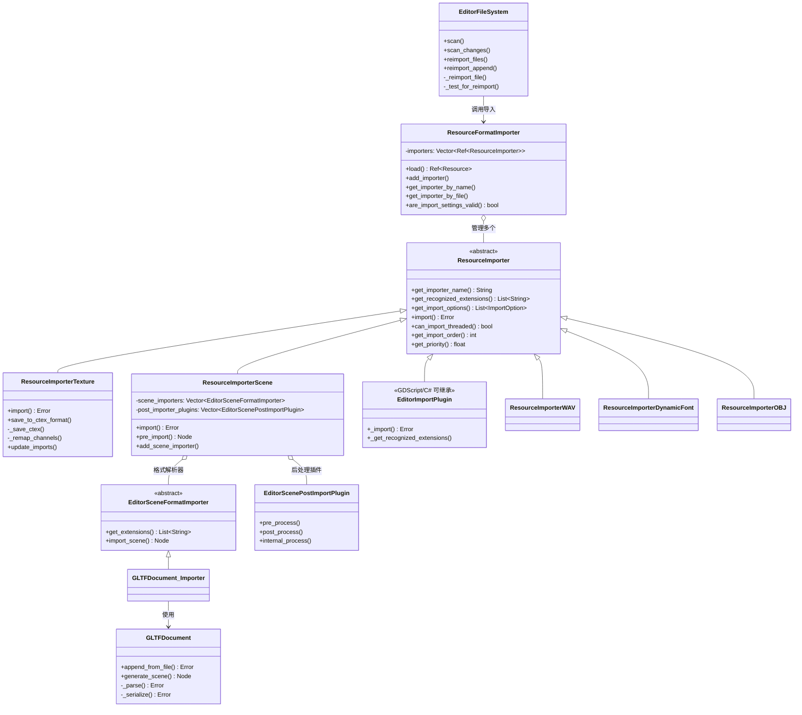

# Godot 导入管线 (Import Pipeline) 深度分析

> **核心对比结论**：Godot 用轻量级 `ResourceImporter` + `.import` 文本文件实现"源文件不动、按需转换"，而 UE 用重量级 `UFactory` + `.uasset` 二进制包实现"一次导入、永久持有"。

---

## 目录

- [第 1 章：模块概览 — "UE 程序员 30 秒速览"](#第-1-章模块概览--ue-程序员-30-秒速览)
- [第 2 章：架构对比 — "同一个问题，两种解法"](#第-2-章架构对比--同一个问题两种解法)
- [第 3 章：核心实现对比 — "代码层面的差异"](#第-3-章核心实现对比--代码层面的差异)
- [第 4 章：UE → Godot 迁移指南](#第-4-章ue--godot-迁移指南)
- [第 5 章：性能对比](#第-5-章性能对比)
- [第 6 章：总结 — "一句话记住"](#第-6-章总结--一句话记住)

---

## 第 1 章：模块概览 — "UE 程序员 30 秒速览"

### 一句话说明

Godot 的导入管线负责将外部资源文件（纹理、模型、音频、字体等）转换为引擎内部格式并缓存到 `.godot/imported/` 目录，对应 UE 的 `UFactory` + `FAssetImportData` + Interchange Framework 所承担的资源导入职责。

### 核心类/结构体列表

| # | Godot 类 | 源码路径 | 职责 | UE 对应物 |
|---|----------|----------|------|-----------|
| 1 | `ResourceImporter` | `core/io/resource_importer.h` | 所有导入器的抽象基类 | `UFactory` |
| 2 | `ResourceFormatImporter` | `core/io/resource_importer.h` | 导入资源的加载器前端，解析 `.import` 文件 | `FAssetRegistry` + `UAssetImportTask` |
| 3 | `ResourceImporterTexture` | `editor/import/resource_importer_texture.h` | 2D 纹理导入器 | `UTextureFactory` |
| 4 | `ResourceImporterLayeredTexture` | `editor/import/resource_importer_layered_texture.h` | Cubemap/2DArray/3D 纹理导入 | `UTextureCubeFactory` / `UTexture2DArrayFactory` |
| 5 | `ResourceImporterScene` | `editor/import/3d/resource_importer_scene.h` | 3D 场景/模型导入总控 | `UFbxFactory` + Interchange Framework |
| 6 | `EditorSceneFormatImporter` | `editor/import/3d/resource_importer_scene.h` | 3D 格式解析器接口（glTF/FBX/Collada） | `UInterchangeTranslator` |
| 7 | `GLTFDocument` | `modules/gltf/gltf_document.h` | glTF 2.0 解析与生成 | `UInterchangeGltfTranslator` |
| 8 | `EditorImportPlugin` | `editor/import/editor_import_plugin.h` | GDScript/C# 自定义导入器基类 | `UFactory`（Blueprint 子类） |
| 9 | `EditorScenePostImportPlugin` | `editor/import/3d/resource_importer_scene.h` | 3D 场景后处理插件 | `UInterchangePipelineBase` |
| 10 | `EditorFileSystem` | `editor/file_system/editor_file_system.h` | 文件系统扫描与导入调度 | `FAssetRegistry` + `FReimportManager` |
| 11 | `ResourceImporterWAV` | `editor/import/resource_importer_wav.h` | WAV 音频导入器 | `USoundFactory` |
| 12 | `ResourceImporterDynamicFont` | `editor/import/resource_importer_dynamic_font.h` | TTF/OTF 字体导入器 | `UFontFactory` |
| 13 | `FBXImporterManager` | `editor/import/fbx_importer_manager.h` | FBX2glTF 外部工具管理 | N/A（UE 内置 FBX SDK） |
| 14 | `ResourceImporterOBJ` | `editor/import/3d/resource_importer_obj.h` | OBJ 模型导入器 | `UFbxFactory`（也支持 OBJ） |

### Godot vs UE 概念速查表

| 概念 | Godot | UE |
|------|-------|-----|
| 导入器基类 | `ResourceImporter`（RefCounted） | `UFactory`（UObject） |
| 导入元数据存储 | `.import` 文本文件（INI 格式） | `.uasset` 内嵌 `FAssetImportData` |
| 导入缓存位置 | `.godot/imported/` 目录 | `Content/` 目录内的 `.uasset` |
| 源文件管理 | 源文件保留在项目中，不被修改 | 源文件可选保留，数据复制进 `.uasset` |
| 导入触发机制 | `EditorFileSystem` 扫描文件变化自动触发 | 拖入 Content Browser 或 `FReimportManager` |
| 自定义导入器 | `EditorImportPlugin`（GDScript/C#） | 继承 `UFactory`（C++/Blueprint） |
| 3D 场景导入 | `ResourceImporterScene` + `EditorSceneFormatImporter` | `UFbxFactory` / Interchange Framework |
| glTF 支持 | 内置 `GLTFDocument`（一等公民） | Interchange glTF Translator（插件） |
| FBX 支持 | 外部 FBX2glTF 工具 或 ufbx 库 | 内置 FBX SDK（Autodesk 官方） |
| 平台变体 | `r_platform_variants`（s3tc/etc2 等） | Texture Groups + 平台 Cook 规则 |
| 导入优先级 | `get_priority()` 浮点数 | `ImportPriority` 整数 |
| 导入顺序 | `IMPORT_ORDER_DEFAULT(0)` / `IMPORT_ORDER_SCENE(100)` | 无显式排序，依赖 Factory 注册顺序 |
| 线程导入 | `can_import_threaded()` 逐导入器控制 | 主线程为主，部分异步 |

---

## 第 2 章：架构对比 — "同一个问题，两种解法"

### 2.1 Godot 的架构设计

Godot 的导入管线采用**"源文件不动、按需转换"**的设计哲学。核心思路是：源文件（如 `.png`、`.glb`）始终保留在项目目录中，导入器将其转换为引擎内部格式（如 `.ctex`、`.scn`）并缓存到 `.godot/imported/` 目录。一个 `.import` 文本文件记录了导入参数和缓存路径的映射关系。



**导入流程概览**：

1. `EditorFileSystem` 扫描项目目录，检测文件变化（MD5 对比）
2. 对需要导入的文件，通过 `ResourceFormatImporter` 找到匹配的 `ResourceImporter`
3. 调用 `ResourceImporter::import()` 执行转换
4. 生成 `.import` 文件记录映射关系
5. 转换后的资源缓存到 `.godot/imported/` 目录
6. 运行时通过 `ResourceFormatImporter::load()` 读取 `.import` 文件，加载缓存资源

### 2.2 UE 对应模块的架构设计

UE 的导入管线采用**"一次导入、永久持有"**的设计哲学。源文件的数据被完整复制到 `.uasset` 中（通过 `FTextureSource` 等 Bulk Data 机制），导入后源文件理论上可以删除（虽然实践中通常保留）。

UE 的核心类层次：
- `UFactory`：所有导入器/创建器的基类（UObject 子类，支持反射和序列化）
- `UTextureFactory`：纹理导入，继承 `UFactory`
- `UFbxFactory`：FBX 导入，继承 `UFactory`
- `UAssetImportTask`：封装单次导入任务
- `FAssetImportData`：存储在 UAsset 中的导入元数据
- `FReimportManager`：管理重新导入
- Interchange Framework（UE5 新增）：基于管线的模块化导入框架

### 2.3 关键架构差异分析

#### 差异 1：导入器的对象模型 — RefCounted vs UObject

Godot 的 `ResourceImporter` 继承自 `RefCounted`，是一个轻量级的引用计数对象。它不参与 Godot 的序列化系统，不需要注册到 ClassDB（虽然使用了 `GDCLASS` 宏），生命周期由引用计数管理。这意味着导入器本身是无状态的——它不持有任何需要持久化的数据，所有导入参数都通过 `HashMap<StringName, Variant>` 传入 `import()` 方法。

```cpp
// Godot: ResourceImporter 是 RefCounted
// 源码: core/io/resource_importer.h
class ResourceImporter : public RefCounted {
    GDCLASS(ResourceImporter, RefCounted);
    virtual Error import(ResourceUID::ID p_source_id, const String &p_source_file, 
        const String &p_save_path, const HashMap<StringName, Variant> &p_options, ...) = 0;
};
```

UE 的 `UFactory` 继承自 `UObject`，是一个重量级对象。它参与 UE 的反射系统（UPROPERTY）、垃圾回收、序列化。导入器本身可以持有状态（如 `UTextureFactory` 的 `CompressionSettings`、`bCreateMaterial` 等 UPROPERTY 字段），这些状态可以通过 UI 编辑、通过 JSON 导入设置解析器配置。

```cpp
// UE: UFactory 是 UObject
// 源码: Editor/UnrealEd/Classes/Factories/Factory.h
UCLASS(abstract)
class UNREALED_API UFactory : public UObject {
    GENERATED_UCLASS_BODY()
    UPROPERTY(BlueprintReadWrite) TSubclassOf<UObject> SupportedClass;
    UPROPERTY(BlueprintReadWrite) TArray<FString> Formats;
    UPROPERTY() int32 ImportPriority;
    virtual UObject* FactoryCreateBinary(...) { return nullptr; }
};
```

**Trade-off**：Godot 的方式更轻量、更函数式，导入器是纯粹的"转换函数"；UE 的方式更面向对象，导入器可以持有复杂状态，但也带来了更高的内存开销和更复杂的生命周期管理。

#### 差异 2：导入缓存策略 — `.import` 文本文件 vs `.uasset` 二进制包

这是两个引擎最根本的设计差异之一。

**Godot 的 `.import` 文件**是一个纯文本的 INI 格式文件，与源文件同目录放置。例如 `icon.png` 旁边会有 `icon.png.import`：

```ini
[remap]
importer="texture"
type="CompressedTexture2D"
uid="uid://abc123"
path.s3tc="res://.godot/imported/icon.png-hash.s3tc.ctex"
path.etc2="res://.godot/imported/icon.png-hash.etc2.ctex"

[params]
compress/mode=2
mipmaps/generate=true
```

这个设计的优势是：
- **版本控制友好**：`.import` 文件是文本格式，可以 diff 和 merge
- **源文件不被修改**：原始 PNG 始终保持原样
- **缓存可重建**：`.godot/imported/` 目录可以安全删除，重新打开编辑器会自动重建
- **平台变体支持**：通过 `path.s3tc`、`path.etc2` 等键支持多平台纹理格式

**UE 的 `.uasset`** 将源数据（如纹理的原始像素数据）通过 Bulk Data 机制嵌入到二进制资产文件中。`FAssetImportData` 记录了源文件路径和时间戳用于重新导入检测。

**Trade-off**：Godot 的方式对版本控制更友好，但每次打开项目都可能需要重新导入（如果缓存丢失）；UE 的方式保证了资产的自包含性，但 `.uasset` 是二进制格式，不利于版本控制中的 diff/merge。

#### 差异 3：3D 导入管线 — 两层架构 vs 单层/Interchange

Godot 的 3D 导入采用**两层架构**：

1. **外层**：`ResourceImporterScene` 负责导入选项管理、后处理（碰撞体生成、LOD、动画优化等）
2. **内层**：`EditorSceneFormatImporter` 负责具体格式解析（glTF、FBX、Collada、OBJ）

```cpp
// 源码: editor/import/3d/resource_importer_scene.h
class ResourceImporterScene : public ResourceImporter {
    static Vector<Ref<EditorSceneFormatImporter>> scene_importers;  // 格式解析器
    static Vector<Ref<EditorScenePostImportPlugin>> post_importer_plugins;  // 后处理插件
};
```

这种设计使得添加新的 3D 格式支持只需实现 `EditorSceneFormatImporter`，而不需要重复实现碰撞体生成、动画处理等通用逻辑。

UE 传统上使用**单层架构**（`UFbxFactory` 直接处理所有事情），但 UE5 引入了 **Interchange Framework** 来实现类似 Godot 的分层设计：
- `UInterchangeTranslator`：对应 Godot 的 `EditorSceneFormatImporter`
- `UInterchangePipelineBase`：对应 Godot 的 `EditorScenePostImportPlugin`
- `UInterchangeManager`：对应 Godot 的 `ResourceImporterScene`

**Trade-off**：Godot 的两层架构从一开始就是模块化的，扩展性好；UE 的传统 Factory 模式更直接但扩展性差，Interchange 是后来的改进但增加了复杂度。

---

## 第 3 章：核心实现对比 — "代码层面的差异"

### 3.1 ResourceImporter vs UFactory：导入器注册和执行机制

#### Godot 的实现

Godot 的导入器注册通过 `ResourceFormatImporter::add_importer()` 完成，这是一个简单的 Vector 追加操作：

```cpp
// 源码: core/io/resource_importer.cpp
void ResourceFormatImporter::add_importer(const Ref<ResourceImporter> &p_importer, bool p_first_priority) {
    ERR_FAIL_COND(p_importer.is_null());
    if (p_first_priority) {
        importers.insert(0, p_importer);
    } else {
        importers.push_back(p_importer);
    }
}
```

导入器的匹配基于文件扩展名和优先级：

```cpp
// 源码: core/io/resource_importer.cpp
Ref<ResourceImporter> ResourceFormatImporter::get_importer_by_file(const String &p_file) const {
    Ref<ResourceImporter> importer;
    float priority = 0;
    for (int i = 0; i < importers.size(); i++) {
        List<String> local_exts;
        importers[i]->get_recognized_extensions(&local_exts);
        for (const String &F : local_exts) {
            if (p_file.right(F.length()).nocasecmp_to(F) == 0 
                && importers[i]->get_priority() > priority) {
                importer = importers[i];
                priority = importers[i]->get_priority();
                break;
            }
        }
    }
    return importer;
}
```

导入执行的核心签名：

```cpp
virtual Error import(
    ResourceUID::ID p_source_id,        // 资源 UID
    const String &p_source_file,         // 源文件路径
    const String &p_save_path,           // 保存路径（不含扩展名）
    const HashMap<StringName, Variant> &p_options,  // 导入选项
    List<String> *r_platform_variants,   // 输出：平台变体列表
    List<String> *r_gen_files = nullptr, // 输出：生成的额外文件
    Variant *r_metadata = nullptr        // 输出：元数据
) = 0;
```

#### UE 的实现

UE 的 Factory 注册依赖 UObject 反射系统——所有 `UFactory` 子类在引擎启动时通过 CDO（Class Default Object）自动注册。匹配逻辑基于 `Formats` 数组和 `SupportedClass`：

```cpp
// 源码: Editor/UnrealEd/Classes/Factories/Factory.h
UPROPERTY(BlueprintReadWrite) TArray<FString> Formats;  // "ext;Description" 格式
UPROPERTY(BlueprintReadWrite) TSubclassOf<UObject> SupportedClass;
UPROPERTY() int32 ImportPriority;
```

UE 的导入执行有三种入口：

```cpp
virtual UObject* FactoryCreateFile(...);    // 从文件导入
virtual UObject* FactoryCreateBinary(...);  // 从二进制缓冲区导入
virtual UObject* FactoryCreateText(...);    // 从文本缓冲区导入
virtual UObject* FactoryCreateNew(...);     // 创建新对象（非导入）
```

#### 差异点评

| 维度 | Godot | UE |
|------|-------|-----|
| 注册方式 | 显式调用 `add_importer()` | UObject 反射自动发现 |
| 匹配策略 | 扩展名 + 浮点优先级 | 扩展名 + 整数优先级 + `FactoryCanImport()` |
| 导入入口 | 统一的 `import()` 方法 | 三种入口（File/Binary/Text） |
| 返回值 | `Error` 错误码 + 文件写入 | `UObject*` 直接返回对象 |
| 导入选项传递 | `HashMap<StringName, Variant>` | Factory 自身的 UPROPERTY 字段 |

Godot 的统一 `import()` 接口更简洁，但要求导入器自己处理文件 I/O；UE 的多入口设计更灵活（Factory 可以选择最适合的数据接收方式），但增加了接口复杂度。Godot 通过 HashMap 传递选项的方式更函数式、更无状态；UE 通过 UPROPERTY 持有状态的方式更面向对象，但可能导致状态残留问题（需要 `CleanUp()` 和 `ResetState()`）。

### 3.2 纹理导入：ResourceImporterTexture vs UTextureFactory

#### Godot 的纹理导入流程

`ResourceImporterTexture::import()` 的核心流程（源码：`editor/import/resource_importer_texture.cpp`）：

1. **解析导入选项**：从 HashMap 中提取压缩模式、mipmap、粗糙度等参数
2. **加载源图像**：通过 `ImageLoader::load_image()` 加载 PNG/JPG/WebP 等
3. **图像处理**：
   - 尺寸限制检查和缩放
   - 通道重映射（`_remap_channels()`）
   - Alpha 边缘修复（`fix_alpha_edges()`）
   - Alpha 预乘（`premultiply_alpha()`）
   - 法线贴图 Y 通道翻转（`_invert_y_channel()`）
   - HDR 曝光钳制（`_clamp_hdr_exposure()`）
4. **压缩和保存**：根据压缩模式调用 `_save_ctex()` 保存为 `.ctex` 格式
5. **平台变体**：对 VRAM 压缩模式，分别生成 S3TC/BPTC 和 ETC2/ASTC 变体

```cpp
// 源码: editor/import/resource_importer_texture.cpp
// 平台变体生成的关键逻辑
if (compress_mode == COMPRESS_VRAM_COMPRESSED) {
    if (can_s3tc_bptc) {
        _save_ctex(image, p_save_path + "." + image_compress_format + ".ctex", ...);
        r_platform_variants->push_back(image_compress_format);
    }
    if (can_etc2_astc) {
        _save_ctex(image, p_save_path + "." + image_compress_format + ".ctex", ...);
        r_platform_variants->push_back(image_compress_format);
    }
}
```

Godot 还有一个独特的**自动检测机制**：当纹理首次在 3D 场景中使用时，会自动检测并重新导入为 VRAM 压缩格式：

```cpp
// 源码: editor/import/resource_importer_texture.cpp
void ResourceImporterTexture::update_imports() {
    // 检测 MAKE_3D_FLAG、MAKE_NORMAL_FLAG、MAKE_ROUGHNESS_FLAG
    // 自动修改 .import 文件并触发重新导入
}
```

#### UE 的纹理导入流程

`UTextureFactory::FactoryCreateBinary()` 的核心流程：

1. **解析二进制数据**：通过 `ImportImage()` 将原始字节解析为 `FImportImage`
2. **创建 UTexture2D 对象**：在内存中创建 UObject
3. **设置纹理属性**：压缩设置、LOD Group、mipmap 等
4. **存储源数据**：将原始像素数据存入 `FTextureSource`（Bulk Data）
5. **触发压缩**：异步或延迟压缩（`bDeferCompression`）

```cpp
// 源码: Editor/UnrealEd/Classes/Factories/TextureFactory.h
// UE 的纹理工厂持有大量 UPROPERTY 状态
UPROPERTY() uint32 NoCompression:1;
UPROPERTY() uint32 NoAlpha:1;
UPROPERTY() uint32 bDeferCompression:1;
UPROPERTY() TEnumAsByte<TextureCompressionSettings> CompressionSettings;
UPROPERTY() TEnumAsByte<TextureMipGenSettings> MipGenSettings;
UPROPERTY() TEnumAsByte<TextureGroup> LODGroup;
```

#### 差异点评

| 维度 | Godot | UE |
|------|-------|-----|
| 压缩时机 | 导入时立即压缩 | 可延迟到保存时 |
| 源数据保留 | 不保留（只保留转换后的 .ctex） | 保留在 FTextureSource 中 |
| 平台变体 | 导入时生成多个 .ctex 文件 | Cook 时根据平台生成 |
| 自动检测 | 支持（3D 使用检测、法线贴图检测） | 不支持（需手动设置） |
| 通道重映射 | 内置支持（11 种重映射选项） | 需要通过材质或外部工具 |
| 压缩格式 | Lossless/Lossy/VRAM/BasisU | TC_Default/TC_NormalMap/等 |

Godot 的自动检测机制（`update_imports()`）是一个亮点——当纹理被 3D 场景使用时自动切换到 VRAM 压缩，减少了用户手动配置的负担。但代价是可能触发意外的重新导入。UE 的延迟压缩（`bDeferCompression`）在大量纹理导入时更高效，而 Godot 的即时压缩可能导致导入速度较慢。

### 3.3 glTF/FBX 导入 vs Interchange：3D 模型导入管线

#### Godot 的 3D 导入管线

Godot 的 3D 导入采用**两层架构**，`ResourceImporterScene` 是外层总控，`EditorSceneFormatImporter` 是内层格式解析器。

**glTF 导入**是 Godot 的一等公民。`GLTFDocument`（源码：`modules/gltf/gltf_document.h`）是一个功能完整的 glTF 2.0 解析器和生成器，支持：
- glTF 2.0 JSON 和 GLB 二进制格式
- 扩展系统（`GLTFDocumentExtension`）
- 双向转换（导入和导出）
- 物理扩展、KTX 纹理、WebP 纹理等

```cpp
// 源码: modules/gltf/gltf_document.h
class GLTFDocument : public Resource {
    static Vector<Ref<GLTFDocumentExtension>> all_document_extensions;
    
    virtual Error append_from_file(const String &p_path, Ref<GLTFState> p_state, ...);
    virtual Node *generate_scene(Ref<GLTFState> p_state, float p_bake_fps = 30.0f, ...);
    virtual Error write_to_filesystem(Ref<GLTFState> p_state, const String &p_path);
};
```

**FBX 导入**在 Godot 中有两种路径：
1. **FBX2glTF**：外部工具将 FBX 转换为 glTF，然后走 glTF 导入流程
2. **ufbx**：内置的轻量级 FBX 解析库（较新的方案）

```cpp
// 源码: editor/import/fbx_importer_manager.cpp
// FBX2glTF 路径验证
void FBXImporterManager::_validate_path(const String &p_path) {
    List<String> args;
    args.push_back("--version");
    int exitcode;
    Error err = OS::get_singleton()->execute(p_path, args, nullptr, &exitcode);
    // 验证 FBX2glTF 可执行文件
}
```

**后处理管线**通过 `EditorScenePostImportPlugin` 实现，支持对导入的场景树进行修改：

```cpp
// 源码: editor/import/3d/resource_importer_scene.h
class EditorScenePostImportPlugin : public RefCounted {
    virtual void pre_process(Node *p_scene, const HashMap<StringName, Variant> &p_options);
    virtual void post_process(Node *p_scene, const HashMap<StringName, Variant> &p_options);
    virtual void internal_process(InternalImportCategory p_category, Node *p_base_scene, 
        Node *p_node, Ref<Resource> p_resource, const Dictionary &p_options);
};
```

内置的后处理插件包括：
- `PostImportPluginSkeletonRenamer`：骨骼重命名
- `PostImportPluginSkeletonRestFixer`：骨骼 Rest Pose 修复
- `PostImportPluginSkeletonTrackOrganizer`：骨骼轨道整理

#### UE 的 3D 导入管线

UE 传统上通过 `UFbxFactory` 直接使用 Autodesk FBX SDK 导入 FBX 文件：

```cpp
// 源码: Editor/UnrealEd/Classes/Factories/FbxFactory.h
UCLASS(hidecategories=Object)
class UNREALED_API UFbxFactory : public UFactory {
    UPROPERTY() class UFbxImportUI* ImportUI;
    virtual UObject* FactoryCreateFile(...) override;
    bool DetectImportType(const FString& InFilename);
};
```

UE5 引入的 **Interchange Framework** 提供了更模块化的导入管线：
- `UInterchangeTranslator`：格式解析器（类似 Godot 的 `EditorSceneFormatImporter`）
- `UInterchangePipelineBase`：处理管线（类似 Godot 的 `EditorScenePostImportPlugin`）
- `UInterchangeFactoryBase`：资产创建工厂
- `UInterchangeManager`：总控管理器

#### 差异点评

| 维度 | Godot | UE |
|------|-------|-----|
| glTF 支持 | 内置一等公民（`GLTFDocument`） | Interchange 插件（非默认） |
| FBX 支持 | 外部工具(FBX2glTF)/ufbx | 内置 FBX SDK（官方授权） |
| 导入结果 | 生成 Godot 场景树（Node） | 生成 UObject 资产 |
| 后处理 | `EditorScenePostImportPlugin` | Interchange Pipeline / FBX Import UI |
| 碰撞体生成 | 内置（7 种形状类型） | 内置（Simple/Complex Collision） |
| 动画处理 | 内置优化/压缩/切片 | FBX Animation Import Settings |
| 扩展性 | `EditorSceneFormatImporter` 注册 | Interchange Translator 注册 |

Godot 将 glTF 作为一等公民是一个明智的选择——glTF 是开放标准，不需要商业授权。UE 内置 FBX SDK 提供了更好的 FBX 兼容性，但需要 Autodesk 授权。Godot 的 FBX2glTF 方案虽然增加了外部依赖，但避免了授权问题。

### 3.4 .import 文件 vs .uasset：导入缓存策略

#### Godot 的 .import 文件机制

`.import` 文件的解析在 `ResourceFormatImporter::_get_path_and_type()` 中实现：

```cpp
// 源码: core/io/resource_importer.cpp
Error ResourceFormatImporter::_get_path_and_type(const String &p_path, 
    PathAndType &r_path_and_type, bool p_load, bool *r_valid) const {
    
    Ref<FileAccess> f = FileAccess::open(p_path + ".import", FileAccess::READ, &err);
    // 使用 VariantParser 解析 INI 格式
    // 支持平台特定路径: path.s3tc, path.etc2 等
    // 支持解压缩回退: Image::can_decompress(feature)
}
```

缓存路径的生成基于文件名和 MD5 哈希：

```cpp
// 源码: core/io/resource_importer.cpp
String ResourceFormatImporter::get_import_base_path(const String &p_for_file) const {
    return ProjectSettings::get_singleton()->get_imported_files_path()
        .path_join(p_for_file.get_file() + "-" + p_for_file.md5_text());
}
```

重新导入检测通过比较文件修改时间和 MD5 实现：

```cpp
// 源码: editor/file_system/editor_file_system.h
bool _test_for_reimport(const String &p_path, const String &p_expected_import_md5);
bool _is_test_for_reimport_needed(const String &p_path, 
    uint64_t p_last_modification_time, uint64_t p_modification_time,
    uint64_t p_last_import_modification_time, uint64_t p_import_modification_time,
    const Vector<String> &p_import_dest_paths);
```

#### UE 的 .uasset 机制

UE 将导入数据嵌入 `.uasset` 文件中。`FAssetImportData` 存储源文件信息用于重新导入：

```cpp
// UE 的重新导入检测基于 FAssetImportData 中存储的源文件路径和时间戳
// FReimportManager 负责管理重新导入流程
```

#### 差异点评

| 维度 | Godot `.import` | UE `.uasset` |
|------|-----------------|--------------|
| 格式 | 文本（INI） | 二进制 |
| 版本控制 | ✅ 友好（可 diff/merge） | ❌ 不友好（二进制） |
| 自包含性 | ❌ 依赖源文件 + 缓存 | ✅ 完全自包含 |
| 缓存重建 | ✅ 可安全删除重建 | ❌ 删除即丢失 |
| 平台变体 | 导入时生成 | Cook 时生成 |
| 源数据保留 | 不保留 | 保留（Bulk Data） |
| 协作开发 | 源文件 + .import 提交 | .uasset 提交 |

Godot 的方案对小团队和开源项目更友好——`.import` 文件可以提交到 Git，`.godot/imported/` 目录加入 `.gitignore`，每个开发者本地重建缓存。UE 的方案对大团队更友好——`.uasset` 自包含，不需要源文件即可工作，但需要 Perforce 等支持二进制文件锁定的版本控制系统。

---

## 第 4 章：UE → Godot 迁移指南

### 思维转换清单

1. **忘掉"导入即拥有"**：在 UE 中，导入后源文件可以删除，数据已经在 `.uasset` 中。在 Godot 中，源文件必须保留在项目中——它们是"真正的资源"，`.godot/imported/` 只是缓存。删除源文件 = 删除资源。

2. **忘掉 Content Browser 拖拽导入**：UE 中你把文件拖入 Content Browser 触发导入。Godot 中你把文件放入项目目录，`EditorFileSystem` 自动扫描并导入——没有显式的"导入"动作，一切自动发生。

3. **忘掉 Factory 的有状态设计**：UE 的 `UFactory` 可以持有 UPROPERTY 状态，导入 UI 直接修改 Factory 属性。Godot 的 `ResourceImporter` 是无状态的，所有选项通过 `.import` 文件中的 `[params]` 节传递。要修改导入设置，编辑 Inspector 中的 Import 面板。

4. **忘掉 Cook 管线**：UE 的平台适配在 Cook 阶段完成（打包时根据目标平台选择纹理格式）。Godot 在导入阶段就生成平台变体（`.s3tc.ctex`、`.etc2.ctex`），运行时根据平台特性选择。

5. **重新学习"导入即转换"**：Godot 的导入是一个纯粹的转换过程——读取源文件，生成引擎内部格式，写入缓存。没有 UObject 创建、没有包管理、没有引用追踪。这使得导入过程更简单、更可预测。

6. **重新学习 glTF 优先**：在 UE 中 FBX 是 3D 资源的首选格式。在 Godot 中 glTF 2.0 是一等公民——它有最好的支持、最完整的功能、最活跃的维护。优先使用 `.glb`/`.gltf` 而非 `.fbx`。

7. **重新学习自定义导入器**：UE 中自定义导入器需要 C++ 继承 `UFactory`。Godot 中可以用 GDScript 或 C# 继承 `EditorImportPlugin`，门槛低得多。

### API 映射表

| UE API / 概念 | Godot 等价 API / 概念 | 说明 |
|---------------|----------------------|------|
| `UFactory` | `ResourceImporter` | 导入器基类 |
| `UFactory::FactoryCreateBinary()` | `ResourceImporter::import()` | 执行导入 |
| `UFactory::Formats` | `ResourceImporter::get_recognized_extensions()` | 支持的文件扩展名 |
| `UFactory::SupportedClass` | `ResourceImporter::get_resource_type()` | 输出资源类型 |
| `UFactory::ImportPriority` | `ResourceImporter::get_priority()` | 导入优先级 |
| `UTextureFactory` | `ResourceImporterTexture` | 纹理导入器 |
| `UFbxFactory` | `ResourceImporterScene` + glTF/ufbx | 3D 模型导入 |
| `USoundFactory` | `ResourceImporterWAV` | 音频导入 |
| `UFontFactory` | `ResourceImporterDynamicFont` | 字体导入 |
| `FAssetImportData` | `.import` 文件 | 导入元数据存储 |
| `FReimportManager::Reimport()` | `EditorFileSystem::reimport_files()` | 重新导入 |
| `UAssetImportTask` | `EditorFileSystem::_reimport_file()` | 单次导入任务 |
| `UInterchangeTranslator` | `EditorSceneFormatImporter` | 3D 格式解析器 |
| `UInterchangePipelineBase` | `EditorScenePostImportPlugin` | 导入后处理管线 |
| `FAssetRegistry` | `EditorFileSystem` | 资源注册和扫描 |
| Texture Groups | `r_platform_variants` | 平台纹理变体 |

### 陷阱与误区

#### 陷阱 1：不要手动编辑 `.godot/imported/` 目录

UE 程序员习惯直接操作 `Content/` 目录中的 `.uasset` 文件。在 Godot 中，`.godot/imported/` 是自动生成的缓存目录，手动修改会被下次导入覆盖。要修改导入结果，应该修改 `.import` 文件中的参数（通过 Inspector 的 Import 面板）。

#### 陷阱 2：不要忽略 `.import` 文件的版本控制

很多 UE 程序员转到 Godot 后会把 `.import` 文件加入 `.gitignore`——这是错误的！`.import` 文件包含了导入参数，必须提交到版本控制。应该忽略的是 `.godot/imported/` 目录。

正确的 `.gitignore` 配置：
```
# Godot 导入缓存（可重建）
.godot/imported/
.godot/editor/

# 不要忽略 .import 文件！
# *.import  ← 这是错误的
```

#### 陷阱 3：FBX 导入不是开箱即用的

在 UE 中，FBX 导入是内置的，不需要任何额外配置。在 Godot 中，FBX 导入有两种方式：
1. **ufbx**（默认）：内置的轻量级 FBX 解析器，兼容性可能不如 FBX SDK
2. **FBX2glTF**：需要下载外部工具并配置路径

如果遇到 FBX 导入问题，建议先将 FBX 转换为 glTF 格式。

#### 陷阱 4：纹理压缩格式的差异

UE 中纹理压缩在 Cook 时根据目标平台自动选择。Godot 中需要在项目设置中启用目标平台的压缩格式：
- `rendering/textures/vram_compression/import_s3tc_bptc`（桌面平台）
- `rendering/textures/vram_compression/import_etc2_astc`（移动平台）

如果忘记启用，导出到对应平台时纹理可能无法正确显示。

#### 陷阱 5：导入顺序的隐式依赖

Godot 的导入有顺序概念：`IMPORT_ORDER_DEFAULT(0)` 先于 `IMPORT_ORDER_SCENE(100)`。这意味着纹理会先于 3D 场景导入。如果你的自定义导入器依赖其他资源，需要正确设置 `get_import_order()`。UE 中没有这种显式的导入顺序机制。

### 最佳实践

1. **使用 glTF 2.0 作为 3D 资源的首选格式**：Godot 对 glTF 的支持最完善，包括扩展系统、物理属性、动画等。

2. **利用 `EditorImportPlugin` 创建自定义导入器**：Godot 允许用 GDScript/C# 编写导入器，适合团队特定的资源管线需求。

3. **善用导入预设（Presets）**：`ResourceImporterTexture` 提供了 "2D/3D (Auto-Detect)"、"2D"、"3D" 三种预设，合理使用可以减少手动配置。

4. **理解自动检测机制**：Godot 的纹理导入器会自动检测纹理的使用场景（3D、法线贴图、粗糙度贴图），并自动调整压缩设置。这是一个强大的特性，但也可能导致意外的重新导入。

5. **利用 `EditorScenePostImportPlugin` 自定义 3D 导入后处理**：类似 UE 的 Interchange Pipeline，可以在导入后自动修改场景树、生成碰撞体、调整材质等。

---

## 第 5 章：性能对比

### 5.1 Godot 导入管线的性能特征

#### 优势

1. **增量导入**：`EditorFileSystem` 通过文件修改时间和 MD5 哈希检测变化，只重新导入修改过的文件。这在大型项目中显著减少了导入时间。

2. **多线程导入**：支持 `can_import_threaded()` 的导入器可以并行执行。`ResourceImporterTexture` 和 `ResourceImporterWAV` 等都支持多线程导入：

```cpp
// 源码: editor/import/resource_importer_texture.h
virtual bool can_import_threaded() const override { return true; }
```

`EditorFileSystem` 使用线程池进行并行导入：

```cpp
// 源码: editor/file_system/editor_file_system.h
struct ImportThreadData {
    const ImportFile *reimport_files;
    int reimport_from;
    Semaphore *imported_sem = nullptr;
};
void _reimport_thread(uint32_t p_index, ImportThreadData *p_import_data);
```

3. **轻量级缓存检查**：`.import` 文件是小型文本文件，解析速度快。缓存有效性检查只需要比较文件时间戳和 MD5。

#### 瓶颈

1. **首次导入开销**：项目首次打开时（或 `.godot/imported/` 被删除后），需要导入所有资源。对于大型项目（数千个纹理），这可能需要数分钟。

2. **纹理压缩是 CPU 密集型**：VRAM 压缩（S3TC/ETC2/ASTC/Basis Universal）需要大量 CPU 计算。Godot 在导入时执行压缩，而非延迟到打包时。

3. **3D 场景导入是单线程的**：`ResourceImporterScene` 的 `import()` 方法涉及场景树构建、碰撞体生成、动画处理等复杂操作，目前主要在单线程中执行。

4. **文件系统扫描**：`EditorFileSystem` 需要遍历整个项目目录检测变化。在大型项目中，扫描本身可能需要数秒。

### 5.2 与 UE 的性能差异

| 维度 | Godot | UE |
|------|-------|-----|
| 首次导入 | 较慢（需要压缩所有纹理） | 较快（延迟压缩） |
| 增量导入 | 快（MD5 + 时间戳检测） | 快（FAssetImportData 时间戳） |
| 纹理压缩 | 导入时执行 | Cook 时执行（可分布式） |
| 多线程 | 部分支持（逐导入器控制） | 有限（主要单线程） |
| 缓存重建 | 需要（删除 .godot 后） | 不需要（.uasset 自包含） |
| 大型项目 | 可能较慢（文件系统扫描） | 较快（Asset Registry 缓存） |
| 分布式构建 | 不支持 | 支持（Incredibuild/SN-DBS） |

### 5.3 性能优化建议

1. **对于大型项目**：
   - 确保 `.godot/imported/` 目录不被频繁删除
   - 使用 SSD 存储项目文件（I/O 密集型操作）
   - 合理设置纹理压缩模式——不是所有纹理都需要 VRAM 压缩

2. **对于纹理密集型项目**：
   - 考虑使用 Basis Universal 压缩（`COMPRESS_BASIS_UNIVERSAL`），它生成单一文件而非多个平台变体
   - 设置合理的 `process/size_limit` 避免导入超大纹理
   - 利用 `mipmaps/limit` 限制 mipmap 层级

3. **对于 3D 模型密集型项目**：
   - 优先使用 GLB（二进制 glTF）而非 glTF JSON + 外部文件
   - 在 DCC 工具中预处理模型（减面、合并材质），减少导入时的处理负担
   - 合理使用 LOD 自动生成（`generate_lods`）——它在导入时计算，会增加导入时间

4. **对于团队协作**：
   - 将 `.godot/imported/` 加入 `.gitignore`
   - 提交 `.import` 文件到版本控制
   - 每个开发者本地重建缓存（首次 clone 后打开编辑器即可）

---

## 第 6 章：总结 — "一句话记住"

### 核心差异

**Godot 的导入管线是"源文件驱动的转换缓存"，UE 的导入管线是"资产包驱动的数据持有"。**

### 设计亮点（Godot 做得比 UE 好的地方）

1. **版本控制友好**：`.import` 文本文件 + 可重建缓存的设计，对 Git 工作流极其友好。UE 的二进制 `.uasset` 需要 Git LFS 或 Perforce。

2. **自动检测机制**：纹理导入器的 3D 使用检测、法线贴图检测、粗糙度贴图检测，减少了用户手动配置的负担。UE 需要用户手动设置 Compression Settings。

3. **glTF 一等公民**：内置完整的 glTF 2.0 支持（包括扩展系统和双向转换），拥抱开放标准。UE 的 glTF 支持是后来通过 Interchange 添加的。

4. **GDScript 自定义导入器**：通过 `EditorImportPlugin` 可以用脚本语言编写导入器，门槛极低。UE 的自定义 Factory 必须用 C++。

5. **两层 3D 导入架构**：`ResourceImporterScene` + `EditorSceneFormatImporter` 的分层设计，使得添加新格式支持非常简单，不需要重复实现通用逻辑。

### 设计短板（Godot 不如 UE 的地方）

1. **FBX 支持较弱**：依赖外部工具（FBX2glTF）或轻量级库（ufbx），兼容性不如 UE 内置的 FBX SDK。对于依赖 FBX 工作流的团队是一个痛点。

2. **缺乏分布式构建**：UE 支持通过 Incredibuild/SN-DBS 分布式执行纹理压缩和 Cook。Godot 的导入完全在本地执行，大型项目的首次导入可能很慢。

3. **缺乏延迟压缩**：UE 的 `bDeferCompression` 允许先快速导入，后台异步压缩。Godot 在导入时同步执行压缩，可能阻塞编辑器。

4. **缓存不可移植**：`.godot/imported/` 目录不能在不同机器间共享（路径哈希不同）。UE 的 `.uasset` 是自包含的，可以直接复制。

5. **导入设置的 UI 体验**：UE 的导入 UI（如 FBX Import Options 对话框）更丰富、更直观。Godot 的导入设置在 Inspector 面板中，对于复杂的 3D 导入选项不够直观。

### UE 程序员的学习路径建议

**推荐阅读顺序**：

1. **第一步**：`core/io/resource_importer.h` — 理解 `ResourceImporter` 基类和 `ResourceFormatImporter` 的设计
2. **第二步**：`editor/import/resource_importer_texture.h/.cpp` — 最典型的导入器实现，理解完整的导入流程
3. **第三步**：`editor/import/editor_import_plugin.h/.cpp` — 理解如何用 GDScript/C# 创建自定义导入器
4. **第四步**：`editor/import/3d/resource_importer_scene.h` — 理解 3D 导入的两层架构
5. **第五步**：`modules/gltf/gltf_document.h` — 理解 glTF 导入的完整实现
6. **第六步**：`editor/file_system/editor_file_system.h` — 理解文件系统扫描和导入调度机制

**关键概念对照**：
- 把 `ResourceImporter` 想象成一个无状态的 `UFactory`
- 把 `.import` 文件想象成外置的 `FAssetImportData`
- 把 `.godot/imported/` 想象成一个可重建的 `Saved/Cooked/` 目录
- 把 `EditorFileSystem` 想象成 `FAssetRegistry` + `FReimportManager` 的合体
- 把 `EditorSceneFormatImporter` 想象成 `UInterchangeTranslator`

掌握这些对应关系后，Godot 的导入管线对 UE 程序员来说将变得非常直观。核心差异只有一个：**Godot 的导入是"转换 + 缓存"，UE 的导入是"复制 + 持有"**。理解了这一点，其他一切都是实现细节。
