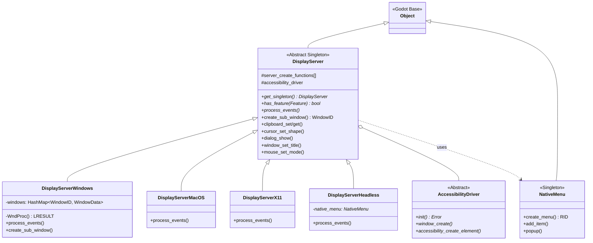

# 22. 显示服务器 (Display Server) — Godot vs UE 深度对比分析

> **一句话核心结论**：Godot 用一个"上帝单例" `DisplayServer` 统管窗口、输入、剪贴板、对话框等全部平台交互，而 UE 将同等职责拆分到 `GenericApplication` + `FGenericWindow` + `FSlateApplication` 三层架构中。

---

## 目录

- [第 1 章：模块概览 — "UE 程序员 30 秒速览"](#第-1-章模块概览--ue-程序员-30-秒速览)
- [第 2 章：架构对比 — "同一个问题，两种解法"](#第-2-章架构对比--同一个问题两种解法)
- [第 3 章：核心实现对比 — "代码层面的差异"](#第-3-章核心实现对比--代码层面的差异)
- [第 4 章：UE → Godot 迁移指南](#第-4-章ue--godot-迁移指南)
- [第 5 章：性能对比](#第-5-章性能对比)
- [第 6 章：总结 — "一句话记住"](#第-6-章总结--一句话记住)

---

## 第 1 章：模块概览 — "UE 程序员 30 秒速览"

### 1.1 模块定位

**Godot 的 `DisplayServer`** 是一个全局单例（`Object` 子类），承担了 UE 中 `FGenericApplication`、`FGenericWindow`、`FSlateApplication`、`FPlatformApplicationMisc`、`ICursor`、`ITextInputMethodSystem` 等多个类的职责总和。它是 Godot 与操作系统窗口管理器之间的**唯一桥梁**。

在 UE 中，你需要通过 `FSlateApplication::Get()` 获取应用实例，通过 `FGenericWindow` 操作原生窗口，通过 `FPlatformApplicationMisc` 访问剪贴板。而在 Godot 中，这一切都通过 `DisplayServer::get_singleton()` 一个入口完成。

### 1.2 核心类/结构体列表

| # | Godot 类/结构体 | 职责 | UE 对应物 |
|---|---|---|---|
| 1 | `DisplayServer` | 窗口管理、输入路由、平台功能总入口 | `GenericApplication` + `FSlateApplication` |
| 2 | `DisplayServerWindows` | Windows 平台具体实现 | `FWindowsApplication` |
| 3 | `DisplayServerHeadless` | 无头模式（服务器/CI）实现 | 无直接对应（UE 用 `-nullrhi` 参数） |
| 4 | `NativeMenu` | 原生菜单系统（macOS 菜单栏等） | `FMenuStack` / Slate `SMenuAnchor` |
| 5 | `NativeMenuWindows` | Windows 平台原生菜单实现 | Win32 `HMENU` 封装 |
| 6 | `AccessibilityDriver` | 无障碍辅助功能驱动接口 | `FGenericAccessibleMessageHandler` |
| 7 | `DisplayServer::WindowID` | 窗口标识符（int 类型别名） | `TSharedRef<SWindow>` / `HWND` |
| 8 | `DisplayServer::Feature` | 平台能力查询枚举 | 无直接对应（UE 用编译宏） |
| 9 | `DisplayServer::WindowFlags` | 窗口属性标志位 | `FGenericWindowDefinition` 字段 |
| 10 | `DisplayServer::WindowMode` | 窗口模式枚举 | `EWindowMode::Type` |
| 11 | `DisplayServer::CursorShape` | 光标形状枚举 | `EMouseCursor::Type` |
| 12 | `DisplayServer::TTSUtterance` | 文本转语音数据结构 | 无内建对应 |
| 13 | `DisplayServer::VSyncMode` | 垂直同步模式 | `RHI` 层 VSync 设置 |
| 14 | `DisplayServer::ScreenOrientation` | 屏幕方向枚举 | `FPlatformMisc::GetDeviceOrientation()` |

### 1.3 Godot vs UE 概念速查表

| 概念 | Godot | UE |
|---|---|---|
| 应用程序抽象 | `DisplayServer`（单例） | `GenericApplication`（平台子类实例） |
| 窗口对象 | `WindowID`（int 句柄） | `TSharedRef<FGenericWindow>` / `SWindow` |
| 窗口创建 | `DisplayServer::create_sub_window()` | `FSlateApplication::AddWindow(SNew(SWindow))` |
| 消息泵 | `DisplayServer::process_events()` | `FWindowsApplication::PumpMessages()` |
| 输入事件路由 | `Callable` 回调 | `FGenericApplicationMessageHandler` 接口 |
| 剪贴板 | `DisplayServer::clipboard_set/get()` | `FPlatformApplicationMisc::ClipboardCopy/Paste()` |
| 原生对话框 | `DisplayServer::dialog_show()` | `FDesktopPlatformModule::Get()->OpenFileDialog()` |
| 原生菜单 | `NativeMenu` 单例 | Slate `FMenuStack` / `SMenuAnchor` |
| 光标管理 | `DisplayServer::cursor_set_shape()` | `FSlateApplication::SetPlatformCursor()` |
| IME 输入法 | `DisplayServer::window_set_ime_active()` | `ITextInputMethodSystem` |
| 多显示器 | `DisplayServer::get_screen_count()` | `FDisplayMetrics::MonitorInfo` |
| 无头模式 | `DisplayServerHeadless` 子类 | `-nullrhi` 命令行参数 |
| 平台能力查询 | `DisplayServer::has_feature()` | 编译宏 `PLATFORM_SUPPORTS_*` |
| 无障碍 | `AccessibilityDriver` + `AccessibilityRole` | `FGenericAccessibleMessageHandler` |

---

## 第 2 章：架构对比 — "同一个问题，两种解法"

### 2.1 Godot 架构设计

Godot 的显示服务器采用**单例 + 虚函数多态**的经典设计模式。`DisplayServer` 基类定义了所有平台功能的虚函数接口，各平台（Windows、macOS、Linux、Android、iOS、Web）提供具体子类实现。



**关键设计特征：**

1. **工厂注册模式**：平台实现通过 `register_create_function()` 静态注册到 `server_create_functions[]` 数组中，运行时通过 `DisplayServer::create()` 工厂方法选择合适的实现。Headless 实现始终作为最后一个 fallback 存在。

2. **WindowID 轻量句柄**：窗口不是对象，而是一个 `int` 类型的 ID。所有窗口操作都通过 `DisplayServer` 的方法 + `WindowID` 参数完成，主窗口固定为 `MAIN_WINDOW_ID = 0`。

3. **Feature 查询机制**：通过 `has_feature()` 在运行时查询平台能力，而非编译期宏。这使得同一份代码可以优雅地处理不同平台的能力差异。

### 2.2 UE 架构设计

UE 采用**三层分离**的架构：

```
GenericApplication (平台抽象层)
    ├── FGenericWindow (窗口对象)
    ├── FGenericApplicationMessageHandler (消息处理接口)
    └── ICursor (光标接口)

FSlateApplication (应用框架层)
    ├── SWindow (Slate 窗口 Widget)
    ├── FMenuStack (菜单管理)
    └── FSlateUser (用户输入状态)

FPlatformApplicationMisc (平台工具层)
    ├── ClipboardCopy/Paste
    └── 其他平台工具函数
```

- **`GenericApplication`**（`ApplicationCore` 模块）：纯平台抽象，负责消息泵、窗口创建、输入设备管理。通过 `FGenericApplicationMessageHandler` 接口将事件向上传递。
- **`FGenericWindow`**：独立的窗口对象，拥有自己的生命周期，通过 `TSharedRef` 智能指针管理。
- **`FSlateApplication`**（`Slate` 模块）：在 `GenericApplication` 之上构建的应用框架，负责 Widget 焦点管理、输入路由、拖放等高级功能。

### 2.3 关键架构差异分析

#### 差异 1：单体 vs 分层 — 设计哲学的根本分歧

**Godot** 的 `DisplayServer` 是一个典型的"上帝对象"（God Object），将窗口管理、输入、剪贴板、对话框、TTS、无障碍等全部功能集中在一个类中。这个类的头文件超过 1000 行，定义了数百个虚函数。这种设计的优势在于**极低的认知成本**——开发者只需要知道一个入口点。但代价是类的职责过于庞大，违反了单一职责原则。

**UE** 则将同等功能拆分到至少 5 个独立的类/接口中：`GenericApplication` 管窗口和消息泵，`FGenericWindow` 管单个窗口状态，`FGenericApplicationMessageHandler` 管事件回调，`ICursor` 管光标，`ITextInputMethodSystem` 管 IME。这种设计更符合 SOLID 原则，但学习曲线更陡峭——新手需要理解多个类之间的协作关系。

**源码证据**：
- Godot: `servers/display/display_server.h` — 单个类包含窗口、鼠标、剪贴板、对话框、TTS、无障碍等全部 API
- UE: `GenericPlatform/GenericApplication.h` — 仅包含窗口创建和消息泵，光标通过 `ICursor` 接口分离

#### 差异 2：句柄 vs 对象 — 窗口的身份表示

**Godot** 使用 `WindowID`（`typedef int`）作为窗口标识符。这是一种轻量级的句柄模式，所有窗口操作都是 `DisplayServer` 上的方法调用，窗口本身没有独立的对象表示。主窗口固定为 ID 0，子窗口通过 `create_sub_window()` 创建并返回新 ID。窗口的内部数据（如 `HWND`、位置、大小等）存储在平台实现类的 `HashMap<WindowID, WindowData>` 中。

**UE** 使用 `TSharedRef<FGenericWindow>` 作为窗口对象。每个窗口是一个独立的 C++ 对象，拥有自己的虚函数表和生命周期。在 Slate 层面，还有 `SWindow` Widget 对象与之对应。窗口的创建、销毁、属性修改都是对象方法调用。

这个差异的 trade-off 很明显：Godot 的句柄模式更轻量、更适合 GDScript 绑定（int 比对象引用更容易跨语言传递），但失去了面向对象的封装性。UE 的对象模式更符合 C++ 惯用法，但在跨语言绑定时需要额外的包装层。

**源码证据**：
- Godot: `servers/display/display_server.h` 第 ~350 行 — `typedef int WindowID`
- UE: `GenericPlatform/GenericWindow.h` — 完整的 `FGenericWindow` 类定义，包含 `ReshapeWindow()`、`BringToFront()` 等对象方法

#### 差异 3：运行时查询 vs 编译期宏 — 平台能力的发现机制

**Godot** 通过 `DisplayServer::has_feature(Feature)` 在运行时查询平台能力。`Feature` 枚举包含 30+ 个条目，涵盖子窗口、触摸屏、剪贴板、IME、原生对话框、TTS 等。这种设计使得同一份 GDScript 代码可以在不同平台上优雅降级：

```gdscript
if DisplayServer.has_feature(DisplayServer.FEATURE_NATIVE_DIALOG):
    DisplayServer.dialog_show("Title", "Message", ["OK"], callback)
else:
    # 使用自定义 UI 对话框
    show_custom_dialog()
```

**UE** 主要依赖编译期宏（如 `PLATFORM_SUPPORTS_VIRTUAL_KEYBOARD`、`WITH_ACCESSIBILITY`）来控制平台功能的可用性。这意味着平台能力在编译时就已确定，运行时没有查询机制。优势是零运行时开销，劣势是无法在同一个二进制中处理不同的平台配置。

**源码证据**：
- Godot: `servers/display/display_server.h` `Feature` 枚举 — 34 个运行时可查询的特性
- UE: `GenericPlatform/GenericApplication.h` — 使用 `#if WITH_ACCESSIBILITY` 编译宏

---

## 第 3 章：核心实现对比 — "代码层面的差异"

### 3.1 窗口创建与管理

#### Godot 的实现

Godot 的窗口创建通过 `DisplayServer::create_sub_window()` 完成。基类提供默认的错误实现，平台子类（如 `DisplayServerWindows`）提供真正的实现：

```cpp
// servers/display/display_server.cpp
DisplayServer::WindowID DisplayServer::create_sub_window(
    WindowMode p_mode, VSyncMode p_vsync_mode, uint32_t p_flags,
    const Rect2i &p_rect, bool p_exclusive, WindowID p_transient_parent) {
    ERR_FAIL_V_MSG(INVALID_WINDOW_ID, "Sub-windows not supported by this display server.");
}
```

在 Windows 平台实现中（`platform/windows/display_server_windows.h`），每个窗口的数据存储在 `WindowData` 结构体中，通过 `HashMap<WindowID, WindowData>` 管理。窗口创建的核心流程是：

1. 分配新的 `WindowID`
2. 调用 Win32 `CreateWindowExW()` 创建原生窗口
3. 将 `HWND` 和窗口属性存入 `WindowData`
4. 设置消息回调（统一的 `WndProc`）

窗口属性通过 `WindowFlags` 位标志控制，包括：`RESIZE_DISABLED`、`BORDERLESS`、`ALWAYS_ON_TOP`、`TRANSPARENT`、`NO_FOCUS`、`POPUP`、`EXTEND_TO_TITLE`、`MOUSE_PASSTHROUGH`、`SHARP_CORNERS`、`EXCLUDE_FROM_CAPTURE` 等 13 个标志。

#### UE 的实现

UE 的窗口创建是一个多步骤过程：

```cpp
// 1. 创建窗口定义
TSharedRef<FGenericWindowDefinition> Definition = MakeShareable(new FGenericWindowDefinition());
Definition->Type = EWindowType::Normal;
Definition->HasOSWindowBorder = true;
// ... 设置其他属性

// 2. 通过 GenericApplication 创建原生窗口
TSharedRef<FGenericWindow> NativeWindow = PlatformApplication->MakeWindow();
PlatformApplication->InitializeWindow(NativeWindow, Definition, ParentWindow, bShowImmediately);

// 3. 在 Slate 层创建 SWindow
TSharedRef<SWindow> SlateWindow = SNew(SWindow)
    .Title(FText::FromString("My Window"))
    .ClientSize(FVector2D(800, 600));
FSlateApplication::Get().AddWindow(SlateWindow);
```

UE 的窗口属性通过 `FGenericWindowDefinition` 结构体定义，包含 20+ 个字段：`Type`、`TransparencySupport`、`HasOSWindowBorder`、`AppearsInTaskbar`、`IsTopmostWindow`、`AcceptsInput`、`ActivationPolicy`、`FocusWhenFirstShown`、`HasCloseButton`、`SupportsMinimize`、`SupportsMaximize`、`IsModalWindow`、`HasSizingFrame` 等。

**源码路径**：
- Godot: `servers/display/display_server.h` — `create_sub_window()` 虚函数
- Godot: `platform/windows/display_server_windows.h` — `DisplayServerWindows` 平台实现
- UE: `GenericPlatform/GenericApplication.h` — `MakeWindow()` + `InitializeWindow()`
- UE: `GenericPlatform/GenericWindowDefinition.h` — `FGenericWindowDefinition` 结构体

#### 差异点评

| 维度 | Godot | UE |
|---|---|---|
| 窗口表示 | `int` 句柄 | `TSharedRef<FGenericWindow>` 对象 |
| 属性设置 | 位标志 `uint32_t p_flags` | 结构体 `FGenericWindowDefinition` |
| 创建步骤 | 1 步（`create_sub_window`） | 3 步（定义 → 创建 → 初始化） |
| 生命周期 | `create_sub_window` / `delete_sub_window` | 智能指针自动管理 |
| 主窗口 | 固定 ID 0，引擎启动时创建 | `SWindow` 对象，可动态管理 |

**Godot 的优势**：API 极其简洁，一个函数调用完成窗口创建。位标志模式使得窗口属性可以在创建时一次性指定，也方便序列化。

**UE 的优势**：`FGenericWindowDefinition` 结构体的字段名自文档化，比位标志更易读。三步创建流程虽然繁琐，但提供了更细粒度的控制——你可以在创建和初始化之间插入自定义逻辑。

### 3.2 消息泵与事件处理

#### Godot 的实现

Godot 的事件处理采用**回调注册**模式。每个窗口可以注册多个回调：

```cpp
// servers/display/display_server.h
virtual void window_set_window_event_callback(const Callable &p_callable, WindowID p_window = MAIN_WINDOW_ID) = 0;
virtual void window_set_input_event_callback(const Callable &p_callable, WindowID p_window = MAIN_WINDOW_ID) = 0;
virtual void window_set_input_text_callback(const Callable &p_callable, WindowID p_window = MAIN_WINDOW_ID) = 0;
virtual void window_set_drop_files_callback(const Callable &p_callable, WindowID p_window = MAIN_WINDOW_ID) = 0;
virtual void window_set_rect_changed_callback(const Callable &p_callable, WindowID p_window = MAIN_WINDOW_ID) = 0;
```

消息泵通过纯虚函数 `process_events()` 驱动，由主循环每帧调用。在 Windows 实现中，这会调用 `PeekMessage` / `DispatchMessage` 处理 Win32 消息队列，然后通过注册的 `Callable` 回调将事件分发给 Godot 的 `Window` 节点。

窗口事件通过 `WindowEvent` 枚举传递：`MOUSE_ENTER`、`MOUSE_EXIT`、`FOCUS_IN`、`FOCUS_OUT`、`CLOSE_REQUEST`、`GO_BACK_REQUEST`、`DPI_CHANGE`、`TITLEBAR_CHANGE`、`FORCE_CLOSE`。

#### UE 的实现

UE 采用**消息处理器接口**模式。`GenericApplication` 持有一个 `FGenericApplicationMessageHandler` 引用，所有平台事件都通过这个接口的虚函数传递：

```cpp
// GenericPlatform/GenericApplicationMessageHandler.h
class FGenericApplicationMessageHandler {
public:
    virtual bool OnKeyChar(const TCHAR Character, const bool IsRepeat);
    virtual bool OnKeyDown(const int32 KeyCode, const uint32 CharacterCode, const bool IsRepeat);
    virtual bool OnKeyUp(const int32 KeyCode, const uint32 CharacterCode, const bool IsRepeat);
    virtual bool OnMouseDown(const TSharedPtr<FGenericWindow>& Window, const EMouseButtons::Type Button, const FVector2D CursorPos);
    virtual bool OnMouseUp(const EMouseButtons::Type Button, const FVector2D CursorPos);
    virtual bool OnMouseMove();
    virtual bool OnWindowActivationChanged(const TSharedRef<FGenericWindow>& Window, const EWindowActivation ActivationType);
    virtual void OnMovedWindow(const TSharedRef<FGenericWindow>& Window, const int32 X, const int32 Y);
    // ... 30+ 个虚函数
};
```

`FSlateApplication` 实现了 `FGenericApplicationMessageHandler` 接口，将平台事件转换为 Slate Widget 事件。消息泵通过 `GenericApplication::PumpMessages()` 驱动。

**源码路径**：
- Godot: `servers/display/display_server.h` — 回调注册虚函数
- UE: `GenericPlatform/GenericApplicationMessageHandler.h` — 消息处理器接口

#### 差异点评

**Godot 的 Callable 回调模式**更灵活——任何对象的任何方法都可以作为回调，且天然支持 GDScript 绑定。但缺点是类型安全性较弱，回调签名在编译期无法验证。

**UE 的接口模式**更严格——所有事件处理函数的签名在编译期确定，IDE 可以提供完整的自动补全。但扩展性较差，添加新事件类型需要修改接口定义。

### 3.3 剪贴板与系统集成

#### Godot 的实现

Godot 将剪贴板功能直接集成在 `DisplayServer` 中：

```cpp
// servers/display/display_server.h
virtual void clipboard_set(const String &p_text);
virtual String clipboard_get() const;
virtual Ref<Image> clipboard_get_image() const;
virtual bool clipboard_has() const;
virtual bool clipboard_has_image() const;
virtual void clipboard_set_primary(const String &p_text);  // X11 primary selection
virtual String clipboard_get_primary() const;
```

基类实现只是打印警告信息，真正的实现在平台子类中。值得注意的是 Godot 支持**主选区**（Primary Selection，X11 特有的中键粘贴功能），这通过 `clipboard_set_primary` / `clipboard_get_primary` 和 `FEATURE_CLIPBOARD_PRIMARY` 特性标志实现。

Godot 还支持**图片剪贴板**（`clipboard_get_image()`），这在 UE 中没有直接对应。

#### UE 的实现

UE 的剪贴板功能分散在 `FPlatformApplicationMisc` 中：

```cpp
// GenericPlatform/GenericPlatformApplicationMisc.h
class FGenericPlatformApplicationMisc {
public:
    static void ClipboardCopy(const TCHAR* Str);
    static void ClipboardPaste(FString& Dest);
};
```

UE 的剪贴板 API 极其简洁——只有文本的复制和粘贴，没有图片支持，没有主选区支持。这反映了 UE 作为游戏引擎的定位——剪贴板主要用于编辑器，游戏运行时很少需要。

#### 差异点评

Godot 的剪贴板 API 明显更丰富，支持文本、图片、主选区，且通过 `has_feature()` 优雅地处理平台差异。UE 的实现则是最小化的——够用就行。这体现了两个引擎的不同定位：Godot 更注重通用应用开发能力，UE 更专注于游戏。

### 3.4 原生菜单系统

#### Godot 的实现

Godot 4.x 将原生菜单从 `DisplayServer` 中独立出来，成为单独的 `NativeMenu` 单例类。这是一个重要的架构改进——旧的 `global_menu_*` API 已被标记为 `DISABLE_DEPRECATED`，新 API 使用 `RID`（Resource ID）作为菜单句柄：

```cpp
// servers/display/native_menu.h
class NativeMenu : public Object {
    GDCLASS(NativeMenu, Object)
public:
    virtual RID create_menu();
    virtual void free_menu(const RID &p_rid);
    virtual int add_item(const RID &p_rid, const String &p_label, 
                         const Callable &p_callback = Callable(), ...);
    virtual void popup(const RID &p_rid, const Vector2i &p_position);
    virtual bool has_system_menu(SystemMenus p_menu_id) const;
    virtual RID get_system_menu(SystemMenus p_menu_id) const;
};
```

`NativeMenu` 支持系统菜单（`MAIN_MENU_ID`、`APPLICATION_MENU_ID`、`WINDOW_MENU_ID`、`HELP_MENU_ID`、`DOCK_MENU_ID`），这些主要用于 macOS 的全局菜单栏。在 Windows 和 Linux 上，`NativeMenu` 的基类实现只是打印 "Global menus are not supported on this platform" 警告。

旧的 `DisplayServer::global_menu_*` API 在内部通过 `_get_rid_from_name()` 桥接到新的 `NativeMenu` API，实现了向后兼容：

```cpp
// servers/display/display_server.cpp
RID DisplayServer::_get_rid_from_name(NativeMenu *p_nmenu, const String &p_menu_root) const {
    if (p_menu_root == "_main") {
        return p_nmenu->get_system_menu(NativeMenu::MAIN_MENU_ID);
    } else if (p_menu_root == "_apple") {
        return p_nmenu->get_system_menu(NativeMenu::APPLICATION_MENU_ID);
    }
    // ... 其他系统菜单映射
    RID rid = p_nmenu->create_menu();
    menu_names[p_menu_root] = rid;
    return rid;
}
```

#### UE 的实现

UE 没有独立的原生菜单抽象层。菜单完全由 Slate UI 框架管理：

- **编辑器菜单**：通过 `FMenuBarBuilder` / `FMenuBuilder` 构建，最终渲染为 Slate Widget
- **右键菜单**：通过 `FMenuBuilder` + `SMenuAnchor` 实现
- **macOS 全局菜单**：通过 `FMacMenu` 平台特定类处理

UE 的菜单系统完全是 UI 框架的一部分，没有"原生菜单"的概念——即使在 macOS 上，菜单也是通过 Slate 渲染后映射到原生菜单栏的。

#### 差异点评

Godot 的 `NativeMenu` 设计更贴近操作系统原生体验，特别是在 macOS 上可以直接使用系统菜单栏。UE 的纯 Slate 方案则保证了跨平台一致性，但牺牲了原生感。对于需要深度系统集成的应用（如编辑器工具），Godot 的方案更优；对于游戏，UE 的方案足够。

### 3.5 无障碍（Accessibility）系统

#### Godot 的实现

Godot 4.6 引入了完整的无障碍支持，通过 `AccessibilityDriver` 抽象接口和 `DisplayServer` 上的大量 `accessibility_*` 方法实现。这是一个非常庞大的 API 表面：

```cpp
// servers/display/display_server.h
// 角色定义 — 45 种无障碍角色
enum AccessibilityRole {
    ROLE_UNKNOWN, ROLE_BUTTON, ROLE_CHECK_BOX, ROLE_SLIDER,
    ROLE_TEXT_FIELD, ROLE_TREE, ROLE_TABLE, ROLE_MENU, ...
};

// 操作定义 — 23 种无障碍操作
enum AccessibilityAction {
    ACTION_CLICK, ACTION_FOCUS, ACTION_EXPAND, ACTION_SCROLL_DOWN, ...
};

// 核心 API
virtual RID accessibility_create_element(WindowID p_window_id, AccessibilityRole p_role);
virtual void accessibility_update_set_name(const RID &p_id, const String &p_name);
virtual void accessibility_update_set_bounds(const RID &p_id, const Rect2 &p_rect);
virtual void accessibility_update_add_action(const RID &p_id, AccessibilityAction p_action, const Callable &p_callable);
```

`AccessibilityDriver` 是一个纯虚接口，由平台实现提供具体的屏幕阅读器集成（如 Windows 的 UI Automation、macOS 的 NSAccessibility）。`DisplayServer` 的 `accessibility_*` 方法全部委托给 `accessibility_driver` 成员。

#### UE 的实现

UE 的无障碍支持通过 `FGenericAccessibleMessageHandler` 和 `WITH_ACCESSIBILITY` 编译宏控制：

```cpp
// GenericApplication.h
#if WITH_ACCESSIBILITY
    virtual void SetAccessibleMessageHandler(
        const TSharedRef<FGenericAccessibleMessageHandler>& InAccessibleMessageHandler);
#endif
```

UE 的无障碍 API 相对简单，主要面向编辑器 UI，游戏运行时通常不启用。

#### 差异点评

Godot 的无障碍系统明显更完善——45 种角色、23 种操作、完整的树形结构管理。这反映了 Godot 社区对包容性的重视。UE 的无障碍支持主要服务于编辑器，游戏端的支持较弱。

---

## 第 4 章：UE → Godot 迁移指南

### 4.1 思维转换清单

1. **忘掉多层架构，拥抱单例**：在 UE 中你需要在 `FSlateApplication`、`GenericApplication`、`FGenericWindow` 之间跳转。在 Godot 中，`DisplayServer::get_singleton()` 就是你的一切。不要试图寻找"窗口对象"——窗口只是一个 `int` ID。

2. **忘掉编译宏，使用运行时查询**：不要写 `#ifdef PLATFORM_SUPPORTS_CLIPBOARD`，而是写 `if DisplayServer.has_feature(DisplayServer.FEATURE_CLIPBOARD)`。这让你的代码在所有平台上都能编译，只是行为不同。

3. **忘掉消息处理器接口，使用 Callable 回调**：UE 的 `FGenericApplicationMessageHandler` 是一个需要继承实现的接口。Godot 使用 `Callable` 回调——任何函数、Lambda、甚至 GDScript 方法都可以直接注册为事件处理器。

4. **忘掉 SWindow，理解 Window 节点**：UE 的 `SWindow` 是 Slate Widget。Godot 的 `Window` 是场景树节点（`Node` 子类），它内部持有一个 `WindowID` 并与 `DisplayServer` 交互。你操作的是 `Window` 节点，而非直接调用 `DisplayServer`。

5. **忘掉 FPlatformApplicationMisc 工具类**：UE 把剪贴板、系统对话框等功能分散在多个工具类中。Godot 把这些全部集中在 `DisplayServer` 单例上。一个入口，所有功能。

6. **理解 Headless 模式的不同**：UE 用 `-nullrhi` 命令行参数禁用渲染。Godot 有一个完整的 `DisplayServerHeadless` 子类，它实现了所有接口但什么都不做。这意味着你的代码不需要任何条件编译就能在无头模式下运行。

### 4.2 API 映射表

| UE API | Godot API | 备注 |
|---|---|---|
| `FSlateApplication::Get()` | `DisplayServer::get_singleton()` | 全局入口 |
| `FSlateApplication::AddWindow(SNew(SWindow))` | `DisplayServer.create_sub_window()` | 返回 WindowID |
| `SWindow->SetTitle()` | `DisplayServer.window_set_title(title, window_id)` | 需要传 WindowID |
| `SWindow->MoveWindowTo()` | `DisplayServer.window_set_position(pos, window_id)` | |
| `SWindow->Resize()` | `DisplayServer.window_set_size(size, window_id)` | |
| `SWindow->SetWindowMode()` | `DisplayServer.window_set_mode(mode, window_id)` | |
| `SWindow->BringToFront()` | `DisplayServer.window_move_to_foreground(window_id)` | |
| `SWindow->RequestDestroyWindow()` | `DisplayServer.delete_sub_window(window_id)` | |
| `FPlatformApplicationMisc::ClipboardCopy()` | `DisplayServer.clipboard_set(text)` | |
| `FPlatformApplicationMisc::ClipboardPaste()` | `DisplayServer.clipboard_get()` | |
| `FSlateApplication::SetPlatformCursor()` | `DisplayServer.cursor_set_shape(shape)` | |
| `FDisplayMetrics::RebuildDisplayMetrics()` | `DisplayServer.get_screen_count()` + `screen_get_*()` | 多个方法组合 |
| `GenericApplication::PumpMessages()` | `DisplayServer.process_events()` | 主循环调用 |
| `FDesktopPlatformModule::OpenFileDialog()` | `DisplayServer.file_dialog_show()` | |
| `ITextInputMethodSystem` | `DisplayServer.window_set_ime_active()` | |
| `FGenericWindow::GetDPIScaleFactor()` | `DisplayServer.screen_get_scale(screen)` | |
| `EWindowMode::Fullscreen` | `DisplayServer.WINDOW_MODE_FULLSCREEN` | |
| `EWindowMode::WindowedFullscreen` | `DisplayServer.WINDOW_MODE_FULLSCREEN` | Godot 区分 Fullscreen 和 Exclusive Fullscreen |
| `EWindowMode::Windowed` | `DisplayServer.WINDOW_MODE_WINDOWED` | |

### 4.3 陷阱与误区

#### 陷阱 1：不要试图"持有"窗口对象

在 UE 中，你习惯于持有 `TSharedRef<SWindow>` 引用来操作窗口。在 Godot 中，`WindowID` 只是一个 `int`，你需要通过 `DisplayServer` 的方法来操作它。更重要的是，**在 Godot 中你通常不直接操作 `DisplayServer`**——你应该操作 `Window` 节点，它会自动与 `DisplayServer` 交互。

```gdscript
# ❌ 错误：直接操作 DisplayServer
var wid = DisplayServer.create_sub_window(...)
DisplayServer.window_set_title("My Window", wid)

# ✅ 正确：使用 Window 节点
var window = Window.new()
window.title = "My Window"
add_child(window)  # 添加到场景树时自动创建原生窗口
```

#### 陷阱 2：Feature 查询不是可选的

UE 程序员习惯于假设桌面平台拥有完整功能。在 Godot 中，由于支持 Web、移动端和无头模式，**你必须在使用平台功能前检查 `has_feature()`**。否则你的代码在某些平台上会静默失败（基类实现只打印警告）。

```gdscript
# ❌ 危险：假设剪贴板可用
var text = DisplayServer.clipboard_get()

# ✅ 安全：先检查
if DisplayServer.has_feature(DisplayServer.FEATURE_CLIPBOARD):
    var text = DisplayServer.clipboard_get()
```

#### 陷阱 3：主窗口 ID 是 0，不是 -1

UE 中没有"主窗口 ID"的概念——你持有 `SWindow` 引用。Godot 中主窗口固定为 `MAIN_WINDOW_ID = 0`，无效窗口为 `INVALID_WINDOW_ID = -1`。很多 `DisplayServer` 方法的 `window_id` 参数默认值就是 `MAIN_WINDOW_ID`，所以操作主窗口时可以省略这个参数。

#### 陷阱 4：VSync 是 per-window 的

在 UE 中，VSync 通常是全局 RHI 设置。在 Godot 中，VSync 模式是**每个窗口独立**的（`window_set_vsync_mode(mode, window_id)`），支持 `DISABLED`、`ENABLED`、`ADAPTIVE`、`MAILBOX` 四种模式。这在多窗口场景下提供了更细粒度的控制。

### 4.4 最佳实践

1. **优先使用 Window 节点而非 DisplayServer API**：`Window` 节点封装了 `DisplayServer` 的底层调用，提供了更 Godot 风格的接口（属性、信号、场景树集成）。

2. **利用 Feature 查询实现优雅降级**：为每个平台功能编写 fallback 路径，确保你的应用在所有平台上都能运行。

3. **理解回调的生命周期**：`DisplayServer` 的回调使用 `Callable`，如果回调绑定的对象被销毁，回调会自动失效。确保在窗口销毁前清理回调。

4. **使用 NativeMenu 而非已废弃的 global_menu API**：如果你需要 macOS 全局菜单栏，使用新的 `NativeMenu` 单例 API，它使用 `RID` 句柄而非字符串键。

---

## 第 5 章：性能对比

### 5.1 Godot DisplayServer 的性能特征

**优势：**

1. **轻量级窗口句柄**：`WindowID` 是 `int`，没有引用计数、虚函数表等开销。窗口查找通过 `HashMap<WindowID, WindowData>` 完成，O(1) 平均时间复杂度。

2. **单一消息泵**：`process_events()` 在主线程上同步执行，没有跨线程同步开销。所有窗口事件在同一个循环中处理。

3. **Feature 查询零开销**：`has_feature()` 是虚函数调用，在平台实现中通常是简单的 `switch` 或直接返回常量，没有运行时查表开销。

**瓶颈：**

1. **单线程限制**：`DisplayServer` 的所有操作都必须在主线程上执行。没有像 UE 那样的渲染线程分离——`swap_buffers()` 也在主线程上调用。这在高帧率场景下可能成为瓶颈。

2. **回调开销**：每个窗口事件都通过 `Callable` 回调分发，`Callable` 的调用涉及 Variant 类型转换和虚函数调用，比 UE 的直接虚函数调用（`FGenericApplicationMessageHandler`）多一层间接。

3. **无批量操作**：没有批量设置窗口属性的 API。如果你需要同时修改窗口的位置、大小和模式，需要三次独立的虚函数调用，每次都可能触发平台 API 调用。

### 5.2 与 UE 的性能差异

| 维度 | Godot | UE | 分析 |
|---|---|---|---|
| 窗口创建 | 快（直接 Win32 调用） | 较慢（多层对象创建 + Slate 初始化） | Godot 更快，但 UE 的 Slate 窗口功能更丰富 |
| 事件分发 | Callable 间接调用 | 虚函数直接调用 | UE 略快，但差异在纳秒级别 |
| 多窗口管理 | HashMap 查找 | 数组/Map 查找 | 基本持平 |
| 内存占用 | 极低（int 句柄 + HashMap） | 较高（Window 对象 + Slate Widget） | Godot 明显更低 |
| 线程安全 | 无（主线程限定） | 部分支持（渲染线程分离） | UE 在多线程场景下更优 |

### 5.3 性能敏感场景建议

1. **高频窗口属性修改**：如果你需要每帧更新窗口位置（如跟随鼠标的工具窗口），注意每次 `window_set_position()` 都会触发平台 API 调用。考虑使用节流（throttling）策略。

2. **多窗口场景**：Godot 的多窗口支持是原生的（`FEATURE_SUBWINDOWS`），但每个子窗口都有独立的渲染上下文。如果你创建大量子窗口，注意 GPU 资源消耗。

3. **无头模式性能**：`DisplayServerHeadless` 的所有方法都是空实现或返回默认值，几乎零开销。非常适合服务器端和 CI 环境。

4. **剪贴板操作**：剪贴板的 `get` 操作可能涉及跨进程通信（特别是在 X11 上），不要在热路径中调用。

---

## 第 6 章：总结 — "一句话记住"

### 核心差异

> **Godot 用一个 `DisplayServer` 单例统管一切平台交互，UE 用 `GenericApplication` + `FGenericWindow` + `FSlateApplication` 三层架构分而治之。**

### 设计亮点（Godot 做得比 UE 好的地方）

1. **运行时 Feature 查询**：`has_feature()` 机制让同一份代码优雅地适配所有平台，无需编译宏。这是 Godot 跨平台哲学的精髓。

2. **原生 Headless 支持**：`DisplayServerHeadless` 作为完整的子类实现，使得无头模式不需要任何条件编译或特殊处理。UE 的 `-nullrhi` 方案相比之下更像是一个 hack。

3. **NativeMenu 独立抽象**：将原生菜单从 DisplayServer 中分离出来，使用 RID 句柄管理，设计更清晰。特别是对 macOS 全局菜单栏的原生支持，比 UE 的纯 Slate 方案更贴近系统体验。

4. **完善的无障碍系统**：45 种角色、23 种操作的完整无障碍 API，通过 `AccessibilityDriver` 接口与平台屏幕阅读器集成，体现了对包容性的重视。

5. **图片剪贴板支持**：`clipboard_get_image()` 和 X11 主选区支持，比 UE 的纯文本剪贴板更实用。

### 设计短板（Godot 不如 UE 的地方）

1. **上帝对象问题**：`DisplayServer` 承担了太多职责，头文件超过 1000 行。虽然 `NativeMenu` 的分离是好的开始，但剪贴板、TTS、无障碍等功能仍然耦合在一起。

2. **单线程限制**：所有 `DisplayServer` 操作必须在主线程执行，没有 UE 那样的渲染线程分离。在高性能场景下可能成为瓶颈。

3. **窗口缺乏对象封装**：`WindowID` 只是一个 `int`，所有窗口操作都是 `DisplayServer` 上的方法。虽然 `Window` 节点提供了高层封装，但底层 API 的面向过程风格不够优雅。

4. **缺乏窗口定义结构体**：UE 的 `FGenericWindowDefinition` 将所有窗口属性集中在一个自文档化的结构体中。Godot 使用位标志 + 多个独立方法，可读性较差。

### UE 程序员的学习路径建议

1. **第一步**：阅读 `servers/display/display_server.h` 的枚举定义部分（`Feature`、`WindowMode`、`WindowFlags`、`CursorShape`），建立对 Godot 平台能力的整体认知。

2. **第二步**：阅读 `servers/display/display_server_headless.h`，理解 Godot 的"最小实现"是什么样的——这是理解 `DisplayServer` 接口契约的最快方式。

3. **第三步**：阅读 `servers/display/native_menu.h`，理解 Godot 如何将原生菜单从 DisplayServer 中分离，以及 RID 句柄模式的使用。

4. **第四步**：阅读 `platform/windows/display_server_windows.h`，对比你熟悉的 `FWindowsApplication`，理解 Godot 如何在 Windows 上实现 `DisplayServer` 接口。

5. **第五步**：在 Godot 编辑器中创建一个多窗口项目，通过 `Window` 节点体验 `DisplayServer` 的高层封装，感受与 UE `SWindow` 的差异。

---

*分析基于 Godot 4.6 源码和 UE 源码。*
*Godot 源码路径：`servers/display/display_server.h`、`servers/display/display_server.cpp`、`servers/display/native_menu.h`、`servers/display/native_menu.cpp`、`servers/display/display_server_headless.h`*
*UE 源码路径：`Engine/Source/Runtime/ApplicationCore/Public/GenericPlatform/GenericApplication.h`、`Engine/Source/Runtime/ApplicationCore/Public/GenericPlatform/GenericWindow.h`、`Engine/Source/Runtime/ApplicationCore/Public/GenericPlatform/GenericWindowDefinition.h`、`Engine/Source/Runtime/ApplicationCore/Public/Windows/WindowsApplication.h`*
