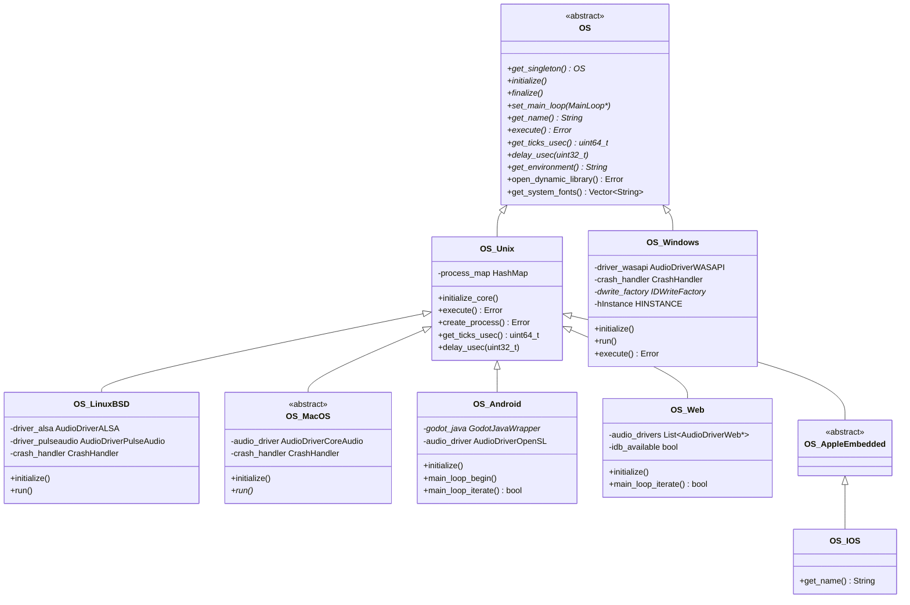

# 平台抽象层 (Platform Abstraction Layer) — Godot vs UE 深度对比分析

> **核心结论**：Godot 用单一 `OS` 虚类 + 平台子类的"瘦继承"实现全平台适配，UE 则用 `FGenericPlatformMisc` 静态函数族 + typedef 别名的"编译期多态"策略，前者更直观，后者更灵活。

---

## 目录

- [第 1 章：模块概览 — "UE 程序员 30 秒速览"](#第-1-章模块概览--ue-程序员-30-秒速览)
- [第 2 章：架构对比 — "同一个问题，两种解法"](#第-2-章架构对比--同一个问题两种解法)
- [第 3 章：核心实现对比 — "代码层面的差异"](#第-3-章核心实现对比--代码层面的差异)
- [第 4 章：UE → Godot 迁移指南](#第-4-章ue--godot-迁移指南)
- [第 5 章：性能对比](#第-5-章性能对比)
- [第 6 章：总结 — "一句话记住"](#第-6-章总结--一句话记住)

---

## 第 1 章：模块概览 — "UE 程序员 30 秒速览"

### 一句话说明

Godot 的 `platform/` 目录是整个引擎的**平台入口和操作系统适配层**，负责程序启动（`main()`）、OS 服务封装（文件系统、进程管理、时间、字体等）和显示服务器抽象。对应 UE 的 `Runtime/Launch/Private/*/Launch*.cpp`（平台入口）+ `Runtime/Core/Public/GenericPlatform/`（平台抽象）+ `Runtime/ApplicationCore/`（应用层平台服务）。

### 核心类/结构体列表

| # | Godot 类/结构体 | 源码路径 | UE 对应物 | 说明 |
|---|----------------|---------|-----------|------|
| 1 | `OS` | `core/os/os.h` | `FGenericPlatformMisc` | 平台抽象基类，定义所有 OS 服务接口 |
| 2 | `OS_Unix` | `drivers/unix/os_unix.h` | 无直接对应（UE 用 `UnixCommonStartup`） | Unix 系平台的共享实现层 |
| 3 | `OS_Windows` | `platform/windows/os_windows.h` | `FWindowsPlatformMisc` | Windows 平台 OS 实现 |
| 4 | `OS_LinuxBSD` | `platform/linuxbsd/os_linuxbsd.h` | `FLinuxPlatformMisc` | Linux/BSD 平台 OS 实现 |
| 5 | `OS_MacOS` | `platform/macos/os_macos.h` | `FMacPlatformMisc` | macOS 平台 OS 实现 |
| 6 | `OS_Android` | `platform/android/os_android.h` | `FAndroidMisc` | Android 平台 OS 实现 |
| 7 | `OS_IOS` | `platform/ios/os_ios.h` | `FIOSPlatformMisc` | iOS 平台 OS 实现 |
| 8 | `OS_Web` | `platform/web/os_web.h` | 无直接对应（UE 用 Pixel Streaming） | Web/Emscripten 平台 OS 实现 |
| 9 | `DisplayServer` | `servers/display_server.h` | `FGenericPlatformApplicationMisc` + `GenericApplication` | 窗口/输入/显示抽象 |
| 10 | `CrashHandler` | `platform/*/crash_handler_*.h` | `FGenericCrashContext` + `FPlatformMisc::SetCrashHandler` | 崩溃处理器 |
| 11 | `Main` | `main/main.h` | `FEngineLoop` + `GuardedMain()` | 引擎初始化和主循环控制 |
| 12 | `MainLoop` | `core/os/main_loop.h` | `FEngineLoop::Tick()` | 主循环抽象（SceneTree 继承自它） |

### Godot vs UE 概念速查表

| 概念 | Godot | UE | 关键差异 |
|------|-------|-----|---------|
| 平台抽象基类 | `OS`（虚类，运行时多态） | `FGenericPlatformMisc`（struct，编译期 typedef） | Godot 用虚函数，UE 用静态函数 + 编译期替换 |
| 平台入口 | `platform/*/godot_*.cpp` 中的 `main()` | `Launch/Private/*/Launch*.cpp` 中的 `WinMain()`/`main()` | Godot 入口直接创建 OS 实例；UE 入口调用 `GuardedMain()` |
| 主循环 | `OS::run()` → `Main::iteration()` | `GuardedMain()` → `while(!IsEngineExitRequested()) EngineTick()` | Godot 主循环在 OS 子类中；UE 在 Launch 模块中 |
| 进程管理 | `OS::execute()` / `OS::create_process()` | `FPlatformProcess::CreateProc()` / `FPlatformProcess::ExecProcess()` | Godot 集成在 OS 类中；UE 独立为 `FPlatformProcess` |
| 崩溃处理 | `CrashHandler` 类（每平台独立实现） | `FGenericCrashContext` + SEH/信号处理 | UE 有完整的 CrashReporter 管线 |
| 文件系统 | `FileAccess` / `DirAccess`（工厂模式） | `IFileManager` / `FPlatformFileManager` | Godot 在 OS::initialize() 中注册工厂 |
| 显示/窗口 | `DisplayServer`（独立于 OS 的服务器） | `GenericApplication` + `FGenericWindow` | Godot 将显示与 OS 分离为独立服务器 |
| Web 平台 | 原生 Emscripten 编译（`OS_Web`） | Pixel Streaming（远程渲染） | Godot 真正运行在浏览器中 |
| 音频驱动 | OS 子类中直接持有驱动实例 | `FAudioDevice` 独立模块 | Godot 音频驱动与平台层紧耦合 |
| 动态库加载 | `OS::open_dynamic_library()` | `FPlatformProcess::GetDllHandle()` | 接口位置不同，功能等价 |

---

## 第 2 章：架构对比 — "同一个问题，两种解法"

### 2.1 Godot 的架构设计

Godot 的平台抽象层采用经典的**面向对象继承体系**，以 `OS` 基类为核心，通过虚函数实现运行时多态：



**关键设计特点**：

1. **单例模式**：`OS` 是全局单例，通过 `OS::get_singleton()` 访问，整个引擎生命周期只有一个 OS 实例。
2. **OS 与 DisplayServer 分离**：Godot 将"操作系统服务"（进程、文件、时间）和"显示服务"（窗口、输入、渲染上下文）分为两个独立的类层次。`OS` 负责底层 OS 交互，`DisplayServer` 负责窗口和图形。
3. **Unix 中间层**：`OS_Unix` 作为所有 Unix-like 平台（Linux、macOS、Android、Web/Emscripten、iOS）的共享基类，提供 POSIX 标准实现（进程管理、时间、文件等）。
4. **音频驱动内嵌**：每个 OS 子类直接持有平台特定的音频驱动实例（如 `AudioDriverWASAPI`、`AudioDriverPulseAudio`），音频驱动的生命周期与 OS 绑定。

### 2.2 UE 对应模块的架构设计

UE 的平台抽象采用完全不同的策略——**编译期多态（typedef 别名 + 静态函数）**：

```
FGenericPlatformMisc (基础 struct，全静态函数)
    ├── FWindowsPlatformMisc : FGenericPlatformMisc
    ├── FLinuxPlatformMisc : FGenericPlatformMisc  
    ├── FMacPlatformMisc : FGenericPlatformMisc
    ├── FAndroidMisc : FGenericPlatformMisc
    └── FIOSPlatformMisc : FGenericPlatformMisc

// 编译期选择：
#if PLATFORM_WINDOWS
    typedef FWindowsPlatformMisc FPlatformMisc;
#elif PLATFORM_LINUX
    typedef FLinuxPlatformMisc FPlatformMisc;
#endif
```

UE 的平台层被拆分为多个独立的 `FGenericPlatform*` 族：

| UE 平台抽象类 | 职责 | Godot 对应 |
|--------------|------|-----------|
| `FGenericPlatformMisc` | 杂项 OS 服务（环境变量、GUID、消息框等） | `OS` 基类的一部分 |
| `FGenericPlatformProcess` | 进程管理（创建进程、DLL 加载、信号量） | `OS::execute()` / `OS::open_dynamic_library()` |
| `FGenericPlatformApplicationMisc` | 应用层服务（消息泵、剪贴板、DPI） | `DisplayServer` 的一部分 |
| `FGenericPlatformMemory` | 内存管理（页分配、内存统计） | `OS::get_memory_info()` |
| `FGenericPlatformFile` | 文件系统 | `FileAccess` / `DirAccess` |
| `FGenericPlatformTime` | 时间服务 | `OS::get_ticks_usec()` / `OS::get_unix_time()` |

### 2.3 关键架构差异分析

#### 差异 1：运行时多态 vs 编译期多态 — 设计哲学的根本分歧

Godot 的 `OS` 基类使用 C++ 虚函数实现运行时多态。每个平台方法（如 `get_name()`、`execute()`、`get_ticks_usec()`）都是 `virtual` 的，通过 vtable 在运行时分发。这意味着：

```cpp
// Godot: core/os/os.h
class OS {
    virtual String get_name() const = 0;           // 纯虚函数
    virtual Error execute(...) = 0;                 // 纯虚函数
    virtual uint64_t get_ticks_usec() const = 0;    // 纯虚函数
};
```

而 UE 使用 `struct` + 静态函数 + `typedef` 的编译期多态：

```cpp
// UE: GenericPlatform/GenericPlatformMisc.h
struct FGenericPlatformMisc {
    static void PlatformInit() { }                  // 静态函数，可被子类隐藏
    static FString GetEnvironmentVariable(...);     // 静态函数
};

// UE: Windows/WindowsPlatformMisc.h
struct FWindowsPlatformMisc : public FGenericPlatformMisc {
    static FString GetEnvironmentVariable(...);     // 隐藏基类同名函数
};

// 编译期选择
typedef FWindowsPlatformMisc FPlatformMisc;         // 全局别名
```

**Trade-off 分析**：
- **Godot 的虚函数方案**：代码更直观，IDE 跳转方便，但每次调用有 vtable 开销（虽然对 OS 级调用来说可忽略不计）。更重要的是，它允许理论上的运行时平台切换（虽然实际不会这么做）。
- **UE 的 typedef 方案**：零运行时开销（编译期就确定了调用目标），但代码导航困难——你看到 `FPlatformMisc::GetEnvironmentVariable()` 时，需要知道当前编译目标才能找到实际实现。UE 的方案更适合其庞大的代码库，因为平台函数调用极其频繁，即使微小的 vtable 开销在热路径上也可能累积。

#### 差异 2：单一 OS 类 vs 功能分散的 Platform 族 — 模块耦合方式

Godot 将几乎所有平台服务集中在一个 `OS` 类中：进程管理、环境变量、文件路径、字体查询、时间、动态库加载……全部是 `OS` 的虚方法。`OS_Windows` 一个类就有 **278 行头文件**，覆盖了 50+ 个虚方法。

UE 则将平台服务拆分为十几个独立的 `FGenericPlatform*` 类：
- `FGenericPlatformMisc`（1770 行！）—— 杂项
- `FGenericPlatformProcess`（715 行）—— 进程
- `FGenericPlatformMemory` —— 内存
- `FGenericPlatformFile` —— 文件
- `FGenericPlatformTime` —— 时间
- `FGenericPlatformApplicationMisc`（276 行）—— 应用层

**Trade-off 分析**：
- **Godot 的集中式设计**：学习曲线低，只需要知道 `OS` 一个类就能找到所有平台服务。但随着功能增长，`OS` 类会变得臃肿（基类已有 386 行头文件）。
- **UE 的分散式设计**：职责清晰，每个类专注一个领域，更符合单一职责原则。但新手需要记住十几个类名，且跨类调用时需要知道功能在哪个 `FPlatform*` 类中。

#### 差异 3：OS 与 DisplayServer 的分离 vs Application 的统一

Godot 做了一个非常有意义的架构决策：将 `OS`（操作系统服务）和 `DisplayServer`（显示/窗口/输入服务）**完全分离**为两个独立的类层次。这意味着：

- 可以有 `OS` 但没有 `DisplayServer`（headless 模式，如服务器）
- `DisplayServer` 可以有多种实现（X11、Wayland、Windows、Web），且可以在运行时选择
- 音频、网络等服务不依赖显示系统

UE 的对应设计是 `GenericApplication`（在 `ApplicationCore` 模块中），它同时处理窗口管理和输入。UE 的 `FPlatformMisc` 和 `FPlatformApplicationMisc` 之间的边界不如 Godot 的 `OS`/`DisplayServer` 那么清晰。

**Trade-off 分析**：
- **Godot 的分离设计**：更灵活，headless 模式天然支持，Linux 上可以运行时选择 X11 或 Wayland。但增加了一层间接性，某些功能（如剪贴板）到底放在 `OS` 还是 `DisplayServer` 中需要仔细考虑。
- **UE 的设计**：`GenericApplication` 作为应用层的统一入口，概念上更简单。但 headless 模式需要特殊处理，且平台服务的边界有时模糊。

---

## 第 3 章：核心实现对比 — "代码层面的差异"

### 3.1 平台入口：`main()` 函数的实现

#### Godot 怎么做的

每个平台都有自己的入口文件，位于 `platform/*/godot_*.cpp`。以 Windows 为例：

**源码路径**：`platform/windows/godot_windows.cpp`

```cpp
// 简化后的 Windows 入口
int widechar_main(int argc, wchar_t **argv) {
    OS_Windows os(nullptr);                    // 1. 创建平台 OS 实例（栈上）
    setlocale(LC_CTYPE, "");
    
    // 2. 转换命令行参数为 UTF-8
    char **argv_utf8 = new char *[argc];
    for (int i = 0; i < argc; ++i)
        argv_utf8[i] = wc_to_utf8(argv[i]);
    
    Error err = Main::setup(argv_utf8[0], argc - 1, &argv_utf8[1]);  // 3. 引擎初始化
    if (err != OK) return EXIT_FAILURE;
    
    if (Main::start() == EXIT_SUCCESS) {
        os.run();                              // 4. 进入主循环
    }
    Main::cleanup();                           // 5. 清理
    return os.get_exit_code();
}

int WINAPI WinMain(HINSTANCE hInstance, ...) {
    godot_hinstance = hInstance;
    return main(0, nullptr);                   // WinMain 转发到 main
}
```

Linux 入口（`platform/linuxbsd/godot_linuxbsd.cpp`）结构几乎相同：

```cpp
int main(int argc, char *argv[]) {
    // SSE4.2 检查（x86_64）
    OS_LinuxBSD os;                            // 栈上创建
    setlocale(LC_CTYPE, "");
    Error err = Main::setup(argv[0], argc - 1, &argv[1]);
    if (Main::start() == EXIT_SUCCESS) {
        os.run();
    }
    Main::cleanup();
    return os.get_exit_code();
}
```

Web 入口（`platform/web/web_main.cpp`）则完全不同，因为浏览器环境不允许阻塞式主循环：

```cpp
extern EMSCRIPTEN_KEEPALIVE int godot_web_main(int argc, char *argv[]) {
    os = new OS_Web();                         // 堆上创建（生命周期由 JS 管理）
    Error err = Main::setup(argv[0], argc - 1, &argv[1]);
    Main::start();
    os->get_main_loop()->initialize();
    emscripten_set_main_loop(main_loop_callback, -1, false);  // 注册回调而非阻塞循环
    return os->get_exit_code();
}
```

**Godot 入口的统一模式**：`创建 OS 实例` → `Main::setup()` → `Main::start()` → `os.run()` → `Main::cleanup()`。

#### UE 怎么做的

**源码路径**：`Engine/Source/Runtime/Launch/Private/Windows/LaunchWindows.cpp`

```cpp
int32 WINAPI WinMain(HINSTANCE hInInstance, ...) {
    SetupWindowsEnvironment();                 // 1. CRT 设置
    const TCHAR* CmdLine = ::GetCommandLineW();
    ProcessCommandLine();                      // 2. 命令行处理
    
    GIsFirstInstance = MakeNamedMutex(CmdLine); // 3. 单实例检测（Godot 无此功能）
    
    // 4. 多层异常处理包装
    __try {
        GIsGuarded = 1;
        ErrorLevel = GuardedMainWrapper(CmdLine);  // → GuardedMain()
        GIsGuarded = 0;
    } __except (...) {
        // 崩溃处理
    }
    
    FEngineLoop::AppExit();                    // 5. 清理
}
```

`GuardedMain()`（在 `Launch.cpp` 中）是真正的引擎初始化入口：

```cpp
int32 GuardedMain(const TCHAR* CmdLine) {
    int32 ErrorLevel = EnginePreInit(CmdLine);  // → GEngineLoop.PreInit()
    ErrorLevel = EngineInit();                   // → GEngineLoop.Init()
    
    while (!IsEngineExitRequested()) {
        EngineTick();                            // → GEngineLoop.Tick()
    }
    return ErrorLevel;
}
```

#### 差异点评

| 对比维度 | Godot | UE |
|---------|-------|-----|
| OS 实例创建 | 在 `main()` 中栈上创建 | 无显式 OS 实例，平台服务通过静态函数访问 |
| 主循环位置 | `OS::run()` 中（平台子类） | `GuardedMain()` 中（Launch 模块） |
| 异常保护 | Windows 用 SEH（仅 Debug），Linux 用信号处理 | 多层 SEH 包装 + `GuardedMainWrapper` |
| 单实例检测 | 无内置支持 | `MakeNamedMutex()` 检测 |
| Web 适配 | 原生 `emscripten_set_main_loop` 回调 | 不支持 Web 原生运行 |

**Godot 的优势**：入口代码极其简洁（Linux 入口仅 ~30 行有效代码），Web 平台有原生支持。  
**UE 的优势**：更健壮的异常处理（多层 SEH），单实例检测防止资源冲突。

### 3.2 OS 子类的平台适配：虚函数 override vs 静态函数隐藏

#### Godot 怎么做的

以"获取环境变量"为例，Godot 的实现链路：

**基类声明**（`core/os/os.h`）：
```cpp
class OS {
    virtual bool has_environment(const String &p_var) const = 0;
    virtual String get_environment(const String &p_var) const = 0;
    virtual void set_environment(const String &p_var, const String &p_value) const = 0;
};
```

**Unix 层实现**（`drivers/unix/os_unix.h`）：
```cpp
class OS_Unix : public OS {
    virtual bool has_environment(const String &p_var) const override;
    virtual String get_environment(const String &p_var) const override;
    virtual void set_environment(const String &p_var, const String &p_value) const override;
};
```

**Windows 层实现**（`platform/windows/os_windows.h`）：
```cpp
class OS_Windows : public OS {
    virtual bool has_environment(const String &p_var) const override;   // 直接继承 OS
    virtual String get_environment(const String &p_var) const override;
    virtual void set_environment(const String &p_var, const String &p_value) const override;
};
```

注意 `OS_Windows` 直接继承 `OS`（不经过 `OS_Unix`），因为 Windows 不是 Unix 系统。而 `OS_LinuxBSD` 继承 `OS_Unix`，可以复用 POSIX 实现。

#### UE 怎么做的

**源码路径**：`Engine/Source/Runtime/Core/Public/GenericPlatform/GenericPlatformMisc.h` 和 `Engine/Source/Runtime/Core/Public/Windows/WindowsPlatformMisc.h`

```cpp
// 基类
struct FGenericPlatformMisc {
    static FString GetEnvironmentVariable(const TCHAR* VariableName);
    static void SetEnvironmentVar(const TCHAR* VariableName, const TCHAR* Value);
};

// Windows 子类
struct FWindowsPlatformMisc : public FGenericPlatformMisc {
    static FString GetEnvironmentVariable(const TCHAR* VariableName);  // 隐藏基类
    static void SetEnvironmentVar(const TCHAR* VariableName, const TCHAR* Value);
};

// 编译期别名
typedef FWindowsPlatformMisc FPlatformMisc;
```

调用方式：`FPlatformMisc::GetEnvironmentVariable(TEXT("PATH"))`。编译器在编译时就确定了调用 `FWindowsPlatformMisc` 的版本。

#### 差异点评

Godot 的虚函数方案让代码导航非常友好——在 IDE 中对 `OS::get_environment()` 右键"Go to Implementation"就能看到所有平台的实现。UE 的 typedef 方案则需要你先确定编译目标平台，然后手动找到对应的 `F*PlatformMisc` 类。

但 UE 的方案有一个重要优势：**不需要虚函数表**。对于像 `FPlatformTime::Seconds()` 这样在每帧被调用数千次的函数，避免 vtable 查找是有意义的。Godot 的 `OS::get_ticks_usec()` 虽然也是虚函数，但由于 OS 是单例且调用频率相对较低，这个开销在实践中可以忽略。

### 3.3 Web 平台：Godot 原生 Web 导出 vs UE Pixel Streaming

#### Godot 怎么做的

Godot 通过 Emscripten 将整个引擎编译为 WebAssembly，在浏览器中原生运行。这是 Godot 最独特的平台支持之一。

**源码路径**：`platform/web/os_web.h`、`platform/web/web_main.cpp`

```cpp
class OS_Web : public OS_Unix {
    // 继承 OS_Unix 的 POSIX 实现（Emscripten 提供 POSIX 兼容层）
    
    bool idb_is_syncing = false;    // IndexedDB 同步状态
    bool idb_available = false;     // IndexedDB 可用性
    bool pwa_is_waiting = false;    // PWA 更新状态
    
    // 浏览器环境特有的回调
    WASM_EXPORT static void main_loop_callback();
    WASM_EXPORT static void file_access_close_callback(const String &p_file, int p_flags);
    WASM_EXPORT static void fs_sync_callback();
};
```

Web 平台的核心挑战是**浏览器不允许阻塞式主循环**。Godot 的解决方案：

```cpp
// platform/web/web_main.cpp
void main_loop_callback() {
    bool force_draw = DisplayServerWeb::get_singleton()->check_size_force_redraw();
    if (force_draw) {
        Main::force_redraw();
    }
    
    if (os->main_loop_iterate()) {
        emscripten_cancel_main_loop();
        emscripten_set_main_loop(exit_callback, -1, false);
        godot_js_os_finish_async(cleanup_after_sync);
    }
}

// 入口函数注册回调而非阻塞
emscripten_set_main_loop(main_loop_callback, -1, false);
```

Web 平台还有独特的文件系统处理——使用 IndexedDB 作为持久化存储：

```cpp
// OS_Web 重写了文件路径方法
String get_cache_path() const override;
String get_config_path() const override;
String get_data_path() const override;
String get_user_data_dir(const String &p_user_dir) const override;
bool is_userfs_persistent() const override;  // 检查 IndexedDB 是否可用
```

#### UE 怎么做的

UE **不支持将引擎编译为 WebAssembly 在浏览器中运行**。UE 的 Web 方案是 **Pixel Streaming**：

- 引擎在服务器端运行（完整的 Windows/Linux 实例）
- 通过 WebRTC 将渲染结果流式传输到浏览器
- 浏览器端只是一个视频播放器 + 输入转发器

这是完全不同的架构理念。

#### 差异点评

| 对比维度 | Godot (OS_Web) | UE (Pixel Streaming) |
|---------|----------------|---------------------|
| 运行位置 | 浏览器本地（WebAssembly） | 服务器端 |
| 延迟 | 零网络延迟 | 依赖网络质量 |
| 服务器成本 | 零（静态文件托管） | 需要 GPU 服务器 |
| 图形能力 | WebGL 2.0 / WebGPU（受限） | 完整的 DX12/Vulkan |
| 离线支持 | 支持（PWA） | 不支持 |
| 包体大小 | ~30-50MB WASM | 浏览器端极小 |
| 多线程 | 有限（SharedArrayBuffer） | 完整多线程 |

**Godot 的 Web 方案**适合中小型游戏、工具、演示，是 Godot 的一大竞争优势。  
**UE 的 Pixel Streaming**适合需要完整图形能力的 AAA 级体验，但需要基础设施支持。

### 3.4 Android/iOS 平台集成

#### Godot 怎么做的

**Android**（`platform/android/os_android.h`）：

Godot 的 Android 平台通过 JNI 与 Java 层交互。`OS_Android` 持有两个 Java 包装器：

```cpp
class OS_Android : public OS_Unix {
    GodotJavaWrapper *godot_java = nullptr;       // 主 Activity 的 JNI 包装
    GodotIOJavaWrapper *godot_io_java = nullptr;  // IO 相关的 JNI 包装
    
    AudioDriverOpenSL audio_driver_android;        // OpenSL ES 音频
    ANativeWindow *native_window = nullptr;        // Vulkan 用的原生窗口
    
    // Android 特有的主循环（由 Java Activity 驱动）
    void main_loop_begin();
    bool main_loop_iterate(bool *r_should_swap_buffers = nullptr);
    void main_loop_end();
    void main_loop_focusout();
    void main_loop_focusin();
};
```

Android 的主循环不是由 C++ 的 `main()` 驱动的，而是由 Java Activity 的生命周期回调驱动。`OS_Android` 没有 `run()` 方法，取而代之的是 `main_loop_begin()`/`main_loop_iterate()`/`main_loop_end()` 三段式接口，由 Java 层调用。

**iOS**（`platform/ios/os_ios.h`）：

iOS 的实现极其精简，因为大部分功能在 `OS_AppleEmbedded` 基类中：

```cpp
class OS_IOS : public OS_AppleEmbedded {
public:
    static OS_IOS *get_singleton();
    virtual String get_name() const override;  // 返回 "iOS"
};
```

iOS 和 visionOS 共享 `OS_AppleEmbedded` 基类，体现了 Godot 对 Apple 嵌入式平台的统一抽象。

#### UE 怎么做的

**UE Android**（`Engine/Source/Runtime/Launch/Private/Android/LaunchAndroid.cpp`，59KB！）：

UE 的 Android 入口文件巨大（59KB），因为它包含了大量的 JNI 回调、Activity 生命周期管理、权限处理等。UE 使用 `FAndroidMisc` 提供平台服务，`FAndroidApplication` 管理应用生命周期。

**UE iOS**（`Engine/Source/Runtime/Launch/Private/IOS/LaunchIOS.cpp`，17KB）：

UE 的 iOS 入口同样复杂，需要处理 UIKit 的 AppDelegate 生命周期。

#### 差异点评

| 对比维度 | Godot | UE |
|---------|-------|-----|
| Android 入口复杂度 | Java Activity + JNI 包装器（相对简洁） | 59KB 的 LaunchAndroid.cpp（极其复杂） |
| iOS 代码量 | `OS_IOS` 仅 47 行（共享 AppleEmbedded 基类） | LaunchIOS.cpp 17KB |
| 构建系统 | SCons + Gradle（Android）/ Xcode（iOS） | UnrealBuildTool + Gradle / Xcode |
| 热重载 | 不支持原生热重载 | 支持（通过 Live Coding） |
| 权限管理 | `OS::request_permission()` 虚方法 | `FAndroidMisc` 静态方法 |

Godot 的移动平台代码明显更精简，这得益于 `OS_Unix` 中间层和 `OS_AppleEmbedded` 共享基类的设计。UE 的移动平台代码更复杂，但也提供了更多的平台特定功能（如 Live Coding、更细粒度的生命周期管理）。

### 3.5 崩溃处理机制

#### Godot 怎么做的

每个平台有独立的 `CrashHandler` 类：

**源码路径**：`platform/linuxbsd/crash_handler_linuxbsd.cpp`

```cpp
static void handle_crash(int sig) {
    signal(SIGSEGV, SIG_DFL);  // 重置信号处理器
    
    // 1. 获取调用栈
    void *bt_buffer[256];
    size_t size = backtrace(bt_buffer, 256);
    
    // 2. 通知 MainLoop
    if (OS::get_singleton()->get_main_loop())
        OS::get_singleton()->get_main_loop()->notification(MainLoop::NOTIFICATION_CRASH);
    
    // 3. 打印引擎版本和调用栈
    print_error(vformat("Engine version: %s", GODOT_VERSION_FULL_NAME));
    char **strings = backtrace_symbols(bt_buffer, size);
    
    // 4. 使用 addr2line 解析符号
    OS::get_singleton()->execute("addr2line", args, &output, &ret);
    
    // 5. 打印脚本调用栈
    for (const auto &backtrace : ScriptServer::capture_script_backtraces(false)) {
        print_error(backtrace->format());
    }
    
    abort();
}

void CrashHandler::initialize() {
    signal(SIGSEGV, handle_crash);
    signal(SIGFPE, handle_crash);
    signal(SIGILL, handle_crash);
}
```

Windows 平台使用 SEH（Structured Exception Handling）：

```cpp
// platform/windows/godot_windows.cpp
#if defined(CRASH_HANDLER_EXCEPTION) && defined(_MSC_VER)
    __try {
        return _main();
    } __except (CrashHandlerException(GetExceptionInformation())) {
        return 1;
    }
#endif
```

#### UE 怎么做的

UE 有更复杂的崩溃处理管线：

```cpp
// LaunchWindows.cpp - 多层 SEH 包装
__try {
    GIsGuarded = 1;
    ErrorLevel = GuardedMainWrapper(CmdLine);  // 内层还有一个 __try
    GIsGuarded = 0;
} __except (ReportCrash(GetExceptionInformation())) {
    // 崩溃报告
    GError->HandleError();
    LaunchStaticShutdownAfterError();
    FPlatformMallocCrash::Get().PrintPoolsUsage();
    FPlatformMisc::RequestExit(true);
}
```

UE 还有完整的 `FGenericCrashContext` 系统，可以收集崩溃时的详细上下文（内存状态、线程信息、GPU 状态等），并通过 CrashReporter 上传到服务器。

#### 差异点评

| 对比维度 | Godot | UE |
|---------|-------|-----|
| 崩溃信息收集 | 调用栈 + addr2line + 脚本栈 | 完整上下文（内存、线程、GPU、模块列表） |
| 崩溃报告上传 | 无内置支持 | CrashReporter 自动上传 |
| 脚本栈追踪 | ✅ 支持（GDScript/C# 栈） | ✅ 支持（Blueprint 栈） |
| 用户通知 | `MainLoop::NOTIFICATION_CRASH` | `GError->HandleError()` |
| 异常保护层数 | 1 层 | 2-3 层嵌套 SEH |

---

## 第 4 章：UE → Godot 迁移指南

### 思维转换清单

1. **忘掉 `FPlatformMisc` 的静态调用习惯，改用 `OS::get_singleton()`**  
   在 UE 中你写 `FPlatformMisc::GetEnvironmentVariable(TEXT("PATH"))`，在 Godot 中要写 `OS::get_singleton()->get_environment("PATH")`。所有平台服务都通过 OS 单例的虚方法访问。

2. **忘掉 `FEngineLoop` 的 Tick 模式，理解 `Main::iteration()` + `OS::run()`**  
   UE 的主循环在 `GuardedMain()` 中，Godot 的主循环在各平台 OS 子类的 `run()` 方法中。`Main::iteration()` 返回 `true` 表示应该退出。

3. **忘掉 `FPlatformProcess` 独立类，进程管理在 `OS` 中**  
   UE 的 `FPlatformProcess::CreateProc()` 在 Godot 中是 `OS::create_process()`。动态库加载从 `FPlatformProcess::GetDllHandle()` 变为 `OS::open_dynamic_library()`。

4. **理解 OS 与 DisplayServer 的分离**  
   UE 的 `FPlatformApplicationMisc::PumpMessages()` 在 Godot 中是 `DisplayServer::process_events()`。窗口管理、输入处理、剪贴板等都在 `DisplayServer` 而非 `OS` 中。

5. **接受 Web 是一等公民平台**  
   UE 程序员可能从未考虑过 Web 导出。在 Godot 中，Web 是一个完整支持的平台，你的代码需要考虑 `OS_Web` 的限制（如无阻塞式主循环、IndexedDB 文件系统、有限的多线程）。

### API 映射表

| UE API | Godot API | 说明 |
|--------|-----------|------|
| `FPlatformMisc::GetEnvironmentVariable()` | `OS::get_singleton()->get_environment()` | 获取环境变量 |
| `FPlatformMisc::SetEnvironmentVar()` | `OS::get_singleton()->set_environment()` | 设置环境变量 |
| `FPlatformProcess::CreateProc()` | `OS::get_singleton()->create_process()` | 创建子进程 |
| `FPlatformProcess::ExecProcess()` | `OS::get_singleton()->execute()` | 执行并等待进程 |
| `FPlatformProcess::GetDllHandle()` | `OS::get_singleton()->open_dynamic_library()` | 加载动态库 |
| `FPlatformProcess::FreeDllHandle()` | `OS::get_singleton()->close_dynamic_library()` | 卸载动态库 |
| `FPlatformTime::Seconds()` | `OS::get_singleton()->get_ticks_usec() / 1e6` | 获取高精度时间 |
| `FPlatformMisc::MessageBoxExt()` | `OS::get_singleton()->alert()` | 显示消息框 |
| `FPlatformMisc::RequestExit()` | `SceneTree::quit()` 或 `OS::set_exit_code()` | 请求退出 |
| `FPlatformMisc::GetCPUBrand()` | `OS::get_singleton()->get_processor_name()` | 获取 CPU 名称 |
| `FPaths::GetPath()` | `OS::get_singleton()->get_executable_path()` | 获取可执行文件路径 |
| `FPlatformMisc::GetUniqueDeviceId()` | `OS::get_singleton()->get_unique_id()` | 获取设备唯一 ID |
| `FGenericPlatformMisc::NumberOfCores()` | `OS::get_singleton()->get_processor_count()` | 获取 CPU 核心数 |
| `GEngineLoop.IsEngineExitRequested()` | `Main::iteration()` 返回 `true` | 检查是否应退出 |

### 陷阱与误区

#### 陷阱 1：不要在 GDScript 中直接调用 OS 的 C++ 方法

Godot 的 `OS` 类在 GDScript 中暴露为 `OS` 单例，但 API 名称和参数可能与 C++ 不同。例如：

```gdscript
# GDScript
OS.get_environment("PATH")           # ✅ 正确
OS.execute("ls", ["-la"])             # ✅ 正确，但返回值不同于 C++
OS.open_dynamic_library(...)          # ❌ 不暴露给 GDScript
```

UE 程序员习惯在 C++ 中直接调用平台 API，但在 Godot 中，很多底层 OS 方法不暴露给脚本层。需要通过 GDExtension 或修改引擎源码来访问。

#### 陷阱 2：Web 平台的异步文件系统

在 UE 中，文件 I/O 是同步的（或通过 `FAsyncFileHandle` 异步）。在 Godot 的 Web 平台上，文件系统基于 IndexedDB，写入操作需要异步同步到持久化存储：

```cpp
// OS_Web 中的文件同步
bool idb_needs_sync = false;  // 标记需要同步
void force_fs_sync();          // 强制同步到 IndexedDB
```

如果你在 Web 平台上频繁写文件而不调用 `force_fs_sync()`，数据可能在页面关闭时丢失。

#### 陷阱 3：主循环的控制权差异

在 UE 中，`FEngineLoop::Tick()` 由 `GuardedMain()` 中的 `while` 循环驱动，你可以在 Tick 中做任何事。

在 Godot 中，主循环的控制权在 `OS::run()` 中，但实际的帧逻辑在 `Main::iteration()` 中。Android 和 Web 平台的主循环甚至不是由 C++ 驱动的——Android 由 Java Activity 驱动，Web 由 `requestAnimationFrame` 驱动。

这意味着你不能假设主循环是一个简单的 `while(true)` 循环。在编写跨平台代码时，要使用 `MainLoop` 的回调机制而非直接操作循环。

### 最佳实践

1. **使用 `OS::get_singleton()` 而非平台特定代码**：Godot 的 OS 抽象层设计良好，绝大多数情况下不需要写平台特定代码。如果你发现自己在写 `#ifdef WINDOWS_ENABLED`，先检查 OS 基类是否已经提供了跨平台接口。

2. **利用 `_check_internal_feature_support()` 做特性检测**：而非平台检测。例如，检查 `OS::has_feature("web")` 而非 `#ifdef WEB_ENABLED`，这样在 GDScript 中也能使用。

3. **理解 DisplayServer 的独立性**：如果你的代码只需要 OS 服务（文件、进程、时间），不要依赖 DisplayServer。这样你的代码在 headless 模式下也能工作。

4. **为 Web 平台做好准备**：避免阻塞式操作、大量同步文件 I/O、依赖多线程。使用 `OS::get_singleton()->has_feature("threads")` 检查多线程支持。

---

## 第 5 章：性能对比

### 5.1 Godot 平台层的性能特征

Godot 平台层的性能特征主要体现在以下几个方面：

**虚函数调用开销**：`OS` 基类的所有方法都是虚函数，每次调用有一次 vtable 查找。但由于 OS 方法的调用频率远低于渲染或物理计算，这个开销在实践中可以忽略。以 `OS::get_ticks_usec()` 为例，即使每帧调用几十次，vtable 开销也不到 1 微秒。

**主循环效率**：Godot 的主循环（`OS::run()`）非常精简：

```cpp
void OS_Windows::run() {
    main_loop->initialize();
    while (true) {
        DisplayServer::get_singleton()->process_events();
        if (Main::iteration()) break;
    }
    main_loop->finalize();
}
```

每帧只有两个关键调用：`process_events()` 和 `Main::iteration()`。没有额外的框架开销。

**Windows 定时器精度**：Godot 在 Windows 上通过 `timeBeginPeriod()` 设置了最小定时器分辨率（通常 1ms），确保 `Sleep()` 的精度。这在 `OS_Windows::initialize()` 中完成：

```cpp
TIMECAPS time_caps;
if (timeGetDevCaps(&time_caps, sizeof(time_caps)) == MMSYSERR_NOERROR) {
    delay_resolution = time_caps.wPeriodMin * 1000;
    timeBeginPeriod(time_caps.wPeriodMin);
}
```

**动态库加载**：Godot 的 `OS::open_dynamic_library()` 在 Windows 上使用 `LoadLibraryExW`，在 Unix 上使用 `dlopen`，都是标准的系统调用，性能与 UE 的 `FPlatformProcess::GetDllHandle()` 等价。

### 5.2 与 UE 的性能差异

| 性能维度 | Godot | UE | 差异原因 |
|---------|-------|-----|---------|
| 平台 API 调用开销 | 虚函数（~1-2ns vtable 查找） | 直接静态调用（0 开销） | Godot 用运行时多态，UE 用编译期多态 |
| 启动时间 | 快（~1-3 秒） | 慢（~5-30 秒） | Godot 引擎体积小，初始化步骤少 |
| 内存占用 | 低（~50-100MB 基础） | 高（~500MB-2GB 基础） | 引擎规模差异 |
| Web 平台性能 | 受 WASM 限制（~50-70% 原生性能） | N/A（不支持 WASM） | Godot 原生 Web 支持 |
| 崩溃处理开销 | 低（仅注册信号处理器） | 较高（多层 SEH + CrashContext） | UE 收集更多崩溃信息 |
| 进程创建 | 标准系统调用 | 标准系统调用 + 额外包装 | 基本等价 |

### 5.3 性能敏感场景的建议

1. **高频平台调用**：如果你需要在热路径中频繁调用平台 API（如高精度计时），考虑缓存 `OS::get_singleton()` 指针，避免重复的单例查找：
   ```cpp
   OS *os = OS::get_singleton();
   for (...) {
       uint64_t t = os->get_ticks_usec();  // 避免每次调用 get_singleton()
   }
   ```

2. **Web 平台优化**：Web 平台的性能瓶颈通常在 JavaScript 互操作和 WebGL 调用上，而非平台层本身。减少 JS 回调频率、批量处理文件操作、使用 SharedArrayBuffer 启用多线程是关键优化方向。

3. **Android 主循环**：Android 的主循环由 Java 层驱动，C++ 侧的 `main_loop_iterate()` 每帧被调用一次。确保不要在 Java→C++ 的 JNI 调用中做过多工作，因为 JNI 调用本身有开销。

4. **启动时间优化**：Godot 的 `OS::initialize()` 在启动时执行一次性的平台初始化（如 Windows 的 DWrite 字体工厂创建、定时器设置）。如果启动时间敏感，可以延迟非关键初始化。

---

## 第 6 章：总结 — "一句话记住"

### 核心差异

> Godot 用 **一个 `OS` 虚类统管所有平台服务**，UE 用 **十几个 `FPlatform*` 静态类族分而治之**；Godot 追求简洁直观，UE 追求零开销和精细控制。

### 设计亮点（Godot 做得比 UE 好的地方）

1. **OS 与 DisplayServer 的清晰分离**：这是 Godot 架构中最优雅的设计之一。headless 模式、多显示后端（X11/Wayland）的支持都因此变得自然。UE 的 `FPlatformMisc` 和 `FPlatformApplicationMisc` 之间的边界远没有这么清晰。

2. **原生 Web 平台支持**：Godot 是少数能将完整引擎编译为 WebAssembly 的游戏引擎之一。`OS_Web` 的设计巧妙地处理了浏览器环境的限制（异步主循环、IndexedDB 文件系统、PWA 支持），这是 UE 完全不具备的能力。

3. **极简的平台入口**：Godot 的 `godot_linuxbsd.cpp` 只有 ~30 行有效代码，而 UE 的 `LaunchWindows.cpp` 有 351 行。简洁的入口代码降低了理解和维护成本。

4. **Unix 中间层的代码复用**：`OS_Unix` 为 Linux、macOS、Android、iOS、Web 五个平台提供了共享的 POSIX 实现，避免了大量重复代码。

### 设计短板（Godot 不如 UE 的地方）

1. **缺乏完整的崩溃报告系统**：Godot 的 `CrashHandler` 只能打印调用栈到 stderr，没有 UE 那样的 CrashReporter 自动上传、minidump 生成、崩溃上下文收集等功能。对于商业项目来说，这是一个显著的短板。

2. **OS 类的职责过重**：`OS` 基类承担了太多职责（进程管理、文件路径、字体查询、时间、环境变量……），随着功能增长会变得越来越臃肿。UE 将这些职责分散到多个 `FPlatform*` 类中，更符合单一职责原则。

3. **编译期多态的性能优势缺失**：虽然对 OS 级调用来说虚函数开销可忽略，但 UE 的 typedef 方案在原理上更高效，且允许编译器进行更多优化（如内联）。

4. **平台特定功能的扩展性**：UE 的 `FWindowsPlatformMisc` 可以添加大量 Windows 特有的方法（如注册表查询、COM 初始化、GPU 驱动信息），而不影响其他平台。Godot 的 `OS_Windows` 虽然也能添加平台特有方法，但由于基类是虚类，添加新的虚方法会影响所有平台子类。

### UE 程序员的学习路径建议

1. **第一步**：阅读 `core/os/os.h`（386 行），理解 Godot 平台抽象的完整接口。这相当于 UE 的 `FGenericPlatformMisc` + `FGenericPlatformProcess` + `FGenericPlatformTime` 的合集。

2. **第二步**：阅读 `platform/windows/godot_windows.cpp`（154 行），理解 Godot 的启动流程。对比 UE 的 `LaunchWindows.cpp`，感受两者的复杂度差异。

3. **第三步**：阅读 `platform/windows/os_windows.h`（278 行），理解一个完整的平台实现需要 override 哪些方法。

4. **第四步**：阅读 `drivers/unix/os_unix.h`（152 行），理解 Unix 中间层如何为多个平台提供共享实现。

5. **第五步**：阅读 `platform/web/os_web.h`（120 行）和 `platform/web/web_main.cpp`（178 行），理解 Godot 最独特的平台支持——Web 导出。

6. **进阶**：阅读 `main/main.h` 和 `main/main.cpp`，理解 `Main::setup()` → `Main::start()` → `Main::iteration()` → `Main::cleanup()` 的完整引擎生命周期，对比 UE 的 `FEngineLoop::PreInit()` → `FEngineLoop::Init()` → `FEngineLoop::Tick()` → `FEngineLoop::Exit()`。
