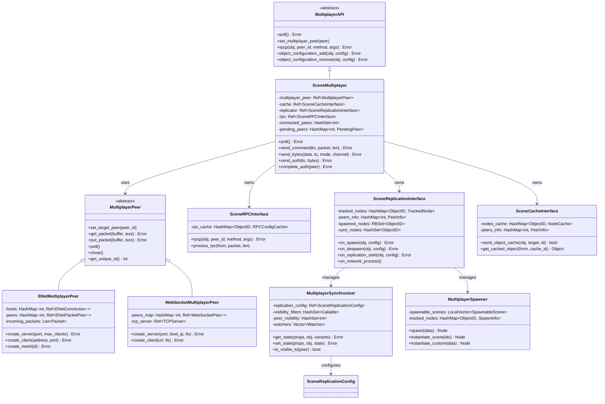

# 24. 网络与多人 (Networking & Multiplayer) — Godot vs UE 源码深度对比

> **一句话核心结论**：Godot 用"节点即网络组件"的声明式设计取代了 UE 深度耦合于 Actor 的属性复制系统，以极简的 API 换取了灵活性，但牺牲了 UE 级别的带宽优化和大规模同步能力。

---

## 目录

- [第 1 章：模块概览 — "UE 程序员 30 秒速览"](#第-1-章模块概览--ue-程序员-30-秒速览)
- [第 2 章：架构对比 — "同一个问题，两种解法"](#第-2-章架构对比--同一个问题两种解法)
- [第 3 章：核心实现对比 — "代码层面的差异"](#第-3-章核心实现对比--代码层面的差异)
- [第 4 章：UE → Godot 迁移指南](#第-4-章ue--godot-迁移指南)
- [第 5 章：性能对比](#第-5-章性能对比)
- [第 6 章：总结 — "一句话记住"](#第-6-章总结--一句话记住)

---

## 第 1 章：模块概览 — "UE 程序员 30 秒速览"

### 一句话说明

Godot 的网络与多人模块提供了一套**高层声明式多人 API**，通过 `MultiplayerAPI` + `MultiplayerPeer` 的分层抽象，将 RPC 调用、属性同步、网络对象生成统一在场景树节点体系中——对应 UE 的 **Replication + RPC + NetDriver + OnlineSubsystem** 整套网络栈。

### 核心类/结构体列表

| # | Godot 类 | 职责 | UE 对应物 |
|---|---------|------|----------|
| 1 | `MultiplayerAPI` | 高层多人 API 抽象基类 | `UNetDriver` + `UWorld::NotifyControlMessage` |
| 2 | `SceneMultiplayer` | MultiplayerAPI 的默认实现，处理包分发、认证、中继 | `UNetDriver::TickDispatch` + `UWorld` 网络逻辑 |
| 3 | `MultiplayerPeer` | 传输层抽象（PacketPeer 子类） | `UNetConnection` |
| 4 | `ENetMultiplayerPeer` | 基于 ENet 的传输实现 | `UIpNetDriver` + `UIpConnection` |
| 5 | `WebSocketMultiplayerPeer` | 基于 WebSocket 的传输实现 | 无直接对应（UE 用 `IWebSocket` 但非 NetDriver） |
| 6 | `WebRTCMultiplayerPeer` | 基于 WebRTC 的传输实现 | 无直接对应 |
| 7 | `SceneRPCInterface` | RPC 调用的编码/解码/分发 | `FObjectReplicator::ReceivedRPC` + `UFunction` RPC 标记 |
| 8 | `SceneReplicationInterface` | 状态同步与 Spawn/Despawn 管理 | `FObjectReplicator::ReplicateProperties` + `UActorChannel` |
| 9 | `SceneCacheInterface` | 节点路径缓存与 ID 映射 | `FNetworkGUID` / `FNetGUIDCache` |
| 10 | `MultiplayerSynchronizer` | 声明式属性同步节点 | `UPROPERTY(Replicated)` + `GetLifetimeReplicatedProps` |
| 11 | `MultiplayerSpawner` | 声明式网络对象生成节点 | `SpawnActor` + `bNetLoadOnClient` + `UActorChannel` Spawn |
| 12 | `SceneReplicationConfig` | 同步属性配置资源 | `FRepLayout` / `FRepChangelist` |
| 13 | `ENetConnection` | ENet 主机连接封装 | `FSocket` + `UIpConnection` 底层 |
| 14 | `ENetPacketPeer` | ENet 单个对端封装 | `UNetConnection`（单个客户端连接） |
| 15 | `OfflineMultiplayerPeer` | 离线模式占位 Peer | 无（UE 无此概念） |

### Godot vs UE 概念速查表

| 概念 | Godot | UE |
|------|-------|----|
| 网络驱动 | `MultiplayerPeer`（可插拔传输层） | `UNetDriver`（继承体系，IpNetDriver/DemoNetDriver） |
| 高层 API | `MultiplayerAPI` / `SceneMultiplayer` | `UWorld` + `UNetDriver` + `AActor::ReplicateActor` |
| RPC 声明 | `@rpc` 注解 / `_get_rpc_config()` | `UFUNCTION(Server/Client/NetMulticast)` |
| 属性同步 | `MultiplayerSynchronizer` + `SceneReplicationConfig` | `UPROPERTY(Replicated)` + `GetLifetimeReplicatedProps` |
| 网络对象生成 | `MultiplayerSpawner` 节点 | `SpawnActor` + Actor Channel 自动复制 |
| 对象网络 ID | `net_id`（uint32 递增） | `FNetworkGUID`（128-bit GUID） |
| 路径缓存 | `SceneCacheInterface`（路径→整数 ID） | `FNetGUIDCache`（路径→GUID 映射） |
| 传输模式 | `TRANSFER_MODE_RELIABLE/UNRELIABLE/UNRELIABLE_ORDERED` | `DOREPLIFETIME` 条件 + Channel 可靠性 |
| 权限模型 | `multiplayer_authority`（每节点设置） | `Role/RemoteRole` + `HasAuthority()` |
| 服务器中继 | `server_relay` 内置支持 | 无内置中继（需自行实现或用 Dedicated Server） |
| 可见性控制 | `MultiplayerSynchronizer` 可见性过滤器 | `AActor::IsNetRelevantFor` + `NetCullDistanceSquared` |
| 认证 | `auth_callback` + `send_auth/complete_auth` | `AGameModeBase::PreLogin` + NMT_Hello/Challenge/Login |

---

## 第 2 章：架构对比 — "同一个问题，两种解法"

### 2.1 Godot 的架构设计

Godot 的网络架构采用**三层分离**设计：传输层（MultiplayerPeer）、协议层（SceneMultiplayer）、功能层（Spawner/Synchronizer 节点）。



**核心设计理念**：Godot 将网络功能拆解为**可组合的节点**。`MultiplayerSpawner` 和 `MultiplayerSynchronizer` 是普通的场景树节点，开发者通过在编辑器中拖拽配置来声明网络行为，而非在代码中标记宏。

### 2.2 UE 对应模块的架构设计

UE 的网络架构是一个**深度集成于 Actor 生命周期**的系统：

- **UNetDriver**：网络驱动，管理所有 `UNetConnection`，负责收发原始数据包
- **UNetConnection**：代表一个客户端连接，内含多个 `UChannel`
- **UActorChannel**：每个被复制的 Actor 对应一个 Channel，管理该 Actor 的属性复制和 RPC
- **FObjectReplicator**：实际执行属性比较和序列化的核心类
- **FRepLayout** / **FRepState**：属性布局和复制状态的元数据

UE 的网络复制是**隐式的**——只要 Actor 标记了 `bReplicates = true`，引擎会自动为其创建 ActorChannel 并复制标记了 `Replicated` 的属性。

### 2.3 关键架构差异分析

#### 差异一：声明式节点 vs 隐式宏标记 — 设计哲学差异

Godot 选择了**显式声明**的方式：开发者必须手动在场景树中添加 `MultiplayerSynchronizer` 和 `MultiplayerSpawner` 节点，并在 `SceneReplicationConfig` 资源中逐一配置需要同步的属性。这种设计源于 Godot "一切皆节点"的核心哲学——网络同步不是对象的内在属性，而是一个可以附加、移除、重新配置的**外部行为组件**。

UE 则采用**隐式标记**：在 C++ 中用 `UPROPERTY(Replicated)` 宏标记属性，在 `GetLifetimeReplicatedProps` 中注册，引擎自动处理序列化和传输。这种方式与 UE 的反射系统深度集成，开发者几乎不需要关心底层传输细节。

**Trade-off**：Godot 的方式更灵活（可以运行时动态改变同步配置），但需要更多手动配置工作；UE 的方式更自动化，但修改同步行为需要重新编译 C++ 代码。

> **源码证据**：
> - Godot: `modules/multiplayer/multiplayer_synchronizer.h` — `MultiplayerSynchronizer` 继承自 `Node`，是场景树中的普通节点
> - UE: `Engine/Source/Runtime/Engine/Public/Net/DataReplication.h` — `FObjectReplicator` 是引擎内部类，开发者无法直接操作

#### 差异二：可插拔传输层 vs 固定 NetDriver 继承 — 继承体系差异

Godot 的 `MultiplayerPeer` 是一个轻量级抽象，继承自 `PacketPeer`（即"包收发器"）。任何实现了 `get_packet/put_packet/poll` 等虚函数的类都可以作为传输层。引擎内置了三种实现：`ENetMultiplayerPeer`、`WebSocketMultiplayerPeer`、`WebRTCMultiplayerPeer`。更关键的是，`MultiplayerPeerExtension` 允许通过 GDScript/GDExtension 自定义传输层。

UE 的 `UNetDriver` 是一个重量级基类（`NetDriver.h` 超过 2000 行），包含了连接管理、带宽控制、DDoS 检测、数据包处理等大量逻辑。自定义 NetDriver 需要继承这个庞大的基类并实现大量虚函数。

**Trade-off**：Godot 的传输层极易替换（甚至可以用脚本实现），适合快速原型和 Web 平台；UE 的 NetDriver 功能更完整，但替换成本极高。

> **源码证据**：
> - Godot: `scene/main/multiplayer_peer.h` — `MultiplayerPeer` 仅 145 行，接口极简
> - UE: `Engine/Source/Runtime/Engine/Classes/Engine/NetDriver.h` — `UNetDriver` 超过 2000 行，包含大量内置功能

#### 差异三：场景树路径寻址 vs GUID 全局寻址 — 模块耦合方式差异

Godot 的网络对象标识基于**场景树路径**。`SceneCacheInterface` 将节点的场景树路径（如 `/root/Game/Players/Player1`）映射为整数 ID，在网络上传输这个 ID 而非完整路径。这意味着网络同步与场景树结构**强耦合**——如果节点在树中的位置改变，缓存会失效。

UE 使用 `FNetworkGUID`（128-bit 全局唯一标识符）来标识网络对象。`FNetGUIDCache` 维护 GUID 到 UObject 的映射，与对象在世界中的层级结构无关。这种设计使得 Actor 可以在不同的层级结构中被正确识别。

**Trade-off**：Godot 的路径方式更直观、调试更方便（路径本身就是可读的），但对场景结构变化敏感；UE 的 GUID 方式更健壮，但调试时需要额外的 GUID 查找工具。

> **源码证据**：
> - Godot: `modules/multiplayer/scene_cache_interface.h` — `NodeCache` 使用 `cache_id` 整数映射
> - UE: `Engine/Source/Runtime/Engine/Classes/Engine/ActorChannel.h` — `ActorNetGUID` 使用 `FNetworkGUID`

---

## 第 3 章：核心实现对比 — "代码层面的差异"

### 3.1 RPC 机制：`@rpc` 注解 vs `UFUNCTION(Server/Client/NetMulticast)`

#### Godot 怎么做的

Godot 的 RPC 系统由 `SceneRPCInterface` 实现（`modules/multiplayer/scene_rpc_interface.cpp`，532 行）。

**RPC 声明**：在 GDScript 中使用 `@rpc` 注解：

```gdscript
@rpc("any_peer", "reliable", "call_local")
func take_damage(amount: int):
    health -= amount
```

注解参数会被解析为 `RPCConfig` 结构体：

```cpp
// scene_rpc_interface.h
struct RPCConfig {
    StringName name;
    MultiplayerAPI::RPCMode rpc_mode = MultiplayerAPI::RPC_MODE_DISABLED;
    bool call_local = false;
    MultiplayerPeer::TransferMode transfer_mode = MultiplayerPeer::TRANSFER_MODE_RELIABLE;
    int channel = 0;
};
```

**RPC 调用流程**：

1. 调用 `node.rpc("take_damage", 50)` 触发 `SceneRPCInterface::rpcp()`
2. 从 `rpc_cache` 中查找方法的 `RPCConfig`（按方法名字母排序分配 uint16 ID）
3. `_send_rpc()` 构建紧凑的二进制包：
   - 1 字节元数据（命令类型 + 压缩标志）
   - 1-4 字节节点 ID（自适应压缩）
   - 1-2 字节方法 ID（自适应压缩）
   - 变长参数数据（使用 `encode_and_compress_variants`）
4. 通过 `SceneCacheInterface` 缓存节点路径，首次发送时附带完整路径

```cpp
// scene_rpc_interface.cpp - 关键编码逻辑
if (psc_id >= 0 && psc_id <= 255) {
    node_id_compression = NETWORK_NODE_ID_COMPRESSION_8;  // 1字节
} else if (psc_id >= 0 && psc_id <= 65535) {
    node_id_compression = NETWORK_NODE_ID_COMPRESSION_16; // 2字节
} else {
    node_id_compression = NETWORK_NODE_ID_COMPRESSION_32; // 4字节
}
```

**RPC 接收流程**：

1. `SceneMultiplayer::_process_packet()` 识别 `NETWORK_COMMAND_REMOTE_CALL`
2. `SceneRPCInterface::process_rpc()` 解码元数据，找到目标节点和方法
3. `_process_rpc()` 验证权限（`RPC_MODE_ANY_PEER` / `RPC_MODE_AUTHORITY`）
4. 反序列化参数后通过 `node->callp()` 调用目标方法

#### UE 怎么做的

UE 的 RPC 通过 `UFUNCTION` 宏标记：

```cpp
// UE C++ RPC 声明
UFUNCTION(Server, Reliable, WithValidation)
void ServerTakeDamage(int32 Amount);

UFUNCTION(Client, Unreliable)
void ClientPlayHitEffect();

UFUNCTION(NetMulticast, Reliable)
void MulticastOnDeath();
```

UE 的 RPC 实现路径：
- `AActor::CallRemoteFunction()` → `UNetDriver::ProcessRemoteFunction()`
- 通过 `FObjectReplicator` 的 `RemoteFunctions` 队列发送
- 接收端通过 `FObjectReplicator::ReceivedRPC()` 处理
- RPC 参数通过 `FRepLayout` 序列化，与属性复制共享序列化基础设施

> **源码路径**：`Engine/Source/Runtime/Engine/Public/Net/DataReplication.h` — `FObjectReplicator::ReceivedRPC()`

#### 差异点评

| 维度 | Godot | UE |
|------|-------|----|
| 声明方式 | 运行时注解，可动态配置 | 编译时宏，静态绑定 |
| 权限模型 | 3 种模式（disabled/any_peer/authority） | 3 种方向（Server/Client/NetMulticast）+ WithValidation |
| 序列化 | 通用 Variant 编码 | FRepLayout 专用序列化 |
| 方法标识 | 字母排序的 uint16 ID | FFieldNetCache 索引 |
| 本地调用 | `call_local` 参数控制 | 需手动调用或使用 `NetMulticast` |

**Godot 优势**：RPC 配置可以在运行时通过脚本修改，适合快速迭代；三种传输模式（reliable/unreliable/unreliable_ordered）可以逐方法配置。

**UE 优势**：`WithValidation` 提供了内置的服务器端验证机制；RPC 与属性复制共享序列化基础设施，减少了代码重复；编译时检查避免了运行时错误。

### 3.2 属性同步：MultiplayerSynchronizer vs UE Property Replication

#### Godot 怎么做的

Godot 的属性同步由 `MultiplayerSynchronizer` 节点 + `SceneReplicationConfig` 资源 + `SceneReplicationInterface` 三者协作完成。

**配置方式**：在编辑器中为 `MultiplayerSynchronizer` 配置 `SceneReplicationConfig`，指定要同步的属性及其模式：

```cpp
// scene_replication_config.h
enum ReplicationMode {
    REPLICATION_MODE_NEVER,    // 不同步
    REPLICATION_MODE_ALWAYS,   // 每帧同步（unreliable）
    REPLICATION_MODE_ON_CHANGE // 变化时同步（reliable delta）
};
```

**同步流程**（`scene_replication_interface.cpp`）：

1. `on_network_process()` 在每帧末尾被调用
2. 遍历每个 peer 的 `sync_nodes` 集合
3. **全量同步**（`_send_sync`）：收集 `REPLICATION_MODE_ALWAYS` 属性，编码为 Variant 数组，通过 unreliable 通道发送
4. **增量同步**（`_send_delta`）：对 `REPLICATION_MODE_ON_CHANGE` 属性，使用 `Watcher` 机制检测变化

```cpp
// multiplayer_synchronizer.cpp - Watcher 变化检测
Error MultiplayerSynchronizer::_watch_changes(uint64_t p_usec) {
    for (const NodePath &prop : props) {
        Variant v = obj->get_indexed(prop.get_subnames(), &valid);
        Watcher &w = ptr[idx];
        if (!w.value.hash_compare(v)) {  // 使用 hash 比较检测变化
            w.value = v.duplicate(true);
            w.last_change_usec = p_usec;
        }
    }
}
```

**增量同步编码**：使用 64-bit 位掩码标记哪些属性发生了变化：

```cpp
// scene_replication_interface.cpp - Delta 编码
uint64_t indexes;  // 位掩码，每个 bit 对应一个属性
List<Variant> delta = sync->get_delta_state(p_usec, last_usec, indexes);
// 网络包: [net_id(4)] [indexes(8)] [size(4)] [encoded_variants...]
```

**MTU 感知**：同步包有 MTU 限制（默认 sync_mtu=1350, delta_mtu=65535），超过时自动分包发送。

#### UE 怎么做的

UE 的属性复制深度集成于引擎核心：

```cpp
// UE C++ 属性复制声明
UPROPERTY(Replicated)
float Health;

UPROPERTY(ReplicatedUsing = OnRep_Health)
float Health;

void GetLifetimeReplicatedProps(TArray<FLifetimeProperty>& OutLifetimeProps) const override {
    DOREPLIFETIME_CONDITION(AMyActor, Health, COND_OwnerOnly);
}
```

UE 的复制流程：
1. `UNetDriver::ServerReplicateActors()` 遍历所有需要复制的 Actor
2. 对每个 Actor，`FObjectReplicator::ReplicateProperties()` 比较当前状态与 Shadow State
3. 只有变化的属性被序列化到 `FOutBunch`
4. 通过 `UActorChannel` 发送到对应的 `UNetConnection`

> **源码路径**：`Engine/Source/Runtime/Engine/Public/Net/DataReplication.h` — `FObjectReplicator::ReplicateProperties()`

#### 差异点评

| 维度 | Godot | UE |
|------|-------|----|
| 变化检测 | `hash_compare` 逐属性比较 | Shadow State 内存比较（`FRepLayout`） |
| 同步粒度 | 节点级（一个 Synchronizer 管一组属性） | Actor 级（一个 Replicator 管一个对象） |
| 条件复制 | 可见性过滤器（Callable） | `COND_*` 枚举（OwnerOnly/SkipOwner/InitialOnly 等） |
| 带宽优化 | Variant 编码 + 位掩码 delta | FRepLayout 位级序列化 + Push Model |
| 同步频率 | `replication_interval` 可配置 | `NetUpdateFrequency` + 自适应 |
| 数据格式 | 通用 Variant（自描述） | 紧凑二进制（Schema-based） |

**Godot 优势**：配置完全可视化，运行时可动态修改同步属性列表；`ON_CHANGE` 模式的 delta 同步是内置的，不需要额外代码。

**UE 优势**：Shadow State 比较比 Variant hash 比较高效得多；`FRepLayout` 的位级序列化产生的网络包远小于 Variant 编码；Push Model 可以避免不必要的比较；条件复制（`COND_*`）提供了更细粒度的控制。

### 3.3 网络对象生成：MultiplayerSpawner vs UE Actor Replication Spawn

#### Godot 怎么做的

Godot 的网络对象生成由 `MultiplayerSpawner` 节点管理（`modules/multiplayer/multiplayer_spawner.cpp`）。

**配置方式**：
1. 在编辑器中添加 `MultiplayerSpawner` 节点
2. 设置 `spawn_path`（生成的子节点将添加到此路径下）
3. 配置 `spawnable_scenes`（允许生成的场景列表）或 `spawn_function`（自定义生成回调）

**生成流程**：

```
Authority 端:
1. 调用 spawner.spawn(data) 或直接 add_child()
2. MultiplayerSpawner._node_added() 检测到新子节点
3. _track() 注册节点并通知 MultiplayerAPI
4. SceneReplicationInterface.on_spawn() 开始跟踪
5. _node_ready() 后，_update_spawn_visibility() 向各 peer 发送 SPAWN 包

Remote 端:
1. on_spawn_receive() 解码 SPAWN 包
2. 根据 scene_id 调用 instantiate_scene() 或 instantiate_custom()
3. 设置节点名称，应用初始状态
4. parent.add_child(node) 添加到场景树
```

**Spawn 包格式**：

```
[1B command] [1B scene_id] [4B spawner_path_id] [4B net_id] 
[4B sync_count] [4B name_len] [sync_ids...] [node_name...] 
[optional: 4B arg_size + spawn_arg] [optional: state_data]
```

关键代码（`scene_replication_interface.cpp`）：

```cpp
Error SceneReplicationInterface::_make_spawn_packet(Node *p_node, MultiplayerSpawner *p_spawner, int &r_len) {
    // 分配 net_id
    if (tnode->net_id == 0) {
        tnode->net_id = ++last_net_id;
    }
    // 收集初始状态
    for (const ObjectID &sid : synchronizers) {
        for (const NodePath &prop : sync->get_replication_config_ptr()->get_spawn_properties()) {
            state_props.push_back(prop);
        }
    }
    // 编码为紧凑二进制包
    // ...
}
```

#### UE 怎么做的

UE 的网络 Actor 生成是**隐式的**：

```cpp
// UE 中生成网络 Actor
AActor* NewActor = GetWorld()->SpawnActor<AMyProjectile>(ProjectileClass, SpawnTransform);
// 如果 AMyProjectile::bReplicates == true，引擎自动处理网络复制
```

UE 的 Spawn 流程：
1. 服务器调用 `SpawnActor`，Actor 被标记为 `bReplicates`
2. `UNetDriver::ServerReplicateActors()` 发现新的需要复制的 Actor
3. 为该 Actor 创建 `UActorChannel`
4. `UActorChannel` 发送 SpawnInfo（类名、位置、旋转、NetGUID）
5. 客户端收到后通过 CDO（Class Default Object）实例化 Actor

> **源码路径**：`Engine/Source/Runtime/Engine/Classes/Engine/ActorChannel.h` — SpawnInfo 在 ActorChannel bunch 的头部

#### 差异点评

| 维度 | Godot | UE |
|------|-------|----|
| 生成方式 | 显式（需要 MultiplayerSpawner 节点） | 隐式（bReplicates 自动处理） |
| 场景/类标识 | scene_id（索引到 spawnable_scenes 列表） | UClass 路径 + NetGUID |
| 自定义生成 | `spawn_function` Callable | CDO + `PostNetInit` |
| 生成限制 | `spawn_limit` 属性 | 无内置限制 |
| 初始状态 | Spawn 包中内联 | 首个 ActorChannel bunch 中 |
| 安全性 | 白名单（spawnable_scenes） | 任何 bReplicates Actor |

**Godot 优势**：白名单机制天然防止了恶意客户端请求生成任意对象；`spawn_function` 允许完全自定义的生成逻辑。

**UE 优势**：完全自动化，不需要额外配置节点；与 Actor 生命周期深度集成，支持 Dormancy（休眠）和 Relevancy（相关性）优化。

### 3.4 传输层：ENet/WebSocket vs UE NetDriver

#### Godot 怎么做的

Godot 的默认传输层是 **ENet**（`modules/enet/enet_multiplayer_peer.cpp`），一个轻量级可靠 UDP 库。

**ENetMultiplayerPeer 支持三种模式**：

```cpp
enum Mode {
    MODE_NONE,
    MODE_SERVER,  // 传统 C/S
    MODE_CLIENT,  // 传统 C/S
    MODE_MESH,    // P2P 网格
};
```

**关键实现细节**：

1. **通道管理**：预留 2 个系统通道（`SYSCH_RELIABLE`=0, `SYSCH_UNRELIABLE`=1），用户通道从 `SYSCH_MAX` 开始
2. **传输模式映射**：
   ```cpp
   TRANSFER_MODE_UNRELIABLE → ENET_PACKET_FLAG_UNSEQUENCED | ENET_PACKET_FLAG_UNRELIABLE_FRAGMENT
   TRANSFER_MODE_UNRELIABLE_ORDERED → ENET_PACKET_FLAG_UNRELIABLE_FRAGMENT
   TRANSFER_MODE_RELIABLE → ENET_PACKET_FLAG_RELIABLE
   ```
3. **Mesh 模式**：每个 peer 维护独立的 `ENetConnection`，支持 P2P 拓扑
4. **压缩支持**：`ENetConnection::Compressor` 支持 Range Coder、FastLZ、Zlib、Zstd

**WebSocket 传输**（`modules/websocket/websocket_multiplayer_peer.h`）：
- 仅支持 `TRANSFER_MODE_RELIABLE`（WebSocket 本身是可靠的）
- 内置 TLS 支持
- 适合 Web 平台（HTML5 导出）

#### UE 怎么做的

UE 的默认传输层是 `UIpNetDriver`，基于自定义的 UDP 协议栈：

- **PacketHandler 链**：支持加密、压缩、DDoS 检测等中间件
- **Bunch 系统**：数据被组织为 `FOutBunch`/`FInBunch`，支持可靠/不可靠传输
- **Channel 系统**：每个 NetConnection 有多个 Channel（Control、Voice、Actor 等）
- **带宽管理**：内置带宽限制和优先级排序

> **源码路径**：`Engine/Source/Runtime/Engine/Classes/Engine/NetDriver.h` — 详细的 NetDriver 架构文档

#### 差异点评

| 维度 | Godot (ENet) | UE (IpNetDriver) |
|------|-------------|-------------------|
| 底层协议 | ENet（成熟的第三方库） | 自研 UDP 协议栈 |
| 可靠性 | ENet 内置可靠传输 | 自研可靠传输 + Bunch 系统 |
| 加密 | DTLS（可选） | PacketHandler 链（AES 等） |
| 压缩 | ENet 层压缩（Zstd 等） | PacketHandler 层压缩 |
| P2P 支持 | Mesh 模式原生支持 | 需要额外实现 |
| Web 支持 | WebSocket/WebRTC 内置 | 需要第三方插件 |
| 带宽控制 | 基本（ENet 内置） | 精细（优先级队列 + 自适应） |
| DDoS 防护 | 无内置 | `FDDoSDetection` 内置 |

---

## 第 4 章：UE → Godot 迁移指南

### 4.1 思维转换清单

#### 1. 忘掉 `bReplicates`，拥抱 `MultiplayerSpawner`

在 UE 中，你只需设置 `bReplicates = true`，引擎自动处理一切。在 Godot 中，你必须：
- 添加 `MultiplayerSpawner` 节点到场景
- 配置 `spawn_path` 和 `spawnable_scenes`
- 确保生成的节点名称有效（使用 `add_child(node, true)` 生成可读名称）

#### 2. 忘掉 `UPROPERTY(Replicated)`，拥抱 `MultiplayerSynchronizer`

UE 中标记属性即可同步。Godot 中你需要：
- 添加 `MultiplayerSynchronizer` 节点
- 创建 `SceneReplicationConfig` 资源
- 逐一添加需要同步的属性路径
- 选择同步模式（Always/OnChange）

#### 3. 忘掉 `HasAuthority()`，学习 `is_multiplayer_authority()`

UE 的权限基于 `Role`/`RemoteRole`（`ROLE_Authority`/`ROLE_SimulatedProxy`/`ROLE_AutonomousProxy`）。Godot 简化为每个节点一个 `multiplayer_authority` 整数（默认为 1 即服务器），通过 `set_multiplayer_authority()` 设置。

#### 4. 忘掉 NetDriver 的复杂性，享受 `MultiplayerPeer` 的简洁

UE 中切换传输层需要继承 `UNetDriver`（2000+ 行基类）。Godot 中只需替换 `MultiplayerPeer`：

```gdscript
# 从 ENet 切换到 WebSocket，只需一行改变
var peer = WebSocketMultiplayerPeer.new()  # 替代 ENetMultiplayerPeer.new()
peer.create_server(8080)
multiplayer.multiplayer_peer = peer
```

#### 5. 忘掉 `NetUpdateFrequency`，学习 `replication_interval`

UE 中每个 Actor 有 `NetUpdateFrequency` 控制同步频率。Godot 中同步频率在 `MultiplayerSynchronizer` 上配置：
- `replication_interval`：全量同步间隔（对应 `REPLICATION_MODE_ALWAYS`）
- `delta_interval`：增量同步间隔（对应 `REPLICATION_MODE_ON_CHANGE`）

### 4.2 API 映射表

| UE API | Godot 等价 API | 备注 |
|--------|---------------|------|
| `bReplicates = true` | 添加 `MultiplayerSpawner` 节点 | Godot 需要显式配置 |
| `UPROPERTY(Replicated)` | `MultiplayerSynchronizer` + `SceneReplicationConfig` | 在编辑器中配置 |
| `UFUNCTION(Server, Reliable)` | `@rpc("authority", "reliable")` | 注意方向语义不同 |
| `UFUNCTION(Client, Unreliable)` | `@rpc("any_peer", "unreliable")` + 手动指定 target | Godot 无内置 Client RPC |
| `UFUNCTION(NetMulticast)` | `node.rpc("method")` (broadcast) | target_peer=0 即广播 |
| `HasAuthority()` | `is_multiplayer_authority()` | 返回 bool |
| `GetLocalRole()` | `multiplayer.get_unique_id()` | 比较 ID 判断角色 |
| `IsNetRelevantFor()` | `MultiplayerSynchronizer.add_visibility_filter()` | Callable 过滤器 |
| `DOREPLIFETIME_CONDITION(, , COND_OwnerOnly)` | `MultiplayerSynchronizer.set_visibility_for(peer, true)` | 逐 peer 设置 |
| `GetLifetimeReplicatedProps()` | `SceneReplicationConfig.add_property()` | 资源配置 |
| `OnRep_PropertyName()` | `MultiplayerSynchronizer.synchronized` 信号 | 无逐属性回调 |
| `UNetDriver::InitListen()` | `ENetMultiplayerPeer.create_server()` | 更简洁 |
| `UPendingNetGame` | `ENetMultiplayerPeer.create_client()` | 无中间状态对象 |
| `AGameModeBase::PreLogin()` | `SceneMultiplayer.auth_callback` | Callable 认证 |
| `NetUpdateFrequency` | `MultiplayerSynchronizer.replication_interval` | 秒为单位 |

### 4.3 陷阱与误区

#### 陷阱 1：RPC 方向语义不同

UE 的 `UFUNCTION(Server)` 表示"客户端调用，服务器执行"。Godot 的 `@rpc("authority")` 表示"只有权限方可以调用此 RPC"——这是**权限检查**，不是**调用方向**。

```gdscript
# 错误理解：以为 "authority" 等于 UE 的 Server RPC
@rpc("authority")  # 这意味着只有 authority 可以调用，不是"发给 authority"
func update_position(pos):
    position = pos

# 正确做法：客户端想请求服务器执行操作
@rpc("any_peer", "reliable")  # 任何 peer 都可以调用
func request_action(action_id):
    if multiplayer.is_server():
        # 服务器端验证并执行
        _execute_action(action_id)
```

#### 陷阱 2：节点名称必须有效

Godot 的网络 Spawn 依赖节点名称进行标识。如果使用 `add_child(node)` 而非 `add_child(node, true)`，可能生成包含 `@` 的内部名称，导致远端 Spawn 失败：

```cpp
// multiplayer_spawner.cpp 中的验证
ERR_FAIL_COND_MSG(name.validate_node_name() != name, 
    "Unable to auto-spawn node with reserved name. "
    "Make sure to add your replicated scenes via 'add_child(node, true)'");
```

#### 陷阱 3：没有 `OnRep` 等价物

UE 的 `ReplicatedUsing = OnRep_Health` 可以在属性变化时触发回调。Godot 的 `MultiplayerSynchronizer` 只有全局的 `synchronized` 和 `delta_synchronized` 信号，**没有逐属性的变化回调**。你需要自己在信号处理中检查哪些属性变了：

```gdscript
func _ready():
    $MultiplayerSynchronizer.synchronized.connect(_on_sync)

func _on_sync():
    # 需要自己比较旧值和新值
    if health != _last_health:
        _on_health_changed()
        _last_health = health
```

### 4.4 最佳实践

1. **使用场景继承组织网络节点**：将 `MultiplayerSpawner` 和 `MultiplayerSynchronizer` 放在可复用的场景中，而非每次手动添加。

2. **善用 `ON_CHANGE` 模式**：对于不频繁变化的属性（如血量、状态），使用 `REPLICATION_MODE_ON_CHANGE` 而非 `REPLICATION_MODE_ALWAYS`，可以显著减少带宽。

3. **利用可见性过滤器**：Godot 的 `add_visibility_filter()` 接受 Callable，可以实现类似 UE `IsNetRelevantFor` 的距离裁剪：

```gdscript
func _ready():
    $MultiplayerSynchronizer.add_visibility_filter(_check_visibility)

func _check_visibility(peer_id: int) -> bool:
    var peer_pos = get_peer_position(peer_id)
    return position.distance_to(peer_pos) < 1000.0
```

4. **使用 Server Relay 简化拓扑**：Godot 内置的 `server_relay` 功能允许客户端之间通过服务器中继通信，无需实现复杂的 P2P 逻辑。

---

## 第 5 章：性能对比

### 5.1 Godot 网络模块的性能特征

#### 序列化开销

Godot 使用通用的 `Variant` 编码系统进行网络序列化。每个 Variant 包含类型标签 + 数据，这比 UE 的 Schema-based 序列化产生更大的网络包：

```cpp
// MultiplayerAPI 的编码函数
static Error encode_and_compress_variants(
    const Variant **p_variants, int p_count, 
    uint8_t *p_buffer, int &r_len, 
    bool *r_raw = nullptr, 
    bool p_allow_object_decoding = false);
```

对于一个 `float` 属性：
- Godot：4 字节类型标签 + 4 字节数据 = **8 字节**
- UE：FRepLayout 可以用 **4 字节**甚至更少（量化压缩）

#### 变化检测开销

Godot 的 `_watch_changes()` 使用 `hash_compare` 逐属性比较：

```cpp
if (!w.value.hash_compare(v)) {  // 需要计算 hash
    w.value = v.duplicate(true);  // 需要深拷贝
    w.last_change_usec = p_usec;
}
```

这涉及 Variant 的 hash 计算和深拷贝，对于复杂类型（Array、Dictionary）开销较大。

UE 的 Shadow State 比较是直接的内存比较（`memcmp`），由 `FRepLayout` 预计算偏移量，效率高得多。

#### MTU 限制

Godot 的同步包有硬性 MTU 限制：
- `sync_mtu = 1350`（全量同步）
- `delta_mtu = 65535`（增量同步）

超过 MTU 的单个节点状态会被**丢弃**而非分片：

```cpp
ERR_CONTINUE_MSG(size > sync_mtu, 
    vformat("Node states bigger than MTU will not be sent (%d > %d): %s", 
    size, sync_mtu, node->get_path()));
```

#### 瓶颈分析

1. **单线程处理**：所有网络包的编码/解码在主线程执行，无法利用多核
2. **Variant 开销**：通用序列化比专用序列化慢 2-5 倍
3. **逐 peer 遍历**：`on_network_process()` 对每个 peer 独立处理同步，O(peers × sync_nodes)
4. **路径缓存**：首次 RPC 需要发送完整路径字符串，增加首包延迟

### 5.2 与 UE 的性能差异

| 性能维度 | Godot | UE |
|---------|-------|----|
| 序列化效率 | Variant 编码（较大） | FRepLayout 位级编码（紧凑） |
| 变化检测 | hash_compare（较慢） | Shadow State memcmp（快） |
| 线程模型 | 单线程 | 多线程（网络接收线程 + 游戏线程） |
| 带宽优化 | 基本压缩 | 量化、条件复制、优先级排序、Push Model |
| 最大连接数 | 受 ENet 限制（默认 32） | 可配置，支持数百连接 |
| 大规模同步 | 无内置 LOD/Dormancy | Dormancy + Relevancy + NetCullDistance |

### 5.3 性能敏感场景建议

1. **减少同步属性数量**：Godot 的 Variant 编码开销使得每个额外属性的成本比 UE 更高。尽量只同步必要的属性，在客户端本地插值/预测其他属性。

2. **使用 `ON_CHANGE` 而非 `ALWAYS`**：对于不频繁变化的属性，`ON_CHANGE` 模式只在变化时发送，且使用 reliable 通道避免丢包重传。

3. **调整 `replication_interval`**：默认每帧同步对于大多数游戏过于频繁。设置合理的间隔（如 50ms = 20Hz）可以显著减少带宽。

4. **利用可见性过滤**：通过 `add_visibility_filter()` 实现距离裁剪，避免向远处的玩家同步不可见对象。

5. **考虑自定义序列化**：对于性能关键的数据，使用 `send_bytes()` 发送自定义编码的二进制数据，绕过 Variant 编码开销。

6. **Mesh 模式用于小规模 P2P**：`ENetMultiplayerPeer` 的 Mesh 模式适合 2-8 人的 P2P 游戏，避免了服务器瓶颈。

---

## 第 6 章：总结 — "一句话记住"

### 核心差异

**Godot 把网络同步做成了可拖拽的节点组件，UE 把网络同步做成了 Actor 的内在能力。**

Godot 的设计哲学是"网络是可选的附加行为"——你可以随时给任何节点添加或移除网络同步能力。UE 的设计哲学是"网络是 Actor 的固有属性"——从 Actor 诞生之初就决定了它是否参与网络复制。

### 设计亮点（Godot 做得比 UE 好的地方）

1. **传输层可插拔**：一行代码切换 ENet/WebSocket/WebRTC，UE 做不到这么简单
2. **Web 平台原生支持**：WebSocket 和 WebRTC 传输层使 Godot 天然支持浏览器多人游戏
3. **Mesh/P2P 内置**：`ENetMultiplayerPeer` 的 Mesh 模式提供了开箱即用的 P2P 支持
4. **Server Relay 内置**：客户端间通信无需额外实现，服务器自动中继
5. **运行时可配置**：同步属性、RPC 配置、可见性规则都可以在运行时动态修改
6. **认证系统简洁**：`auth_callback` + `send_auth/complete_auth` 比 UE 的 NMT_Hello/Challenge/Login 流程简单得多
7. **MultiplayerAPIExtension**：允许通过 GDScript/GDExtension 完全替换多人 API 实现

### 设计短板（Godot 不如 UE 的地方）

1. **序列化效率低**：Variant 编码比 FRepLayout 位级序列化大 2-3 倍
2. **无 Dormancy/Relevancy**：缺少 UE 的休眠和相关性优化，大规模场景性能差
3. **无 Push Model**：每帧都需要比较所有同步属性，即使没有变化
4. **无属性级回调**：没有 `OnRep_*` 等价物，需要手动检测变化
5. **单线程网络处理**：所有编解码在主线程，无法利用多核
6. **无内置带宽管理**：缺少 UE 的优先级排序和带宽限制机制
7. **无 RPC 验证**：缺少 UE 的 `WithValidation` 机制，需要手动实现服务器端验证
8. **MTU 硬限制**：超过 MTU 的状态直接丢弃而非分片

### UE 程序员的学习路径建议

**推荐阅读顺序**：

1. **`scene/main/multiplayer_peer.h`** ★ — 理解传输层抽象（对应 UNetConnection）
2. **`scene/main/multiplayer_api.h`** ★ — 理解高层 API 接口（对应 UNetDriver 的上层）
3. **`modules/multiplayer/scene_multiplayer.h`** — 理解默认实现的包分发逻辑
4. **`modules/multiplayer/scene_rpc_interface.cpp`** — 理解 RPC 编码/解码（对比 FObjectReplicator::ReceivedRPC）
5. **`modules/multiplayer/multiplayer_synchronizer.h`** — 理解属性同步节点（对比 UPROPERTY(Replicated)）
6. **`modules/multiplayer/multiplayer_spawner.h`** — 理解网络生成（对比 UActorChannel Spawn）
7. **`modules/multiplayer/scene_replication_interface.cpp`** — 理解完整的同步/生成流程（最复杂的文件，890 行）
8. **`modules/enet/enet_multiplayer_peer.cpp`** — 理解 ENet 传输层实现（对比 UIpNetDriver）

**快速上手建议**：先在编辑器中用 `MultiplayerSpawner` + `MultiplayerSynchronizer` 搭建一个简单的多人场景，体验"节点即网络组件"的工作流，然后再深入源码理解底层实现。这比直接读源码更高效，因为 Godot 的网络 API 设计初衷就是"编辑器优先"。
