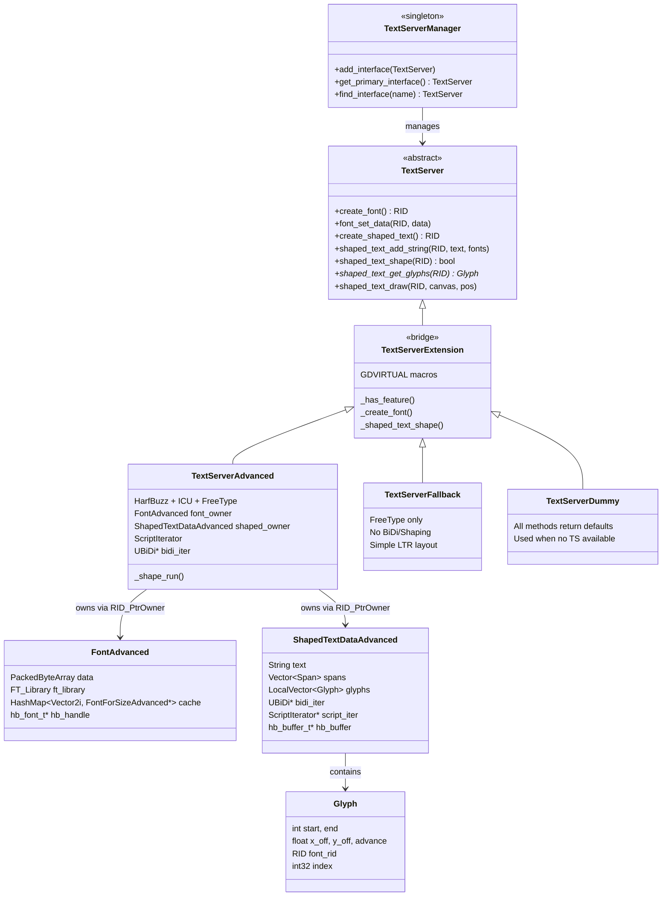

# 25. 文本渲染服务器 (Text Server) — Godot vs UE 源码深度对比

> **核心结论：Godot 将文本排版抽象为可插拔的 Server 接口，以 RID 句柄驱动全部操作；UE 则将字体/整形/缓存紧耦合在 Slate 框架内部，以 UObject 生态驱动。**

---

## 目录

- [第 1 章：模块概览 — "UE 程序员 30 秒速览"](#第-1-章模块概览--ue-程序员-30-秒速览)
- [第 2 章：架构对比 — "同一个问题，两种解法"](#第-2-章架构对比--同一个问题两种解法)
- [第 3 章：核心实现对比 — "代码层面的差异"](#第-3-章核心实现对比--代码层面的差异)
- [第 4 章：UE → Godot 迁移指南](#第-4-章ue--godot-迁移指南)
- [第 5 章：性能对比](#第-5-章性能对比)
- [第 6 章：总结 — "一句话记住"](#第-6-章总结--一句话记住)

---

## 第 1 章：模块概览 — "UE 程序员 30 秒速览"

### 一句话说明

Godot 的 **TextServer** 模块是一个完全抽象的文本排版服务层，负责字体加载、字形光栅化、复杂文本整形（HarfBuzz）、双向文本（BiDi/ICU）和断行算法。它对应 UE 中 **SlateCore 模块下的 FSlateFontCache + FSlateTextShaper + FSlateFontRenderer** 整个字体渲染管线。

### 核心类/结构体列表

| # | Godot 类/结构体 | 源码位置 | 职责 | UE 对应物 |
|---|---|---|---|---|
| 1 | `TextServer` | `servers/text/text_server.h` | 文本服务抽象基类，定义全部纯虚接口 | `FSlateFontCache`（入口）+ `FSlateTextShaper` |
| 2 | `TextServerManager` | `servers/text/text_server.h` | 管理多个 TextServer 实现的单例 | 无直接对应，UE 硬编码使用 Slate |
| 3 | `TextServerExtension` | `servers/text/text_server_extension.h` | GDExtension 桥接层，GDVIRTUAL 宏映射 | 无对应，UE 不支持插件化文本服务 |
| 4 | `TextServerAdvanced` | `modules/text_server_adv/text_server_adv.h` | 完整实现：HarfBuzz + ICU + FreeType | `FSlateTextShaper` + `FSlateFontRenderer` |
| 5 | `TextServerFallback` | `modules/text_server_fb/text_server_fb.h` | 精简实现：仅 FreeType，无 BiDi/整形 | `FSlateFontRenderer`（KerningOnly 模式）|
| 6 | `TextServerDummy` | `servers/text/text_server_dummy.h` | 空实现，所有方法返回默认值 | 无对应 |
| 7 | `Glyph` | `servers/text/text_server.h` | 单个字形数据（位置、advance、flags） | `FShapedGlyphEntry` |
| 8 | `CaretInfo` | `servers/text/text_server.h` | 光标位置信息（leading/trailing） | `FGlyphOffsetResult` |
| 9 | `ShapedTextDataAdvanced` | `modules/text_server_adv/text_server_adv.h` | 已整形文本缓冲区（含 BiDi、脚本迭代器） | `FShapedGlyphSequence` |
| 10 | `FontAdvanced` | `modules/text_server_adv/text_server_adv.h` | 字体数据容器（FreeType face、缓存） | `FFreeTypeFace` + `FCompositeFontCache` |
| 11 | `FontForSizeAdvanced` | `modules/text_server_adv/text_server_adv.h` | 特定尺寸的字体缓存（纹理图集、字形映射） | `FSlateFontCache` 的 atlas 部分 |
| 12 | `ScriptIterator` | `modules/text_server_adv/script_iterator.h` | Unicode 脚本分段迭代器 | ICU `UScriptRun`（UE 内部使用） |
| 13 | `ShelfPackTexture` | `modules/text_server_adv/text_server_adv.h` | 字形纹理图集（Shelf 装箱算法） | `FSlateFontAtlas`（纹理图集） |
| 14 | `FontPriorityList` | `modules/text_server_adv/text_server_adv.h` | 字体优先级列表（按脚本/语言排序） | `FCompositeFontCache::GetFontDataForCodepoint` |

### Godot vs UE 概念速查表

| 概念 | Godot | UE |
|---|---|---|
| 文本服务入口 | `TextServer`（抽象接口 + RID） | `FSlateFontCache`（具体类） |
| 字体资源句柄 | `RID`（通过 `create_font()` 创建） | `FSlateFontInfo` + `FFontData` |
| 文本整形 | `shaped_text_shape(RID)` | `FSlateFontCache::ShapeBidirectionalText()` |
| 整形结果 | `Glyph` 数组（通过 RID 访问） | `FShapedGlyphSequence`（共享指针） |
| HarfBuzz 集成 | `TextServerAdvanced` 内部直接调用 | `FSlateTextShaper::PerformHarfBuzzTextShaping()` |
| BiDi 支持 | ICU `ubidi_*` API（TextServerAdvanced） | ICU `TextBiDi::ITextBiDi` 接口 |
| 字体回退 | `FontPriorityList` + 系统字体查找 | `FCompositeFontCache` + `EFontFallback` |
| 字形缓存 | `FontForSizeAdvanced::glyph_map` | `FFreeTypeGlyphCache` + `FSlateFontCache` |
| 纹理图集 | `ShelfPackTexture`（Shelf 装箱） | `FSlateFontAtlas`（自定义装箱） |
| MSDF 字体 | 原生支持（`font_set_multichannel_signed_distance_field`） | 不原生支持，需第三方插件 |
| 可插拔实现 | ✅ `TextServerManager` 管理多实现 | ❌ 硬编码在 SlateCore 中 |
| GDExtension 支持 | ✅ `TextServerExtension` 桥接 | ❌ 无等价机制 |

---

## 第 2 章：架构对比 — "同一个问题，两种解法"

### 2.1 Godot 的架构设计

Godot 的文本渲染采用经典的 **Server 模式**——与 RenderingServer、PhysicsServer 等一脉相承。核心思想是：**所有文本操作都通过一个抽象接口进行，具体实现可以在运行时切换**。



**关键设计特征：**

1. **RID 驱动**：所有字体和文本缓冲区都通过 `RID`（Resource ID）句柄访问，内部由 `RID_PtrOwner` 管理生命周期。这与 Godot 的 RenderingServer 使用相同的模式。
2. **可插拔实现**：`TextServerManager` 单例管理多个 `TextServer` 实现，通过 `#define TS TextServerManager::get_singleton()->get_primary_interface()` 宏提供全局访问。
3. **模块化编译**：`TextServerAdvanced` 和 `TextServerFallback` 分别作为独立模块（`modules/text_server_adv/` 和 `modules/text_server_fb/`），可以在编译时选择性包含。

### 2.2 UE 的架构设计

UE 的文本渲染紧密嵌入在 **SlateCore** 框架中，采用分层缓存架构：

```
FSlateFontCache (顶层入口)
├── FCompositeFontCache (复合字体解析)
│   └── FCachedCompositeFontData (按 codepoint 查找子字体)
├── FSlateFontRenderer (FreeType 光栅化)
│   └── FFreeTypeFace (FT_Face 封装)
├── FSlateTextShaper (HarfBuzz 整形)
│   └── FHarfBuzzFontFactory (HB 字体创建)
├── FFreeTypeGlyphCache (字形数据缓存)
├── FFreeTypeAdvanceCache (advance 缓存)
├── FFreeTypeKerningPairCache (kerning 缓存)
└── FSlateFontAtlas (纹理图集)
```

**关键设计特征：**

1. **UObject 生态**：字体通过 `UFont` / `UFontFace` 资产管理，与 UE 的资产系统深度集成。
2. **双模式整形**：`ETextShapingMethod` 支持 `KerningOnly`（快速）和 `FullShaping`（HarfBuzz），可按文本方向自动选择。
3. **线程分离**：`FSlateFontCache` 区分游戏线程和渲染线程的缓存实例（`ESlateTextureAtlasThreadId`）。

### 2.3 关键架构差异分析

#### 差异 1：抽象层级 — 可插拔 vs 硬编码

Godot 的 `TextServer` 是一个**完全抽象的接口**，定义了约 200 个纯虚方法，涵盖字体管理、文本整形、绘制的全部操作。这种设计允许：
- 运行时切换文本服务实现（Advanced ↔ Fallback）
- 通过 GDExtension 提供第三方文本服务
- 在不同平台使用不同实现（如 Web 平台可用 Fallback 减小包体）

UE 的文本渲染则**硬编码在 SlateCore 中**。`FSlateFontCache` 直接持有 `FFreeTypeLibrary`、`FSlateTextShaper` 等具体实例，没有抽象接口层。唯一的"可选性"是 `ETextShapingMethod` 枚举控制是否使用 HarfBuzz。这种设计的 trade-off 是：更高的性能（无虚函数开销）但更低的灵活性。

**源码证据：**
- Godot: `servers/text/text_server.h` — `TextServer` 类约 200 个 `virtual ... = 0` 方法
- UE: `SlateCore/Private/Fonts/FontCache.h` — `FSlateFontCache` 直接持有 `TUniquePtr<FSlateTextShaper> TextShaper`

#### 差异 2：资源管理 — RID 句柄 vs UObject 引用

Godot 使用 `RID`（Resource ID）管理所有文本资源。字体通过 `create_font()` 创建返回 RID，文本缓冲区通过 `create_shaped_text()` 创建返回 RID。内部使用 `RID_PtrOwner<FontAdvanced>` 和 `RID_PtrOwner<ShapedTextDataAdvanced>` 进行所有权管理。这种模式：
- 避免了 GC 压力（RID 是轻量级整数句柄）
- 允许跨线程传递（RID 本身是值类型）
- 但需要手动调用 `free_rid()` 释放资源

UE 使用 `UFont` / `UFontFace` UObject 资产管理字体数据，整形结果通过 `FShapedGlyphSequenceRef`（`TSharedRef`）管理。这种模式：
- 与 UE 资产系统无缝集成（可在编辑器中预览、序列化）
- 自动 GC 管理生命周期
- 但 UObject 开销更大，且受 GC 暂停影响

**源码证据：**
- Godot: `text_server_adv.h` L1050 — `mutable RID_PtrOwner<FontAdvanced> font_owner;`
- UE: `FontCache.h` L700+ — `TMap<FSlateFontKey, TSharedRef<FCharacterList>> FontToCharacterListCache;`

#### 差异 3：模块耦合 — 松耦合模块 vs 紧耦合框架

Godot 的文本服务与渲染系统**松耦合**。`TextServer` 通过 `RID p_canvas` 参数与 RenderingServer 交互，但不直接依赖渲染实现。字体模块（`text_server_adv`、`text_server_fb`）作为独立编译单元，通过 `register_types.cpp` 注册到 `TextServerManager`。

UE 的文本渲染与 Slate 框架**紧耦合**。`FSlateFontCache` 直接管理 `ISlateFontTexture` 纹理资源，`FShapedGlyphSequence` 直接引用 `UObject* FontMaterial`。整个管线从字体加载到最终渲染都在 SlateCore 模块内完成。

**源码证据：**
- Godot: `modules/text_server_adv/register_types.cpp` — 独立模块注册
- UE: `FontCache.h` — `FSlateFontCache` 继承 `ISlateAtlasProvider`，直接管理纹理

---

## 第 3 章：核心实现对比 — "代码层面的差异"

### 3.1 文本整形管线（Text Shaping Pipeline）

#### Godot 的实现

Godot 的文本整形在 `TextServerAdvanced::_shaped_text_shape()` 中实现（`text_server_adv.cpp:7197`），流程如下：

1. **UTF-32 → UTF-16 转换**：`sd->utf16 = sd->text.utf16()`
2. **脚本分段**：创建 `ScriptIterator` 将文本按 Unicode 脚本分段
3. **BiDi 分析**：使用 ICU `ubidi_setPara()` + `ubidi_getVisualRun()` 获取双向文本运行
4. **三层嵌套循环**：BiDi 运行 → 脚本运行 → Span 运行
5. **HarfBuzz 整形**：在 `_shape_run()` 中调用 `hb_shape()` 进行实际整形
6. **字体回退**：通过 `FontPriorityList` 按优先级尝试字体，支持系统字体回退

```cpp
// Godot: text_server_adv.cpp:6810 - _shape_run() 核心整形逻辑
hb_buffer_clear_contents(p_sd->hb_buffer);
hb_buffer_set_direction(p_sd->hb_buffer, p_direction);
hb_buffer_set_script(p_sd->hb_buffer, p_script);
hb_buffer_set_language(p_sd->hb_buffer, lang);
hb_buffer_add_utf32(p_sd->hb_buffer, (const uint32_t *)p_sd->text.ptr(), 
                     p_sd->text.length(), p_start, p_end - p_start);

// 添加 OpenType 特性
Vector<hb_feature_t> ftrs;
_add_features(_font_get_opentype_feature_overrides(f), ftrs);
_add_features(p_sd->spans[p_span].features, ftrs);

// 执行整形
hb_shape(hb_font, p_sd->hb_buffer, ftrs.is_empty() ? nullptr : &ftrs[0], ftrs.size());
```

#### UE 的实现

UE 的文本整形在 `FSlateTextShaper` 中实现（`SlateTextShaper.h`），流程如下：

1. **BiDi 检测**：使用 `TextBiDi::ITextBiDi` 接口检测文本方向
2. **方向分段**：将文本按方向分为多个运行
3. **双模式整形**：
   - `KerningOnly`：仅使用 FreeType kerning，逐字符处理
   - `FullShaping`：使用 HarfBuzz 进行完整整形
4. **结果封装**：生成 `FShapedGlyphSequence` 共享对象

```cpp
// UE: SlateTextShaper.h - 整形入口
FShapedGlyphSequenceRef ShapeBidirectionalText(
    const TCHAR* InText, const int32 InTextStart, const int32 InTextLen,
    const FSlateFontInfo& InFontInfo, const float InFontScale,
    const TextBiDi::ETextDirection InBaseDirection,
    const ETextShapingMethod TextShapingMethod) const;

// 内部分为两条路径：
void PerformKerningOnlyTextShaping(...);   // 快速路径
void PerformHarfBuzzTextShaping(...);      // 完整路径
```

#### 差异点评

| 维度 | Godot | UE |
|---|---|---|
| 整形入口 | `shaped_text_shape(RID)` — 延迟整形 | `ShapeBidirectionalText()` — 即时整形 |
| BiDi 实现 | 直接调用 ICU `ubidi_*` API | 通过 `TextBiDi::ITextBiDi` 抽象接口 |
| 脚本分段 | 自定义 `ScriptIterator`（含 emoji 检测） | 依赖 HarfBuzz 内部处理 |
| 字体回退 | `FontPriorityList`（按脚本/语言优先级排序） | `FCompositeFontCache`（按 codepoint 范围查找） |
| 缓冲区复用 | `hb_buffer_t` 存储在 `ShapedTextDataAdvanced` 中复用 | 每次整形创建新 buffer |

**Godot 的优势**：三层嵌套循环（BiDi → Script → Span）确保了对复杂多语言文本的精确处理。`FontPriorityList` 的延迟排序策略（按需计算优先级）在大多数情况下避免了不必要的字体查找。

**UE 的优势**：双模式整形（`KerningOnly` / `FullShaping`）允许对简单文本（如纯英文 UI）使用快速路径，避免 HarfBuzz 开销。`Auto` 模式根据文本方向自动选择，是一个实用的性能优化。

### 3.2 字体管理与缓存

#### Godot 的实现

Godot 的字体数据存储在 `FontAdvanced` 结构体中（`text_server_adv.h`），采用**按需加载 + 尺寸缓存**策略：

```cpp
// Godot: text_server_adv.h - FontAdvanced 结构
struct FontAdvanced {
    Mutex mutex;                              // 线程安全
    PackedByteArray data;                     // 原始字体数据
    const uint8_t *data_ptr = nullptr;
    HashMap<Vector2i, FontForSizeAdvanced *> cache;  // 按 (size, outline) 缓存
    // ... 大量属性：antialiasing, hinting, msdf, variation_coordinates 等
};

struct FontForSizeAdvanced {
    Vector<ShelfPackTexture> textures;        // 字形纹理图集
    HashMap<int32_t, FontGlyph> glyph_map;   // 字形缓存
    HashMap<Vector2i, Vector2> kerning_map;   // kerning 缓存
    hb_font_t *hb_handle = nullptr;           // HarfBuzz 字体句柄
    FT_Face face = nullptr;                   // FreeType face
};
```

**关键特性：**
- **MSDF 支持**：原生支持多通道有符号距离场字体（`font_set_multichannel_signed_distance_field`），允许字体在任意缩放下保持清晰
- **Shelf 装箱算法**：`ShelfPackTexture` 使用 Shelf 算法将字形打包到纹理图集中
- **变体字体**：通过 `font_set_variation_coordinates()` 支持 OpenType 变体轴
- **链接变体**：`create_font_linked_variation()` 创建共享底层数据但有独立 spacing/baseline 的字体变体

#### UE 的实现

UE 的字体管理分散在多个类中：

```cpp
// UE: FontCacheFreeType.h - FFreeTypeFace
class FFreeTypeFace {
    FT_Face FTFace;
    FFontFaceDataConstPtr Memory;
    FFTStreamHandler FTStreamHandler;  // 支持流式加载
    TSet<FName> Attributes;
};

// UE: FontCacheCompositeFont.h - FCompositeFontCache
class FCompositeFontCache {
    TMap<const FCompositeFont*, TSharedPtr<FCachedCompositeFontData>> CompositeFontToCachedDataMap;
    TMap<FString, TSharedPtr<FFreeTypeFace>> FontFaceMap;
};

// UE: FontCache.h - FSlateFontCache
class FSlateFontCache {
    TUniquePtr<FFreeTypeLibrary> FTLibrary;
    TUniquePtr<FFreeTypeGlyphCache> FTGlyphCache;
    TUniquePtr<FFreeTypeAdvanceCache> FTAdvanceCache;
    TUniquePtr<FFreeTypeKerningPairCache> FTKerningPairCache;
    TUniquePtr<FCompositeFontCache> CompositeFontCache;
    TUniquePtr<FSlateFontRenderer> FontRenderer;
    TUniquePtr<FSlateTextShaper> TextShaper;
};
```

**关键特性：**
- **复合字体系统**：`FCompositeFont` 支持按 Unicode 范围指定不同子字体（类似 CSS `@font-face` 的 `unicode-range`）
- **多级缓存**：分别缓存字形数据（`FFreeTypeGlyphCache`）、advance（`FFreeTypeAdvanceCache`）、kerning（`FFreeTypeKerningPairCache`）
- **流式加载**：`FFreeTypeFace` 支持从磁盘流式读取字体数据，避免全部加载到内存
- **内存映射**：支持 `IMappedFileHandle` 内存映射字体文件

#### 差异点评

| 维度 | Godot | UE |
|---|---|---|
| 字体数据所有权 | `FontAdvanced` 持有 `PackedByteArray` | `FFreeTypeFace` 持有 `FFontFaceDataConstPtr` 或流式句柄 |
| 缓存粒度 | 按 `(size, outline_size)` 二维键缓存 | 按 `(face, glyph_index, load_flags, size, scale)` 五维键缓存 |
| 纹理图集 | Shelf 装箱，1024×1024 默认 | 自定义装箱，支持灰度/彩色分离 |
| MSDF | ✅ 原生支持 | ❌ 不原生支持 |
| 变体字体 | ✅ `font_set_variation_coordinates()` | ✅ 通过 FreeType MM 支持 |
| 流式加载 | ❌ 全量加载到内存 | ✅ `FFTStreamHandler` 流式读取 |
| 线程安全 | 每个 `FontAdvanced` 有独立 `Mutex` | 全局 `FCriticalSection` |

**Godot 的优势**：MSDF 原生支持是一个显著优势，特别适合需要动态缩放的游戏 UI。链接变体（`create_font_linked_variation`）允许高效共享字体数据。

**UE 的优势**：流式加载和内存映射对大型字体文件（如 CJK 字体）更友好。多级独立缓存（glyph/advance/kerning）允许更精细的缓存失效控制。

### 3.3 BiDi（双向文本）支持

#### Godot 的实现

Godot 在 `TextServerAdvanced::_shaped_text_shape()` 中直接使用 ICU 的 `ubidi_*` API：

```cpp
// Godot: text_server_adv.cpp:7290+ - BiDi 分析
UErrorCode err = U_ZERO_ERROR;
UBiDi *bidi_iter = ubidi_openSized(end - start, 0, &err);
if (U_SUCCESS(err)) {
    switch (static_cast<TextServer::Direction>(bidi_ranges[ov].z)) {
        case DIRECTION_LTR:
            ubidi_setPara(bidi_iter, data + start, end - start, UBIDI_LTR, nullptr, &err);
            break;
        case DIRECTION_RTL:
            ubidi_setPara(bidi_iter, data + start, end - start, UBIDI_RTL, nullptr, &err);
            break;
        case DIRECTION_AUTO: {
            UBiDiDirection direction = ubidi_getBaseDirection(data + start, end - start);
            // ... 自动检测方向
        } break;
    }
}
// 遍历视觉运行
int bidi_run_count = ubidi_countRuns(bidi_iter, &err);
for (int i = 0; i < bidi_run_count; i++) {
    ubidi_getVisualRun(bidi_iter, i, &_bidi_run_start, &_bidi_run_length);
    // ... 对每个运行进行脚本分段和整形
}
```

**关键特性：**
- 支持 `DIRECTION_AUTO`：自动检测段落方向
- 支持 `shaped_text_set_bidi_override()`：允许手动覆盖 BiDi 方向
- 支持结构化文本解析（`StructuredTextParser`）：URI、文件路径、邮件地址等特殊格式的 BiDi 处理

#### UE 的实现

UE 通过 `TextBiDi::ITextBiDi` 抽象接口处理 BiDi：

```cpp
// UE: SlateTextShaper.h
TUniquePtr<TextBiDi::ITextBiDi> TextBiDiDetection;

// 在 ShapeBidirectionalText 中使用
FShapedGlyphSequenceRef ShapeBidirectionalText(
    const TCHAR* InText, ...,
    const TextBiDi::ETextDirection InBaseDirection, ...);
```

UE 的 BiDi 实现也基于 ICU，但通过一个额外的抽象层 `ITextBiDi` 封装，支持平台特定实现。

#### 差异点评

Godot 的 BiDi 实现更加**直接和全面**。它不仅支持基本的 LTR/RTL 检测，还提供了 `StructuredTextParser` 用于处理特殊格式文本（如 URI 中的路径分隔符应保持 LTR 方向）。这在国际化应用中非常实用。

UE 的 BiDi 实现更加**模块化**，通过 `ITextBiDi` 接口允许平台特定实现，但功能上不如 Godot 丰富（缺少结构化文本解析）。

### 3.4 字形光栅化与绘制

#### Godot 的实现

Godot 的字形光栅化在 `_ensure_glyph()` 方法中完成，支持多种模式：

1. **标准光栅化**：使用 FreeType `FT_Load_Glyph` + `FT_Render_Glyph`
2. **MSDF 光栅化**：使用 msdfgen 库生成多通道有符号距离场
3. **SVG-in-OT**：通过 ThorVG 渲染 OpenType 字体中的 SVG 字形（如彩色 emoji）

绘制通过 `shaped_text_draw()` 完成（`text_server.cpp:1740`），直接调用 `RenderingServer` 的 canvas item API：

```cpp
// Godot: text_server.cpp:1740 - shaped_text_draw
void TextServer::shaped_text_draw(const RID &p_shaped, const RID &p_canvas, 
    const Vector2 &p_pos, ...) const {
    // 遍历字形数组
    const Glyph *glyphs = shaped_text_get_glyphs(p_shaped);
    for (int i = 0; i < gl_size; i++) {
        // 处理嵌入对象、RTL、裁剪等
        if (glyphs[i].font_rid != RID()) {
            font_draw_glyph(glyphs[i].font_rid, p_canvas, glyphs[i].font_size, 
                           ofs + Vector2(glyphs[i].x_off, glyphs[i].y_off), 
                           glyphs[i].index, p_color);
        } else {
            // 绘制 hex code box（未找到字形时的替代显示）
            draw_hex_code_box(p_canvas, glyphs[i].font_size, ofs, glyphs[i].index, p_color);
        }
    }
}
```

#### UE 的实现

UE 的字形光栅化在 `FSlateFontRenderer::GetRenderData()` 中完成：

```cpp
// UE: SlateFontRenderer.h
bool GetRenderData(const FShapedGlyphEntry& InShapedGlyph, 
                   const FFontOutlineSettings& InOutlineSettings, 
                   FCharacterRenderData& OutRenderData) const;
```

绘制通过 Slate 的批处理渲染管线完成，`FShapedGlyphSequence` 被传递给 `FSlateDrawElement::MakeShapedText()`。

#### 差异点评

| 维度 | Godot | UE |
|---|---|---|
| 光栅化模式 | 标准 + MSDF + SVG-in-OT | 标准 + 描边 |
| 描边支持 | `font_draw_glyph_outline()` | `FFontOutlineSettings` |
| LCD 子像素 | ✅ 支持 HRGB/HBGR/VRGB/VBGR | ❌ 不支持 |
| 彩色 emoji | ✅ SVG-in-OT（ThorVG） | ✅ 彩色位图字体 |
| 绘制管线 | 直接调用 RenderingServer canvas API | 通过 Slate 批处理渲染 |
| Hex code box | ✅ 内置未知字形替代显示 | ✅ 替代字符 `\uFFFD` |

---

## 第 4 章：UE → Godot 迁移指南

### 4.1 思维转换清单

1. **忘掉 UObject 字体资产，学习 RID 句柄模式**
   - UE 中字体是 `UFont` 资产，通过编辑器管理。Godot 中字体通过 `TS->create_font()` 创建 RID，通过 `TS->font_set_data()` 加载数据。在 GDScript 层面，通常使用 `FontFile` 资源类（它内部封装了 RID 操作）。

2. **忘掉 FSlateFontInfo 的声明式配置，学习 TextServer 的命令式 API**
   - UE 中通过 `FSlateFontInfo` 结构体声明字体属性（字体、大小、样式），然后传给 `FSlateFontCache`。Godot 中需要逐个调用 `font_set_antialiasing()`、`font_set_hinting()` 等方法配置字体属性。

3. **忘掉 FShapedGlyphSequence 的自动管理，学习 shaped text 的手动生命周期**
   - UE 中 `FShapedGlyphSequenceRef` 是共享指针，自动管理生命周期。Godot 中 shaped text 是 RID，需要手动 `free_rid()` 释放，或依赖 `TextServer` 的清理机制。

4. **忘掉 ETextShapingMethod 的双模式，学习 TextServer 的 Feature 查询**
   - UE 中通过 `ETextShapingMethod::KerningOnly` / `FullShaping` 选择整形模式。Godot 中通过 `TS->has_feature(FEATURE_SHAPING)` 查询当前 TextServer 是否支持整形，`TextServerFallback` 不支持整形。

5. **忘掉 Slate 的紧耦合渲染，学习 TextServer 的解耦绘制**
   - UE 中文本绘制与 Slate 渲染管线紧密耦合。Godot 中 `shaped_text_draw()` 接受一个 canvas RID 参数，与具体渲染实现解耦。

6. **学习 MSDF 字体的使用**
   - UE 没有原生 MSDF 支持。Godot 的 MSDF 字体允许单一尺寸的字体数据在任意缩放下保持清晰，特别适合 3D 空间中的文本渲染。

### 4.2 API 映射表

| UE API | Godot 等价 API | 说明 |
|---|---|---|
| `FSlateFontCache::ShapeBidirectionalText()` | `TS->create_shaped_text()` + `TS->shaped_text_add_string()` + `TS->shaped_text_shape()` | Godot 分步操作 |
| `FShapedGlyphSequence::GetMeasuredWidth()` | `TS->shaped_text_get_width(rid)` | 获取整形文本宽度 |
| `FShapedGlyphSequence::GetGlyphAtOffset()` | `TS->shaped_text_hit_test_position(rid, coords)` | 命中测试 |
| `FSlateFontCache::GetCharacterList()` | `TS->font_get_glyph_advance(font_rid, size, glyph)` | 获取字形信息 |
| `FSlateFontRenderer::GetMaxHeight()` | `TS->font_get_ascent(rid, size) + TS->font_get_descent(rid, size)` | 字体高度 |
| `FSlateFontRenderer::GetBaseline()` | `TS->font_get_ascent(rid, size)` | 基线位置 |
| `FSlateFontRenderer::GetKerning()` | `TS->font_get_kerning(rid, size, glyph_pair)` | kerning 值 |
| `FCompositeFontCache::GetFontDataForCodepoint()` | `TS->font_has_char(rid, char)` + 手动回退逻辑 | 字体回退 |
| `ETextShapingMethod::FullShaping` | `TextServerAdvanced`（默认） | 完整整形 |
| `ETextShapingMethod::KerningOnly` | `TextServerFallback` | 仅 kerning |
| `FFontOutlineSettings` | `TS->shaped_text_draw_outline(rid, canvas, pos, ..., outline_size)` | 描边绘制 |
| `FSlateFontInfo::FontObject` | `FontFile` 资源 / `TS->create_font()` | 字体资源 |
| `TextBiDi::ComputeBaseDirection()` | `TS->shaped_text_get_inferred_direction(rid)` | 方向检测 |

### 4.3 陷阱与误区

#### 陷阱 1：忘记整形步骤

UE 中调用 `ShapeBidirectionalText()` 一步完成整形。Godot 中必须按顺序调用：
```gdscript
# 正确流程
var ts = TextServerManager.get_singleton().get_primary_interface()
var buf = ts.create_shaped_text()
ts.shaped_text_add_string(buf, "Hello مرحبا", [font_rid], 16)
ts.shaped_text_shape(buf)  # 不要忘记这一步！
var glyphs = ts.shaped_text_get_glyphs(buf)
```

如果忘记调用 `shaped_text_shape()`，`shaped_text_get_glyphs()` 将返回空数组。

#### 陷阱 2：TextServerFallback 不支持 BiDi

如果项目使用 `TextServerFallback`（例如 Web 导出减小包体），所有 RTL 文本将显示为乱序。UE 程序员习惯了 BiDi 始终可用，但在 Godot 中需要检查：
```gdscript
if ts.has_feature(TextServer.FEATURE_BIDI_LAYOUT):
    # 可以安全使用 RTL 文本
```

#### 陷阱 3：RID 泄漏

UE 的 `FShapedGlyphSequenceRef` 是共享指针，自动释放。Godot 的 shaped text RID 需要手动释放：
```gdscript
var buf = ts.create_shaped_text()
# ... 使用 buf ...
ts.free_rid(buf)  # 必须手动释放！
```

在实际开发中，通常使用 `Label`、`RichTextLabel` 等高级节点，它们内部管理 RID 生命周期。但如果直接使用 TextServer API，必须注意释放。

#### 陷阱 4：字体尺寸单位差异

Godot 的 `font_get_ascent(rid, size)` 中 `size` 参数是像素大小。UE 的 `FSlateFontInfo::Size` 也是像素大小，但 FreeType 内部使用 26.6 定点数（1/64 像素）。Godot 在内部处理了这个转换（`_get_size()` 方法中 `p_size * 64`），但如果直接操作 FreeType face 需要注意。

### 4.4 最佳实践

1. **优先使用高级节点**：`Label`、`RichTextLabel`、`LineEdit` 等节点内部已经正确使用 TextServer API，包括整形、BiDi、断行等。只有在需要自定义文本渲染时才直接使用 TextServer。

2. **利用 MSDF 字体**：对于需要动态缩放的 UI 文本（如 3D 空间中的标签），使用 MSDF 字体可以避免为每个尺寸生成纹理图集。

3. **使用 `TS` 宏**：Godot 提供了 `#define TS TextServerManager::get_singleton()->get_primary_interface()` 宏（C++ 层面），在 GDScript 中使用 `TextServerManager.get_singleton().get_primary_interface()`。

4. **批量操作**：如果需要处理大量文本，可以复用 shaped text buffer（通过 `shaped_text_clear()` 清空后重新添加文本），避免频繁创建/销毁 RID。

---

## 第 5 章：性能对比

### 5.1 Godot 的性能特征

#### 优势

1. **MSDF 减少纹理内存**：MSDF 字体只需一个尺寸的纹理数据即可在任意缩放下渲染，大幅减少纹理图集数量。对于需要多种字号的 UI，这是显著的内存优化。

2. **延迟整形**：`shaped_text_shape()` 是显式调用，允许应用层控制整形时机。可以在加载屏幕或后台线程中预整形文本。

3. **Shelf 装箱效率**：`ShelfPackTexture` 的 Shelf 算法虽然简单，但对字形这种高度相近的矩形有很好的装箱效率。

#### 瓶颈

1. **虚函数开销**：`TextServer` 的约 200 个纯虚方法在高频调用时有虚函数表查找开销。虽然 `TextServerAdvanced` 使用 `MODBIND` 宏（最终展开为直接调用），但通过 GDScript 调用时仍有 Variant 转换开销。

2. **UTF-32 ↔ UTF-16 转换**：Godot 内部使用 UTF-32 字符串，但 ICU 和 HarfBuzz 需要 UTF-16/UTF-32 输入。`_convert_pos()` / `_convert_pos_inv()` 在每次整形时进行位置转换，对长文本有一定开销。

3. **单一 Mutex 锁**：`TextServerAdvanced` 使用 `_THREAD_SAFE_CLASS_` 宏（全局互斥锁），在多线程场景下可能成为瓶颈。虽然每个 `FontAdvanced` 和 `ShapedTextDataAdvanced` 有独立 Mutex，但顶层操作仍需获取全局锁。

4. **字体全量加载**：Godot 将字体数据完整加载到 `PackedByteArray` 中，对于大型 CJK 字体（如 Noto Sans CJK，约 16MB）会占用较多内存。

### 5.2 UE 的性能特征

#### 优势

1. **双模式整形**：`KerningOnly` 模式跳过 HarfBuzz，对简单 LTR 文本（如英文 UI）性能提升显著。`Auto` 模式根据文本方向自动选择，是一个实用的优化。

2. **多级缓存**：`FFreeTypeGlyphCache`、`FFreeTypeAdvanceCache`、`FFreeTypeKerningPairCache` 分别缓存不同粒度的数据，避免重复调用 FreeType。

3. **流式加载**：`FFreeTypeFace` 支持从磁盘流式读取字体数据，配合内存映射（`IMappedFileHandle`），大型字体文件不需要全部加载到内存。

4. **线程分离**：游戏线程和渲染线程各有独立的字体缓存实例，减少锁竞争。

#### 瓶颈

1. **无 MSDF 支持**：每个字号需要独立的纹理图集，多字号场景下纹理内存消耗大。

2. **GC 影响**：`UFont` 作为 UObject 受 GC 管理，GC 暂停可能影响字体加载时机。

3. **Slate 耦合**：文本渲染与 Slate 框架紧耦合，无法在非 Slate 上下文（如自定义渲染管线）中直接使用。

### 5.3 性能敏感场景建议

| 场景 | Godot 建议 | UE 对比 |
|---|---|---|
| 大量动态文本（如聊天窗口） | 复用 shaped text RID，避免频繁创建/销毁 | UE 的 `FShapedGlyphSequence` 自动管理 |
| 多语言 UI | 使用 `TextServerAdvanced`，确保 ICU 数据加载 | UE 默认包含 ICU 数据 |
| 3D 空间文本 | 使用 MSDF 字体，单一尺寸适配所有距离 | UE 需要为每个距离预生成字号 |
| 纯英文简单 UI | 可考虑 `TextServerFallback` 减小包体 | UE 的 `KerningOnly` 模式 |
| 大型 CJK 字体 | 注意内存占用，考虑字体子集化 | UE 支持流式加载，内存更友好 |
| 多线程文本处理 | 注意全局锁瓶颈，尽量在主线程整形 | UE 线程分离更好 |

---

## 第 6 章：总结 — "一句话记住"

### 核心差异

**Godot 用可插拔的 Server 接口 + RID 句柄实现文本服务的完全解耦；UE 用紧耦合的 Slate 框架 + UObject 生态实现高度集成的文本渲染。**

### 设计亮点（Godot 做得比 UE 好的地方）

1. **可插拔架构**：`TextServerManager` 允许运行时切换文本服务实现，支持 GDExtension 第三方扩展。这在 UE 中完全不可能——你无法替换 Slate 的文本渲染管线。

2. **MSDF 原生支持**：Godot 的 `font_set_multichannel_signed_distance_field()` 提供了开箱即用的 MSDF 字体支持，对 3D 文本和动态缩放 UI 是巨大优势。UE 需要第三方插件才能实现类似功能。

3. **结构化文本解析**：`StructuredTextParser` 支持 URI、文件路径、邮件地址等特殊格式的 BiDi 处理，这在国际化应用中非常实用。UE 没有等价功能。

4. **LCD 子像素渲染**：Godot 支持 HRGB/HBGR/VRGB/VBGR 四种 LCD 子像素布局，在桌面平台上可以提供更清晰的文本渲染。UE 不支持 LCD 子像素渲染。

5. **OpenType 特性暴露**：Godot 通过 `font_set_opentype_feature_overrides()` 和 `shaped_text_add_string()` 的 `p_opentype_features` 参数，允许精细控制 OpenType 特性（如连字、替代字形）。UE 的 HarfBuzz 整形使用默认特性，暴露程度较低。

### 设计短板（Godot 不如 UE 的地方）

1. **字体流式加载**：Godot 将字体数据全量加载到内存，对大型 CJK 字体不友好。UE 的 `FFreeTypeFace` 支持流式读取和内存映射。

2. **线程安全粒度**：Godot 的 `_THREAD_SAFE_CLASS_` 全局锁在多线程场景下可能成为瓶颈。UE 的线程分离（游戏线程/渲染线程各有独立缓存）更加高效。

3. **双模式整形**：UE 的 `KerningOnly` 快速路径对简单文本有显著性能优势。Godot 的 `TextServerFallback` 虽然类似，但需要在编译时选择，无法运行时按文本内容动态切换。

4. **资产系统集成**：UE 的 `UFont` / `UFontFace` 与编辑器资产系统深度集成，支持预览、热重载、引用追踪。Godot 的 `FontFile` 资源虽然也集成了编辑器，但底层 RID 管理对开发者不够透明。

5. **缓存精细度**：UE 的多级独立缓存（glyph/advance/kerning）允许更精细的缓存失效和内存控制。Godot 的 `FontForSizeAdvanced` 将所有缓存聚合在一起，失效时需要整体清除。

### UE 程序员的学习路径建议

1. **第一步：阅读 `servers/text/text_server.h`**（718 行）
   - 理解 `TextServer` 抽象接口的全部方法签名
   - 重点关注枚举定义（`Direction`、`Feature`、`GraphemeFlag` 等）
   - 理解 `Glyph` 和 `CaretInfo` 结构体

2. **第二步：阅读 `servers/text/text_server.cpp`** 中的默认实现
   - 重点关注 `shaped_text_draw()`（L1740）— 理解绘制流程
   - 关注 `shaped_text_get_line_breaks()`（L1024）— 理解断行算法
   - 关注 `shaped_text_get_carets()`（L1244）— 理解光标定位

3. **第三步：阅读 `modules/text_server_adv/text_server_adv.h`** 中的数据结构
   - 重点关注 `FontAdvanced`、`FontForSizeAdvanced`、`ShapedTextDataAdvanced`
   - 理解 `FontPriorityList` 的延迟排序策略

4. **第四步：阅读 `text_server_adv.cpp` 中的 `_shaped_text_shape()`**（L7197）
   - 这是整个模块最核心的函数，理解 BiDi → Script → Span 三层循环
   - 跟踪 `_shape_run()` 理解 HarfBuzz 调用细节

5. **第五步：对比阅读 `modules/text_server_fb/text_server_fb.h`**
   - 理解 Fallback 实现与 Advanced 实现的差异
   - 这有助于理解哪些功能是"高级"的，哪些是"基础"的

---

*报告生成时间：2026-04-08 | 基于 Godot 4.6 源码 | UE 对比基于 UE4 SlateCore 模块*
