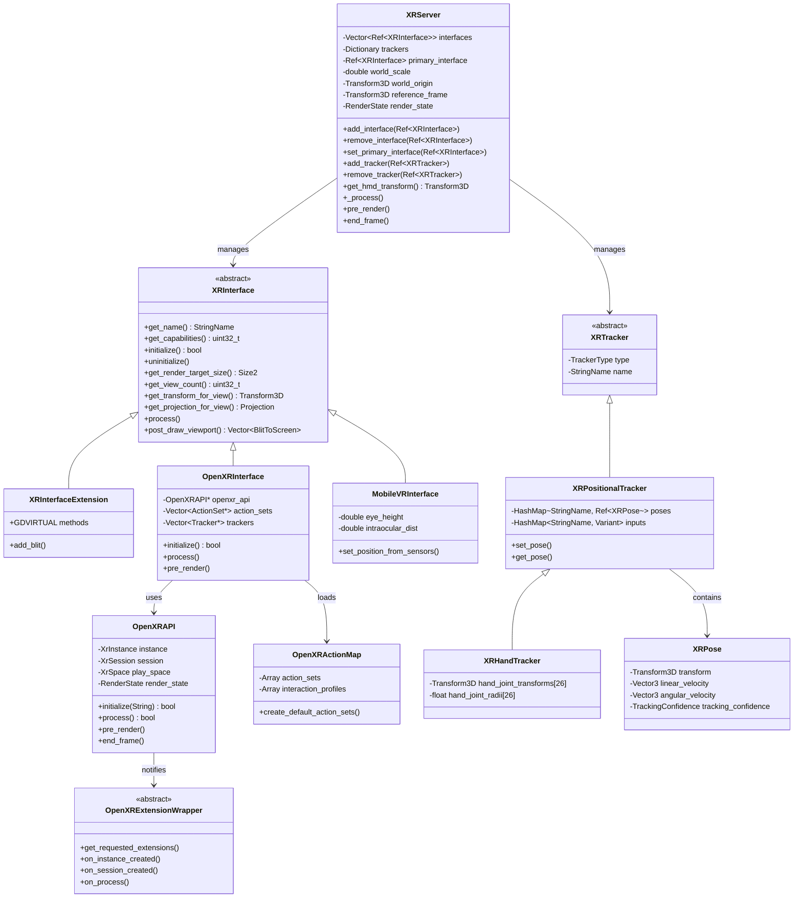

# 26. XR/VR 系统 (XR / VR System) — Godot vs UE 深度对比分析

> **核心结论**：Godot 用轻量级 RefCounted 接口 + 单例 Server 实现 XR 抽象，UE 用 IModularFeature 多接口组合模式；Godot 更简洁直接，UE 更灵活但复杂度高。

---

## 目录

- [第 1 章：模块概览 — "UE 程序员 30 秒速览"](#第-1-章模块概览--ue-程序员-30-秒速览)
- [第 2 章：架构对比 — "同一个问题，两种解法"](#第-2-章架构对比--同一个问题两种解法)
- [第 3 章：核心实现对比 — "代码层面的差异"](#第-3-章核心实现对比--代码层面的差异)
- [第 4 章：UE → Godot 迁移指南](#第-4-章ue--godot-迁移指南)
- [第 5 章：性能对比](#第-5-章性能对比)
- [第 6 章：总结 — "一句话记住"](#第-6-章总结--一句话记住)

---

## 第 1 章：模块概览 — "UE 程序员 30 秒速览"

### 一句话说明

Godot 的 XR 系统通过 `XRServer` 单例管理所有 XR 接口（如 OpenXR、MobileVR）和追踪器，对应 UE 的 `IXRTrackingSystem` + `IHeadMountedDisplay` + `IHeadMountedDisplayModule` 三层架构，但 Godot 将这三层合并为两层（Server + Interface），大幅降低了复杂度。

### 核心类/结构体列表

| # | Godot 类 | 源码路径 | 职责 | UE 对应物 |
|---|---------|---------|------|----------|
| 1 | `XRServer` | `servers/xr/xr_server.h` | XR 系统单例，管理接口和追踪器 | `IXRTrackingSystem` (单例获取) |
| 2 | `XRInterface` | `servers/xr/xr_interface.h` | XR 接口抽象基类 | `IHeadMountedDisplay` + `IXRTrackingSystem` |
| 3 | `XRInterfaceExtension` | `servers/xr/xr_interface_extension.h` | GDExtension 可扩展的 XR 接口 | `IHeadMountedDisplayModule::CreateTrackingSystem()` |
| 4 | `XRTracker` | `servers/xr/xr_tracker.h` | 追踪器基类 | `EXRTrackedDeviceType` + DeviceId 系统 |
| 5 | `XRPositionalTracker` | `servers/xr/xr_positional_tracker.h` | 位置追踪器（控制器、头显等） | `FXRMotionControllerData` |
| 6 | `XRHandTracker` | `servers/xr/xr_hand_tracker.h` | 手部追踪器 | `EHandKeypoint` + 手部追踪数据 |
| 7 | `XRPose` | `servers/xr/xr_pose.h` | 姿态数据（位置+旋转+速度+置信度） | `GetCurrentPose()` 返回的 FQuat+FVector |
| 8 | `OpenXRAPI` | `modules/openxr/openxr_api.h` | OpenXR 底层 API 封装 | UE OpenXR Plugin 内部实现 |
| 9 | `OpenXRInterface` | `modules/openxr/openxr_interface.h` | OpenXR 的 XRInterface 实现 | `FOpenXRHMD` (UE OpenXR Plugin) |
| 10 | `OpenXRActionMap` | `modules/openxr/action_map/openxr_action_map.h` | OpenXR Action Map 资源 | UE Enhanced Input + OpenXR Action 映射 |
| 11 | `OpenXRExtensionWrapper` | `modules/openxr/extensions/openxr_extension_wrapper.h` | OpenXR 扩展包装器基类 | UE OpenXR Extension Plugin 系统 |
| 12 | `MobileVRInterface` | `modules/mobile_vr/mobile_vr_interface.h` | 移动端 VR 接口（陀螺仪） | UE Google VR / 移动 XR 插件 |
| 13 | `XRVRS` | `servers/xr/xr_vrs.h` | 可变速率着色（VRS）支持 | UE VRS 通过 RHI 层实现 |
| 14 | `XRBodyTracker` | `servers/xr/xr_body_tracker.h` | 全身追踪器 | UE Body Tracking 扩展 |
| 15 | `XRFaceTracker` | `servers/xr/xr_face_tracker.h` | 面部追踪器 | UE Face Tracking 扩展 |

### Godot vs UE 概念速查表

| 概念 | Godot | UE | 备注 |
|------|-------|-----|------|
| XR 系统入口 | `XRServer` 单例 | `GEngine->XRSystem` (`IXRTrackingSystem*`) | Godot 用 Object 单例，UE 用裸指针 |
| XR 接口/驱动 | `XRInterface` (RefCounted) | `IHeadMountedDisplay` + `IXRTrackingSystem` | Godot 合二为一 |
| 接口注册 | `XRServer::add_interface()` | `IModularFeatures::RegisterModularFeature()` | Godot 显式注册，UE 用模块化特性系统 |
| 主接口选择 | `XRServer::set_primary_interface()` | `IHeadMountedDisplayModule::GetModulePriority()` | Godot 手动设置，UE 按优先级自动选择 |
| 设备追踪 | `XRTracker` + `XRPose` | `GetCurrentPose(DeviceId)` | Godot 用命名追踪器，UE 用整数 DeviceId |
| 追踪原点 | `XRServer::world_origin` | `IXRTrackingSystem::GetTrackingOrigin()` | Godot 用 Transform3D，UE 用枚举 (Floor/Eye/Stage) |
| 世界缩放 | `XRServer::world_scale` | `IXRTrackingSystem::GetWorldToMetersScale()` | 概念相同，API 风格不同 |
| 输入动作 | `OpenXRActionMap` (Resource) | Enhanced Input + OpenXR Action 映射 | Godot 用资源文件，UE 用资产 |
| Play Area | `XRInterface::PlayAreaMode` 枚举 | `EHMDTrackingOrigin::Type` | Godot 更细分（3DOF/Sitting/Roomscale/Stage） |
| 手部追踪 | `XRHandTracker` (26 关节) | `EHandKeypoint` (26 关节) | 关节数量和定义几乎一致 |
| 渲染集成 | `get_render_target_size()` / `post_draw_viewport()` | `IStereoRendering` 接口 | Godot 集成在 XRInterface 中，UE 独立接口 |
| 扩展系统 | `OpenXRExtensionWrapper` | UE OpenXR Extension Plugin | Godot 支持 GDExtension 扩展 |

---

## 第 2 章：架构对比 — "同一个问题，两种解法"

### 2.1 Godot 的架构设计

Godot 的 XR 系统采用经典的 **Server-Interface 模式**，这与 Godot 引擎其他子系统（RenderingServer、PhysicsServer 等）的设计哲学一致。



**核心设计要点**：
- `XRServer` 是全局单例（`#define XR XRServer`），管理所有 XR 接口和追踪器
- `XRInterface` 继承自 `RefCounted`，使用引用计数管理生命周期
- OpenXR 实现分为两层：`OpenXRInterface`（面向 Godot XR 框架）和 `OpenXRAPI`（面向 OpenXR SDK）
- 追踪器系统使用命名字典（`Dictionary trackers`），通过字符串名称索引

### 2.2 UE 对应模块的架构设计

UE 的 XR 系统采用 **多接口组合模式**，将 XR 功能拆分为多个独立接口：

```
IHeadMountedDisplayModule (插件入口)
    └── CreateTrackingSystem() → IXRTrackingSystem (追踪核心)
                                    ├── GetHMDDevice() → IHeadMountedDisplay (HMD 功能)
                                    ├── GetStereoRenderingDevice() → IStereoRendering (立体渲染)
                                    ├── GetXRInput() → IXRInput (输入)
                                    └── GetXRCamera() → IXRCamera (相机)
```

关键源码路径：
- `Engine/Source/Runtime/HeadMountedDisplay/Public/IXRTrackingSystem.h`
- `Engine/Source/Runtime/HeadMountedDisplay/Public/IHeadMountedDisplay.h`
- `Engine/Source/Runtime/HeadMountedDisplay/Public/IHeadMountedDisplayModule.h`
- `Engine/Source/Runtime/HeadMountedDisplay/Public/HeadMountedDisplayBase.h`

### 2.3 关键架构差异分析

#### 差异 1：接口粒度 — 单一接口 vs 接口组合

**Godot** 将所有 XR 功能集中在一个 `XRInterface` 抽象类中。这个类同时负责追踪、渲染、输入和设备管理。从 `servers/xr/xr_interface.h` 可以看到，`XRInterface` 包含了从 `get_capabilities()` 到 `get_render_target_size()` 到 `trigger_haptic_pulse()` 的所有方法。

**UE** 则将 XR 功能拆分为至少 5 个独立接口：`IXRTrackingSystem`（追踪）、`IHeadMountedDisplay`（HMD 设备）、`IStereoRendering`（立体渲染）、`IXRInput`（输入）、`IXRCamera`（相机）。每个接口可以独立实现和替换。

**Trade-off 分析**：Godot 的方式更简单直接，实现一个新的 XR 接口只需要继承一个类。但这也意味着如果你只想替换渲染部分而保留追踪部分，在 Godot 中做不到。UE 的组合模式更灵活，但增加了实现复杂度——`FHeadMountedDisplayBase` 需要同时继承 `FXRTrackingSystemBase`、`IHeadMountedDisplay` 和 `IStereoRendering` 三个类（见 `HeadMountedDisplayBase.h`），这在 C++ 中引入了多重继承的复杂性。

#### 差异 2：设备发现与注册 — 显式注册 vs 模块化特性

**Godot** 使用显式的注册模式。在 `modules/openxr/register_types.cpp` 中可以看到，OpenXR 接口在模块初始化时被创建并注册到 `XRServer`：

```cpp
// register_types.cpp (Godot)
openxr_interface.instantiate();
xr_server->add_interface(openxr_interface);
if (openxr_interface->initialize_on_startup()) {
    openxr_interface->initialize();
}
```

**UE** 使用 `IModularFeatures` 系统进行自动发现。`IHeadMountedDisplayModule` 在 `StartupModule()` 中自动注册为模块化特性，系统通过优先级排序自动选择最佳 HMD 模块（见 `IHeadMountedDisplayModule.h` 中的 `FCompareModulePriority`）。

**Trade-off 分析**：Godot 的显式注册更透明，开发者可以清楚地看到哪些接口被注册了。UE 的自动发现更适合插件生态——第三方 HMD 厂商只需要实现模块接口并设置优先级，无需修改引擎代码。但 UE 的方式也更难调试，因为接口选择是隐式的。

#### 差异 3：追踪器模型 — 命名对象 vs 整数 ID

**Godot** 的追踪器是完整的对象（`XRTracker` 继承自 `RefCounted`），通过字符串名称标识（如 `"/user/hand/left"`），存储在 `XRServer` 的 `Dictionary trackers` 中。每个追踪器可以持有多个命名的 `XRPose`（如 `"aim"`、`"grip"`），并且追踪器本身是类型化的（`XRPositionalTracker`、`XRHandTracker`、`XRBodyTracker` 等）。

**UE** 使用整数 `DeviceId` 标识设备（`HMDDeviceId = 0` 保留给头显），通过 `EnumerateTrackedDevices()` 枚举设备，通过 `GetCurrentPose(int32 DeviceId)` 获取姿态。设备类型通过 `EXRTrackedDeviceType` 枚举区分。

**Trade-off 分析**：Godot 的命名追踪器模型更具语义性，`"/user/hand/left"` 比 `DeviceId=1` 更易理解，且与 OpenXR 的路径系统天然对齐。UE 的整数 ID 模型更高效（哈希查找 vs 字典查找），但需要额外的映射层来关联设备语义。Godot 的方式在多追踪器场景下更直观，但在需要高频查询时可能有轻微的性能开销。

---

## 第 3 章：核心实现对比 — "代码层面的差异"

### 3.1 XR 系统初始化流程

#### Godot 怎么做的

Godot 的 XR 初始化分为三个阶段，在 `modules/openxr/register_types.cpp` 的 `initialize_openxr_module()` 中清晰可见：

**阶段 1 — 扩展注册**（`MODULE_INITIALIZATION_LEVEL_SERVERS`）：
```cpp
// register_types.cpp:150-180
OpenXRAPI::register_extension_wrapper(memnew(OpenXRPalmPoseExtension));
OpenXRAPI::register_extension_wrapper(memnew(OpenXRLocalFloorExtension));
OpenXRAPI::register_extension_wrapper(memnew(OpenXRHandTrackingExtension));
// ... 注册 20+ 个扩展包装器
```

**阶段 2 — OpenXR API 初始化**（同一阶段）：
```cpp
// register_types.cpp:240-260
openxr_api = memnew(OpenXRAPI);
if (!openxr_api->initialize(Main::get_rendering_driver_name())) {
    WARN_PRINT(init_error_message);
    memdelete(openxr_api);
    openxr_api = nullptr;
    return;
}
```

**阶段 3 — 接口注册**（`MODULE_INITIALIZATION_LEVEL_SCENE`）：
```cpp
// register_types.cpp:280-290
openxr_interface.instantiate();
xr_server->add_interface(openxr_interface);
if (openxr_interface->initialize_on_startup()) {
    openxr_interface->initialize();
}
```

关键特点：初始化失败时优雅降级（打印警告，回退到非 VR 模式），不会崩溃。

#### UE 怎么做的

UE 的初始化通过模块化特性系统自动完成：

```cpp
// IHeadMountedDisplayModule.h
virtual void StartupModule() override {
    IModularFeatures::Get().RegisterModularFeature(GetModularFeatureName(), this);
}

// 系统自动选择最高优先级的模块
static inline IHeadMountedDisplayModule& Get() {
    TArray<IHeadMountedDisplayModule*> HMDModules = 
        IModularFeatures::Get().GetModularFeatureImplementations<IHeadMountedDisplayModule>(GetModularFeatureName());
    HMDModules.Sort(FCompareModulePriority());
    return *HMDModules[0];
}
```

然后通过 `CreateTrackingSystem()` 工厂方法创建实际的追踪系统实例。

#### 差异点评

Godot 的初始化更加**显式和可控**——开发者可以精确控制哪些扩展被加载、何时初始化。UE 的方式更加**自动化**，适合大型插件生态，但调试初始化问题时更困难。Godot 的三阶段初始化（Core → Servers → Scene）确保了依赖关系的正确性，这是一个优秀的设计。

### 3.2 渲染线程安全

#### Godot 怎么做的

Godot 在 `XRServer` 和 `OpenXRAPI` 中都维护了独立的 `RenderState` 结构体，通过渲染服务器的命令队列实现线程安全的状态同步：

```cpp
// xr_server.h:100-105
struct RenderState {
    double world_scale = 1.0;
    Transform3D world_origin;
    Transform3D reference_frame;
} render_state;

// xr_server.h:115-120
_FORCE_INLINE_ void set_render_world_scale(double p_world_scale) {
    RenderingServer *rendering_server = RenderingServer::get_singleton();
    ERR_FAIL_NULL(rendering_server);
    rendering_server->call_on_render_thread(
        callable_mp_static(&XRServer::_set_render_world_scale).bind(p_world_scale));
}
```

`OpenXRAPI` 中有更复杂的渲染状态（`openxr_api.h:400-430`）：
```cpp
struct RenderState {
    bool running = false;
    bool should_render = false;
    XrTime predicted_display_time = 0;
    XrSpace play_space = XR_NULL_HANDLE;
    LocalVector<XrView> views;
    LocalVector<XrCompositionLayerProjectionView> projection_views;
    // ...
} render_state;
```

所有渲染状态的更新都通过 `call_on_render_thread()` 延迟到渲染线程执行，避免了主线程和渲染线程之间的竞争条件。

#### UE 怎么做的

UE 使用 Late Update 机制和渲染线程回调：

```cpp
// IXRTrackingSystem.h
virtual bool DoesSupportLateUpdate() const { return true; }
virtual void OnBeginRendering_RenderThread(FRHICommandListImmediate& RHICmdList, 
                                            FSceneViewFamily& ViewFamily) {}
virtual void OnLateUpdateApplied_RenderThread(const FTransform& NewRelativeTransform) {}
```

UE 的 Late Update 系统在渲染线程开始渲染前更新追踪数据，减少运动到光子的延迟。这通过 `FLateUpdateManager` 实现，在场景组件树上应用最新的追踪变换。

#### 差异点评

两种方案都正确处理了多线程问题，但策略不同。Godot 使用**显式的状态复制**（RenderState 结构体），通过命令队列同步。UE 使用 **Late Update 模式**，在渲染线程直接更新场景组件变换。UE 的 Late Update 能提供更低的运动到光子延迟（motion-to-photon latency），这对 VR 体验至关重要。Godot 的方式更简单安全，但可能在延迟方面略逊一筹。

### 3.3 OpenXR 扩展系统

#### Godot 怎么做的

Godot 设计了一个优雅的 `OpenXRExtensionWrapper` 基类（`modules/openxr/extensions/openxr_extension_wrapper.h`），支持通过 C++ 和 GDExtension 两种方式扩展 OpenXR 功能：

```cpp
// openxr_extension_wrapper.h
class OpenXRExtensionWrapper : public Object {
    GDCLASS(OpenXRExtensionWrapper, Object);
public:
    // 请求 OpenXR 扩展
    virtual HashMap<String, bool *> get_requested_extensions(XrVersion p_xr_version);
    
    // 链式结构体注入（OpenXR pNext 链）
    virtual void *set_system_properties_and_get_next_pointer(void *p_next_pointer);
    virtual void *set_instance_create_info_and_get_next_pointer(XrVersion p_xr_version, void *p_next_pointer);
    virtual void *set_session_create_and_get_next_pointer(void *p_next_pointer);
    
    // 生命周期回调
    virtual void on_instance_created(const XrInstance p_instance);
    virtual void on_session_created(const XrSession p_session);
    virtual void on_process();
    virtual void on_pre_render();
    
    // 状态机回调
    virtual void on_state_ready();
    virtual void on_state_focused();
    virtual void on_state_stopping();
    
    // GDExtension 虚函数
    GDVIRTUAL1R(Dictionary, _get_requested_extensions, uint64_t);
    GDVIRTUAL1(_on_instance_created, uint64_t);
    // ...
};
```

关键设计：每个扩展通过 `set_*_and_get_next_pointer()` 方法向 OpenXR 的 `pNext` 链中注入自定义结构体，这完美映射了 OpenXR 的扩展机制。

Godot 内置了大量扩展包装器（在 `register_types.cpp` 中注册）：
- 控制器支持：HTC、Valve Index、WMR、Pico、Meta、Huawei、ML2
- 功能扩展：手部追踪、眼球追踪、手部交互、性能设置
- 渲染扩展：合成层、深度缓冲、可见性遮罩、帧合成
- 空间实体：空间锚点、平面追踪、标记追踪

#### UE 怎么做的

UE 的 OpenXR 扩展通过插件系统实现。UE 4.x 版本中 OpenXR 支持作为引擎插件存在，扩展通过 `IModularFeature` 注册。UE 的 XR 框架本身不直接暴露 OpenXR 的 pNext 链机制，而是通过更高层的抽象（如 `IXRTrackingSystem` 的虚函数）来支持扩展功能。

UE 的 `IHeadMountedDisplayModule` 提供了插件发现机制（`IHeadMountedDisplayModule.h`）：
```cpp
virtual FString GetModuleKeyName() const = 0;
virtual float GetModulePriority() const;
virtual TSharedPtr<class IXRTrackingSystem, ESPMode::ThreadSafe> CreateTrackingSystem() = 0;
```

#### 差异点评

Godot 的 `OpenXRExtensionWrapper` 是一个**出色的设计**，它直接映射了 OpenXR 规范的扩展模型（pNext 链、生命周期回调），使得添加新的 OpenXR 扩展非常自然。更重要的是，它支持 GDExtension，意味着第三方开发者可以用 GDScript 或 C# 编写 OpenXR 扩展，这在 UE 中是不可能的。UE 的方式更加封装，隐藏了 OpenXR 的底层细节，但也限制了扩展的灵活性。

### 3.4 Action Map 与输入系统

#### Godot 怎么做的

Godot 将 OpenXR 的 Action 系统封装为 Godot 资源（Resource）系统：

```cpp
// openxr_action_map.h
class OpenXRActionMap : public Resource {
    GDCLASS(OpenXRActionMap, Resource);
private:
    Array action_sets;
    Array interaction_profiles;
public:
    void create_default_action_sets();  // 创建运行时默认动作集
    void create_editor_action_sets();   // 创建编辑器动作集
    Ref<OpenXRAction> get_action(const String &p_path) const;
};
```

Action Map 作为 `.tres` 资源文件存储，可以在编辑器中可视化编辑。`OpenXRInterface` 在初始化时加载 Action Map 并创建对应的 OpenXR Action、ActionSet 和 InteractionProfile：

```cpp
// openxr_interface.h 中的内部结构
struct Action {
    String action_name;
    OpenXRAction::ActionType action_type;
    RID action_rid;  // OpenXR API 中的 RID
};
struct ActionSet {
    String action_set_name;
    bool is_active;
    Vector<Action *> actions;
    RID action_set_rid;
};
struct Tracker {
    String tracker_name;
    Vector<Action *> actions;
    Ref<XRControllerTracker> controller_tracker;
    RID tracker_rid;
    RID interaction_profile;
};
```

`OpenXRAPI` 使用 `RID_Owner` 管理底层 OpenXR 资源（`openxr_api.h:350-400`），这与 Godot 渲染服务器的资源管理方式一致。

#### UE 怎么做的

UE 使用 Enhanced Input 系统处理 XR 输入，OpenXR Action 映射通过 `UInputAction` 和 `UInputMappingContext` 资产管理。UE 的 `IXRInput` 接口（`IXRTrackingSystem::GetXRInput()`）提供了 XR 特定的输入访问。

运动控制器数据通过 `GetMotionControllerData()` 获取（`IXRTrackingSystem.h`）：
```cpp
virtual void GetMotionControllerData(UObject* WorldContext, 
    const EControllerHand Hand, 
    FXRMotionControllerData& MotionControllerData) = 0;
```

#### 差异点评

Godot 的 Action Map 资源系统是一个**非常优雅的设计**。它将 OpenXR 的 Action 概念直接映射为 Godot 的 Resource，可以序列化、在编辑器中编辑、在运行时动态加载。这比 UE 的方式更加直观——UE 需要在 Enhanced Input 和 OpenXR Action 之间建立映射层，增加了复杂度。

Godot 使用 `RID_Owner` 管理 OpenXR 底层资源（Action、ActionSet、Tracker、InteractionProfile），这是一个高效的设计，避免了频繁的堆分配，同时提供了类型安全的资源句柄。

### 3.5 世界坐标与参考帧管理

#### Godot 怎么做的

`XRServer` 维护三个关键变换（`xr_server.h:90-100`）：

```cpp
double world_scale = 1.0;           // 世界缩放
Transform3D world_origin;           // 虚拟世界原点 → 真实世界追踪原点的映射
Transform3D reference_frame;        // 参考帧（用于 center_on_hmd）
```

`center_on_hmd()` 方法允许重置参考帧，支持三种模式（`RotationMode` 枚举）：
- `RESET_FULL_ROTATION`：完全重置旋转
- `RESET_BUT_KEEP_TILT`：重置但保留倾斜
- `DONT_RESET_ROTATION`：只重置位置

这些状态通过 `RenderState` 结构体同步到渲染线程。

#### UE 怎么做的

UE 使用 `EHMDTrackingOrigin::Type` 枚举（`HeadMountedDisplayTypes.h`）：
```cpp
namespace EHMDTrackingOrigin {
    enum Type {
        Floor,      // 地板级别
        Eye,        // 眼睛级别
        Stage,      // 舞台（以游玩区域为中心）
        Unbounded   // 无界（以观察者为中心）
    };
}
```

通过 `SetTrackingOrigin()` / `GetTrackingOrigin()` 设置，`GetTrackingToWorldTransform()` 获取追踪到世界的变换，`GetWorldToMetersScale()` 获取世界缩放。

重置通过 `ResetOrientationAndPosition(float Yaw)` 实现。

#### 差异点评

Godot 的方式更加灵活——直接暴露 `Transform3D` 让开发者完全控制世界原点和参考帧。UE 的枚举方式更加安全，但灵活性较低。Godot 的 `world_origin` 概念与场景树中的 `XROrigin3D` 节点配合使用，提供了直观的空间管理方式。UE 的 `GetTrackingToWorldTransform()` 提供了类似的功能，但需要开发者自己管理变换链。

---

## 第 4 章：UE → Godot 迁移指南

### 4.1 思维转换清单

#### 1. 忘掉多接口组合，拥抱单一 XRInterface

在 UE 中，你习惯了 `IXRTrackingSystem`、`IHeadMountedDisplay`、`IStereoRendering`、`IXRInput` 等多个接口的组合。在 Godot 中，**一个 `XRInterface` 就是一切**。不需要查询 `GetHMDDevice()`、`GetStereoRenderingDevice()` 等——所有功能都在同一个接口对象上。

#### 2. 忘掉 DeviceId 整数，使用命名追踪器

UE 中你用 `GetCurrentPose(0)` 获取头显姿态，`GetCurrentPose(1)` 获取控制器。在 Godot 中，使用 `XRServer.get_tracker("/user/hand/left")` 获取左手追踪器，然后通过 `tracker.get_pose("aim")` 获取特定姿态。这更加语义化，但需要适应字符串路径的方式。

#### 3. 忘掉 Late Update，理解 RenderState 同步

UE 的 Late Update 在渲染线程直接更新场景组件变换。Godot 使用 `RenderState` 结构体 + `call_on_render_thread()` 命令队列。你不需要手动处理这些——`XRServer` 和 `OpenXRAPI` 已经封装好了。但理解这个机制有助于调试渲染延迟问题。

#### 4. 忘掉 IModularFeature 自动发现，使用显式注册

在 UE 中，HMD 插件通过模块化特性系统自动发现和优先级排序。在 Godot 中，你需要显式调用 `XRServer.add_interface()` 注册接口，并通过 `XRServer.set_primary_interface()` 设置主接口。如果你在开发自定义 XR 接口，使用 `XRInterfaceExtension` 基类。

#### 5. 忘掉 Blueprint 蓝图节点，使用 XR 场景节点

UE 中你通过 `UHeadMountedDisplayFunctionLibrary` 蓝图函数库访问 XR 功能。在 Godot 中，使用场景树中的 `XROrigin3D`、`XRCamera3D`、`XRController3D` 节点。这些节点自动从 `XRServer` 获取追踪数据并更新变换。

#### 6. 忘掉 Enhanced Input 映射，使用 OpenXR Action Map 资源

UE 中 XR 输入通过 Enhanced Input 的 `UInputAction` + `UInputMappingContext` 管理。Godot 中使用 `OpenXRActionMap` 资源（`.tres` 文件），在编辑器中可视化编辑 Action Set、Action 和 Interaction Profile 绑定。

#### 7. 重新学习 RefCounted 生命周期

UE 中 XR 系统对象由引擎管理生命周期（`TSharedPtr<IXRTrackingSystem, ESPMode::ThreadSafe>`）。Godot 中 `XRInterface` 和 `XRTracker` 都继承自 `RefCounted`，使用引用计数自动管理。不需要手动 `delete`，但要注意循环引用。

### 4.2 API 映射表

| UE API | Godot 等价 API | 备注 |
|--------|---------------|------|
| `GEngine->XRSystem` | `XRServer::get_singleton()` | 全局 XR 入口 |
| `IXRTrackingSystem::GetCurrentPose(DeviceId)` | `XRServer::get_tracker(name)->get_pose(action)` | Godot 用命名追踪器 |
| `IXRTrackingSystem::GetWorldToMetersScale()` | `XRServer::get_world_scale()` | 世界缩放 |
| `IXRTrackingSystem::SetTrackingOrigin(Type)` | `XRInterface::set_play_area_mode(mode)` | 追踪原点模式 |
| `IXRTrackingSystem::ResetOrientationAndPosition()` | `XRServer::center_on_hmd(mode, keep_height)` | 重置参考帧 |
| `IXRTrackingSystem::GetTrackingToWorldTransform()` | `XRServer::get_world_origin()` | 追踪到世界变换 |
| `IXRTrackingSystem::EnumerateTrackedDevices()` | `XRServer::get_trackers(type_mask)` | 枚举设备 |
| `IHeadMountedDisplay::GetIdealRenderTargetSize()` | `XRInterface::get_render_target_size()` | 渲染目标尺寸 |
| `IHeadMountedDisplay::IsHMDConnected()` | `XRInterface::is_initialized()` | HMD 连接状态 |
| `IHeadMountedDisplay::SetPixelDensity()` | `OpenXRInterface::set_render_target_size_multiplier()` | 像素密度 |
| `IStereoRendering::GetDesiredNumberOfViews()` | `XRInterface::get_view_count()` | 视图数量 |
| `IXRTrackingSystem::GetRelativeEyePose()` | `XRInterface::get_transform_for_view(view, cam)` | 眼睛相对姿态 |
| `IXRInput::GetMotionControllerData()` | `XRPositionalTracker::get_pose("grip")` | 控制器数据 |
| `EHandKeypoint` 枚举 | `XRHandTracker::HandJoint` 枚举 | 手部关节（26 个，一一对应） |
| `IHeadMountedDisplayModule::CreateTrackingSystem()` | `XRInterfaceExtension` + `XRServer::add_interface()` | 创建自定义 XR 系统 |
| `UHeadMountedDisplayFunctionLibrary::SetSpectatorScreenMode()` | 无直接等价（通过 `post_draw_viewport()` 自定义） | 旁观者屏幕 |

### 4.3 陷阱与误区

#### 陷阱 1：不要在渲染线程直接访问 XRServer 主线程状态

在 UE 中，`GetCurrentPose()` 被设计为可以从游戏线程和渲染线程调用。但在 Godot 中，`XRServer` 的主线程状态（`world_scale`、`world_origin`）和渲染线程状态（`render_state`）是分离的。如果你在自定义渲染代码中需要 XR 数据，必须使用 `render_state` 中的副本，而不是直接读取主线程变量。

```cpp
// 错误：在渲染线程直接读取主线程状态
double scale = XRServer::get_singleton()->get_world_scale(); // 线程不安全！

// 正确：使用 render_state（内部已通过 call_on_render_thread 同步）
// Godot 内部已经处理了这个问题，但自定义代码需要注意
```

#### 陷阱 2：XRInterface 是 RefCounted，不是 Object 单例

UE 程序员习惯了 `GEngine->XRSystem` 这种全局指针。在 Godot 中，`XRInterface` 是 `RefCounted` 对象，通过 `Ref<XRInterface>` 持有。不要尝试用 `Object::cast_to<>()` 直接转换——使用 `XRServer::get_primary_interface()` 获取当前活跃的接口。

```gdscript
# 正确方式
var xr_interface = XRServer.find_interface("OpenXR")
if xr_interface:
    xr_interface.initialize()
    get_viewport().use_xr = true
```

#### 陷阱 3：Action Map 必须在初始化前配置

在 UE 中，Enhanced Input 的映射可以在运行时动态修改。但 Godot 的 OpenXR Action Map 在 `OpenXRInterface::initialize()` 时被加载并提交给 OpenXR Runtime（通过 `xrAttachSessionActionSets`）。一旦 Action Set 被 attach，就不能再修改。如果需要动态切换输入映射，使用 `set_action_set_active()` 来启用/禁用不同的 Action Set。

#### 陷阱 4：Godot 的坐标系与 UE 不同

Godot 使用右手坐标系（Y 轴向上），UE 使用左手坐标系（Z 轴向上）。在迁移 XR 相关的变换计算时，需要注意坐标轴的转换。OpenXR 本身使用右手坐标系，所以 Godot 的坐标系与 OpenXR 更加一致，而 UE 需要额外的坐标转换层。

### 4.4 最佳实践

#### 使用场景节点而非直接 API 调用

Godot 的 XR 最佳实践是使用场景节点：

```
XROrigin3D (追踪原点)
├── XRCamera3D (头显)
├── XRController3D (左手, tracker="left_hand")
│   └── MeshInstance3D (控制器模型)
├── XRController3D (右手, tracker="right_hand")
│   └── MeshInstance3D (控制器模型)
└── ... 其他追踪对象
```

这些节点自动从 `XRServer` 获取追踪数据，无需手动轮询。这比 UE 中需要在 Tick 中调用 `GetMotionControllerData()` 更加简洁。

#### 利用 OpenXR Extension Wrapper 扩展功能

如果需要支持特定硬件功能（如 Meta Quest 的 Passthrough），创建自定义 `OpenXRExtensionWrapper`：

```gdscript
# 通过 GDExtension 创建自定义 OpenXR 扩展
extends OpenXRExtensionWrapper

func _get_requested_extensions(xr_version: int) -> Dictionary:
    return {"XR_FB_passthrough": null}  # null 表示必需

func _on_instance_created(instance: int) -> void:
    # 初始化扩展功能
    pass
```

---

## 第 5 章：性能对比

### 5.1 Godot XR 系统的性能特征

#### 追踪数据查询开销

Godot 的追踪器使用 `Dictionary`（哈希表）存储，通过 `StringName` 键查询。`StringName` 在 Godot 中是内部化的字符串，比较操作是 O(1)（指针比较），所以查询开销很低。但相比 UE 的整数 DeviceId 直接索引，仍有轻微的哈希查找开销。

`XRPose` 使用 `HashMap<StringName, Ref<XRPose>>` 存储在 `XRPositionalTracker` 中。每次获取姿态需要一次哈希查找 + 引用计数操作。在高频查询场景（如每帧查询多个关节的手部追踪），这个开销可能累积。

#### 渲染管线集成

Godot 的 XR 渲染通过 `post_draw_viewport()` 返回 `Vector<BlitToScreen>` 来指定如何将渲染结果 blit 到屏幕。这个设计简单但有效。OpenXR 的 swapchain 管理在 `OpenXRAPI::OpenXRSwapChainInfo` 中实现，使用延迟释放队列（`free_queue`）避免在渲染帧中间释放资源。

#### 内存管理

- `XRInterface` 和 `XRTracker` 使用 `RefCounted`，引用计数管理，无 GC 暂停
- `OpenXRAPI` 使用 `RID_Owner` 管理底层 OpenXR 资源，这是一个高效的 slab 分配器
- 扩展包装器使用 `memnew`/`memdelete` 手动管理，在模块卸载时统一清理

#### 线程模型

Godot 的 XR 系统主要在两个线程上运行：
1. **主线程**：`XRServer::_process()` → `XRInterface::process()`（控制器数据更新）
2. **渲染线程**：`XRServer::pre_render()` → `XRInterface::pre_render()`（姿态预测）→ `post_draw_viewport()`（帧提交）

状态同步通过 `RenderingServer::call_on_render_thread()` 实现，这是一个无锁的命令队列。

### 5.2 与 UE 的性能差异

| 性能维度 | Godot | UE | 分析 |
|---------|-------|-----|------|
| 追踪查询延迟 | 哈希查找 (~50ns) | 数组索引 (~5ns) | UE 更快，但差异在 XR 场景中可忽略 |
| 运动到光子延迟 | RenderState 同步 | Late Update 直接更新 | UE 的 Late Update 可能提供更低延迟 |
| 内存占用 | 轻量（RefCounted + RID） | 较重（UObject 反射 + GC） | Godot 更轻量 |
| 扩展加载 | 编译时静态注册 | 运行时插件加载 | Godot 启动更快，UE 更灵活 |
| 手部追踪 | 26 关节 × 固定数组 | 26 关节 × TArray | Godot 用固定数组更高效 |
| Action 同步 | 每帧批量同步 | 每帧批量同步 | 基本相同 |

### 5.3 性能敏感场景建议

#### 1. 减少追踪器查询频率

如果你的游戏逻辑不需要每帧更新所有追踪器数据，可以降低查询频率：

```gdscript
# 不要每帧查询所有追踪器
# 只在需要时查询特定追踪器
var left_hand = XRServer.get_tracker("left_hand")
if left_hand:
    var aim_pose = left_hand.get_pose("aim")
```

#### 2. 利用 VRS 降低渲染开销

Godot 内置了 `XRVRS` 支持（`servers/xr/xr_vrs.h`），OpenXR 接口通过 `get_vrs_texture()` 提供 VRS 纹理。启用 VRS 可以显著降低 XR 渲染的 GPU 开销，特别是在移动 VR 平台上。

```gdscript
# OpenXR 接口的 VRS 设置
var xr = XRServer.find_interface("OpenXR") as OpenXRInterface
xr.vrs_min_radius = 0.5  # 中心区域保持全分辨率
xr.vrs_strength = 1.0     # VRS 强度
```

#### 3. 注意 Foveation 设置

OpenXR 接口支持固定注视点渲染（Fixed Foveated Rendering）：

```gdscript
var xr = XRServer.find_interface("OpenXR") as OpenXRInterface
if xr.is_foveation_supported():
    xr.foveation_level = 3      # 0-3，越高越激进
    xr.foveation_dynamic = true  # 动态调整
```

#### 4. 渲染目标尺寸优化

通过 `render_target_size_multiplier` 控制渲染分辨率：

```gdscript
var xr = XRServer.find_interface("OpenXR") as OpenXRInterface
xr.render_target_size_multiplier = 0.8  # 降低到 80% 分辨率
```

---

## 第 6 章：总结 — "一句话记住"

### 核心差异一句话

**Godot 的 XR 系统是"一个 Server + 一个 Interface = 全部功能"的极简设计，UE 是"多接口组合 + 模块化特性 + Late Update"的企业级架构。**

### 设计亮点（Godot 做得比 UE 好的地方）

1. **OpenXR Extension Wrapper 设计**：`OpenXRExtensionWrapper` 完美映射了 OpenXR 规范的扩展模型（pNext 链、生命周期回调），并且支持 GDExtension，让第三方开发者可以用脚本语言编写 OpenXR 扩展。这在 UE 中需要 C++ 插件才能实现。

2. **Action Map 资源化**：将 OpenXR Action Map 封装为 Godot Resource，可以在编辑器中可视化编辑、序列化存储、运行时加载。这比 UE 的 Enhanced Input + OpenXR Action 双层映射更加直观。

3. **追踪器命名系统**：使用语义化的字符串路径（`"/user/hand/left"`）而非整数 ID，与 OpenXR 规范天然对齐，代码可读性更好。

4. **轻量级内存模型**：`RefCounted` + `RID_Owner` 的组合比 UE 的 `UObject` + `TSharedPtr` 更轻量，在 XR 这种对延迟敏感的场景中有优势。

5. **场景节点集成**：`XROrigin3D`、`XRCamera3D`、`XRController3D` 等场景节点让 XR 开发变得非常直观，不需要编写任何 C++ 代码就能搭建基本的 VR 场景。

### 设计短板（Godot 不如 UE 的地方）

1. **缺少 Late Update 机制**：UE 的 Late Update 可以在渲染线程开始渲染前更新追踪数据，减少运动到光子延迟。Godot 的 `RenderState` 同步虽然线程安全，但可能引入额外的一帧延迟。

2. **接口粒度不够细**：Godot 的 `XRInterface` 是一个"大而全"的接口，无法独立替换追踪、渲染、输入等子功能。UE 的多接口组合模式在大型项目中更灵活。

3. **旁观者屏幕支持不足**：UE 有完整的 `ISpectatorScreenController` 和多种旁观者屏幕模式（`ESpectatorScreenMode`）。Godot 没有内置的旁观者屏幕系统，需要开发者自己通过 `post_draw_viewport()` 实现。

4. **插件生态较小**：UE 有大量第三方 XR 插件（Oculus Integration、SteamVR Plugin 等），Godot 的 XR 插件生态相对较小，虽然 GDExtension 支持正在改善这一点。

5. **缺少高级 XR 功能**：UE 内置了更多高级 XR 功能，如 Motion Controller Visualization、XR Interaction Toolkit 等。Godot 的 XR 工具链相对基础。

### UE 程序员的学习路径建议

**推荐阅读顺序**：

1. **第一步**：`servers/xr/xr_server.h` — 理解 Godot XR 系统的核心单例，对比 `IXRTrackingSystem`
2. **第二步**：`servers/xr/xr_interface.h` — 理解 XR 接口抽象，对比 `IHeadMountedDisplay`
3. **第三步**：`servers/xr/xr_positional_tracker.h` + `xr_pose.h` — 理解追踪器和姿态模型
4. **第四步**：`modules/openxr/openxr_interface.h` — 理解 OpenXR 如何实现 XRInterface
5. **第五步**：`modules/openxr/openxr_api.h` — 深入 OpenXR 底层 API 封装
6. **第六步**：`modules/openxr/extensions/openxr_extension_wrapper.h` — 理解扩展系统
7. **第七步**：`modules/openxr/action_map/openxr_action_map.h` — 理解 Action Map 资源
8. **第八步**：`modules/openxr/register_types.cpp` — 理解模块初始化和扩展注册流程

**实践建议**：从创建一个简单的 VR 场景开始（`XROrigin3D` + `XRCamera3D` + `XRController3D`），然后逐步深入到自定义 Action Map、OpenXR 扩展开发。Godot 的 XR 系统虽然比 UE 简单，但核心概念是相通的——理解了 `XRServer` ↔ `XRInterface` ↔ `XRTracker` 的三角关系，就掌握了 Godot XR 开发的基础。
