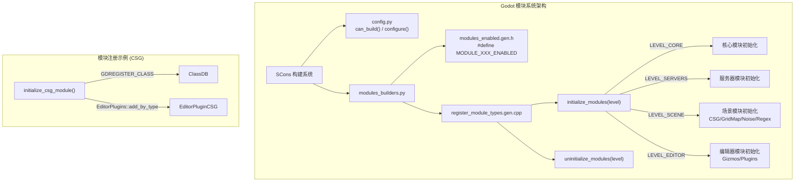

# Godot 可选功能模块 (Optional Modules) 深度分析

> **核心对比结论**：Godot 用编译期 `config.py` + `register_types` 的静态模块体系实现了 UE `.uplugin` 动态插件系统的等价功能，以更小的二进制体积和零运行时开销换取了热插拔灵活性。

---

## 目录

- [第 1 章：模块概览 — "UE 程序员 30 秒速览"](#第-1-章模块概览--ue-程序员-30-秒速览)
- [第 2 章：架构对比 — "同一个问题，两种解法"](#第-2-章架构对比--同一个问题两种解法)
- [第 3 章：核心实现对比 — "代码层面的差异"](#第-3-章核心实现对比--代码层面的差异)
- [第 4 章：UE → Godot 迁移指南](#第-4-章ue--godot-迁移指南)
- [第 5 章：性能对比](#第-5-章性能对比)
- [第 6 章：总结 — "一句话记住"](#第-6-章总结--一句话记住)

---

## 第 1 章：模块概览 — "UE 程序员 30 秒速览"

### 一句话说明

Godot 的 `modules/` 目录是引擎的**可选功能扩展层**，包含 CSG 构造实体几何、GridMap 3D 网格地图、Noise 程序化噪声、Regex 正则表达式、图像编解码器（ASTC/BC/ETC/BasisU）、C# 脚本支持等 50+ 个模块。它对应 UE 的 **Plugin / Feature Pack / Engine Module** 体系，但采用编译期静态链接而非运行时动态加载。

### 核心类/结构体列表

| # | Godot 类 | 源码位置 | 功能 | UE 对应物 |
|---|---------|---------|------|----------|
| 1 | `CSGShape3D` | `modules/csg/csg_shape.h` | CSG 基类，支持 Union/Intersection/Subtraction | `ABrush` (Engine/Classes/Engine/Brush.h) |
| 2 | `CSGBox3D` / `CSGSphere3D` / `CSGCylinder3D` | `modules/csg/csg_shape.h` | CSG 基本体 | `UBrushBuilder` 子类 |
| 3 | `CSGPolygon3D` | `modules/csg/csg_shape.h` | 多边形拉伸/旋转/路径跟随 CSG | ProBuilder Extrude / UE Geometry Script |
| 4 | `CSGBrush` | `modules/csg/csg.h` | CSG 运算的中间数据结构（三角面集合） | `UModel` (Engine/Public/Model.h) |
| 5 | `CSGCombiner3D` | `modules/csg/csg_shape.h` | CSG 组合节点（空容器） | BSP Level Geometry |
| 6 | `GridMap` | `modules/gridmap/grid_map.h` | 3D 网格地图，基于 MeshLibrary | UE 无直接等价，近似 `AInstancedFoliageActor` + 自定义 Grid |
| 7 | `Noise` | `modules/noise/noise.h` | 噪声生成抽象基类 | `UNiagaraDataInterfaceSimpleCounter` / 蓝图噪声库 |
| 8 | `FastNoiseLite` | `modules/noise/fastnoise_lite.h` | 具体噪声实现（Simplex/Perlin/Cellular/Value） | 无内置等价，需第三方插件 |
| 9 | `NoiseTexture2D` / `NoiseTexture3D` | `modules/noise/noise_texture_2d.h` | 噪声纹理资源 | Material Editor Noise 节点 |
| 10 | `RegEx` / `RegExMatch` | `modules/regex/regex.h` | PCRE2 正则表达式封装 | `FRegexPattern` / `FRegexMatcher` (Core/Misc) |
| 11 | `GDMono` | `modules/mono/mono_gd/gd_mono.h` | .NET/C# 运行时集成 | 无官方等价（社区 UnrealCLR） |
| 12 | `MeshLibrary` | `scene/resources/3d/mesh_library.h` | GridMap 使用的网格资源库 | `UStaticMesh` 集合 / Data Table |

### Godot vs UE 概念速查表

| 概念 | Godot | UE |
|------|-------|-----|
| 可选模块定义 | `modules/<name>/config.py` | `.uplugin` JSON 描述文件 |
| 模块注册入口 | `register_types.cpp` 中的 `initialize_xxx_module()` | `IModuleInterface::StartupModule()` |
| 模块启用/禁用 | SCons 编译参数 `module_xxx_enabled=no` | 编辑器 Plugin 面板勾选 |
| CSG 布尔运算 | `CSGShape3D` 节点树（Union/Intersection/Subtraction） | `ABrush` + `ECsgOper`（Add/Subtract/Intersect） |
| 3D 网格地图 | `GridMap` + `MeshLibrary` | 无内置，需自定义或 Voxel Plugin |
| 程序化噪声 | `FastNoiseLite` 资源 + `NoiseTexture2D` | Material Editor Noise 节点 / Niagara |
| 正则表达式 | `RegEx` 类（PCRE2） | `FRegexPattern` + `FRegexMatcher`（ICU） |
| C# 脚本 | `modules/mono`（.NET 8 CoreCLR） | 无官方支持（社区 UnrealCLR） |
| 图像压缩 | `modules/astcenc`, `modules/betsy`, `modules/etcpak` 等 | `ITextureCompressorModule` 接口 |
| 模块初始化级别 | `MODULE_INITIALIZATION_LEVEL_CORE/SERVERS/SCENE/EDITOR` | `ELoadingPhase`（PreDefault/Default/PostDefault） |

---

## 第 2 章：架构对比 — "同一个问题，两种解法"

### 2.1 Godot 模块系统架构

Godot 的模块系统是一个**编译期静态链接**的架构。每个模块是 `modules/` 下的一个目录，包含以下约定文件：

```
modules/<module_name>/
├── config.py              # 模块配置（can_build, configure, get_doc_classes）
├── SCsub                  # SCons 构建脚本
├── register_types.h       # 注册函数声明
├── register_types.cpp     # 注册函数实现（initialize_xxx_module / uninitialize_xxx_module）
├── *.h / *.cpp            # 模块源码
├── doc_classes/           # XML 文档
└── editor/                # 编辑器扩展（可选）
```

构建系统在编译时扫描所有模块目录，通过 `modules_builders.py` 自动生成：
- `modules_enabled.gen.h`：包含 `#define MODULE_XXX_ENABLED` 宏
- `register_module_types.gen.cpp`：自动调用所有模块的 `initialize_xxx_module()` 和 `uninitialize_xxx_module()`



### 2.2 UE 插件系统架构

UE 的插件系统是一个**运行时动态加载**的架构。每个插件由 `.uplugin` JSON 文件描述，包含模块列表、依赖关系、加载阶段等元数据：

```json
{
    "FileVersion": 3,
    "FriendlyName": "MyPlugin",
    "Modules": [
        {
            "Name": "MyPluginRuntime",
            "Type": "Runtime",
            "LoadingPhase": "Default"
        },
        {
            "Name": "MyPluginEditor",
            "Type": "Editor",
            "LoadingPhase": "PostEngineInit"
        }
    ]
}
```

每个 UE 模块实现 `IModuleInterface`，通过 `IMPLEMENT_MODULE` 宏注册，由 `FModuleManager` 在运行时动态加载 DLL。

### 2.3 关键架构差异分析

#### 差异 1：静态编译 vs 动态加载 — 设计哲学差异

Godot 的模块系统采用**编译期决定**的策略。`config.py` 中的 `can_build()` 函数在 SCons 构建阶段就决定了模块是否参与编译。例如 CSG 模块的 `can_build()` 检查 `env["disable_3d"]`，如果禁用了 3D 则整个模块不编译。这意味着最终二进制中只包含实际需要的功能，没有任何运行时开销。

```python
# modules/csg/config.py
def can_build(env, platform):
    return not env["disable_3d"]
```

UE 则采用**运行时动态加载**。`FModuleManager::LoadModule()` 在引擎启动时根据 `.uplugin` 配置加载 DLL，支持热插拔和编辑器内启用/禁用。这带来了极大的灵活性——开发者可以在不重新编译引擎的情况下添加或移除功能，但代价是每个插件都有 DLL 加载开销和符号解析成本。

**Trade-off**：Godot 的方式更适合嵌入式和移动平台（二进制体积小、启动快），UE 的方式更适合大型团队协作（模块独立编译、热加载）。Godot 要禁用一个模块必须重新编译引擎，而 UE 只需在编辑器中取消勾选。

#### 差异 2：扁平模块 vs 层级插件 — 继承体系差异

Godot 的模块系统是**完全扁平**的。所有模块都在 `modules/` 目录下平级排列，没有子模块或依赖声明的概念（虽然 `config.py` 中可以通过 `env.module_add_dependencies()` 声明依赖，如 mono 模块依赖 regex）。每个模块直接向 `ClassDB` 注册类，与引擎核心代码使用完全相同的 API。

```python
# modules/mono/config.py
def can_build(env, platform):
    if env.editor_build:
        env.module_add_dependencies("mono", ["regex"])
    return True
```

UE 的插件系统则是**层级化**的。一个 `.uplugin` 可以包含多个 Module（Runtime/Editor/Developer），每个 Module 有独立的 `Build.cs` 声明依赖关系。插件之间可以声明依赖，形成复杂的依赖图。UE 还区分 Engine Plugin 和 Project Plugin，前者随引擎分发，后者随项目分发。

**Trade-off**：Godot 的扁平结构简单直观，新增模块只需创建目录和几个约定文件；UE 的层级结构更适合管理大型插件生态，但学习曲线更陡。

#### 差异 3：函数指针注入 vs 接口继承 — 模块耦合方式差异

Godot 模块与引擎核心的耦合方式非常独特。以图像压缩模块为例，核心 `Image` 类预留了**函数指针槽位**，模块在初始化时将自己的实现注入：

```cpp
// modules/astcenc/register_types.cpp
void initialize_astcenc_module(ModuleInitializationLevel p_level) {
    if (p_level != MODULE_INITIALIZATION_LEVEL_SCENE) return;
#ifdef TOOLS_ENABLED
    Image::_image_compress_astc_func = _compress_astc;  // 函数指针注入
#endif
    Image::_image_decompress_astc = _decompress_astc;
}
```

这种"函数指针注入"模式让核心代码无需知道具体模块的存在，只需检查函数指针是否为空。而 CSG、GridMap 等节点类型模块则通过 `GDREGISTER_CLASS` 向 `ClassDB` 注册，利用 Godot 的反射系统实现解耦。

UE 则使用标准的**接口继承**模式。例如纹理压缩通过 `ITextureCompressorModule` 接口实现，模块实现该接口并通过 `FModuleManager` 注册。这是更传统的 OOP 方式，类型安全性更好，但需要更多的样板代码。

**Trade-off**：Godot 的函数指针注入极其轻量（零虚函数开销），但缺乏类型安全和 IDE 导航支持；UE 的接口继承更规范，但每个扩展点都需要定义接口类。

---

## 第 3 章：核心实现对比 — "代码层面的差异"

### 3.1 CSG 构造实体几何 vs UE BSP/Brush

#### Godot 怎么做的

Godot 的 CSG 系统基于**场景树节点**实现。`CSGShape3D` 继承自 `GeometryInstance3D`，是所有 CSG 形状的基类。核心数据结构是 `CSGBrush`，它存储三角面集合：

```cpp
// modules/csg/csg.h
struct CSGBrush {
    struct Face {
        Vector3 vertices[3];   // 三角形三个顶点
        Vector2 uvs[3];        // UV 坐标
        AABB aabb;             // 面的包围盒
        bool smooth = false;   // 是否平滑着色
        bool invert = false;   // 是否反转法线
        int material = 0;      // 材质索引
    };
    Vector<Face> faces;
    Vector<Ref<Material>> materials;
};
```

CSG 运算通过节点树的父子关系定义。每个 `CSGShape3D` 节点有一个 `Operation` 枚举（Union/Intersection/Subtraction），子节点对父节点执行对应的布尔运算。`CSGCombiner3D` 是一个空容器节点，用于组织 CSG 树。

关键实现特点：
- **惰性更新**：通过 `dirty` 标志位延迟重建，只在需要渲染时才执行 CSG 运算
- **MikkTSpace 切线计算**：使用标准的 MikkTSpace 库计算切线空间，确保法线贴图正确
- **碰撞支持**：可选生成 `ConcavePolygonShape3D` 碰撞体
- **导航网格支持**：通过 `navmesh_parse_source_geometry` 回调支持导航网格烘焙
- **Bake 功能**：`bake_static_mesh()` 可将 CSG 结果烘焙为静态网格

```cpp
// modules/csg/csg_shape.h - CSG 操作枚举
enum Operation {
    OPERATION_UNION,         // 并集
    OPERATION_INTERSECTION,  // 交集
    OPERATION_SUBTRACTION,   // 差集
};
```

具体形状类（`CSGBox3D`、`CSGSphere3D`、`CSGCylinder3D`、`CSGTorus3D`、`CSGPolygon3D`）都继承自 `CSGPrimitive3D`，各自实现 `_build_brush()` 虚函数来生成初始几何体。`CSGPolygon3D` 特别强大，支持三种模式：深度拉伸（MODE_DEPTH）、旋转（MODE_SPIN）、路径跟随（MODE_PATH）。

#### UE 怎么做的

UE 的 BSP/Brush 系统是引擎最古老的部分之一。`ABrush` 继承自 `AActor`，使用 `UModel` 存储 BSP 树数据：

```cpp
// Engine/Source/Runtime/Engine/Classes/Engine/Brush.h
class ENGINE_API ABrush : public AActor {
    UPROPERTY(EditAnywhere, Category=Brush)
    TEnumAsByte<enum EBrushType> BrushType;  // Additive / Subtractive
    
    UPROPERTY(Instanced)
    class UModel* Brush;  // BSP 模型数据
    
    UPROPERTY()
    class UBrushComponent* BrushComponent;
};

enum ECsgOper {
    CSG_Active, CSG_Add, CSG_Subtract, CSG_Intersect, CSG_Deintersect, CSG_None
};
```

UE 的 BSP 系统是**关卡级别**的——所有 Brush 的布尔运算结果存储在 `ULevel` 的 `UModel` 中，需要手动触发 "Build Geometry" 来重建。这与 Godot 的节点级实时计算形成鲜明对比。

值得注意的是，UE 的 BSP 系统在现代开发中已基本被弃用，取而代之的是 **Modeling Tools Editor Mode**（UE5）和 **ProBuilder**（通过 Marketplace）。UE5 的 Geometry Script 提供了更现代的程序化几何生成能力。

#### 差异点评

| 维度 | Godot CSG | UE BSP/Brush |
|------|-----------|-------------|
| 运算粒度 | 节点级，实时计算 | 关卡级，需手动 Build |
| 数据结构 | 三角面列表（CSGBrush） | BSP 树（UModel） |
| 运行时可用 | ✅ 可在游戏中动态使用 | ❌ 仅编辑器工具 |
| 性能 | 中等（每帧可能重算） | 高（预计算，但 Build 慢） |
| 现代替代 | 无需替代，CSG 仍是主力 | Modeling Tools / Geometry Script |

Godot 的 CSG 更适合**原型设计和小型项目**，因为它是实时的、可在运行时使用的。UE 的 BSP 虽然已过时，但其"预计算"思路在大型场景中仍有性能优势。

### 3.2 GridMap vs UE 网格地图方案

#### Godot 怎么做的

`GridMap` 是 Godot 独有的 3D 网格地图系统，类似于 2D 的 `TileMap` 但扩展到三维空间。它继承自 `Node3D`，使用 `MeshLibrary` 资源定义可放置的网格项。

核心数据结构设计非常精巧：

```cpp
// modules/gridmap/grid_map.h
union IndexKey {
    struct {
        int16_t x;  // 网格坐标，范围 -32768 ~ 32767
        int16_t y;
        int16_t z;
    };
    uint64_t key = 0;  // 用于哈希查找
};

union Cell {
    struct {
        unsigned int item : 16;   // 网格项 ID（最多 65536 种）
        unsigned int rot : 5;     // 旋转索引（24 种正交旋转）
        unsigned int layer : 8;   // 层级
    };
    uint32_t cell = 0;
};
```

GridMap 使用**八叉树分区**（Octant）来管理渲染和物理。每个 Octant 包含一组 Cell，使用 `MultiMesh` 实例化渲染来批量绘制相同类型的网格：

```cpp
struct Octant {
    struct MultimeshInstance {
        RID instance;
        RID multimesh;
        struct Item {
            int index = 0;
            Transform3D transform;
            IndexKey key;
        };
        Vector<Item> items;
    };
    Vector<MultimeshInstance> multimesh_instances;
    HashSet<IndexKey> cells;
    RID static_body;  // 物理碰撞体
    HashMap<IndexKey, NavigationCell> navigation_cell_ids;  // 导航网格
};
```

关键设计决策：
- **IndexKey 使用 int16_t**：每个轴最多 ±32767 个格子，对于大多数游戏足够
- **Cell 使用位域压缩**：一个 Cell 只占 4 字节
- **Octant 批量管理**：`octant_size` 默认为 8，即 8×8×8 的格子组成一个 Octant
- **MultiMesh 实例化**：相同网格项在同一 Octant 内使用 MultiMesh 批量渲染

#### UE 怎么做的

UE 没有内置的 GridMap 等价物。最接近的方案是：

1. **Instanced Static Mesh Component (ISM/HISM)**：手动管理网格实例，需要自己实现网格逻辑
2. **Data Table + 自定义 Actor**：用数据表存储网格配置，运行时生成
3. **Voxel Plugin**（社区）：如 VoxelPlugin 提供类似功能
4. **PCG (Procedural Content Generation)**：UE5 的 PCG 框架可以实现类似效果

#### 差异点评

GridMap 是 Godot 的**独特优势**之一。它提供了开箱即用的 3D 网格地图编辑体验，包括编辑器工具、碰撞生成、导航网格烘焙。在 UE 中实现同等功能需要大量自定义代码或第三方插件。

| 维度 | Godot GridMap | UE 等价方案 |
|------|-------------|------------|
| 开箱即用 | ✅ 内置编辑器支持 | ❌ 需自定义或第三方 |
| 渲染优化 | MultiMesh 自动批处理 | HISM 手动管理 |
| 内存效率 | 4 字节/Cell + Octant 分区 | 取决于实现 |
| 编辑器体验 | 专用 GridMap 编辑器插件 | 无标准工具 |
| 大规模场景 | 受 int16 坐标限制 | 无固有限制 |

### 3.3 Noise 程序化噪声 vs UE 噪声方案

#### Godot 怎么做的

Godot 的噪声模块采用**抽象基类 + 具体实现**的经典设计。`Noise` 是抽象基类（继承自 `Resource`），定义了噪声采样的纯虚接口：

```cpp
// modules/noise/noise.h
class Noise : public Resource {
    GDCLASS(Noise, Resource);
public:
    virtual real_t get_noise_1d(real_t p_x) const = 0;
    virtual real_t get_noise_2dv(Vector2 p_v) const = 0;
    virtual real_t get_noise_2d(real_t p_x, real_t p_y) const = 0;
    virtual real_t get_noise_3dv(Vector3 p_v) const = 0;
    virtual real_t get_noise_3d(real_t p_x, real_t p_y, real_t p_z) const = 0;
    
    virtual Ref<Image> get_image(...) const;
    virtual Ref<Image> get_seamless_image(...) const;
};
```

`FastNoiseLite` 是唯一的内置实现，封装了第三方 FastNoiseLite 库，支持丰富的噪声类型：

```cpp
// modules/noise/fastnoise_lite.h
class FastNoiseLite : public Noise {
    enum NoiseType {
        TYPE_SIMPLEX,          // OpenSimplex2
        TYPE_SIMPLEX_SMOOTH,   // OpenSimplex2S
        TYPE_CELLULAR,         // Voronoi/Worley
        TYPE_PERLIN,           // 经典 Perlin
        TYPE_VALUE_CUBIC,      // 值噪声（三次插值）
        TYPE_VALUE,            // 值噪声（线性插值）
    };
    
    enum FractalType {
        FRACTAL_NONE, FRACTAL_FBM, FRACTAL_RIDGED, FRACTAL_PING_PONG,
    };
    
    // Domain Warp 支持
    bool domain_warp_enabled = false;
    DomainWarpType domain_warp_type;
    real_t domain_warp_amplitude = 30.0;
};
```

`NoiseTexture2D` 和 `NoiseTexture3D` 将噪声采样结果转化为纹理资源，支持：
- **异步生成**：使用独立线程生成噪声纹理，不阻塞主线程
- **无缝纹理**：`get_seamless_image()` 通过象限交换和边缘混合生成可平铺纹理
- **法线贴图**：可直接从噪声生成法线贴图
- **Gradient 调色**：支持 Gradient 资源对噪声进行颜色映射

```cpp
// modules/noise/noise_texture_2d.h
class NoiseTexture2D : public Texture2D {
    Thread noise_thread;          // 异步生成线程
    bool seamless = false;        // 无缝模式
    bool as_normal_map = false;   // 法线贴图模式
    Ref<Gradient> color_ramp;     // 颜色渐变
    Ref<Noise> noise;             // 噪声源
};
```

#### UE 怎么做的

UE 没有独立的噪声模块，噪声功能分散在多个系统中：

1. **Material Editor**：`Noise` 材质节点提供 Perlin/Simplex/Gradient 等噪声，但仅在 GPU Shader 中运行
2. **Niagara**：粒子系统中有噪声模块，用于粒子运动扰动
3. **Landscape**：地形编辑器内置噪声笔刷
4. **Blueprint Math Library**：`FMath::PerlinNoise1D/2D/3D` 提供基础 Perlin 噪声

UE 的噪声主要是**GPU 端**的（材质节点），而 Godot 的噪声是**CPU 端**的（Resource 对象）。

#### 差异点评

| 维度 | Godot Noise | UE 噪声方案 |
|------|------------|------------|
| 统一 API | ✅ `Noise` 抽象基类 | ❌ 分散在多个系统 |
| CPU 噪声 | ✅ FastNoiseLite 全功能 | ⚠️ 仅基础 Perlin |
| GPU 噪声 | ❌ 需手动 Shader | ✅ 材质节点丰富 |
| 纹理生成 | ✅ NoiseTexture2D/3D | ❌ 需自定义 |
| 无缝平铺 | ✅ 内置支持 | ❌ 需手动实现 |
| Domain Warp | ✅ 内置支持 | ❌ 需自定义 |

Godot 在 CPU 端噪声方面明显优于 UE，提供了完整的噪声生成管线。但 UE 在 GPU 端噪声（材质节点）方面更强大。

### 3.4 模块注册机制：config.py + register_types vs UE .uplugin

#### Godot 怎么做的

Godot 的模块注册是一个**两阶段**过程：

**阶段 1：编译期（config.py + SCons）**

```python
# modules/csg/config.py
def can_build(env, platform):
    return not env["disable_3d"]  # 编译条件

def configure(env):
    pass  # 环境配置

def get_doc_classes():
    return ["CSGBox3D", "CSGCombiner3D", ...]  # 文档类列表

def get_doc_path():
    return "doc_classes"
```

`modules_builders.py` 在编译时自动生成注册代码：

```python
# modules/modules_builders.py
def register_module_types_builder(target, source, env):
    # 自动生成 initialize/uninitialize 调用
    mod_init = "\n".join([
        f"#ifdef MODULE_{key.upper()}_ENABLED\n"
        f"\tinitialize_{key}_module(p_level);\n"
        f"#endif"
        for key in modules.keys()
    ])
```

**阶段 2：运行时（register_types.cpp）**

每个模块实现 `initialize_xxx_module()` 函数，在对应的初始化级别注册类和功能：

```cpp
// modules/csg/register_types.cpp
void initialize_csg_module(ModuleInitializationLevel p_level) {
    if (p_level == MODULE_INITIALIZATION_LEVEL_SCENE) {
        GDREGISTER_ABSTRACT_CLASS(CSGShape3D);
        GDREGISTER_CLASS(CSGBox3D);
        // ...
    }
#ifdef TOOLS_ENABLED
    if (p_level == MODULE_INITIALIZATION_LEVEL_EDITOR) {
        EditorPlugins::add_by_type<EditorPluginCSG>();
    }
#endif
}
```

初始化级别的设计确保了正确的依赖顺序：
- `MODULE_INITIALIZATION_LEVEL_CORE`：核心类型（最先）
- `MODULE_INITIALIZATION_LEVEL_SERVERS`：服务器（渲染、物理等）
- `MODULE_INITIALIZATION_LEVEL_SCENE`：场景节点和资源（大多数模块在此注册）
- `MODULE_INITIALIZATION_LEVEL_EDITOR`：编辑器插件（最后）

#### UE 怎么做的

UE 的插件注册通过 `.uplugin` JSON + `IModuleInterface` 实现：

```cpp
// UE 模块接口
class IModuleInterface {
public:
    virtual void StartupModule() {}
    virtual void ShutdownModule() {}
    virtual bool IsGameModule() const { return false; }
};

// 模块实现
class FMyPluginModule : public IModuleInterface {
    virtual void StartupModule() override {
        // 注册类、工厂、委托等
    }
};
IMPLEMENT_MODULE(FMyPluginModule, MyPlugin)
```

`.uplugin` 文件声明模块的加载阶段（`LoadingPhase`）和类型（Runtime/Editor/Developer）。

#### 差异点评

| 维度 | Godot config.py + register_types | UE .uplugin + IModuleInterface |
|------|--------------------------------|-------------------------------|
| 配置格式 | Python 脚本（可执行逻辑） | JSON（纯声明式） |
| 条件编译 | `can_build()` 返回 bool | `WhitelistPlatforms` / `BlacklistPlatforms` |
| 依赖声明 | `module_add_dependencies()` | `Build.cs` 中 `PublicDependencyModuleNames` |
| 热加载 | ❌ 需重新编译 | ✅ 编辑器内启用/禁用 |
| 代码生成 | ✅ 自动生成注册代码 | ❌ 手动实现 IModuleInterface |
| 学习成本 | 低（约定优于配置） | 中（需理解 UBT/UHT） |

### 3.5 Mono/C# 集成：Godot C# vs UE C# 方案

#### Godot 怎么做的

Godot 的 C# 支持通过 `modules/mono` 实现，是一个**可选的、默认禁用**的模块：

```python
# modules/mono/config.py
def is_enabled():
    return False  # 默认禁用，需 module_mono_enabled=yes
```

`GDMono` 类是 C# 运行时的核心管理器，负责加载 .NET CoreCLR 运行时：

```cpp
// modules/mono/mono_gd/gd_mono.h
class GDMono {
    bool initialized = false;
    bool runtime_initialized = false;
    void *hostfxr_dll_handle = nullptr;   // .NET host 句柄
    void *coreclr_dll_handle = nullptr;   // CoreCLR 句柄
    String project_assembly_path;
    
#ifdef GD_MONO_HOT_RELOAD
    Error reload_project_assemblies();    // 热重载支持
#endif
};
```

Godot 的 C# 集成特点：
- 基于 **.NET 8 CoreCLR**（不再使用 Mono 运行时，但模块名保留为 `mono`）
- 通过 **Source Generator** 自动生成绑定代码（`Godot.SourceGenerators`）
- 支持**热重载**（`GD_MONO_HOT_RELOAD`）
- C# 脚本与 GDScript 脚本可以在同一项目中共存
- 编辑器工具通过 `PluginCallbacks` 回调加载

#### UE 怎么做的

UE 没有官方的 C# 支持。社区方案 **UnrealCLR** 通过 .NET Host 嵌入 CLR 运行时，但：
- 不是官方维护，更新可能滞后
- 不支持 Blueprint 集成
- 性能开销较大（需要频繁的 P/Invoke 调用）

UE 的官方脚本方案是 **C++ + Blueprint**，以及 UE5 引入的 **Verse** 语言（Fortnite 专用）。

#### 差异点评

| 维度 | Godot C# (mono) | UE C# (UnrealCLR) |
|------|-----------------|-------------------|
| 官方支持 | ✅ 官方模块 | ❌ 社区项目 |
| 运行时 | .NET 8 CoreCLR | .NET Core |
| 热重载 | ✅ 支持 | ⚠️ 有限支持 |
| 反射集成 | ✅ Source Generator 自动绑定 | ❌ 手动绑定 |
| 编辑器集成 | ✅ 完整（Inspector/Signal 等） | ⚠️ 有限 |
| 性能 | 接近原生（AOT 编译） | P/Invoke 开销 |

---

## 第 4 章：UE → Godot 迁移指南

### 4.1 思维转换清单

1. **忘掉"插件市场"思维，拥抱"编译模块"思维**
   在 UE 中，你习惯了从 Marketplace 下载 `.uplugin` 然后在编辑器中启用。在 Godot 中，内置模块是编译时决定的——你需要理解 `scons` 构建参数（如 `module_mono_enabled=yes`）。对于第三方扩展，Godot 使用 **GDExtension**（类似 UE 的 GameplayPlugin）或 **AssetLib**（类似 Marketplace）。

2. **忘掉 BSP Brush，拥抱 CSG 节点树**
   UE 的 BSP 是关卡级的、需要手动 Build 的遗留系统。Godot 的 CSG 是节点级的、实时计算的现代系统。你可以在运行时动态创建和修改 CSG 形状，这在 UE 中是不可能的。

3. **忘掉"一切皆 Actor"，拥抱"一切皆 Node"**
   GridMap 在 Godot 中是一个 `Node3D`，不是 Actor。它不需要 Component，因为 Godot 的节点本身就是轻量级的。一个 GridMap 节点同时处理渲染、碰撞和导航，而在 UE 中你需要组合多个 Component。

4. **忘掉 GPU 噪声优先，拥抱 CPU 噪声资源**
   UE 程序员习惯在材质编辑器中使用噪声节点。Godot 的噪声是 CPU 端的 `Resource` 对象，可以在 GDScript/C# 中直接采样。如果需要 GPU 噪声，你需要自己写 Shader。

5. **忘掉 FRegexPattern 的 ICU 语法，拥抱 PCRE2**
   Godot 的 `RegEx` 使用 PCRE2（Perl Compatible Regular Expressions），而 UE 使用 ICU 正则。两者语法大部分兼容，但在 Unicode 属性匹配和某些高级特性上有差异。

6. **忘掉 Build.cs 依赖声明，拥抱 config.py 约定**
   Godot 模块的依赖关系通过 `config.py` 中的 `module_add_dependencies()` 声明，而不是 UE 的 `Build.cs` 中的 `PublicDependencyModuleNames`。Godot 的方式更简洁但功能也更有限。

### 4.2 API 映射表

| UE API | Godot 等价 API | 说明 |
|--------|---------------|------|
| `ABrush` + `ECsgOper::CSG_Add` | `CSGBox3D.set_operation(OPERATION_UNION)` | CSG 加法 |
| `ABrush` + `ECsgOper::CSG_Subtract` | `CSGBox3D.set_operation(OPERATION_SUBTRACTION)` | CSG 减法 |
| `UBrushBuilder` | `CSGPrimitive3D._build_brush()` | 构建几何体 |
| `UModel` | `CSGBrush` | CSG 中间数据 |
| `FModuleManager::LoadModule()` | 自动（编译时链接） | 模块加载 |
| `IModuleInterface::StartupModule()` | `initialize_xxx_module(level)` | 模块初始化 |
| `FRegexPattern::Create()` | `RegEx.create_from_string(pattern)` | 创建正则 |
| `FRegexMatcher::FindNext()` | `RegEx.search(subject)` | 正则搜索 |
| `FRegexMatcher::GetCaptureGroup()` | `RegExMatch.get_string(group)` | 获取捕获组 |
| `FMath::PerlinNoise3D()` | `FastNoiseLite.get_noise_3d(x,y,z)` | 3D 噪声采样 |
| `UInstancedStaticMeshComponent` | `GridMap` | 网格实例化 |
| `HISM::AddInstance()` | `GridMap.set_cell_item(pos, item, rot)` | 添加网格实例 |
| `UTexture2D` (程序化) | `NoiseTexture2D` | 噪声纹理 |
| Plugin `.uplugin` | `modules/<name>/config.py` | 模块描述 |

### 4.3 陷阱与误区

#### 陷阱 1：CSG 不是用来做最终关卡的

UE 程序员可能会把 CSG 当作 BSP 的替代品来构建整个关卡。但 Godot 的 CSG 是**实时计算**的，每次形状变化都会重新执行布尔运算。对于复杂场景，这会导致严重的性能问题。正确做法是：用 CSG 做原型设计，然后通过 `bake_static_mesh()` 烘焙为静态网格。

```gdscript
# 正确：原型完成后烘焙
var mesh = $CSGCombiner3D.bake_static_mesh()
var mesh_instance = MeshInstance3D.new()
mesh_instance.mesh = mesh
add_child(mesh_instance)
```

#### 陷阱 2：GridMap 的坐标限制

GridMap 使用 `int16_t` 存储坐标，每个轴最大 ±32767。如果你习惯了 UE 的大世界坐标系统（World Partition），可能会不小心超出范围。对于大型世界，考虑使用多个 GridMap 或自定义方案。

#### 陷阱 3：模块禁用需要重新编译

在 UE 中，禁用一个插件只需在编辑器中取消勾选。但在 Godot 中，禁用一个内置模块需要重新编译引擎（`scons module_csg_enabled=no`）。如果你使用的是官方预编译版本，所有默认模块都已启用，无法单独禁用。

#### 陷阱 4：Noise 是 CPU 端的

UE 程序员习惯噪声在 GPU 上运行（材质节点）。Godot 的 `FastNoiseLite` 完全在 CPU 上运行。如果你需要在 Shader 中使用噪声，不能直接引用 `FastNoiseLite`，而需要：
- 预生成 `NoiseTexture2D` 然后在 Shader 中采样
- 或者在 Shader 中自己实现噪声算法

### 4.4 最佳实践

1. **CSG 工作流**：使用 CSG 快速原型 → 调整满意后 `bake_static_mesh()` → 替换为 MeshInstance3D
2. **GridMap 优化**：合理设置 `octant_size`（默认 8），较大的值减少 draw call 但增加更新开销
3. **Noise 纹理缓存**：`NoiseTexture2D` 会异步生成，首次访问可能返回空图像。使用 `await` 等待生成完成
4. **模块依赖**：如果你的 GDExtension 依赖某个模块（如 regex），确保目标平台的 Godot 构建包含该模块
5. **C# 开发**：使用 Godot 官方的 .NET 构建版本，不要尝试在标准版本中启用 C#

---

## 第 5 章：性能对比

### 5.1 CSG 性能特征

**Godot CSG 性能瓶颈**：
- CSG 布尔运算是 **O(n²)** 复杂度（n 为三角面数），每次形状变化都会触发完整重算
- 复杂 CSG 树（10+ 节点）在编辑器中可能导致明显卡顿
- `CSGPolygon3D` 的 PATH 模式需要沿路径采样，路径越复杂开销越大
- MikkTSpace 切线计算是额外开销

**与 UE BSP 对比**：
- UE BSP 是预计算的，运行时零开销；Godot CSG 是实时的，运行时有持续开销
- UE BSP Build 可能需要数分钟（大型关卡），Godot CSG 通常在毫秒级完成（小型场景）
- Godot CSG 适合 < 100 面的简单形状组合；UE BSP 理论上无面数限制（但已不推荐使用）

**优化建议**：
- 将不再变化的 CSG 烘焙为静态网格
- 避免深层嵌套的 CSG 树
- 使用 `CSGCombiner3D` 限制重算范围（只有同一 Combiner 下的子节点参与运算）

### 5.2 GridMap 性能特征

**Godot GridMap 性能瓶颈**：
- Octant 更新时需要重建 MultiMesh，大量修改时可能卡顿
- 碰撞体使用 `StaticBody`，大量格子的碰撞检测开销较大
- 导航网格烘焙是全量重建，不支持增量更新

**与 UE HISM 对比**：
- GridMap 的 MultiMesh 批处理类似 UE 的 HISM，但 GridMap 自动管理实例分组
- UE 的 HISM 支持 LOD 和 Nanite，GridMap 不支持
- GridMap 的内存效率更高（4 字节/Cell vs UE 的 FTransform 48 字节/Instance）
- UE 的 ISM/HISM 支持数百万实例（Nanite），GridMap 在数万实例时可能出现性能问题

**优化建议**：
- 调整 `octant_size` 平衡 draw call 和更新开销
- 对于静态场景，使用 `make_baked_meshes()` 烘焙为静态网格
- 避免每帧大量修改 Cell

### 5.3 Noise 性能特征

**Godot Noise 性能瓶颈**：
- CPU 端噪声采样，大量采样时可能成为瓶颈
- `NoiseTexture2D` 的异步生成使用单独线程，但生成大纹理（2048+）仍需数百毫秒
- 无缝纹理生成需要额外 10% 的过采样和混合计算

**与 UE 噪声对比**：
- UE 的材质噪声在 GPU 上运行，采样速度快数个数量级
- Godot 的 CPU 噪声更灵活（可在任意代码中使用），但不适合实时大量采样
- FastNoiseLite 库本身性能优秀（SIMD 优化），单次采样约 10-50ns

**优化建议**：
- 预生成噪声纹理而非实时采样
- 对于地形生成等大量采样场景，考虑使用 GDExtension 编写 C++ 采样代码
- 利用 `NoiseTexture2D` 的异步生成避免阻塞主线程

### 5.4 模块系统性能影响

| 维度 | Godot 模块 | UE 插件 |
|------|-----------|---------|
| 启动时间 | 零额外开销（静态链接） | DLL 加载 + 符号解析 |
| 内存占用 | 仅包含启用的模块代码 | 所有启用插件的 DLL 常驻内存 |
| 运行时开销 | 零（编译时决定） | 模块管理器维护开销 |
| 二进制体积 | 可精确裁剪 | 每个插件独立 DLL |
| 编译时间 | 全量编译（模块变化时） | 增量编译（仅变化的模块） |

---

## 第 6 章：总结 — "一句话记住"

### 核心差异

**Godot 的可选模块是"编译时的乐高积木"，UE 的插件是"运行时的热插拔组件"。** 前者追求极致的轻量和零开销，后者追求最大的灵活性和生态扩展性。

### 设计亮点（Godot 做得比 UE 好的地方）

1. **CSG 运行时可用**：Godot 的 CSG 可以在游戏运行时动态创建和修改，这在 UE 中需要复杂的 Geometry Script 或 Runtime Mesh Component 才能实现。

2. **GridMap 开箱即用**：3D 网格地图是 Godot 的独特优势，提供了完整的编辑器工具链。UE 至今没有等价的内置功能。

3. **噪声系统统一且完整**：`Noise` 抽象基类 + `FastNoiseLite` + `NoiseTexture2D/3D` 形成了完整的噪声管线，包括无缝纹理、法线贴图、Domain Warp 等高级功能。UE 的噪声功能分散在材质编辑器、Niagara、蓝图库等多个系统中。

4. **模块系统极简**：创建一个新模块只需 `config.py` + `register_types.cpp` + `SCsub` 三个文件，约 50 行代码。UE 创建一个插件需要 `.uplugin` + `Build.cs` + `IModuleInterface` 实现 + UBT 配置，样板代码量大得多。

5. **C# 官方一等支持**：Godot 的 C# 集成是官方维护的，使用最新的 .NET 8 CoreCLR，支持热重载和 Source Generator 自动绑定。UE 没有官方 C# 支持。

### 设计短板（Godot 不如 UE 的地方）

1. **无运行时热插拔**：模块的启用/禁用需要重新编译引擎，不像 UE 可以在编辑器中随时切换。GDExtension 部分弥补了这一不足，但与 UE 的插件生态相比仍有差距。

2. **CSG 性能天花板低**：实时布尔运算的 O(n²) 复杂度限制了 CSG 在大型场景中的使用。UE 的预计算 BSP 虽然过时，但其"离线计算"思路在性能上更优。

3. **GridMap 缺乏 LOD 和大世界支持**：int16 坐标限制和无 LOD 支持使 GridMap 不适合大型开放世界。UE 的 HISM + Nanite + World Partition 在这方面遥遥领先。

4. **噪声仅限 CPU**：缺乏 GPU 端噪声支持，对于需要实时大量噪声采样的场景（如程序化地形）性能不足。UE 的材质噪声节点在 GPU 上运行，性能高出数个数量级。

5. **模块生态规模差距**：UE Marketplace 有数万个插件，Godot AssetLib 的规模要小得多。虽然这不是技术问题，但对开发者的实际影响很大。

### UE 程序员的学习路径建议

推荐按以下顺序阅读源码：

1. **先读 `modules/register_module_types.h`**（43 行）— 理解模块初始化级别枚举
2. **再读 `modules/modules_builders.py`**（60 行）— 理解自动代码生成机制
3. **然后读 `modules/csg/config.py`**（24 行）+ **`register_types.cpp`**（65 行）— 理解完整的模块注册流程
4. **深入 `modules/csg/csg.h`**（66 行）+ **`csg_shape.h`**（485 行）— 理解 CSG 实现
5. **阅读 `modules/gridmap/grid_map.h`**（330 行）— 理解 GridMap 的 Octant 架构
6. **阅读 `modules/noise/noise.h`**（299 行）+ **`fastnoise_lite.h`**（221 行）— 理解噪声系统设计
7. **最后读 `modules/mono/mono_gd/gd_mono.h`**（181 行）— 理解 C# 集成架构

总学习时间估计：有 UE 经验的程序员约需 **4-6 小时**即可掌握 Godot 模块系统的核心设计。重点关注 Godot 的"约定优于配置"哲学和编译期静态链接策略，这是与 UE 最大的思维差异。
